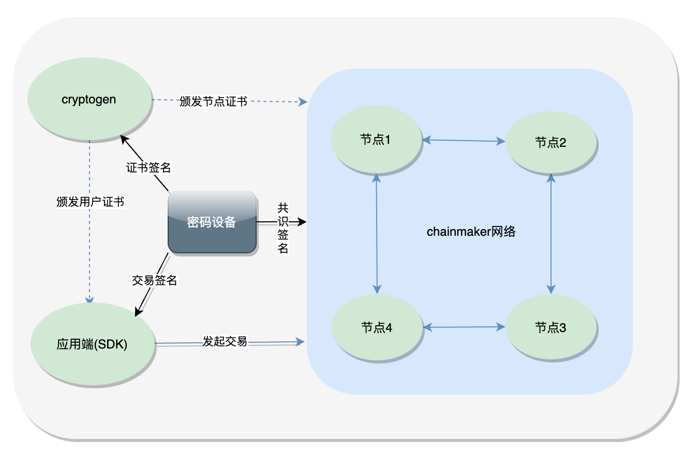
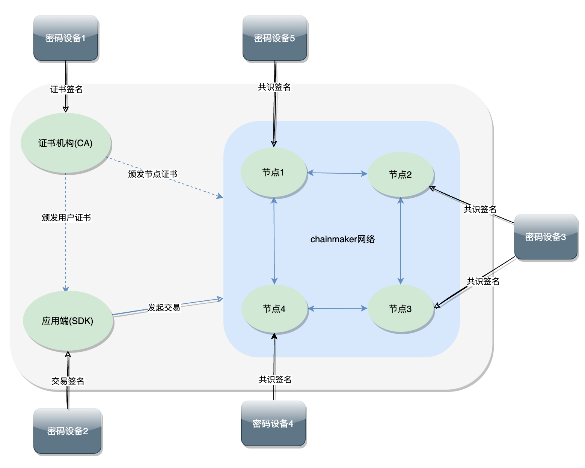

# 硬件加密使用指南

硬件加密设计链接：

[硬件加密设计](../tech/硬件加密.md)

## 功能介绍
1. CA服务根私钥硬件保护
2. 共识签名私钥硬件保护
3. SDK用户签名私钥硬件保护
4. 加密数据库对称密钥硬件保护
5. 支持国际标准算法：RSA、AES和ECDSA
6. 支持国密标准算法：SM2、SM4

## 启用硬件加密
### 配置项
硬件加密相关配置目前有两种配置方式，一种是配置文件方式，另一种是环境变量方式，如果同时配置，则优先使用配置文件设置的配置项。 
注： 硬件加密的开关配置,目前仅支持配置文件配置，需要将enabled设置为true，并设置type为pkcs11或者sdf

### 配置文件方式
在chainmaker-go、sdk-go以及chainmaker-cryptogen的配置文件中，硬件加密相关的开关配置和加密机配置如下：
```yaml
pkcs11:
  enabled: true                                       # set true if enable pkcs11
  type: pkcs11                                        # support pkcs11 and sdf
  library: /usr/local/lib64/libpkcs11.so              # path to the libxxx.so file of hsm
  label: HSM                                          # label for the slot to be used
  password: 12345678                                  # password to logon the HSM
  session_cache_size: 10                              # size of HSM session cache, default 10
  hash: ""                                            # hash algorithm used to compute SKI, not used now
```

注: 当开启硬件加密并且type为sdf时，仅需配library和session_cache_size即可，其他配置默认不生效

### 环境变量方式
首先需要在配置文件中, 打开硬件加密开关配置，如下：
```yaml
pkcs11:
  enabled: true                                       # set true if enable pkcs11
  type: pkcs11                                        # support pkcs11 and sdf
```
然后通过环境变量指定加密机相关的其他配置：
```sh
export HSM_LIB=/usr/local/lib64/libupkcs11.so # path to the libxxx.so file of hsm
export HSM_LABEL="HSM"                        # label for the slot to be used
export HSM_PASSWORD=12345678                  # password to logon the HSM
export HSM_SESSION_CACHE_SIZE=10              #size of HSM session cache, default 10
export HSM_HASH=""                            # hash algorithm used to compute SKI, not used now
```

### 适配器插件配置
由于不同硬件密码机厂商在实现pkcs11和sdf标准上存在着细微差异，引入适配器插件的方式来进行屏蔽，目前长安链适配多家厂商密码机。  

密码机适配器插件接口定义和实现参考：[硬件加密设计](../tech/硬件加密.md)

启用硬件加密后，同时需要设置密码机适配器插件，需要通过HSM_ADAPTER_LIB环境变量指定适配器插件链接库，如下：
```sh
export HSM_ADAPTER_LIB=/usr/local/lib64/hsm_adapter.so
```
如果用户进行了长安链版本升级，从v2.3.0之前版本升级到 >= v2.3.0版本，需要注意以下几点：
1. v2.3.0之前版本仅支持pkcs11配置方式
2. v2.3.0兼容之前版本，如果启用了硬件加密，需要配置选项type字段设置为pkcs11；设置HSM_ADAPTER_LIB环境变量，指定适配器插件链接库。

## 测试网络

### 测试网络部署架构


1. 首先在密码设备创建CA根私钥、sdk用户私钥以及节点共识私钥。
2. 通过chainmaker-cryptogen工具（以下统称cryptogen）的generate命令一键生成测试网络证书。
3. 使用密码机节点私钥和cryptogen生成的节点证书启动chainmaker区块链网络
4. sdk使用密码机用户私钥进行签名，并将交易发送给chainmaker网络
5. chainmaker网络节点使用用户证书对交易进行验签名，并执行交易

### cryptogen启用硬件加密
修改配置文件chainmaker-cryptogen/config/crypto_config_template.yml，增加或修改pkcs11相关配置：
```yaml
crypto_config:
  - domain: chainmaker.org
    host_name: wx-org
    count: 4                # 如果为1，直接使用host_name，否则添加递增编号
    pk_algo: sm2
    ski_hash: sha256
    #pkcs11配置, 
    pkcs11:
      enabled: true                             #启用硬件加密(此处设置为true)
      library: /usr/local/lib64/libpkcs11.so    #密码机pkcs11连接库
      label: HSM                                #密码机slot对应label
      password: 12345678                        #密码机登陆密码
      session_cache_size: 10
      hash: "" 
    # 其他配置（略）
```
新增/修改配置文件chainmaker-cryptogen/config/pkcs11_keys.yml，配置测试网各组织CA根、用户以及节点私钥KeyID，配置如下（以4组织，每个组织1个共识节点为例）：
```yaml
pkcs11_keys:
  - wx-org1.chainmaker.org: #组织1相关密钥KeyId，keyPwd
      ca:
        - 1,123456
      node:
        consensus:
          - 2,123456
        common:
          - 3,123456
      user:
        admin:
          - 4,123456
        client:
          - 5,123456
        light:
          - 6,123456
  - wx-org2.chainmaker.org:
      ca:
        - 7,123456
      node:
        consensus:
          - 8,123456
        common:
          - 9,123456
      user:
        admin:
          - 10,123456
        client:
          - 11,123456 
        light:
          - 12,123456
  - wx-org3.chainmaker.org: #组织2相关密钥keyId，keyPwd
      ca:
        - 13,123456
      node:
        consensus:
          - 14,123456
        common:
          - 15,123456
      user:
        admin:
          - 16,123456
        client:
          - 17,123456
        light:
          - 18,123456
  - wx-org4.chainmaker.org:
      ca:
        - 19,123456
      node:
        consensus:
          - 20,123456
        common:
          - 21,123456
      user:
        admin:
          - 22,123456
        client:
          - 23,123456
        light:
          - 24,123456
```

### 节点启用硬件加密
修改chainmaker节点配置模版chainmaker-go/config/config_tql/chainmaker.tpl，新增/修改pkcs11相关配置：
```yml
node:
  type:              full
  org_id:            {org_id}
  priv_key_file:     ../config/{org_path}/certs/{node_cert_path}.key
  cert_file:         ../config/{org_path}/certs/{node_cert_path}.crt
  signer_cache_size: 1000
  cert_cache_size:   1000
  #pkcs11配置（配置项说明参考cryptogen）
  pkcs11: 
    enabled: true
    type: pkcs11 #支持pkcs11和sdf
    library: /usr/local/lib64/libupkcs11.so     
    label: HSM                                       
    password: 12345678                               
    session_cache_size: 10                     
    hash: ""                                 
```

### 本地启动chainmaker网络
参考 [自拉起服务](../instructions/自拉起服务.html)  
参考 [多机部署](../instructions/多机部署.md)

### sdk启用硬件加密
修改sdk配置文件sdk_config.yaml, 新增/修改pkcs11相关配置如下：
```yml
  nodes:
    - # 节点地址，格式为：IP:端口:连接数
      node_addr: "127.0.0.1:12301"
      conn_cnt: 10
      enable_tls: true
      trust_root_paths:
        - "./testdata/crypto-config/wx-org1.chainmaker.org/ca"
        - "./testdata/crypto-config/wx-org2.chainmaker.org/ca"
      # TLS hostname
      tls_host_name: "chainmaker.org"
  #pkcs11配置（配置说明参考cryptogen）
  pkcs11:
    enabled: true
    type: pkcs11
    library: /usr/local/lib64/libupkcs11.so
    label: HSM
    password: 12345678 
    session_cache_size: 10
    hash: ""
```
sdk测试  
参考 [命令行工具](../dev/命令行工具.md)  
参考 [SDK](../dev/SDK.md)


## 推荐部署架构
### 部署架构图


说明：
1. CA使用单独密码设备
2. 客户端SDK使用单独密码设备
3. 节点使用一台或多台密码设别（根据组织结构和节点部署情况而定）

### 密码设备部署
密码设备服务商提供（详情略）


