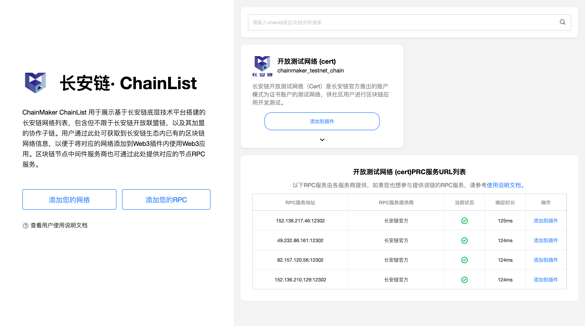
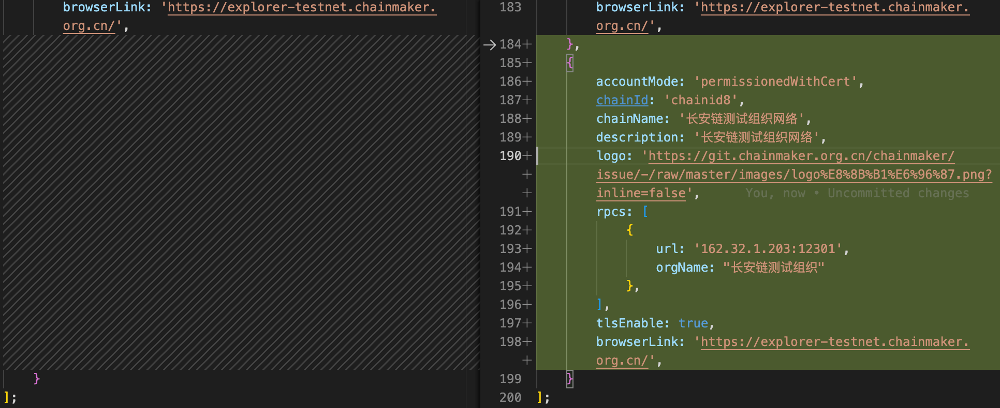
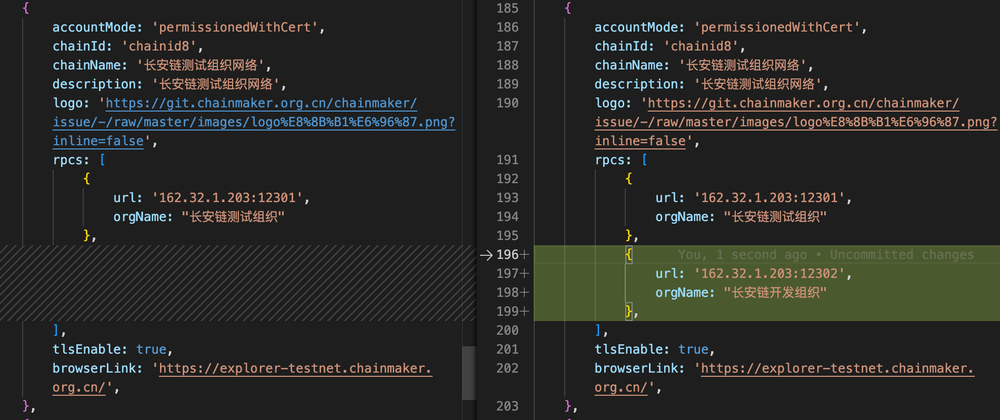

# Chainmaker ChainList 工具
ChainMaker ChainList 是长安链网络的列表，企业可以基于长安链开源的区块链底层技术平台，搭建自己的长安链网络，并申请加入长安链ChainList。用户通过此处可获取到长安链生态内已有的区块链网络信息，以便于将对应的网络添加到Web3插件内使用Web3应用，以及对相应的区块链网络提供区块链中间件服务。

## 产品使用说明

<a href="https://chainlist.chainmaker.org.cn" target="_blank">立即体验chainlist</a>
### 整体说明



- 任意社区用户都可将自己通过长安链底层平台部署的长安链网络，添加到长安链ChainList上。
- 可通过区块链网络名称，或者chainid检索ChainList上已有的网络信息。
- 可将链网络直接添加到长安链Web3插件钱包内进行使用，添加前请先确保已经安装插件，如果未安装，请按照页面指引完成安装。
    - 将链添加进插件后，请在插件内导入该链网络的链账户，之后可通过该链账户签名发起交易上链。
    - 请确保所添加的长安链网络运行正常，网络通畅且所导入的链账户的可用，否则将导入失败。

### 如何把您的长安链网络添加到ChainList

1、 fork [chainmaker-chain-list](https://git.chainmaker.org.cn/chainmakerlab/chainmaker-chain-list) 项目到个人仓库: 

2、 checkout自己的开发分支

3、 在 `/chains.js`文件的`chainlist`数组尾部中添加自己的区块链网络配置

配置规范

```typescript
interface Chain {
  // 区块链网络名称，必填。
  chainName: string;
  // 区块链ID，必填。
  chainId: string;
  //此处用于设置该链的RPC服务信息，可设置多个，至少得设置一个，其中url为节点的RPC服务地址，orgName为提供该RPC服务的企业名称。
  rpcs: Array<{ url: string; orgName: string }>;
  //目前支持permissionedWithCert（证书模式）、public（公钥模式）两种长安链。必填。
  accountMode: 'permissionedWithCert' | 'public';
  //请添加该链的相关介绍描述，方便使用者了解该链，选填。
  description?: string;
  //请填写该链的logo所在的url，选填。
  logo?: string;
  //请填写该链是否开启TLS，如果开启了请填写ture，如果未开启请填写false。不填默认为false。
  tlsEnable?: boolean;
  //如果开启了TLS请填写该链的TLSHostName,默认为chainmaker.org，如果您自建了证书CA服务且修改了该字段，请按照实际情况填写，不填则按默认情况处理。
  hostName?: string;
  //此处用于设置将链填加到长安链Web3插件后，插件和链的通讯方式。长安链默认采用GRPC与链进行通讯，V2.3.0版本的底链支持采用HTTP通讯，如果您的链已开启该配置，可选择HTTP。不填则按默认情况处理。
  protocol?: 'GRPC' | 'HTTP';
  //此处可设置您的链对应的区块链浏览器地址，设置后Web3插件内发起的交易，可直接跳转到区块链浏览器内查看交易详情。选填。
  browserLink?: string;
}
```




4、 提交代码后发起 merge request 合并请求，将个人仓库开发分支合并至 `chainmakerlab/chainmaker-chain-list`的`master`分支


5、 等待merge request 完成后，可前往<a href="https://chainlist.chainmaker.org.cn" target="_blank">长安链ChainList</a>查看


### 如何为已添加进ChainList的链网络添加RPC服务

1、 更正自己fork的chainList项目

```sh

git remote add source https://git.chainmaker.org.cn/chainmakerlab/chainmaker-chain-list
git pull source master

```

2、 checkout自己的开发分支

3、 在 `/chains.js`文件的`chainlist`中找到自己添加的区块链网络， 并在`rpcs` 数组中添加 `rpc服务信息`;
 `rpc服务信息`中需要包含：url（节点的RPC服务地址）与 orgName（为提供该RPC服务的企业名称）




4、 提交代码后发起 merge request 合并请求，将个人仓库开发分支合并至 `chainmakerlab/chainmaker-chain-list`的`master`分支


5、 等待merge request 完成后，可前往<a href="https://chainlist.chainmaker.org.cn" target="_blank">长安链ChainList</a>查看


### 长安链ChainList 区块链网络添加审核说明
长安链网络列表（ChainMaker ChainList）登记项目仅为底层平台使用长安链ChainMaker的项目，不代表社区任何立场。
- 功能层面，添加到网络列表的区块链网络涉及代币、Defi等将不被审核，数字藏品类当前暂缓审核；
- 业务层面，涉嫌非法集资、灰产、黑产等项目将不被审核；
- 您已确保所添加的区块链网络为原创，且不侵犯任何公司或个人知识产权（包括但不限于Logo、商标等）；
- 未通过审核的项目可发送邮件到operation@chainmaker.org进行申诉，邮件标题命名为：【ChainList审核申诉+所登记项目名】，正文说明项目具体信息及申诉原由。

### 其他说明
- 如果已添加进ChainList上的长安链网络，长期无有效的RPC服务，官方将把该长安链网络移出ChainList。
- 所提供的长安链网络运行时，请遵守国家相关法律规定，若出现违规情况，官方将把对应的区块链网络移出ChainList。