# 区块链浏览器

## 版本记录
- **是**：需要使用新的数据库重新订阅，以确保获取最新的数据和功能。
- **否**：不需要更改数据库，现有数据库可以继续使用。

| 版本号   | 修改点                           | 更新数据库 |
|----------|--------------------------------------------|----------------|
| v2.3.6   | - 合约详情页优化：增加交易列表的复杂查询功能，支持在海量数据下进行复杂查询（注意：性能可能较低）。<br> - 交易详情页改进：增加读写集合约名称的展示，提升用户理解；优化跨合约名称的展示，便于查看相关信息。<br> - 节点列表功能增强：支持全量节点的展示，提供更全面的网络节点情况；新增节点与区块的映射查询功能。<br> - EVM合约验证功能：新增EVM合约的验证功能，增强合约安全性。<br>  - 统计功能优化：优化交易数量和事件数量的统计功能，提供更准确的数据反馈。 | 是             |
| v2.3.5   | XXXX   | 否             |


## 概述
区块链浏览器项目致力于提供高效、全面的区块链数据展示与交互能力，支持主链与子链的多链架构需求。通过创新的技术架构设计与功能优化，项目能够精准呈现区块、交易、流转、持仓等多维度数据，并支持多种主流合约解析，包括ERC20、ERC721、DockerGo合约、存证合约、身份认证合约及数据资产合约等，进一步增强用户的交互体验。同时，浏览器还提供链上合约验证与源码查看功能，为区块链开发与透明性提供了强有力的支持。

该浏览器主要由前端、后端及数据库三部分组成。数据库支持mysql， pgsql，人大金仓，clickhouse等，后端使用Go语言开发，前端则基于React框架，确保系统的高效性与可扩展性。


## 安装指南
### 环境依赖
**docker**

`docker`版本为`20.10.7`或以上

```sh
# 以centos7为例，其他安装方式见下方官网
$ sudo yum remove docker docker-client docker-client-latest docker-common docker-latest docker-latest-logrotate docker-logrotate docker-engine
$ sudo yum install -y yum-utils
$ sudo yum-config-manager --add-repo https://download.docker.com/linux/centos/docker-ce.repo
$ sudo yum install docker-ce docker-ce-cli containerd.io docker-compose-plugin
```

`docker-compose`版本为`1.29.2`或以上

```sh
# 以centos7为例，其他安装方式见下方官网
$ sudo curl -L "https://github.com/docker/compose/releases/download/1.29.2/docker-compose-$(uname -s)-$(uname -m)" -o /usr/local/bin/docker-compose
$ sudo chmod +x /usr/local/bin/docker-compose
```


下载地址：
- [https://docs.docker.com/engine/install/](https://docs.docker.com/engine/install/)
- [https://docs.docker.com/compose/install/](https://docs.docker.com/compose/install/)

若已安装，请通过命令查看版本：

```bash
$ docker -v
$ docker-compose -v
```

### 浏览器部署

#### 前置环境

浏览器部署需要依赖一个`ChainMaker`运行环境。具体的`ChainMaker`环境安装部署请参考对应的文档[通过命令行体验链](../quickstart/通过命令行体验链.md)。

#### 代码下载

下载地址： https://git.chainmaker.org.cn/chainmaker/chainmaker-explorer

代码版本：v2.3.6

下载代码：

```bash
$ git clone -b v2.3.6 --depth=1 https://git.chainmaker.org.cn/chainmaker/chainmaker-explorer.git
```

#### 启动运行

> 提示：
> 若以前启动过浏览器则需要将以前数据清除，
> 可以使用 `docker-compose -f docker-compose.yml down -v`


##### 启动docker

```shell
cd chainmaker-explorer/docker
# 常规启动（快速）
docker-compose -f docker-compose.yml up -d
```

##### 停止docker

```sh
# 常规
docker-compose -f docker-compose.yml down
```

##### 查看日志

```sh
$ docker logs -f --tail 200 docker-cm_explorer_server-1
```

##### 访问地址

```
http://localhost:9996
```


#### 配置调整

##### 浏览器后端服务配置
浏览器配置文件：`cm_explorer_server/config.yml`，它的配置内容包括五部分，以下是详细说明：
```
web:
  # Web监听网卡地址
  address:  0.0.0.0
  # Web监听端口
  port:     9997
  # 是否开启跨域:
  cross_domain:  true
  #对外暴露地址（公网）
  third_apply_url:  http://127.0.0.1
  #主子链服务地址
  relay_cross_chain_url:  http://subchain-service:8888
   # evm合约编译服务，http://127.0.0.1:8888
  contract_compile_url:  http://cm_compiler_server:9999
  # prometheus监控端口
  monitor_port: 13582
  #管理后台密钥,用于管理后台调用浏览器接口校验
  manage_backend_api_key: AdSGavFKmbrzesqkZPQaVD2UGnqbbC

#mysql配置信息
db:
  #数据库连接信息
  host: cm_explorer_db
  #数据库端口
  port: 3306
  #数据库用户名
  username: root
  #数据库密码
  password: chainmaker
  #数据库名称
  database: chainmaker_explorer_test
  # 表/索引-名称前缀（用于同一个数据库启动不同浏览器）
  prefix: test_
  #db类型： ClickHouse / Mysql / Pgsql
  db_provider: Mysql
  #批量插入最大字节数（单位kb），默认256kb
  max_byte_size: 1024
  #单表插入，更新线程池最大并发数，默认10，最大50.
  max_pool_size: 10

# redis缓存信息
db_redis:
  #cluster:集群/node：单机
  type: node
  host:
    - redis:6379
  username:
  password: explorer_redis
  prefix: test_

# 是否订阅链
subscribe:
  #是否订阅
  enable: true
 
# 主子链相关配置，
chain:
  #是否开启右上方订阅选项
  show_config: true
  #是否主链
  is_main_chain: true
  #主链名称
  main_chain_name: 国家级区块链网络主网络
  #主链ID
  main_chain_id: chainmaker_pk

# 订阅链配置
chains:
    # 链ID
  - chain_id: chainmaker_pk
    auth_type: public
    # 组织ID
    org_id: 
    hash_type: SM3
    tls_model: 0 #0：单证书模式，1：双证书模式
    tls: false #否启用双向TLS认证,ture/false
    user:
      # 客户端用户交易签名私钥路径
      user_sign_key_file_path: ../configs/crypto-config/node1/user/client1/client1.key
      # 客户端用户交易签名证书路径
      user_sign_crt_file_path: 
      # 客户端用户私钥路径
      user_tls_key_file_path: 
      # 客户端用户证书路径
      user_tls_crt_file_path: 
      # 客户端用户加密私钥路径(tls加密证书对应私钥，应用于国密GMTLS双证书体系；若未设置仅使用单证书）
      user_enc_key_file_path: 
      # 客户端用户加密证书路径(tls加密证书，应用于国密GMTLS双证书体系；若未设置仅使用单证书）
      user_enc_crt_file_path: 
    nodes:
        # TLS hostname
      - tls_host: chainmaker.org
        # 信任证书池路径
        ca_paths: 
        # RPC节点地址，格式为：IP:端口
        remotes: pre-chain1.cnbn.org.cn:12391
      - tls_host: chainmaker.org
        ca_paths:
        remotes: pre-chain2.cnbn.org.cn:12392

```
- 如果您的浏览器是本地测试使用，则可设置`show_config = true` ，此时任意访问用户都可在界面上管理订阅链，包括新增订阅链，取消订阅等。
- 如果您的浏览器是部署给C端用户使用，则可设置`show_config = false` ，此时界面上将隐藏管理订阅链的入口。


##### 浏览器自主查询服务配置
浏览器配置文件：`cm_dquery/config.yml`，它的配置内容包括五部分，以下是详细说明：
```
web:
  # Web监听网卡地址
  address:  0.0.0.0
  # Web监听端口
  port:     9998
  # 是否开启跨域:
  cross_domain:  true
  # prometheus监控端口
  monitor_port: 13582
  # 登录过期时间,单位：天
  login_expire_time: 7
  # admin账户登录密码，配置后支持密码登录
  admin_password: admin123

#服务存储配置
db:
 host: cm_explorer_db
 port: 3306
 username: root
 password: chainmaker
 #数据库DB
 database: chainmaker_dquery
 #db类型： ClickHouse / Mysql/ Pgsql
 db_provider: Mysql

db_redis:
  #cluster:集群/node：单机
  type: node
  host:
    - redis:6379
  username:
  password: explorer_redis
  prefix: dquery_

#自主查询数据库配置信息（浏览器链存储配置）
chainmaker_db:
  #浏览器链存储数据库
  host: cm_explorer_db
  port: 3306
  #链数据库账户信息，为了数据库安全需要配置成只读账户
  username: root
  password: chainmaker
  #链存储DB
  database: chainmaker_explorer_test
  #链存储数据库类型，ClickHouse / Mysql/ Pgsql
  db_provider: Mysql
  #sql语句单次查询超时时间，单位秒，超出后自定停止，防止慢查询占用资源
  query_timeout: 300
  #需要查询的链列表，支持多链
  chain_list:
      #链ID
    - chain_id: chainmaker_pk
      #链表的前缀，用来过滤同一个数据库订阅多条链的情况，基本和chain_id保持一致就可以
      prefix: chainmaker_pk
```
- 为了数据安全，需要将chainmaker_db中的username配置成只读账户


##### 浏览器合约编译服务配置
编译服务配置文件：`cm_compiler/config.yml`，该服务主要用于合约验证功能，将合约源码编译成合约执行文件，然后比对执行文件进行合约验证。
```
web:
  # Web监听网卡地址
  address:  0.0.0.0
  # Web监听端口
  port:     9999
  # 是否开启跨域:
  cross_domain:  true
  # prometheus监控端口
  monitor_port: 13582

#mysql配置信息
db:
 host: cm_explorer_db
 port: 3306
 username: root
 password: chainmaker
 #数据库
 database: contract_compile
 #db类型： ClickHouse / Mysql/ Pgsql
 db_provider: Mysql

db_redis:
  #cluster:集群/node：单机
  type: node
  host:
    - redis:6379
  username:
  password: explorer_redis
```


##### 浏览器前端服务配置
- 浏览器前端配置文件：`cm_explorer_web/_config.json`
  ```
  {
    "APP_IS_SHOW_DB_QUERY": true, 
    "APP_IS_SHOW_TRANSACTION_ADVANCED_SEARCH": true
  }
  ```
  参数说明：
  - APP_IS_SHOW_DB_QUERY: 是否显示数据库查询功能（true:显示，false:隐藏）
  - APP_IS_SHOW_TRANSACTION_ADVANCED_SEARCH： 是否显示合约详情中交易列表高级搜索功能（true:显示，false:隐藏）

- 浏览器前端配置文件：`cm_explorer_web/default.conf`
  ```
  server {
    listen 9996 http2;
    root /usr/share/nginx/html;
    index index.html;
    client_max_body_size 10m;
    gzip on;
    gzip_vary on;
    gzip_types text/plain application/javascript application/x-javascript text/css text/xml application/xml text/javascript application/x-httpd-php image/jpeg image/gif image/png;

    location / {
     try_files $uri $uri/ /index.html;
    }

    location ~* \.(css|js|png|jpg|jpeg|gif|gz|svg|mp4|ogg|ogv|webm|htc|xml|woff)$ {
      add_header Cache-Control max-age=2592000;
    }

    #浏览器后端服务
    location /chainmaker/ {
        proxy_read_timeout 300;
        proxy_pass http://cm_explorer_server:9997/chainmaker;
    }
    
    #自主查询服务
    location /dquery/sqlQuery {
        proxy_read_timeout 300;
        proxy_pass http://cm_dquery_server:9998/dquery/sqlQuery;
    }
  }
  ```


Docker配置文件：`docker-composer.yml`

`包括mysql，redis服务，浏览器前端，后端服务，编译服务，自主查询服务`
```
version: "3.9"

services:
  cm_explorer_db:
    image: mysql:8.0
    volumes:
      - explorer_db_data:/var/lib/mysql
    restart: always
    environment:
      MYSQL_ROOT_PASSWORD: chainmaker
    command: [ 'mysqld', '--character-set-server=utf8mb4', '--collation-server=utf8mb4_unicode_ci' ]

  redis:
    image: redis:latest
    volumes:
      - redis_data:/data
    restart: always
    command: redis-server --requirepass explorer_redis

  cm_explorer_server:
    image: chainmakerofficial/explorer-backend:v2.3.6
    depends_on:
      - cm_explorer_db
      - redis
      - cm_compiler_server
      - cm_dquery_server
    ports:
     - "9997:9997"
    restart: always
    volumes:
      - ./cm_explorer_server/config.yml:/chainmaker-explorer-backend/configs/config.yml
      - ./cm_explorer_server/crypto-config:/chainmaker-explorer-backend/configs/crypto-config
      - ./cm_explorer_server/log/:/chainmaker-explorer-backend/log/

  cm_dquery_server:
    image: chainmakerofficial/dquery-backend:v2.3.6
    depends_on:
      - cm_explorer_db
      - redis
    ports:
      - "9998:9998"
    restart: always
    volumes:
      - ./cm_dquery/config.yml:/dquery-backend/configs/config.yml
      - ./log/:/dquery-backend/log/

  cm_compiler_server:
    image: chainmakerofficial/dquery-backend:v2.3.6
    depends_on:
      - cm_explorer_db
      - redis
    ports:
      - "9999:9999"
    restart: always
    volumes:
      - ./cm_compiler/config.yml:/compiler-service/configs/config.yml
      - ./cm_compiler/log/:/compiler-service/log/

  cm_explorer_web:
    depends_on:
      - cm_explorer_server
    image: chainmakerofficial/explorer-web:v2.3.6
    ports:
      - "9996:9996"
    restart: always
    volumes:
      - ./cm_explorer_web/default.conf:/etc/nginx/conf.d/default.conf
      - ./cm_explorer_web/_config.json:/usr/share/nginx/html/_config.json

  volumes:
    explorer_db_data: {}
    redis_data: {}

```


### 浏览器版本升级

1. 停止旧版浏览器：在旧版本项目`chainmaker-explorer/docker`目录下执行：`docker-compose down`;
2. 删除历史数据：删除上面docker-composer.yml配置的数据文件夹。
3. 按照上方教程启动新版浏览器；
4. 重新订阅所需要的链。


## 使用手册


### 初始化


- 初始化时，需要先订阅一条链，请确保所填写的信息和要订阅的链是一致的，并且用来订阅的节点的网络连接是通畅的。
- 如需订阅多条链，后续可在区块链管理处继续添加订阅。
- 参数说明
  - 区块链ID：使用命令行创建的链默认链ID为chain1
  - 节点ip和端口：ip为部署链的机器ip，port使用对应节点的rpc地址，一般默认为12301
  - 组织ID：可以从每个节点对应的配置文件chainmaker.yml(`chainmaker-go/build/config/node1/chainmaker.yml`)获取
  - TLS：请根据您的链的实际情况，选择是否开启TLS。目前通过官方开源文档教程上起的链，默认TLS(路径:`chainmaker-go/build/config/node1/chainmaker.yml对应的参数net.tls.enabled`)是开启的，默认的TLSHostname为chainmaker.org，如您自定义修改过，请按照实际情况填写。
  - 组织ca证书：根据选择的组织id，从对应的节点中拿到对应组织下的ca.crt(eg:组织id为wx-org1.chainmaker.org的证书路径`chainmaker-go/build/config/node1/certs/ca/wx-org1.chainmaker.org/ca.crt`)
  - 用户证书、私钥：需要使用sign证书和私钥，一般默认使用admin.sign.crt和admin.sign.key(路径：`chainmaker-go/build/config/node1/certs/user/`)


### 首页


- 通过右上角可以切换跳转到已经订阅的其他链的浏览器页面，也可继续添加订阅链。
- 在搜索框左边的下拉框可筛选搜索类型，搜索类型包含区块哈希、区块高度、交易ID、合约名称、合约地址
- 点击左下角统计当前链的相关数据，如区块高度，交易数等，点击将跳转到对应的区块列表页、交易列表页、合约列表页、组织列表页、节点列表页、账户列表页等。
- 首页将展示当前最新的区块信息，包含每个区块的区块高度、包含交易数、出块节点。
- 首页将展示当前最新的区块信息，包含每笔交易的交易id、交易发起者、所调用的合约以及交易发起时间。
- 首页将展示当前最新的区块信息，包含每个合约的合约名称、合约创建者、合约版本、合约部署时间。


### 订阅区块链

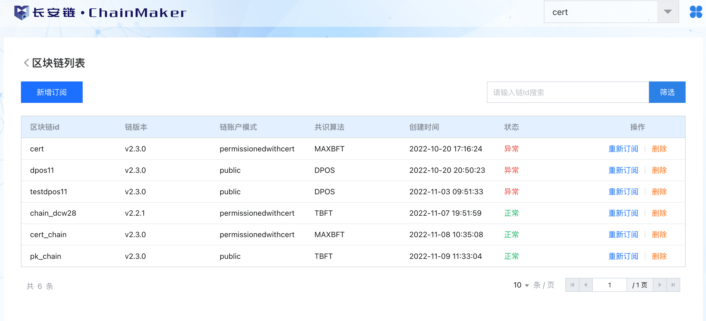

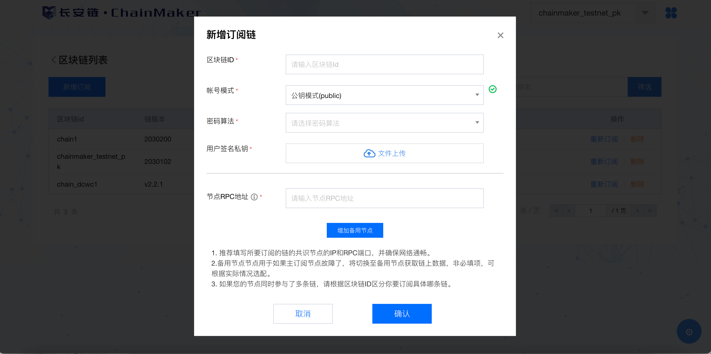


- 支持同时订阅多条链，再订阅链时，请确保所填写的信息和要订阅的链是一致的，并且用来订阅的节点的网络连接是通畅的。
- 支持订阅Cert，和Public两种账户模式的链。
- 不允许同时订阅同一条链，也不允许同时订阅ChainID相同的链。
- 如果订阅后，所订阅的节点运行出现异常，如停机了，或者被踢出网络了，则浏览器也将无法获取信息，您可以通过重新订阅按钮，修改到正常运行的节点，恢复订阅。
- 支持删除订阅，删除后，将不会再获取该链的信息，且原来的已经订阅的数据都会被删除，如需重新获取，需要再次订阅。

### 区块信息

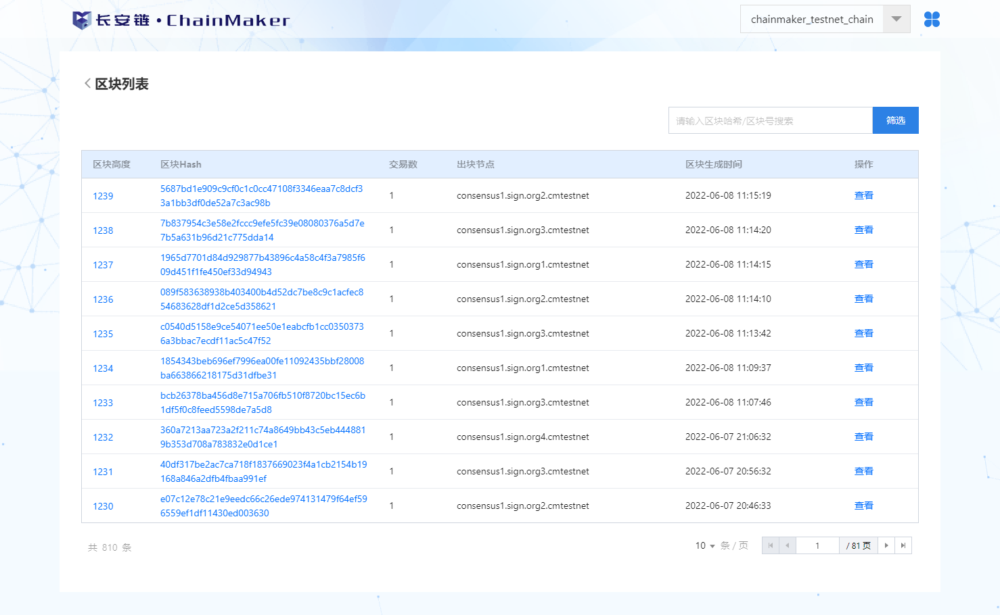

- 此处展示区块列表，点击查看，可以查看该区块的详情。


- 支持查看某一区块的具体信息，包括区块哈希，读写集哈希，DAG信息，以及本区块内的交易信息。

### 交易信息

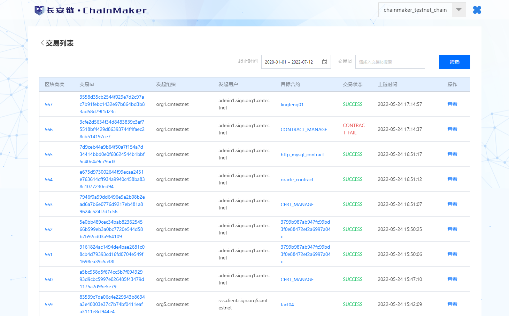

- 此处展示交易列表，支持通过实际时间维度筛选交易，点击查看，可以查看该交易的详情。

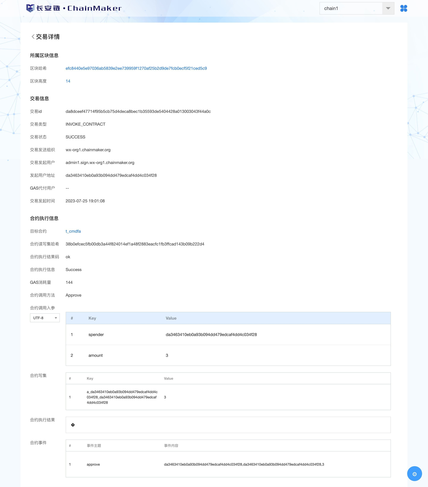

- 支持查看某一条交易详情，包括交易的所属区块信息，交易发起人信息，交易所调用的合约执行情况。

### 合约信息

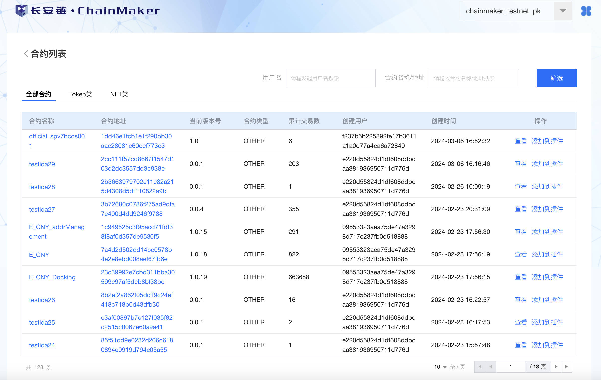

- 此处展示合约列表，默认进入全部合约，点击可切换Token类和NFT类，点击可以查看该合约的详情。
- 如果安装了长安链Web3插件v1.5.2+,可以直接把合约订阅到插件内。


#### 合约详情
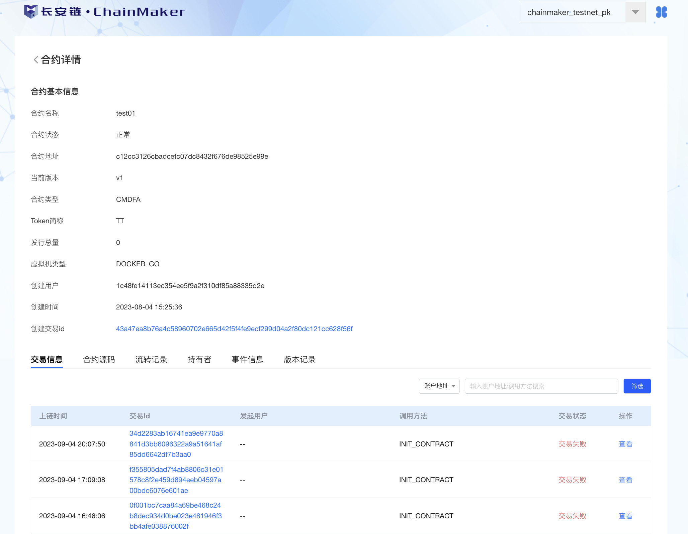

- 支持查看合约信息，包括合约的地址，合约的创建者信息

- 可以切换查看交易信息、合约源码、流转记录、持有者、事件记录和版本记录。

  

#### CMDFA合约详情

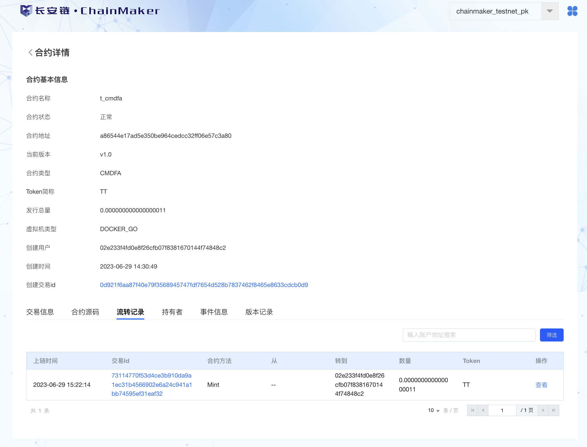

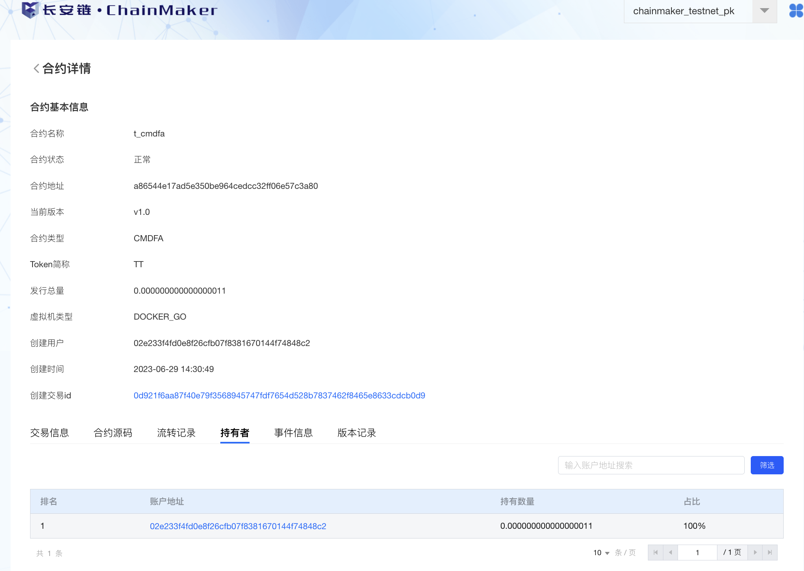

- 如果所订阅的合约符合长安链合约标准协议规范，类型为CMDFA则浏览器处会额外展示CMDFA内的合约资产的流转记录和持有者记录。

#### CMNFA合约详情


- 如果所订阅的合约符合长安链合约标准协议规范，类型为CMNFA则浏览器处会额外展示CMNFA内的合约资产的流转记录、持有者和NFT总览。
- 以及可以查看合约内的数字藏品资产详情。
- 注意，相关数字藏品的metadata信息必须符合长安链合约标准规范否则将解析失败。具体如下：
```json
 {
      "author":"凌风出品",
      "orgName":"北京美好景象图片有限公司",
      "name":"Lionel Messi",
      "description":"利昂内尔·安德烈斯·“利奥”·梅西·库奇蒂尼，简称梅西（西班牙语：Lionel Messi），生于阿根廷圣菲省罗萨里奥，现正效力于法甲俱乐部巴黎圣日耳曼，同时担任阿根廷国家足球队队长，司职边锋、前锋及前腰。目前他共获得7座金球奖、6次世界足球先生及6座欧洲金靴奖。",
      "image":"https://www.strikers.auction/images/cards/000.png",
      "seriesHash":"5fabfb28760f946a233b58e99bfac43f3c53b19afa41d26ea75a3a58cbfc1491"
    }
```
- 请注意metadata必须是一段标准的json，且字段名称需与上述例子保持一致，否则将无法解析到对应的数据。其中
  - 作品URL为该NFT图片资源存放的地址，
  - 作品哈希为该图片对应的sha256哈希值，通过将资源哈希值上链进行存证，确保就算是存储在中心化云服务的NFT也不可被篡改。
  
  #### IDA合约详情
  
  

### 组织信息


- 此处展示参与该区块链的组织信息。
- 因public模式的链没有组织概念，故而该模式下不展示组织信息模块。


### 节点信息


- 此处展示参与该区块链的节点信息。

### 链账户信息

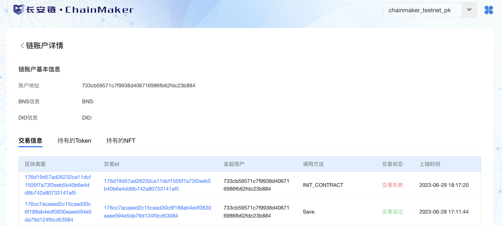

- 此处展示该区块链目前已经发送过或者接收过交易的用户信息，同步展示交易信息、持有Token信息和持有NFT信息。
- 无论是证书账号还是公钥账户都有其对应的链账户地址。

### 自定义查询

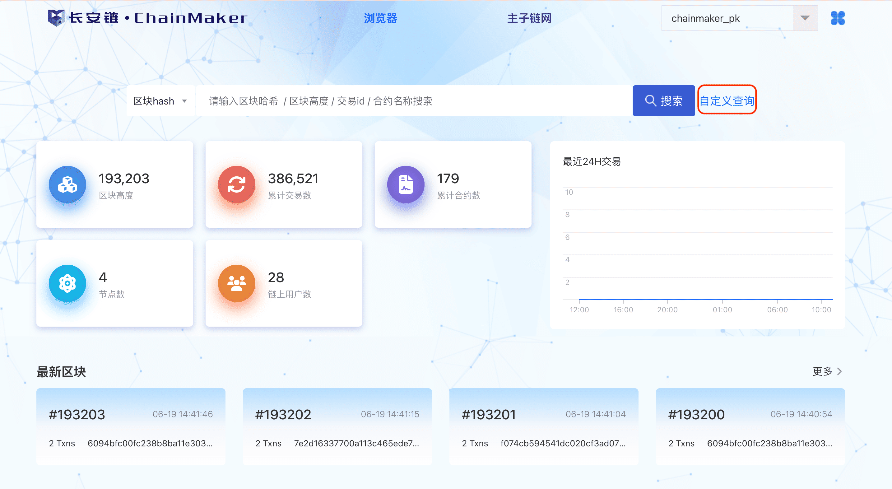

* 首页点击进入自定义查询（即链上数据sql查询）

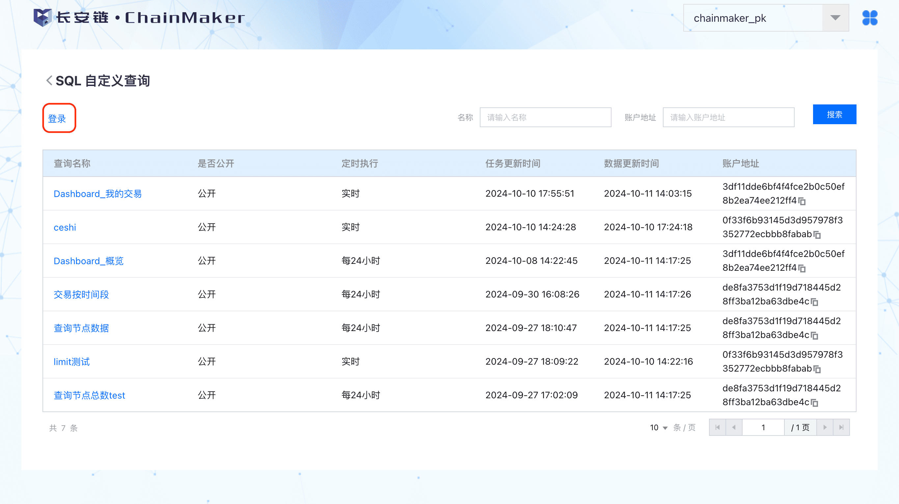

* 用户必须先用长安链Web3插件钱包登陆。如果不登陆，仅可以查看“公共”的sql查询结果，且无法新建自己的sql查询表


* 成功登陆后，点击新建查询表

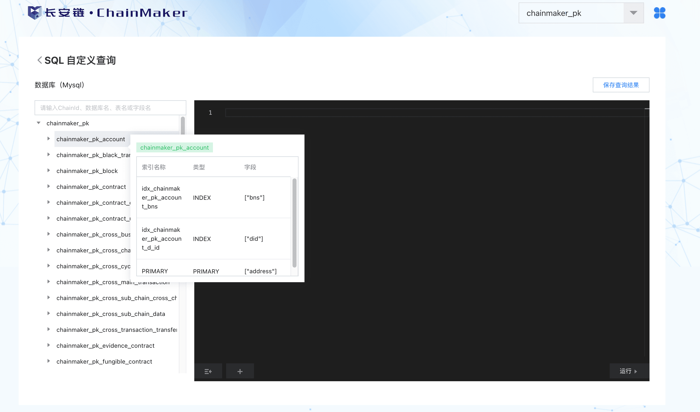

* 用户可以选取数据库中的字段名，在右侧输入查询条件

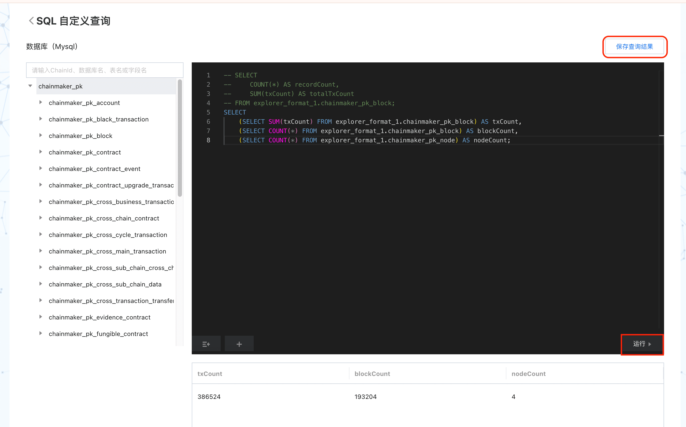

* 点击运行，下方返回查询结果后，用户可以点击“保存查询结果”

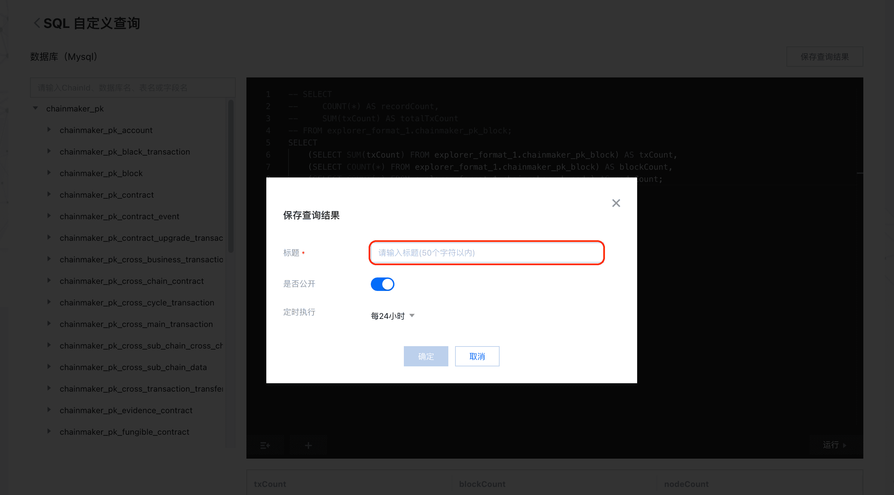

* 保存查询结果时，除了输入标题之外，可以选择查询结果是否公开，如果公开，所有人可见；如果不公开，只有当你登陆Web3插件钱包后，才能看到该查询结果。
* 除此之外，定时执行代表每隔XX小时，浏览器会自动更新查询结果


### 合约验证

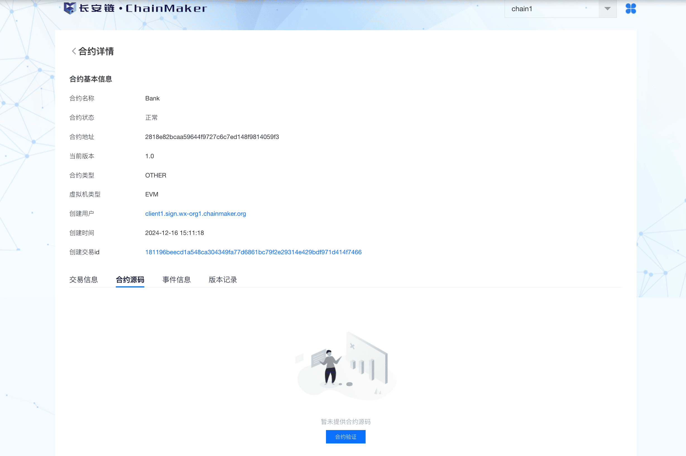

- 进入一个尚未验证合约的合约详情页面，下方选择合约源码标签，点击合约验证。

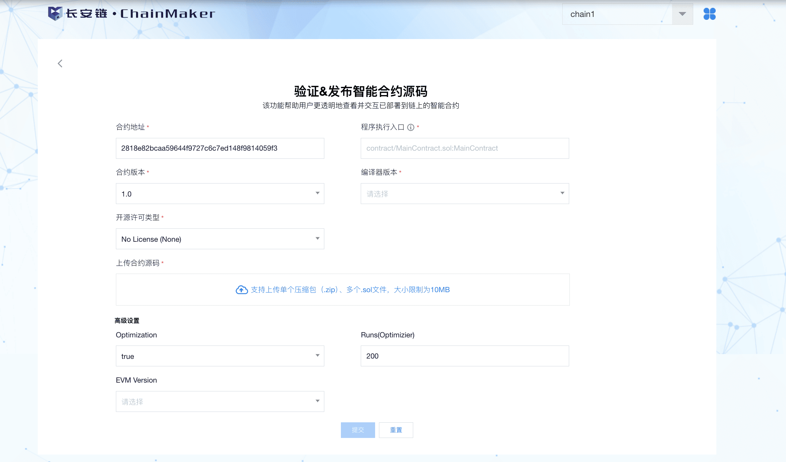

- 进入合约验证的详情页面，填写合约地址、程序执行入口、合约版本、编译器版本、开源许可类型并上传合约源码之后，点击提交

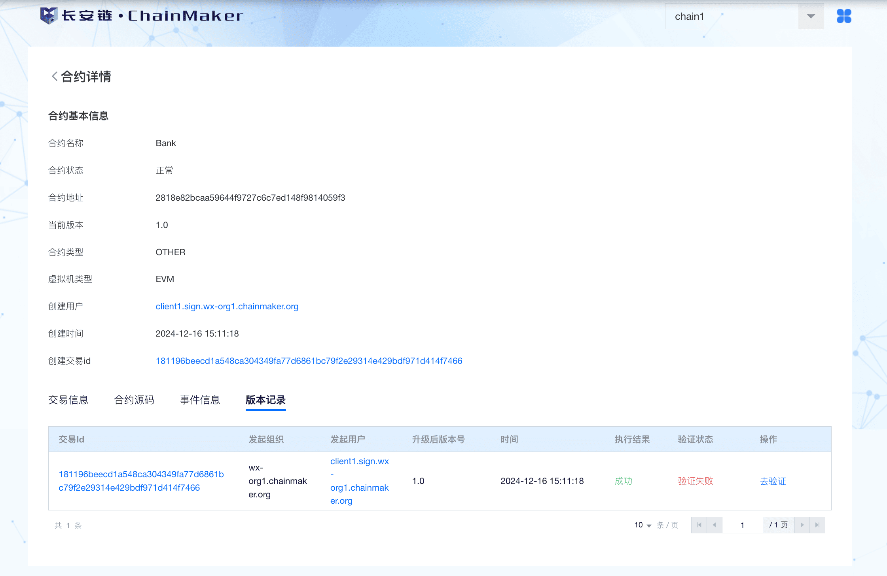

- 提交验证后，页面会弹出验证结果。在合约详情的版本记录标签下，可以查看合约所有版本的验证结果。

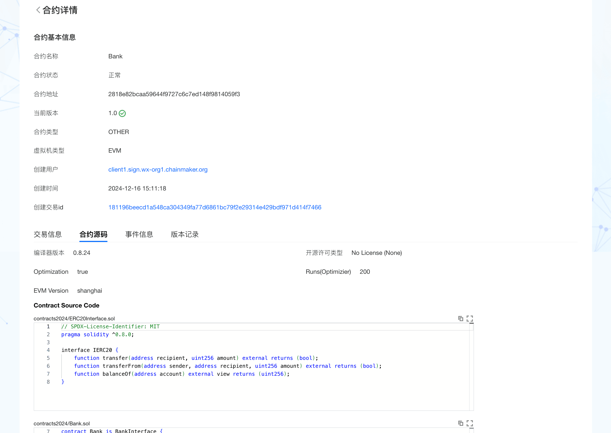

- 对于已经通过验证的合约，可以在合约详情页的合约源码标签下，查看合约源码、Contract ABI等信息
