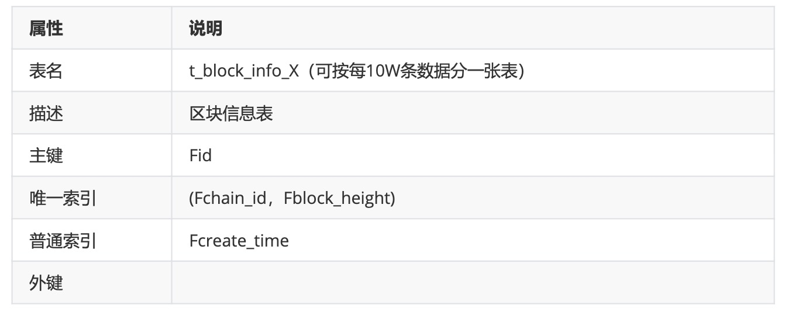
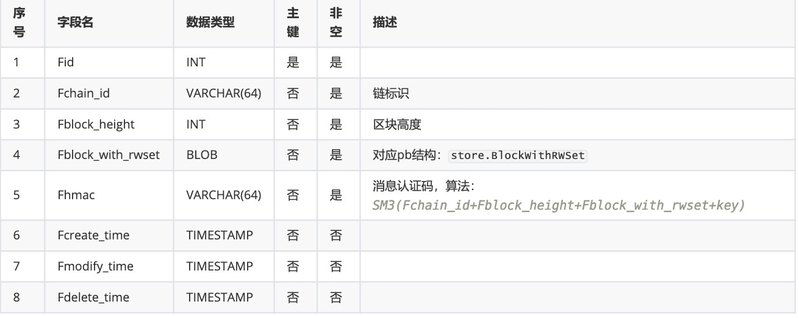

# 长安链cmc工具（pk）

## 简介

  cmc`(ChainMaker Client)`是ChainMaker提供的命令行工具，用于和ChainMaker链进行交互以及生成证书或者密钥等功能。cmc基于go语言编写，通过使用ChainMaker的go语言sdk（使用grpc协议）达到和ChainMaker链进行交互的目的。<br>
  cmc的详细日志请查看`./sdk.log`

  长安链在2.1版本以后支持不同身份模式，详情见[身份权限管理](../tech/身份权限管理.md)的身份模式部分。本篇文章中主要是介绍Public模式，更多模式的cmc使用文档如下: 

  * Public
  * [PermissionedWithCert](./命令行工具.md)
  * [PermissionedWithKey](./命令行工具pwk.md)

  ## 编译&配置

  cmc工具的编译&运行方式如下: 

  > 创建工作目录 $WORKDIR 比如 ~/chainmaker
  > 启动测试链 [在工作目录下 使用脚本搭建](../recovery/通过命令行工具启动链.html#runUseScripts)
```shq
  # 编译cmc
  $ cd $WORKDIR/chainmaker-go/tools/cmc
  $ go build
  # 配置测试数据
  $ cp -rf $WORKDIR/chainmaker-go/build/crypto-config $WORKDIR/chainmaker-go/tools/cmc/testdata/ # 使用chainmaker-cryptogen生成的测试链的密钥
  # 查看help
  $ cd $WORKDIR/chainmaker-go/tools/cmc
  $ ./cmc --help
```

  ## 自定义配置

  cmc 依赖 sdk-go 配置文件。
  编译&配置 步骤使用的是 [SDK配置模版](https://git.chainmaker.org.cn/chainmaker/sdk-go/-/blob/master/testdata/sdk_config_pk.yml)
  可通过修改 ~/chainmaker/chainmaker-go/tools/cmc/testdata/sdk_config_pk.yml 实现自定义配置。
  比如 `user-signkey-file-path` 参数可设置为普通用户或admin用户的私钥路径。设置后cmc将会以对应用户身份与链建立连接。
  其他详细配置项请参看 ~/chainmaker/chainmaker-go/tools/cmc/testdata/sdk_config_pk.yml 中的注解。

  ## 功能

  TBFT共识场景下的cmc提供功能如下: 

  - [私钥管理](#keyManage): 私钥生成功能
  - [交易功能](#sendRequest): 主要包括链管理、用户合约发布、升级、吊销、冻结、调用、查询等功能
  - [查询链上数据](#queryOnChainData): 查询链上block和transaction
  - [链配置](#chainConfig): 查询及更新链配置
  - [归档&恢复功能](#archive): 将链上数据转移到独立存储上，归档后的数据具备可查询、可恢复到链上的特性
  - [地址转换](#address): 转换成指定类型的地址。支持转换成至信链等类型的地址
  - [交易池](#txpool): 交易池相关查询命
  - [gas管理](#gasManagement): gas管理类命令，包括设置 gas admin、充值 gas 等功能。命令[参考cert模式](./命令行工具.html#gasManagement)
  - [交易ID黑名单管理](#txBlackListManage):开启、关闭、添加、删除、查询等功能。命令[参考cert模式](./命令行工具.html#txBlackListManage)
  - [共识扩展数据管理](#consensusExtManage):链上共识扩展数据的新增、修改等功能

  [DPOS共识场景下的cmc命令](#dpos)

  ### 示例（TBFT共识）

<span id="keyManage"></span>

  #### 私钥管理

  生成私钥， 目前支持的算法有SM2、ECC_P256，未来将支持更多算法。
  **参数说明**: 

  ```sh
  ./cmc key gen -h 
  ```
  ```sh
  # 返回
  Private key generate
  Usage:
    cmc key gen [flags]

  Flags:
    -a, --algo string specify key generate algorithm
    -h, --help 		help for gen
    -n, --name string specify storage name
    -p, --path string specify storage path
  ```

**示例：**
  ```sh
  ./cmc key gen -a ECC_P256 -n ca.key -p ./
  ```

<span id="sendRequest"></span>

  #### 交易功能

  ##### 用户合约

  cmc的交易功能用来发送交易和链进行交互，主要参数说明如下: 

  ```sh
    sdk配置文件flag
    --sdk-conf-path: 指定cmc使用sdk的配置文件路径

    如果想覆盖sdk配置文件中的配置，则使用以下两个flag且都必填；如不传，则默认使用sdk配置文件中的配置参数
    --chain-id: 指定链Id, 会覆盖sdk配置文件读取的配置
    --user-signkey-file-path: 指定发送交易的用户sign私钥路径, 会覆盖sdk配置文件读取的配置
      
    其他flags
    --byte-code-path: 指定合约的wasm文件路径
    --contract-name: 指定合约名称
    --method: 指定调用的合约方法名称
    --runtime-type: 指定合约执行虚拟机环境，如 WASMER | EVM | DOCKER_GO 等
    --version: 指定合约的版本号，在发布和升级合约时使用
    --sync-result: 指定是否同步等待交易执行结果，默认为false，如果设置为true，在发送完交易后会主动查询交易执行结果
    --params: 指定发布合约或调用合约时的参数信息
    --concurrency: 指定调用合约并发的go routine，用于压力测试
    --total-count-per-goroutine: 指定单个go routine发送的交易数量，用于压力测试，和--concurrency配合使用
    --block-height: 指定区块高度
    --tx-id: 指定交易Id
    --with-rw-set: 指定获取区块时是否附带读写集，默认是false
    --abi-file-path: 调用evm合约时需要指定被调用合约的abi文件路径，如: --abi-file-path=./testdata/balance-evm-demo/ledger_balance.abi
  ```

   

  - 创建wasm合约

    ```sh
    ./cmc client contract user create \
    --contract-name=fact \
    --runtime-type=WASMER \
    --byte-code-path=./testdata/claim-wasm-demo/rust-fact-2.0.0.wasm \
    --version=1.0 \
    --sdk-conf-path=./testdata/sdk_config_pk.yml \
    --admin-key-file-paths=./testdata/crypto-config/node1/admin/admin1/admin1.key \
    --sync-result=true \
    --params="{}"
    ```

  - 创建evm合约

    ```sh
    ./cmc client contract user create \
    --contract-name=balance001 \
    --runtime-type=EVM \
    --byte-code-path=./testdata/balance-evm-demo/ledger_balance.bin \
    --abi-file-path=./testdata/balance-evm-demo/ledger_balance.abi \
    --version=1.0 \
    --sdk-conf-path=./testdata/sdk_config_pk.yml \
    --admin-key-file-paths=./testdata/crypto-config/node1/admin/admin1/admin1.key \
    --sync-result=true
    ```

  - 调用wasm合约

    ```sh
    ./cmc client contract user invoke \
    --contract-name=fact \
    --method=save \
    --sdk-conf-path=./testdata/sdk_config_pk.yml \
    --params="{\"file_name\":\"name007\",\"file_hash\":\"ab3456df5799b87c77e7f88\",\"time\":\"6543234\"}" \
    --sync-result=true
    ```

  - 调用evm合约

    evm的 –params 是一个数组json格式。如下updateBalance有两个形参第一个是uint256类型，第二个是address类型。

    10000对应第一个形参uint256的具体值，0xa166c92f4c8118905ad984919dc683a7bdb295c1对应第二个形参address的具体值。

    ```sh
    ./cmc client contract user invoke \
    --contract-name=balance001 \
    --method=updateBalance \
    --sdk-conf-path=./testdata/sdk_config_pk.yml \
    --params="[{\"uint256\": \"10000\"},{\"address\": \"0xa166c92f4c8118905ad984919dc683a7bdb295c1\"}]" \
    --sync-result=true \
    --abi-file-path=./testdata/balance-evm-demo/ledger_balance.abi
    ```

  - 查询合约

    ```sh
    ./cmc client contract user get \
    --contract-name=fact \
    --method=find_by_file_hash \
    --sdk-conf-path=./testdata/sdk_config_pk.yml \
    --params="{\"file_hash\":\"ab3456df5799b87c77e7f88\"}"
    ```

  - 升级合约

    ```sh
    ./cmc client contract user upgrade \
    --contract-name=fact \
    --runtime-type=WASMER \
    --byte-code-path=./testdata/claim-wasm-demo/rust-fact-2.0.0.wasm \
    --version=2.0 \
    --sdk-conf-path=./testdata/sdk_config_pk.yml \
    --admin-key-file-paths=./testdata/crypto-config/node1/admin/admin1/admin1.key \
    --sync-result=true \
    --params="{}"
    ```

  - 冻结合约

    ```sh
    ./cmc client contract user freeze \
    --contract-name=fact \
    --sdk-conf-path=./testdata/sdk_config_pk.yml \
    --admin-key-file-paths=./testdata/crypto-config/node1/admin/admin1/admin1.key \
    --sync-result=true
    ```

    > 如下返回表示成功: 冻结后的合约再去执行查询、调用合约则会失败
    > 
    > freeze contract resp: message:”OK” contract_result:<result:”{“name”:”fact”,”version”:”3.0”,”runtime_type”:2,”status”:1,”creator”:{“org_id”:”wx-org1.chainmaker.org”,”member_type”:1,”member_info”:”Rl3cLAVPgLrri7z9blQWJUsNzPLxq1juKjL/jqhraBk=”}}” message:”OK” > tx_id:”09841775173548ad9a8a39e2987a4f5115d59d50dd3448e8b09a83624dee5367”

  - 解冻合约

    ```sh
    ./cmc client contract user unfreeze \
    --contract-name=fact \
    --sdk-conf-path=./testdata/sdk_config_pk.yml \
    --admin-key-file-paths=./testdata/crypto-config/node1/admin/admin1/admin1.key \
    --sync-result=true
    ```

    > 如下返回表示成功: 解冻后的合约可正常使用
    > 
    > unfreeze contract resp: message:”OK” contract_result:<result:”{“name”:”fact”,”version”:”3.0”,”runtime_type”:2,”creator”:{“org_id”:”wx-org1.chainmaker.org”,”member_type”:1,”member_info”:”Rl3cLAVPgLrri7z9blQWJUsNzPLxq1juKjL/jqhraBk=”}}” message:”OK” > tx_id:”fccf024450c140dea999cc46ad24d381a679ce2142bd48b2a829abcd4f099866”

  - 吊销合约

    ```sh
    ./cmc client contract user revoke \
    --contract-name=fact \
    --sdk-conf-path=./testdata/sdk_config_pk.yml \
    --admin-key-file-paths=./testdata/crypto-config/node1/admin/admin1/admin1.key \
    --sync-result=true
    ```

    > 如下返回表示成功: 吊销合约后，不可恢复，且不能对该合约执行任何操作，包括查询。
    > 
    > revoke contract resp: message:”OK” contract_result:<result:”{“name”:”fact”,”version”:”3.0”,”runtime_type”:2,”status”:2,”creator”:{“org_id”:”wx-org1.chainmaker.org”,”member_type”:1,”member_info”:”Rl3cLAVPgLrri7z9blQWJUsNzPLxq1juKjL/jqhraBk=”}}” message:”OK” > tx_id:”d971b57cf12c46ff8fe0d4f5897634c644fb802998f44360bb130f27ff54a10a”

  - 合约名转换成合约地址
    > --address-type=0 是长安链地址类型；--address-type=1 是至信链地址类型

    ```sh
    ./cmc client contract name-to-addr fact --address-type=0 
    ```

<span id="queryOnChainData"></span>

  #### 查询链上数据

  查询链上block和transaction 主要参数说明如下: 

  ```sh
    --sdk-conf-path: 指定cmc使用sdk的配置文件路径
    --chain-id: 指定链Id
  ```

   

  - 根据区块高度查询链上未归档区块

    ```sh
    ./cmc query block-by-height [blockheight] \
    --chain-id=chain1 \
    --sdk-conf-path=./testdata/sdk_config_pk.yml
    ```

  - 根据区块hash查询链上未归档区块

    ```sh
    ./cmc query block-by-hash [blockhash] \
    --chain-id=chain1 \
    --sdk-conf-path=./testdata/sdk_config_pk.yml
    ```

  - 根据txid查询链上未归档区块

    ```sh
    ./cmc query block-by-txid [txid] \
    --chain-id=chain1 \
    --sdk-conf-path=./testdata/sdk_config_pk.yml
    ```

  - 根据txid查询链上未归档tx

    ```sh
    ./cmc query tx [txid] \
    --chain-id=chain1 \
    --sdk-conf-path=./testdata/sdk_config_pk.yml
    ```

   

<span id="chainConfig"></span>

  #### 链配置

  查询及更新链配置 主要参数说明如下: 

  ```sh
    sdk配置文件flag
    --sdk-conf-path: 指定cmc使用sdk的配置文件路径

    admin签名者flags，此类flag的顺序及个数必须保持一致，且至少传入一个admin（当前只有管理员的添加删除需要用到管理员多签）
    --admin-key-file-paths: admin签名者的tls key文件的路径列表. 单签模式下只需要填写一个即可, 离线多签模式下多个需要用逗号分割
      
    如果想覆盖sdk配置文件中的配置，则使用以下两个flag且都必填；如不传，则默认使用sdk配置文件中的配置参数
    --chain-id: 指定链Id, 会覆盖sdk配置文件读取的配置
    --user-signkey-file-path: 指定发送交易的用户sign私钥路径, 会覆盖sdk配置文件读取的配置
      
    --block-interval: 出块时间 单位ms
    --tx-parameter-size: 交易参数最大限制 单位:MB
    --trust-root-org-id: 增加/删除/更新组织管理员公钥时指定的组织Id
    --trust-root-path: 管理员公钥目录
    --node-id: 增加/删除/更新共识节点Id时指定的节点Id
    --node-ids: 增加/更新共识节点Org时指定的节点Id列表
    --node-org-id: 增加/删除/更新共识节点Id,Org时指定节点的组织Id 
    --address-type: 地址类型 ChainMaker:0, 至信链:1
    --block-timestamp-verify:  是否开启区块时间戳校验（true为校验，false为不校验）
    --block-timeout: 区块时间戳校验范围（只在开启区块时间戳校验功能后生效，规则: ｜当前时间-区块时间戳中时间｜ <= blockTimeOut）
  ```

   

  - 查询链配置

    ```sh
    ./cmc client chainconfig query \
    --sdk-conf-path=./testdata/sdk_config_pk.yml
    ```

   

  - 更新出块时间

    ```sh
    ./cmc client chainconfig block updateblockinterval \
    --sdk-conf-path=./testdata/sdk_config_pk.yml \
    --admin-key-file-paths=./testdata/crypto-config/node1/admin/admin1/admin1.key,./testdata/crypto-config/node1/admin/admin2/admin2.key,./testdata/crypto-config/node1/admin/admin3/admin3.key \
    --block-interval 1000
    ```

  - 更新交易参数最大值限制

    ```sh
    ./cmc client chainconfig block updatetxparametersize \
    --sdk-conf-path=./testdata/sdk_config_pk.yml \
    --admin-key-file-paths=./testdata/crypto-config/node1/admin/admin1/admin1.key,./testdata/crypto-config/node1/admin/admin2/admin2.key,./testdata/crypto-config/node1/admin/admin3/admin3.key \
    --tx-parameter-size 10 
    ```
    
  - 更新区块配置
  
  ```
  ./cmc client contract user invoke \
  --contract-name=CHAIN_CONFIG \
  --method=BLOCK_UPDATE \
  --sdk-conf-path=./testdata/sdk_config_pk.yml \
  --params="{\"block_tx_capacity\":\"2000\",\"tx_timestamp_verify\":\"true\",\"tx_timeout\":\"600\",\"block_size\":\"200\",\"block_interval\":\"20\",\"tx_parameter_size\":\"50\"}" \
  --admin-key-file-paths=./testdata/crypto-config/node1/admin/admin1/admin1.key,./testdata/crypto-config/node1/admin/admin2/admin2.key,./testdata/crypto-config/node1/admin/admin3/admin3.key \
  --sync-result=true \
  --result-to-string=true
  ```

  - 开启区块时间戳校验

    ```sh
    ./cmc client chainconfig block updateblocktimestamp \
    --sdk-conf-path=./testdata/sdk_config_pk.yml \
    --admin-key-file-paths=./testdata/crypto-config/node1/admin/admin1/admin1.key,./testdata/crypto-config/node1/admin/admin2/admin2.key,./testdata/crypto-config/node1/admin/admin3/admin3.key \
    --block-timestamp-verify=true \
    --block-timeout=10
    ```

  - 添加共识节点

    ```sh
    ./cmc client chainconfig consensusnodeid add \
    --sdk-conf-path=./testdata/sdk_config_pk.yml \
    --user-signkey-file-path=./testdata/crypto-config/node1/admin/admin1/admin1.key \
    --admin-key-file-paths=./testdata/crypto-config/node1/admin/admin1/admin1.key,./testdata/crypto-config/node1/admin/admin2/admin2.key,./testdata/crypto-config/node1/admin/admin3/admin3.key \
    --node-id=QmcQHCuAXaFkbcsPUj7e37hXXfZ9DdN7bozseo5oX4qiC4 \
    --node-org-id=public
    ```

  - 删除共识节点

    ```sh
    ./cmc client chainconfig consensusnodeid remove \
    --sdk-conf-path=./testdata/sdk_config_pk.yml \
    --user-signkey-file-path=./testdata/crypto-config/node1/admin/admin1/admin1.key \
    --admin-key-file-paths=./testdata/crypto-config/node1/admin/admin1/admin1.key,./testdata/crypto-config/node1/admin/admin2/admin2.key,./testdata/crypto-config/node1/admin/admin3/admin3.key \
    --node-id=QmXxeLkNTcvySPKMkv3FUqQgpVZ3t85KMo5E4cmcmrexrC \
    --node-org-id=public
    ```

  - 更新共识节点（单个）

    ```sh
    ./cmc client chainconfig consensusnodeid update \
    --sdk-conf-path=./testdata/sdk_config_pk.yml \
    --user-signkey-file-path=./testdata/crypto-config/node1/admin/admin1/admin1.key \
    --admin-key-file-paths=./testdata/crypto-config/node1/admin/admin1/admin1.key,./testdata/crypto-config/node1/admin/admin2/admin2.key,./testdata/crypto-config/node1/admin/admin3/admin3.key \
    --node-id=QmXxeLkNTcvySPKMkv3FUqQgpVZ3t85KMo5E4cmcmrexrC \
    --node-id-old=QmcQHCuAXaFkbcsPUj7e37hXXfZ9DdN7bozseo5oX4qiC4 \
    --node-org-id=public
    ```

  - 更新共识节点（多个）

    ```sh
    ./cmc client chainconfig consensusnodeorg update \
    --sdk-conf-path=./testdata/sdk_config_pk.yml \
    --user-signkey-file-path=./testdata/crypto-config/node1/admin/admin1/admin1.key \
    --admin-key-file-paths=./testdata/crypto-config/node1/admin/admin1/admin1.key,./testdata/crypto-config/node1/admin/admin2/admin2.key,./testdata/crypto-config/node1/admin/admin3/admin3.key \
    --node-ids=QmbUjZPooufuTbRBxzVx546xyLpwibwsQXRPD6SwWfZMgx,QmP2GcRYFh2xQ2rh4CXsCN1d9CMxk9SktygXiwFKG487mo,QmSJGZxUSq5xXGZ68myuHcAqHsExioS8Bt87WZ3LsqRauC,QmcVEe4uVS2b6zNVKMzL57CdDhJtXey4wcktPdDv3JgyDg \
    --node-org-id=public
    ```

  - 更新管理员公钥

    ```sh
    ./cmc client chainconfig trustroot update \
    --sdk-conf-path=./testdata/sdk_config_pk.yml \
    --user-signkey-file-path=./testdata/crypto-config/node1/admin/admin1/admin1.key \
    --admin-key-file-paths=./testdata/crypto-config/node1/admin/admin1/admin1.key,./testdata/crypto-config/node1/admin/admin2/admin2.key,./testdata/crypto-config/node1/admin/admin3/admin3.key \
    --trust-root-org-id=public \
    --trust-root-path=./testdata/crypto-config/node1/admin/admin1/admin1.pem,./testdata/crypto-config/node1/admin/admin2/admin2.pem,./testdata/crypto-config/node1/admin/admin3/admin3.pem
    ```

  - 开启/关闭链的 gas 功能

    ```sh
    ./cmc client gas \
    --sdk-conf-path=./testdata/sdk_config_pk.yml \
    --admin-key-file-paths=./testdata/crypto-config/node1/admin/admin1/admin1.key,./testdata/crypto-config/node1/admin/admin2/admin2.key,./testdata/crypto-config/node1/admin/admin3/admin3.key \
    --gas-enable=true
    ```


<span id="chainConfig.onlyCreatorUpgrade"></span>

  - 开启只允许创建者升级合约功能

    ```sh
    ./cmc client contract user invoke \
     --contract-name=CHAIN_CONFIG \
     --method=ENABLE_ONLY_CREATOR_UPGRADE \
     --sdk-conf-path=./testdata/sdk_config_pk.yml \
     --params="{}" \
    --admin-key-file-paths=./testdata/crypto-config/node1/admin/admin1/admin1.key,./testdata/crypto-config/node1/admin/admin2/admin2.key,./testdata/crypto-config/node1/admin/admin3/admin3.key \
     --sync-result=true \
     --result-to-string=true
    ```
  - 关闭只允许创建者升级合约功能
    ```sh
    ./cmc client contract user invoke \
     --contract-name=CHAIN_CONFIG \
     --method=DISABLE_ONLY_CREATOR_UPGRADE \
     --sdk-conf-path=./testdata/sdk_config_pk.yml \
     --params="{}" \
    --admin-key-file-paths=./testdata/crypto-config/node1/admin/admin1/admin1.key,./testdata/crypto-config/node1/admin/admin2/admin2.key,./testdata/crypto-config/node1/admin/admin3/admin3.key \
     --sync-result=true \
     --result-to-string=true
    ```


<span id="archive"></span>
#### 归档&恢复功能

  cmc的归档功能是指将链上数据转移到独立存储上，归档后的数据具备可查询、可恢复到链上的特性。<br>
  为了保持数据一致性和防止误操作，cmc实现了分布式锁，同一时刻只允许一个cmc进程进行转储。<br>
  cmc支持增量转储和恢复、断点中继转储和恢复，中途退出不影响数据一致性。<br>

  


##### Dump(在归档中心和链外mysql中选择一种使用)  
  dump指令从链节点上查询数据,将数据写入到链外存储(当前支持MySQL和归档中心)  
- Dump 到链外数据仓库 
> 注意: mysql需要设置好 sql_mode 以root用户执行 set global sql_mode = 'ONLY_FULL_GROUP_BY,STRICT_TRANS_TABLES,ERROR_FOR_DIVISION_BY_ZERO,NO_ENGINE_SUBSTITUTION';  
- 链外mysql: sdk_config_pk.yaml
  ```yml
  archive:
      type: "mysql"  
      dest: "root:123456:localhost:3306"
  ```
- 链外mysql: 数据表设计说明
  - 表信息
          
       
  - 表字段        
      
- Dump归档中心: sdk_config_pk.yml（推荐使用）
  ```yml
  archive:
      type: "archivecenter"  # archivecenter 归档中心, mysql mysql数据库
  ```
    - 注册链到归档中心
  ```shell
  # 获取创世区块
  ./cmc query block-by-height 0 --chain-id=chain1 --sdk-conf-path=./testdata/sdk_config_pk.yml
  ```
  ```sh
  # 根据上面获取的创世区块拿到block_hash(如: PnipOpT7Et8m5sqdHuanYIwibSBZmZaXafhublJowVE=)
  ./cmc util base64tohex  PnipOpT7Et8m5sqdHuanYIwibSBZmZaXafhublJowVE= 
   ```
  ```sh
  # 返回 
  (获取返回的创世区块hash的hex格式数据: 3e78a93a94fb12df26e6ca9d1ee6a7608c226d205999969769f86e6e5268c151)
  ```
    - 将上面获得的创世区块hash的hex格式数据放到sdk_config_pk.yml中
  ```yml
  archive_center_config:
     chain_genesis_hash: 3e78a93a94fb12df26e6ca9d1ee6a7608c226d205999969769f86e6e5268c151
  ```
    - dump数据
  ```shell
  # 转存区块到链外存储
  ./cmc archive dump 100 --sdk-conf-path ./testdata/sdk_config_pk.yml --mode quick
    ```
  ```sh
  # 查询归档中心当前已归档数据状态
  ./cmc archive query archived-status --sdk-conf-path ./testdata/sdk_config_pk.yml
  ```


##### 节点归档  
  archive指令向链节点发送清理区块数据命令  

```shell
# 查询链上当前已归档数据状态命令
./cmc archive query chain-archived-status --sdk-conf-path ./testdata/sdk_config_pk.yml
  ```
  ```sh
# 清理链上区块数据命令
./cmc archive archive 10000 --timeout 20  --sdk-conf-path ./testdata/sdk_config_pk.yml
```

##### 节点数据恢复  
  restore指令从链外存储(MySQL/归档中心)中查询出区块数据,将区块数据恢复到链节点上

```shell
# 恢复链上区块数据命令,恢复到指定高度,恢复过程按照区块块高倒序恢复
./cmc archive restore 3000  --sdk-conf-path ./testdata/sdk_config_pk.yml
```

##### 数据仓库数据查询

```shell
# 查询归档中心当前已归档数据状态命令
./cmc archive query archived-status --sdk-conf-path ./testdata/sdk_config_pk.yml
```
```sh
# 查询归档中心,根据高度查区块命令
./cmc archive query block-by-height 20  --sdk-conf-path ./testdata/sdk_config_pk.yml
```
```sh
# 查询归档中心,根据txId查询区块命令
./cmc archive query block-by-txid 17221b132a25209aca52fdfc07218265e4377ef0099d46a49edfd032001fc2be --sdk-conf-path ./testdata/sdk_config_pk.yml
```
```sh
# 查询归档中心,根据txId查询交易命令
./cmc archive query tx 17221b132a25209aca52fdfc07218265e4377ef0099d46a49edfd032001fc2be  --sdk-conf-path ./testdata/sdk_config_pk.yml
```
```sh
# 查询归档中心,根据block hash查询区块命令
./cmc archive query block-by-hash 17221b132a25209aca52fdfc07218265e4377ef0099d46a49edfd032001fc2be --sdk-conf-path ./testdata/sdk_config_pk.yml
```

<span id="gasManagement"></span>

  #### gas管理

  gas管理类命令，包括设置 gas admin、充值 gas 等功能

  ```sh
    --sdk-conf-path: 指定cmc使用sdk的配置文件路径
    --admin-key-file-paths: 多签时，其他admin的私钥路径，多个时用逗号分开。
  ```

  - 启用 gas 功能

    ```sh
    ./cmc client gas --gas-enable=true \
    --sdk-conf-path=./testdata/sdk_config_pk.yml \
    --admin-key-file-paths=./testdata/crypto-config/node1/admin/admin1/admin1.key,./testdata/crypto-config/node2/admin/admin2/admin2.key,./testdata/crypto-config/node3/admin/admin3/admin3.key,./testdata/crypto-config/node4/admin/admin4/admin4.key
    ```

  - 设置 gas admin

    ```sh
    ./cmc gas set-admin [gas账号地址。如果不传则默认设置sender为 gas admin] \
    --sdk-conf-path=./testdata/sdk_config_pk.yml \
    --admin-key-file-paths=./testdata/crypto-config/node1/admin/admin1/admin1.key,./testdata/crypto-config/node1/admin/admin2/admin2.key,./testdata/crypto-config/node1/admin/admin3/admin3.key
    ```

  - 查询 gas admin

    ```sh
    ./cmc gas get-admin --sdk-conf-path=./testdata/sdk_config_pk.yml
    ```

  - 充值 gas

    ```sh
    ./cmc gas recharge \
    --sdk-conf-path=./testdata/sdk_config_pk.yml \
    --address=账户地址 \
    --amount=1000000
    ```

  - 查询 gas 余额

    ```sh
    ./cmc gas get-balance \
    --sdk-conf-path=./testdata/sdk_config_pk.yml \
    --address=账户地址
    ```

  - 退还 gas

    ```sh
    ./cmc gas refund \
    --sdk-conf-path=./testdata/sdk_config_pk.yml \
    --address=账户地址 \
    --amount=1
    ```

  - 冻结 gas 账户

    ```sh
    ./cmc gas frozen \
    --sdk-conf-path=./testdata/sdk_config_pk.yml \
    --address=账户地址
    ```

  - 解冻 gas 账户

    ```sh
    ./cmc gas unfrozen \
    --sdk-conf-path=./testdata/sdk_config_pk.yml \
    --address=账户地址
    ```

  - 查询 gas 账户的状态，true: 账户可用，false: 账户被冻结

    ```sh
    ./cmc gas account-status \
    --sdk-conf-path=./testdata/sdk_config_pk.yml \
    --address=账户地址
    ```

    <span id="gas-val-config-pk"></span>
  - 设置合约调用时使用的基础 gas 值
    ```sh
    ./cmc gas set-default-gas \
    --sdk-conf-path=./testdata/sdk_config_pk.yml \
    --amount=2 \
    --admin-key-file-paths=./testdata/crypto-config/node1/admin/admin1/admin1.key,./testdata/crypto-config/node1/admin/admin2/admin2.key,./testdata/crypto-config/node1/admin/admin3/admin3.key \
    --sync-result=true
    ```

  - 设置合约调用时用于计算的 gas 价格
    ```sh
    ./cmc gas set-default-gas-price \
    --sdk-conf-path=./testdata/sdk_config_pk.yml \
    --price=0.2 \
    --admin-key-file-paths=./testdata/crypto-config/node1/admin/admin1/admin1.key,./testdata/crypto-config/node1/admin/admin2/admin2.key,./testdata/crypto-config/node1/admin/admin3/admin3.key \
    --sync-result=true
    ```
  - 设置合约安装时使用的基础 gas 值
    ```sh
    ./cmc gas set-install-base-gas \
    --sdk-conf-path=./testdata/sdk_config_pk.yml \
    --amount=200000 \
    --admin-key-file-paths=./testdata/crypto-config/node1/admin/admin1/admin1.key,./testdata/crypto-config/node1/admin/admin2/admin2.key,./testdata/crypto-config/node1/admin/admin3/admin3.key \
    --sync-result=true
    ```

  - 设置合约安装时用于计算的 gas 价格
    ```sh
    ./cmc gas set-install-gas-price \
    --sdk-conf-path=./testdata/sdk_config_pk.yml \
    --price=0.1 \
    --admin-key-file-paths=./testdata/crypto-config/node1/admin/admin1/admin1.key,./testdata/crypto-config/node1/admin/admin2/admin2.key,./testdata/crypto-config/node1/admin/admin3/admin3.key \
    --sync-result=true
    ```

    <span id="gas-payer-pk"></span>
  - gas 代扣功能

    cmc 命令支持用户自主设置扣费账号，支付交易费用，命令如下: 

    ```sh
    ./cmc client contract user invoke \
    --contract-name=fact \
    --method=save \
    --sdk-conf-path=./testdata/sdk_config_pk.yml \
    --params="{\"file_name\":\"name007\",\"file_hash\":\"ab3456df5799b87c77e7f88\",\"time\":\"6543234\"}" \
    --payer-key-file-path=./testdata/crypto-config/node1/user/client1/client1.key \
    --gas-limit=600000 \
    --sync-result=true
    ```
    其中，--payer-key-file-path 参数指定的是支付该笔交易费用的账号对应的私钥文件

<span id="address"></span>

  #### 地址转换

  转换成长安链等类型的地址

  ```sh
  --hash-type: 指定根据公钥计算地址时使用的 Hash 算法类型, 默认为 0 ，即SAH256。所支持的 Hash 类型如下: 
  0: SHA256
  1: SHA3_256
  2: SM3
  ```

  - 公钥pem转换成地址

    ```shell
    ./cmc address pk-to-addr ./testdata/crypto-config/node1/admin/admin1/admin1.pem \
    --hash-type=0
    ```

  - public key DER hex转换成地址

    ```shell
    ./cmc address hex-to-addr 3059301306072a8648ce3d020106082a811ccf5501822d034200044a4c24cf037b0c7a027e634b994a5fdbcd0faa718ce9053e3f75fcb9a865523a605aff92b5f99e728f51a924d4f18d5819c42f9b626bdf6eea911946efe7442d \
     --hash-type=0
    ```

  - 合约名转换成地址

    ```shell
    ./cmc address name-to-addr my_cool_contract_name
    ```

<span id="consensusExtManage"></span>
#### 共识扩展数据管理
- 新增共识扩展数据

  ```sh
  ./cmc client chainconfig consensusextra add \
  --extra-config-key=test_key \
  --extra-config-value=test_value \
  --sdk-conf-path=./testdata/sdk_config_pk.yml \
  --admin-key-file-paths=./testdata/crypto-config/node1/admin/admin1/admin1.key,./testdata/crypto-config/node1/admin/admin2/admin2.key,./testdata/crypto-config/node1/admin/admin3/admin3.key
  ```

- 更新共识扩展数据

  ```sh
  ./cmc client chainconfig consensusextra update \
  --extra-config-key=test_key \
  --extra-config-value=new_test_value \
  --sdk-conf-path=./testdata/sdk_config_pk.yml \
  --admin-key-file-paths=./testdata/crypto-config/node1/admin/admin1/admin1.key,./testdata/crypto-config/node1/admin/admin2/admin2.key,./testdata/crypto-config/node1/admin/admin3/admin3.key
  ```

- 删除共识扩展数据

  ```sh
  ./cmc client chainconfig consensusextra delete \
  --extra-config-key=test_key \
  --sdk-conf-path=./testdata/sdk_config_pk.yml \
  --admin-key-file-paths=./testdata/crypto-config/node1/admin/admin1/admin1.key,./testdata/crypto-config/node1/admin/admin2/admin2.key,./testdata/crypto-config/node1/admin/admin3/admin3.key
  ```


<span id="dpos"></span>

### 示例（DPOS共识）

#### 私钥管理

生成私钥， 目前支持的算法有SM2、ECC_P256，未来将支持更多算法。 **参数说明**: 

```
$ ./cmc key gen -h 
Private key generate
Usage:
  cmc key gen [flags]

Flags:
  -a, --algo string specify key generate algorithm
  -h, --help 		help for gen
  -n, --name string specify storage name
  -p, --path string specify storage path
```
**示例：**

  ```sh
  ./cmc key gen -a ECC_P256 -n ca.key -p ./
  ```

#### 交易功能

##### 用户合约

cmc的交易功能用来发送交易和链进行交互，主要参数说明如下: 

```
  sdk配置文件flag
  --sdk-conf-path: 指定cmc使用sdk的配置文件路径

  覆盖sdk配置flags，不传则使用sdk配置，如果想覆盖sdk的配置，则以下两个flag都必填
  --chain-id: 指定链Id, 会覆盖sdk配置文件读取的配置
  --user-signkey-file-path: 指定发送交易的用户sign私钥路径, 会覆盖sdk配置文件读取的配置

  其他flags
  --byte-code-path: 指定合约的wasm文件路径
  --contract-name: 指定合约名称
  --method: 指定调用的合约方法名称
  --runtime-type: 指定合约执行虚拟机环境，如 WASMER | EVM | DOCKER_GO 等
  --version: 指定合约的版本号，在发布和升级合约时使用
  --sync-result: 指定是否同步等待交易执行结果，默认为false，如果设置为true，在发送完交易后会主动查询交易执行结果
  --params: 指定发布合约或调用合约时的参数信息
  --concurrency: 指定调用合约并发的go routine，用于压力测试
  --total-count-per-goroutine: 指定单个go routine发送的交易数量，用于压力测试，和--concurrency配合使用
  --block-height: 指定区块高度
  --tx-id: 指定交易Id
  --with-rw-set: 指定获取区块时是否附带读写集，默认是false
  --abi-file-path: 调用evm合约时需要指定被调用合约的abi文件路径，如: --abi-file-path=./testdata/balance-evm-demo/ledger_balance.abi
```

- 创建wasm合约

  ```
  ./cmc client contract user create \
  --contract-name=fact \
  --runtime-type=WASMER \
  --byte-code-path=./testdata/claim-wasm-demo/rust-fact-2.0.0.wasm \
  --version=1.0 \
  --sdk-conf-path=./testdata/sdk_config_pk.yml \
  --sync-result=true \
  --params="{}"
  ```

- 创建evm合约

  ```
  ./cmc client contract user create \
  --contract-name=balance001 \
  --runtime-type=EVM \
  --byte-code-path=./testdata/balance-evm-demo/ledger_balance.bin \
  --abi-file-path=./testdata/balance-evm-demo/ledger_balance.abi \
  --version=1.0 \
  --sdk-conf-path=./testdata/sdk_config_pk.yml \
  --sync-result=true
  ```

- 调用wasm合约

  ```
  ./cmc client contract user invoke \
  --contract-name=fact \
  --method=save \
  --sdk-conf-path=./testdata/sdk_config_pk.yml \
  --params="{\"file_name\":\"name007\",\"file_hash\":\"ab3456df5799b87c77e7f88\",\"time\":\"6543234\"}" \
  --sync-result=true
  ```

- 调用evm合约

  evm的 –params 是一个数组json格式。如下updateBalance有两个形参，第一个是uint256类型，第二个是address类型。

  10000对应第一个形参uint256的具体值，0xa166c92f4c8118905ad984919dc683a7bdb295c1对应第二个形参address的具体值。

  ```
  ./cmc client contract user invoke \
  --contract-name=balance001 \
  --method=updateBalance \
  --sdk-conf-path=./testdata/sdk_config_pk.yml \
  --params="[{\"uint256\": \"10000\"},{\"address\": \"0xa166c92f4c8118905ad984919dc683a7bdb295c1\"}]" \
  --sync-result=true \
  --abi-file-path=./testdata/balance-evm-demo/ledger_balance.abi
  ```

- 查询合约

  ```
  ./cmc client contract user get \
  --contract-name=fact \
  --method=find_by_file_hash \
  --sdk-conf-path=./testdata/sdk_config_pk.yml \
  --params="{\"file_hash\":\"ab3456df5799b87c77e7f88\"}"
  ```

- 升级合约

  ```
  ./cmc client contract user upgrade \
  --contract-name=fact \
  --runtime-type=WASMER \
  --byte-code-path=./testdata/claim-wasm-demo/rust-fact-2.0.0.wasm \
  --version=2.0 \
  --sdk-conf-path=./testdata/sdk_config_pk.yml \
  --user-signkey-file-path=./testdata/crypto-config/node1/admin/admin1/admin1.key \
  --sync-result=true \
  --params="{}"
  ```

- 冻结合约

  ```
  ./cmc client contract user freeze \
  --contract-name=fact \
  --sdk-conf-path=./testdata/sdk_config_pk.yml \
  --user-signkey-file-path=./testdata/crypto-config/node1/admin/admin1/admin1.key \
  --sync-result=true
  ```

- 解冻合约

  ```
  ./cmc client contract user unfreeze \
  --contract-name=fact \
  --sdk-conf-path=./testdata/sdk_config_pk.yml \
  --user-signkey-file-path=./testdata/crypto-config/node1/admin/admin1/admin1.key \
  --sync-result=true
  ```

- 吊销合约

  ```
  ./cmc client contract user revoke \
  --contract-name=fact \
  --sdk-conf-path=./testdata/sdk_config_pk.yml \
  --user-signkey-file-path=./testdata/crypto-config/node1/admin/admin1/admin1.key \
  --sync-result=true
  ```

##### 系统合约

###### DPoS 计算地址

- 用户公钥计算出用户的地址

  ```
  ./cmc cert userAddr --pubkey-cert-path=./testdata/crypto-config/node1/user/client1/client1.pem --sdk-conf-path=./testdata/sdk_config_pk.yml
  ```

- 共识节点node-id计算

  ```
  ./cmc cert nid --node-pk-path=./testdata/crypto-config/node1/node1.pem
  ```

###### DPoS-ERC20 系统合约

- 增发Token

  ```
  ./cmc client contract system mint \
  --amount=100000000 \
  --address=6CeSsjU5M62Ee3Gx9umUX6nXJoaBkWYufQdTZqEJM5di \
  --sdk-conf-path=./testdata/sdk_config_pk.yml \
  --chain-id=chain1 \
  --user-signkey-file-path=./testdata/crypto-config/node1/user/client1/client1.key \
  --sync-result=true
  ```

- 转账

  ```
  ./cmc client contract system transfer \
  --amount=100000000 \
  --address=6CeSsjU5M62Ee3Gx9umUX6nXJoaBkWYufQdTZqEJM5di \
  --sdk-conf-path=./testdata/sdk_config_pk.yml \
  --chain-id=chain1 \
  --user-signkey-file-path=./testdata/crypto-config/node1/user/client1/client1.key
  ```

- 查询余额

  ```
  ./cmc client contract system balance-of \
  --address=6CeSsjU5M62Ee3Gx9umUX6nXJoaBkWYufQdTZqEJM5di \
  --sdk-conf-path=./testdata/sdk_config_pk.yml \
  --chain-id=chain1 \
  --user-signkey-file-path=./testdata/crypto-config/node1/user/client1/client1.key
  ```

- 查询合约管理地址

  ```
  ./cmc client contract system owner \
  --sdk-conf-path=./testdata/sdk_config_pk.yml \
  --chain-id=chain1 \
  --user-signkey-file-path=./testdata/crypto-config/node1/user/client1/client1.key
  ```

- 查询ERC20合约的精度

  ```
  ./cmc client contract system decimals \
  --sdk-conf-path=./testdata/sdk_config_pk.yml \
  --chain-id=chain1 \
  --user-signkey-file-path=./testdata/crypto-config/node1/user/client1/client1.key
  ```

- 查询 Token 总供应量

  ```
  ./cmc client contract system total \
  --sdk-conf-path=./testdata/sdk_config_pk.yml \
  --chain-id=chain1 \
  --user-signkey-file-path=./testdata/crypto-config/node1/user/client1/client1.key
  ```

###### DPoS-Stake 系统合约

- 查询所有的候选人

  ```
  ./cmc client contract system all-candidates \
  --sdk-conf-path=./testdata/sdk_config_pk.yml \
  --chain-id=chain1 \
  --user-signkey-file-path=./testdata/crypto-config/node1/user/client1/client1.key
  ```

- 查询指定验证人的信息

  ```
  ./cmc client contract system get-validator \
  --address=2W5SWDgx3kVSDmpRvHw351K4KaBx8QiUNBaTtGsFCWWH \
  --sdk-conf-path=./testdata/sdk_config_pk.yml \
  --chain-id=chain1 \
  --user-signkey-file-path=./testdata/crypto-config/node1/user/client1/client1.key
  ```

- 抵押权益到验证人

  ```
  ./cmc client contract system delegate \
  --address=2W5SWDgx3kVSDmpRvHw351K4KaBx8QiUNBaTtGsFCWWH \
  --amount=2500000 \
  --sdk-conf-path=./testdata/sdk_config_pk.yml \
  --chain-id=chain1 \
  --user-signkey-file-path=./testdata/crypto-config/node1/user/client1/client1.key \
  --sync-result=true
  ```

- 查询指定地址的抵押信息

  ```
  ./cmc client contract system get-delegations-by-address \
  --address=2W5SWDgx3kVSDmpRvHw351K4KaBx8QiUNBaTtGsFCWWH \
  --sdk-conf-path=./testdata/sdk_config_pk.yml \
  --chain-id=chain1 \
  --user-signkey-file-path=./testdata/crypto-config/node1/user/client1/client1.key
  ```

- 查询指定验证人的抵押信息

  ```
  ./cmc client contract system get-user-delegation-by-validator \
  --delegator=ADZTrzVF9SuvQqmn9YTAJiwnLCnXonMTj6Bq1HRiwVnR \
  --validator=ADZTrzVF9SuvQqmn9YTAJiwnLCnXonMTj6Bq1HRiwVnR \
  --sdk-conf-path=./testdata/sdk_config_pk.yml \
  --chain-id=chain1 \
  --user-signkey-file-path=./testdata/crypto-config/node1/user/client1/client1.key
  ```

- 从验证人解除抵押的权益

  ```
  ./cmc client contract system undelegate \
  --address=ADZTrzVF9SuvQqmn9YTAJiwnLCnXonMTj6Bq1HRiwVnR \
  --amount=100000000 \
  --sdk-conf-path=./testdata/sdk_config_pk.yml \
  --chain-id=chain1 \
  --user-signkey-file-path=./testdata/crypto-config/node1/user/client1/client1.key \
  --sync-result=true
  ```

- 查询指定世代信息

  ```
  ./cmc client contract system read-epoch-by-id \
  --epoch-id=1 \
  --sdk-conf-path=./testdata/sdk_config_pk.yml \
  --chain-id=chain1 \
  --user-signkey-file-path=./testdata/crypto-config/node1/user/client1/client1.key
  ```

- 查询当前世代信息

  ```
  ./cmc client contract system read-latest-epoch \
  --sdk-conf-path=./testdata/sdk_config_pk.yml \
  --chain-id=chain1 \
  --user-signkey-file-path=./testdata/crypto-config/node1/user/client1/client1.key
  ```

- Stake合约中设置验证人的NodeID

  ```
  ./cmc client contract system set-node-id \
  --node-id="QmWwNupMzs2GWyPXaUK3BvgvuZN74qxyz3rHaGioWDLX3D" \
  --sdk-conf-path=./testdata/sdk_config_pk.yml \
  --chain-id=chain1 \
  --user-signkey-file-path=./testdata/crypto-config/node1/user/client1/client1.key \
  --sync-result=true
  ```

- Stake合约中查询验证人的NodeID

  ```
  ./cmc client contract system get-node-id \
  --address=7E9czQBNz99iBfy4EDb7SUB9HxV4rQZjiXcnwBb3UFYk \
  --sdk-conf-path=./testdata/sdk_config_pk.yml \
  --chain-id=chain1 \
  --user-signkey-file-path=./testdata/crypto-config/node1/user/client1/client1.key
  ```

- 查询验证人节点的最少自我抵押数量

  ```
  ./cmc client contract system min-self-delegation \
  --sdk-conf-path=./testdata/sdk_config_pk.yml \
  --chain-id=chain1 \
  --user-signkey-file-path=./testdata/crypto-config/node1/user/client1/client1.key
  ```

- 查询世代中的验证人数

  ```
  ./cmc client contract system validator-number \
  --sdk-conf-path=./testdata/sdk_config_pk.yml \
  --chain-id=chain1 \
  --user-signkey-file-path=./testdata/crypto-config/node1/user/client1/client1.key
  ```

- 查询世代中的区块数量

  ```
  ./cmc client contract system epoch-block-number \
  --sdk-conf-path=./testdata/sdk_config_pk.yml \
  --chain-id=chain1 \
  --user-signkey-file-path=./testdata/crypto-config/node1/user/client1/client1.key
  ```

- 查询Stake合约的系统地址

  ```
  ./cmc client contract system system-address \
  --sdk-conf-path=./testdata/sdk_config_pk.yml \
  --chain-id=chain1 \
  --user-signkey-file-path=./testdata/crypto-config/node1/user/client1/client1.key
  ```

- 查询收到解质押退款间隔的世代数

  ```
  ./cmc client contract system unbonding-epoch-number \
  --sdk-conf-path=./testdata/sdk_config_pk.yml \
  --chain-id=chain1 \
  --user-signkey-file-path=./testdata/crypto-config/node1/user/client1/client1.key
  ```

#### 查询链上数据

查询链上block和transaction 主要参数说明如下: 

```
  --sdk-conf-path: 指定cmc使用sdk的配置文件路径
  --chain-id: 指定链Id
```

- 根据区块高度查询链上未归档区块

  ```
  #如果不传 blockheight 表示查询最高区块
  ./cmc query block-by-height [blockheight] \
  --chain-id=chain1 \
  --sdk-conf-path=./testdata/sdk_config_pk.yml
  ```

- 根据区块hash查询链上未归档区块

  ```
  ./cmc query block-by-hash [blockhash] \
  --chain-id=chain1 \
  --sdk-conf-path=./testdata/sdk_config_pk.yml
  ```

- 根据txid查询链上未归档区块

  ```
  ./cmc query block-by-txid [txid] \
  --chain-id=chain1 \
  --sdk-conf-path=./testdata/sdk_config_pk.yml
  ```

- 根据txid查询链上未归档tx

  ```
  ./cmc query tx [txid] \
  --chain-id=chain1 \
  --sdk-conf-path=./testdata/sdk_config_pk.yml
  ```

#### 链配置

查询及更新链配置 主要参数说明如下: 

```
  sdk配置文件flag
  --sdk-conf-path: 指定cmc使用sdk的配置文件路径

  admin签名者flags，此类flag的顺序及个数必须保持一致，且至少传入一个admin（当前只有管理员的添加删除需要用到管理员多签）
  --admin-key-file-paths: admin签名者的tls key文件的路径列表. 单签模式下只需要填写一个即可, 离线多签模式下多个需要用逗号分割

  覆盖sdk配置flags，不传则使用sdk配置，如果想覆盖sdk的配置，则以下两个flag都必填
  --chain-id: 指定链Id, 会覆盖sdk配置文件读取的配置
  --user-signkey-file-path: 指定发送交易的用户sign私钥路径, 会覆盖sdk配置文件读取的配置

  --block-interval: 出块时间 单位ms
  --tx-parameter-size: 交易参数最大限制 单位:MB
  --trust-root-org-id: 增加/删除/更新组织管理员公钥时指定的组织Id
  --trust-root-path: 管理员公钥目录
  --node-id: 增加/删除/更新共识节点Id时指定的节点Id
  --node-ids: 增加/更新共识节点Org时指定的节点Id列表
  --node-org-id: 增加/删除/更新共识节点Id,Org时指定节点的组织Id 
```

- 查询链配置

  ```
  ./cmc client chainconfig query \
  --sdk-conf-path=./testdata/sdk_config_pk.yml
  ```

- 更新出块时间

  ```
  ./cmc client chainconfig block updateblockinterval \
  --sdk-conf-path=./testdata/sdk_config_pk.yml \
  --user-signkey-file-path=./testdata/crypto-config/node1/admin/admin1/admin1.key \
  --block-interval 1000
  ```

- 更新交易参数最大值限制

  ```
  ./cmc client chainconfig block updatetxparametersize \
  --sdk-conf-path=./testdata/sdk_config_pk.yml \
  --admin-key-file-paths=./testdata/crypto-config/node1/admin/admin1/admin1.key,./testdata/crypto-config/node1/admin/admin2/admin2.key,./testdata/crypto-config/node1/admin/admin3/admin3.key \
  --tx-parameter-size 10 
  ```
  
- 更新管理员公钥(org-id=public)

  ```
  ./cmc client chainconfig trustroot update \
  --sdk-conf-path=./testdata/sdk_config_pk.yml \
  --user-signkey-file-path=./testdata/crypto-config/node1/admin/admin1/admin1.key \
  --admin-key-file-paths=./testdata/crypto-config/node1/admin/admin1/admin1.key,./testdata/crypto-config/node1/admin/admin2/admin2.key,./testdata/crypto-config/node1/admin/admin3/admin3.key \
  --trust-root-org-id=public \
  --trust-root-path=./testdata/crypto-config/node1/admin/admin1/admin1.pem,./testdata/crypto-config/node1/admin/admin2/admin2.pem,./testdata/crypto-config/node1/admin/admin3/admin3.pem
  ```

#### 归档&恢复功能

  cmc的归档功能是指将链上数据转移到独立存储上，归档后的数据具备可查询、可恢复到链上的特性。<br>
  为了保持数据一致性和防止误操作，cmc实现了分布式锁，同一时刻只允许一个cmc进程进行转储。<br>
  cmc支持增量转储和恢复、断点中继转储和恢复，中途退出不影响数据一致性。<br>

  


##### Dump(在归档中心和链外mysql中选择一种使用)  
  dump指令从链节点上查询数据,将数据写入到链外存储(当前支持MySQL和归档中心)  
- Dump 到链外数据仓库 
> 注意: mysql需要设置好 sql_mode 以root用户执行 set global sql_mode = 'ONLY_FULL_GROUP_BY,STRICT_TRANS_TABLES,ERROR_FOR_DIVISION_BY_ZERO,NO_ENGINE_SUBSTITUTION';  
- 链外mysql: sdk_config_pk.yaml
  ```yml
  archive:
      type: "mysql"  
      dest: "root:123456:localhost:3306"
  ```
- 链外mysql: 数据表设计说明
  - 表信息
          
       
  - 表字段        
      
- Dump归档中心: sdk_config_pk.yml（推荐使用）
  ```yml
  archive:
      type: "archivecenter"  # archivecenter 归档中心, mysql mysql数据库
  ```
    - 注册链到归档中心
  ```shell
  # 获取创世区块
  ./cmc query block-by-height 0 --chain-id=chain1 --sdk-conf-path=./testdata/sdk_config_pk.yml
  # 根据上面获取的创世区块拿到block_hash(如: PnipOpT7Et8m5sqdHuanYIwibSBZmZaXafhublJowVE=)
  ./cmc util base64tohex  PnipOpT7Et8m5sqdHuanYIwibSBZmZaXafhublJowVE= 
  (获取返回的创世区块hash的hex格式数据: 3e78a93a94fb12df26e6ca9d1ee6a7608c226d205999969769f86e6e5268c151)
  ```
    - 将上面获得的创世区块hash的hex格式数据放到sdk_config_pk.yml中
  ```yml
  archive_center_config:
     chain_genesis_hash: 3e78a93a94fb12df26e6ca9d1ee6a7608c226d205999969769f86e6e5268c151
  ```
    - dump数据
  ```shell
  # 转存区块到链外存储
  ./cmc archive dump 100 --sdk-conf-path ./testdata/sdk_config_pk.yml --mode quick
  ```  
  ```shell
  # 查询归档中心当前已归档数据状态
  ./cmc archive query archived-status --sdk-conf-path ./testdata/sdk_config_pk.yml
  ```


##### 节点归档  
  archive指令向链节点发送清理区块数据命令  

```shell
# 查询链上当前已归档数据状态命令
./cmc archive query chain-archived-status --sdk-conf-path ./testdata/sdk_config_pk.yml
  ```  
  ```shell
# 清理链上区块数据命令
./cmc archive archive 10000 --timeout 20  --sdk-conf-path ./testdata/sdk_config_pk.yml
```

##### 节点数据恢复  
  restore指令从链外存储(MySQL/归档中心)中查询出区块数据,将区块数据恢复到链节点上

```shell
# 恢复链上区块数据命令,恢复到指定高度,恢复过程按照区块块高倒序恢复
./cmc archive restore 3000 --sdk-conf-path ./testdata/sdk_config_pk.yml
```

##### 数据仓库数据查询

```shell
# 查询归档中心当前已归档数据状态命令
./cmc archive query archived-status --sdk-conf-path ./testdata/sdk_config_pk.yml
  ```  
  ```shell
# 查询归档中心,根据高度查区块命令
./cmc archive query block-by-height 20  --sdk-conf-path ./testdata/sdk_config_pk.yml
  ```  
  ```shell
# 查询归档中心,根据txId查询区块命令
./cmc archive query block-by-txid 17221b132a25209aca52fdfc07218265e4377ef0099d46a49edfd032001fc2be --sdk-conf-path ./testdata/sdk_config_pk.yml
  ```  
  ```shell
# 查询归档中心,根据txId查询交易命令
./cmc archive query tx 17221b132a25209aca52fdfc07218265e4377ef0099d46a49edfd032001fc2be  --sdk-conf-path ./testdata/sdk_config_pk.yml
  ```  
  ```shell
# 查询归档中心,根据block hash查询区块命令
./cmc archive query block-by-hash 17221b132a25209aca52fdfc07218265e4377ef0099d46a49edfd032001fc2be --sdk-conf-path ./testdata/sdk_config_pk.yml
```


<span id="txpool"></span>

  #### 交易池

  交易池相关查询命令

  ```sh
  --sdk-conf-path: 指定cmc使用sdk的配置文件路径
  --type: 指定查询的交易类型, 默认值 3 。所支持的类型如下: 
  配置交易类型: 1
  普通交易类型: 2
  所有交易类型: 3
  
  --stage: 指定查询的交易阶段, 默认值 3 。所支持的阶段如下: 
  in queue阶段: 1
  in pending阶段: 2
  所有阶段: 3
  
  --tx-ids: 指定根据tx ids获取交易池中存在的txs, 可指定多个txid用逗号分开
  ```

  - 查询交易池状态

    ```sh
    ./cmc txpool status --sdk-conf-path=./testdata/sdk_config_pk.yml
    ```

  - 查询不同交易类型和阶段中的交易Id列表。

    ```sh
    ./cmc txpool txids --sdk-conf-path=./testdata/sdk_config_pk.yml --type=3 --stage=3
    ```

  - 根据txIds获取交易池中存在的txs，并返回交易池缺失的tx的txIds

    ```sh
    ./cmc txpool txs --sdk-conf-path=./testdata/sdk_config_pk.yml \
    --tx-ids="00722edd0da0465fbadaadddcd31be20d24575c42e5246e697a0629b649d20e8,ec366ae0b7024d15a74668846007107284e99f9f2f6544d0bf1a3aee11a50712"
    ```


