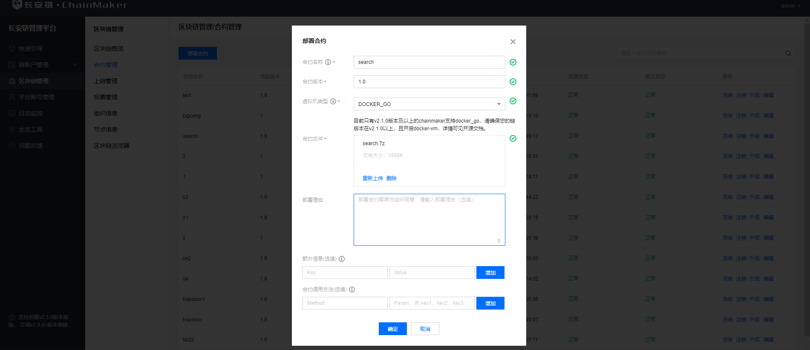
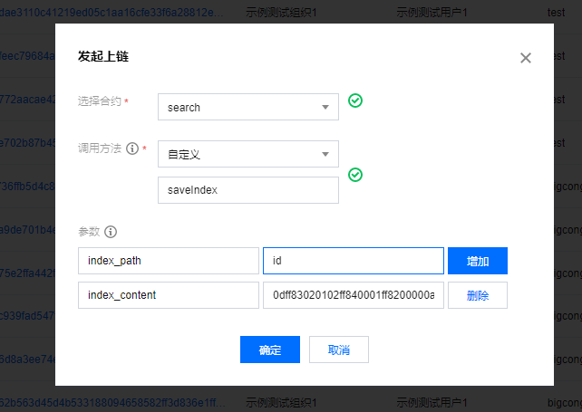
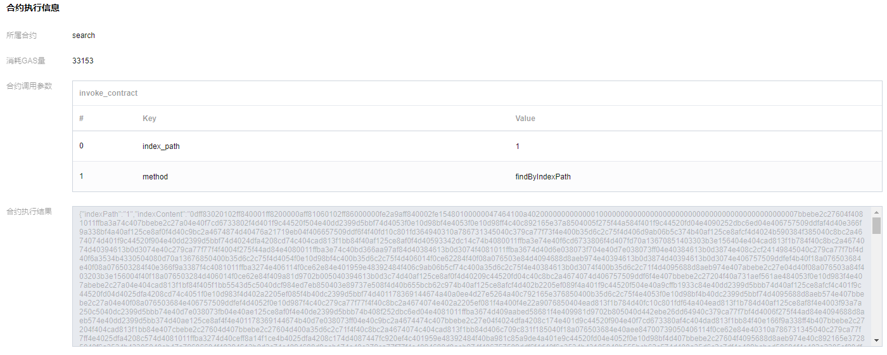
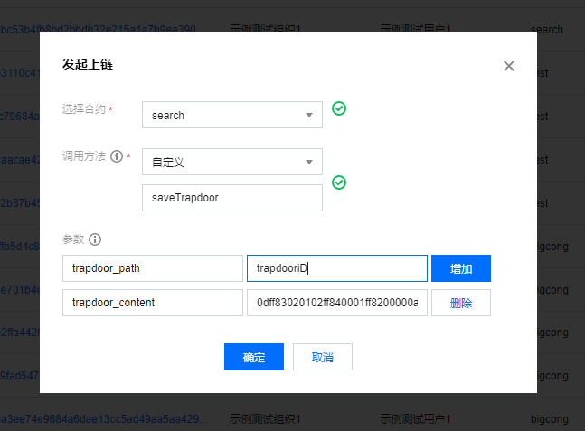
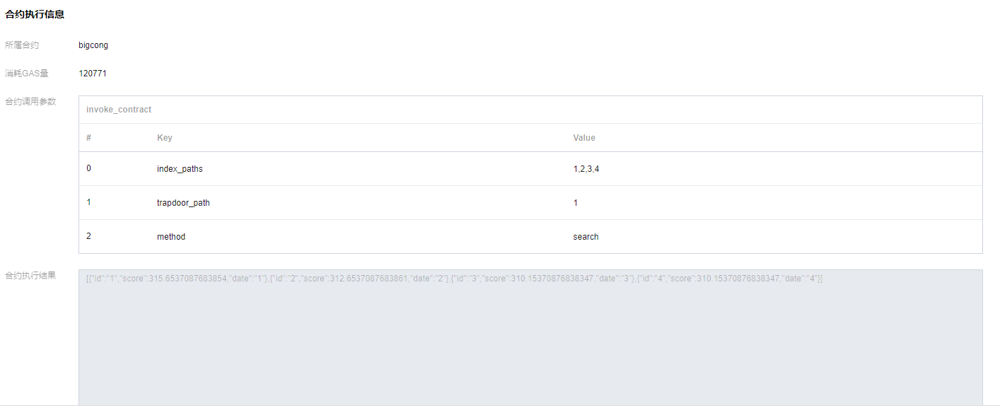
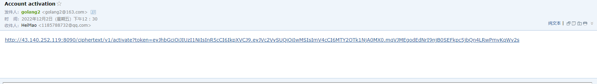

# 密文检索工具

## 简介

长安链引入密文检索，保护链上数据隐私的同时支持用户对链上密态数据进行搜索，提高了长安链的可用性以及适配更丰富的应用场景的可能性。

了解技术细节，请参考[密文检索技术文档](../tech/密文检索技术文档.md)。

## 编译&配置

下载代码

```bash
$ git clone  --depth=1 https://git.chainmaker.org.cn/ibpc/searchable-encryption.git
```

编译&运行方式如下：

### 密文检索服务

```bash
进入工作目录 $WORKDIR 比如 ~/chainmaker-xx 
cd xx
编辑配置文件
vim ./config/config.yaml
运行密文检索服务
go run main.go
```

密文检索依赖的配置文件在$WORKDIR/xxx/config.yaml

需要**注意**的是服务依赖MySQL数据库,请在启动前,做好准备工作,将数据库账号密码配置到相应的位置

其他配置项参考$WORKDIR/xxx/config.yaml中的注解。

### 智能合约编译&部署

为了方便用户理解密文检索工作的过程提供了搜索示例的智能合约,用户也可以根据业务自己定义搜索的智能合约;

智能合约的源码目录在$WORKDIR/xxx/contracts/目录下,编译生成合约参考[使用Golang进行智能合约开发章节](https://docs.chainmaker.org.cn/v2.3.0_alpha/html/instructions/使用Golang进行智能合约开发.html) 编译机上需要安装 7z 压缩工具;

已经编译好的合约文件$WORKDIR/xxx/contracts/DemoContract/目录下

部署自己编译好的合约文件;

需要**注意** 的是，在启动长安链时，需要开启 ***docker VM***。

## 整体流程说明

如果您还未体验过密文检索服务，可通过示例合约与链交互体验服务的主要流程，主要流程如下:

1. 首先,对确定需要构建检索的关键词,进行索引生成;
2. 其次,将示例的智能合约进行在链上部署的操作;
3. 将生成好的索引文件,进行上链的操作,如果有多个,重新这个步骤多次;
4. 当用户想查询某几个关键词时,先利用密文检索服务生成陷门文件;
5. 将生成好的陷门利用智能合约进行上链操作;
6. 调用示例合约的搜索方法,返回结果;

### 索引生成

利用关键词生成索引接口,多个关键词用逗号隔开

```bash
curl -H "Content-Type: application/json" -X POST -d '{"key":"indexkeyWord1, indexkeyWord2"}' "http://ip:port/ciphertext/v1/index"
```

### 合约部署

编译合约

```
./build.sh ContractName
或者
# 如果需要在其他系统环境下编译合约，请参考Golang的交叉编译修改go build命令。
go build -ldflags="-s -w" -o file_name

7z a file_name file_name
```

部署合约

利用长安链管理控制台部署合约



其他合约部署方式,参考:[使用Golang进行智能合约部署章节](https://docs.chainmaker.org.cn/v2.3.0_alpha/html/instructions/使用Golang进行智能合约开发.html) 

### 索引上链

利用长安链管理控制台调用合约进行索引上链

```go
index_path:唯一标记一个索引
index_conent:索引的内容
```



上链的结果可以通过findByIndexPath方法完成输出的参数为:index_path

其他上链方式参考:[使用Golang进行智能合约部署章节](https://docs.chainmaker.org.cn/v2.3.0_alpha/html/instructions/使用Golang进行智能合约开发.html) 



### 陷门生成

利用关键词生成陷门

```bash
curl -H "Content-Type: application/json" -X POST -d '{"key":"keyWord1, keyWord2"}' "http://ip:port/ciphertext/v1/trapdoor"
```

### 陷门上链

利用长安链管理控制台调用合约进行陷门上链



其他上链方式参考:[使用Golang进行智能合约部署章节](https://docs.chainmaker.org.cn/v2.3.0_alpha/html/instructions/使用Golang进行智能合约开发.html) 

### 搜索

搜索也是调用上链合约的方法

示例合约是search方法,参数是index_paths和trapdoor_path代表参与搜索的索引和陷门;



其他调用合约的方式参考:[使用Golang进行智能合约部署章节](https://docs.chainmaker.org.cn/v2.3.0_alpha/html/instructions/使用Golang进行智能合约开发.html) 

合约执行的结果解释:score代表单个文件和搜索陷门关键词的一个匹配程度,结果已经进行了排序;

## 合约进阶

为了满足更加丰富的应用场景,用户可以自定义查询合约

这里把重写合约要注意的点列一下

1. 存索引和陷门的合约存储的时候可以新增一系列参数:比如加密后的原文文件,或者其他附加信息
2. 在搜索函数里面,要先将索引和陷门函数进行解码(hex.DecodeString)
3. 文件得分的本质是进行向量之间的内积,然后进行排序

示例合约

```go
package main

import (
	"bytes"
	"encoding/gob"
	"encoding/hex"
	"encoding/json"
	"fmt"
	"sort"
	"strings"

	"chainmaker.org/chainmaker/contract-sdk-go/v2/pb/protogo"
	"chainmaker.org/chainmaker/contract-sdk-go/v2/sandbox"
	"chainmaker.org/chainmaker/contract-sdk-go/v2/sdk"
	"gonum.org/v1/gonum/mat"
)

// 合约结构体
type SearchContract struct {
}

// 需要上次的索引结构体,可以自定义
type Index struct {
	IndexPath    string `json:"indexPath"`
	IndexContent string `json:"indexContent"`
}

// 创建索引
func NewIndex(indexPath string, indexContent string) *Index {
	index := &Index{
		IndexPath:    indexPath,
		IndexContent: indexContent,
	}
	return index
}

// 陷门结构体
type TrapDoor struct {
	TrapDoorPath    string `json:"trapDoorPath"`
	TrapDoorContent string `json:"trapDoorContent"`
}

// 创建陷门
func NewTrapDoor(trapDoorPath string, trapDoorContent string) *TrapDoor {
	trapDoor := &TrapDoor{
		TrapDoorPath:    trapDoorPath,
		TrapDoorContent: trapDoorContent,
	}
	return trapDoor
}

// InitContract 安装合约时会执行此方法，必须
func (f *SearchContract) InitContract() protogo.Response {
	return sdk.Success([]byte("Init contract success"))
}

// UpgradeContract 升级合约时会执行此方法，必须
func (f *SearchContract) UpgradeContract() protogo.Response {
	return sdk.Success([]byte("Upgrade contract success"))
}

// InvokeContract the entry func of invoke contract func
func (f *SearchContract) InvokeContract(method string) protogo.Response {
	switch method {
	case "saveIndex":
		return f.saveIndex()
	case "findByIndexPath":
		return f.findByIndexPath()
	case "saveTrapdoor":
		return f.saveTrapdoor()
	case "findByTrapDoorPath":
		return f.findByTrapdoorPath()
	case "search":
		return f.search()
	default:
		return sdk.Error("invalid method")
	}
}

// save  保存索引的方法
func (f *SearchContract) saveIndex() protogo.Response {
	params := sdk.Instance.GetArgs()

	// 获取参数
	indexPath := string(params["index_path"])
	indexContent := string(params["index_content"])

	// 构建结构体
	index := NewIndex(indexPath, indexContent)

	// 序列化
	indexBytes, err := json.Marshal(index)
	if err != nil {
		return sdk.Error(fmt.Sprintf("marshal index failed, err: %s", err))
	}
	// 发送事件
	sdk.Instance.EmitEvent("topic_index", []string{index.IndexPath, index.IndexContent})

	// 存储数据
	err = sdk.Instance.PutStateByte("index_bytes", index.IndexPath, indexBytes)
	if err != nil {
		return sdk.Error("fail to save index bytes")
	}

	// 记录日志
	sdk.Instance.Infof("[save] indexPath=" + index.IndexPath)
	sdk.Instance.Infof("[save] indexContent=" + index.IndexContent)

	// 返回结果
	return sdk.Success([]byte(index.IndexPath + index.IndexContent))

}
// 查找已经保存的索引
func (f *SearchContract) findByIndexPath() protogo.Response {
	// 获取参数
	indexPath := string(sdk.Instance.GetArgs()["index_path"])

	// 查询结果
	result, err := sdk.Instance.GetStateByte("index_bytes", indexPath)
	if err != nil {
		return sdk.Error("failed to call get_state")
	}

	// 反序列化
	var index Index
	if err = json.Unmarshal(result, &index); err != nil {
		return sdk.Error(fmt.Sprintf("unmarshal index failed, err: %s", err))
	}

	// 记录日志
	sdk.Instance.Infof("[findByIndexPath] IndexPath=" + index.IndexPath)
	sdk.Instance.Infof("[findByIndexPath] IndexContent=" + index.IndexContent)

	// 返回结果
	return sdk.Success(result)
}

// save 保存陷门方法
func (f *SearchContract) saveTrapdoor() protogo.Response {
	params := sdk.Instance.GetArgs()

	// 获取参数
	trapdoorPath := string(params["trapdoor_path"])
	trapdoorContent := string(params["trapdoor_content"])

	// 构建结构体
	trapdoor := NewTrapDoor(trapdoorPath, trapdoorContent)

	// 序列化
	trapdoorBytes, err := json.Marshal(trapdoor)
	if err != nil {
		return sdk.Error(fmt.Sprintf("marshal trapdoor failed, err: %s", err))
	}
	// 发送事件
	sdk.Instance.EmitEvent("topic_trapdoor", []string{trapdoor.TrapDoorPath, trapdoor.TrapDoorContent})

	// 存储数据
	err = sdk.Instance.PutStateByte("trapdoor_bytes", trapdoor.TrapDoorPath, trapdoorBytes)
	if err != nil {
		return sdk.Error("fail to save index bytes" + err.Error())
	}

	// 记录日志
	sdk.Instance.Infof("[save] TrapDoorPath=" + trapdoor.TrapDoorPath)
	sdk.Instance.Infof("[save] TrapDoorContent=" + trapdoor.TrapDoorContent)

	// 返回结果
	return sdk.Success([]byte(trapdoor.TrapDoorPath + trapdoor.TrapDoorContent))

}
// 查找已经保存的陷门
func (f *SearchContract) findByTrapdoorPath() protogo.Response {
	// 获取参数
	trapPath := string(sdk.Instance.GetArgs()["trapdoor_path"])

	// 查询结果
	result, err := sdk.Instance.GetStateByte("trapdoor_bytes", trapPath)
	if err != nil {
		return sdk.Error("failed to call get_state")
	}

	// 反序列化
	var trapdoor TrapDoor
	if err = json.Unmarshal(result, &trapdoor); err != nil {
		return sdk.Error(fmt.Sprintf("unmarshal index failed, err: %s", err))
	}

	// 记录日志
	sdk.Instance.Infof("[findByTrapdoorPath] TrapDoorPath=" + trapdoor.TrapDoorPath)
	sdk.Instance.Infof("[findByTrapdoorPath] TrapDoorContent=" + trapdoor.TrapDoorContent)

	// 返回结果
	return sdk.Success(result)
}

// search 搜索方法
func (f *SearchContract) search() protogo.Response {
	params := sdk.Instance.GetArgs()

	// 获取参数
	indexPaths := string(params["index_paths"])
	trapdoorPath := string(params["trapdoor_path"])

	indexPathsSlice := strings.Split(indexPaths, ",")

	if len(indexPathsSlice) <= 0 {
		return sdk.Error("indexPathsSlice failed to Split")
	}
	indexAndID := make([]*IndexAndID, len(indexPathsSlice))
    //查找每一个索引,构建搜索参数
	for i, indexPath := range indexPathsSlice {
		indexBytes, err := sdk.Instance.GetStateByte("index_bytes", indexPath)
		if err != nil {
			return sdk.Error("indexContent failed to call get_state")
		}
		var index Index
		if err = json.Unmarshal(indexBytes, &index); err != nil {
			return sdk.Error(indexPath + "/" + fmt.Sprintf("unmarshal index failed, err: %s", err) + "/" + string(indexBytes) + "/" + indexPath)
		}
		v, err := hex.DecodeString(index.IndexContent)
		if err != nil {
			continue
		}
		var indexMat []*mat.VecDense
		err = Decode(v, &indexMat)
		if err != nil {
			continue
		}
		indexAndID[i] = &IndexAndID{
			Id:       index.IndexPath,
			IndexMat: indexMat,
			Date:     index.IndexPath,
		}
	}

	// 查找保存的陷门
	trapdoorBytes, err := sdk.Instance.GetStateByte("trapdoor_bytes", trapdoorPath)
	if err != nil {
		return sdk.Error("trapdoorBytes failed to call get_state")
	}
    //序列化并解码
	var trapDoor TrapDoor
	if err = json.Unmarshal(trapdoorBytes, &trapDoor); err != nil {
		return sdk.Error(fmt.Sprintf("unmarshal trapDoor failed, err: %s", err))
	}
	v, err := hex.DecodeString(trapDoor.TrapDoorContent)
	if err != nil {
		return sdk.Error("trapdoorBytes DecodeString failed")
	}
	var trapdoorMat IndexMat
	err = Decode(v, &trapdoorMat)
	if err != nil {
		return sdk.Error("trapdoorBytes Decode failed")
	}
    //搜索
	results := Search(indexAndID, trapdoorMat)
	b, err := json.Marshal(results)
	if err != nil {
		return sdk.Error("json.Marshal failed")
	}

	// 返回结果
	return sdk.Success(b)

}

type IndexMat []*mat.VecDense

type IndexAndID struct {
	Id string
	IndexMat
	Date string
}

type Result struct {
	Id    string  `json:"id"`
	Score float64 `json:"score"`
	Date  string  `json:"date"`
}

type Results []*Result

// Len 实现sort.Interface接口取元素数量方法
func (s Results) Len() int {
	return len(s)
}

// Swap 实现sort.Interface接口交换元素方法
/**
 * @Author peng
 * @Description
 * @Date 16:31 2022/6/28
 * @Param
 * @return
 **/
func (s Results) Swap(i, j int) {
	s[i], s[j] = s[j], s[i]
}

// Less 实现sort.Interface接口比较元素方法
func (s Results) Less(i, j int) bool {
	if s[i].Score != s[j].Score {
		return s[i].Score > s[j].Score
	}
	return s[i].Id < s[j].Id
}


// Search calculate result
func Search(indexs []*IndexAndID, trap IndexMat) (results Results) {
	if indexs == nil || trap == nil {
		return nil
	}
	for _, value := range indexs {
		result := new(Result)
		result.Id = value.Id
        //这里是核心语句 相似度等于两个向量的内积
		result.Score = mat.Dot(value.IndexMat[0], trap[0]) + mat.Dot(value.IndexMat[1], trap[1]) 
		result.Date = value.Date
		results = append(results, result)
	}
    //对结果排序
	sort.Sort(results)
	return results
}
// 解码函数
func Decode(data []byte, e interface{}) error {
	buf := bytes.NewBuffer(data)
	dec := gob.NewDecoder(buf)
	return dec.Decode(e)
}

func main() {
	err := sandbox.Start(new(SearchContract))
	if err != nil {
		sdk.Instance.Errorf(err.Error())
	}
}

```


## 密文检索SDK

密文检索的SDK是源代码的algorithm包下,主要集成了密文检索的算法,提供了四个接口

### 密钥生成: 
生成密钥 索引构建和陷门构建都需要用这个密钥 

```go
GenCipher(scope SEARCHSCOPE) *Cipher  
```

参数:

|    字段     | 类型 |              含义              |
| :---------: | :--: | :----------------------------: |
| SEARCHSCOPE | 枚举 | 搜索范围（英文，中文，中英文） |

返回结构体:  

|   字段   |  类型   |             含义             |         备注         |
| :------: | :-----: | :--------------------------: | :------------------: |
|    M1    |  矩阵   |         随机正定矩阵         |       0-1构成        |
|    M2    |  矩阵   |         随机正定矩阵         |       0-1构成        |
|    SK    |  向量   |           随机向量           |       0-1构成        |
| BaseUnit |   int   | BaseUnit相乘就等于矩阵的维度 |         必填         |
|    R     | float64 |            随机数            |        [0-1)         |
|  Scope   |  枚举   |           查找范围           | 字母 字母和数字 中文 |

其中BaseUnit*BaseUnit，理论上这个参数值可以自定义修改，参数会影响到矩阵维度和最后向量的大小，在一定范围是会提升精度；SDK中默认的值是实验得出比较合理的值；

反序列化接口生成密钥的接口
返回结构体每个参数比较大所以没有提供整体序列化的接口,建议每个元素单独序列化后利用下面的接口组合成密钥  

```go
InitCipher(baseUnit int, r float64, m1, m2, sk *mat.Dense, scope SEARCHSCOPE) *Cipher 
```

### 索引生成: 

利用第一步的密钥和需要被搜索的关键词构建索引, 输出是索引 

```go
BuildIndex(keys []string, cipher *keygen.Cipher) []*mat.VecDense   
```

输入参数:  

|  字段  |    类型    |      含义      | 备注 |
| :----: | :--------: | :------------: | :--: |
|  keys  | 关键词切片 | 被搜索的关键词 |      |
| cipher |    密钥    | 构建索引的密钥 |      |

### 陷门生成

利用第一步的密钥和需要搜索的关键词构建陷门,输出是陷门 

```go
GenTrapdoor(query []string, cipher *keygen.Cipher) []*mat.VecDense  
```

输入参数:

|  字段  |    类型    |      含义      | 备注 |
| :----: | :--------: | :------------: | :--: |
|  keys  | 关键词切片 |  搜索的关键词  |      |
| cipher |    密钥    | 构建索引的密钥 |      |

### 搜索

利用索引和陷门搜索出文件的得分  

```go
Search(indexs []*IndexAndID, trap Index) (results Results) 
```

输入参数:  

|  字段  |     类型      |         含义         | 备注 |
| :----: | :-----------: | :------------------: | :--: |
| indexs | []*IndexAndID | 索引 ID 加上额外信息 |      |
|  trap  |     向量      |      构建的陷门      |      |

IndexAndID 结构体  

| 字段  |  类型  |                      含义                      | 备注 |
| :---: | :----: | :--------------------------------------------: | :--: |
|  Id   | string |                    唯一标识                    |      |
| Index | Index  |               唯一标识对应的索引               |      |
| Date  | string | 结果中需要的额外的信息 例如 文件对应的下载链接 |      |

## 密文检索SDK调用示例

为了加深密文检索SDK的理解,做了一个简单的服务接入的Demo;

### 整体流程说明

1. 用户身份认证:注册用户的信息,校验用户身份;
2. 用户登录:登录后获取临时token;
3. 文件拥有者上传加密文件并根据关键词构建索引;
4. 文件拥有者给文件查询者授予查询权限;
5. 文件查询者根据关键词构建陷门,利用陷门查询结果,并下载加密的文件;
6. 文件查询者利用密钥解密文件;

### 用户身份认证

启动密文检索服务之后,用户通过下面的接口注册信息

```bash
curl -H "Content-Type: application/json" -X POST -d 
'{"userId": "x","userNickName": "x","mobileNumber": "x","userPassword": "x","mailBox": "x","remark": "x","role":"x"}' 
"http://ip:port/ciphertext/v1/users/add"
```

注册成功之后对应的邮箱会接收到激活链接,点击激活链接会进行一次密钥的交换,并激活账户;



这个密钥可以作为应用层加密的密钥也可以作为用户上传文件的加密的密钥;


这个过程完成了一次身份信息的确认与一次密钥交换的过程;

### 用户登录

通过下面的接口获取token,作为临时的身份令牌

```bash
curl -H "Content-Type: application/json" -X POST -d '{"userName":"01","userPassword":"UserPassword"}' "http://127.0.0.1:8090/ciphertext/v1/login"
```

### 上传文件并构建索引

参数说明

1. filePath:上传文件的路径;
2. token:用户的临时身份令牌;
3. keyWord:构建索引的关键字;
4. encryptionType:原始文件的加密方法,示例中支持国密sm4加密;
5. resourcePath:是文件存储的路径;

```bash
curl -H "Content-Type: application/json" -X POST -d '{"filePath":"./testdata/1.txt","token":"x","encryptionType":"sm4","resourcePath":"x"}' 
"http://127.0.0.1:8090/ciphertext/v1/file"
```

### 授予权限

文件拥有者给文件查询者授予查询权限;

参数说明 

1. act 是授予的权限,一般为查询(search) ;
2. path是授予那个目录下search的权限,目录对应文件上传对应的目录;
3. userId 是被授权用户的id;
4. token是文件拥有者的token;

```bash
curl -H "Content-Type: application/json" -X POST -d 
'{"act": "x","path": "x","userId": "x","token": ""}' "http://ip:port/ciphertext/v1/authority"
```

### 查询

根据关键词查询关联的文档;

```bash
curl -H "Content-Type: application/json" -X POST -d 
'{"keyWord": "x,x","resourcePath":"x","token": "x","exceptNum": x}' "http://ip:port/ciphertext/v1/file/search"
```

### 解密

可以通过查询的结果下载到加密的文件,利用解密接口最终可以得到解密后的文件;

参数说明 

1. key是解密文件的密钥;
2. filePath是加密文件的目录;
3. token是解密者的token;

```bash
curl -H "Content-Type: application/json" -X POST -d '{"key":"x","filePath":"x","token":"x"}' 
"http://ip:port/ciphertext/v1/decrypt"
```

