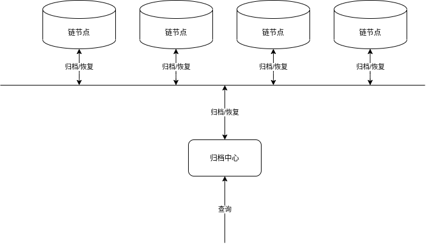
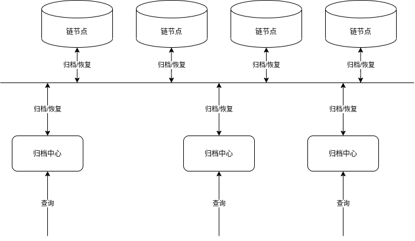

# 归档中心使用文档  

 点击此链接查看[归档中心设计方案](../tech/%E5%BD%92%E6%A1%A3%E4%B8%AD%E5%BF%83%E8%AE%BE%E8%AE%A1%E5%92%8C%E5%AE%9E%E7%8E%B0.md)

## 本文档内容如下
0. 部署方案
1. 启动归档中心服务
2. 使用cmc归档链上数据到归档中心服务
3. 使用sdk查询已经归档数据
4. FAQ

## `归档中心服务`部署方案  
- `归档中心`单实例部署.所有节点可共用一个归档中心服务。一条链可以仅部署一个归档中心。这样部署的优点在于节省存储空间。
- `归档中心`多实例部署.每个节点都可单独部署一个归档中心服务。这样部署的优点在于，各节点数据分离，可以做到查询已经归档数据的高可用。
<div align=center>

<center>归档中心单实例部署</center>
</div>  


<div align=center>

<center>归档中心多实例部署</center>
</div>  

## `归档中心服务`的安装,配置和运行    

### 环境依赖   
- linux 系统,开启mmap  
- golang 1.16+    
- 7zip压缩工具   
    - centos下安装: sudo yum -y install p7zip p7zip-plugins    
    - ubuntu下安装: sudo apt install p7zip-full   

### 版本对应关系  

| 链<br>chainmaker-go | 归档中心服务<br/>chainmaker-archive-service | CMC工具<br/>chainmaker-go | SDK-Go | SDK-Java |
|:------------------:| :-: |:-----------------------:|:------:| :-: |
|       v2.3.3       | v1.0.0 |         v2.3.3          | v2.3.4 |  v2.3.2 |


### [设计方案详见](../tech/%E5%BD%92%E6%A1%A3%E4%B8%AD%E5%BF%83%E8%AE%BE%E8%AE%A1%E5%92%8C%E5%AE%9E%E7%8E%B0.md)   

### 下载chainmaker-archive-service源码   
```bash
git clone -b v1.0.0 https://git.chainmaker.org.cn/chainmaker/chainmaker-archive-service.git
```
### 部署服务
下载代码后,可以根据代码编译docker镜像使用docker运行归档中心；也可以根据代码编译成二进制可执行文件运行归档中心
#### 编译,使用docker镜像
使用docker镜像,可以自行修改镜像挂载的目录(修改makefile中的MOUNT_PATH变量即可)
```bash
make docker-build # 编译docker镜像
make docker-start # 使用编译好的docker镜像启动服务
make docker-stop # 停止docker镜像服务
```
#### 编译,使用二进制: 
```bash
make build # 编译归档中心可执行二进制
make start # 启动归档中心服务
make stop # 停止归档中心服务 
 
```

### 服务配置 
- 整体配置概览  

```bash
├── configs # 归档中心服务配置文件夹
│   ├── config.yml # 归档中心服务配置
│   ├── server_cert # 如果开启GRPC的TLS,下面配置有效.为归档中心的证书和私钥
│   │   ├── archive-server.key # 归档中心的私钥
│   │   └── archive-server.pem # 归档中心的证书
│   └── trust_list # 如果开启了GRPC的TLS,为连接归档中心的CMC所使用的根证书
│       └── baec-client-root.pem # 签发CMC的根证书
```
- config.yml 服务配置文件说明  

```bash
# Logger settings
log: # 日志配置 
  # Logger configuration file path.
  log_path: ../log # 日志输出的根路径  
  log_level: debug 
  log_in_console: false
  show_color: true
  max_size: 200 # MB
  max_backups: 3 
  max_age: 3 # day 
  compress: false
# api server setting 

http: # http服务配置
  port: 13119  
  ratelimit:
    # Ratelimit switch. Default is false.
    enabled: false

    # Rate limit type
    # 0: limit globally, 1: limit by ip
    type: 0

    # Token number added to bucket per second.
    # -1: unlimited, by default is 10000.
    token_per_second: -1

    # Token bucket size.
    # -1: unlimited, by default is 10000.
    token_bucket_size: -1

  white_list: # 白名单配置
    enabled: false 
    address:
      - 127.0.0.1      

# RPC service setting
rpc: # grpc 服务配置 
  # RPC port
  port: 13120 # grpc port    

  # Rate limit related settings
  # Here we use token bucket to limit rate.
  ratelimit:
    # Ratelimit switch. Default is false.
    enabled: false

    # Rate limit type
    # 0: limit globally, 1: limit by ip
    type: 0

    # Token number added to bucket per second.
    # -1: unlimited, by default is 10000.
    token_per_second: -1

    # Token bucket size.
    # -1: unlimited, by default is 10000.
    token_bucket_size: -1

  white_list: # rpc接口白名单配置
    enabled: false 
    address:
      - 127.0.0.1  
  tls_enable : false  # 只有使用RPC的TLS的时候才设置为true，其余为false 
  # RPC TLS settings
  tls: # RPC的TLS配置 
    # RPC TLS private key file path
    priv_key_file:  ../configs/server_cert/archive-server.key # 私钥
    # RPC TLS public key file path
    cert_file:      ../configs/server_cert/archive-server.pem # 证书
    trust_ca_list: # 可调用RPC端的签发根证书  
     # - ../configs/trust_list/archive-client.pem
      - ../configs/trust_list/baec-client-root.pem
     # - "configs/trust_list/ca1.ca"
     # - "configs/trust_list/ca2.ca"

  # RPC server max send/receive message size in MB
  max_send_msg_size: 200
  max_recv_msg_size: 200  


# Monitor related settings
monitor: # prometheus 监控配置
  # Monitor service switch, default is false.
  enabled: false

  # Monitor service port
  port: 13122

# PProf Settings
pprof: # golang的pprof配置   
  # If pprof is enabled or not
  enabled: false

  # PProf port
  port: 13123

# Storage config settings
storage_template:
  # 存储系统信息
  store_path: ../service_datas  
  # 存储链的block信息
  bfdb_path: ../service_datas
  # 存储链的索引信息
  index_path: ../service_datas
  # 存储链的压缩信息
  compress_path: ../service_datas
  # 存储链的解压缩信息 
  decompress_path: ../service_datas

  # async write block in file block db to disk, default: false, so default is sync write disk
  logdb_segment_async: false # 是否异步写入,false的时候不会丢数据；

  # file size of .fdb, MB, default: 20
  logdb_segment_size: 128 # 归档中心存储区块文件的单个文件大小限制,可以与链配置一致  

  segment_cache_size: 10  # 系统读文件时同时保留的最大文件句柄数目

  use_mmap: true  # 操作系统需要支持mmap
  # 扫描已经解压或已经压缩的文件列表的时间间隔,单位为秒
  scan_interval_seconds: 300
  # 最大保留已解压或已压缩文件的时长  ,单位为秒.系统按照 scan_interval_seconds频率扫描已压缩或解压缩的文件,发现该文件上次读取时间与当前时间间隔大于retain_seconds,则删除该文件(节省磁盘空间)
  retain_seconds: 3600
  # compress_method: 7z # 7z or gzip
  compress_seconds: 2000 # 单位为秒,压/解压缩超时时间,配置与logdb_segment_size 的大小有关系,文件大小越大,这个值设置的越大.
  leveldb_config: # leveldb的配置,
    bloom_filter_bits: 10 

```


### 记录`归档中心服务`的token  
记录服务生成的token到server_token. token用于调用压缩归档中心数据和管理证书的接口使用   
```bash
cd [log-dir] # 进入配置文件中指定的日志目录
grep token processor.log 
```


## 使用`CMC`工具归档链上数据到`归档中心服务`    

### 下载支持CMC归档中心的源码   
```bash
git clone -b v2.3.3  https://git.chainmaker.org.cn/chainmaker/chainmaker-go.git
```

### 编译CMC工具:   

```bash
cd tools/cmc
go build -o cmc  
```

### CMC支持归档中心配置概览: 
- 配置概览: 如果GRPC开启了TLS验证,key和pem才有用,否则无用  
```bash
├── testdata
├──── archivecenter
│   ├──── archive-client.key # Grpc调用客户端的私钥   
│   ├──── archive-client.pem # Grpc调用客户端的证书  
│   ├──── baec-root.pem # 如果归档中心服务GRPC开启了TLS,这个是签发归档中心服务证书的根证书
├── cmc # CMC可执行文件
├── main.go # CMC源码入口文件

```
- config.yml文件解析:   

```bash

  archive:
    # 数据归档链外存储相关配置
    # 如果使用了新版本的归档中心,这个地方配置为archivecenter
    type: "archivecenter"  # archivecenter 归档中心, mysql mysql数据库    
    dest: "root:123456:localhost:3306"
    secret_key: xxx
  # # 如果启用了归档中心,可以打开下面的归档中心配置  
  archive_center_query_first: false # 如果为true且归档中心配置打开,那么查询数据优先从归档中心查询;
  archive_center_config:
    chain_genesis_hash: cc94caf0ad4540b28e6b5e0ee10dd6c6375d68d10e912c56875a7139af55f6d0  #归档的链的块高为0的区块hash(hex编码)
    archive_center_http_url: http://127.0.0.1:13119 # 归档中心http服务地址,
    request_second_limit: 10 # 归档中心http请求超时时间,秒单位
    rpc_address: 127.0.0.1:13120 #归档中心rpc服务地址
    tls_enable: false # 不开启grpc的tls的时候,如下配置可忽略
    tls:
      server_name: archiveserver1.tls.wx-org.chainmaker.org # 归档中心tls服务注册的名称
      priv_key_file: ./testdata/archivecenter/archiveadmin1.tls.key  # cmc侧做tls的私钥
      cert_file: ./testdata/archivecenter/archiveadmin1.tls.crt  # cmc侧做tls的证书
      trust_ca_list:
        - ./testdata/archivecenter/ca.crt    # 归档中心服务根证书
    max_send_msg_size: 200  # grpc 发送最大消息(MB为单位)
    max_recv_msg_size: 200 # grpc 接收最大消息(MB为单位)


```
其中创世块chain_genesis_hash的获取可以采用如下步骤:  
```bash
# 首先使用cmc从链上查询创世块的blockhash
./cmc query block-by-height 0 \
--sdk-conf-path './testdata/sdk_config.yml' 
# 调用归档中心http接口,获取hex编码的genesis_block_hash,其中[blockhash]即为上面cmc查询出来的base64编码的hash
curl -X POST 'http://127.0.0.1:13119/get_hashhex_by_hashbyte' -d '{"block_hash": [blockhash]}'
```

### 使用CMC工具归档数据
```bash
# 归档链上 区块块高的1-100的数据 
./cmc archive dump 100 --sdk-conf-path ./testdata/sdk_config.yml --mode quick

```
### cmc查询归档中心当前已归档数据状态命令
```bash
./cmc archive query archived-status --sdk-conf-path ./testdata/sdk_config.yml

```
### cmc查询链上当前已归档数据状态命令
```bash
./cmc archive query chain-archived-status --sdk-conf-path ./testdata/sdk_config.yml
```

### cmc查询归档中心,根据高度查区块命令
```powershell
./cmc archive query block-by-height 20  --sdk-conf-path ./testdata/sdk_config.yml
```

### cmc查询归档中心,根据txId查询区块命令
```powershell
./cmc archive query block-by-txid 17221b132a25209aca52fdfc07218265e4377ef0099d46a49edfd032001fc2be --sdk-conf-path ./testdata/sdk_config.yml
```

### cmc查询归档中心,根据txId查询交易命令
```powershell
./cmc archive query tx 17221b132a25209aca52fdfc07218265e4377ef0099d46a49edfd032001fc2be  --sdk-conf-path ./testdata/sdk_config.yml
```

### cmc查询归档中心,根据block hash查询区块命令

```powershell
./cmc archive query block-by-hash 17221b132a25209aca52fdfc07218265e4377ef0099d46a49edfd032001fc2be --sdk-conf-path ./testdata/sdk_config.yml
```

### cmc清理链上区块数据命令
```powershell
./cmc archive archive 10000 --timeout 20 --sdk-conf-path ./testdata/sdk_config.yml 
```

### restore 恢复链上区块数据命令,恢复到指定高度,恢复过程按照区块块高倒序恢复
```powershell
./cmc archive restore 3000 --timeout 20 --sdk-conf-path ./testdata/sdk_config.yml 
```


## 使用`SDK`透明查询区块和交易信息

### 下载sdk源码 
```bash
git clone -b v2.3.4 https://git.chainmaker.org.cn/chainmaker/sdk-go.git
```

### 如果启用了归档中心在sdk的配置文件中增加如下配置: 
```bash
  archive:
    # 数据归档链外存储相关配置
    # 如果使用了新版本的归档中心,这个地方配置为archivecenter
    type: "archivecenter"  # archivecenter 归档中心, mysql mysql数据库    
    dest: "root:123456:localhost:3306"
    secret_key: xxx
  # # 如果启用了归档中心,可以打开下面的归档中心配置  
  archive_center_query_first: true # 如果为true且归档中心配置打开,那么查询数据优先从归档中心查询 
  archive_center_config:
    chain_genesis_hash: cc94caf0ad4540b28e6b5e0ee10dd6c6375d68d10e912c56875a7139af55f6d0  #归档的链的块高为0的区块hash(hex编码)
    archive_center_http_url: http://127.0.0.1:13119 # 归档中心http服务地址,
    request_second_limit: 10 # 归档中心http请求超时时间,秒单位
    rpc_address: 127.0.0.1:13120 #归档中心rpc服务地址
    tls_enable: false # 不开启grpc的tls的时候,如下配置可忽略
    tls:
      server_name: archiveserver1.tls.wx-org.chainmaker.org # 归档中心tls服务注册的名称
      priv_key_file: ./testdata/archivecenter/archiveadmin1.tls.key  # cmc侧做tls的私钥
      cert_file: ./testdata/archivecenter/archiveadmin1.tls.crt  # cmc侧做tls的证书
      trust_ca_list:
        - ./testdata/archivecenter/ca.crt    # 归档中心服务根证书
    max_send_msg_size: 200  # grpc 发送最大消息(MB为单位)
    max_recv_msg_size: 200 # grpc 接收最大消息(MB为单位)
```

### sdk修改的方法列举如下:
- GetChainConfigByBlockHeight(blockHeight uint64) (*config.ChainConfig, error)
- GetTxByTxId(txId string) (*common.TransactionInfo, error)
- GetTxWithRWSetByTxId(txId string) (*common.TransactionInfoWithRWSet, error)
- GetBlockByHeight(blockHeight uint64, withRWSet bool) (*common.BlockInfo, error)
- GetBlockByHash(blockHash string, withRWSet bool) (*common.BlockInfo, error) 
- GetBlockByTxId(txId string, withRWSet bool) (*common.BlockInfo, error)
- GetFullBlockByHeight(blockHeight uint64) (*store.BlockWithRWSet, error)
- GetBlockHeaderByHeight(blockHeight uint64) (*common.BlockHeader, error)
- GetMerklePathByTxId(txId string) ([]byte, error)
- GetBlockByHeightTruncate(blockHeight uint64, withRWSet bool, truncateLength int,truncateModel string)(*common.BlockInfo, error)
- GetTxByTxIdTruncate(txId string, withRWSet bool, truncateLength int,truncateModel string) (*common.TransactionInfoWithRWSet, error)

## 使用`HTTP`请求直接调用`归档中心服务`的接口
- 接口分为两类:
    - 管理类接口: 压缩已归档数据接口(/admin/compress_under_height)；若开启了GRPC的TLS功能,增加CA证书接口(/admin/add_ca)；这两个接口使用特别的token也就是部署服务时候写入到server_token文件的值
    - 普通查询类接口
- [归档服务的http接口文档](./%E5%BD%92%E6%A1%A3%E4%B8%AD%E5%BF%83HTTP%E6%8E%A5%E5%8F%A3.md)  

## FAQ
- Q:归档中心和链节点必须一一对应吗?  
- A: 归档中心不必和节点一一对应.归档中心可以归档(也即存储)任意节点的数据,并提供查询功能. 所以如果查询已经归档数据的需求比较高的情况下,可以部署多个归档中心提供查询
- Q:已经在链上做了restore,但是再做archive或者restore失败了
- A: 底链的restore和archive都是异步任务,相当耗时.底链会记录一个当前是否正在restore/archive的状态,来确保不会出现多个archive/restore任务并发执行
- Q: 执行archive指令,失败了
- A: 可能有如下原因: 1. 链上区块数目比较少,还不足以触发清理的操作,可以调整底链的配置项目 unarchive_block_height(在chainmaker.yml的storage模块中)小一点.重启底链再试一下；2. archive所在高度及以下没有可以清理的文件,可以继续运行区块链生产更多区块以后再做清理命令
- Q: 执行archive指令,没有权限
- A: archive指令和restore指令都是高权限操作,需要admin身份
- Q: 执行archive指令,清理的是所有节点的数据吗?
- A: archive指令针对的是单节点,而不是所有节点生效；执行archive指令的是sdk的yaml文件中指定的节点(在nodes中指定一个节点) 
- Q: sdk/cmc中的配置archive_center_query_first怎么设置?
- A: archive_center_query_first,这个开关如果打开.那么使用sdk或者cmc的时候会优先从归档中心上查数据,如果查不到才会到链上去查询；所以在dump数据的时候,这个值应该设置为false,因为cmc或者sdk需要从链上查数据,再将数据转移到归档中心. 
