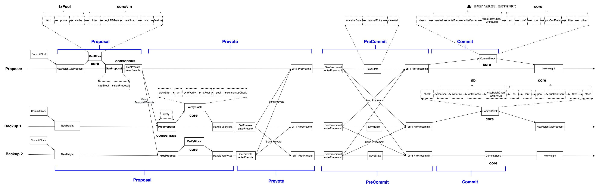
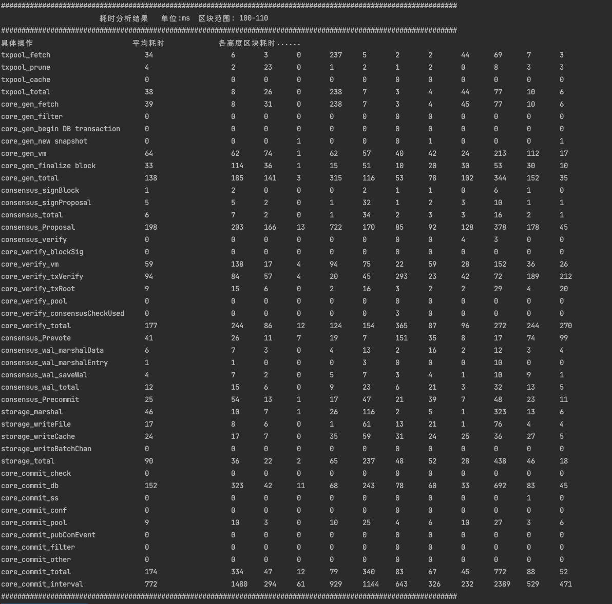

# 性能分析工具

## 概述

  `time_counter_2.3.1.sh`是长安链性能分析工具，可用于分析`TBFT`共识下，一轮完整共识过程中各个阶段的耗时情况，帮助用户了解底链性能。  
  注意，采用此性能分析工具，需要确保`txpool`、`core`、`consensus`、`storage`模块开启了`INFO`级别的日志。  
  可在 [下载性能分析工具](../download/time_counter_2.3.1.sh) 进行下载。

## 耗时分析

  

(可右键通过新标签打开图片查看放大图)

### 整体流程
整体共识流程如上图所示，主要分为四个阶段，分别是`Proposal`,`Prevote`,`Precommit`,`Commit`，下面分别从共识主从节点视角介绍四个阶段的流程。

- Proposal阶段：开始新一轮共识时，会选举出新的主节点，主节点的共识模块consensus会通知核心引擎模块core构造区块，共识模块收到新的区块后，将会构造提案并广播给其他的从节点，自己则进入到`prevote`阶段并广播prevote投票。
- Proposal阶段：从节点的共识模块consensus收到主节点广播的提案后，将会通知自身的核心引擎模块core验证并执行区块，区块有效则进入到`prevote`阶段并广播自己的prevote投票。
- Prevote阶段：主节点和从节点，在`prevote`阶段收到2f+1张prevote投票后，将会进入到`precommit`阶段。
- Precommit阶段：主节点和从节点进入到`precommit`阶段后，会构造并广播自己的到precommit投票，并将此时的共识状态写入wal中，确保重启时恢复到最新的共识状态，在收到2f+1张precommit投票后，将会进入到`commit`阶段。
- Commit阶段：主从节点进入到`commit`阶段后，会通知自身的核心引擎模块core提交区块，core调用存储模块将区块写入数据库，并通知共识模块进入下一高度区块的共识流程。

### 具体操作
此部分细化了上述整体流程中各个阶段的具体操作，性能分析工具会根据关键日志检索出各具体操作的耗时情况。
1. 主节点core模块构造区块和执行交易GenBlock
   - fetch: 交易池检索一批交易用于构造区块；
   - prune：交易池调用存储模块进行增量防重；
   - cache：在区块剪裁模式下，交易池缓存fetch的交易，以便从节点缺失这些交易时，可向主节点请求。
   - filter：布谷鸟对txId进行格式和时间校验；
   - begin DB transaction：采用sql存储时，开启一个事务；
   - new snapshot：执行交易前，创建snapshot，作为这个区块执行时的快照；
   - vm：交易并行调度执行和DAG构建；
   - finalize block: 计算区块头中交易默克尔树根、读写集树根、DAG树根；
   
2. 主节点consensus模块构造提案GenProposal 
   - signBlock: 计算区块哈希值和对区块签名；
   - signProposal: 对提案进行签名；  
   
3. 从节点consensus模块验证提案ProcProposal  
   - verify：验证主节点身份和验证提案签名；  

4. 从节点core模块验证区块和执行交易VerifyBlock
   - blockSign: 验证区块签名；
   - vm: 按DAG顺序执行交易；
   - txVerify：core模块从交易池取出区块中交易和验证交易（对于区块中在交易池的交易只需比对交易哈希是否一致；对于区块中不在交易池中的交易会进行交易格式、权限、时间戳及防重检查）；
   - txRoot：计算并校验三颗树根是否有效；
   - pool：区块剪裁模式下，对区块进行恢复；
   - consensusCheckUsed: 对于同步过来的区块，验证区块中QC是否有效；  

5. 从节点Prevote阶段 
   - 从节点prevote阶段主要操作包括构造自身的prevote投票并对收到的2f+1张prevote投票进行验签，及投票的网络广播；  

6. 主从节点Precommit阶段
   - 主从节点precommit阶段主要操作包括构造自身的precommit投票并对收到的2f+1张precommit投票进行验签，及投票的网络广播；
   - 共识状态写入wal文件：marshalData和marshalEntry为序列化共识状态操作，saveWal为将序列化结果写入wal文件；  

7. 主从节点提交区块CommitBlock
   - check: core模块验证区块高度和区块前置哈希是否合法；
   - marshal：DB模块对区块和交易读写集进行序列化；
   - writeFile：DB模块序列化结果写入wal文件；
   - writeCache：DB模块对区块信息写缓存；
   - writeBatchChan：DB模块将区块信息放入顺序写channel； （快速写模式）
   - writeKvDB：DB模块将区块信息写入数据库； （普通写模式）
   - ss：清除snapshot；
   - conf：如果是配置交易则进行配置变更；
   - pool：交易池删除该区块中的交易并将旁枝区块中的交易重新放回交易池；
   - pubConEvent：对区块中交易事件进行通知；
   - filter：将区块中交易加入到布谷鸟过滤器；
   - other：添加监控记录；  

8. 其他操作 
   - 主要是模块间通过msgbus交互的操作、主节点广播proposal到从节点接受proposal间的网络传递等过程； 
   - 还有部分操作，底链关键日志中并未进行记录；
    
## 使用说明及分析
使用说明：  
1. 下载性能分析工具，并赋予可执行权限；
2. 将各个共识节点包含想要分析的区块高度范围的日志拷贝到性能分析工具所有目录下，并将对应节点的日志命名为system.log.1, system.log.2, system.log.3，system.log.4等;
3. 运行脚本，传入共识节点数目，起始区块高度start_height，结束区块高度end_height；  

使用示例：  
   > ./time_counter_2.3.1.sh 4 100 110

分析结果：
  

1.一轮共识流程整体耗时  
> core_commit_interval = (1)主节点core模块GenBlock时间 + (2)主节点consensus模块GenProposal时间 + (3)从节点consensus模块ProcProposal时间 + (4)从节点core模块VerifyBlock时间 + (5)从节点prevote阶段耗时 + (6)主从节点precommit阶段耗时 + (7)主从节点core模块CommitBlock时间 + (8) 其他操作时间      
  
2.重叠时间说明  
- txpool_total 是主节点交易池中fetch、prune、cache三部分时间的加和；
- core_gen_fetch 即交易池txpool_total的时间，core模块也进行了记录；
- core_gen_total 是主节点core模块构造区块的整体时间；
- consensus_total 是主节点consensus模块对区块签名和构造提案的时间；
- consensus_proposal 是主节点proposal阶段整体耗时，包括了core模块构造区块和consensus模块构造提案的时间；
- core_verify_total 是从节点core模块验证区块和执行交易的总时间；
- storage_total 是存储写区块和读写集等信息的总时间；
- core_commit_db 即存储模块storage_total的时间，core模块也进行了记录；
- core_commit_total 是core模块提交区块的总时间；
- core_commit_interval 是此区块的一轮共识总时间；

