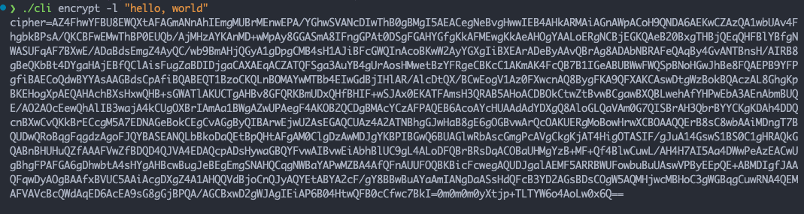
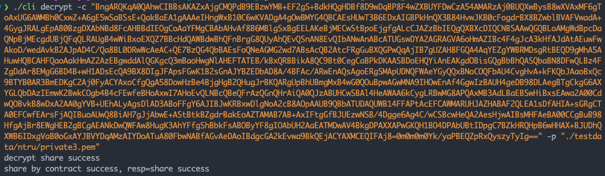
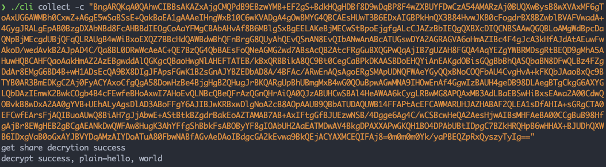

# 抗量子多方安全计算使用指南

##  简介

长安链引入抗量子多方安全计算工具，构建了面向长安链的抗量子门限原语，基于线性秘密分享方案进行私钥的安全分割，降低了密钥泄露风险，可支持多方联合授权数据。

了解技术细节，请参考[抗量子多方安全计算技术文档](../tech/抗量子多方安全计算技术文档.md)

## 编译&配置

下载代码

```bash
git clone https://git.chainmaker.org.cn/chainmaker/post-quantum-cryptography.git
```

配置信息

```bash
进入工作目录 $WORKDIR 比如 ~/chainmaker-xx 
cd xx
编辑配置文件，该文件是长安链 go-sdk 的配置文件
vim ./config/config.yaml
```

合约编译&部署

为了方便用户理解多方安全计算的过程提供了多方解密的智能合约，用户也可以根据业务自己定义智能合约;

智能合约的源码目录在 `$WORKDIR/xxx/contracts/`目录下，编译生成合约参考[使用Golang进行智能合约开发章节](https://docs.chainmaker.org.cn/v2.3.0_alpha/html/instructions/%E4%BD%BF%E7%94%A8Golang%E8%BF%9B%E8%A1%8C%E6%99%BA%E8%83%BD%E5%90%88%E7%BA%A6%E5%BC%80%E5%8F%91.html) 编译机上需要安装 7z 压缩工具，在`$WORKDIR/xxx/contracts/`目录下执行 `sh ./build.sh` 即可编译合约。

已经编译好的合约文件 `$WORKDIR/xxx/testdata/contract/`目录下

部署自己编译好的合约文件;

需要**注意** 的是，在启动长安链时，需要开启 ***docker VM***。

为了方便用户，提供了一种简洁的部署合约的方式：

```bash
# 首先编译出可执行文件
make client
# 执行如下命令，部署合约（前提：长安链的 go-sdk 配置文件配置好，合约编译好）
./cli deploy 
```

## 整体流程说明

 主要流程如下：

1. 确定系统门限设置， $n$ 代表密钥份额总数， $t$ 代表门限值，超过门限值个解密份额可以恢复明文数据
2. 运行密钥生成算法，生成公钥以及$n$个密钥份额，由各个节点掌管
3. 系统内的用户利用公钥加密数据
4. 数据用户（数据使用者）对密文数据进行解密， 通过智能合约向节点请求解密数据
5. 节点收到解密请求，执行部分解密，发送解密份额给数据用户（数据使用者）
6. 数据用户（数据使用者）收集解密份额恢复出明文数据

### 合约部署

```bash
./cli deploy -n 合约名称 -f 合约文件位置 -s go-sdk 配置文件位置
# -n 合约名称，默认值 ntru
# -f 合约文件位置，默认值 ./testdata/contract/ntru_contract.7z
# -s go-sdk 配置文件位置，默认值 ./config/config.yaml
```

### 密钥生成

```bash
./cli keygen
# 默认生成 3/5 门限密钥，若需改为其它门限，可修改
# 生成的证书在 $WORKDIR/xxx/testdata/ntru/
```

### 用户进行加密

```bash
./cli encrypt -l plain-text -p 证书位置
# plain-text 即需要加密的明文
# -p 证书位置，默认值 ./testdata/ntru/private0.pem
```



### 节点部分解密

```bash
./cli decrypt -n 合约名称 -c 密文 -p 证书位置 -s go-sdk 配置文件位置
# -n 合约名称，默认值 ntru
# -s 密文, 默认值为空
# -p 证书位置，默认值 ./testdata/ntru/private0.pem
# -s go-sdk 配置文件位置，默认值 ./config/config.yaml
```



### 数据用户（数据使用者）最终解密

```bash
./cli collect -n 合约名称 -c 密文 -s go-sdk 配置文件位置
# -n 合约名称，默认值 ntru
# -s 密文, 默认值为空
# -s go-sdk 配置文件位置，默认值 ./config/config.yaml
```



### 实例合约

```go
/*
Copyright (C) BABEC. All rights reserved.
Copyright (C) Beijing Advanced Innovation Center for Future Blockchain
and Privacy Computing. All rights reserved.

SPDX-License-Identifier: Apache-2.0
*/

package main

import (
	"encoding/json"
	"fmt"

	"chainmaker.org/chainmaker/contract-sdk-go/v2/pb/protogo"
	"chainmaker.org/chainmaker/contract-sdk-go/v2/sandbox"
	"chainmaker.org/chainmaker/contract-sdk-go/v2/sdk"
)

// NTRUContract 合约结构体
type NTRUContract struct {
}

// InitContract 安装合约时会执行此方法，必须
func (f *NTRUContract) InitContract() protogo.Response {
	return sdk.Success([]byte("Init contract success"))
}

// UpgradeContract 升级合约时会执行此方法，必须
func (f *NTRUContract) UpgradeContract() protogo.Response {
	return sdk.Success([]byte("Upgrade contract success"))
}

// InvokeContract the entry func of invoke contract func
func (f *NTRUContract) InvokeContract(method string) protogo.Response {
	switch method {
	case "share":
		return f.share()
	case "getshare":
		return f.getShare()
	default:
		return sdk.Error("invalid method")
	}
}

// share 共享部分解密
func (f *NTRUContract) share() protogo.Response {
	params := sdk.Instance.GetArgs()

	// 获取参数
	cipherHash := string(params["cipher_hash"])
	decryptShare := string(params["decrypt_share"])

	// 查询已有
	result, err := sdk.Instance.GetStateByte("cipher_hash", cipherHash)
	if err != nil {
		return sdk.Error(fmt.Sprintf("failed to call get state, %s", err))
	}

	var decryptShares = make(map[string]struct{})
	if len(result) != 0 {
		err = json.Unmarshal(result, &decryptShares)
		if err != nil {
			return sdk.Error(fmt.Sprintf("unmarshal decrypt shares failed, err: %s", err))
		}
	}

	decryptShares[decryptShare] = struct{}{}

	// 序列化
	decryptSharesBytes, err := json.Marshal(decryptShares)
	if err != nil {
		return sdk.Error(fmt.Sprintf("marshal decrypt shares failed, err: %s", err))
	}

	// 发送事件
	sdk.Instance.EmitEvent("cipher_hash", []string{cipherHash, decryptShare})

	// 存储数据
	err = sdk.Instance.PutStateByte("cipher_hash", cipherHash, decryptSharesBytes)
	if err != nil {
		return sdk.Error("fail to save decrypt shares bytes")
	}

	// 记录日志
	sdk.Instance.Infof("[save] cipherHash=" + cipherHash)
	sdk.Instance.Infof("[save] decryptShare=" + decryptShare)

	return sdk.Success([]byte("share success"))
}

// getShare 获取部分解密
func (f *NTRUContract) getShare() protogo.Response {
	params := sdk.Instance.GetArgs()

	// 获取参数
	cipherHash := string(params["cipher_hash"])

	// 查询已有
	result, err := sdk.Instance.GetStateByte("cipher_hash", cipherHash)
	if err != nil {
		return sdk.Error(fmt.Sprintf("failed to call get state, %v", err))
	}

	// 记录日志
	sdk.Instance.Infof("[save] cipherHash=" + cipherHash)
	sdk.Instance.Infof("[save] decryptShare=" + string(result))

	return sdk.Success(result)
}

func main() {
	err := sandbox.Start(new(NTRUContract))
	if err != nil {
		sdk.Instance.Errorf(err.Error())
	}
}

```
