# 智能合约漏洞检测工具

<style>
table
{
    margin: auto;
}
</style>

## Rust合约漏洞检测工具

### WANA开源设计文档

#### 相关技术

##### 符号执行基本原理

在20世纪70年代，当时的软件正确性测试方法主要分为两类：
- 以**模糊测试**为代表的随机性测试方法，但其具有的盲目性和随机性使其无法提供完整可靠的测试结果。
- 以模型检测为代表的**形式化证明方法**，通过归纳法来证明程序是否具有期望的性质，但证明过程的复杂性使其在面对大规模程序时几乎不可用。

在这样的背景之下，1976年Jame C. King提出了符号执行技术，可以将其看作是上述两种方法的折中。该技术可以在无法获取程序运行信息的情况下，仍对程序进行全面而快速的自动化安全性检测。

符号执行技术的核心思想是**通过使用抽象的符号代替具体值来模拟程序的执行**，当遇到分支语句时，它会探索每一个分支, 将分支条件加入到相应的路径约束中，若约束可解，则说明该路径是可达的。符号执行的目的是在给定的时间内，尽可能的探索更多的路径。

我们举个简单的例子，如下是一段简单的代码，其中包含了较为复杂的分支条件：
```C
int m=M, n=N, q=Q; 
int x1=0,x2=0,x3=0;
if(m!=0){
    x1=-2;
}
if(n<12){
    if(!m && q){
        x2=1;
    }
    x3=2;
}
assert(x1+x2+x3!=3)
```
这段C语言代码接收M、N、Q三个变量作为输入，输出是x1,x2,x3三个变量之和。程序内部又包含了若干个分支，不同输入下会走不同的分支。
传统情况下对这段代码进行测试，需要构造若干组M、N、Q的输入，以覆盖程序的所有执行分支，然而对于分支庞大的程序，这样会有巨大的测试开销。
符号执行技术，会用**抽象的符号值**代替具体的输入值来进行程序的测试。程序的输入就是M、N和Q。在执行时遇到分支时，会自动分裂为左右两个分支，同时携带上约束条件，探索不同分支的后续执行。如图所示：
<div align=center>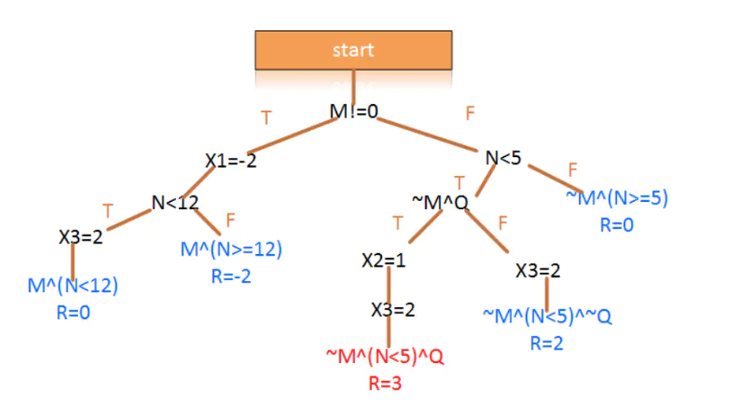</div>
<center>图 1  符号执行示意图</center>

符号执行的最基本原理就在于这里，通过符号执行技术可以一次性尽可能多的探索程序的不同执行分支，以达到测试或者漏洞检测的目的。

##### 符号执行的应用

基于最基本的符号执行原理，符号执行一般用于两个领域。
- 测试领域：从测试的角度来看，它可以模拟出各个路径的输入值，从而创建高覆盖率的测试套件。这里是静态的分析程序得到测试需要的输入，与动态执行程序的测试不同，动态执行程序的测试更多的是依赖完备的测试用例来提升测试的覆盖率，达到发现问题的目的。
- 漏洞检测领域：从漏洞检测的角度来看，它为开发人员提供了触发的漏洞的具体输入，利用该输入，程序可用于漏洞的确认或调试。符号执行不仅限于查找诸如缓冲区溢出之类的问题，而且可以通过根据漏洞发现的条件，生成复杂的断言，来判断漏洞发生的可能性。

#####  符号执行技术的挑战与解决方案

######  路径选择

对于符号执行技术而言，每遇到一条分支指令，均需要分裂为左右两个分支，这就会导致符号执行需要探索的程序执行分支呈**指数级**增长，而枚举程序的**所有路径**的代价可能非常昂贵。因此在与测试和调试相关的许多软件工程活动中，通过首先查看最有希望的路径来优先搜索。
一般而言会采用深度优先搜索（DFS）和广度优先搜索（BFS）。DFS一般用来在回溯到最深的未探索分支之前尽可能多地扩展路径，但会受到包含循环和递归调用的路径的阻碍。BFS可以快速探索各种路径，但其内存压力较大。在此之外随机路径选择也是一种流行的策略

######  路径爆炸

符号执行的主要挑战之一是路径爆炸问题：符号执行引擎可能会在程序的每个分支上分叉出一个新状态。并且状态总数很容易随着分支数量的增加而呈指数级增长。跟踪大量待探索的分支反过来会影响符号执行器的运行时间和内存需求。路径爆炸的主要来源是循环和函数调用。而如果循环条件涉及一个或多个符号值，则生成的分支数量可能是无限的。虽然将循环探索限制在有限的迭代次数上很简单，但这种方法很容易错过有价值的路径。因此，大量工作探索了更高级的策略。

第一种策略是**修剪不可实现的路径**，在每个分支调用约束求解器，修剪不可实现的分支：如果求解器可以证明由分支的路径约束给出的逻辑公式不可满足，符号引擎可以安全地丢弃它而不影响健全性。这项策略的缺点是会加重约束求解其的负担。

第二种策略是**函数摘要**。当代码片段被多次遍历时，如调用程序和循环体，符号执行引擎可以构建其执行摘要以供后续重用。

第三种策略是利用一些输入属性的知识，如先决条件和输入特征。在符号执行开始时，并不从空的路径约束集触发，而是将先决条件添加到初始π中，以便其余的探索将跳过不满足它们的分支。虽然在初始化时添加更多约束可能会增加求解器的负担，需要在每个分支执行大量检查，但由于较小的状态空间，这可能在很大程度上被性能提升所抵消。

######  约束求解

对于符号执行而言，约束求解是个很重要的技术，在符号执行引擎中，约束求解在检查路径的可行性、生成符号变量的赋值以及验证断言方面起着至关重要的作用。但是约束求解的瓶颈也会影响符号执行本身。

对于约束求解的第一种优化策略即是约束减少。求解器和符号执行器都遵循的常见优化方法是将约束减少为更简单的形式。例如，表达式重写优化可以应用来自优化编译器的经典技术，例如常量折叠、强度降低和线性表达式的简化

优化约束求解的第二种策略是重用约束解决方案。重用先前计算的结果来加速约束求解的想法在设置符号执行器时特别有效，尤其是在与约束独立优化等其他技术结合时。大多数用于约束求解的重用方法目前都基于约束的语义或句法等价。

约束求解的第三种优化策略是惰性约束，当执行器遇到涉及复杂符号操作的分支语句时，符号执行将暂缓对其求解，直到当程序满足某种状态如发现错误时，才检查路径的可行性。


#### WANA的设计与实现 

WANA是一款针对于长安链Rust智能合约的漏洞检测工具，它基于符号执行技术，主要分析长安链Rust智能合约的Wasm字节码，对其进行模拟执行、探索程序可行的执行分支，并在探索过程中进行漏洞检测。

WANA的输入是长安链Rust智能合约所编译的Wasm字节码，工具的输出内容是对于所输入的Rust智能合约的分析结果，既包括漏洞报告信息、漏洞分析结果，也包括分析时间等统计信息。

目前WANA支持检测随机数依赖漏洞、时间戳依赖漏洞、Map结构迭代漏洞、整数溢出漏洞、除零漏洞、未处理错误漏洞等6种智能合约安全漏洞。

利用WANA可以检测Rust智能合约的潜在漏洞，提升Rust程序的安全性，提高软件质量，降低潜在风险。一方面，Rust智能合约被部署于区块链之前，可以利用本工具检测潜在漏洞，提前消除风险；另一方面，本工具也可以应用于已部署的Rust智能合约，通过对其进行漏洞检测，及时发现潜在的漏洞，进行补丁修正，进一步防止对于Rust程序和区块链系统造成严重损害。

下面将阐述WANA是如何被设计与实现的。

#####  WANA架构与工作流

下面是WANA的架构图，如图1所示。
<div align=center>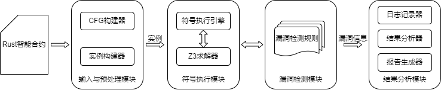</div>
<center>图 2  WANA架构图</center>

如图所示，WANA主要由四个功能模块组成，分别是输入与预处理模块、符号执行模块以及漏洞检测模块与结果分析模块。如下是它们的简介：
- 输入与预处理模块的功能主要包括分析输入、字节码验证、加载、解析与实例化等。
- 符号执行模块的功能主要在于符号执行。该模块会接收输入与预处理模块生成的Wasm实例，然后利用符号执行引擎与Z3求解器探索该Rust程序的程序执行分支，同时在符号执行过程中收集相应的路径信息，并在特定的时机调用漏洞检测模块。
- 漏洞检测模块接收来自符号执行模块传递来的路径分支信息，并利用预先定义的漏洞检测规则来对路径分支信息进行可满足性匹配。如果当前路径分支存在相应的漏洞特征，满足相应的检测规则，那么认为发现了Rust应用漏洞，同时记录相应的漏洞报告信息。漏洞报告信息会作为输入传递至结果分析模块。
- 结果分析模块会进行日志记录、结果分析和报告生成。最终生成针对于Rust智能合约的漏洞检测报告。

下面是WANA的工作流，如图3所示。
<div align=center>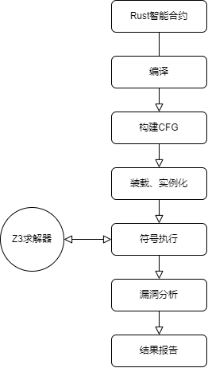</div>
<center>图 3  WANA工作流</center>
WANA的工作流程如图所示，WANA的输入是由长安链Rust SDK编译而来的智能合约Wasm字节码。

WANA首先根据Wasm字节码构建控制流图，随后会加载、解析、实例化Wasm字节码，并构造出相应的Wasm实例。

然后Wasm实例会被交给符号执行引擎进行符号执行并收集相应的路径信息。在此阶段中会利用Z3求解器辅助符号执行。

一方面Z3求解器可以用于遇到分支指令时进行约束求解以对符号执行过程进行剪枝，另一方面Z3求解器可以用于发现Rust应用漏洞时反向求解，获取能够进入此漏洞分支的输入值或输入范围。

最后利用路径信息和漏洞检测算法生成相应的漏洞检测报告，

其中漏洞分析模块和符号执行模块是交叉执行的，当符号执行结束时，整体漏洞检测工作也即完成，最后会生成相应的漏洞检测报告。

#####  WANA核心模块
######  输入与预处理模块

WANA支持的输入是长安链Rust智能合约编译后的Wasm字节码文件。需要用户使用**长安链Rust SDK**对智能合约进行**编译**后，手动获取相应的字节码文件。

WANA在读取相应的字节码文件后，会进入控制流图构建器，对于Wasm文件内的操作码，可以分为基本执行指令与控制指令。根据指令类别将Wasm字节码划分为块blocks和边edges，进而形成控制流图。

在后续的符号执行阶段，符号执行引擎会从CFG的初始状态开始，遍历其中的每一个代码块，并遍历每一条路径条件。从而完成符号执行工作。随后工具会加载Wasm字节码并进行实例构建。实例化的过程主要分为两个个阶段，第一个阶段是解码阶段，该阶段会读取以Wasm字节码文件，并进行解析，最终将文件的内容转化为相应的虚拟机内部表示。第二阶段是验证阶段，对于第一阶段解码而来的Wasm文件需要验证其是否符合Wasm规范，通过了验证阶段，Wasm文件才会被真正实例化。实例化后的Wasm模块会根据模块定义依次进行外部导入、全局变量、内存、表的构建。最终生成一个可供符号执行引擎运行的Wasm实例。

######  符号执行模块

在Wasm实例构建完成后，符号执行模块会开始工作。符号执行引擎的输入是Wasm实例，输出是相应的符号执行结果与对应的约束条件。

符号执行过程中会使用z3约束求解器对分支条件进行可满足下的判断，如果此分支有解则会继续执行该路径，否则会拒绝执行此路径。如果分支两侧均有解，则会采用深度优先的方式进行符号执行，此时原有的路径将分裂为两条全新的路径，每条路径均会携带完整的程序信息。

在符号执行的过程中，WANA会不断地收集与漏洞相关的路径信息，其中既包括了当前程序执行路径的固有信息如函数调用关系、全局变量、内存当前状态、程序当前所执行的指令，同时又包括了我们主动搜集的路径信息，如这一程序执行路径中路径约束信息、值得关注的变量值及其在执行中的状态变化以及这一执行路径中值得关注的函数调用关系。这些路径信息会用于后续的漏洞分析模块。

符号执行模块是漏洞检测与结果分析模块的基石，符号执行过程中收集的路径信息是进一步漏洞分析的基础。漏洞检测模块将分析符号执行模块传来的路径信息，从而判断该程序执行路径上是否存在漏洞。

######  漏洞检测模块

WANA的漏洞检测模块和符号执行模块是相互交叉执行的，符号执行过程中的关键指令执行时，会调用漏洞检测模块判断当前路径信息是否匹配相应的漏洞，如果是，则记录相应的路径信息用于结果分析模块生成漏洞报告。漏洞检测模块执行结束后会返回符号执行模块继续符号执行以探索更多更深的程序执行分支，继续探索其他漏洞是否存在。

WANA的漏洞检测的执行过程通常由两部分组成，第一部分是预处理阶段，这一阶段发生于符号执行之前。这一阶段中，WANA会对Wasm实例进行静态分析以获取相应信息、定位漏洞相关函数、分析函数签名等。此部分的操作将辅助后续的漏洞检测阶段；第二部分是符号执行过程中的对程序分支路径的遍历以及对分支路径信息的收集。在遍历路径的过程中会进行特征检测，根据预定义的漏洞检测规则对路径信息进行可满足性判断。如果漏洞检测模块中发现了相应的漏洞，则会将相应的漏洞信息传入结果分析模块。

######  结果分析模块

结果分析模块的输入是漏洞检测模块中传递而来的漏洞信息，如发现漏洞的函数调用链路，触发当前漏洞的路径约束信息。结果分析模块的输出是长安链Rust智能合约的漏洞分析报告。结果分析模块负责统计漏洞检测模块发现的所有漏洞，并进行日志记录、漏洞数量统计，同时还会对漏洞信息进行分析，反向判断何种输入会导致当前的漏洞触发。除此之外，一些统计信息如符号执行时间、符号执行总指令数也会被结果分析模块记录并输出。

#####  小结

本章节主要介绍了长安链Rust智能合约漏洞检测工具WANA的设计目标、整体架构、工作流以及详细的各模块功能。WANA以符号执行作为底层原理，在Wasm字节码上以符号执行的方式静态的探索智能合约的分支路径，并在探索过程中进行漏洞检测，并在符号执行结束后给出相应的漏洞检测报告信息。

#### 智能合约漏洞与检测
#####  漏洞检测
如表所示，WANA目前支持对这些类型的漏洞进行检测。这些漏洞类型主要集中于不确定性导致无法达成共识及常见的程序错误。
<center>表1 WANA支持检测漏洞列表</center>

|  漏洞类型   | 漏洞简述  |
|  ----  | ----  |
| 随机数依赖漏洞  | 随机数会为智能合约引入不确定性，如果不确定性导致同一智能合约执行结果不同，则可能导致共识无法达成，合约执行失败。 |
| 时间戳依赖漏洞  | 系统时间戳会为智能合约引入不确定性，如果不确定性导致同一智能合约执行结果不同，则可能导致共识无法达成，合约执行失败。 |
| Map结构迭代漏洞  | 在Rust语言中，Map结构的迭代顺序是不唯一的，可能为合约引入不确定性。 |
| 整数溢出漏洞  | 在符号执行过程中，数据溢出可能导致合约执行失败或执行预料之外的操作。 |
| 除零漏洞  | 在符号执行过程中，除0错误可能导致合约执行失败。 |
| 未处理错误漏洞  | 合约执行过程中调用其他合约，被调用合约的异常未被处理导致本合约执行失败。 |

###### 随机数依赖漏洞

共识是区块链平台的基础，一个区块链系统所依赖的共识协议往往是硬编码的，由此共识协议所构建的信任模型也是静态的。这就导致了区块链系统的正常运行需要依赖于确定性的准则。而智能合约中的不确定性会为区块链系统引入极大的安全风险。在长安链区块链平台中智能合约的执行不仅需要共识主节点的预执行，同样需要大量普通共识节点的执行与验证。如果智能合约中引入了不确定性，导致多个节点执行结果不一致，可能导致最终无法达成共识，智能合约调用无法真正完成。

随机数的生成与使用是最常见的软件功能之一，开发者不仅可以利用随机数开发简单的应用程序，还可以利用随机数进行复杂的安全领域的软件开发。然而随机数在智能合约领域是需要极力避免的软件功能。随机数的使用会为智能合约引入极大的**不确定性**，不仅影响智能合约的正常执行，还影响共识的最终达成。

如表所示：这是一个简化的抽奖合约，第3-4行采用Rust的rand库生成了一个范围在0-10的随机数，第5-7行进行判断，如果该随机数大于5，则代表用户中奖了，调用资产管理合约并执行后续的转账操作。然而，由于所生成的随机数的结果是不确定的，所以区块链系统内的共识节点的结果也是不一致的。若共识无法达成，则此次合约调用的结果将是无效的。
```rust
pub extern "C" fn lottery_draw () { 
    ...
    let mut rng = rand::thread_rng();
    let rand_num:i32 = rng.gen_range(0,11);
    if rand_num > 5{
        ctx.call_contract("asset_management", "transfer", ec);
    }
    ...
}
```

######  时间戳依赖漏洞

时间戳是指格林威治时间1970年01月01日00时00分00秒到当前时间的总秒数。时间戳在软件工程中经常使用，只要软件功能与现实时间有关系，均需借助时间戳来实现。然而在分布式区块链系统中，无法保证各个节点的机器时间是一致的，也无法保证各个节点同时执行获取时间戳的函数。因此使用时间戳来完成相应的业务逻辑会为系统引入极大的不确定性，影响智能合约的执行。

如表所示：这是一个秒杀合约，只有在特定时间前一分钟内调用才能成功购买该商品。第3-4行获取了系统当时的时间戳，以及秒杀开始时间的时间戳。第5-7行进行判断：如果购买时间在秒杀开始后的一分钟内，则执行后续的购买业务。但是，各个共识节点执行获取时间戳的具体时间是不一致的，这可能导致无法达成共识，进而影响实际业务的完成。
```rust
pub extern "C" fn sec_killing () { 
    ...
    let now: DateTime<Utc> = Local::now();
    let start_time = Utc.ymd(2022, 11, 1).and_hms(0, 0, 0);
    if now.signed_duration_since(start_time) < Duration::seconds(60){
        ctx.call_contract("mall", "buy", ec);
    }
    ...
}
```

######  Map结构迭代漏洞

HashMap是一种键值型的存储结构，因其高效的查找更新效率而常被用于软件工程中。然而对于Rust语言而言，HashMap结构的迭代顺序并不是确定性的。同样数据的HashMap结构迭代的结果是**不确定性**的。如果HashMap迭代的不确定性影响了后续业务逻辑的执行，那么可能影响智能合约的执行，影响共识的最终一致。

如表所示，该合约是，第3-4行合约创建了一个HashMap，并读取链上信息到HashMap中，第5-9行对这个HashMap进行迭代，并将其中前两个迭代结果执行后续的转账业务。由于HashMap的迭代顺序的不确定性，在不同的共识节点执行此段代码的结果也是不确定的，因此可能无法达成共识，从而影响本次合约的执行结果。
```rust
pub extern "C" fn transfer () { 
    ...
    let mut ret_map = HashMap::<String, String>::new();
    get_data(&mut ret_map);
    let mut i = 0;
    for (key, value) in &ret_map {
        if i < 2{
            ctx.call_contract("asset_management ", value, ec);
        }
        i += 1;
    }
    ...
}
```

######  整数溢出漏洞

整数溢出是常见的程序错误，当算数运算的结果超过当前数据类型的最大值或者最小值时，将会发生上溢或者下溢。对于一个无符号8位int类型的数而言，其数值范围在0到127之间，如果智能合约中的算术计算结果超过了这个范围，则会发生溢出。一般而言，一个算数计算的结果存在两种溢出的情况。若结果上溢，则其值会变为一个较小的值；若结果下溢，则其结果会变为一个较大的值。

在智能合约的应用场景之下，如果智能合约没有对算数运算的结果加以检查，那么可能导致攻击者利用整数溢出漏洞对合约进行攻击，破坏合约的正常运转。

如表所示，这是一个转账合约，第3行进行余额判断，如果当前转账者的余额小于转账手续费与转账金额的总和，那么说明余额不足，无法完成转账，则会在第5行退出合约的执行。如果余额充足，则会在第8-9行执行转账业务。如果此次合约调用的输入value十分巨大，则会在第3行触发加法溢出，手续费加转账金额总和将小于0，合约的余额验证会通过，转账业务也会继续执行，也就发生了恶意转账。
```rust
pub extern "C" fn transfer () { 
    ...
    if balances[from] < feeSmt + value{
        ctx.error("transfer fail");
        return;
    }
    ...
    balances[from] -= value + feeSmt;
    balances[to] += value;
    ...
}
```

######  除零漏洞

在数学领域零无法作为除数出现于除法运算中，同样的，当算数表达式中出现除零或者模零等操作时，程序无法正常执行，会导致程序执行崩溃。Rust的编译检查可以有效的检测出已知数据的算数表达式是否存在除零问题。但是编译检查属于静态检查，对于从链上读取的数据是无法进行预测的，如果智能合约中隐藏着除零漏洞，可能导致智能合约执行失败。

如表所示，第3行合约读取在此合约注册的用户数组，合约在第四行通过用输入参数对数组长度取模来获取其输入参数对应的用户的信息，并执行后续的业务逻辑。然而由于合约最开始没有用户数据，所以对应的用户数组长度为0，合约对0取模触发了除零错误，本次合约调用执行失败。
```rust
pub extern "C" fn transfer () { 
    ...
    let mut users = get_users();
    let user = users[index%users.len()];
    transfer(user);
    ...
}
```


######  未处理错误漏洞

在长安链中，智能合约可以调用另一个智能合约。长安链不止支持同类型虚拟机内的跨合约调用，也支持不同类型虚拟机间的跨合约调用。然而如果被调用的智能合约出现了异常，那么虚拟机将终止被调用的智能合约的执行工作，区块链系统会回滚其状态并返回错误值。调用者合约如果**没有对返回值进行检查**以验证该调用是否成功执行，则可能导致执行意外的业务逻辑，导致严重的损失。

如表所示，这是一个游戏合约，初始存在一位国王和初始的代币需求。参与者通过向该合约转账，只要发送的代币大于当前需求代币数量，则发送者自动成为新的国王，新任国王需向前任国王发送相应需求的代币。后续参与者可以出更多的代币以成为新任国王。而前任国王可以赚取代币之间的差额。该合约的第3-8行即执行了新国王向前任国王发送代币的逻辑，然而该合约在第7行执行转账操作时，未检查相应的转账结果是否成功，若转账结果不成功，该合约仍会执行第9行的禅让逻辑。攻击者便可以无成本的成为国王，并赚取代币。
```rust
pub extern "C" fn demise () { 
    ...
    if current_Monarch.addr != _addr{
        let mut ec = Easy Codec::new();
        ec.add_string("from_addr",_addr);
        ec.add_string("to_addr",curr_Monarch.addr);
        ctx.call_contract("Bank", "transfer", ec);
    }
    curr_Monarch = Monarch::new(name, _addr, amount);
    ...
}
```


#####  漏洞检测逻辑
本节将详细介绍长安链Rust智能合约安全漏洞的检测算法。

######  随机数依赖漏洞检测算法
随机数依赖漏洞的核心特征在于随机数在智能合约中的使用会为智能合约引入不确定性，但是并非所有的随机数使用均会带来严重的影响，随机数的使用如果不涉及链上数据的写入，则不会带来严重的后果，也即不属于随机数依赖漏洞。因此随机数依赖漏洞的检测算法是在符号执行过程中，判断是否存在一条可行的执行路径，在该路径上生成了随机数，同时该随机数影响了该路径后续的链上数据写入。如果是，则说明存在随机数依赖漏洞。

具体检测算法如图所示：第2-3行表示对于每一个可行的程序分支路径，判断其是否生成了随机数，并将该随机数记录下来。第4行表示判断后续的符号执行过程是否向链上记录了数据同时此随机数在路径约束之中。如果是则说明该随机数影响了实际业务的执行，为智能合约引入了不确定性，则检测到了随机数依赖安全漏洞。
<div align=center>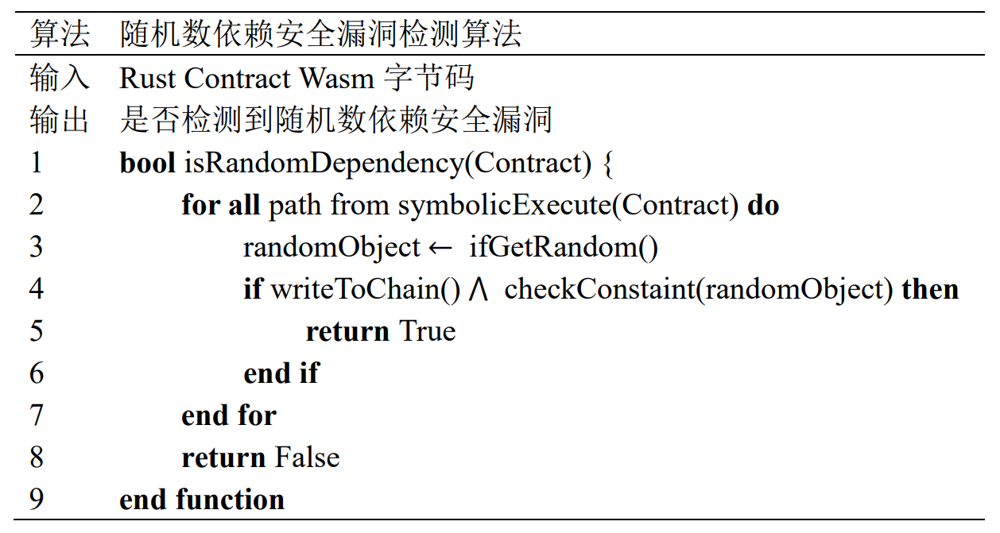</div>
<center>图 4  随机数依赖漏洞检测算法</center>

######  时间戳依赖漏洞检测算法
时间戳依赖漏洞与随机数依赖漏洞类似，并非所有的时间戳的使用都会为智能合约带来严重的不确定性，如智能合约可以使用时间戳进行日志打印，这并不会影响智能合约的执行，所以不属于时间戳依赖安全漏洞。时间戳依赖漏洞检测算法与随机数依赖漏洞检测算法类似，具体规则如图所示：

具体检测算法如图所示：第2-3行表示遍历符号执行过程中生成的每一条可行的程序分支路径并判断该路径上是否获取了时间戳，并记录下该时间戳。第4行即漏洞检测模块会检测后续的符号执行过程有无向链上写数据，以及写入数据时的路径约束是否包含此时间戳。如果是则说明该时间戳参与了实际业务是否执行的逻辑判断，会为智能合约的执行引入不确定性，也即该智能合约存在时间戳依赖安全漏洞。

<div align=center>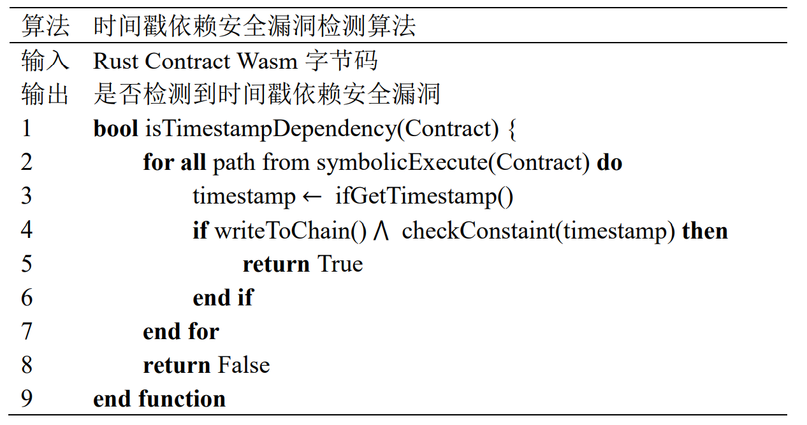</div>
<center>图 5  时间戳依赖漏洞检测算法</center>

######  Map结构迭代漏洞检测算法
Map结构迭代漏洞的核心特征在于在Rust智能合约中使用了HashMap数据结构，同时使用了HashMap迭代器对内部数据进行了迭代。尽管Rust的HashMap迭代本身的结果是不确定性的，但是并不一定会真正影响实际的智能合约的执行。所以对于Map结构迭代漏洞的核心判断依据在于对于HashMap迭代器的使用是否影响了智能合约的链上数据读写。

该漏洞的具体检测算法如图所示：第2-3行即对于符号执行过程中的所有可行的程序分支路径均进行判断，判断此路径下是否使用HashMap数据结构，并使用了迭代器对其进行迭代。如果是则将对应的迭代结果进行记录。第4-6行表示检测此后的符号执行过程中是否向链上写入数据且此时的路径约束中有此前迭代结果的参与。如果是则说明该智能合约存在Map结构迭代安全漏洞。

<div align=center>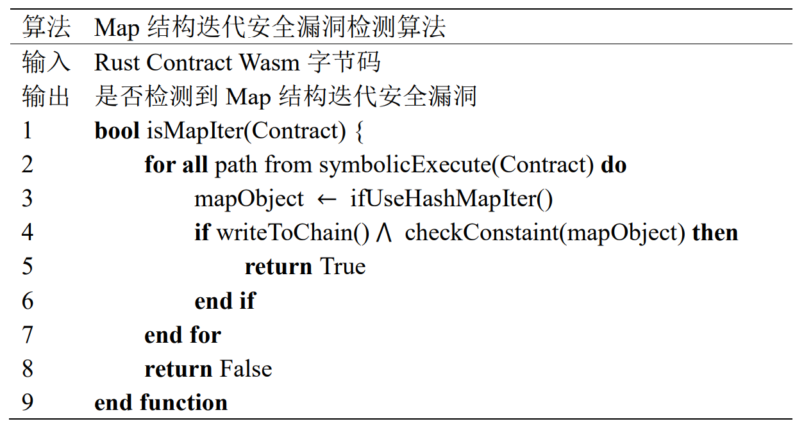</div>
<center>图 6  Map结构迭代漏洞检测算法</center>

######  整数溢出漏洞检测算法
整数溢出是常见的程序错误，Rust编译器本身会静态的检查程序中是否存在简单的整数溢出问题，但是无法检测程序运行时所获取的整数发生的整数溢出错误。在智能合约这一应用场景之下，运行时获取的整数通常来自于链上数据的读取，和合约调用时的参数。因此整数溢出漏洞的算法是为所读取的链上数据以及合约调用时传入的参数绑定以符号值，并在判断后续的该符号值的算数运算是否可能导致结果溢出。

具体的检测算法如图所示：第2-3行即对于符号执行过程中对于链上数据的读取或合约调用时传入的参数绑定以符号值。第4-8行表示在后续的符号执行过程中，判断此前绑定的符号值的算数运算过程是否发生了溢出，如果是则说明存在整数溢出安全漏洞。

<div align=center>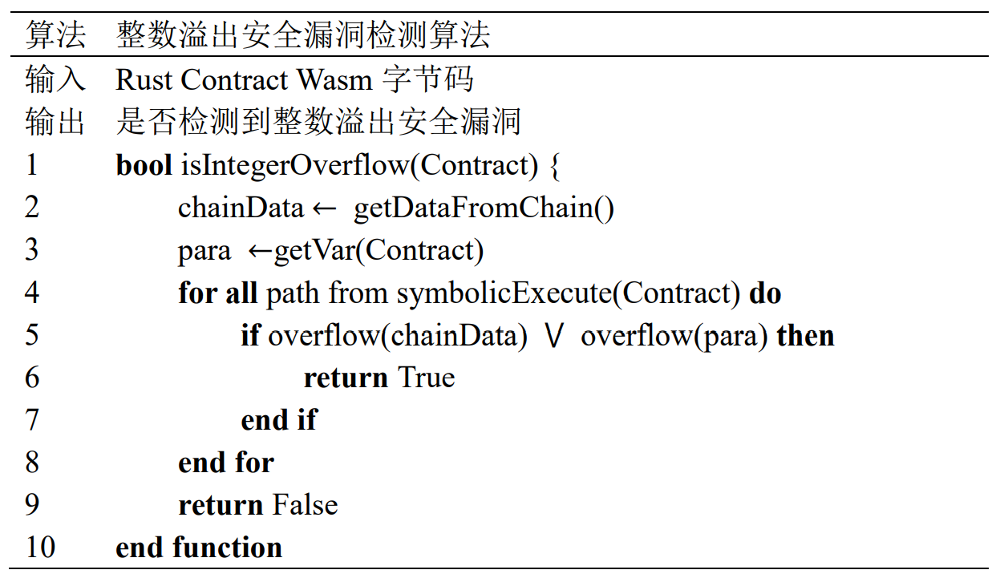</div>
<center>图 7  整数溢出漏洞检测算法</center>

######  除零漏洞检测算法
除零漏洞的核心是智能合约执行过程中如果发生了除零错误，则会导致智能合约执行失败。Rust的编译检查可以保证智能合约中的静态数据不存在除零错误，但是对于链上数据与合约调用时传入的参数，Rust的编译检查无法覆盖。因此除零漏洞检测算法的核心在于判断链上数据与参数是否可能导致除零错误的出现。

具体的检测算法如图所示：第2-3行即将符号值绑定给智能合约所读取的链上数据或传入的参数。第4-8行追踪这些符号值在后续的执行过程中，是否存在一条执行路径，该路径上的这些符号值参与的算数运算过程存在除零，如果是则说明存在除零安全漏洞。
<div align=center>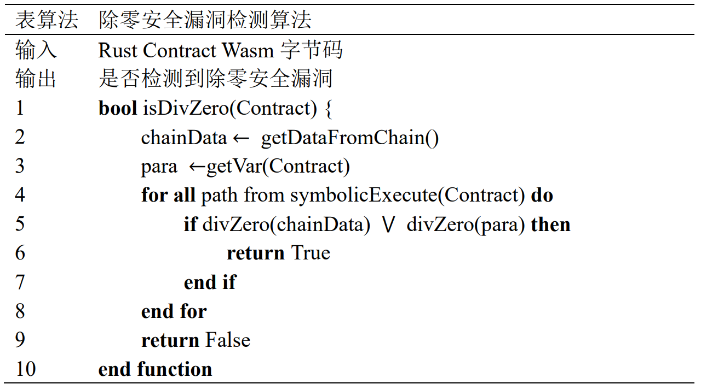</div>
<center>图 8  除零漏洞检测算法</center>

######  未处理错误漏洞检测算法
未处理错误漏洞的核心特征在于调用外部合约后没有对其返回结果进行判断。因此未处理错误的核心检测算法是对智能合约进行符号执行，符号执行过程中对于调用外部合约的函数调用结果进行记录，并判断此结果后续有无进行判断。

具体的检测算法如图所示：第2-4即对智能合约进行符号执行，遍历所有可行的程序执行分支，并对分支中的外部函数调用指令结果进行记录。当该调用指令执行完成后，相应的调用结果会被压入操作数栈顶，所以漏洞检测模块会记录此时栈顶的变量，也即记录此次外部合约函数调用的结果，如第5-6行所示。后续的符号执行过程中，当执行至比较指令时，漏洞检测模块会判断此调用结果是否是比较指令的参数，如果是，则说明当前智能合约存在未处理错误安全漏洞。
<div align=center>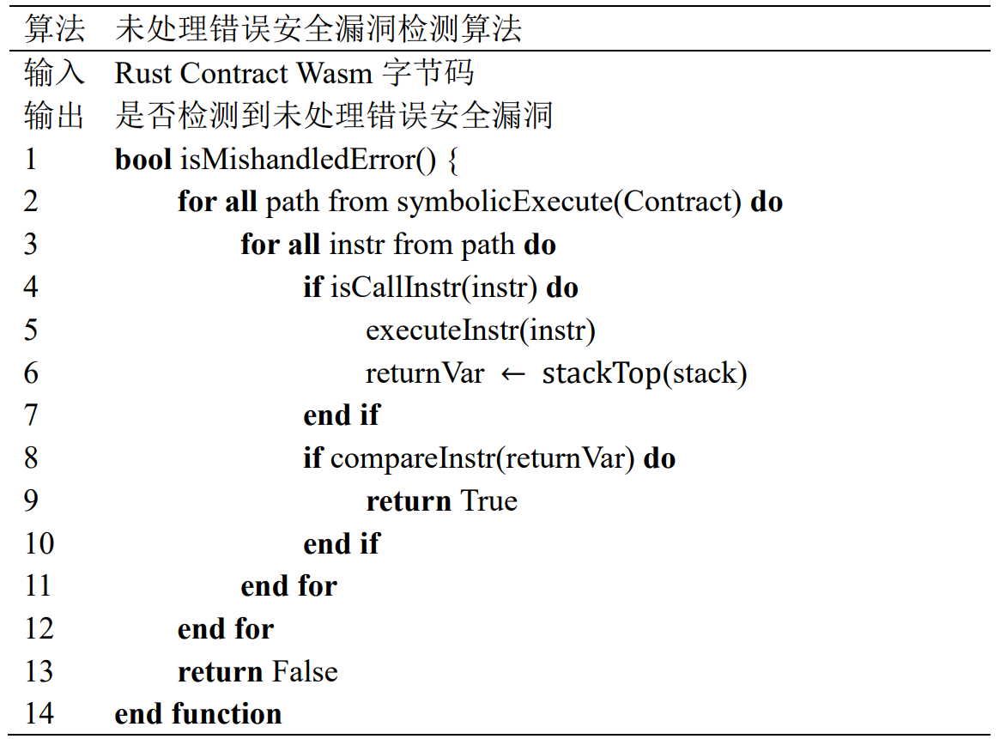</div>
<center>图 9  未处理错误漏洞检测算法</center>

#####  小结

本章节主要介绍了长安链Rust智能合约漏洞检测工具WANA所支持检测的漏洞类型以及相应的漏洞检测算法。一方面从源码层面归纳出漏洞所具备的特征，另一方面以伪代码的形式介绍了相应的漏洞检测算法。

#### WANA 功能测试
#####  主要参数接口说明

<center>表2 主要参数接口及其功能</center>

|参数|功能|
| :-: | :-: |
|-e, --execute|对随后输入的Wasm文件进行符号执行|
|-d, --debug|指定WANA的日志输出级别|
|-f, --function|指定检测合约的具体某个函数，不指定则检测所有函数|
|-r, --rust|指定输入的智能合约类型为Rust智能合约|
|-t, --timeout|指定符号执行时长的超时时间|
|-v, --version|输出WANA的版本|
|-c, --count-instruction|统计输入的Wasm文件指令数量|
|-wt, --wast|检查输入的文件是否符合WAST格式|
|-wm, --wasm|检查输入的文件是否符合Wasm格式|

#####  主要参数接口测试
######  测试-e参数

-e，--execution 参数的功能是指定需要符号执行与漏洞检测的Wasm文件
对于-e参数接口的测试，我们指定6个存在不同漏洞的长安链Rust智能合约Wasm字节码作为输入
<center>表3 -e参数的测试</center>

|接口|测试输入|预期测试结果|
| :-: | :-: | :-: |
|-e|mishandled|指定的智能合约mishandled的Wasm字节码作为输入，对该合约进行符号执行与漏洞检测|
||overflow|指定的智能合约overflow的Wasm字节码作为输入，对该合约进行符号执行与漏洞检测|
||get_version|指定的智能合约divzero的Wasm字节码作为输入，对该合约进行符号执行与漏洞检测|
||random|指定的智能合约random的Wasm字节码作为输入，对该合约进行符号执行与漏洞检测|
||time|指定的智能合约time的Wasm字节码作为输入，对该合约进行符号执行与漏洞检测|
||map|指定的智能合约map的Wasm字节码作为输入，对该合约进行符号执行与漏洞检测|

######  测试-d参数

-d --debug, 参数的功能是指定WANA是否输出符号执行细节
对于-d参数接口的测试，我们指定三个值进行测试
<center>表5 -d参数的测试</center>

|接口|测试输入|预期测试结果|
| :-: | :-: | :-: |
|-d|无-d|仅输出漏洞检测报告信息|
||有-d|除了漏洞检测报告信息，还会输出具体符号执行的每条指令执行情况|

######  测试-f参数

-f，--function 参数的功能是指定检测合约的具体某个函数，如果不指定则默认检测所有导出的智能合约函数。该参数需要配合-e参数一起使用
对于-f参数接口的测试，我们指定同一个智能合约Wasm字节码所导出的3个不同函数作为输入
<center>表4 -f参数的测试</center>

|接口|测试输入|预期测试结果|
| :-: | :-: | :-: |
|-f|transfer|对智能合约的transfer函数进行符号执行与漏洞检测|
||transfer_from|对智能合约的transfer_from函数进行符号执行与漏洞检测|
||divzero|对智能合约的divzero函数进行符号执行与漏洞检测|


######  测试-r参数

-r，--rust 该参数是指示性参数，功能是指定输入的智能合约类型为Rust智能合约，使用-r则会启动长安链Rust智能合约的漏洞检测
对于-r参数接口的测试，指定两个值进行测试
<center>表6 -r参数的测试</center>

|接口|测试输入|预期测试结果|
| :-: | :-: | :-: |
|-r|有-r|对智能合约进行符号执行与漏洞检测|
||无-r|仅对智能合约进行符号执行，不启动漏洞检测功能|

######  测试-t参数

-t，--timeout 该参数的功能是指定符号执行时长的超时时间，默认值为1200s，也即20min
对于-r参数接口的测试，指定三个值进行测试
<center>表7 -t参数的测试</center>

|接口|测试输入|预期测试结果|
| :-: | :-: | :-: |
|-t|无-t|智能合约的符号执行与漏洞检测的超时时间为20min，超过20min则自动结束|
||60|智能合约的符号执行与漏洞检测的超时时间为60s，超过60s则自动结束|
||3600|智能合约的符号执行与漏洞检测的超时时间为3600s，也即60min，超过60min则自动结束|

######  测试-v参数

-v，--version 该参数的功能是显示当前的WANA版本
对于-v参数接口的测试，指定两个值进行测试
<center>表8 -v参数的测试</center>

|接口|测试输入|预期测试结果|
| :-: | :-: | :-: |
|-v|无-v|正常执行其他功能|
||有-v|会显示当前的WANA版本|

######  测试-c参数

-c，--count-instruction 该参数的功能是统计输入的Wasm文件指令数量
对于-c参数接口的测试，指定两个值进行测试
<center>表9 -c参数的测试</center>

|接口|测试输入|预期测试结果|
| :-: | :-: | :-: |
|-c|无-c|正常执行其他功能|
||有-c|会统计该参数指定的Wasm字节码所包含的指令数量|

######  测试-wt参数

-wt，--wast 该参数的功能检查输入的文件是否符合WAST格式
对于-wt参数接口的测试，指定两个值进行测试
<center>表10 -wt参数的测试</center>

|接口|测试输入|预期测试结果|
| :-: | :-: | :-: |
|-wt|无-wt|正常执行其他功能|
||有-wt|会检查输入的文件是否符合WAST格式，并输出结果|

######  测试-wm参数

-wm，--wasm该参数的功能是检查输入的文件是否符合Wasm格式
对于-wm参数接口的测试，指定两个值进行测试
<center>表11 -wm参数的测试</center>

|接口|测试输入|预期测试结果|
| :-: | :-: | :-: |
|-wm|无-wm|正常执行其他功能|
||有-wm|会检查输入的文件是否符合Wasm格式，并输出结果|

### WANA使用文档
####  WANA的介绍
- WANA是一款基于符号执行技术的智能合约漏洞检测工具，可以探索智能合约的程序执行分支，并在探索过程中寻找智能合约是否存在安全漏洞。
- 目前WANA支持检测长安链Rust智能合约中的六种智能合约安全漏洞。
####  WANA的安装
#####  所需依赖
WANA采用python开发，需要在使用前自行下载如下python包。
```
# six==1.14.0
pip3 install six==1.14.0
# func_timeout==4.3.5
pip3 install func_timeout==4.3.5
# z3-solver==4.8.8.0
pip3 install z3-solver==4.8.8.0
```
WANA在Ubuntu 18.04环境下开发，原则上兼容后续版本。

#####  源码下载

下载代码

```
git clone  --depth=1 https://git.chainmaker.org.cn/ibpc/rust-contract-detection-tool
```

####  WANA的使用

#####  WANA源码目录

WANA的源码的主要组成部分如下。

- wana.py 是程序的入口点，通过调用它进行智能合约的漏洞检测
- sym_exec.py 负责符号执行的主要逻辑，包括函数级和指令级执行。
- chainmaker_analyzer 漏洞分析单元，用以分析智能合约安全漏洞
- emulator.py 进行函数摘要和库函数模拟的模块
- global_variables.py 在符号执行时保存的全局状态
- logger 日志记录模块
- bin_format.py 和 bin_reader.py 分别包含字节码二进制表示和读取方法。
- structure.py 和 runtime.py 代表 WebAssembly 字节码结构和虚拟机运行时结构。
- number.py、utils.py 和 logger.py 是辅助模块。

#####  主要使用参数

WANA程序接受的参数如表所示：

|参数|功能|
| :-: | :-: |
|-e, --execute|对随后输入的Wasm文件进行符号执行|
|-d, --debug|指定WANA的日志输出级别|
|-f, --function|指定检测合约的具体某个函数，不指定则检测所有函数|
|-r, --rust|指定输入的智能合约类型为Rust智能合约|
|-t, --timeout|指定符号执行时长的超时时间|
|-v, --version|输出WANA的版本|
|-c, --count-instruction|统计输入的Wasm文件指令数量|
|-wt, --wast|检查输入的文件是否符合WAST格式|
|-wm, --wasm|检查输入的文件是否符合Wasm格式|

#####  使用方式

WANA接收的输入是长安链Rust智能合约Wasm字节码，需要用户自行编译Wasm字节码，并将其传入WANA

######  编译长安链智能合约

详见[使用Rust进行智能合约开发](https://docs.chainmaker.org.cn/v2.3.0/html/instructions/%E4%BD%BF%E7%94%A8Rust%E8%BF%9B%E8%A1%8C%E6%99%BA%E8%83%BD%E5%90%88%E7%BA%A6%E5%BC%80%E5%8F%91.html)

在相应的智能合约工程中，使用cargo进行项目编译  
`cargo build --release --target=wasm32-unknown-unknown`  
编译后的智能合约字节码文件如下目录，XXX为智能合约名  
`$智能合约工程/target/wasm32-unknown-unknown/release/XXX.wasm`

######  裁剪智能合约

编译生成的Wasm文件内部包含大量的混淆信息，体积也较大，我们需要使用Rust提供的**wasm-gc**工具对其进行裁剪，一方面可以减小Wasm字节码文件的体积，另一方面可以去除Wasm函数的混淆内容，以更好地进行漏洞检测。
使用方式
```sh
cargo install wasm-gc # 安装wasm-gc
wasm-gc 合约.wasm -o 合约.wasm # -o 是指定裁剪后的输出位置
```

######  使用WANA对其进行符号执行

我们以contract.wasm智能合约为例，对其进行漏洞检测。
其中的wana.py 和 contract.wasm可以根据实际位置的不同，进行更改

`python3 wana.py -r -e contract.wasm`

也可以利用-t指令进行超时时间的设置，单位为秒，默认超时实际为20min。

`python3 wana.py -r -e contract.wasm -t 20`

也可以设置日志输出级别，以获取更加详细的符号执行信息

`python3 wana.py -r -e contract.wasm --debug`

也可以仅检测智能合约的某个函数，下例则检测contract合约的transfer函数

`python3 wana.py -r -e contract.wasm --debug -f transfer`

#####  运行结果

我们以带有未处理错误漏洞的合约mishandled.wasm为例，其运行结果如图所示：

<div align=center>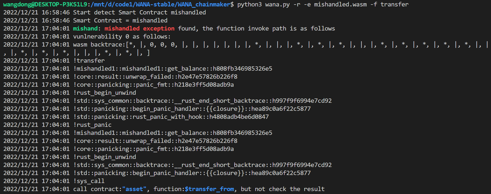</div>
<center>图 10  mishandled合约检测结果</center>

该漏洞检测报告包含三部分信息：
- 第一部分的信息位于前两行，表明开始对mishandled智能合约进行检测
- 第二部分的信息是发现的漏洞信息，该合约发现了一个mishandled exception也即未处理错误漏洞，发现漏洞时的函数调用栈如图中所示
- 第三部分的信息是提示信息，提示用户该合约调用了"asset"合约的"$transfer_from"函数，但是没有检查其返回值

## Solidity合约漏洞检测工具

### ArtemisX设计文档

#### 设计与实现

ArtemisX是一款基于符号执行的对Solidity智能合约进行分析的工具，该工具主要分析智能合约字节码，无需访问源代码。下面将阐述ArtemisX是如何被设计和实现的。

##### ArtemisX架构

下面是ArtemisX架构图，如图1所示。

<div align=center>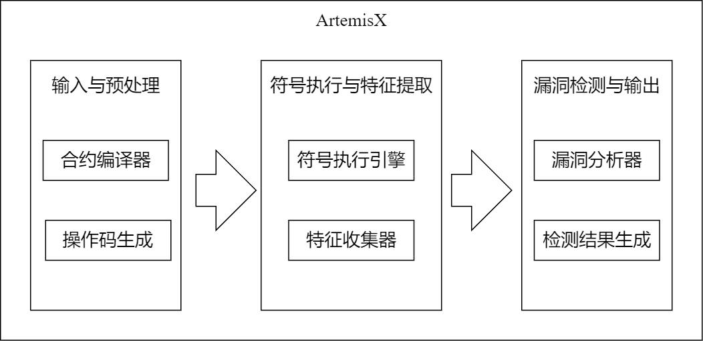</div>

<center>图 1  ArtemisX架构图</center>

如图所示，ArtemisX主要包括三个部分。输入与预处理主要包括获取输入合约、将合约编译生成字节码、根据字节码生成操作码，符号执行与漏洞检测主要包括合约符号执行引擎搭建以及漏洞特征的收集与规则的定义，最后漏洞检测与输出部分实现对选定合约漏洞进行漏洞检测并输出结果。

##### ArtemisX工作流程

ArtemisX支持两种输入模式，分别为合约Solidity源代码文件与字节码文件，其中Solidity源代码合约会经过solc编译器编译生成字节码文件，在得到字节码文件后，再经过处理生成EVM操作码。

此后，ArtemisX对合约操作码进行符号执行，从第一个操作码开始按照顺序模拟执行。当在执行过程中发现操作码可能导致相关漏洞时，会收集符号执行过程中产生的信息，并进行漏洞检测，如果当前执行的操作码不会导致相关漏洞，则继续对剩下的操作码进行符号执行。

若在漏洞检测过程中，该合约的执行过程符合漏洞检测规则，则判断合约存在该漏洞，保存当前漏洞检测结果。漏洞检测过程结束后，继续下一步符号执行过程。当符号执行过程结束后，生成检测报告并输出。

<div align=center>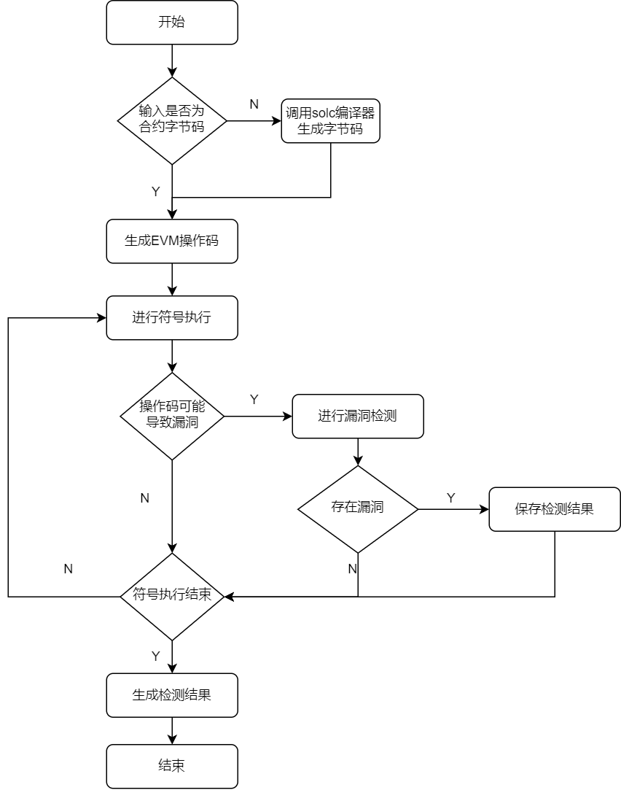</div>

<center>图 2  ArtemisX工作流程图</center>

##### 输入与预处理

ArtemisX自身会经过solc编译器来生成对应的字节码文件，同时用户也可以直接向ArtemisX输入合约的字节码进行漏洞检测。需要注意的是，ArtemisX分析的是智能合约的runtime代码部分，在使用solc编译时，使用--bin-runtime选项，以SmartContract.sol文件为例，编译后会生成SmartContract.bin-runtime文件以供后续使用。

工具在instruction_list.py文件中，列出了EVM虚拟机中所有操作码和对应的二进制值，以及这些操作码所需使用的栈中元素的个数。

如：

```py
    "ADD": [0x01, 2, 1]
```

表示ADD操作码所对应的二进制字节码为0x01，需取出栈顶两个元素进行相加，并将相加后的结果压入栈顶中。

操作码生成器可根据上述操作码与二进制值中的对应，按顺序依次读取合约字节码中的内容，并生成相应的操作码。EVM操作码均为unit8，字节码中每两个字符便代表一个操作码，需要注意的是，不同的push指令可以向栈中压入不同长度的数据，因此在识别出push操作码后，需继续读取该push操作的输入数据（如：push2代表需要向栈中压入两个字节的值），以完全生成该指令。

##### 符号执行与特征提取

ArtemisX符号执行采用深度优先搜索在整个执行过程中遍历所有的可能执行的路径。在该过程中，对遇到的操作码进行模拟执行操作，包括操作码执行时相应的计算、pc（program counter）更新，栈处理等。在操作码执行的过程中，如果所需的操作数为确定的真实值，可以直接进行运算，如果是需要生成的符号变量，使用Z3求解器中的BitVecVal位向量生成器生成所需的符号值，完成模拟符号执行的过程。

符号执行从字节码中的第一条指令开始，依次执行，当执行到JUMPI指令时，此时符号执行引擎便遇到了一个分支。ArtemisX的处理方法为将上述JUMPI跳转情况分为两种：跳转条件成立和跳转条件不成立，以此生成两条不同的进行符号执行的路径。

ArtemisX首先使用Z3约束求解器对跳转条件不成立的分支条件表达式的可满足性进行判断，以决定是否执行本条路径。即，当Z3求解器判断“跳转条件不成立”这个条件在执行过程中是可满足的时候，ArtemisX会在不跳转的情况下继续探索该分支，如果该条件是完全无法满足的，则不会继续执行。

类似的，在对“跳转条件不成立”分支完成深度优先搜索后，ArtemisX会对”跳转条件成立“分支使用Z3求解器再次进行上述判断，以决定是否探索该路径，只有在跳转条件能够成立的条件下，才执行跳转操作并继续进行符号执行。在上述过程中，使用Z3约束求解器排除了不可达的路径。

其次，在符号执行过程中，可能遇到无效的指令（如无法识别的指令代码或者跳转地址无效），此时，ArtemisX会停止当前分支的执行，并在深度优先搜索过程中回溯，执行另一条分支路径。同时，由于在编译过程中，源代码中的循环结构被转换为使用跳转条件的跳转结构，为避免符号执行陷入无限循环，可设置最大跳转次数，若符号执行达到该最大跳转次数后即停止本次符号执行。

漏洞特征提取功能高度依赖于符号执行模块，在符号执行的过程中，会同时记录各种关键信息，如当前状态下的栈中数据、条件分支路径等信息，以备后续相应漏洞检测时使用。

##### 漏洞检测与输出

在命令行使用ArtemisX工具时，会先确定目标合约所需要检测漏洞的类别。每一种漏洞，都会有对应可能导致该漏洞产生的操作码，当在符号执行过程中发现执行到该操作码时，便可以调用对应漏洞的检测函数进行判断。并不是只要执行到这些操作码，就一定会导致漏洞，因此当检测函数判断并没有漏洞时，便继续进行后续符号执行过程。而当漏洞检测函数成功判断该合约确实存在相应漏洞时，工具认为此时已经找到了合约相关漏洞，停止继续进行符号执行，保存当前的检测结果，并生成最后的测试报告。

测试报告主要分为以下几个部分，如图3所示。

<div align=center>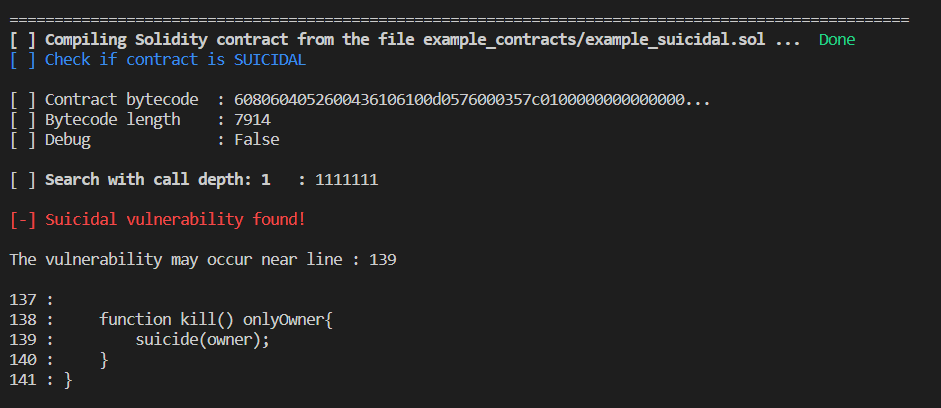</div>

<center>图 3  ArtemisX测试结果报告示例图</center>

图中第一部分第一行为以Solidity源代码文件形式输入时的编译情况，第二行显示当前检测的漏洞类别为SUICIDAL，即自杀合约。

第二部分是被分析合约的部分信息。第一行为合约字节码的部分现实，第二行展示该合约字节码的长度，第三行显示是否开启Debug模式，在该示例图中，Debug展示部分显示为False，即为关闭Debug模式。

第三部分即为漏洞检测的相关信息。首先展示在符号执行阶段，工具当前正在哪一个调用深度模拟操作码的执行。在执行结束后，展示漏洞检测结果，如图中显示“Suicidal vulnerability found！”字样表示已找到自杀漏洞，并在下方展示可能导致该漏洞的源代码相关信息。

#### 漏洞介绍

ArtemisX所覆盖的漏洞共有9种，如下表所示。

|       类别       |           英文名称            |                             描述                             |
| :--------------: | :---------------------------: | :----------------------------------------------------------: |
|     整数溢出     | Integer Overflow or Underflow |                数据超出所能存储的最大/最小值                 |
|     自杀合约     |            Suicide            |                    可以被其他任意账户杀死                    |
|     资产冻结     |            Greedy             |              合约可以接受并持有但无限期锁定资金              |
|     资产泄露     |           Prodigal            |                合约可能向其他任意账户发送资金                |
|    时间戳依赖    |     Timestamp dependency      |             合约中有操作依赖于可能被操控的时间戳             |
|   区块信息依赖   |     Block Info Dependency     |    合约中有操作依赖于可能被操控的区块信息（区块号、难度）    |
|      可重入      |      Re-entrancy Attack       | 外部调用有可能会被攻击者劫持，迫使合约（通过回退函数）执行额外的代码，包括那些返回到合约自己代码的调用 |
|   未处理的异常   |     Mishandled Exceptions     |   调用的合约可能无法获取被调用合约的异常信息，继续执行代码   |
| 危险delegatecall |    Dangerous Delegatecall     | 合约中使用delegatecall函数，该合约中的函数可能被攻击者调用并转移以太币 |

<center>表 1   ArtemisX漏洞覆盖表</center>

表中第一列给出九种漏洞的中文类别名称，第二列给出英文类别名称，第三列为每种漏洞对应的简要描述。接下来对每种漏洞进行介绍并描述工具中对应漏洞检测规则的实现。

##### 整数溢出

整数溢出漏洞在信息安全的各个方面都大量存在，而在solidity编写的智能合约中更是重量级的存在。在使用solidity合约的历史中，出现了多次因整数溢出而出现的严重事故，大多数都是利用溢出凭空取出超大量的代币，并在市场抛售，导致代币价值归零。

在solidity中，变量支持的整数类型长度以8递增，从uint8到uint256，以及int8到int256。在EVM中储存一个数所占的位数是固定，当存储的数字长度超出最大值时会导致进位，使所有1翻转成0。

在solidity中，溢出分为加法溢出、减法溢出、乘法溢出，其直接原因都是因为运算结果超出了范围。

在ArtemisX符号执行引擎中，将各种值与变量转化为了Z3位向量的形式进行计算，因此在执行加法（ADD）、减法（SUB）、乘法（MUL）等操作时，可以采用Z3求解器中包含的用于判断是否溢出的函数进行相关计算。当执行到ADD指令时，以BVAddNoUnderflow(a,b)函数为例，该函数用于判断加法是否可能溢出，a、b分别表示当前栈中第一个和第二个元素，当该函数的返回值为False（即加法下溢）的情况下，合约当前路径依然能正常执行，则判断该合约存在整数溢出漏洞。

```python
if op == 'ADD' and 栈中第一个元素a存在 and 栈中第二个元素b存在 :
   Z3求解器.push()
   Z3求解器.add(BVAddNoUnderflow(a, b) == False)
   if Z3求解器.check() == sat:
      存在整数溢出漏洞！
   Z3求解器.pop()
```

<center>表 2   加法下溢伪代码</center>

##### 自杀合约

在紧急情况下，比如说被攻击导致资金耗尽或者出现错误时，合约通常提供了一个安全备用选项——被所有者（或受信任的地址）杀死。但是当合约能够被其他任意账户触发此操作被杀死时，会产生巨大安全隐患，我们认为它存在自杀漏洞。

为了检测合约是否存在自杀漏洞，只需要在符号执行的过程中尝试构建一条路径，并且该路径能够成功执行字节码中的SUICIDE指令，则认为是有可能杀死该合约的，并标记该合约存在自杀漏洞。

##### 资产冻结

合约可能任然有效，但它无限期锁定并不允许释放资金。例如，许多持有以太币的multi-sig钱包合约均使用Parity的库合约向用户发放以太币，但由于Gthub用户devops199操作失误导致了一个Parity钱包中的智能合约自杀，导致所有依赖这个合约的所有钱包的价值2.1亿美元的资产被冻结。这种漏洞经常发生在那些，仍然可以接受以太币，但完全缺乏发送以太币的指令或这些指令不可达的合约中。同时，被杀死后的合约或者不包含任何代码的合约仍然可以接受以太币，并添加到合约的余额中，但这些合约也完全无法向外部发送以太币，也会导致资产冻结。

在检测过程中，首先对合约进行依次符号执行，并判断合约是否能执行到RETURN或STOP指令，即判断该合约是否仍然有效。如果该合约无效，则合约无法正常接受以太币，因此也不会导致资产冻结。在合约有效的情况下，再次对合约进行符号执行，并判断合约能否执行CALL，CALLCODE，DELEGATECALL，SUICIDE等操作，SUICIDE操作在合约自杀后会将自身的资产进行转移，而CALL，CALLCODE，DELEGATECALL等操作则能够向外发送以太币，因此合约只要包含上述操作，都不会导致资产冻结。而在经过两次符号执行后，既能够接收资金又不包含能够向外转移资金的合约，则被标记为存在资产冻结漏洞。

##### 资产泄露

一个挥霍的合约，是指在不需要收到其他账户发送来的以太币，便向该账户转移以太币的合约。当账户A向C合约发送一个不包含任何以太币的交易，且该交易执行时导致C合约中的以太币发送给A账户，则C合约存在资产泄露漏洞。

在检测过程中，主要重点关注CALL与SUICIDE这两个操作码，以上两个操作码都有可能将合约中的资金发送给其他账户，如下图为CALL指令的相关信息。

<div align=center>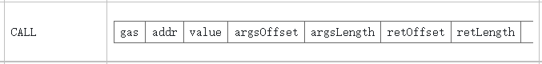</div>

<center>图 4  CALL相关信息图</center>

由图4所示，当CALL指令执行时，栈中的前三个元素分别为：

gas：当前交易的剩余gas

addr：交易转入方地址

value：转账额度

因此，当符号执行过程中遇到CALL指令，便进行该漏洞的检测，当判定栈中交易转入方地址在与CALLER地址相等且转账额度value大于零的情况下，以然能够顺利执行时，则标记该合约存在资产泄露漏洞。

```python
if op == 'CALL' and 栈中第二个元素addr存在 and 栈中第三个元素value存在:
    Z3求解器.push()
    Z3求解器.add( addr == caller )   
    Z3求解器.add( value > 0)     
    if MyGlobals.s.check() == sat:
       存在资产泄露漏洞！
    Z3求解器.pop()
```

<center>表 3   CALL指令转移资产伪代码</center>

SUICIDE（或SELFDESTRUCT）操作码指令执行时，栈中的第一个参数为将当前合约所有剩余资金转入的地址。与上述CALL指令类似，当判定转入地址与CALLER地址相等时，则判定攻击者可以杀死该合约并获取合约所有的资金，标记该合约存在资产泄露漏洞。

##### 时间戳/区块信息依赖

由于区块链网络不可避免的延迟特性，负责验证并打包区块的矿工可以在一定可控的范围内调整正在处理的区块信息内容（如区块编号block number，区块难度block difficulty和区块时间戳block timestamp等）。以时间戳为例，很多合约的执行逻辑是和当前区块的时间戳有关的。而一个区块的时间戳是由矿工(挖矿时的系统)决定的，并且允许有900秒的偏移。因此，当矿工所处理的交易与自己的利益直接相关或有其他利益驱动时，此恶意矿工便可以通过操纵区块信息来控制易受攻击的合约，以使合约的运行朝着有利于自己的方向运行。例如一些游戏合约以随机数的算术运算结果作为开奖金额时，若此随机数以时间戳或区块号等信息为种子，便很容易触发区块信息依赖漏洞。

在对每一条路径进行符号执行后，如果该路径能够正常结束（即不会出现合约无效的情况），则对收集到的所有路径条件进行循环检测，如果这些区块信息或时间戳信息存在于路径中，则判断合约的执行依赖于这些信息，算法将其标记为存在漏洞的合约。

```python
for i in 所有路径条件:
   if 'TIMESTAMP' in str(i):  ## TIMESTAMP相关信息存在于某个路径条件中
       存在时间戳依赖漏洞！
```

<center>表 4   时间戳依赖检测伪代码</center>

##### 可重入漏洞

以太坊智能合约的特性之一就是能够调用和使用其他外部合约的代码。合约通常也会用来处理以太币，因而也会经常将以太币发送到不同的外部用户地址。这些处理都需要合约提交外部调用。这些外部调用有可能会被攻击者劫持，迫使合约（通过回退函数）执行额外的代码，包括那些返回到合约自己代码的调用。

主要利用符号执行过程中的分支条件构成的路径来检查可重入漏洞。每当符号执行遇到CALL指令后，我们可以获取在到达CALL指令之前的所有分支条件，然后，用更新后的变量代入以上条件，判断这些条件是否仍然可以满足，如果可以，即能够再次执行该调用。当满足上述条件是，则认为该合约存在可重入漏洞，因为被调用方有可能在完成调用之前重新执行调用。

```python
for i in 所有路径条件:
	for var in i: #循环得到i中的每个变量
      if var in storage:  #变量存储于内存中
			pos = var在storage中的位置
            Z3求解器.add(var == storage[pos]) #将变量改变为内存中更新后的值
	……                    ……
if Z3求解器.check() == sat #变量更新后仍然满足条件
	存在可重入漏洞！
```

<center>表 5   可重入漏洞依赖检测伪代码</center>

##### 未处理的异常

合约有多种方法可以调用另一个合约，例如通过send指令或直接调用合约的函数。如果被调用方合同中引发了异常（例如gas不足、超出了调用堆栈限制），则被调用方合约终止，恢复其状态并返回false。但是，根据调用的方式，被调用方合同中的异常可能会传播也可能不会传播给调用者。如果调用是通过send指令进行的，则调用者合同应显式检查返回值以验证调用是否已正确执行。这种不一致的异常传播策略导致许多情况下异常处理不当。

由于被调用方产生异常后，便会将0压入调用方的操作数堆栈中，因此只需要在每次合约调用结束后是否执行ISZERO指令（检查堆栈顶部值是否为0）。如果合约没有执行上述操作，则将合约标记为存在未处理的异常漏洞。

```python
#当CALL或者CALLCODE操作码后伴随着SWAPX和X个POP操作码，但之后不存在ISZERO操作码时，认为合约存在未处理异常漏洞
if op1 == 'CALL' or op1 == 'CALLCODE' :
	if op2不是SWAP操作码:
       合约安全！
    swap_num = SWAPX中的X		#SWAP后应跟随pop操作码的个数
    if not all 'POP':	#SWAP后X个操作码并不全是POP
       合约安全！       
    opcode = op[swap_num + 2] #POP后的第一个操作码
    if opcode == 'ISZERO':
       合约安全！
    else:
       存在未处理异常漏洞！
```

<center>表 6   未处理异常依赖检测伪代码</center>

##### 危险的delegatecall

Delegatecall函数也是Solidity中用于功能调用的函数，但是与普遍使用的call函数有本质的不同。当使用常规的call函数来调用另一个合约的功能函数时，代码将在被调用合约的上下文中执行。相反，当使用Delegatecall函数时，代码在调用者的上下文中执行。也就是说delegatecall函数的使用可以通过调用其他合约的代码来修改自身合约的和合约状态。通常，使用delegatecall的目的是通过实现并调用库函数来提高代码的可重用性。在某些情况下，易受攻击的智能合约A可能在函数中使用了delegatecall函数。结果，攻击者只要通过参数提供函数的函数签名，就可以调用A中的任何函数。此种漏洞的风险性主要在于delegatecall调用的函数中可能存在转移以太币的操作，如果相关函数能够被任意调用将会导致合约任意向外发送以太币，造成合约的资金损失。

Dangerous delegatecall漏洞与DELEGATECALL操作码密切相关，因此首先在操作码中搜索DELEGATECALL操作码是否存在。如果DELEGATECALL操作码存在，将继续进行下面的合约测试，否则直接跳出。如果合约正确使用了delegatecall函数，则delegatecall后面会跟随被调用函数的签名，该签名通过PUSH2操作码传递，如果操作码组合类似于“DELEGATECALL，ISZERO，ISZERO，PUSH2”或“DELEGATECALL，ISZERO，PUSH2”，则合约是安全的。此操作码组合意味着DELEGATECALL指定了固定的函数签名，指向唯一的某函数，与传入的消息数据无关，即delegatecall函数不能被随意利用。否则认为它是存在危险的，因为通过delegatecall调用的函数不是固定的，完全取决于传入的参数数据，这将给合约带来危险。

```python
if op1 == 'DELEGATECALL' :
   if op2 == 'ISZERO' and op3 == 'ISZERO' and op4 == 'PUSH2':
    	合约安全！
   if op2 == 'ISZERO' and op3 == 'PUSH2':
		合约安全！
   if ops2 in ['INVALID','RETURN']:
        DELEGATECALL操作无效！
   else :
        合约存在危险delegatecall漏洞！    
```

<center>表 7   危险delegatecall检测伪代码</center>

#### 工具功能测试

##### 主要参数接口说明

|参数|功能|
| :-: | :-: |
|-c|指定本次检测的漏洞类别|
|-s|使用Solidity文件作为输入，同时指定被测试的合约|
|-b|使用合约字节码作为输入|
|--debug|指定是否打印符号执行细节|
|--max_inv|指定函数调用最大深度|
|--solve_timeout|指定Z3求解器最大超时时间（毫秒）|

<center>表 8   主要参数接口及其功能</center>

##### 主要参数接口测试

###### 测试-c参数

对于-c参数接口的测试，指定了9个不同的漏洞类别，分别与数字0~9相对应。

|接口|测试输入|预期测试结果|
| :-: | :-: | :-: |
|-c|0|检测自杀合约漏洞|
||1|检测资产泄露漏洞|
||2|检测资产冻结漏洞|
||3|检测时间戳依赖漏洞|
||4|检测危险delegatecal漏洞|
||5|检测可重入漏洞|
||6|检测区块信息依赖漏洞|
||7|检测未处理异常漏洞|
||8|检测整数溢出漏洞|

<center>表 9   -c参数的测试</center>

###### 测试-s参数

对于-s参数接口的测试，指定了9个存在不同漏洞的Solidity合约文件作为输入。

-s参数接口需要两个参数，第一个参数指定输入Solidity源文件，第二个参数指定被检测的合约。

| 接口 |        测试输入1         |                测试输入2                |                         预期测试结果                         |
| :--: | :----------------------: | :-------------------------------------: | :----------------------------------------------------------: |
|  -s  |       suicide.sol        |                   KAI                   |                指定suicide.sol中的KAI作为输入                |
|      |         leak.sol         |                Adoption                 |               指定leak.sol中的Adoption作为输入               |
|      |         lock.sol         |                   Abt                   |                 指定lock.sol中的Abt作为输入                  |
|      |      timestamp.sol       |              AcjCrowdsale               |          指定timestamp.sol中的AcjCrowdsale作为输入           |
|      |     delegatecall.sol     |             AdminInterface              |        指定delegatecall.sol中的AdminInterface作为输入        |
|      |      reentrancy.sol      |                Forwarder                |           指定reentrancy.sol中的Forwarder作为输入            |
|      |      blockinfo.sol       |              AMBROSUSFund               |          指定blockinfo.sol中的AMBROSUSFund作为输入           |
|      | mishandledexceptions.sol |                 BigRisk                 |       指定mishandledexceptions.sol中的BigRisk作为输入        |
|      |   integeroverflow.sol    | IntegerOverflowMultiTxMultiFuncFeasible | 指定integeroverflow.sol中的IntegerOverflowMultiTxMultiFuncFeasible作为输入 |

<center>表 10   -s参数的测试</center>

###### 测试-b参数

对于-s参数接口的测试，指定了9个存在不同漏洞的合约字节码文件作为输入。

| 接口 |             测试输入             |                   预期测试结果                   |
| :--: | :------------------------------: | :----------------------------------------------: |
|  -b  |       suicide.bin-runtime        |       指定suicide.bin-runtime文件作为输入        |
|      |         leak.bin-runtime         |         指定leak.bin-runtime文件作为输入         |
|      |         lock.bin-runtime         |         指定lock.bin-runtime文件作为输入         |
|      |      timestamp.bin-runtime       |      指定timestamp.bin-runtime文件作为输入       |
|      |     delegatecall.bin-runtime     |     指定delegatecall.bin-runtime文件作为输入     |
|      |      reentrancy.bin-runtime      |      指定reentrancy.bin-runtime文件作为输入      |
|      |      blockinfo.bin-runtime       |      指定blockinfo.bin-runtime文件作为输入       |
|      | mishandledexceptions.bin-runtime | 指定mishandledexceptions.bin-runtime文件作为输入 |
|      |   integeroverflow.bin-runtime    |   指定integeroverflow.bin-runtime文件作为输入    |

<center>表 11   -b参数的测试</center>

###### 测试--debug参数

--debug参数是指定是否打印字节码执行时的详细信息，对于--debug参数，指定两个不同的值做测试（默认为False）。

|接口|测试输入|预期测试结果|
| :-: | :-: | :-: |
|--debug|True|打印操作码执行过程详细信息|
||False|不打印操作码执行过程详细信息|

<center>表 12   --debug参数的测试</center>

###### 测试--max_inv

--max_inv参数是指定合约的最大调用深度，对于--max_inv参数的测试，指定三个不同的值做测试（默认值为1）。

|   接口    | 测试输入 |        预期测试结果         |
| :-------: | :------: | :-------------------------: |
| --max_inv |    1     | 指定符号执行最大调用深度为1 |
|           |    2     | 指定符号执行最大调用深度为2 |
|           |    3     | 指定符号执行最大调用深度为3 |

<center>表 13   --max_inv参数的测试</center>

###### 测试--solve_out参数

--solve_out参数是指定Z3求解器的最大时间，对于--solve_out参数，指定三个值做测试（默认值为10000ms，即10s）。

|    接口     | 测试输入 |            预期测试结果             |
| :---------: | :------: | :---------------------------------: |
| --solve_out |   100    |  指定Z3求解器的最大超时时间为100ms  |
|             |   1000   | 指定Z3求解器的最大超时时间为1000ms  |
|             |  10000   | 指定Z3求解器的最大超时时间为10000ms |

<center>表 14   --solve_out参数的测试</center>

### ArtemisX使用文档

#### ArtemisX的安装和构建

##### 依赖

- `python` 3.8.10及其兼容版本

- `z3-solver` 4.11.2.0及其兼容版本

  ```sh
  # https://github.com/Z3Prover/z3
  pip install z3-solver==4.11.2.0
  ```

- `pysha3` 1.0.2及其兼容版本

  ```sh
  pip install pysha3==1.0.2
  ```

- `solc ` 与待测Solidity源码对应的版本

- 推荐使用`solc-select`进行`solc`编译器版本切换

  ```sh
  # 本次使用solc-select 0.2.0版本
  # https://github.com/crytic/solc-select
  pip install solc-select==0.2.0
  
  # 安装指定版本solc
  solc-select install <solc版本号>
  
  # 切换solc版本
  solc-select use <solc版本号>
  ```

##### 源码下载

- 下载代码

```sh
git clone  --depth=1 https://git.chainmaker.org.cn/ibpc/solidity-contract-detection-tool
```

##### 目录介绍

```sh
└── ArtemisX                                : 工具主目录
    └── tool
        ├── check_binfo.py                  : 区块信息依赖漏洞检测器
        ├── check_delegatecall.py           : 危险delegatecall漏洞检测器
        ├── check_integer_overflow.py       : 整数溢出漏洞检测器
        ├── check_leak.py                   : 资产泄露漏洞检测器
        ├── check_lock.py                   : 资产冻结漏洞检测器
        ├── check_mishandled_exceptions.py  : 未处理异常漏洞检测器
        ├── check_reentrancy.py             : 可重入漏洞检测器
        ├── check_suicide.py                : 自杀合约漏洞检测器
        ├── check_time_stamp.py             : 时间戳依赖漏洞检测器
        ├── contracts.py                    : 合约编译、操作码与源代码对应相关函数
        ├── execute_block.py                : 符号执行基本块
        ├── execute_instruction.py          : 符号执行操作码
        ├── instruction_list.py             : EVM操作码信息
        ├── ArtemisX.py                     : 程序主入口
        ├── misc.py
        ├── parse_code.py                   : 字节码转换操作码函数
        ├── test
        │   ├── Func_test.sh                : 功能测试脚本文件
        │   └── input                       : 单元测试与功能测试输入文件所在目录
        ├── Unit_test.py                    : 单元测试脚本文件
        └── values.py
```

##### 工具使用

工具对文件`<合约文件>`中的合约进行分析：

1. Solidity源代码文件，使用` -s <合约文件> <合约名>`

2. 字节码文件，使用` -b <合约文件>`

工具检测以下9中漏洞：

1.  检测自杀合约漏洞：使用`-c 0`
2.  检测资产泄露漏洞：使用`-c 1`
3.  检测资产冻结漏洞：使用`-c 2`
4.  检测时间戳依赖漏洞：使用`-c 3`
5.  检测危险delegatecall漏洞：使用`-c 4`
6.  检测可重入漏洞：使用`-c 5`
7.  检测区块信息依赖漏洞：使用`-c 6`
8.  检测未处理异常漏洞：使用`-c 7`
9.  检测整数溢出漏洞：使用`-c 8`

此外，工具提供--debug选项指定是否打印操作码执行详细情况：

1. 打印详细情况：`--debug True`
2. 不打印详细情况：`--debug False`

提供`--max_inv`参数指定合约的最大调用深度：

- `--max_inv <正整数>` 指定当前检测最大调用深度为`<正整数>`

提供`--solve_out`参数指定Z3求解器的最大超时时间（毫秒）：

- `--solve_out <正整数>` 指定Z3求解器的最大超时时间为`<正整数>`（毫秒）

例如，检测input文件夹下` suicide.sol`Solidity文件中的主合约KAI是否存在自杀合约漏洞，使用以下命令：

``` sh
python3 ArtemisX.py -s ./test/input/suicide.sol  KAI -c 0
```

生成的检测报告如下：

<div align=center></div>

要获得完整的选项列表，使用：

``` sh
python ArtemisX.py -h
```