# 运维监控工具

## 前言

“链上的交易总量是多少？”，“我的链上现在有多少区块了？”，“节点是否存活无法第一时间感知到？”，你是否还仅仅只会用sdk，查询链上的相关信息？今天我们将会介绍一种全新的方式来获取到长安链上的信息方式。

### 简介:
监控链上资源以及链上节点所在的服务器资源时，主要需要安装三个部分：Prometheus + node exporter + Grafana，当然安装这些的前置条件是要有go环境，这里不赘述。
搭建环境的时候需要注意的是，安装Prometheus+Grafana可以直接在一台机器上，被监控的机器都需要安装node exporter。采用分布式部署的方式最佳。
### 长安链监控部署原理：
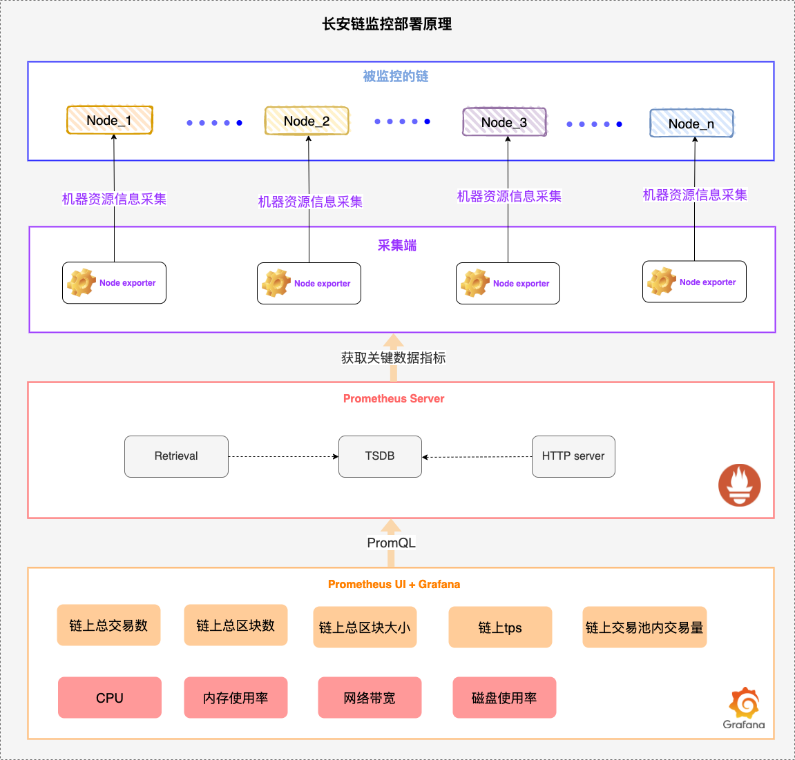

如上图所示，**监控部署原理：长安链监控数据中主要分为两个大类**

**链上资源**：这里主要指的是监控链上的交易量、总区块数、tps等，这里采集的方式通过设置**chainmaker.yml中的monitor值为true**即可获取到相关数据，通过端口号去区分不同的节点数据。

**链上节点所在的机器资源**：这里则是需要安装node_exporter来监控机器资源信息。
### 实操步骤：
#### 部署架构设计
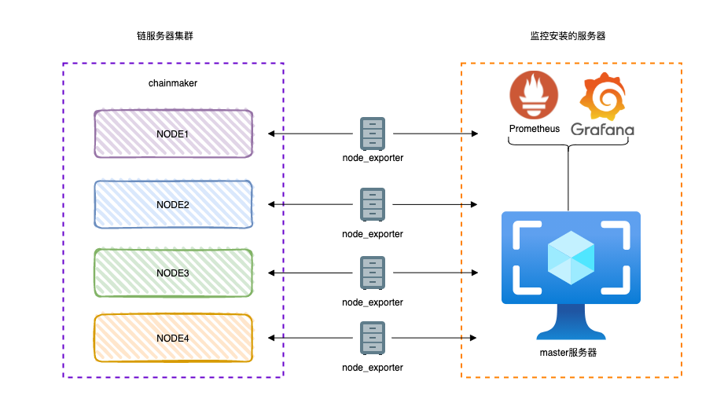

了解上面的原理后，我们来看一下整体的一个部署架构方案，这里我们举一个比较典型的例子，监控链上有四个节点的链，不管多链还是单链，chainmaker都贴心的为大家适配，因此不需要额外的调整配置。在实际生产中通常采用的分布式部署结构，链上的四个共识节点分别部署到不同的服务器上（这里有个很重要前提所有的服务器网络都必须是互通的）。监控安装的服务器最好选择一个磁盘稍微大一点的机器，因为在监控过程中会产生大量的数据，因此对磁盘的选择还是很重要的。具体的操作如下：

#### 1.Prometheus 安装：
去官网：https://prometheus.io/download/
下载对应的版本，根据自己的服务器系统进行选择：比如这里用的Linux系统


具体操作如下：

```
#下载后上传到指定的目录（上传的目录可以按照自己的喜好，比如我这里喜欢把安装包放在package中）
cd /data/package
```
Prometheus下载成功后，上传到此目录中：

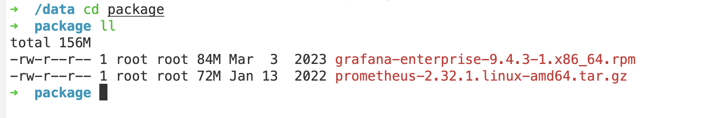

> ```bash
> # 解压缩包
> tar -vxf prometheus-2.32.1.linux-amd64.tar.gz -C /usr/local
> #解压后，软连接到一个目录，方便操作
> ln -sv /usr/local/prometheus-2.32.1.linux-amd64/ /usr/local/Prometheus
> #软连接以后，进入目录中
> cd /usr/local/prometheus-2.32.1.linux-amd64
> # 配置prometheus.yml，这一步需要安装node_exporter后配置最佳
> vim prometheus.yml
> # 配置成功后，直接运行即可
> nohup ./prometheus &
> #查看Prometheus启动是否成功
> ps -ef | grep Prometheus


上述操作就是安装Prometheus的操作，安装成功后是需要配置的，vim prometheus.yml（修改配置文件这一步可以等node_exporter安装并启动成功后配置），具体配置方法如下图：

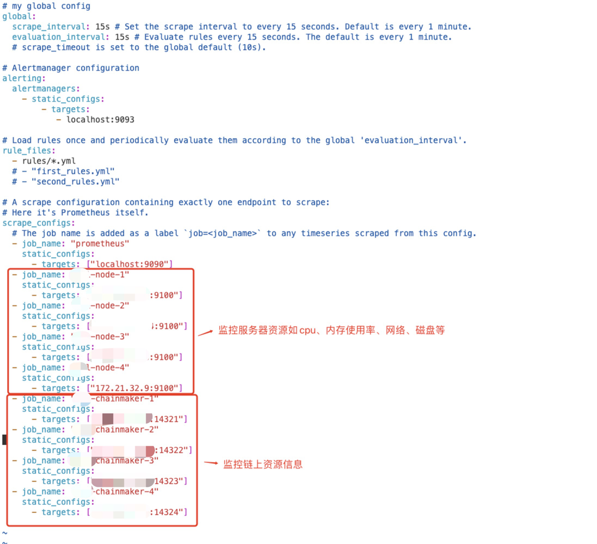

这里最关键部分是要映射到对的ip和对的端口号，这里的端口号9100的主要是监控机器资源信息的，而监控链上的资源信息的端口号要看chainmaker.yml中monitor配置下的端口号是多少，比如节点1默认端口号是14321，那么监控链上字段的端口号就要调整为14321，以此类推。
#### 2.node_exporter下载安装
安装node_exporter主要功能是用来采集节点所在的机器资源信息，比如服务器的cpu、内存、磁盘、网络等信息。
下载地址（还是普罗米修斯的那个地址，往下翻）：https://prometheus.io/download/
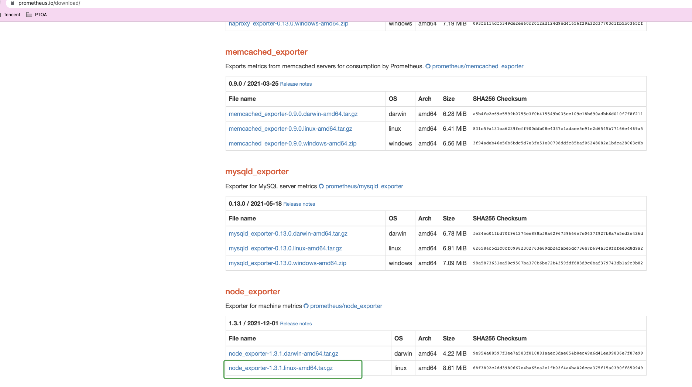


>
> 解压安装
>
> ```bash
> tar -vxf node_exporter-1.3.1.linux-amd64.tar.gz -C /usr/local
> # 解压后直接可以用
> nohup ./usr/local/node_exporter-1.3.1.linux-amd64/node_exporter &
> #查看node_exporter启动是否成功
> ps -ef | grep node_exporter


#### 3.Grafana下载安装
这一步的安装直接在服务器上下载安装包即可

>
> Ubuntu系统
>
> ```bash
> sudo apt-get install -y adduser libfontconfig1
> wget https://dl.grafana.com/enterprise/release/grafana-enterprise_8.3.3_amd64.deb
> sudo dpkg -i grafana-enterprise_8.3.3_amd64.deb


>
> centos系统
>
> ```bash
> sudo yum install -y https://dl.grafana.com/enterprise/release/grafana-enterprise-10.1.1-1.x86_64.rpm


在安装过程中如果出现错误如下：


> ```bash
> ➜  package sudo dpkg -i grafana-enterprise_8.3.3_amd64.deb
> Selecting previously unselected package grafana-enterprise.
> (Reading database ... 125323 files and directories currently installed.)
> Preparing to unpack grafana-enterprise_8.3.3_amd64.deb ...
> Unpacking grafana-enterprise (8.3.3) ...
> Setting up grafana-enterprise (8.3.3) ...
> Adding system user `grafana' (UID 118) ...
> Adding new user `grafana' (UID 118) with group `grafana' ...
> Not creating home directory `/usr/share/grafana'.
> ### NOT starting on installation, please execute the following statements to configure grafana to start automatically using systemd
> sudo /bin/systemctl daemon-reload
> sudo /bin/systemctl enable grafana-server
> ### You can start grafana-server by executing
> sudo /bin/systemctl start grafana-server
> Processing triggers for systemd (245.4-4ubuntu3.13) ...

>
> 按照提示命令执行一次
>
> ```bash
> sudo /bin/systemctl daemon-reload
> sudo /bin/systemctl enable grafana-server
> sudo /bin/systemctl start grafana-server


>
> Grafana启动与停止
>
> ```bash
> #Grafana状态查询
> systemctl status grafana-server
> #Grafana启动
> systemctl start grafana-server
> #Grafana停止
> systemctl stop grafana-server


启动成功的状态：

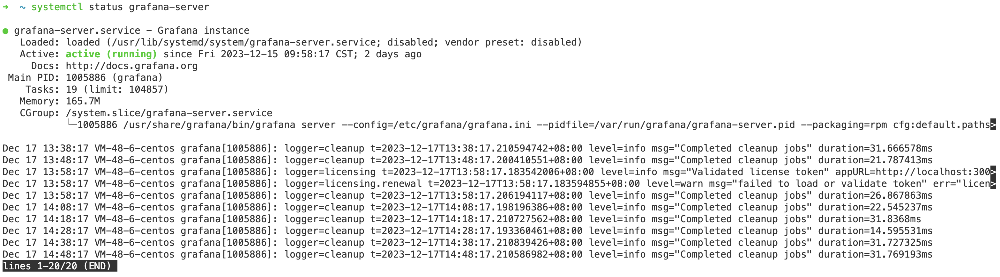

#### 4.安装成功检查
如果上述安装都操作成功后，可以得到以下几个地址：
```
Prometheus地址：http://安装Prometheus的服务器ip:9090/targets
Grafana地址：http://安装Grafana的服务器ip:3000
```
进入登录页面输入账号密码
```
Grafana登录的账号密码如下（默认账号密码，后续可以自定义修改）：
账号：admin
密码：admin
```


如果所有被监控的服务是正常的，具体如下图:

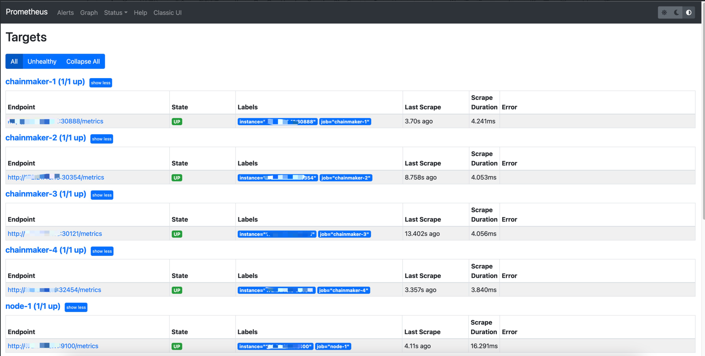

#### 5.Grafana配置
上述操作都操作成功后，下一步就是将Prometheus和Grafana进行关联，当然Prometheus也有自己的UI，不过分析资源信息监控这一类的使用Grafana看来了更方便。
先来看一下Prometheus UI：
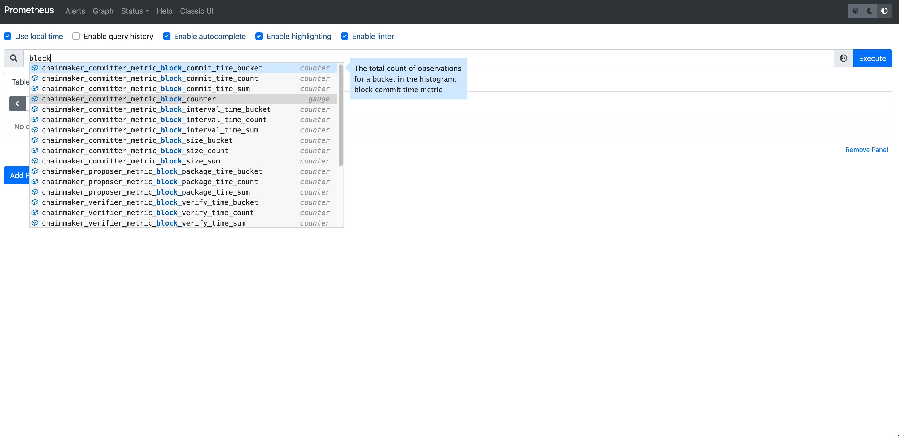

这里长安链为大家提供了很多指标参数，更多指标见本文最后表格部分。比如这里查询链上一共有多少区块，更多参数大家可以自由探索。
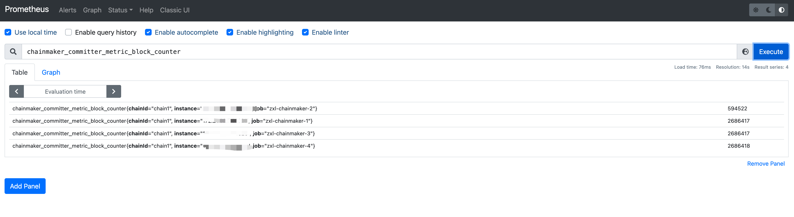

特别说明：如果上述安装操作都成功，这一步chainmaker指标搜索不到，要检查当前的链是否开启监控并且链上有交易
>
> 注：配置文件`chainmaker/config/config_tpl/chainmaker.yml`的`monitor`开关需要开启，默认是开启状态
>
> ```bash
> monitor:
>   enabled: true
> ```

接下来看一下Grafana的配置
##### 1.Grafana关联Prometheus数据
设置→Data sources→Add data source，如下图所示

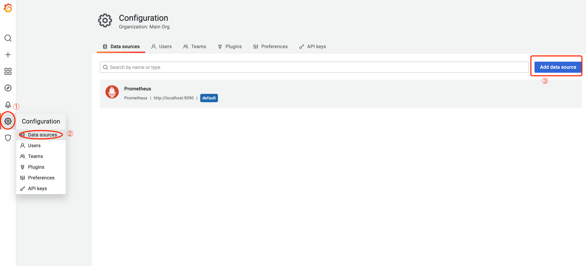

到了添加页面后，选择Prometheus，如下图所示

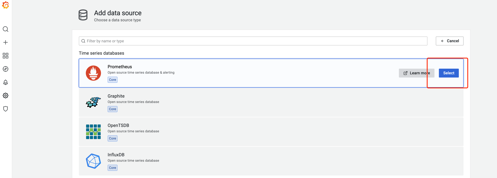

这里有一个很重要的地方，url一定要配置，具体如下图：

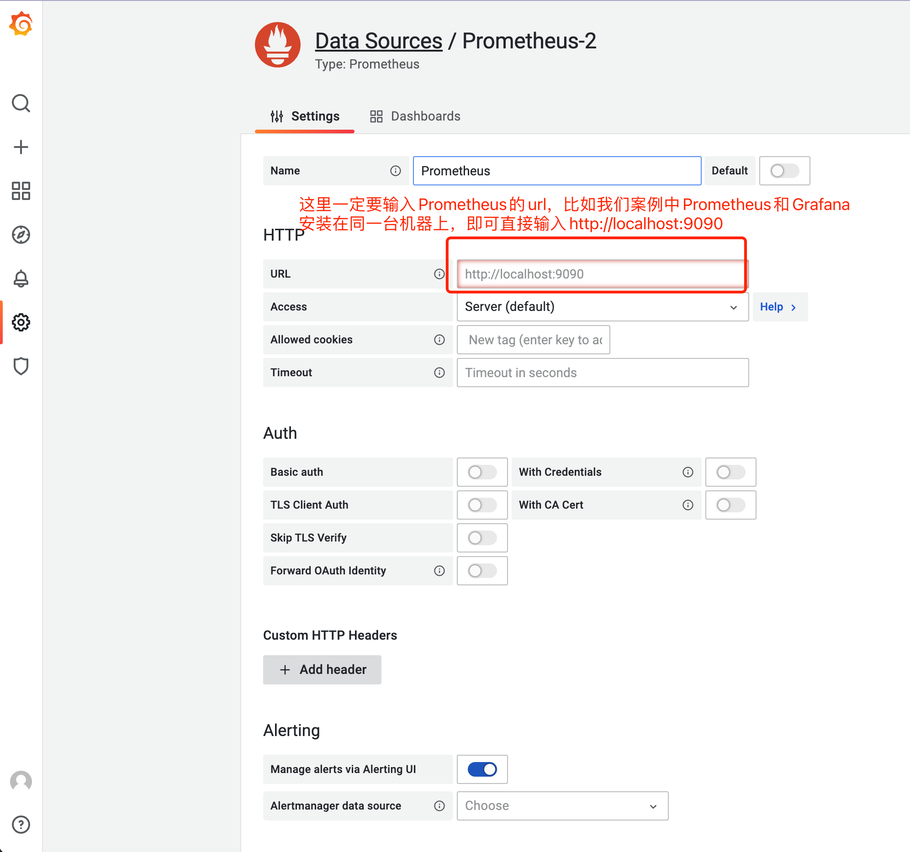

页面滑到最下面点击Test and save即可，这样Grafana与Prometheus的数据就关联成功了。

##### 2.Grafana监控模板导入
###### ①模板导入
点击左侧菜单的➕ → import →点击Upload Json file，上传模板，模板为json文件，具体见下。
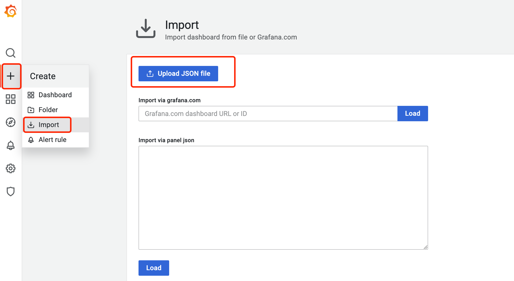

###### ②模板附件
监控服务器信息指标：
[服务器信息监控配置](../download/prometheus-monitor-server.json) 

监控chainmaker指标：
[长安链监控配置](../download/prometheus-monitor-chainmaker.json) 

###### ③配置成功效果
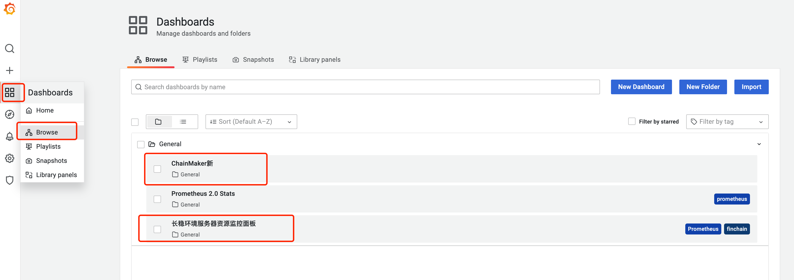
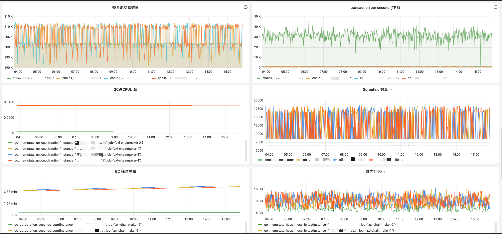
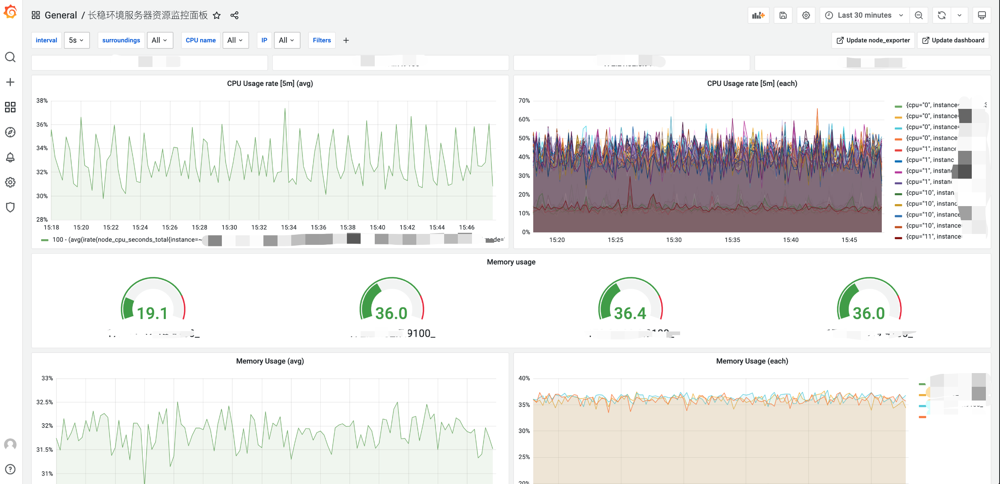


到这一步，我们的监控已经是安装成功了。如果链上资源监控页没有数据，可以尝试发一笔交易试试。
## 总结：
在实际生产环境中，我们对于实时监控链上资源的需求变得尤为重要，尤其是对于企业级数据监控。通过引入高度可视化的数据，我们不仅能够实时监测关键数据指标，还能够提前预警并快速响应节点异常等情况。预警支持邮件通知以及企业微信通知。


<br>

## 长安链支持监控指标

| 指标名称                                                      | 触发条件      | 指标关键字     | 标签格式 | 统计方式 |
|:----------------------------------------------------------|:----------|:-----|:-----|:-----|
| 查询（Query）交易统计                                             | 查询交易/查询系统链执行完成   | chainmaker_rpcserver_metric_query_request_counter    | ${ChainID}-${State}    | 计数器  |
| 调用（Invoke）交易统计                                             | 调用交易执行完成   | chainmaker_rpcserver_metric_invoke_request_counter    | ${ChainID}-${State}    | 计数器  |
| 调用（Invoke）交易大小统计                                             | 调用交易执行完成   | chainmaker_rpcserver_metric_invoke_tx_size_histogram    | ${ChainID}-${State}    | 直方图  |
| 查询合约统计                                             | 查询交易执行完成   | chainmaker_rpcserver_metric_query_contract_request_counter    | ${ChainID}-${ContractName}-${Method}-${CurrTimeDate}-${State}    | 计数器  |
| 非法调用计数                                             | 验证交易失败   | chainmaker_rpcserver_metric_tx_invoke_illegal    | ${ChainID}-${CurrTimeDate}-${TxID}-${SingerMemberInfo}    | 计数器  |
| 订阅发起总数统计                                             | 接收到订阅请求时增加计数   | chainmaker_rpcserver_metric_subscribe_total_counter    | ${ChainId}-${Sender}-${SubscribeType}-${ContractName}-${Topic}    | 计数器  |
| 当前活跃订阅统计                                             | 接收到订阅请求时增加计数，方法退出时减少计数   | chainmaker_rpcserver_metric_subscribe_active_counter    | ${ChainId}-${Sender}-${SubscribeType}-${ContractName}-${Topic}    | 仪表盘  |
| 订阅中断总数统计                                             | 订阅方法异常退出时增加计数（正常退出不增加计数）   | chainmaker_rpcserver_metric_subscribe_interrupted_counter    | ${ChainId}-${Sender}-${SubscribeType}-${ContractName}-${Topic}    | 计数器  |
| 交易池使用大小统计                                             | single/batch/normal交易池向交易池中放交易/取交易时   | chainmaker_txpool_metric_tx_pool_size    | ${ChainID}-${PoolType}    | 仪表盘  |
| 验证交易重复时间                                             | single交易池验证交易重复   | chainmaker_txpool_validate_tx_exist_db_time    | ${ChainID}    | 直方图  |
| 验证交易签名时间                                             | single交易池验证交易签名   | chainmaker_txpool_validate_tx_sign_time    | ${ChainID}    | 直方图  |
| 区块打包时间统计                                             | 打包区块时统计打包区块所需时长   | chainmaker_proposer_metric_block_package_time    | ${ChainID}    | 直方图  |
| 随机函数攻击统计                                             | 触发随机函数剔除逻辑时统计【每笔交易均会统计】   | chainmaker_proposer_metric_random_tx_attack    | ${ChainID}-${contractName}-${Method}-${CurrTimeHours}    | 计数器  |
| 区块验证时间统计                                             | 区块验证时统计验证区块所需时长   | chainmaker_verifier_metric_block_verify_time    | ${ChainID}    | 直方图  |
| 区块大小统计                                             | 提交区块时统计   | chainmaker_committer_metric_block_size    | ${ChainID}    | 直方图  |
| 区块高度统计【持久化】                                             | 提交区块时统计   | chainmaker_committer_metric_block_counter    | ${ChainID}    | 仪表盘  |
| 交易个数统计【持久化】                                             | 提交区块时统计   | chainmaker_committer_metric_tx_counter    | ${ChainID}    | 计数器  |
| 区块提交时间统计                                             | 提交区块时统计   | chainmaker_committer_metric_block_commit_time    | ${ChainID}    | 直方图  |
| 出块间隔时间统计                                             | 提交区块时统计   | chainmaker_committer_metric_block_interval_time    | ${ChainID}    | 直方图  |
| 长安链tps统计                                             | 提交区块时统计   | chainmaker_committer_metric_tps_gauge    | ${ChainID}    | 仪表盘  |
| 合约方法调用次数统计                                             | 提交区块时统计   | chainmaker_committer_metric_method_invoke_counter    | ${ChainID}-${ContractName}-${Method}    | 计数器  |
| 节点TBFT当前高度信息                                             | 进入新高度时、广播状态消息前统计   | chainmaker_consensus_node_status_height_${NodeId}    | ${ChainID}-${LocalId}-${NodeId}    | 仪表盘  |
| 节点TBFT共识的Round信息                                             | 进入新Round时、广播状态消息前统计   | chainmaker_consensus_node_status_round_${NodeId}    | ${ChainID}-${LocalId}-${NodeId}    | 仪表盘  |