# 虚拟机测试工具
## WasmFuzzer设计文档
<style>
table
{
    margin: auto;
}
</style>
### 设计与实现
下面将阐述WasmFuzzer，一款针对WebAssembly虚拟机的模糊测试工具，是如何被设计与实现的。 
#### WasmFuzzer架构图
下面是WasmFuzzer的架构图,如图1所示。

<div align=center>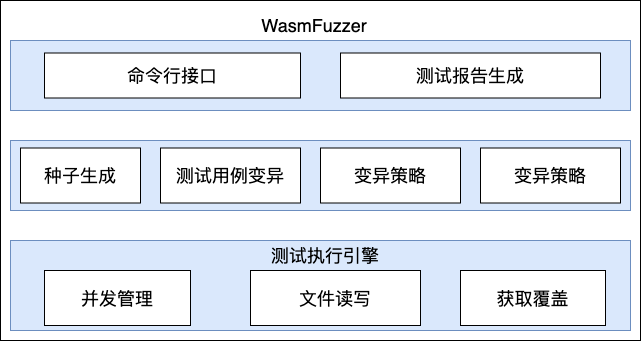</div><br />

<center>图 1  WasmFuzzer架构图</center><br />


如图所示，WasmFuzzer主要包括三个部分，展示层主要包括命令行接口和测试报告的生成，中间层主要有种子生成、测试用例的变异，变异策略和结果的判定。测试执行引擎包括Forkserver、读写文件和覆盖的获取。
#### WasmFuzzer工作流程
WasmFuzzer是一款用于测试WebAssembly虚拟机的模糊测试工具。WasmFuzzer的工作流程如图 2所示。图中的队列指的是当前等待被使用的WebAssembly模块列表。在WasmFuzzer运行过程当中，会以先进先出的顺序使用队列当中的WebAssembly模块。WasmFuzzer在运行开始时会读取初始WebAssembly代码文件，将它们解析后加入到队列当中。这些初始WebAssembly代码文件还会在此时被输入到WebAssembly虚拟机当中执行测试，以得到初始的路径信息。

WasmFuzzer最核心的工作是图2中所示的从“从队列中取出队首WASM模块”到“结束模糊测试”之间的循环：将当前WebAssembly模块通过WasmFuzzer内置的各种变异操作进行变异后输入给WebAssembly虚拟机进行执行；检测该虚拟机结束时的状态以判断它是否崩溃，同时根据运行时信息判断是否找到了新的路径；如果找到了新的路径或是出现了新的崩溃，那么则会将记录这个情况并将该WebAssembly模块加入到队列中；如果不继续在相同的WebAssembly模块上进行变异，则会从队列中取出另一个WebAssembly模块进行变异；直到队列为空后，再将所有曾经保存到队列中的WebAssembly模块重新加入到队列中以进行更多的模糊测试。

虽然图中表示在队列为空的时候进行判断是否结束模糊测试，但是实际上自动化运行模糊测试时会不进行判断而直接继续执行，此时需要通过其他的终止条件停止WasmFuzzer的运行。WasmFuzzer进行模糊测试的终止条件一般是这两种其一：接收到了SIGINT信号，即测试者手动按下CTRL+C组合键终止程序的运行；或是WasmFuzzer的主进程被外界结束，例如是到了定时时间被自动结束。
<div align=center>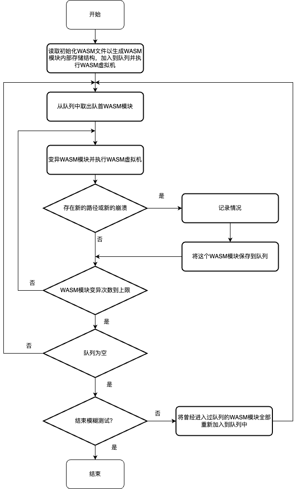</div><br />

<center>图 2  WasmFuzzer工作流程图</center><br />


#### 生成指令
指令是WebAssembly代码当中的基础单位。若要完整地测试WebAssembly虚拟机，则需要尽可能地覆盖所有指令。WasmFuzzer提供生成指令的功能，包含两部分工作：创建指令对象和随机生成参数。
##### 创建指令对象
指令对象是WasmFuzzer中存储WebAssembly模块中指令的形式，需要按照一定的步骤进行创建。创建指令对象的步骤主要包括：先读取这个指令所需要的参数，之后使用参数创建这个指令的全新对象并获得它的指针，最后再将得到的指令对象指针返回。指令所需要的参数由外部生成，一般会需要是一个合法的参数。创建指令对象时直接使用独占指针创建这个指令的对象，用于保证该指令对象能够在不再使用的时候能够自动释放。在指令生成后，即可返回它的指针。

由于WebAssembly指令数量较多，在生成时如果每个指令都写一份各自的生成逻辑，代码的冗余会很高，在修复代码错误时也会有更高的代价。但是如果完全将代码分类后按照类型进行处理，则会因为需要大量的分支判断而导致性能的下降。因此，在此处将指令进行简单分类后再进行实现指令的生成，差别极小的将被合并处理，而存在着一定差别的则各自实现。这里的分类与第二章中WebAssembly的设计中的分类有着一定的区别。

单独使用的一条指令，包括unreachable、select、br、br\_if等控制指令、drop和select这种参数指令、get和set这种变量指令、所有表格指令和所有内存指令。这些指令的特点是与上下指令无关，也与类型无关。它们涉及到的参数各自不同。在这种情况下，需要对这些指令进行各自实现。

以end指令结束的控制指令，包括block、if、loop这3条控制指令。这些指令的特点类似，区别仅仅在于if和loop有它们特定的参数。出于执行效率的考虑，这里还是各自实现，但是它们的实现形式几乎完全一致，仅仅在处理参数时有所不同。这里不统一实现的考虑在于处理参数的办法是不同的，如果要统一处理的话，在处理参数时还会需要进行一次分支判断。

常量指令，包括i32.const、i64.const、f32.const和f64.const。这些指令的行为完全一致，但是参数的长度有所不同。与指令块指令一样，这里对这4个指令也是分开实现，它们的实现形式几乎完全一致。

其他运算指令，包括各种数据类型的abs等单操作数指令，add、sub等双操作数指令，eqz等测试指令，eq等比较指令，reinterpret等转换指令。这些指令没有参数，行为完全一致，所以可以在各自分类中直接统一实现生成，无需考虑分支跳转的影响。
##### 随机生成参数
在创建指令对象的过程中需要将参数加入到指令内，所以应该先生成指令的参数再创建指令对象。由于模糊测试是自动化进行测试，生成参数也需要自动化地随机生成。为了与指令对象保持一致，生成参数的分类方法与创建指令对象时相同。如果在创建指令对象时是各自实现的，那么在生成参数时同样也是各自实现的；如果在创建指令对象时是在分类内统一实现生成的，那么在生成参数时同样也是在相同的分类内统一实现生成。根据指令的特点，生成参数时主要有着两种方法：从模块中选择参数和从数据域中生成参数。

从模块中选择参数是在指令的功能依赖模块内部情况时使用的，从模块中选择一个合法的值并返回生成参数成功，如果不存在合法的值则返回生成参数失败。例如global.set指令的作用是设置某个全局变量为栈顶值，它的参数仅有1个全局变量编号。所以在生成该指令的参数时，需要从模块内全局数组中获得所有全局变量，并从中选择其一作为指令的参数（或是直接返回生成参数失败）。

而从数据域中生成参数是在指令需要读取预先设定好的值时使用，从一个数据范围内随机选择值返回。例如i32.const指令的作用是往栈上增加一个32位整数常量，它的参数仅有1个常量值。所以在生成该指令的参数时，需要从32位整数域（从0到4294967295）中随机选择一个整数返回。

实际上WebAssembly指令中还存在着一些不需要生成参数的情况，例如nop指令的作用是不进行任何操作。在指令不需要参数的情况下，生成参数时直接返回成功即可。
#### 变异模块
模块是WebAssembly的基本单位。当已有一个模块时，就可以在它上面进行变异，获得一个新的模块，用于模糊测试。变异模块时首先需要有着一定量的变异操作，能够对WebAssembly模块进行各种各样的修改，以尝试生成各种各样的WebAssembly代码文件，进而测试到WebAssembly虚拟机的更多代码。在WasmFuzzer提供了若干个变异操作之后，如何高效率地使用这些变异操作成为了一个问题。由于模糊测试需要生成大量测试用例用于测试，如果变异操作使用不当会生成很多无用的测试用例，进而导致测试的效率降低。因此，需要按照一定的规则合理地使用这些变异操作。这也就是为什么需要设计并实现WebAssembly模块的变异策略。变异WebAssembly模块的操作和策略将在第四章详细论述。

每次变异WebAssembly模块的时机都在执行WebAssembly虚拟机之前。在WasmFuzzer运行过程中，从队列当中取出一个WebAssembly模块之后，就需要在这个模块上执行一定次数的变异操作。只要执行了变异操作之后就会立刻将WebAssembly模块输入给WebAssembly虚拟机进行测试，并获取虚拟机运行时和运行后的相关数据。
####  错误检测
在软件运行过程中，可能会发出一些信号，让外部介入，调用预设的信号处理软件WasmFuzzer进行处理。WasmFuzzer可以记录下当前的运行状态，进而改进测试质量与记录崩溃位置。这些信号虽然会引发软件崩溃从而报告软件错误，但是这些崩溃不一定是由软件的漏洞导致的。在记录下当前数据之后，还需要人工判断具体的情形。

一些错误信号是很明确的软件漏洞，需要重点关注。例如SIGSEGV信号指的是非法内存引用，对内存进行了错误的操作。而有的错误信号是可能存在漏洞，同样需关注。例如SIGABRT信号则是调用了abort函数，可能是软件运行时进入了不应出现的状态，具体是什么状态则需要人工进行判断。

AddressSanitizer[1]是用于检测地址相关的软件错误的插桩代码库，在本次研究当中被使用。它可用于检测释放后使用、缓冲区溢出等错误类型。AddressSanitizer在检测到这些问题后，同样会发出SIGABRT信号。
#### 测试结果生成
测试结果主要分为3部分：在队列中的WebAssembly字节码、发生独特崩溃的WebAssembly字节码和独特挂起的WebAssembly字节码。这里的“独特”指的是这些字节码之间所运行的代码路径存在区别。若干个独特崩溃（挂起）可能会由同一个软件问题所触发。这些WebAssembly字节码通过WasmFuzzer提供的保存到文件接口保存到文件当中，进而为之后分析数据做准备。

在队列中的WebAssembly字节码是指WasmFuzzer运行过程中加入到队列当中的那些WebAssembly模块所对应的字节码。这些数据在被WasmFuzzer首次加入到队列中时就会保存到文件当中，可用于分析WasmFuzzer运行时所涉及到的代码覆盖情况。

发生独特崩溃的WebAssembly字节码指在WasmFuzzer运行过程中生成的WebAssembly模块导出到被测程序后，使得被测程序独特崩溃的那些字节码。这些数据在WasmFuzzer记录到独特崩溃之时就会被保存到文件当中，它们主要被用于分析测试结果。

独特挂起的WebAssembly字节码是在WasmFuzzer运行时生成的WebAssembly模块导出到被测程序后，在限定时间内程序没有结束，且运行路径与之前挂起的字节码不同的那些字节码。本文不对这些WebAssembly字节码进行分析，但是在一些特定的场景下（例如部分区块链应用有时间限制）可能会需要使用到这部分数据。它们是在WasmFuzzer记录到独特挂起时被保存到文件当中。
#### WebAssembly代码输入与输出
在WasmFuzzer启动时，会需要读取一些初始的WebAssembly代码文件。这些文件被存储在一个文件夹中，WasmFuzzer启动时遍历整个文件夹当中的所有文件，并通过WasmFuzzer提供的文件读取功能将这些文件读取至内存，在WasmFuzzer内初始化这些WebAssembly模块。这些WebAssembly代码文件还将被输入到被测软件中进行测试，以获得最初始的路径信息。当需要将WebAssembly代码输入到被测软件时，以及需要生成测试结果时，WasmFuzzer会将内部存储的WebAssembly模块输出到文件当中。

读取WebAssembly代码文件时，通过一个被命名为WasmFuzzerFile的C风格的结构体进行实现，如表 1所示。该结构可以直接序列化而不用任何编码解码工作（由于使用到了指针，具体占用的空间需要根据当前计算机环境决定）。


```C
typedef struct WasmFuzzerFile {
    void* dataPtr;
    int32_t dataLen;
    MutationType mutationType;
    uint64_t mutationPos;
    uint64_t mutationData;
} WasmFuzzerFile;
```

<center>表 1  WasmFuzzerFile结构体定义</center><br />


WasmFuzzerFile结构总共有5个域：void型指针dataPtr，用于指向该结构所存储的代码数据，它实际上可能是WebAssembly模块类指针，也有可能是用于存放纯二进制数据的char型指针；32位有符号整数dataLen，用于对dataPtr进行分类，如果dataLen的值是-1则表明dataPtr是Module类指针，其他的值则说明dataPtr是char型指针，值表示文件的长度；枚举对象mutationType，可取未决定NOT\_DECIDED、不变异NONE和覆写字节OVERWRITE\_BYTE这3个值，用于定义输出到文件时是否需要进行额外的变异操作；64位无符号整数mutationPos，用于记录覆写字节的位置；64位无符号整数mutationData，用于存储覆写字节的值。

结构中mutationType的取值当中如果要变异的话，变异选项是只有一个覆写字节，后面的mutationData的数据类型是占用8个字节的64位整数。看起来虽然很矛盾，但是这是为了之后扩展的考虑而设计的。如果未来需要，mutationPos和mutationData这两个域都是64位整数，可以使用强制类型转换变成最长64位的指针，在当前的计算机架构上已经够用。在当前仅能覆写字节的情况下，mutationData只需要使用到这8个字节当中的1个字节即可。

读取WebAssembly代码文件时，该函数有2个参数：文件名和指向指向WasmFuzzerFile结构的指针的指针（即数据类型为WasmFuzzerFile\*\*，实际在实现时使用的统一是void\*\*，便于进行强制类型转换）。该指针在传入时应为空值，函数内部会分配堆上一个WasmFuzzerFile\*型数据给该指针，并使用该数据读取WebAssembly代码文件。dataPtr和dataLen在读取WebAssembly代码文件时被赋值，且会在需要将模块写入文件时被使用。由于读取的文件可能不是WebAssembly代码，所以保留了dataLen为-1的情况用于存储纯二进制代码，WasmFuzzer提供的所有针对模块的变异操作均不能在这种情况下使用。而mutationType被默认设置为未决定，mutationPos和mutationData此时的值均无意义。读取WebAssembly代码文件的伪代码如表 2所示。为了表述上的清晰，输入仅有一个文件名，输出为WasmFuzzerFile结构体变量指针。


```C++
//输入：文件名filename
//输出：WasmFuzzerFile结构*file
WasmFuzzerFile* file = new WasmFuzzerFile;
file->mutationType = NOT_DECIDED;
二进制数据* data = 读取文件(filename);
模块* module = 读取模块(data);
if (module == NULL) { // 不是WebAssembly模块
    file->dataLen = data->长度;
    file->dataPtr = data;
}
else { // 是WebAssembly模块
    file->dataLen = -1;
    file->dataPtr = module;
    delete data;
}
return file;
```
<center>表 2  读取WebAssembly代码文件伪代码</center><br />


写入WebAssembly代码文件时，该函数同样是与读取时一致的2个参数：文件名和指向指向WasmFuzzerFile结构的指针的指针。在结构体内，mutationType、mutationPos和mutationData用于输出文件时使用。WebAssembly代码在输出到文件之后，检查mutationType的值。当mutationType是未决定时会先随机地变成不变异或覆写字节，同时mutationPos和mutationData会随机变成2个64位整数。之后如果mutationType是覆写字节则会重新打开输出的文件，并在mutationPos对文件长度取余数的位置写mutationData中的1个字节进行覆盖。写入WebAssembly代码文件的伪代码如表 3所示。为了表述上的清晰，输入为文件名和WasmFuzzerFile结构变量指针，没有输出。

在这里展示两个初始WebAssembly代码文件，分别为add.wasm和nothing.wasm。这两个文件将在实验评估中使用。

第一个初始WebAssembly代码文件add.wasm包含一个导出的函数add，接受2个32位整数参数，并返回1个32位整数参数。这个函数的功能是将这两个参数相加。WebAssembly文本格式的add.wasm代码如表 4所示。


```C++
//输入：	文件名filename、WasmFuzzerFile结构*file
//输出：	无
if (file->dataLen != -1) { // 如果不是WebAssembly模块
    return;
}
写入模块(filename, file->dataPtr);
if (file->mutationType == NOT_DECIDED) {
    file->mutationType = 随机选择(NONE, OVERWRITE_BYTE);
    file->mutationPos = 随机整数();
    file->mutationData = 随机整数();
}
if (file->mutationType == OVERWRITE_BYTE) {
    覆写字节(filename, file->mutationPos, file->mutationData);
}
return;

```
<center>表 3  写入WebAssembly代码文件伪代码</center><br />


```wasm
(module
    (func $add (param $lhs i32) (param $rhs i32) (result i32)
    get_local $lhs
    get_local $rhs
    i32.add)
    (export "add" (func $add))
)
```
<center>表 4  add.wasm（WebAssembly文本格式）</center><br />


第二个初始WebAssembly代码文件nothing.wasm包含一个导出的函数add，没有任何参数，返回1个32位整数参数。这个函数共3条WebAssembly指令：获取32位整数常量1、获取32位整数常量2、32位整数相加。这样的函数，正常运行的返回值是3。WebAssembly文本格式的nothing.wasm代码如表 5所示。


```wasm
(module
    (func $add (result i32)
    i32.const 1
    i32.const 2
    i32.add)
    (export "add" (func $add))
)
```
<center>表 5  nothing.wasm（WebAssembly文本格式）</center><br />


#### 小结
本章主要介绍了WasmFuzzer这款针对WebAssembly虚拟机的模糊测试工具的设计和实现。通过指令生成来为测试各种WebAssembly指令做好准备后，WasmFuzzer即可通过变异WebAssembly模块来源源不断地生成新的测试用例。WasmFuzzer能够对错误进行检测以及生成测试结果，并提供了针对WebAssembly代码文件的输入输出功能。


### 变异操作与策略
变异WebAssembly模块是WasmFuzzer当中重要的组成部分。在第三章中已经论述过变异WebAssembly模块的原因，在本章当中将详细论述变异WebAssembly模块的操作与策略。
#### 变异操作
变异操作是对WebAssembly模块进行变异的方法。这些操作对模块的各个部分进行了一定的修改，让经WasmFuzzer修改而得的模块能覆盖到WebAssembly虚拟机的各种功能。
##### 变异操作列表
变异操作分为2个类型：针对函数的操作和针对函数以外的操作。目前WasmFuzzer已支持的变异操作如表 6所示。


|分类|函数签名|功能|
| :-: | :-: | :-: |
|针对函数的操作|insertInstruction|插入一条指令|
||eraseInstruction|删除一条指令|
||moveInstruction|移动一条指令|
||addFunction|增加一个空函数|
||eraseFunction|删除一个函数|
||swapFunction|交换两个函数的位置|
|针对函数以外的操作|addGlobal|增加一个全局变量|
||eraseGlobal|删除一个全局变量|
||swapGlobal|交换两个全局变量的位置|
||addExport|增加一个导出条目|
||eraseExport|删除一个导出条目|
||swapExport|交换两个导出条目的位置|
||addType|增加一个类型|
||addMemory|增加一块存储空间|
||setStart|设定开始函数|
||eraseStart|删除开始函数|

<center>表 6  WasmFuzzer变异操作列表</center><br />


针对函数的操作主要是在指令序列上进行修改。指令序列是WebAssembly代码的核心部分，包含着实现函数功能的所有指令。在指令序列上进行修改时，可以生成一条新指令并插入到指令序列中，以及删除、移动已经存在的指令。这里指令序列的实现方式是侵入式链表，所以在插入、删除以及移动指令的时候开销不大，而且省去了插入新指令时的复制操作。生成新指令时，先随机生成一个指令，再根据这个指令的特点生成它的操作数，最后找到一个合适的插入点将该指令插入。删除指令是随机定位一条指令，将其从指令序列中删除。移动指令则是先随机定位一条指令用于移动，再随机定位另一条指令用于标记插入位置，将第一条指令从指令序列中删除后再插入到第二条指令的位置。除了在指令序列上进行操作之外，针对函数的操作还包括创建一个新的空函数、删除一个已有的函数和交换两个函数的位置。增加一个新函数需要先随机选取一个函数类型，之后创建一个新函数的独占指针并插入至模块中。删除一个函数则是随机定位一个函数，将其从模块中删去。交换两个函数的位置是随机定位两个不同的函数，直接交换它们的指针即可。

针对函数以外的操作是在模块其他部分进行的，这些操作用于完善WebAssembly文件的各种情形。目前支持的操作包括增加全局变量、增加导出、增加类型和设定开始函数等。这些操作能够反馈回针对函数的操作，使得可用的指令种类更多。例如global.set指令需要有一个合法的全局变量作为操作数，这个全局变量就可以先在针对函数以外的操作中创建。这些操作相对实现时较为简单，根据这些操作实际需要的限制条件进行实现即可。例如在增加一个全局量时，需要确定它是变量还是常量，还需要确定它的数据类型。这些都确定了之后，即可新增这个全局量到模块中。

在对一个合法的WebAssembly模块执行了变异操作之后，是有可能会让WebAssembly代码变得不再合法的。这里的设计思路为不保证变异后的WebAssembly代码合法，只是让变异后的WebAssembly代码保持其应有的结构。上文中所谓“合法”的WebAssembly代码指的是能够通过WebAssembly文档所论述的验证（Validation）[1]的 WebAssembly代码，它有着非常严格的验证流程。例如，如果一个WebAssembly模块拥有着函数，这些函数的类型必须是类型数组中的函数类型，否则就是不合法的。为了尽可能地生成合法的WebAssembly代码，有一些变异操作看似很好实现但是并没有加入到WasmFuzzer当中。例如删除一个类型（eraseType）变异操作，在代码实现上非常简单，但是使用时很容易导致代码变得不合法。如果当前仅有1个函数，也只有1个类型，执行删除一个类型变异操作后就不存在任何类型了，那个未删除的函数也无法正常执行，直到增加一个兼容该函数的类型之后才能执行。在这种情况下可能导致WasmFuzzer生成的大量WebAssembly代码不合法且无法被WebAssembly虚拟机执行，影响WasmFuzzer进行模糊测试的效率。

不过也并不是所有会导致WebAssembly不合法的变异操作都不会使用，删除一个全局变量（eraseGlobal）变异操作就是一个例子。如果一开始的WebAssembly代码文件当中没有对全局变量进行任何操作，依次执行增加一个全局变量、插入一条global.set或global.get指令、删除一个全局变量这3个变异操作是会导致WebAssembly代码不合法，但是这种情况出现的概率相比删除一个类型导致WebAssembly代码不合法的概率要低很多，因此也就被保留下来。
##### 变异操作的实现
与指令相关的操作都是需要对指令列表（其数据结构为侵入式链表）进行修改。这里以插入一条指令（insertInstruction）变异操作为例，其伪代码如表 9所示。首先判断模块当中是否有函数，如果没有则不做任何修改。之后随机选择一条指令并生成其参数，再生成该指令的对象。最后随机选择模块当中一个函数，并在该函数内部随机选择一个位置插入刚才生成的指令对象，即可完成指令的插入。删除一条指令与移动一条指令的实现方法与之类似，这里不再赘述。


```C++
//输入：	WebAssembly模块module
//输出：	插入一条指令后的WebAssembly模块module
if (module.函数数组.大小() == 0) {
    return module;
}
指令代码 opcode = 随机指令();
(参数, bool) (state, success) = 随机生成参数(opcode);
if (success == false) {
    return module;
}
指令* expr = 生成指令(opcode, state);
函数 func = module.函数数组.随机元素();
func.指令列表.随机插入(expr);
return module;
```
<center>表 7  插入一条指令的变异操作伪代码</center><br />


而与指令以外的相关操作基本都是在数组中进行修改。这里以增加一个空函数（addFunction）、删除一个全局变量（eraseGlobal）和交换两个导出条目的位置（swapExport）这三个变异操作为例，剩下的各种变异操作的实现方法与这三个类似，这里同样不再赘述。

增加一个空函数变异操作伪代码如表 9所示。该变异操作需要保证类型数组当中有函数类型，否则将不予增加。之后随机选择一个函数类型，并生成一个该函数类型的函数对象，增加到函数数组的最后。


```C++
//输入：	WebAssembly模块module
//输出：	增加一个空函数后的WebAssembly模块module
类型数组 funcTypeVector = module.类型数组.筛选(种类=函数);
if (funcTypeVector.大小() == 0) {
    return module;
}
类型 funcType = funcTypeVector.随机元素();
函数* func = new 函数(funcType);
module.函数数组.增加元素(func);
return module;
```
<center>表 8  增加一个空函数的变异操作伪代码</center><br />


删除一个全局变量变异操作伪代码如表10所示。该变异操作需要先判断全局数组当中是否有全局变量，如果没有则直接返回。之后则随机选择其中一个全局变量，将该对象删除后再从全局数组中移除。由于全局数组在内存中占有连续的存储空间，此时删除中间的元素可能导致全局数组元素的移动。


```C++
//输入：	WebAssembly模块module
//输出：	删除一个全局变量后的WebAssembly模块module
if (module.全局数组.大小() == 0) {
    return module;
}
int position = module.全局数组.随机位置();
delete module.全局数组[position];
module.全局数组.删除位置(position);
return module;
```
<center>表 9  删除一个全局变量的变异操作伪代码</center><br />


交换两个导出条目的位置变异操作伪代码如表11所示。该变异操作需要先保证导出数组中至少有着2条导出条目，否则将直接返回。之后随机选择其中2条导出条目，调用交换函数将它们交换即可。这里并不考虑交换的两个元素是同一个元素的情况，即如果交换了同一个元素，则执行了交换两个导出条目的位置变异操作后对WebAssembly模块没有改变。


```C++
//输入：	WebAssembly模块module
//输出：	交换两个导出条目的位置后的WebAssembly模块module
if (module.导出数组.大小() <= 1) {
    return module;
}
int position0 = module.导出数组.随机位置();
int position1 = module.导出数组.随机位置();
swap(module.导出数组[position0], module.导出数组[position1]);
return module;
```

<center>表 10  交换两个导出条目的位置的变异操作伪代码</center><br />


####  变异策略
WasmFuzzer在进行变异时，需要在提供的变异操作中选择合适的变异操作。以什么方式选择变异操作、选择哪些变异操作就成了需要考虑的问题。这些问题的答案总结后被称作变异策略。目前WasmFuzzer提供3种不同的变异策略：顺序遍历、随机变异、自适应变异。
#####  顺序遍历策略
在每次从队列中取出一个WebAssembly模块时，所有的变异操作均需要依次执行一次，这就是顺序遍历策略。这些变异操作的顺序与变异操作所对应的函数被声明的顺序一致，即和表 7中顺序一致。使用伪代码说明的顺序遍历策略的流程如表11所示。

顺序遍历的优点在于执行速度快，顺序执行不需要进行分支操作，进而在相同时间内得到更多的WebAssembly代码文件。同时，顺序遍历的代码也十分清晰，比较容易被实现和被理解。


```C++
//输入：	从队列中取出的WebAssembly模块wasm、当前状态status
//输出：	执行了顺序遍历策略后的状态status
变异操作表[0](wasm);
执行并分析(wasm, status);
变异操作表[1](wasm);
执行并分析(wasm, status);
…	…
变异操作表[15](wasm);
执行并分析(wasm, status);
return status;
```
<center>表 11  顺序遍历策略伪代码</center><br />


但是顺序遍历的缺点也很明显，得到的WebAssembly代码文件不完全随机，而是按照一定的顺序出现的。例如这样一种情况：如果队列的起始文件当中唯一的那个函数有着1条指令，则接下来所有的这个函数都至少有着1条指令。这是因为顺序遍历的顺序是先增加一条指令再删除一条指令，也就是说如果当前的这个函数有1条指令，增加一条指令后变成了2条，删除一条指令后又变回了1条。这个过程没办法在最初的时候就减少指令的条数，但是有可能会增加。毕竟2条指令时会被导出至WebAssembly代码文件作为测试用例，这个文件可能被加入到队列中作为其他测试用例的变异来源，这个时候最初的指令条数就变成了2条。之后增加一条指令后变成了3条，删除一条指令后变成了2条，也不会出现没有指令的情况。除非通过先增加一个空函数后再删除最开始的那个函数才能保证接下来可能出现没有指令的函数，这个过程相对而言就复杂了一些，需要更多的时间来执行。

除此之外，顺序遍历还可能导致出现生成的WebAssembly代码与之前已有的代码完全一致的情况的概率较大，进而执行了无用功。例如以下这种情况。当前WebAssembly代码中只有一个函数A，通过增加一个空函数B之后当前WebAssembly代码就包含了A和B两个函数。之后删除一个函数，由于删除哪个函数是随机的，如果删去了B函数则恢复了最初的情况，这次生成的代码完全没有执行的必要。删去A函数和删去B函数的概率都是50%，都是很高的概率。然而删去A函数就一定好吗？也不一定。删去A函数后WebAssembly代码当中仅包含了一个空函数B，之后如果将这个模块作为最初的模块进行变异的话，会先增加一个空函数C，然后从空函数B和空函数C当中选择一个删除。很显然这次删除空函数B还是空函数C都会和之前的WebAssembly代码完全一致，同样也没有导出并执行的必要。

从这里可以得到结论，虽然顺序遍历的执行速度快，但是可能会导致测试不足够充分或测试重复的问题，这也是接下来的变异策略所想要解决的问题。
##### 随机变异策略
在每次从队列中取出一个WebAssembly模块时，进行一个循环，每次执行循环体时从所有的变异操作当中随机选择一个变异操作执行，这就是随机变异策略。这些变异操作会累积影响当前WebAssembly模块，直到循环结束。假设队列头部的WebAssembly模块有着包含1条指令的1个函数，且循环体执行3次的话，如果随机到了插入一条指令、插入一条指令、删除一个函数这3个变异操作，则这个循环所生成的WebAssembly代码文件分别有：包含2条指令的1个函数、包含3条指令的1个函数和没有函数。使用伪代码说明的随机变异策略的流程如表 12所示。


```C++
//输入：	从队列中取出的WebAssembly模块wasm、当前状态status
//输出：	执行了随机变异策略后的状态status
for (int i = 0; i < COUNT_PER_LOOP; ++i) { // 常数目前是3
    变异操作 mutation = 变异操作表.随机元素();
    mutation(wasm);
    执行并分析(wasm, status);
}
return status;
```
<center>表 12  随机变异策略伪代码</center><br />


与顺序遍历进行比较，随机变异的优点在于执行更加随机，能够更加容易得到各种可能的WebAssembly代码文件。虽然顺序遍历也能得到各种可能的WebAssembly代码文件，但是其过程与随机变异相比要繁琐很多。而且，随机变异出现重复测试的情况也会更少。例如增加一个空函数后，立刻删除这个空函数的概率是调用删除一个函数的概率乘上选择到这个空函数的概率。假设原本是1个函数，增加一个空函数后是2个函数。假如所有的变异操作是等概率的，总共有16个变异操作，即调用删除一个函数的概率是1/16。由于有2个函数，删除刚增加的空函数的概率是1/2。故在这种情况下，立刻删除这个空函数的概率是1/32，相比于顺序遍历时的概率1/2要低很多。

随机变异的缺点在于需要经常调用随机数函数，随机数函数返回之后才能进行分支判断，对整体的性能存在一定的影响。除此之外，还需要事先指定每个变异操作的出现概率。在这所有的变异操作当中，有的变异操作所生成的WebAssembly代码文件覆盖非常广泛，其中最典型的就是插入一条指令，所有类型的指令都需要通过这个变异操作来生成，其出现概率相对会需要更高。而有的变异操作可能并不需要大量被执行，例如交换两个导出项目的位置这个变异操作，在大多数情况下对被测程序的执行过程影响十分微弱（因为定位某个导出项目所用的不是编号而是名称），这种变异操作的出现概率如果太高会做很多的无用功。所以随机变异的出现概率同样也是需要考虑的问题。当前WasmFuzzer实现随机变异策略时，所有的变异操作都是等概率的。这不是最好的方案，但是如果要找到一个效果非常好的概率表的话，可能需要耗费大量的时间和精力对WasmFuzzer进行实验。所以如果是能够以一种相对“智能”的方式来选择变异操作的话，既能兼顾WasmFuzzer变异的效果，也能有效降低对每种变异策略进行评估的成本。这就是下文所设计的自适应变异所想要解决的问题。

在论述自适应变异之前，随机变异的实现模式也有需要讨论的地方。由于WasmFuzzer实际上是等概率进行随机选择，代码实现时可用switch语句，通过switch所得到的随机数来进入不同的case调用所对应的变异操作，之后break出switch语句即可。如果要设计一个不同概率的调用模式，switch语句实现起来将会比较繁琐。此处设计一个随机变异表，可用于不同概率下的随机变异。随机变异表是一个函数指针数组，里面每个元素都是一个对应不同变异操作的函数指针。假设希望插入一条指令的概率是50%，剩下的变异操作执行概率均相同。则在这16个变异操作的情况下，就可以将随机变异表的长度定为30，前15个（或者是穿插15个、后15个等）元素被定为插入一条指令，剩下的变异操作平均占据剩下的数组位置即可。之后每次随机变异时，从0~29中随机生成一个整数，再从随机变异表当中调用对应的变异操作即可。
##### 自适应变异策略
在每次从队列中取出一个WebAssembly模块时，进行一个循环，每次执行循环体时从自适应变异表中随机选择的一个变异操作执行，这就是自适应变异策略。自适应变异的设计基于随机变异的思想，在其基础上尝试找到一种更加“智能”的方法来选择变异操作。

自适应变异表是从随机变异表扩展而来，它是一个长度为256的函数指针数组。这个数组的前16个位置是只读区域，不允许做任何修改。从第16个位置开始直到第255个位置都是可读写区域，允许进行修改。自适应变异表在WasmFuzzer启动时需要执行初始化，表内所有的位置均初始化为各种变异操作，它们的出现是等概率的。之后在循环体内从0~255中生成一个随机数，并把自适应变异表当中对应位置的变异操作取出执行。如果这次变异操作执行后，WasmFuzzer认为：发现了新的路径，则将这次变异操作覆盖到表内一些位置；发现了新的崩溃，则将这次变异操作覆盖到表内更多位置。这个过程被称作改变自适应变异表。自适应变异表进行改变的伪代码如表 14所示，在记录了需要覆盖表内的多少位置后，随机从表内选取这个数量的位置，如果它们不在只读区域内就可以使用当前使得变异操作覆盖到这些位置当中。


```C++
//输入：	自适应变异表pool、当前使用的变异操作func、当前状态status
//输出：	改变后的自适应变异表pool
int count = 0; // 当前要改变自适应变异表的条数
if (status.找到了更多路径) {
    count += INC_COUNT_BY_NEW_PATH; // 这个常数目前设置为2
}
if (status.找到了更多独特崩溃) {
    count += INC_COUNT_BY_NEW_UNIQUE_CRASH; // 这个常数目前设置为16
}
for (int i = 0; i < count; ++i) {
    int num = rand() % POOL_SIZE; // 常数是自适应变异表的大小256
    if (num >= READ_ONLY_POOL_SIZE) { // 常数是16，只读区域不写入变异操作
        pool[num] = func;
    }
}
return pool;
```
<center>表 13  改变自适应变异表伪代码</center><br />


在有了自适应变异表后，即可实现自适应变异策略。使用伪代码说明的自适应变异策略的流程如表 14所示，其代码流程与随机变异策略的流程几乎一致，只在每个循环的最后进行了一次改变自适应变异表的操作。通过改变自适应变异表，即可在测试过程当中自动地调整每种变异操作的使用概率，进而让效果较好的变异操作占据自适应变异表当中的更多位置，来提高WasmFuzzer测试的整体效果。


```C++
//输入：	从队列中取出的WebAssembly模块wasm、当前状态status、自适应变异表pool
//输出：	执行了自适应变异策略后的状态status、改变后的自适应变异表pool
for (int i = 0; i < COUNT_PER_LOOP; ++i) { // 常数目前是3
    变异操作 mutation = pool.随机元素();
    mutation(wasm);
    执行并分析(wasm, status);
    改变自适应变异表(pool, mutation, status);
}
return (status, pool);
```
<center>表 14  自适应变异策略伪代码</center><br />


自适应变异的优点继承了随机变异的优点，与顺序遍历相比能够更容易得到不同的WebAssembly代码文件，也能减少出现重复测试的情况。自适应变异一个额外的优点在于不用人为考虑每种变异操作出现的概率，WasmFuzzer可以自动地根据当前测试的信息来改变这些概率。这个优势在需要测试多个WebAssembly虚拟机时更加明显。如果是通过经验人为定下每种变异操作的概率的话，可能这个概率针对某个WebAssembly虚拟机效果很好，针对另一个WebAssembly虚拟机的效果就要打上折扣。自适应变异在这种情况下自动改变每种变异操作的概率，就可以在不同的WebAssembly虚拟机上实现不同的概率。

但是，需要警惕自适应变异表的正反馈效应所带来的影响。从伪代码中可以看出，改变自适应表的过程是一个正反馈过程。如果一个变异操作每次执行都能找到新的路径或者新的独特崩溃，则这个变异操作将逐渐填充整个自适应表，进而在每次选择变异操作时都有可能调用到同一个变异操作。假设这样一种情况，某个变异操作每次执行都能找到新的路径，直到被执行了10000次之后就没有新的路径。那么该变异操作在被执行一次后，自适应变异表中就会有更多的这个变异操作，该变异操作被执行的概率增加。之后该变异操作再次被执行后，自适应变异表中这个变异操作出现的概率更高。周而复始，直到这个变异操作被执行了10000次。现在可能整个自适应变异表中几乎所有都是同一个变异操作，选中其他变异操作的概率很低。此时WasmFuzzer执行过程就有着非常多的无用功，直到执行到了其它的变异操作才能慢慢改变自适应变异表的内容。在这种情况下，自适应变异的效果就可能受到影响。为了解决这个问题，当前采取的方案是设立只读区，即保障每种变异操作最少也会在自适应变异表中出现1次。还有一些其他的方案当前没有被采用，例如某种变异操作没能找到新的路径或独特崩溃的话，可以将自适应变异表中的这个位置随机替换成其他的变异操作。

自适应变异相比随机变异，还有个问题是会需要消耗更多的时间来改变自适应变异表。如果已经有了针对某个WebAssembly虚拟机的效果很好的变异操作概率表，实际上使用随机变异的效果会比自适应变异要更好。因为自适应变异会需要一定的时间才能把自适应变异表变得和随机变异表相似，在这之前的测试效果是不会比随机变异好，即使过了很久的测试效果也只是会和随机变异相近。从这个角度也说明，自适应变异相比于随机变异，更适合在各种不同的WebAssembly虚拟机上进行使用。如果要针对某款WebAssembly虚拟机对WasmFuzzer进行优化，自适应变异策略可能只是一种用来得到随机变异表的手段了。
#### 小结
本章主要介绍了WasmFuzzer当中变异WebAssembly模块的操作与策略。WasmFuzzer提供了针对函数的变异操作和针对函数以外的变异操作，让WebAssembly代码能在模块上进行变异。为了合理地使用这些变异操作，WasmFuzzer当中集成了顺序遍历策略、随机变异策略和自适应变异策略这3种变异策略。


### WasmFuzzer 实验评估
本章通过实验，对WasmFuzzer进行评估，步骤主要包括对实验进行设计和记录分析实验结果这两部分。
#### 实验设计
WasmFuzzer实现时提供了3种变异策略。由于自适应变异策略是随机变异策略的改进版本，实验仅对顺序遍历和自适应变异这2种变异策略进行分析。除此之外，实验中还需要将WasmFuzzer与AFL进行比较，分析结构化生成测试用例和二进制直接生成测试用例的优缺点。
##### 实验程序
实验程序选择开源的WebAssembly虚拟机Wasmer，Wasmer可以运行在命令行界面，也可以嵌入到C/C++、Rust、Python等其他语言中使用。Wasmer提供了三种关键特性：允许Wasm代码运行在其他语言中；可以让Wasm在各种Wasmer支持的操作系统上运行；可以充当桥梁，让Wasm文件可以和本机操作系统进行交互。
##### 实验程序修改
为了使WasmFuzzer能够捕获到Wasmer报出的panic，需要在Wasmer的主函数中加入捕获到panic就中止主线程的代码。


```rust
fn main(){
    wasmer_main();
}
```
<center>表 15  原Wasmer源代码（lib/cli/src/wasmer.rs）</center><br />


```rust
fn main(){
    let did_panic = std::panic::catch_unwind(std::panic::AssertUnwindSafe(|| {
    wasmer_main();
    }))
    .is_err();
    if did_panic {
        std::process::abort();
    }
}

```
<center>表 16  修改之后的Wasmer源代码（lib/cli/src/wasmer.rs）</center><br />


#####  实验环境配置
实验使用微型计算机进行，其拥有Intel(R) Core(TM) i7-10700 CPU @ 2.90GHz及32GB内存。操作系统Ubuntu 20.04。

使用的AFL++版本号为4.01c。使用的其他相关软件包括rust1.62.0、gcc 9.3.0、Python 3.8.5、Python 2.7.18、LCOV 1.14、CMake 3.16.3。
##### 实验程序插桩
在进行模糊测试之前，要获取路径和覆盖的信息，可以对被测程序进行插桩。插桩指向程序中在一些位置中插入特定的软件代码，使得可以在被测程序外部获得被测程序的一些信息。

Wasmer是Rust编写的WebAssembly虚拟机。之前针对的C和C++编写的程序可以利用afl-gcc和afl-llvm实现插桩，Rust的插桩需要使用到AFL++的afl-llvm-rt来进行插桩，如表17所示。


```sh
export RUSTFLAGS="--cfg fuzzing -C debug-assertions -C passes=sancov-module -C codegen-units=1 -C llvm-args=-sanitizer-coverage-level=3 -C llvm-args=-sanitizer-coverage-trace-pc-guard -C llvm-args=-sanitizer-coverage-prune-blocks=0 -C opt-level=3 -C target-cpu=native -C debuginfo=0 -l afl-llvm-rt -L   afl-llvm-rt`-Clink-arg=-fuse-ld=gold"

export RUSTDOCFLAGS="--cfg fuzzing -C debug-assertions -C passes=sancov-module -C codegen-units=1 -C llvm-args=-sanitizer-coverage-level=3 -C llvm-args=-sanitizer-coverage-trace-pc-guard -C llvm-args=-sanitizer-coverage-prune-blocks=0 -C opt-level=3 -C target-cpu=native -C debuginfo=0 -l afl-llvm-rt -L   afl-llvm-rt`-Clink-arg=-fuse-ld=gold"

cargo build --release --manifest-path lib/cli/Cargo.toml --features compiler--bin wasmer
```
<center>表 	17  对wasmer插桩并构建</center><br />


#####  实验过程
在对WebAssembly虚拟机进行正式的模糊测试之前，需要先对WasmFuzzer进行功能验证。在不限定时间的情况下手动执行WasmFuzzer，并在执行过程中进行记录，以验证WasmFuzzer的功能。WasmFuzzer执行需要通过命令行传递参数，这里以测试Wasmer为例，输入这行命令“wasmfuzzer -i inDir -o outDir -m none wasmer @@ -i add 1 2”，其各含义为：将初始WebAssembly代码文件准备在inDir文件夹中让WasmFuzzer读取，之后将WasmFuzzer所输出的文件保存到outDir；这次进行模糊测试时不限制被测程序的内存占用大小；每次调用被测程序时，使用这个命令“wasmer @@ -i add 1 2”，“@@”是WasmFuzzer所生成的测试用例文件。

在对虚拟机的模糊测试结束后，针对WasmFuzzer生成的能够引发崩溃的测试用例，还需要人工对它们进行分析，判断崩溃的成因。
#### 实验结果
本节先对WasmFuzzer进行功能验证的结果进行记录并判断，之后对WebAssembly虚拟机进行模糊测试实验，并记录实验数据。实验数据从出发的Wasmer的崩溃这个角度进行分析。
#####  验证WasmFuzzer功能
在WasmFuzzer对Wasmer进行模糊测试了一段时间后，其运行时截图如图 3所示。展示的数据主要分为7个部分：处理时间（process timing）展示当前重要的时间信息；总体结果（overall results）展示当前模糊测试过程中从开始到现在数据的总览；循环进度（cycle progress）展示当前循环中整个队列的测试进展；表覆盖（map coverage）展示被测程序在模糊测试中的路径数据；阶段进度（stage progress）展示进行的变异操作相关数据；深度发现（findings in depth）展示这次模糊测试中有趣的关键数据；路径情况（path geometry）展示的是测试过程中不属于上面任何一种分类的宏观数据。最后WasmFuzzer还提供了运行过程中的CPU利用情况。每个部分所展示的数据如表 18所示。
<div align=center></div><br />

<center>图 3  WasmFuzzer运行时截图</center><br />


|<p>**处理时间（process timing）**</p><p>已运行时间（run time）</p><p>上次新路径时间（last new path）</p><p>上次独特崩溃时间（last uniq crash）</p><p>上次独特挂起时间（last uniq hang）</p>|<p>**总体结果（overall results）**</p><p>已完成循环数量（cycles done）</p><p>路径数量（corpus count）</p><p>独特崩溃数量（saved crashes）</p><p>独特挂起数量（saved hangs）</p>|
| - | - |
|<p>**循环进度（cycle progress）**</p><p>当前的测试用例（now processing）</p><p>超时的路径数量（paths timed out）</p>|<p>**表覆盖（map coverage）**</p><p>表密度（map density）</p><p>计数覆盖（count coverage）</p>|
|<p>**阶段进度（stage progress）**</p><p>当前变异操作（now trying）</p><p>当前执行进度（stage execs）</p><p>已执行次数（total execs）</p><p>执行速度（exec speed）</p>|<p>**深度发现（findings in depth）**</p><p>有趣的路径数量（favored items）</p><p>找到新边的测试用例数量（new edges on）</p><p>崩溃个数（total crashes）</p><p>超时个数（total tmouts）</p>|
|<p>**模糊策略区域（fuzzing stragegy yields）**</p><p>插入/删除/移动指令（ins/era/mov instr）</p><p>增加/删除/交换函数（add/era/mov func）</p><p>增加/删除/交换全局变量条目（add/era/mov global）</p><p>增加/删除/交换导出条目（add/era/mov expor）</p><p>增加类型条目（add type）</p><p>增加内存条目（add memory）</p><p>设置/删除开始函数（set/era start）</p>|<p>**路径情况（item geometry）**</p><p>变异层数（levels）</p><p>队列中未执行过的WebAssembly模块数量（pending）</p><p>队列中有趣的未执行过的WebAssembly模块数量（pend fav）</p><p>本地找到的路径数量（own finds）</p><p>其他并行执行的WasmFuzzer所导入的路径数量（imported）</p><p>当前程序运行稳定程度（stability）</p>|
|[CPU利用率]|

<center>表 	18   WasmFuzzer运行时界面含义</center><br />


之后按Ctrl+C组合键退出WasmFuzzer，可以在outDir文件夹中找到crashes文件夹。该文件夹内除了README.txt文件用于介绍信息之外，都是会导致被测程序崩溃的WebAssembly代码文件，其数量为独特崩溃个数。任意选择其中一个WebAssembly代码文件，任意选择其中一个WebAssembly代码文件，使用Wasmer执行这个文件，则可以看到Wasmer崩溃，如图4所示。

<div align=center>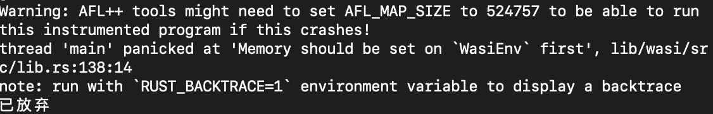</div><br />

<center>图 4  Wasmer崩溃图</center><br />


此时查看软件崩溃时的调用栈，如图 5所示

<div align=center>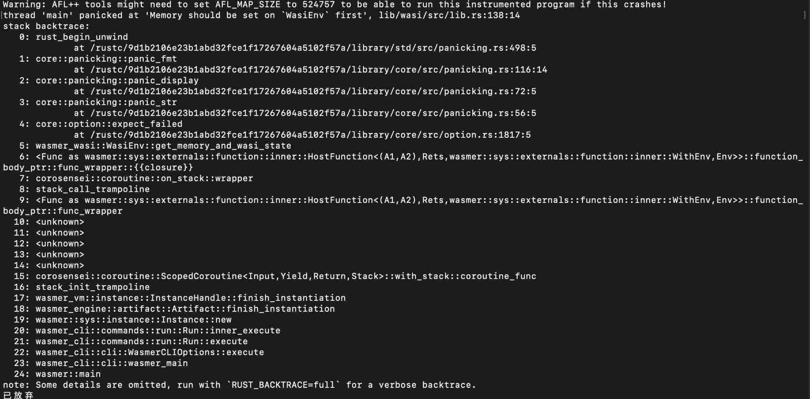</div><br />

<center>图 5  Wasmer崩溃时调用堆栈</center><br />


### 功能测试
#### 主要参数接口说明


|参数|功能|
| :-: | :-: |
|-i|指定包含输入种子的文件夹|
|-o|指定输出的文件夹|
|-t|指定目标程序执行的超时时间|
|-m|指定目标程序的内存限制|
|-V|指定fuzz的时间|
|-E|指定fuzz的执行次数|
|-n|不插桩模式|
|-T|指定fuzz程序的标题|
|-b|绑定到指定的CPU|
|-e|指定种子文件的文件扩展名|

<center>表格19 主要参数接口及其功能</center><br />


####  主要参数接口测试
##### 测试-i参数
对于-i参数接口的测试，指定了三个不同的输入文件夹input1、input2、input3，其中不同的input中所包含的种子文件不同。


|接口|测试输入|预期测试结果|
| :-: | :-: | :-: |
|-i|input1|指定的input1中的文件作为输入|
||input2|指定的input2中的文件作为输入|
||input3|指定的input3中的文件作为输入|

<center>表格20 -i参数的测试</center><br />


#####  测试-o参数
对于-o参数接口测试，指定了三个不同的输出文件夹output1、output2、output3。


|接口|测试输入|预期测试结果|
| :-: | :-: | :-: |
|-o|output1|结果输出到ouput1文件夹中|
||output2|结果输出到ouput2文件夹中|
||output3|结果输出到ouput3文件夹中|

<center>表格21 -o参数的测试</center><br />


#####  测试-t参数
-t参数是目标程序执行的超时时间，对于-t参数，指定了三个不同的值做测试。


|接口|测试输入|预期测试结果|
| :-: | :-: | :-: |
|-t|1000|目标程序在执行1000ms时超时结束|
||65536|目标程序在执行65536ms时超时结束|
||10|目标程序在执行10ms时超时结束|

<center>表格22 -t参数的测试</center><br />


#####  测试-m参数
-m参数是指定目标程序的内存限制，对于-m参数，指定两个不同的值做测试。


|接口|测试输入|预期测试结果|
| :-: | :-: | :-: |
|-m|1024|目标程序内存超过1024MB时会结束|
||none|目标程序内存没有限制|

<center>表格23 -m参数的测试</center><br />


#####  测试-V参数
-V参数是指定fuzz程序的执行时间，对于-V参数的测试，指定三个不同的值做测试。


|接口|测试输入|预期测试结果|
| :-: | :-: | :-: |
|-V|60|fuzz程序执行1min时结束|
||300|fuzz程序执行5min时结束|
||600|fuzz程序执行10min时结束|

<center>表格24 -V参数的测试</center><br />


#####  测试-E参数
-E参数是指定fuzz程序的执行次数，对于-E参数的测试，指定三个不同的值做测试。


|接口|测试输入|预期测试结果|
| :-: | :-: | :-: |
|-E|10000|fuzz程序执行10000次结束|
||65535|fuzz程序执行65535次结束|
||20000|fuzz程序执行20000次结束|

<center>表格25 -E参数的测试</center><br />


##### 测试-n参数

-n参数是指定不插桩模式，对于-n参数，指定两个值做测试。


|接口|测试输入|预期测试结果|
| :-: | :-: | :-: |
|<p>-n</p><p></p>|有-n|插桩模式下正常运行|
||无-n|非插桩模式下正常运行|

<center>表格26 -n参数的测试</center><br />


#####  测试-T参数

-T参数是指定fuzz程序的标题，对于-T参数，指定两个值做测试。


|接口|测试输入|预期测试结果|
| :-: | :-: | :-: |
|<p>-T</p><p></p>|有-T|fuzz程序是指定的标题|
||无-T|fuzz程序是默认的标题|

<center>表格27 -T参数的测试</center><br />


#####  测试-b参数

-b参数是指定绑定的CPU，对于-b参数，指定两个不同的值做测试。


|接口|测试输入|预期测试结果|
| :-: | :-: | :-: |
|<p>-b</p><p></p>|1|绑定第1个CPU运行fuzz程序|
||0|绑定第0个CPU运行fuzz程序|

<center>表格28 -b参数的测试</center><br />


#####  测试-e参数
-e指定种子文件的文件扩展名，对于-e参数，指定两个不同的值做测试。


|接口|测试输入|预期测试结果|
| :-: | :-: | :-: |
|<p>-e</p><p></p>|wasm|在input文件夹中文件是指定的文件扩展名|
||无-e|在input文件夹中文件是默认的文件扩展名|

<center>表格29 -e参数的测试</center><br />


### 漏洞分析
#### 汇总表格


|编号|缺陷描述|出错版本号|确认状态|
| :- | :- | :- | :- |
|1|对于没有出口的递归调用，有的wasm文件会报出runtime error， 有的wasm文件报出panic。|wasmer2.1.1|已确认|
|2|执行同一个wasm文件期望的行为是出现stack overflow的错误，但是实际运行时会出现超时。|wasmer2.1.1|已确认|
|3|当使用wasmer2.1.1的api多次执行同一个wasm文件时，有时候会出现运行时异常退出，有时候会出现超时。|wasmer2.1.1|已确认|
|4|执行同一个wasm文件期望的行为是出现stack overflow的错误，但是实际运行时会出现超时|wasmer2.2.1|已确认|
|5|对于没有出口的递归调用，有的wasm文件会报出runtime error， 有的wasm文件报出panic。|wasmer2.2.1|已确认|
|6|执行同一个wasm文件期望的行为是出现stack overflow的错误，但是实际运行时会出现超时|wasmer2.3.0|已确认|

<center>表 	30  漏洞汇总表格</center><br />


####  第一类漏洞
#####  描述
对于没有出口的递归调用，有的wasm文件会报出runtime error， 有的wasm文件报出panic。预期结果应该是runtime error。
#####  输入
000000.wasm 会出现panic。

003086.wasm 会出现runtime error。
#####  被测版本
Wasmer 2.1.1

Wasmer 2.2.1

对应于表格20中的1和2 。
#####  测试过程
对于wasmer2.2.1

wasmer 2.2 api 执行 000000.wasm
```sh
wasmer2_2exec 000000.wasm
```

wasmer 2.2 api 执行003086.wasm
```sh
wasmer2_2exec 003086.wasm
```


对于wasmer2.1.1

wasmer 2.1 api执行000000.wasm
```sh
wasmer2_1exec 000000.wasm
```
wasmer 2.1 api执行003806.wasm
```sh
wasmer2_1exec 003806.wasm
```
#####  测试结果分析
当使用wasmer2.2 api 和 wasmer 2.1 api 执行000000.wasm时，会出现panic。如图6所示。

<div align=center>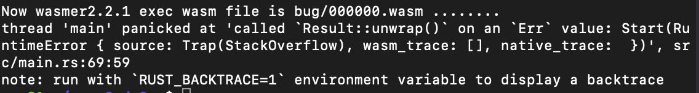</div><br />

<center>图 6  wasmer2.2.1 api执行panic图</center><br />


当使用wasmer2.2 api 和 wasmer 2.1 api 执行003086.wasm时，会出现stack overflow的运行时异常。如图7所示。

<div align=center>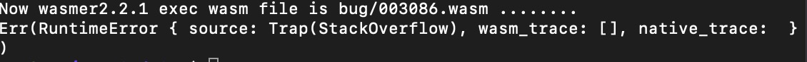</div><br />

<center>图 7  wasmer2.2.1 api执行运行时异常图</center><br />


但000000.wasm和003086.wasm 都是相似的没有出口的递归调用，说明wasmer2.1的api和wasmer2.2的api对处理调用栈溢出时会出现不一样的结果，在处理stack over flow这种问题时会出现不一致。
#####  社区确认截图
issue 链接 <a href="https://github.com/wasmerio/wasmer/issues/2960" target="_blank">https://github.com/wasmerio/wasmer/issues/2960</a >
<div align=center></div><br />

<center>图 8  社区确认第一类漏洞截图</center><br />


####  第二类漏洞
#####  描述
对于同一个wasm文件，Wasmer不同版本在执行时，一些版本会出现超时现象，但是期望的结果确实出现运行时异常栈溢出。
#####  输入
003884.wasm
#####  被测版本
Wasmer 2.1.1

Wasmer 2.2.1

Wasmer 2.3.0

对应于表格20中的1、2、3 。
####  测试过程
使用wasmer2.1.1的api执行003884.wasm
```sh
wasmer2_1exec 003884.wasm
```


使用wasmer2.2.1的api执行003884.wasm(正确的行为)
```sh
wasmer2_2exec 003884.wasm
```
使用wasmer2.3.0的api执行003884.wasm(正确的行为)
```sh
wasmer2_3exec 003884.wasm
```
使用Wasmer2.2.1 CLI、Wasmer2.3.0 CLI、Wasmer2.1.1 CLI执行 003884.wasm时
```sh
wasmer 003884.wasm -i add0 1 1 1    
```

#####  测试结果分析
使用Wasmer2.2.1的api执行003884.wasm，会出现stack over flow的运行时异常，这是我们期望的结果，如图9所示。

<div align=center>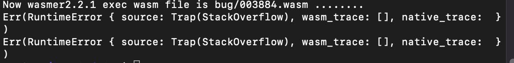</div><br />

<center>图 9  wasmer2.2.1api执行003884.wasm图</center><br />


但是当使用Wasmer2.2.1 CLI，Wasmer2.3.1 CLI，Wasmer2.1.1 CLI都会出现超时的现象。如图10所示。

<div align=center>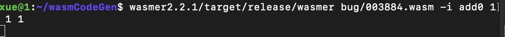</div><br />

<center>图 10  wasmer2.2.1CLI执行003884.wasm图</center><br />


说明Wasmer在遇到stack over flow这种异常时，一些版本没有捕获到这种异常，而是一直不断地运行，会出现超时的情况。
##### 社区确认截图
issue 链接 <a href="https://github.com/wasmerio/wasmer/issues/2961" target="_blank">https://github.com/wasmerio/wasmer/issues/2961</a >
<div align=center>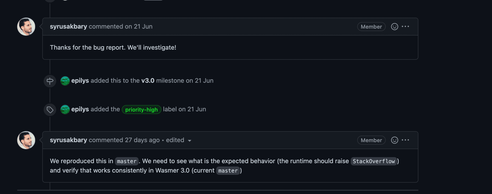</div><br />

<center>图 11  社区确认第二类漏洞截图</center><br />


####  第三类漏洞
#####  描述
当使用wasmer2.1.1的api多次执行同一个wasm文件时，有时候会出现运行时异常退出，有时候会出现超时。
#####  输入
003557.wasm
##### 被测版本
wasmer2.1.1

对应表格20中的6
##### 测试过程
使用wasmer2.1.1的api多次执行003557.wasm。
```sh
wasmer2_1exec 003557.wasm
```
#####  测试结果分析
第一种情况正常结束。如图12所示

<div align=center>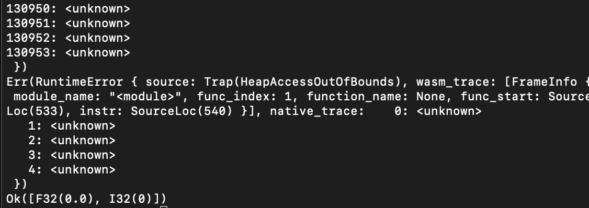</div><br />
<center>图 12  wasmer2.1.1api执行003557.wasm第一种情况截图</center><br />


第二种情况超时。如图13所示。
<div align=center>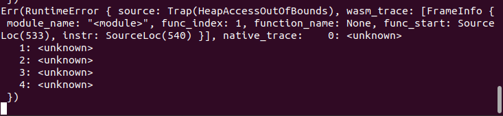</div><br />

<center>图 13  wasmer2.1.1api执行003557.wasm第二种情况截图</center><br />


Wasmer2.1.1的api多次执行003557.wasm文件时，有时候会出现运行时异常退出，有时候会出现超时。说明Wasmer2.1.1的api对同一个wasm文件没有统一的结果。栈溢出有时候会被Wasmer2.1.1的api捕获到，有时候不会被Wasmer2.1.1的api捕获到。

##### 社区确认截图
issue 链接 <a href="https://github.com/wasmerio/wasmer/issues/2975" target="_blank">https://github.com/wasmerio/wasmer/issues/2975</a >
<div align=center></div><br />

<center>图 14  社区确认第三类漏洞截图</center><br />


### 总结和展望
WebAssembly作为一种新型语言，已经在许多场景下有着它独特的作用。而WebAssembly虚拟机作为执行WebAssembly代码的基础软件，它是否安全成了一个重要的问题。如果WebAssembly虚拟机存在着问题，将这款虚拟机集成的软件就有可能被攻破，以至于遭受损失。而模糊测试作为一种被广泛使用的软件测试技术，已经在很多领域上找到了之前没能找到的软件。将模糊测试技术应用在WebAssembly虚拟机上也就成了一个理所应当的选择。

这就是为什么本文设计并实现了一款针对WebAssembly虚拟机的模糊测试工具WasmFuzzer。该模糊测试工具能够结构化地变异并生成WebAssembly代码，并自动地将生成的代码导入到WebAssembly虚拟机当中进行测试，之后导出触发了崩溃的WebAssembly代码文件。WasmFuzzer提供了3种变异策略：顺序遍历、随机变异和自适应变异。这些变异策略有着各自的优点与缺点。在WasmFuzzer实现完成后，本文对它进行了实验评估，WasmFuzzer经过了实验评估后，认为它确实可以用于WebAssembly虚拟机的模糊测试。WasmFuzzer使用的一些技术对于WebAssembly虚拟机的测试是有着一定帮助的。这些技术也有着被迁移到测试适用于其他语言的虚拟机上的可能性。

不过，WasmFuzzer也存在着一些需要改进的地方。例如WasmFuzzer所采用的自适应变异策略是一种正反馈策略，可能导致某种变异操作被过度使用，进而影响到WasmFuzzer整体的测试结果。在未来可以对自适应变异策略进行一定的改进。虽然WasmFuzzer主要针对WebAssembly虚拟机进行模糊测试，但实际上只要是读取WebAssembly代码的软件均可以用WasmFuzzer进行测试。目前WasmFuzzer没有在这些软件上进行实验，未来也可以针对这些软件分析并改进WasmFuzzer。

### 参考文献
1. AddressSanitizer[CP/OL].https://github.com/google/sanitizers/wiki/AddressSanitizer, 2019-05-15.
2. Validation — WebAssembly 1.1 (Draft 2021-11-18)[DB/OL]. https://webassembly.github.io/spec/core/valid/index.html, 2021-11-18.


## WasmFuzzer使用文档
### WasmFuzzer的介绍
- WasmFuzzer，一款针对WebAssembly虚拟机的模糊测试工具。
- 传统的AFL，是基于二进制的随机变异，对结构化输入程序模糊测试效率低。
- WasmFuzzer定制了针对Wasm文件的变异，可以高效的对WebAssembly虚拟机进行模糊测试。
### WasmFuzzer的安装和构建
#### 依赖
- `cmake` 3.16.3及其兼容版本
- `gcc` 9.3.0及其兼容版本
- `llvm` 9.0及其兼容版本
#### 源码下载
- 下载代码
```sh
git clone  --depth=1 https://git.chainmaker.org.cn/chainmaker/wasm-fuzzer
```
#### 目录介绍

```sh
├── wasm-fuzzer      : 模糊测试器主目录


│   ├── submodule   : 存放着wabt和afl
│   │   ├── afl     : 修改变异操作和变异策略的afl++
│   │   ├── wabt    : 开源工具wabt
│   ├── wasmfuzzer  : 使用wabt的api来实现变异操作的lib
│   │   ├──expr_generator_callback.cpp
│   │   ├──expr_generator_callback.h
│   │   ├──expr_generator.cpp
│   │   ├──expr_generator.h
│   │   ├──module_editor.cpp
│   │   ├──module_editor.h
│   │   ├──module_writer.cpp
│   │   ├──module_writer.h
│   │   ├──util.h
│   │   ├──wasmfuzzer_lib.cpp
│   │   ├──wasmfuzzer_lib.h
│   │   ├──wasmfuzzer_main.cpp
│   │   ├──wasmfuzzer_main.h
│   │   ├──wasmfuzzer_test_main.cpp
│   │   ├──wasmfuzzer_test.cpp
│   ├──input        : 提供的初始种子
```
##### wasm-fuzzer 
- 主要的模糊测试器主目录
##### submodule
- submodule子模块，其中包含AFL++模块和WABT模块
##### afl
- afl子模块，修改变异模块的AFL++，是一款基于覆盖引导（Coverage-guided）的模糊测试工具，它通过记录输入样本的代码覆盖率，从而调整输入样本以提高覆盖率，增加发现漏洞的概率。
##### wabt：
- wabt是webassembly的工具，主要使用的是wabt的源码，可以方便的实现wasm文件的读入、wasm指令的生成、wasm文件的写入
##### wasmfuzzer 
- wasmfuzzer子目录主要包含了变异wasm文件操作，为针对wasm为输入的程序的模糊测试器提供了变异操作
- expr_generator_callback.cpp：生成wasm指令所需要的函数
- expr_generator_callback.h :生成wasm指令所需要的函数
- expr_generator.cpp ：生成wasm指令
- expr_generator.h:生成wasm指令
- module_editor.cpp :对wasm模块进行修改
- module_editor.h :对wasm模块进行修改
- module_writer.h :将wasm模块从内存写入文件中
- module_writer.cpp : 将wasm模块从内存写入文件中
- util.h:包含一些工具，比如随机数的生成
- wasmfuzzer_lib.cpp：读入和写入wasm文件以及对wasm文件的变异
- wasmfuzzer_lib.h ：读入和写入wasm文件以及对wasm文件的变异
- wasmfuzzer_test.cpp：使用gtest对WasmFuzzer进行单元测试
- wasmfuzzer_test_main.cpp: 使用gtest对WasmFuzzer进行单元测试
#### 构建步骤
```sh
mkdir build
cd build
cmake ..
cmake --build .
```
- 可以执行程序是`./build/submodule/afl/wasmfuzzer-exec`
#### 主要参数说明
- `-i `dir   - input directory with test cases
- `-o` dir  - output directory for fuzzer findings
- `-V` sec   - execution time of the fuzz program 
- `-E`       - The number of executions of the fuzz program   
- `@@`      - file holder
- `h`        - help file


### WasmFuzzer的使用
#### 插桩
- 插桩获取覆盖是在运行WasmFuzzer之前必须的行为
- WasmFuzzer可以使用llvm来进行插桩
#### 采用afl-llvm-rt对Rust代码进行插桩
```sh
export RUSTFLAGS="--cfg fuzzing -C debug-assertions -C passes=sancov-module -C codegen-units=1 -C llvm-args=-sanitizer-coverage-level=3 -C llvm-args=-sanitizer-coverage-trace-pc-guard -C llvm-args=-sanitizer-coverage-prune-blocks=0 -C opt-level=3 -C target-cpu=native -C debuginfo=0 -l afl-llvm-rt -L   afl-llvm-rt`-Clink-arg=-fuse-ld=gold"

export RUSTDOCFLAGS="--cfg fuzzing -C debug-assertions -C passes=sancov-module -C codegen-units=1 -C llvm-args=-sanitizer-coverage-level=3 -C llvm-args=-sanitizer-coverage-trace-pc-guard -C llvm-args=-sanitizer-coverage-prune-blocks=0 -C opt-level=3 -C target-cpu=native -C debuginfo=0 -l afl-llvm-rt -L   afl-llvm-rt`-Clink-arg=-fuse-ld=gold"
```
- 其中 -L 指定 afl-llvm-rt文件夹的位置，路径为/wasm-fuzzer/afl-llvm-rt
#### 种子文件的生成
- 种子文件是wasm文件，下面介绍几种wasm文件的生成方法。
##### C/C++生成wasm文件
- 可以通过编写C和C++文件将其编译成wasm文件
- 使用Emscripten将C和C++编译成wasm文件，可以参考:<a href="https://juejin.cn/post/7038540255510659109" target="_blank">https://juejin.cn/post/7038540255510659109</a >
- 使用在线编译器：<a href="https://mbebenita.github.io/WasmExplorer" target="_blank">https://mbebenita.github.io/WasmExplorer</a >
##### Rust生成wasm文件
- 可以将rust编译成wasm文件:<a href="https://developer.mozilla.org/zh-CN/docs/WebAssembly/Rust_to_wasm" target="_blank">https://developer.mozilla.org/zh-CN/docs/WebAssembly/Rust_to_wasm</a >
##### 使用wasm-tools生成wasm文件
- 可以参考：<a href="https://github.com/bytecodealliance/wasm-tools" target="_blank">https://github.com/bytecodealliance/wasm-tools</a >
#### 运行
- 如果被测程序接受的是标准输入，则运行命令为：
```sh
$ ./build/submodule/afl/wasmfuzzer-exec -i testcase_dir -o findings_dir /path/to/program [...params...]
```
- 其中testcase_dir下存放着生成的wasm文件
- 如果被测程序接受的是文件输入，则使用`@@`来替代文件名的位置，运行指令为：
```sh
$ ./build/submodule/afl/wasmfuzzer-exec -i testcase_dir -o findings_dir /path/to/program @@
```
- 其中input文件夹可以作为初始种子
#### 运行界面介绍

<div align=center></div><br />
<center>图15 WasmFuzzer运行时截图</center><br />


|<p>**处理时间（process timing）**</p><p>已运行时间（run time）</p><p>上次新路径时间（last new path）</p><p>上次独特崩溃时间（last uniq crash）</p><p>上次独特挂起时间（last uniq hang）</p>|<p>**总体结果（overall results）**</p><p>已完成循环数量（cycles done）</p><p>路径数量（corpus count）</p><p>独特崩溃数量（saved crashes）</p><p>独特挂起数量（saved hangs）</p>|
| - | - |
|<p>**循环进度（cycle progress）**</p><p>当前的测试用例（now processing）</p><p>超时的路径数量（paths timed out）</p>|<p>**表覆盖（map coverage）**</p><p>表密度（map density）</p><p>计数覆盖（count coverage）</p>|
|<p>**阶段进度（stage progress）**</p><p>当前变异操作（now trying）</p><p>当前执行进度（stage execs）</p><p>已执行次数（total execs）</p><p>执行速度（exec speed）</p>|<p>**深度发现（findings in depth）**</p><p>有趣的路径数量（favored items）</p><p>找到新边的测试用例数量（new edges on）</p><p>崩溃个数（total crashes）</p><p>超时个数（total tmouts）</p>|
|<p>**模糊策略区域（fuzzing stragegy yields）**</p><p>插入/删除/移动指令（ins/era/mov instr）</p><p>增加/删除/交换函数（add/era/mov func）</p><p>增加/删除/交换全局变量条目（add/era/mov global）</p><p>增加/删除/交换导出条目（add/era/mov expor）</p><p>增加类型条目（add type）</p><p>增加内存条目（add memory）</p><p>设置/删除开始函数（set/era start）</p>|<p>**路径情况（item geometry）**</p><p>变异层数（levels）</p><p>队列中未执行过的WebAssembly模块数量（pending）</p><p>队列中有趣的未执行过的WebAssembly模块数量（pend fav）</p><p>本地找到的路径数量（own finds）</p><p>其他并行执行的WasmFuzzer所导入的路径数量（imported）</p><p>当前程序运行稳定程度（stability）</p>|
|[CPU利用率]|


#### 结果分析
- 对于WasmFuzzer发现的Crashes，需要人工来对Crash进行判断。


### 以Wasmer为例使用WasmFuzzer的一个完整过程
#### Wasmer版本
- wasmer 2.3.0
#### Wasmer的链接
<a href="https://github.com/wasmerio/wasmer" target="_blank">https://github.com/wasmerio/wasmer</a >

#### 对Wasmer进行修改
- 首先修改Wasmer的代码，以便WasmFuzzer可以捕获到Wasmer的panic.
- 修改之前的Wasmer代码：
```rust
//程序修改之前
//cd
use wasmer_cli::cli::wasmer_main;

#[cfg(not(any(feature = "cranelift", feature = "singlepass", feature = "llvm")))]
compile_error!(
    "Either enable at least one compiler, or compile the wasmer-headless binary instead"
);

fn main() {
    wasmer_main();
}

```
- 修改之后的Wasmer代码
```rust
use wasmer_cli::cli::wasmer_main;

#[cfg(not(any(feature = "cranelift", feature = "singlepass", feature = "llvm")))]
compile_error!(
    "Either enable at least one compiler, or compile the wasmer-headless binary instead"
);

fn main() {
    let did_panic = std::panic::catch_unwind(std::panic::AssertUnwindSafe(|| {
        wasmer_main();
    }))
    .is_err();

    if did_panic {
        std::process::abort();                                                                                                              
    }  

}
```
#### 对Wasmer进行插桩
- 利用AFL++的`afl-llvm-rt`对wasmer进行插桩，其中~/wasm-fuzzer/afl-llvm-rt在替换为自己的wasm-fuzzer目录
```sh
export RUSTFLAGS="--cfg fuzzing -C debug-assertions -C passes=sancov-module -C codegen-units=1 -C llvm-args=-sanitizer-coverage-level=3 -C llvm-args=-sanitizer-coverage-trace-pc-guard -C llvm-args=-sanitizer-coverage-prune-blocks=0 -C opt-level=3 -C target-cpu=native -C debuginfo=0 -l afl-llvm-rt -L    ~/wasm-fuzzer/afl-llvm-rt`-Clink-arg=-fuse-ld=gold"

export RUSTDOCFLAGS="--cfg fuzzing -C debug-assertions -C passes=sancov-module -C codegen-units=1 -C llvm-args=-sanitizer-coverage-level=3 -C llvm-args=-sanitizer-coverage-trace-pc-guard -C llvm-args=-sanitizer-coverage-prune-blocks=0 -C opt-level=3 -C target-cpu=native -C debuginfo=0 -l afl-llvm-rt -L   ~/wasm-fuzzer/afl-llvm-rt`-Clink-arg=-fuse-ld=gold"
```

#### 构建Wasmer
- 插桩之后需要构建Wasmer,在wasmer的目录下执行
```sh
cargo build --release --manifest-path lib/cli/Cargo.toml --features cranelift --bin wasmer
```

#### 对Wasmer进行模糊测试
- 构建完Wasmer之后，使用WasmFuzzer对Wasmer进行模糊测试，以下是fuzz wasmer的例子
```sh
./build/submodule/afl/wasmfuzzer-exec -i input -o out -m none ./test/wasmer @@ -i add 1 2
```
- `-i` 为指定输入文件夹，使用项目下的input文件夹作为输入。
- `-o` 为指定输出文件夹，WasmFuzzer所输出的文件保存到outDir
- `-m` 为指定被测程序的内存占用大小
- `wasmer @@ -i add 1 2` 表示每次调用被测程序时，执行这个指令，其中./test/wasmer是使用项目下已经插桩好的wasmer
- `@@` 是WasmFuzzer所生成的测试用例文件。
  
#### 对WasmFuzzer发现的漏洞进行分析
- 可以人工对`outDir`下的Crashes中发现的Crashes进行分析，判断崩溃的原因。
- 发现的Crash可以使用wasmer执行，查看具体的报错类型。如果想看到更加详细的调用栈信息，可以在执行Crash之前加入`RUST_BACKTRACE=1`，这样看到完整的调用栈信息来具体分析。
- 如果是runtime error大概率是被Wasmer所捕获的错误，这些错误都可以忽略掉。
- 如果是特定的panic的问题，可以具体查看调用栈信息，来具体分析是否是Wasmer的问题。
