# 长安链Web3插件

## 产品背景及意义
开发者在开发Dapp应用时，需要Web3插件直接与链进行交互，此外用户在使用Dapp应用时，也需要Web3插件对交易进行签名。因而核心团队推出长安链Plugin工具。

## 产品安装说明
目前只支持Chrome浏览器，其他浏览器的支持还在规划中。

### 通过谷歌应用商城下载安装插件（需科学上网工具）

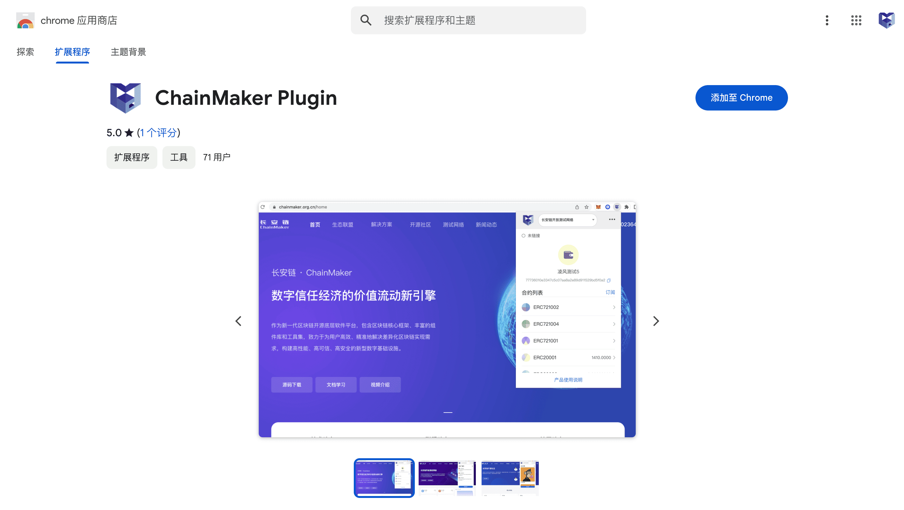

点击下方图片前往下载安装：👇👇👇

[](https://chromewebstore.google.com/detail/chainmaker-plugin/ojokddgnoechlndlbkodigoidojioedd?hl=zh-CN&utm_source=ext_sidebar)

下载后将自动安装到谷歌浏览器内，后续升级插件时也可在谷歌应用商城直接更新。

### 通过长安链官方下载安装插件

#### 下载教程

通过此处下载最新版本插件：[chainmaker-plugin](https://git.chainmaker.org.cn/chainmaker/chainmaker-smartplugin/uploads/b093a6540ab9ad64a6c3b2c2c51d8787/chainmaker-smartplugin.crx)

通过此处下载历史版本插件：<a href="https://git.chainmaker.org.cn/chainmaker/chainmaker-smartplugin/-/releases" target="_blank">查看历史版本</a>

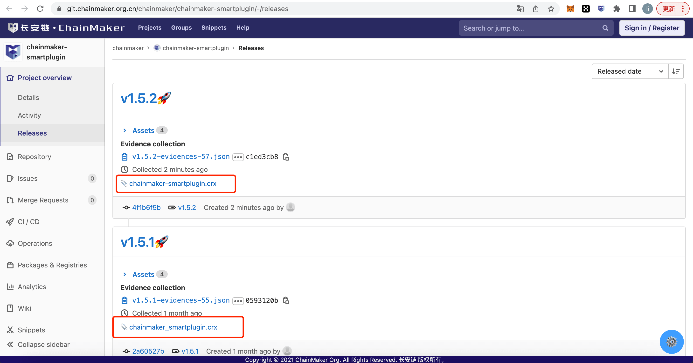


#### 安装教程

1、下载后，将得到chainmaker-smartplugin.crx文件。

2、打开Chrome浏览器，进⼊插件⻚⾯ `chrome://extensions/` 。

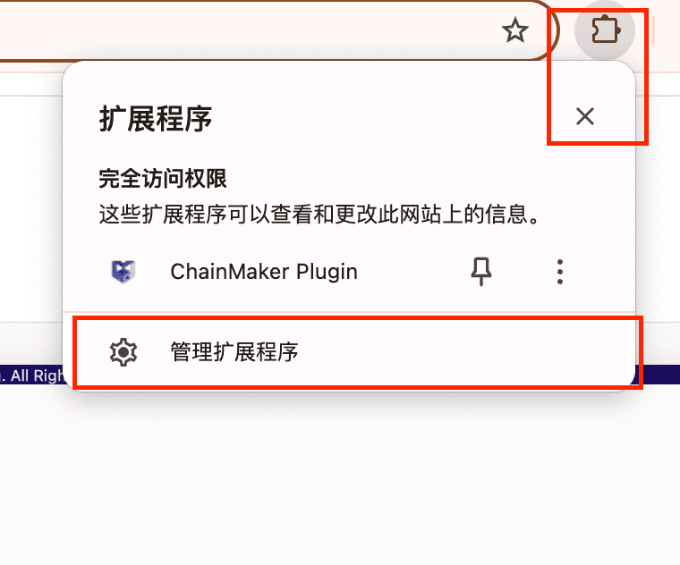

3、打开浏览器开发者模式，并重启浏览器，然后将已下载好的chainmaker-plugin.crx文件拖拽到谷歌拓展插件处，完成安装。

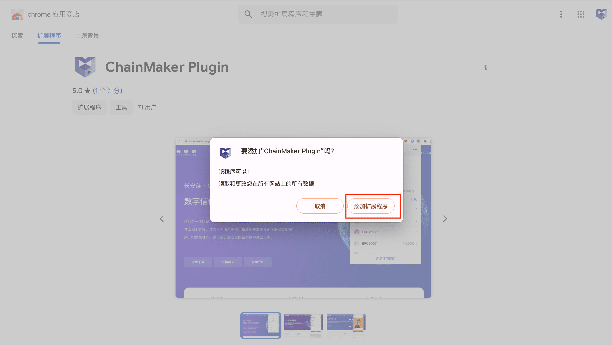

4、安装完成后，可在列表和右侧的拓展程序处查看到该插件，可选择将插件设置为默认在浏览器上展示，方便后续使用。

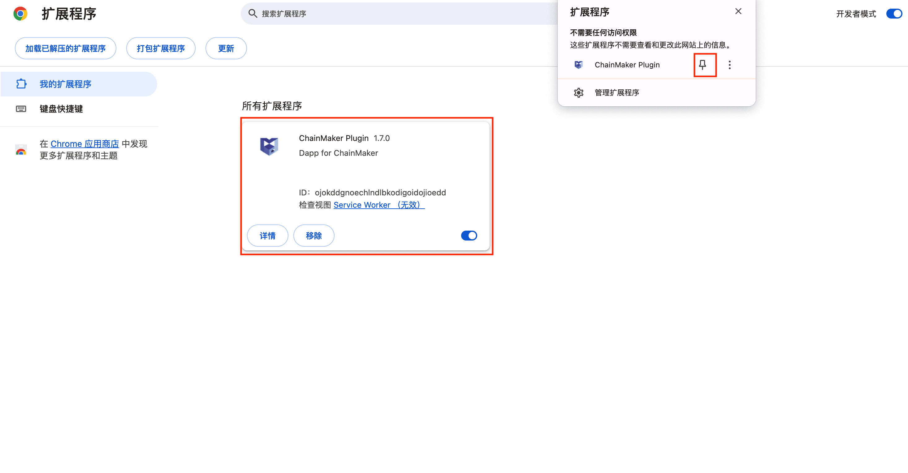


## 产品使用说明

温馨提示，本产品完全去中心化，无任何中心化平台存储用户数据，故涉及到如账户密码，证书等信息时，请妥善保存，丢失后将无法找回。

### 初始化 - 设置密码

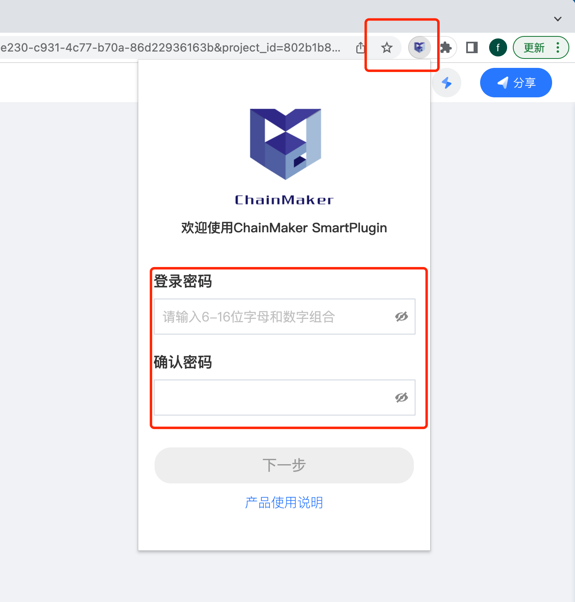

- 下载安装完后，可在谷歌浏览器的插件位置，找到长安链SmartPlugin。
- 首次打开SmartPlugin时，需要先设定密码，该密码用于解锁插件，以及对上链交易进行二次确认，插件完全去中心化，平台不保存任何用户信息，故请妥善保存密码，若密码遗忘了，无法找回，只能重置插件。


### 首页
#### 首页-未导入链账户
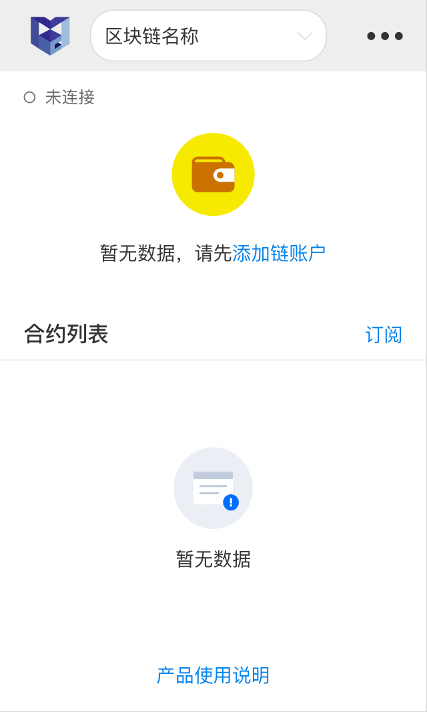

- 插件默认并未添加链账户，请按照指引添加指定区块链网络的链账户，并开始使用。
- 插件默认添加了长安链开放测试网络，如需添加该网络的链账户，可前往长安链官网申请开放测试网络相关用户证书，并导入账户。
- 如需查看链账户在指定合约内的链上资产信息，可点击订阅按钮订阅对应的合约。

#### 首页-已导入链账户
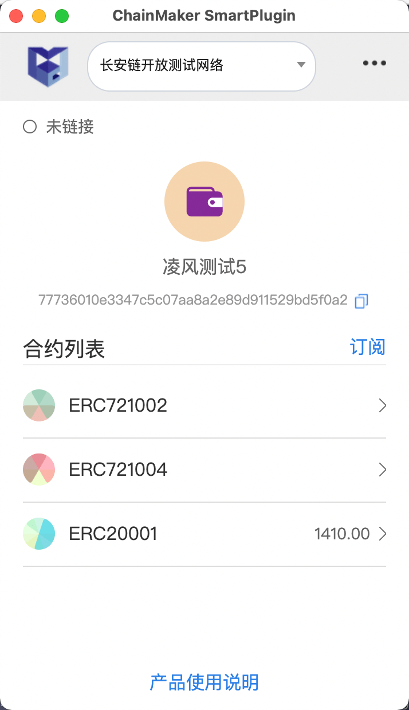

- 通过顶部的下拉选择，可以切换不同的区块链。
- 通过右上角的更多按钮，可以切换到其他功能页面。
- 将账户导入到插件后，可看到该账户的链账地址信息，以及在插件内的地址备注名。
- 点击链账户可切换链账户。
- 在插件内订阅合约后，可查看该合约内对应链账户的数据信息。

#### 首页-开启GAS计费
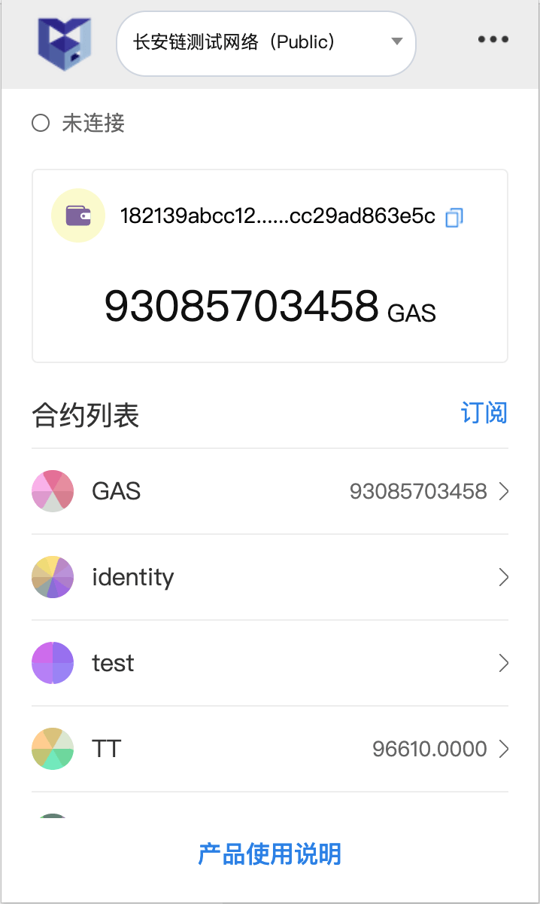

- 如果你的链开启了GAS计费，则导入链账户后，在插件内展示的样式如上。
- 默认将订阅GAS合约，并展示当前账户的GAS余额。
- 开启GAS计费后，往链上发送交易须支付相应的GAS费用。

### 区块链网络管理

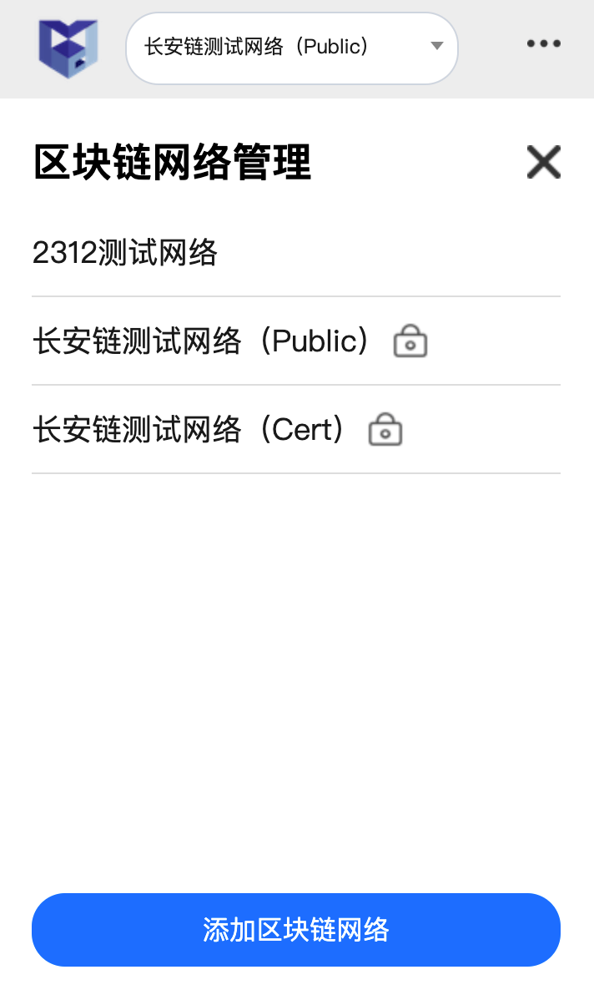

- 插件内已内置了订阅了长安链测试网络（cert）和长安链开放测试网络（public），如果您想使用其他链，可在区块链网络管理页面，点击添加区块链网络按钮进行添加。
- 目前支持添加公钥模式、证书模式两种长安链。

#### 添加网络

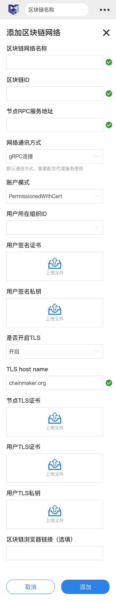

- 目前支持添加管理长安链V2.1.0及以上版本的链。
- 请确保所填写的节点信息正确，且网络链接通畅，此处的节点信息为节点的IP地址和RPC端口。
- 请确保所填写的用户所在组织ID正确，且后续上传的证书是属于该组织底下的。
- 长安链默认与客户端的通讯方式是gRPC，如果您未特殊修改则选择gRPC直连链，此外长安链V2.3.0+版本支持HTTP协议直连链，可通过修改链配置开启，如果您开启了，则可选择HTTP协议直连链。选择gRPC连接时，将通过插件内的代理服务，将HTTP请求转化成gRPC请求与链通讯，选择HTTP连接时，将直接与链交互，而不经过插件网络代理服务。。
- 如果您所要订阅的链开启TLS，则需要上传相关证书，若未开启可不填。

#### 请求将链网络添加到插件内
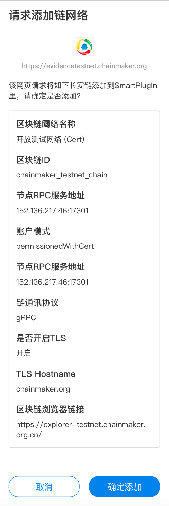 

- 可通过插件接口请求将链网络添加到插件内，目前可与长安链ChainList关联使用。

#### 修改已添加的区块链网络
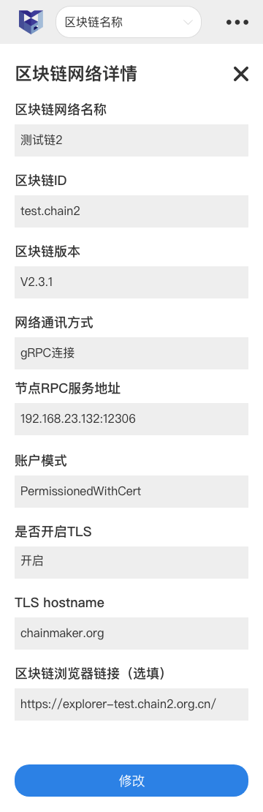

- 在区块链网络详情页面点击修改按钮跳转到修改区块链网络信息页面。
  

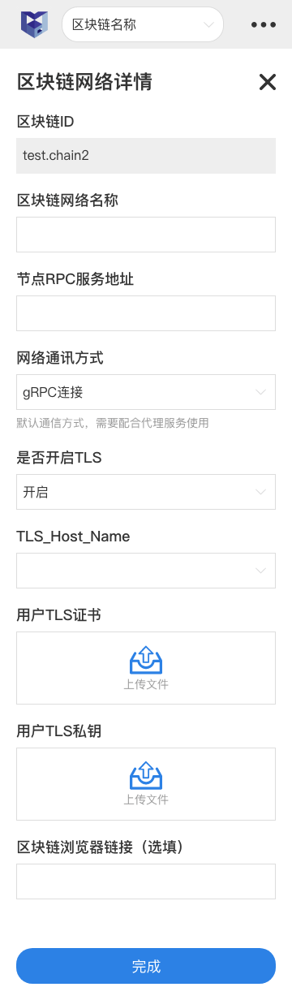

- 支持修改区块链网络备注名，与插件进行通讯的链节点的链接信息，包括RPC服务地址，网络通讯方式，TLS连接方式等，以及该链所对应的区块链浏览器地址。
- 注意，当你修改节点的通讯信息时，请确保该节点运行正常，与插件网络通畅。

### 链账号管理


- 链账户管理界面分为两类钱包，一类是“未分类钱包”（通过长安链管理平台生成的私钥导入），一类是在插件上通过助记词生成的钱包
- 也可通过插件接口请求将链账户地址添加到插件内。

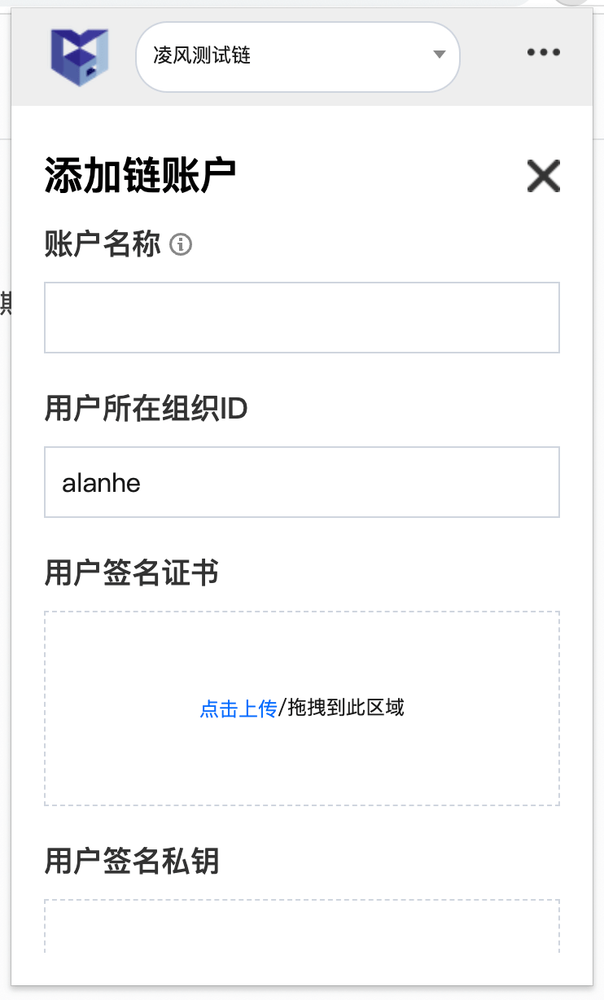

- 平台完全去中心化，并无中心化服务器保存用户所上传到链账户信息。

#### 创建&导入钱包

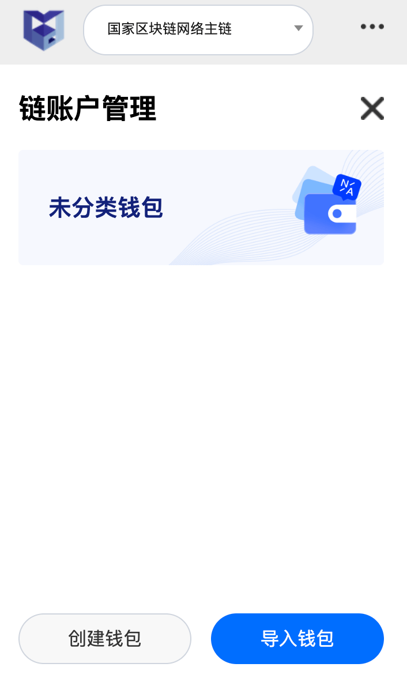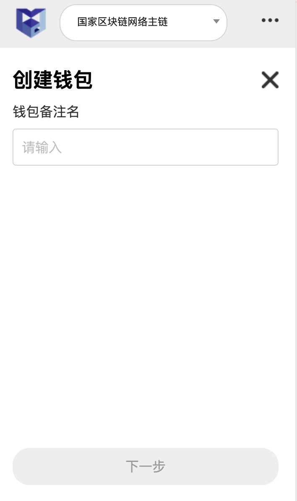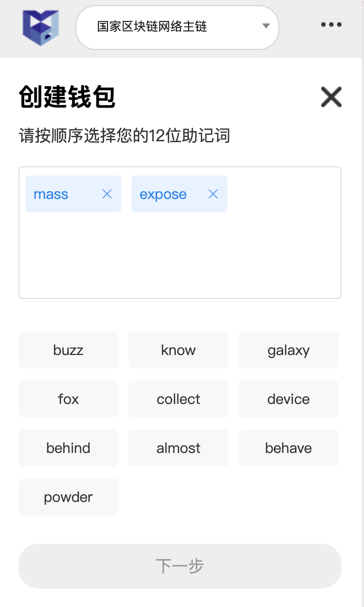


- 点击创建钱包，输入账户备注名后，显示12位助记词，用户可用助记词恢复钱包，但切记要保管好助记词，不然会有遗失资产的风险。
- 按照顺序选择12位助记词，点击下一步，钱包创建成功。
- 同样，如果之前已经创建过钱包，点击“导入钱包”，利用助记词恢复钱包。

#### 钱包详情

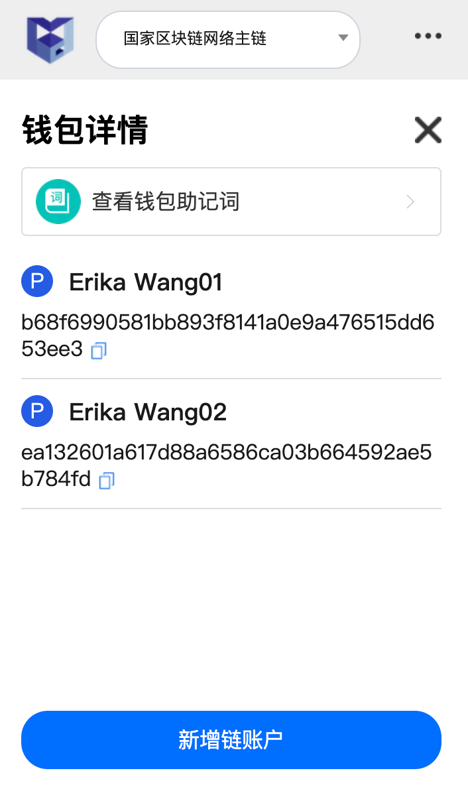

- 点击新增链账户，会按序号在钱包内新增链账户
- 点击查看钱包助记词，需要输入钱包密码（即登录密码）


### 订阅合约

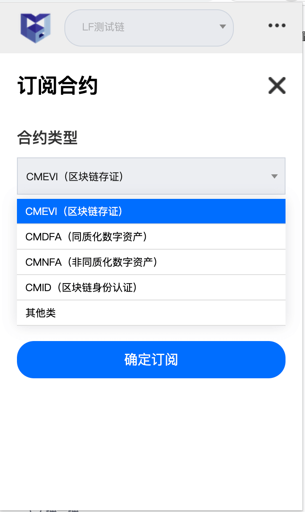

- 输入合约名称订阅合约，目前支持订阅CMEVI（区块链存证）、CMDFA（同质化数字资产）
、CMNFA（非同质化数字资产）、CMID（区块链身份认证），以及其他类合约。请正确选择合约类型，插件将按照所选的类型进行数据解析，如果选错，可能会解析不到对应的数据。
- 长安链Web3插件将按照长安链合约标准协议规范对已订阅的合约进行解析，请确保你所撰写的合约的合约方法名称以及字段含义和标准协议所约定的相符。[点击查看长安链合约标准协议规范](https://git.chainmaker.org.cn/contracts/standard/-/tree/master/living)。
- 订阅前请先确保该合约已经部署到指定的区块链网络上，否则将获取不到数据。

#### CMEVI类合约详情
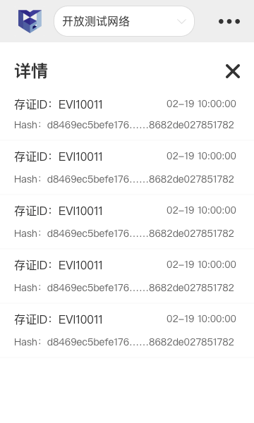

- 从首页的合约列表处点击具体某一合约，进入该合约的详情页，如果所订阅的是CMEVI类的合约，此处将展示当前账户在该合约内的通过插件产生的存证记录。
- 点击具体的存证记录，可查看该笔存证的的详情。

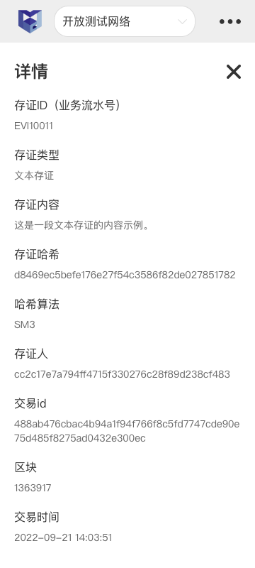

- 官方建议，存证的字段请遵循长安链存证合约标准

```go
 {
   // Evidence 存证结构体
type Evidence struct {
	// Id 业务流水号
	Id string `json:"id"`
	// Hash 哈希值
	Hash string `json:"hash"`
	// TxId 存证时交易ID
	TxId string `json:"txId"`
	// BlockHeight 存证时区块高度
	BlockHeight int `json:"blockHeight"`
	// Timestamp 存证时区块时间
	Timestamp string `json:"timestamp"`
	// Metadata 可选，其他信息；具体参考下方 Metadata 对象。
	Metadata string `json:"metadata"`
}

// Metadata 可选信息建议字段，若包含以下相关信息存证，请采用以下字段
type Metadata struct {
	// HashType 哈希的类型，文字、文件、视频、音频等
	HashType string `json:"hashType"`
	// HashAlgorithm 哈希算法，sha256、sm3等
	HashAlgorithm string `json:"hashAlgorithm"`
	// Username 存证人，用于标注存证的身份
	Username string `json:"username"`
	// Timestamp 可信存证时间
	Timestamp string `json:"timestamp"`
	// ProveTimestamp 可信存证时间证明
	ProveTimestamp string `json:"proveTimestamp"`
	// 存证内容
	Content string `json:"content"`
	// 其他自定义扩展字段
	// ...
}

```

- 请注意matedata必须是一段标准的json，且字段名称需与上述例子保持一致，否则将无法解析到对应的数据。

#### CMDFA类合约详情
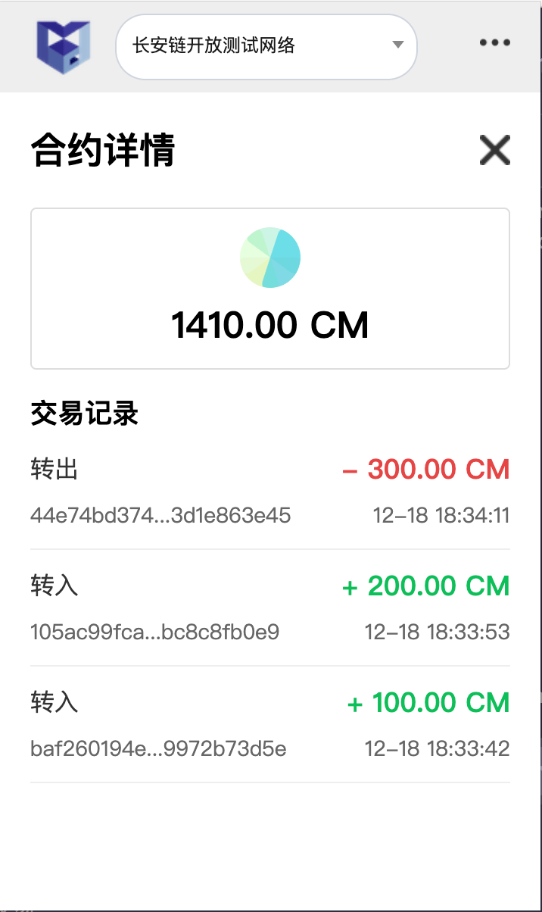

- 从首页的合约列表处点击具体某一合约，进入该合约的详情页，如果所订阅的是CMDFA类的合约，此处将展示当前账户在该合约内的资产余额，以及通过插件产生的资产转移记录。
- 点击具体的转账记录，可查看该笔转账的详情。
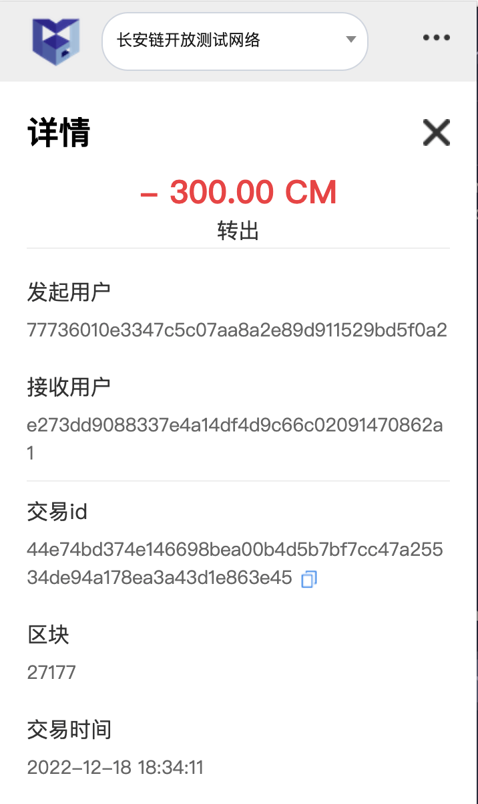 

#### CMNFA类合约详情(数字藏品)

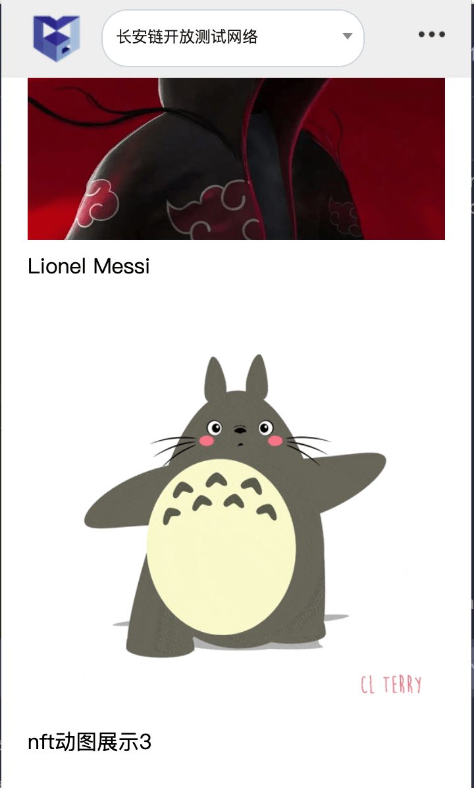 

- 如果所订阅的是CMNFA类合约，则可以查看到当前链账户在该合约下的所有NFT信息。目前支持常见的图片格式，包含静态图片和动图。
- 插件支持订阅任意一条长安链，以及对应链账的合约信息。因此，任何基于长安链发行的FT和NFT，只要是基于长安链标准合约协议所撰写的，都可在本插件内查看到。
- 点击具体的NFT，可查看NFT详情。

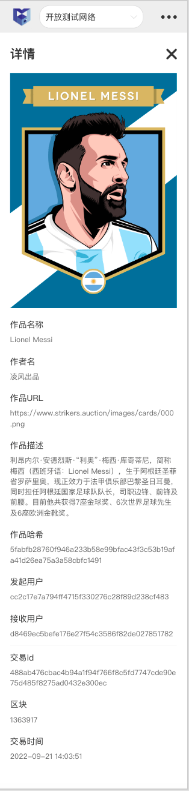 

- 官方建议，所发行的NFT-metadata信息至少需要包含如下字段，作品名称、作者名、发行机构、作品URL、作品描述、作品哈希。例：
```json
 {
      "auther":"凌风出品",
      "orgName":"北京美好景象图片有限公司",
      "name":"Lionel Messi",
      "description":"利昂内尔·安德烈斯·“利奥”·梅西·库奇蒂尼，简称梅西（西班牙语：Lionel Messi），生于阿根廷圣菲省罗萨里奥，现正效力于法甲俱乐部巴黎圣日耳曼，同时担任阿根廷国家足球队队长，司职边锋、前锋及前腰。目前他共获得7座金球奖、6次世界足球先生及6座欧洲金靴奖。",
      "image":"https://www.strikers.auction/images/cards/000.png",
      "seriesHash":"5fabfb28760f946a233b58e99bfac43f3c53b19afa41d26ea75a3a58cbfc1491"
    }
```
- 请注意metadata必须是一段标准的json，且字段名称需与上述例子保持一致，否则将无法解析到对应的数据。其中
  - 作品URL为该NFT图片资源存放的地址，
  - 作品哈希为该图片对应的sha256哈希值，通过将资源哈希值上链进行存证，确保就算是存储在中心化云服务的NFT也不可被篡改。

#### CMID类合约详情(身份认证)

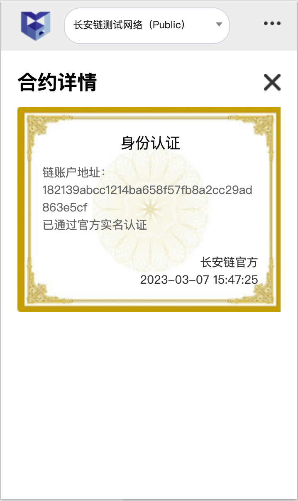 

- 如果所订阅的是CMID类合约，则可看到该链账户的的认证信息，如果已认证将标记为认证状态。

#### GAS合约详情

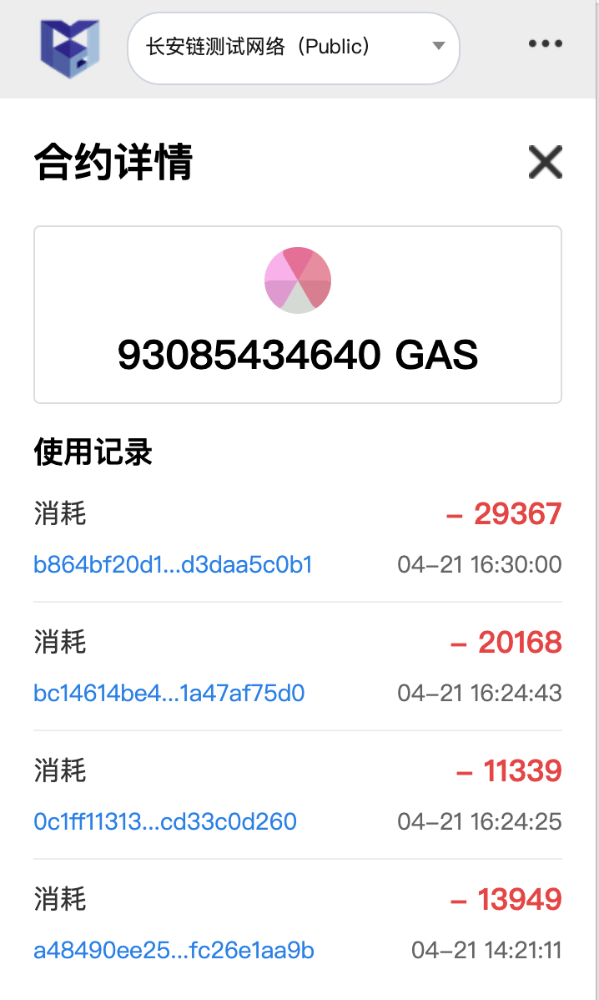 

- 如果所连接的链开启了GAS计费，则会默认订阅GAS合约。并在合约详情里展示通过插件发起的交易所消耗的GAS情况。

### 转账

#### CMDFA类合约转账

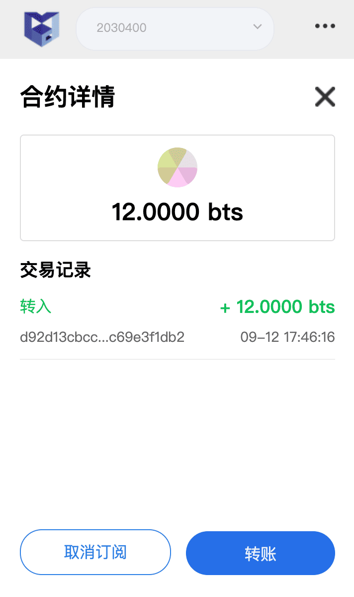

* CMDFA类合约详情中，点击转账进入转账详情

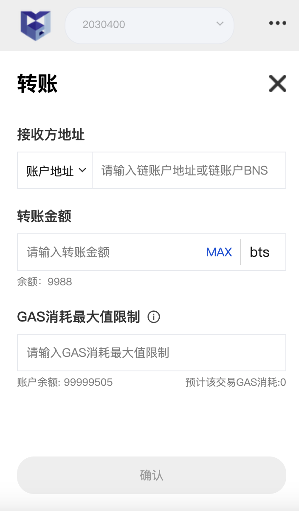

* 转账详情页中，填写完接受方地址、转账金额后，自动填写GAS消耗最大值限制

* 全部填写完后点击确认，输入正确的密码，即可转账成功

#### CMNFA类合约转账

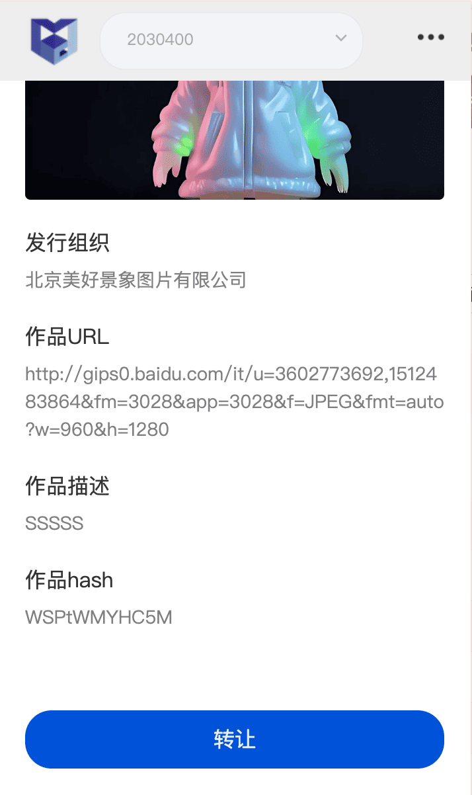

* 在CMNFA类合约详情中，点击转让，进入转让详情页

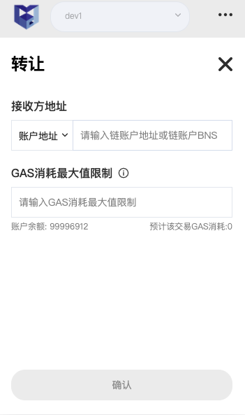

* 输入接收方地址，会自动计算出GAS消耗最大值限制。点击确认，输入正确的密码后，转让成功。

#### 交易历史


* 点击交易历史，进入交易历史详情页，可以查看所有订阅的CMDFA和CMNFA类合约的转账历史

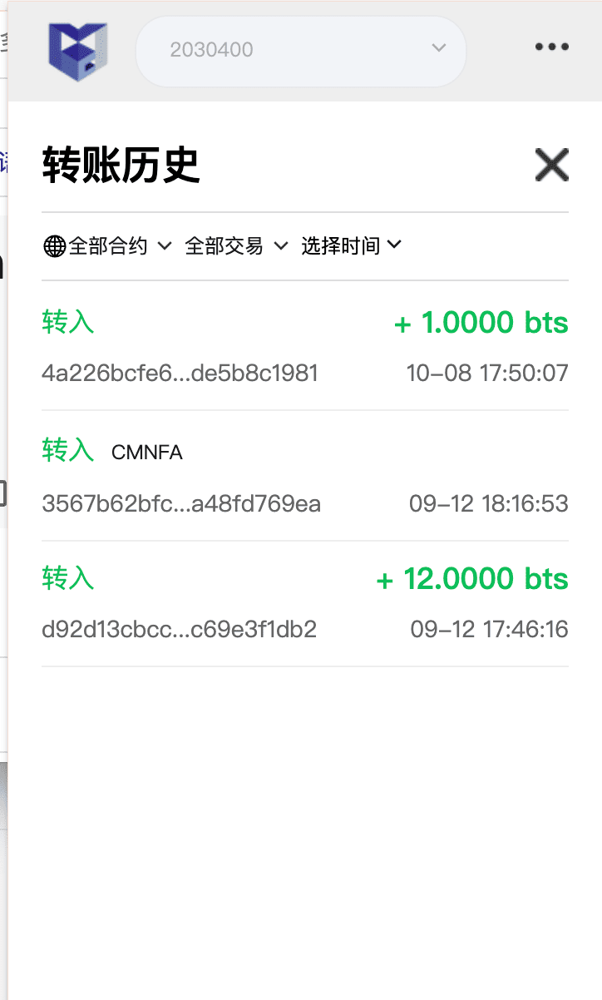

* “全部合约”可以筛选某个订阅合约的转账历史，全部交易可以筛选转账“成功”和“失败”的交易，选择时间可以筛选最近6个月的转账历史

### 请求发起交易-未开启GAS计费

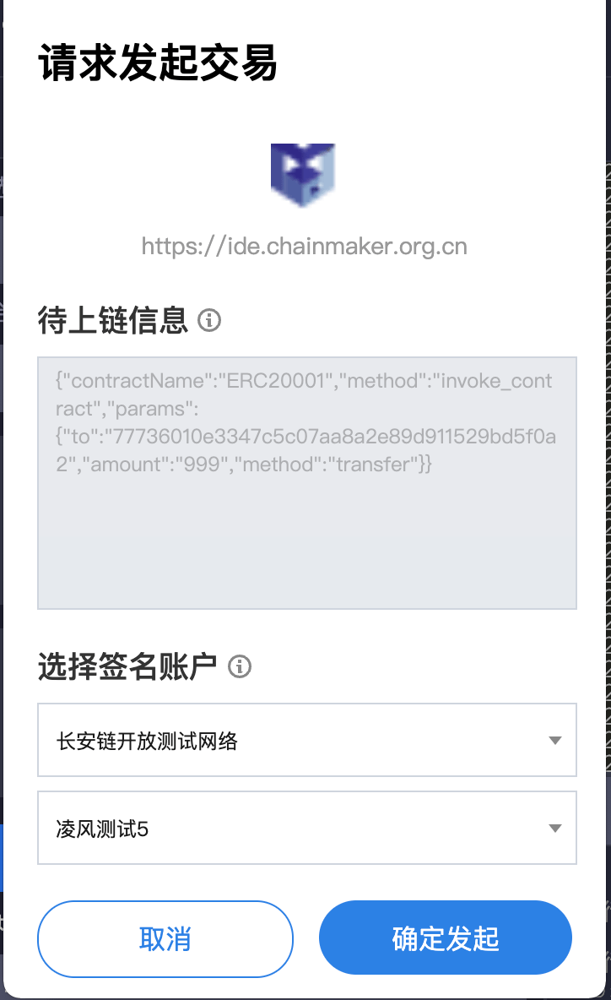 

- 支持Dapp唤起插件，并进行上链操作。Dapp如何和插件进行对接，请参照插件接口文档。
- 上链时，可根据情况选择用于发送交易的链账户，如需添加账户，可到链账户管理处操作。
- 上链时，需要输入密码进行二次确认。由于是去中心化应用，请妥善保存您的密码，丢失后将无法找回。

### 请求发起交易-已开启GAS计费
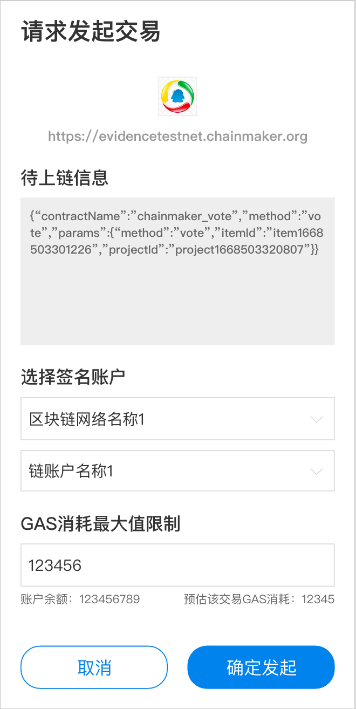 

- 如果所选择的链开启了GAS计费，则发起上链操作时，需要支付GAS费用。
- 插件将模拟执行上链的交易，以估算出该交易所需消耗的GAS费用。用户也可设置该交易愿意支付的最大GAS数额，最终实际扣减多少GAS以实际上链执行结果为准。

### 请求授权连接

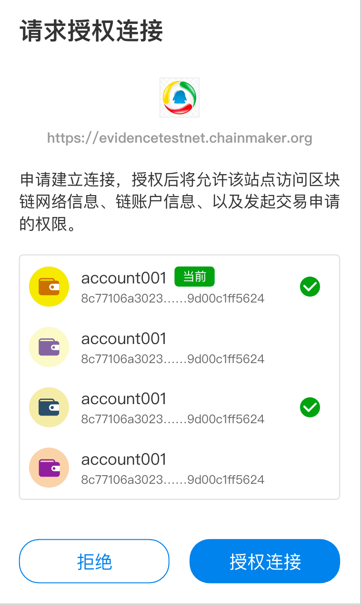 

- 插件对外提供申请授权连接的接口，Dapp可自行对接该接口，并从dapp页面的connect wallet按钮唤起插件。请求进行连接授权。
- 授权通过后，Dapp可获取到当前插件的区块链网络信息和链账户信息。
- 一个Dapp可申请授权多个链账户，一个链账户可授权给多个Dapp。


#### 查看连接详情

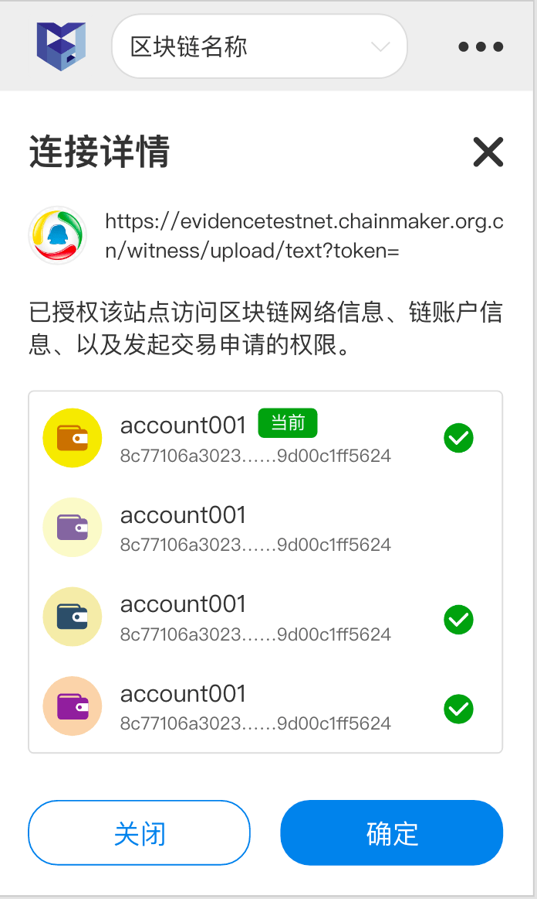 

- 在已授权连接的情况下，点击首页的连接状态，可查看插件和该Dapp的连接情况，
- 可随时取消对某一Dapp的授权。

### 请求私钥签名
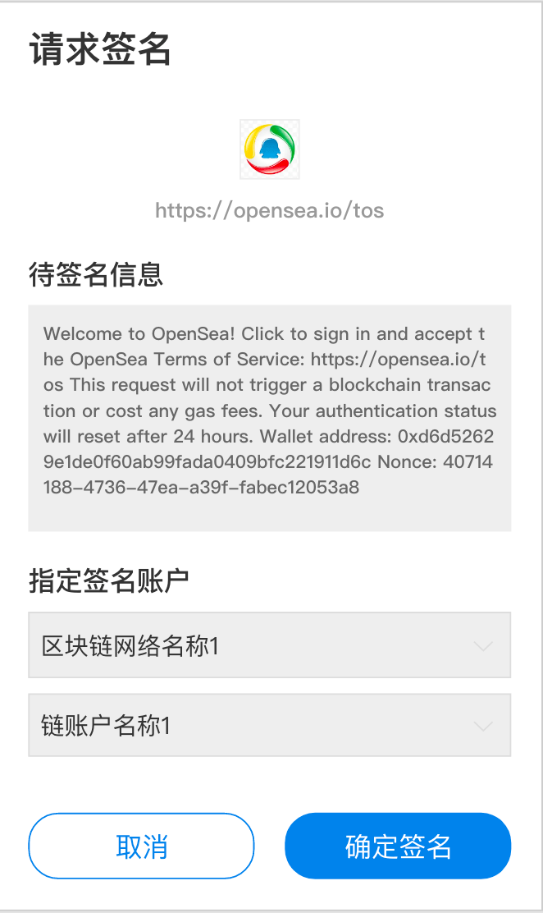 

- 如果您需要验证插件内是否存在指定的私钥，则可请求插件用指定的私钥进行签名。签名后，可在Dapp内自行通过该私钥已经对外公开的公钥进行验签名。


### 上链记录

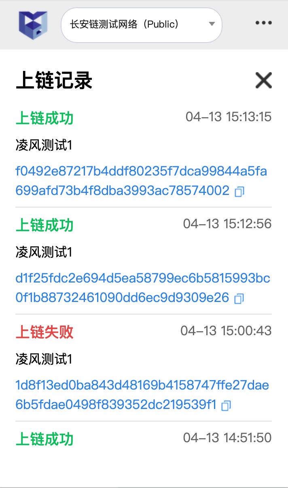

- 上链后可到上链记录里，查看上链的交易信息。
- 本版本暂不支持直接在插件内查看交易详情，如需查看交易详情，可复制交易哈希到区块链浏览器内查询。后续版本会考虑支持。


### 系统设置

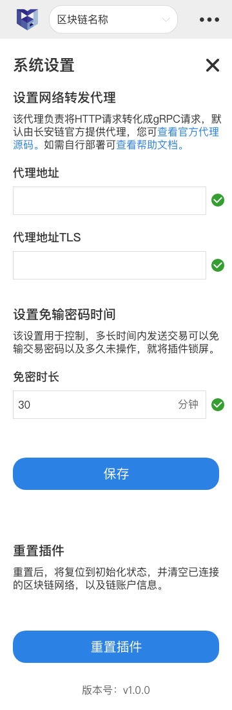

- 长安链v2.1.0 ~~ 2.3.0版本的链需要由代理将HTTP请求转化为gRPC请求，默认由长安链官方提供公网代理服务，代码开源，开发者也可选择自行部署代理。
- 如开发者是想订阅内网的测试链，则需要自行部署自己内网里的代理服务。
- 长安链V2.3.0及之后的版本，支持直接通过HTTP请求和链进行交互。默认不开启，如需开启则参考如下教程。
  - 修改所要开启HTTP消息直连的节点的`chainmaker.yml`配置文件，将`enable restful api`改为`true`
  

```go
  # restful api gateway
  gateway:
    # enable restful api
    enabled: true
    # max resp body buffer size, unit: M
    max_resp_body_size: 16
```
  - 开启后，无需开启HTTP请求转发代理服务，也可以通过该节点直接使用HTTP请求和链进行交互。
- 如果遗忘了密码，或者需要还原插件，您可以重置插件，重置后，插件内的数据将清空。


## 产品接入说明

### 判断是否安装插件

> 根据hasExtension来确定是否安装插件

```shell
var hasExtension = false;
const extensionId='bmkmhpkgcbigmdepppdpdhlifcgoibph';
chrome.runtime.sendMessage(extensionId, { operation: "installCheck" },
    function (reply) {
        if (reply&&reply.data.version) {
          hasExtension = true;
        }
        else {
          hasExtension = false;
        }
    });
```

### 发送消息到插件

与判断插件是否安装方式一致，当前`支持安装合约/调用合约`，具体参数见[`src/event-page.ts`](https://git.chainmaker.org.cn/chainmaker/chainmaker-smartplugin/-/blob/master/src/event-page.ts)

```javascript
// 利用插件部署合约
const myticket = Date.now().toString(); 
window.chainMaker.createUserContract({
    chainId: 'chain_id' //可选，指定本次交易目标链，不可更改
    accountAdress:'address' // 可选，指定本次交易目标账户，可更改
    body:{
        contractName,
        contractVersion: 'v1.0.0',
        contractFile: await file2BinaryString(contractFile),
        runtimeType: 'WASMER',
        params: {},
        MULTI_SIGN_REQ: false// 是否启用多钱部署发起投票，默认false
    },
    ticket: myticket,
})

// 利用插件调用合约，此处以调用存证合约为例
const myticket = Date.now().toString();
window.chainMaker.invokeUserContract({
    chainId: 'chain_id' //可选，指定本次交易目标链，不可更改
    accountAdress:'address' // 可选，指定本次交易目标账户，可更改
    body: {
        contractName:'fact_contract_name',     
        method: 'fact_methed_name',
        params:{
            content: 'teststring',
            hash:'teststringtohash',
            type: 'text',
            time: Math.floor(new Date().getTime() / 1000),
        },
    },
    ticket: myticket,
});


```

### 接收插件发送消息

> 具体logic可根据message消息体进行判断处理。message类型定义，查看`src/event-page.ts/ExtensionResponse`

```javascript
window.addEventListener("message", function (event) {
  if (event.source != window)
    return;
  const { data, ticket } = event.data;
  // myticket 为发送信息时缓存的变量
  if(myticket ===  ticket){        
    dosomestring();
  }
  console.log("Page script received: " + event.data)
  console.log(event.data)
}, false);
```

### 调用插件内置功能

```javascript
// 调用方式
// name 调用方法名称
// params 调用参数
// callback 接受插件返回值
// res 返回值
 window.chainMaker.sendRequest( name: string, params:any, callback:(res) => void)
```


#### 公共参数

sendRequest参数

| 字段名 | 数据类型 | 描述 | 是否必须 |
| ------ | ------ | ------ | ------ |
| operation | string | Sample | true|
| chainId| string | 指定使用的链id | false |
| accountAddress | string | 指定使用的账户id | false |
| body| any |操作参数，根据operation传递指定参数| true |
| callback| (EventResponse)=>vild |回调函数| true |

callback回调，当调用插件方法执行完成后执行回调函数返回结果 

> EventResponse

| 字段名 | 数据类型 | 描述 | 是否必须 |
| ------ | ------ | ------ | ------ |
| status | error,done | 回调状态 | true|
| info| EventInfo |回调数据 | false |
| detail| string | 回调信息 | false |

> EventInfo (根据事件额外添加自定义参数)

| 字段名 | 数据类型 | 描述 | 是否必须 |
| ------ | ------ | ------ | ------ |
| code | 0,1,2,3| 成功，取消，错误，超时|true|
| message| string |执行信息 | false |
| resuilt| EventResult |  执行返回数据，具体接口定义 | false |
| res| string | 错误信息（不建议使用），后续版本会统一使用 message | false |
| [key:string]| any | 自定义扩展字段 （不建议使用），后续版本会统一使用 result| false |

#### importSubscribeContract 导入订阅合约

参数

| 参数名称       | 类型   | 是否必填 | 参数说明   |
| -------------- | ------ | -------- | ---------- |
| body           | ContractParams | 是       | 订阅合约参数 |

``` ts

interface ImportSubscribeContractParams {

   /**
   * 已添加到插件的区块链ID（未添加时，插件会提示引导添加区块链）
   */
  chainId: string;
    /**
   * 合约名称
   */
  contractName: string;
  /**
   * 合约类型,默认为OTHER，目前支持长安链标准合约类型'CMID' | 'CMDFA' | 'CMNFA' | 'GAS' | 'CMEVI'； 'OTHER'用来表示非长安链标准的其他类型合约，
   */
  contractType?: string;
 
}

```

#### importChainConfig 添加长安链网络

参数

| 参数名称       | 类型   | 是否必填 | 参数说明   |
| -------------- | ------ | -------- | ---------- |
| body           | ChainParams | 是       | 链网络参数 |

``` ts

interface ChainParams {
  /**
   * 区块链网络名称
   */
  chainName: string;
   /**
   * 区块链ID， 30位以内字母、数字、中横线、下划线、小数点组合
   */
  chainId: string;
  /**
   * 节点IP包含端口信息
   */
  nodeIp: string;
  /**
   * 账户模式下
   */
  accountMode: 'permissionedWithCert' | 'public';
  /**
   *  与链通信方式协议
   * @default 'GRPC'
   */
  protocol?: 'GRPC'|'HTTP'
  /**
   * 是否开启TLS
   * @default false
   */
  tlsEnable？: boolean;
  /**
   * @description sslTargetNameOverride 服务于tls模式 
   * @default 'chainmaker.org'
   */
  hostName?: string
  /**
   * @description  浏览器链接
   */
  browserLink?: string;
}

```

#### importAccountConfig 导入链账户

参数

| 参数名称       | 类型   | 是否必填 | 参数说明   |
| -------------- | ------ | -------- | ---------- |
| chainId        | string | 是       | 链ID       |
| body           | AccountParams | 是       | 账户配置参数 |

``` ts

interface AccountParams {
   /**
   * 账户名称
   */
  name:string,
   /**
   * 组织id， 100位以内字母、数字、中横线、下划线、小数点组合
   */
  orgId: string,
   /**
   * 签名私钥内容文本
   */
  userSignKeyContent:string
   /**
   * 签名证书内容文本（permissionedWithCert必选）
   */
  userSignCrtContent?:string
   /**
   * 公钥内容文本（public必选）
   */
  userPublicKeyContent?:string
 /**
   *  指定签名私钥文件名称
   * @default `${name}.sign.key`
   */
  userSignKeyName?: string;
   /**
   * 指定签名证书文件名称
   * @default `${name}.cert.crt`
   */
  userSignCrtName?: string;
   /**
   *  指定公钥文件名称
   * @default `${name}.public.pem`
   */
  userPublicKeyName?: string;

}

```

#### openConnect  调启插件授权账户

参数

| 参数名称 | 类型   | 是否必填 | 参数说明 |
| -------- | ------ | -------- | -------- |
| chainId  | string | 否       | 链ID     |

返回值 info

| 返回值名称 | 类型         | 是否可能空 | 参数说明             |
| ---------- | ------------ | ---------- | -------------------- |
| code       | number | 否         | 返回状态 0正常 1取消 2错误 3超时    |
| accounts   | 用户列表数组 | 是         | 所在链授权的用户列表,额外字段（地址签名signBase64、pubKey或signCrt） |
| chain      | 链信息对象   | 是        | 当前链信息           |

#### openAccountSignature 调起插件账户验签

参数

| 参数名称       | 类型   | 是否必填 | 参数说明   |
| -------------- | ------ | -------- | ---------- |
| chainId        | string | 是       | 链ID       |
| accountAddress | string | 是       | 用户地址   |
| body           | object | 是       | {hexContent:十六进制待签名字符串,resCode?: 返回签名编码hex、base64（默认）} |

返回值 info

| 返回值名称 | 类型   | 是否可能空 | 参数说明                         |
| ---------- | ------ | ---------- | -------------------------------- |
| code       | number | 否         | 返回状态 0正常 1取消 2错误 3超时      |
| signContent        | string | 是         | 签名内容 |
| pubKey        | string | 是         | 公钥 |

#### getConnectAccounts 获取插件当前链下的所有授权用户

参数 无

返回值 info

| 返回值名称 | 类型         | 是否可能空 | 参数说明             |
| ---------- | ------------ | ---------- | -------------------- |
| accounts   | 用户列表数组 | 否         | 所在链授权的用户列表 |
| chain      | 链信息对象   | 否         | 当前链信息           |

#### openConnect  调启插件授权账户

参数

| 参数名称 | 类型   | 是否必填 | 参数说明 |
| -------- | ------ | -------- | -------- |
| chainId  | string | 是       | 链ID     |
| body  | object | 是       | {isSingle: boolean (是否单选的参数,默认多选) }     |


返回值 info

| 返回值名称 | 类型         | 是否可能空 | 参数说明             |
| ---------- | ------------ | ---------- | -------------------- |
| code       | number | 否         | 返回状态 0正常 1取消 2错误 3超时    |
| accounts   | 用户列表数组 | 是         | 所在链授权的用户列表,额外字段（地址签名signBase64、pubKey或signCrt） |
| chain      | 链信息对象   | 是        | 当前链信息           |


#### verifyAccounts 校验账户地址有效性

参数body内容

| 参数名称       | 类型   | 是否必填 | 参数说明   |
| -------------- | ------ | -------- | ---------- |
| chainId        | string | 是       | 链ID       |
| addressList | string[] | 是       | 待校验的账户地址列表   |


返回值 info

| 返回值名称 | 类型         | 是否可能空 | 参数说明             |
| ---------- | ------------ | ---------- | -------------------- |
| addressList | string[] | 否         | 有效账户地址列表 |


#### openDidAuthority 请求授权did

参数body内容

| 参数名称       | 类型   | 是否必填 | 参数说明   |
| -------------- | ------ | -------- | ---------- |
| chainId        | string | 是       | 链ID       |
| vp           | string | 是       | 通过did认证平台获取的凭证信息，需要包含授权使用方在did平台注册的appid |
| verifier        | string | 否      | vp验证者did       |

返回值 info

| 返回值名称 | 类型         | 是否可能空 | 参数说明             |
| ---------- | ------------ | ---------- | -------------------- |
| vp | string | 否         | 授权的凭证信息 |
| did | string | 否         | 授权did的id |

#### openVcAuthority 请求授权did的VC

参数body内容

| 参数名称       | 类型   | 是否必填 | 参数说明   |
| -------------- | ------ | -------- | ---------- |
| chainId        | string | 是       | 链ID       |
| vp           | string | 是       | 通过did认证平台获取的凭证信息，需要包含授权使用方在did平台注册的appid |
| verifier        | string | 否      | vp验证者did       |
| did        | string | 否      | 指定授权did的id       |
| accountAddress | string | 否      | 指定授权did关联的链账户       |
| templateId        | string | 否      | 指定授权的vc类型，'100000': 个人实名认证；'100001': 企业实名认证       |

返回值 info

| 返回值名称 | 类型         | 是否可能空 | 参数说明             |
| ---------- | ------------ | ---------- | -------------------- |
| vp | string | 否         | 授权的凭证信息，包含需要vc |

#### openAccountImportByMnemonic 通过助记词恢复链账户（仅支持国密）

| 参数名称 | 类型   | 是否必填 | 参数说明 |
| -------- | ------ | -------- | -------- |
| chainId  | string | 是       | 链ID     |
| body  | object | 是       | {mnemonic: string (助记词字符串，每个助单词以空格分隔) }     |


####  多签部署合约需指定额外参数MULTI_SIGN_REQ为true（其他参数根据实际部署需求调整）

```javascript

const myticket = Date.now().toString(); 
window.chainMaker.createUserContract({
    chainId: 'chain_id' 
    accountAdress:'address' 
    body:{
        MULTI_SIGN_REQ:true,
        contractName,
        contractVersion: 'v1.0.0',
        contractFile: await file2BinaryString(contractFile),
        runtimeType: 'WASMER',
        params: {},
        MULTI_SIGN_REQ: false// 是否启用多钱部署发起投票，默认false
    },
    ticket: myticket,
})

```

### SKD开放接口
支持用户通过web端调用类似nodejs sdk的能力。
使用sdk开放接口会直接和底链交互，接口会返回链上数据，所以需要对nodejs sdk有一定掌握，可以参考[nodejs sdk文档](https://git.chainmaker.org.cn/chainmaker/sdk-nodejs/-/blob/v2.0.0/sdk_interface.md) 

#### 获取链配置
使用**window.chainMaker.getWebSDK() **获取webSDK对象, 可以指定链id和账号id **getWebSDK(chainId, accountAddress) **   
> PS: *chainId, accountAddress 必须在插件中已完成添加*

使用**chainConfig**模块的**getChainConfig**方法获取链配置

```
 const webSDK = window.chainMaker.getWebSDK()
 webSDK.chainConfig.getChainConfig().then(res=>{
  console.log(res)
 }).catch(e=>console.error(e))
```

#### 获取交易数据

使用`callSystemContract`模块的`getTxByTxId`方法，提供交易id获取交易数据 

```
const webSDK = window.chainMaker.getWebSDK()
webSDK.callSystemContract.getTxByTxId("6a97f49e51184XXXXXXXXXXxxxxxxxxxxx").then(res=>{
  console.log(res)
 }).catch(e=>console.error(e))

```

#### 查询用户合约数据

使用`callUserContract`模块的`queryContract`方法，然后提供`contractName,method,params`来查询用户合约数据。

例：查询CMDFA合约账户token的余额
```
const webSDK = window.chainMaker.getWebSDK()
webSDK.callUserContract.queryContract({ 
	contractName: "dfa1",
	method: "BalanceOf",
	params: { account:"2c28a939ac225dd0dd2xxxxxxxxxxxx" } 
}).then(res=>{
      console.log(res)
}).catch(e=>console.error(e))

```


#### 更多的sdk方法调用

 用户可以拖是使用`callSDK`事件来调用sdk其他能力，需要传递调用的模块、方法、参数等，选择区块链网络、链账户后执行链上操作。
 
 
例：查询账号gas余额

```js
window.chainMaker.sendRequest('callSDK',{
          body: {
            module: "callSystemContract",
            method: "gasAccountGas",
            paramList:["e97e032d9fbc9f2xxxxxxxxxxxxxxxxxxxxxx"]
          },
          chainId,
          accountAddress
        },(res)=>{
          console.log(res)
        })
```

> body参数说明

| 参数名 | 数据类型 | 描述 | 示例 |
| ------ | ------ | ------ | ------ |
| module |string|  sdk模块名 |  |
| method | string | sdk模块、方法名 |  |
| paramList | any[] | sdk模块、方法名 的参数列表|  |


### 监听插件的事件

```javascript

window.chainMaker = {
  // 插件准备完毕,只执行一次
  onLoad:function(){
    // 插件操作链接的用户
    // data {"disconnectedAccounts":[{"color":"#7F669D&#FBFACD","address":"035a2d2c267f7eada2c750b7557333d20febfa0e","isCurrent":true,"isConnect":false}],"accounts":[],"chain":{"chainName":"长安链开放测试网络","chainId":"chainmaker_testnet_chain"}}
    chainMaker.on('changeConnectedAccounts',function(data){
      console.log(data);
    });
    // 插件操作删除链用户
    // data {"removedAccounts":[{"color":"#852999&#F5D5AE","address":"38ee4691ba5ae3972f3da5d5b3bbe0e73538dbbc","isCurrent":true}],"chain":{"chainName":"chain1","chainId":"chain1"}}
    chainMaker.on('deleteChainAccounts',function(data){
      console.log(data);
    });
    // 插件操作删除链
    // data {"removedChain":{"chainName":"chain1","chainId":"chain1"}}
    chainMaker.on('deleteChain',function(data){
      console.log(data);
    });
    // 插件切换当前用户
    // data {"accounts":[{"color":"#3A8891&#F2DEBA","address":"edf1599ffe17dcea4c06989b1106580e8eb4c5dd","isCurrent":true}],"chain":{"chainName":"chain1","chainId":"chain1"}}
    chainMaker.on('changeCurrentAccount',function(data){
      console.log(data);
    });
  }
};

```

## 开启HTTP配置说明
### http链配置

> 链节点配置文件 `chainmaker.yml`， 默认路径如：`/chainmaker-go/build/release/chainmaker-v2.3.0-wx-org1.chainmaker.org/config/wx-org1.chainmaker.org/chainmaker.yml`

1、 开启网关配置：`enabled` 设置为 `true`

2、 `[PermissionWithCert模式]` 修改tls验证方式：`tls.mode` 可根据需求进行设置

- 只支持http访问（禁用tls）： `disble`
- 使用https（tls单向验证）： `oneway`
- 使用grps（tls双向验证）： `twoway`

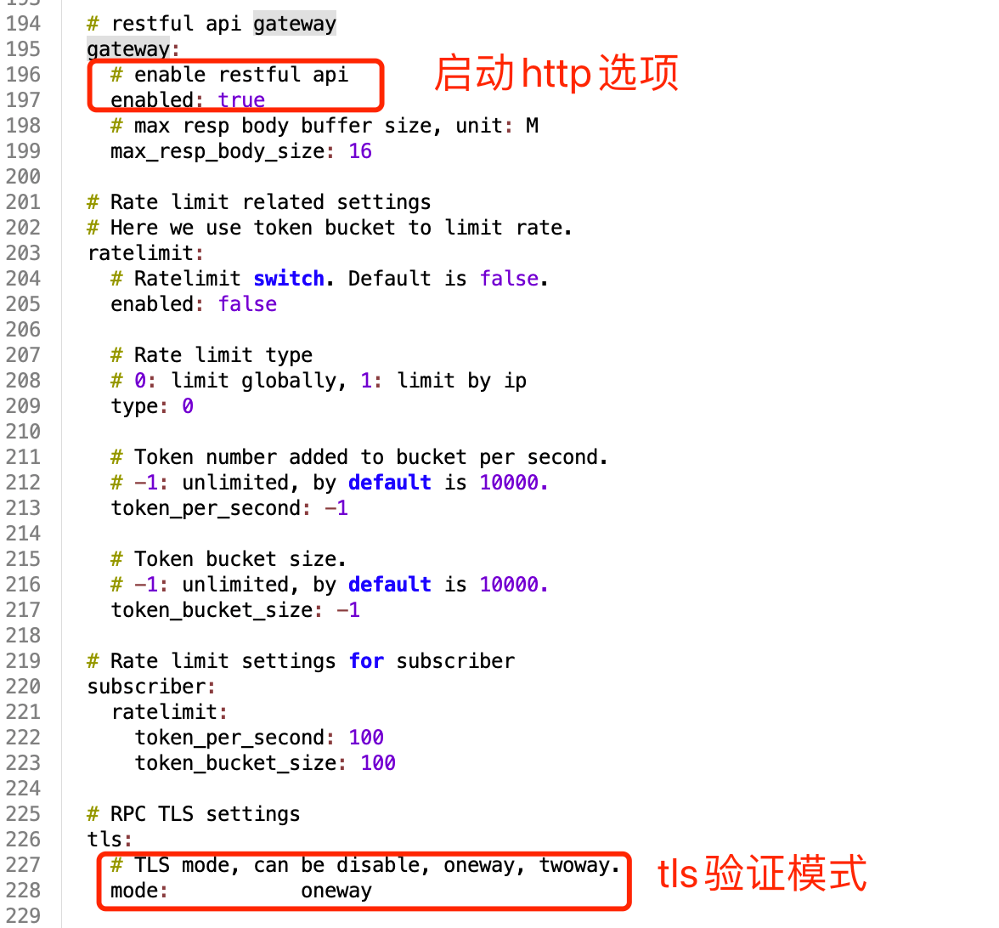

3、 如果在外网环境使用https时，建议将节点下的自签证书更换为机构颁发的证书； 开发时可以使用节点自签证书，但需要再客户端`授权允许访问自签证书https站点` 或者 `安装信任节点自签名证书`.

### 授权允许访问自签证书https站点

通过chrome浏览器访问链节点https接口，并授权允许访问：https://`链接节点地址`/v1/getversion

- chrome提示 ERR_CERT_AUTHORITY_INVALID

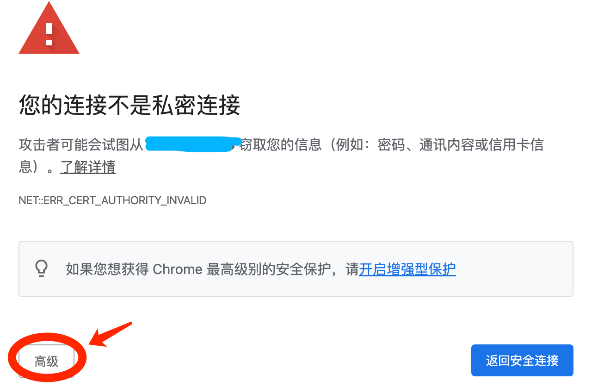

- 通过高级选项允许继续访问

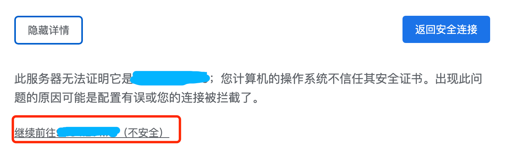


### 安装信任节点自签名证书

> 下载证书文件

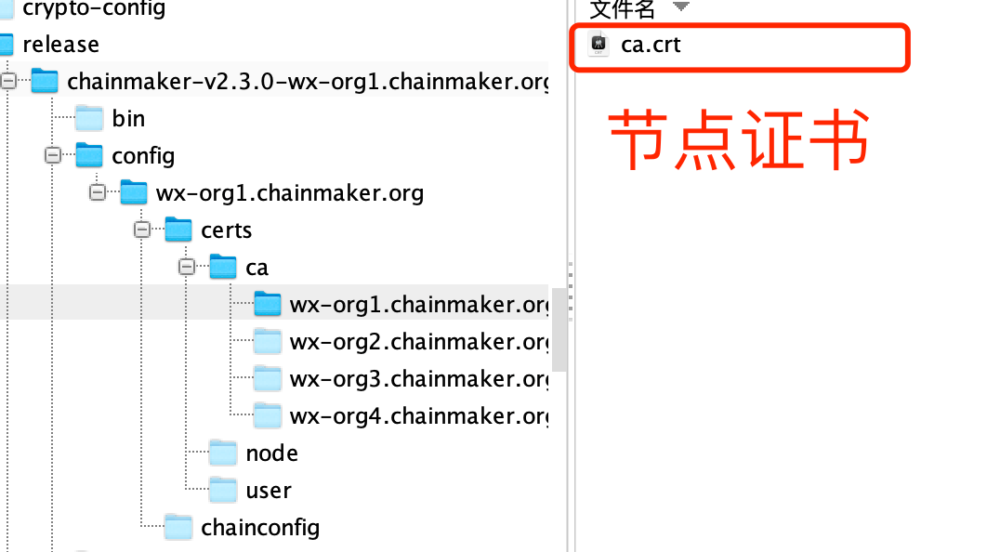


1、 Windows:


> <a href="https://msdn.microsoft.com/zh-cn/library/cc750534.aspx" target="_blank">Installing a root certificate on Windows</a>

下载证书后，双击证书，根据指引安装证书。证书安装过程，要确保证书存储到受信任的根证书颁发机构下。

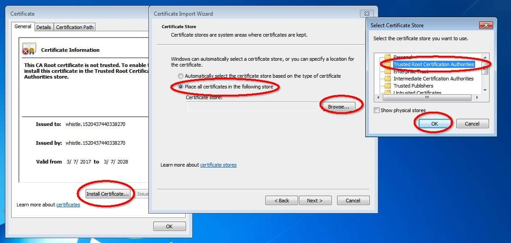

2、Mac根证书安装信任

- 双击ca证书通过钥匙串打开

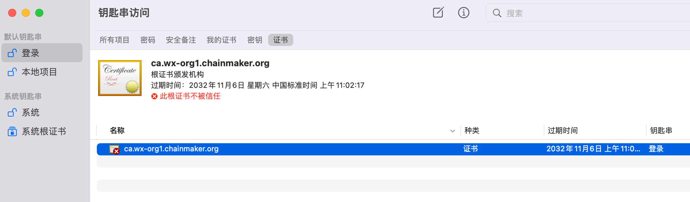

- 在列表中双击证书打开证书详情，点击选择始终信任，然后关闭证书详情

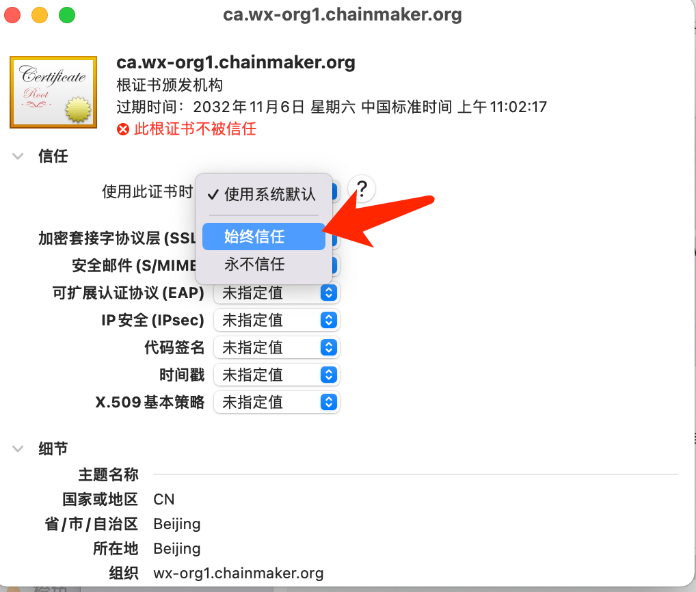

3、 通过证书绑定的host访问链节点

> 安装完证书，需要使用证书绑定的host访问链节点。如果是通过ip访问链节点，则浏览器会提示`ERR_CERT_COMMON_NAME_INVALID`， 解决方法如下：

- chrome 提示 ERR_CERT_COMMON_NAME_INVALID

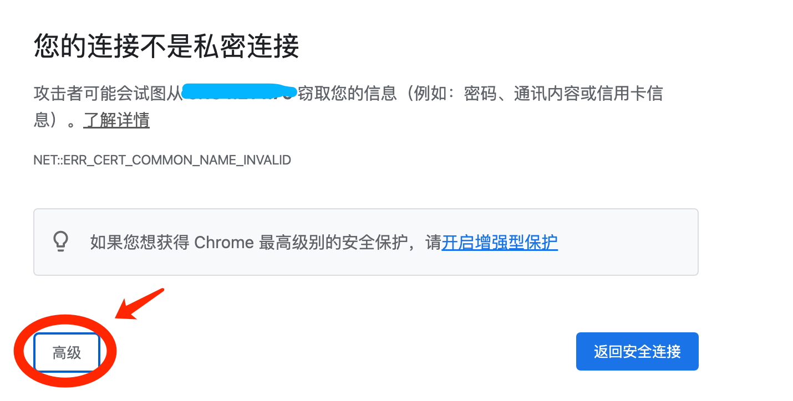

- 通过高级选项查看 CERT_COMMON_NAME,并通过本地host代理工具将链节点ip代理至 CERT_COMMON_NAME, 然后添加链时使用CERT_COMMON_NAME代替节点ip

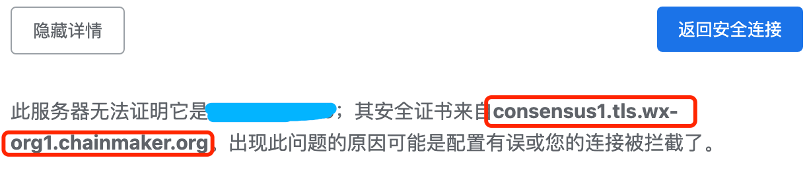


## 其他补充
### 代理服务

长安链v2.3.0以下版本的链需要由代理将HTTP请求转化为gRPC请求，默认由长安链官方提供公网代理服务，代码开源，开发者也可选择自行部署代理。

代理服务部署如下

```shell
# 拉取代码
$ git clone  --depth=1 https://git.chainmaker.org.cn/chainmaker/chainmaker-smartplugin.git
$ cd chainmaker-smartplugin

# 挂载目录权限设置
chmod -R 777 deploy/nginx/

# 启动代理服务，Nginx推荐最新版本，最低版本要求1.14.0
$ docker run --name "smartplugin-proxy" -p 9080:9080 -p 9081:9081 -d -v $(pwd)/deploy/nginx/conf.d/default.conf:/etc/nginx/nginx.conf:ro -v $(pwd)/deploy/nginx/log:/var/log/nginx -v $(pwd)/deploy/nginx/ssl:/var/www/ssl -v $(pwd)/deploy/nginx/njs:/etc/nginx/njs -v $(pwd)/deploy/nginx/cert:/etc/nginx/cert nginx


# 停止代理镜像
$ docker rm -f smartplugin-proxy
```
