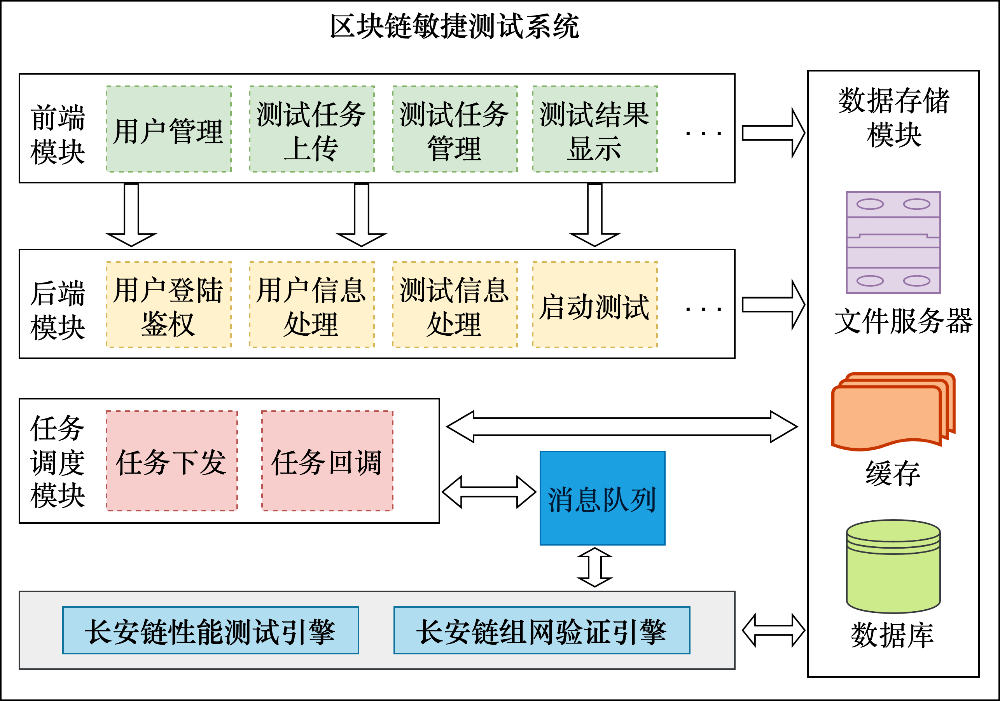
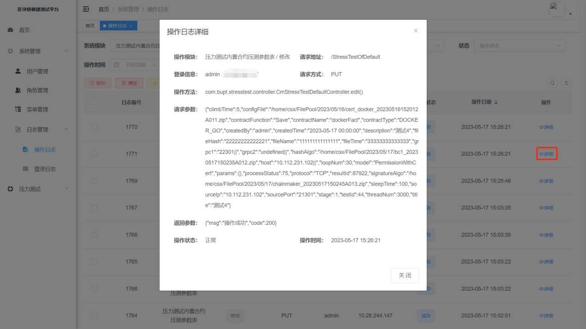
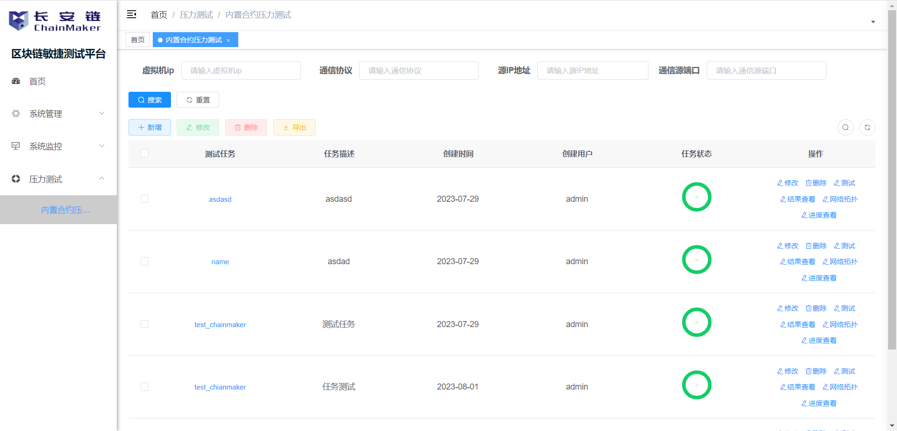
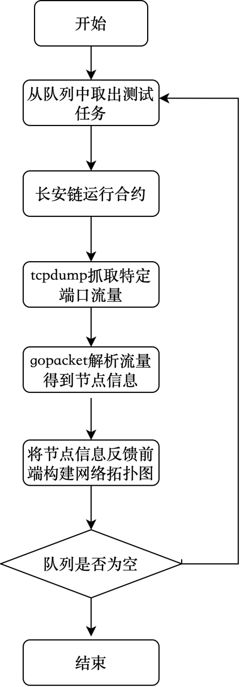

# 长安链敏捷测评使用文档

## 工具简介

长安链敏捷测评主要负责如下功能实现：

- 通信组网方式验证
- 长安链性能测试
- web前端界面显示

​		区块链性能测评是基于长安链2.3.0版本实现的。用户在前端页面选择输入压测参数，生成测试用例；后端对输入参数进行分析，向引擎发布测试任务，对测试任务进行存储；引擎调用压测框架进行压力测试，期间调用合约运行模块运行合约，调用密码测评模块动态抓取流量动态验证长安链内部使用的加密算法以及通信方式；在压力测试结束时引擎调用指标计算模块计算压测结果并向后端返回。后端对压测结果进行数据统计，将统计后的数据进行存储；并发送至前端；前端页面对测试结果进行可视化展示。

长安链敏捷测评整体架构如下图所示，包括：

- 前端模块
- 后端模块
- 任务调度模块
- 性能测试、组网验证引擎
- 数据存储模块

<div align=center>

<center>长安链敏捷测评整体架构图</center>
</div>  

​		前端模块：前端模块是智能合约安全检测系统的重要组成部分，它提供了清晰美观、简洁实用的WEB界面，为用户提供了便捷的操作方式。在前端模块中，用户可以进行身份信息的管理，包括注册、登录、修改密码等操作。同时，用户可以上传智能合约文件，并进行检测任务的管理。在合约检测任务管理中，用户可以查看任务的执行状态、任务的执行结果等信息。在检测信息的界面展示方面，前端模块可以将检测结果以图表、网络拓扑图等方式进行展示，方便用户进行查看和分析。此外，前端模块还具有良好的用户体验，它能够根据用户的操作行为进行智能提示，提高用户的操作效率。同时，前端模块还具有良好的可扩展性，可以方便地进行功能扩展和界面定制，以满足不同用户的需求。

​		后端模块：后端模块是智能合约安全检测系统的核心组成部分，它负责对系统的业务逻辑进行处理，并为前端模块提供对应的调用接口。在系统业务逻辑方面，后端模块主要包括登录鉴权、用户信息处理、测试信息处理及测试结果处理等功能。在登录鉴权方面，后端模块可以对用户进行身份验证，保证系统的安全性。在用户信息处理方面，后端模块可以对用户的信息进行增删改查等操作，保证用户信息的完整性和准确性。在合约信息处理方面，后端模块可以对上传的合约文件进行解析和存储，以便后续的检测工作。在敏捷测评检测方面，后端模块可以将检测任务下发给检测引擎，并将检测结果返回给前端模块。

​		任务调度模块：任务调度模块是敏捷测评系统的重要组成部分，它用于连接业务逻辑和检测引擎。任务调度模块通过消息队列来实现任务调度，并使用定时任务进行驱动。在敏捷测评任务的下发方面，任务调度模块可以将检测任务下发给检测引擎，并监控检测任务的执行状态。在检测引擎检测结果的回调方面，任务调度模块可以将检测结果回调给后端模块，并将检测结果进行存储和展示。

​		检测引擎：主要包括长安链性能测试引擎和组网验证引擎。性能测试引擎主要功能包括设计压力测试场景、执行压力测试以及进行性能分析与优化。用户可以根据实际需求设置并发请求数量、交易类型和频率等参数来设计各种负载情况下的测试场景。通过模拟大量并发请求和交易，该模块可以对长安链进行性能测试，并提供响应时间、吞吐量、交易成功率等指标的测试结果。组网验证引擎主要根据长安链的通信特点，完成一次区块链组网通信方式验证需要启动链、链交易、交易过程中抓取流量并解析验证长安链中通信组网方式。目前版本的区块链通信组网验证能够支持根据抓取的流量解析得到通信节点的IP、端口号、节点ID和通信加密方式，并根据通信关系构建网络拓扑图。

​		数据存储模块：数据存储模块是敏捷测评系统的重要组成部分，它负责对系统运行的相关数据进行持久化，包括文件数据的存储、对象数据存储及数据高效缓存等功能。在文件数据的存储方面，数据存储模块可以将上传的合约文件进行存储，并对文件进行索引和管理，以方便后续的检测工作。在对象数据存储方面，数据存储模块可以对用户信息、合约信息、检测结果等数据进行存储和管理，以保证数据的完整性和准确性。在数据高效缓存方面，数据存储模块使用缓存技术对常用数据进行缓存，以提高系统的访问速度和响应能力。

了解技术细节，请参考[长安链敏捷测评技术文档](../tech/长安链敏捷测评技术文档.md)

##  前端

### 技术选型

​		后端技术：

​		SpringBoot框架：用于构建独立、可扩展且高效的Java应用程序的开源框架。它是基于Spring框架的，通过提供默认配置和自动化的设置，简化了Spring应用程序的开发过程。Spring Boot旨在帮助开发者快速地创建Spring应用程序，从而降低开发过程中的复杂性。Spring Boot提供了大量的默认配置，减少了开发人员需要手动配置的工作。内置了Tomcat、Jetty等常用的Servlet容器，因此你可以将应用程序直接打包成一个可执行的JAR文件，并以独立的方式运行。Spring Boot可以根据你在项目中添加的依赖，自动管理这些依赖的版本和冲突提供了Actuator模块和集成测试支持：Spring Boot提供了一套用于编写和执行集成测试的工具和注解，帮助开发人员编写高效可靠的测试。

​		SpringCloud框架：基于Spring Boot的微服务架构开发工具集合，提供了一系列的库、工具和组件，简化了构建和管理分布式系统的复杂性。通过集成服务注册中心（如Netflix Eureka、Consul等），使服务能够自动注册和发现，实现了服务之间的动态通信和负载均衡。并可以集成多种负载均衡算法，如Ribbon，帮助在服务之间实现负载均衡，提高系统的性能和可扩展性。Spring Cloud通过集成RestTemplate或Feign等工具，简化了服务之间的远程调用。Spring Cloud提供了分布式配置管理工具，如Spring Cloud Config，允许开发人员将应用程序的配置集中管理，实现配置的动态更新和版本控制。通过集成Hystrix和Resilience4j等库，提供了容错机制，帮助应对分布式系统中的故障和异常，提高系统的弹性和可靠性。Spring Cloud提供了Zuul和Spring Cloud Gateway等网关工具，用于对外暴露API并进行路由、过滤和访问控制等功能。并集成了Zipkin和Sleuth等工具，提供了分布式追踪和监控功能，帮助开发人员定位和解决分布式系统中的性能问题和故障。

​		前端技术：

​		Vue.js：流行的开源JavaScript框架，用于构建用户界面。它专注于通过组件化和响应式数据绑定的方式来构建可交互的Web界面。Vue.js采用了双向数据绑定的机制，可以将数据与DOM元素进行绑定，使数据的变化能够自动反映到界面上，同时用户在界面上的操作也可以同步更新数据。Vue.js鼓励将界面拆分为多个可复用的组件，每个组件负责自己的一部分功能和样式。并且Vue.js的核心库非常轻量级，文件体积小，加载速度快。Vue.js支持使用ES模块和Webpack等构建工具进行模块化开发。开发人员可以将应用程序拆分为多个模块，提高代码的可维护性和可测试性。

### 内置功能

用户管理：用户是系统操作者，该功能主要完成系统用户配置。

菜单管理：配置系统菜单，操作权限，按钮权限标识等。

角色管理：角色菜单权限分配、设置角色按机构进行数据范围权限划分。

字典管理：对系统中经常使用的一些较为固定的数据进行维护。

日志管理：系统正常操作日志记录和查询；系统异常信息日志记录和查询。

登录日志：系统登录日志记录查询包含登录异常。

定时任务：在线（添加、修改、删除)任务调度包含执行结果日志。

压力测试任务管理：内置合约压力测试任务管理，包括新增压力测试、修改压力测试、开始压力测试、压力测试结果查看功能、网络拓扑查看功能以及压力测试进度查看功能等。

### **目录结构**

```
com.buptCM     
├── buptCM-ui              // 前端框架 [80]
├── buptCM-gateway         // 网关模块 [8080]
├── buptCM-auth            // 认证中心 [9200]
├── buptCM-api             // 接口模块
│       └── buptCM-api-system                          // 系统接口
├── buptCM-common          // 通用模块
│       └── buptCM-common-core                         // 核心模块
│       └── buptCM-common-datascope                    // 权限范围
│       └── buptCM-common-datasource                   // 多数据源
│       └── buptCM-common-log                          // 日志记录
│       └── buptCM-common-redis                        // 缓存服务
│       └── buptCM-common-security                     // 安全模块
│       └── buptCM-common-swagger                      // 系统接口
├── buptCM-modules         // 业务模块
│       └── buptCM-system                              // 系统模块 
│       └── buptCM-job                                 // 定时任务 
│       └── buptCM-file                                // 文件服务
├── buptCM-visual          // 图形化管理模块
├──pom.xml                // 公共依赖
```

### 部署方案

1、准备环境

- JDK\>=1.8（推荐1.8版本）
- MySQL\>=5.7.0（推荐5.7版本）
- Redis\>=3.0
- Maven\>=3.0
- Node\>=12
- Nacos\>=1.1.0（ruoyi-cloud\>=3.0.0需下载Nacos\>=2.x.x版本）
- Sentinel\>=1.6.0
- Nginx

注意：目前ruoyi的版本均超过3.0，推荐使用nacos的稳定版本——nacos2.0.3

2 、Nginx 安装部署

（1）下载地址

地址[http://nginx.org/en/download.html](http://nginx.org/en/download.html),

（2）解压安装包

```shell
tar xzf nginx-1.20.2.tar.gz #解压文件夹，版本为下载的具体版本
mv nginx-1.20.2 /user/local/nginx #移动目录
```

（3）安装nginx

```shell
cd /user/local/nginx #进入nginx目录
./configure --prefix=/usr/local/nginx --conf-path=/usr/local/nginx/nginx.conf #检测安装平台的目标特征
```

常见会缺少gcc、zlib、PCRE依赖，可使用下面三个命令安装依赖

```shell
yum install -y gcc;
yum install -y pcre pcre-devel;
yum install -y zlib zlib-devel
```

（4）编译nginx

configure命令成功之后，输入命令`make`，编译nginx目录；make成功，最后输入命令`make install /usr/local/nginx/`安装nginx。

（5）启动nginx

```shell
cd /usr/local/nginx/sbin/ #进入nginx的sbin目录
./nginx -c /usr/local/nginx/conf/nginx.conf #启动命令
```

（8）复制dist包到指定目录

（9）修改nginx配置

```shell
vim nginx.conf #进入/usr/local/nginx/conf
./nginx -s reload #保存配置文件后，重启
```

​		打开浏览器，输入服务器上对应的ip地址和端口即可看见页面。

3、MySQL

（1）拉取镜像

```shell
docker pull mysql:5.7
```

（2）查看当前所有的镜像

```shell
docker image ls
```

（3）创建并启动一个容器

```shell
docker run --name test-mysql -e MYSQL\_ROOT\_PASSWORD=123456 -p 3306:3306 -d mysql:5.7
```

- `-name`: 给新创建的[容器](https://cloud.tencent.com/product/tke?from=20065&from_column=20065)命名，此处命名为`test-mysql`
- `-e`: 配置信息，此处配置 [MySQL](https://cloud.tencent.com/product/cdb?from=20065&from_column=20065)的 root 用户的登录密码
- `-p`: 端口映射，此处映射主机的3306端口到容器`test-mysql`的3306端口
- `-d`: 成功启动同期后输出容器的完整ID

（4）查看容器运行状态

```shell
docker ps
```

（5）进入容器

```shell
docker exec -it test-mysql /bin/bash
```

（6）连接 MySQL

```shell
可以通过工具直接连接服务器的3306端口

也可以进入容器，然后通过mysql -u root -p连接
```

（7）启动多个 mysql 容器

```shell
docker run --name test2-mysql -e MYSQL\_ROOT\_PASSWORD=123456 -p 6666:3306 -d mysql
```

4、Redis

（1）拉取Redis

```shell
docker pull redis:3.0.5
```

（2）查看本地镜像

```shell
docker images
```

（3）运行容器

```shell
docker run -itd --name redis-test -p 6379:6379 redis
```

5、nacos

（1）拉取镜像

```shell
docker pull nacos/nacos-server:v2.0.3
```

（2）创建映射容器的文件目录

```shell
mkdir -p /mydata/nacos/logs/ #创建logs目录
mkdir -p /mydata/nacos/conf/ #创建配置文件目录
# 授予权限
chmod 777 /mydata/nacos/logs
chmod 777 /mydata/nacos/conf
```

（3）创建nacos\_config数据库

​		nacos使用2.0.3版本后，创建的数据库由"nacos"变为"nacos\_config"，需要手动创建数据库，进入mysql使用如下SQL语句：

```mysql
CREATE DATABASE `nacos_config` DEFAULT CHARACTER SET utf8mb4;
 # 这里的数据库名称使用了关键字config，所以要使用``对数据库名称进行包围，后面在创建ry-config等数据库时也需要同样的操作，否则无法创建成功。
```

（4）执行SQL语句，为nacos\_config添加数据表

​		SQL文件位置：[下载位置]/nacos/conf/nacos-mysql.sql

​		进入mysql后，使用如下命令执行SQL文件：

```mysql
mysql> source [下载位置]/nacos/conf/nacos-mysql.sql
```

（5）修改application.properties文件

​		自行配置db数据源，账号密码，将nacos与mysql数据库进行连接，具体修改内容如下：

```shell
# 取消下面内容的注释
spring.datasource.platform=mysql
db.num=1
db.url.0=jdbc:mysql://localhost:3306/nacos\_config?characterEncoding=utf8&connectTimeout=1000&socketTimeout=3000&autoReconnect=true&useUnicode=true&useSSL=false&serverTimezone=UTC
db.user=自己的用户名
db.password=自己的密码
```

（6）命令行启动nacos

​	运行/nacos/bin/startup.sh脚本启动服务

​	使用如下命令在单体状态下启动nacos（集群模式启动会报错）

```shell
# 适用于centos
sh startup.sh -m standalone
# 适用于Ubantu
bash startup.sh -m standalone
# 不同的操作系统执行脚本的命令不相同，需要注意区分
```

（7）创建相应数据库

​		创建数据库ry-cloud并导入数据脚本ry\_2021xxxx.sql（必须），quartz.sql（可选）；

​		创建数据库ry-config并导入数据脚本ry\_config\_2021xxxx.sql（必须）；

​		以上文件均在ruoyi代码文件夹中的sql文件夹中，为保证编码正确，建议在sql文件中添加如下语句，按照指定编码自动创建相应数据库。

- 创建ry-cloud数据库（将本部分加在对应SQL文件的前端）

```mysql
DROP DATABASE IF EXISTS `ry-cloud`;
CREATE DATABASE `ry-cloud` DEFAULT CHARACTER SET utf8mb4 COLLATE utf8mb4\_general\_ci;
SET NAMES utf8mb4;
USE `ry-cloud`;
```

- 创建ry-config数据库

```mysql
DROP DATABASE IF EXISTS `ry-config`;
CREATE DATABASE `ry-config` DEFAULT CHARACTER SET utf8mb4 COLLATE utf8mb4\_general\_ci;
SET NAMES utf8mb4;
USE `ry-config`;
```

（8）修改配置文件

​		修改application.properties文件，修改文件中有关数据库的配置，将ruoyi所需要的配置文件信息加载到nacos中，具体修改内容如下：

```properties
# 取消下面内容的注释
spring.datasource.platform=mysql
db.num=1
db.url.0=jdbc:mysql://localhost:3306/ry-config?characterEncoding=utf8&connectTimeout=1000&socketTimeout=3000&autoReconnect=true&useUnicode=true&useSSL=false&serverTimezone=UTC
db.user=自己的用户名
db.password=自己的密码
```

（9）修改配置中有关端口号、IP地址信息

```
# 修改3306端口号
buptCM-chainmaker-dev.yml
buptCM-gen-dev.yml
buptCM-job-dev.yml
buptCM-practice-dev.yml
buptCM-smartcontract-dev.yml
buptCM-stresstest-dev.yml
buptCM-system-dev.yml
```


```
# 修改IP
buptCM-auth-dev.yml
buptCM-chainmaker-dev.yml
buptCM-file-dev.yml
buptCM-gateway-dev.yml
buptCM-gen-dev.yml
buptCM-job-dev.yml
buptCM-practice-dev.yml
```

### 系统示意图

<div align=center>

<center>登录页面</center>
</div>  

<div align=center>

<center>日志展示页面</center>
</div>  

<div align=center>

<center>内置合约测试页面</center>
</div>  


## 性能测试

### 概述

<div align=center>

<center>性能测试</center>
</div> 

​		如上图所示，长安链性能测评主要负责以下功能实现：

- 由数据处理模块抓取测试任务并执行获得两类配置文件，其中一类用于与目标的区块链网络建立连接，另一类生成本次测试任务的压测参数，并输入到压测模块；
- 压测模块负责通过模拟测试用例生成真实交易，异步向目标区块链节点发送交易，执行压测任务。
- 同时启动消息订阅模块实时订阅区块链网络产生的交易信息，并在交易完成时返回结果给指标计算模块。
- 指标计算模块根据相应的测试任务匹配对应的指标并进行计算，返回该测试任务的测试结果。

###  整体流程

<div align=center>

<center>整体流程</center>
</div>

性能测试方式验证流程如上图所示：

- 从任务队列里获取到压测任务。根据测试任务中数据构造实际需求设计各种负载情况下的测试场景，构造并发请求数量、交易类型、交易频率等参数以模拟真实的使用情况，生成压测任务，并由压测模块执行。
- 启动消息订阅机制订阅交易信息。通过订阅交易信息，消息订阅模块可以实时获取交易的状态、响应时间等关键指标。这些信息对于评估长安链在压力下的性能表现非常重要。
- 在消息订阅机制提示交易任务结束后，指标计算模块可以通过收集到的交易信息计算出响应时间、吞吐量、交易成功率等指标。这些指标可以反映出长安链在高负载情况下的性能表现。通过计算相应指标，用户可以评估长安链的稳定性、可扩展性和吞吐量，并确定性能瓶颈所在。

###  接口说明

####  DownConfigAndLoad

API介绍
		该API用于从指定的服务器下载长安链的配置文件，并加载到压测引擎的制定目录下，方便后续使用。  

输入 

- host，string，服务器地址。  
- port，int64，服务器端口号。  
- username，string，登录服务器的用户名。  
- password，string，登录服务器的密码。  
- configFile，string，需要下载的配置文件名。   

输出
		path，string，下载的配置文件在压测引擎中的路径。  

####  GenerateConstConfig  

API介绍
		该API用于生成压测参数配置文件，包括合约函数、合约名称、合约类型、运行时类型、压测时间、循环次数、睡眠时间、线程数等。  

输入
- model，string，长安链的配置链模式，包括PermissionWithCert、PermissionWithKey、Public，三种模式详见长安链文档。 
- contractFunction，string，智能合约函数名称。 
- contractName，string，智能合约名称。 
- runTimeType，string，智能合约语言类型，详见长安链文档。 
- allParams，string，运行智能合约时所需要的参数，各个参数间使用“||”间隔，参数内格式为“参数名：参数内容” 
- climbTime，int，线程爬坡时间。 
- loopNum，int，循环次数。 
- sleepTime，int，睡眠时间。 
- threadNum，int，并发线程数。 

输出
	path，string，生成的压测参数配置文件在压测引擎中的路径。 

####  GenerateSdkConfig 
API介绍
		该API用于生成与长安链建立连接的SDK配置文件。
输入

- model，string，长安链的配置链模式，包括PermissionWithCert、PermissionWithKey、Public，三种模式详见长安链文档。 
- hostList，[]string，需要加压的主机IP地址列表。 
- grpcList，[]string，需要加压的主机列表对应的gRPC端口列表。 
- connCnt，int，单位时间内向长安链发送的交易对数量。  

输出
	path，string，生成的SDK配置文件在压测引擎中的路径。 

#### GenerateClientConfig   

API介绍

​		该API用于生成压力测试节点数目的配置文件。

输入

- nodeNum，int，压力测试节点数目。

输出

​	ClientsSavePath，string，生成的clients配置文件在压测引擎中的路径。 

#### processPressureTest 
API介绍
		该API根据准备好的配置文件对目标链进行压测。 
输入

​		无，使用3.3.1，3.3.2，3.3.3准备好的配置文件。 
输出
​		PressureTestResult压测结果，包括交易数、成功上链数、TPS、CTPS、QTPS。

###  基本使用

```go
func main() {
    //下载长安链 config文件并放到 build目录下
    DownConfigAndLoad("10.112.66.243"，22，"root"，"123456"，"/home/csx/FilePool/2023/05/01/config_20230501095737A006.zip " ，"\\")
    // 生成压测参数配置文件
    GenerateConstConfig ("PermissionWithCert", "P","T", "DOCKER_GO", 5, 100, 100, 100)
    // 被压测时目标长安链和对应的grpc端口
    hostList :=[]string{"10.112.25.201","10.112.25.201","10.112.25.201","10.112.25.201"}
	grpc1List :=[]string{"12031","12032","12033","12034"}
    // 生成与长安链建立连接的SDK配置文件
    GenerateSdkConfig (hostList,grpc1List,"PermissionWithCert")
    // 根据准备好的配置文件对目标链进行压测
    result = PressureTestResult()
    // 输出结果
    fmt.Println(result)
}
```


## 组网方式

### 概述

<div align=center>

<center>组网方式</center>
</div>

如上图所示，组网方式引擎主要负责以下功能实现：

- 接收前端测试用例解析并启动引擎

- 抓取服务器指定端口流量保存到客户机
- 解析流量包得到对应的通信节点信息
- 解析结果通过消息队列反馈给前端

### 整体流程

<div align=center>

<center>整体流程</center>
</div>

区块链通信组网方式验证流程如上图所示：

- 用户向引擎发送请求以验证区块链的组网方式。该请求包含了要运行的合约以及输出压力参数等信息。引擎接收到请求后，下载并运行相应的合约。
- 捕获特定端口的流量，使用tcpdump工具，并将抓取到的流量保存为离线文件并dump到本地客户机，以便后续分析。
- 使用gopacket库来分析离线的流量文件，可以提取长安链通信节点的IP地址、端口号、节点ID以及通信所采用的加密方式等信息。
- 将分析得到的结果反馈到前端，前端根据通信关系生成相应的网络拓扑图，展示区块链中的节点之间的连接关系。

### **接口说明**

```go
// SourceInfo 节点源信息
type SourceInfo struct {
    Ip string `json:"Ip"`
    Port string `json:"Port"`
    Nodeid string `json:"Nodeid"`
}
// DestInfo 目标节点信息
type DestInfo struct {
    Ip string `json:"Ip"`
    Port string `json:"Port"`
    Protocol string `json:"Protocol"`
    Cryptoversion string `json:"Cryptoversion"`
    Nodeid string `json:"Nodeid"`
}
```

#### catchTraffic

API 介绍

​		该API接收服务器详细信息以及待抓取服务器端口号，在长安链启动时抓取指定该服务器特定端口组网流量并下载到客户机

输入

- host，string，服务器地址。
- port，int64，服务器端口号
- username，string，登录服务器的用户名
- password，string，登录服务器的密码
- catch, int64,服务端抓取流量端口

输出

​	path，string，抓取的流量在客户机中保存的路径

#### analyseTraffic

API 介绍

​		该API通过对抓取的流量进行解析得到对应的通信节点的IP、端口号、节点ID以及节点间的通讯协议和加密方式。

输入

- path，string，pcap包所在的地址


输出

​	通信组网方式结果，包括通信源节点IP、端口号，节点ID，目的节点IP、端口号，节点ID，节点间的通信协议和加密方式。

#### DownTrafficYml  

API 介绍

​		该API函数完成chainmaker.yml文件并放到指定目录。

输入

- host，string，服务器地址。 
- port，int64，服务器端口号。  
- username，string，登录服务器的用户名。 
- password，string，登录服务器的密码。 
- filePath，string，文件在目标服务器上的路径。

输出

​	path，string，下载的文件在客户机中保存的路径。

### 基本使用

```go
func main() {
    // 抓取通信流量
    pcapPath := traffic.CatchTraffic("127.0.0.1", "22", "stack", "chainmaker123", "21301")
    // 分析通信流量
    trafficInfo = traffic.Analyse(pcapPath)
    fmt.Println("trafficInfo1:", trafficInfo)
 }
```

