# 长安链管理台

本产品定位为供开源社区区块链开发者，区块链产品经理使用，以便在初步接触长安链时，通过本平台可单机快速部署长安链用于产品体验和测试，并对长安链的技术架构，功能模块有一个初步了解。

本产品支持私有化部署，详细部署流程参考安装指南。

## 安装指南

### 版本支持

目前支持长安链`v1.2.4`、`v1.2.5`、`v1.2.6`、`v2.0.0`、`v2.1.0`、`2.2.0`、`2.3.0`、`2.3.1`、`2.3.2`、`2.3.3`、`2.3.4`版本，因长安链1.X版本和2.X版本底层数据结构不同，目前相互之间不兼容。

### 环境依赖
**docker**

`docker`版本为`20.10.7`或以上
`docker-compose`版本为`1.29.2`或以上

下载地址：
- [https://docs.docker.com/engine/install/](https://docs.docker.com/engine/install/)
- [https://docs.docker.com/compose/install/](https://docs.docker.com/compose/install/)

若已安装，请通过命令查看版本：

```bash
  $ docker -v
  $ docker-compose -v
```

### 账号依赖

当前管理平台的代码仓库为私有仓库，需要先到[https://git.chainmaker.org.cn/users/sign_up](https://git.chainmaker.org.cn/users/sign_up) 进行账号注册，才能同步代码。

### 部署

管理平台主要由前端、后端及数据库三部分组成。通过`docker`的方式部署。

#### 代码下载

下载地址： [https://git.chainmaker.org.cn/chainmaker/management-backend](https://git.chainmaker.org.cn/chainmaker/management-backend)
下载代码：

```bash
$ git clone -b v2.3.4  --depth=1 https://git.chainmaker.org.cn/chainmaker/management-backend.git
```

#### 启动容器

下载后端代码后，进入`management-backend`目录，执行以下命令
```bash
$ docker-compose up
```
启动成功后，浏览器访问`localhost`即可，如果发现启动过程中有端口被占用的情况，请修改`docker-compose.yml`文件中的端口

## 整体流程说明

### 从零部署链

如果您还未部署过链，可通过本平台部署长安链，主要流程如下。

1、首先需要在证书管理模块申请相关的组织证书、节点证书、用户证书。

2、接着在区块链管理模块，配置链的相关信息，包含共识策略、参与组织与节点、区块基本配置等，生成链的配置文件。

3、将配置文件下载到本地，并在`linux`服务器上，执行平台提供的脚本，一键启动链。

4、部署成功后，在管理平台上订阅链，使管理平台与链上某一节点建立联系，获得链上信息。

5、订阅成功后，您可以通过管理平台部署管理合约，发送交易，通过区块链浏览器查看链上信息。

### 导入已有链

如果您已经有正在运行中的链，可将之导入到本管理台进行管理，主要流程如下

1、需要在证书管理先将该链上的某一组织、节点、用户证书导入到本管理台。

2、在区块链管理模块，使用所导入的组织、节点、用户信息订阅链。

3、订阅成功后，您可以通过所配置的节点与链建立联系，并且支持在管理台上部署管理合约，发送交易，通过浏览器查看链上信息

## 平台账户说明

### 登录


- 私有化部署本平台时会生成的对应的`admin`账号，默认密码为`a123456`。如需新增其他账号，可通过`admin`账号，在平台账户管理处新增。

### 账户管理

#### 平台账号列表


- 可在平台账号管理处，新增账号，禁用/启用账号。

- 如果忘记密码，管理员可将某一账户的密码重置为`a123456`。

- 在右上角账号位置，可以修改密码和退出登录。

#### 新增账号

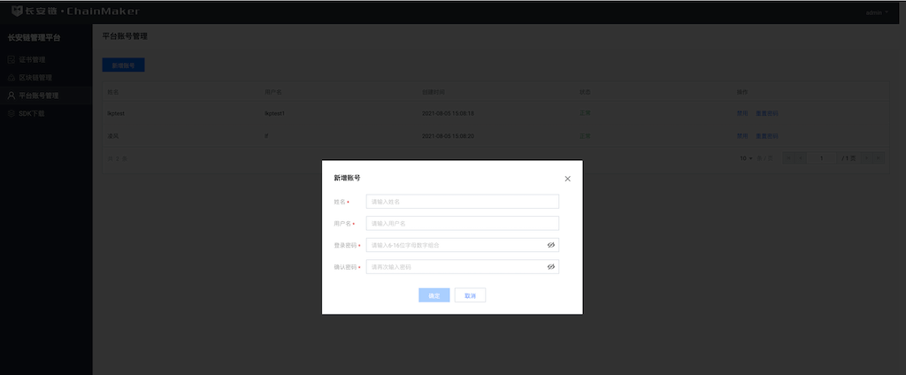

- 输入姓名，用户名，登录密码新增账号，其中用户名不可以重复。

## 快速引导
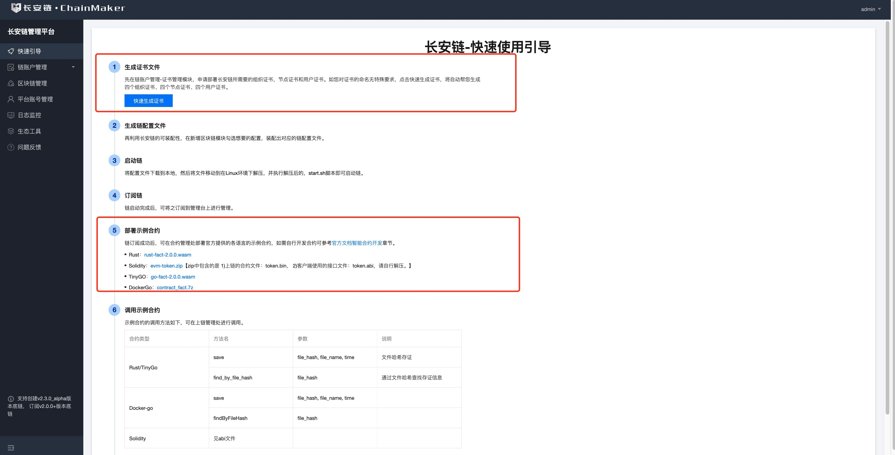

- 登录后，在长安链快速引导处，点击快速生成证书按钮，系统将自动生成四个组织证书、四个节点证书、四个用户证书。
- 在快速引导处，提供示例合约文件，可将之下载到本地，体验通过管理台部署合约的功能。

## 链账户管理

### 组织证书

#### 查看组织证书列表


- 此处可查看已申请到的组织证书列表，并可以申请新的证书，导入外部证书，查看并下载证书。
- 如果您是首次部署链，前先申请证书。如果您想导入正在运行中的链，可以导入该链对应的证书后，在区块链管理-订阅链模块直接订阅。
- 支持删除未使用的证书。

#### 申请组织证书


- 填写组织ID，组织名称申请组织证书。
- 注意组织ID不能重复申请。
- 支持申请国密和非国密两种证书。

#### 导入组织证书

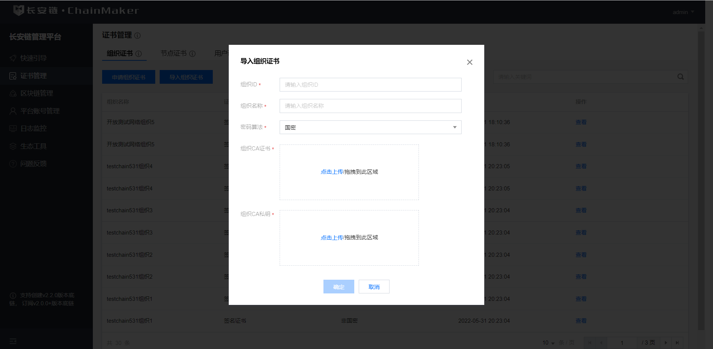

- 如果您已经通过长安链的`ca服务`，生成过证书，则可以将证书直接导入使用。
- 目前暂不支持导入长安链体系外的`ca证书`。
- 支持导入国密和非国密两种证书。

#### 查看下载组织证书

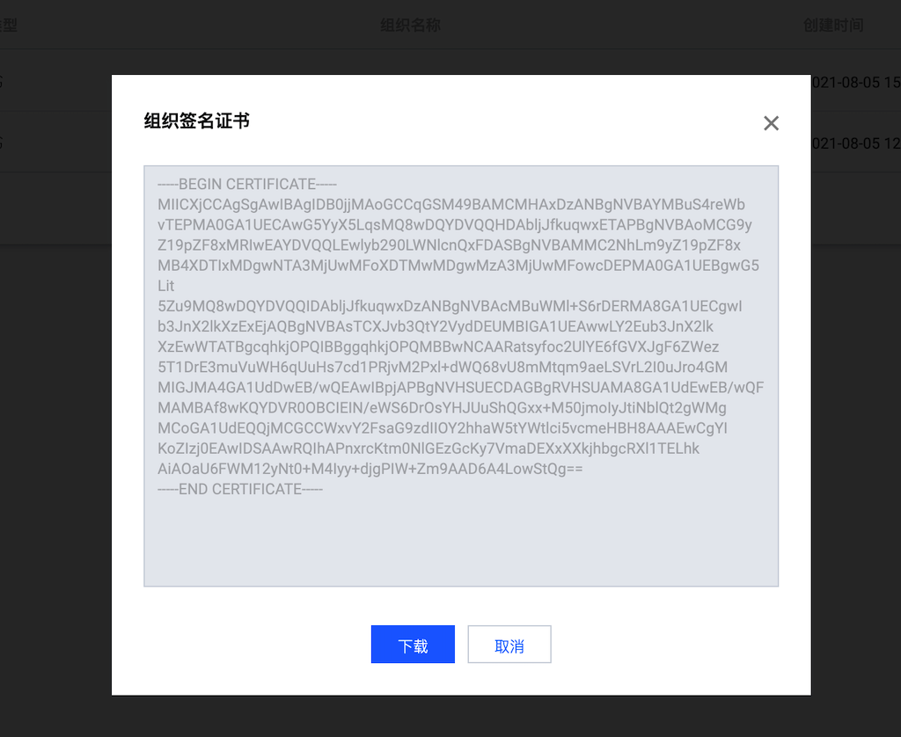

- 可以直接查看，并下载组织证书。下载后会得到一个压缩包，里头含组织的的sign证书、sign私钥、请自行解压文件。

### 节点证书

#### 查看节点证书列表

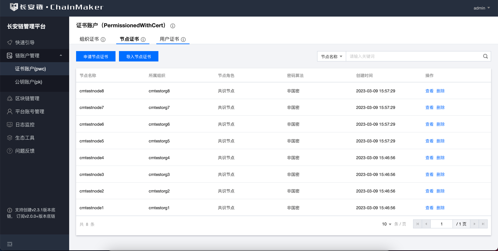

- 此处可查看已申请到的节点证书列表，并可以申请新的证书，导入外部证书，查看并下载证书。
- 支持删除未使用的证书。

#### 申请节点证书

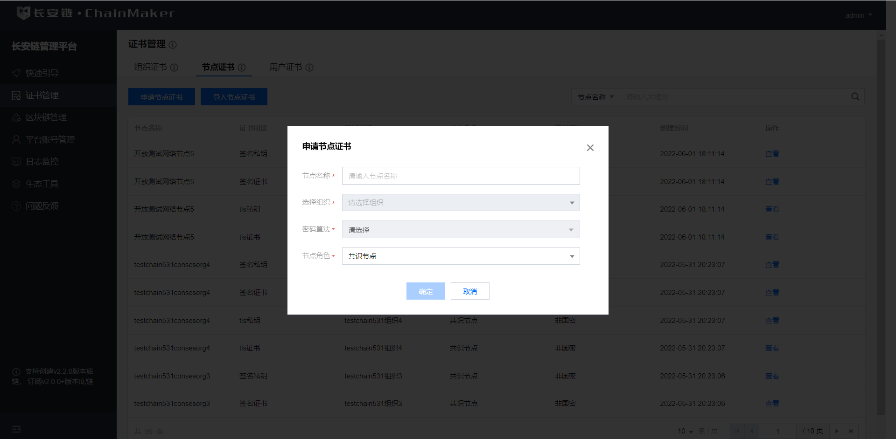

- 节点证书是由上级组织机构签发的，故而申请节点证书前，请先确保已申请/导入相应的组织证书。
- 目前节点证书角色分为共识节点和同步节点两种。
- 通过填写节点名称、组织信息，节点角色，申请节点证书。
- 支持申请国密和非国密两种证书。

#### 导入节点证书

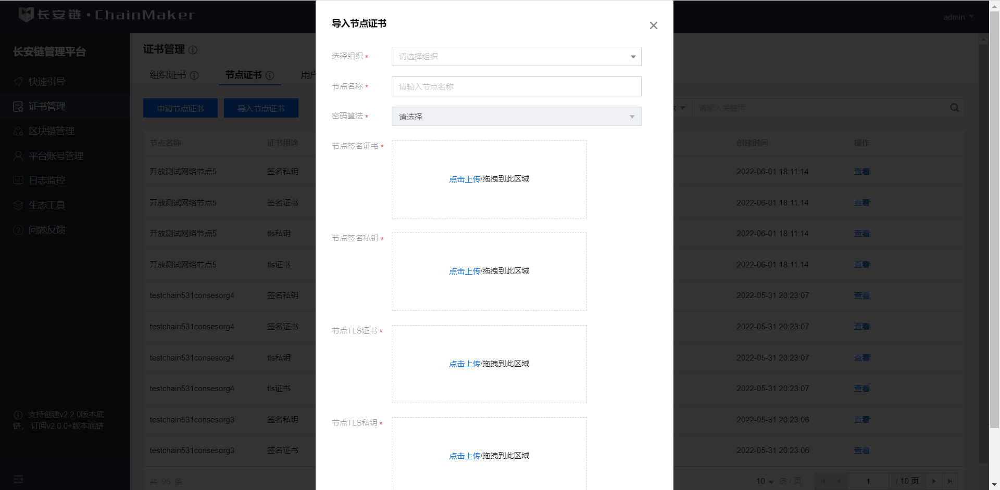

- 如果您已经通过长安链的ca服务，生成过节点证书，则可以将证书直接导入使用。
- 注意导入节点证书前需要先导入节点证书签发组织的组织证书，并且导入节点证书时所选择的组织信息，必须与本节点证书签发的组织保持一致。
- 目前暂不支持导入长安链体系外的ca证书。

#### 查看下载节点证书

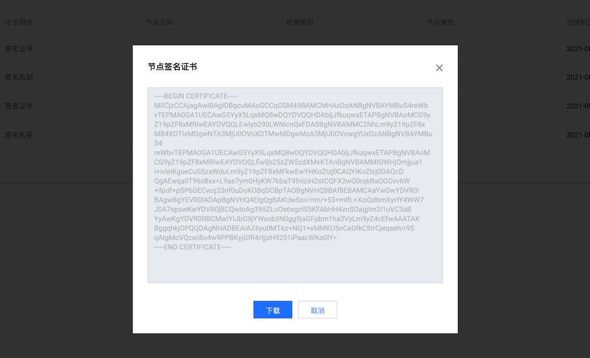

- 可以直接查看，并下载节点证书，下载后会得到一个压缩包，里头含节点的sign证书、sign私钥、Tls证书、Tls私钥，节点nodeID，请自行解压文件。

### 用户证书

#### 查看用户证书列表

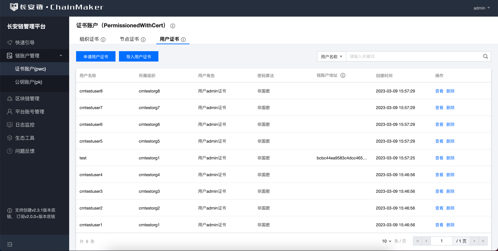

- 此处可查看已申请到的用户证书列表，并且可以申请新的证书，导入外部证书，查看并下载证书。
- 支持删除未使用的证书。

#### 申请用户证书


- 用户证书是由上级组织机构签发的，故而申请用户证书前，请先确保已申请/导入相应的组织证书。
- 目前用户证书角色分为`admin`、`client`和`light`三种。
- 通过填写用户名称、组织信息，用户角色申请用户证书。
- 支持申请国密和非国密两种证书。

#### 导入用户证书

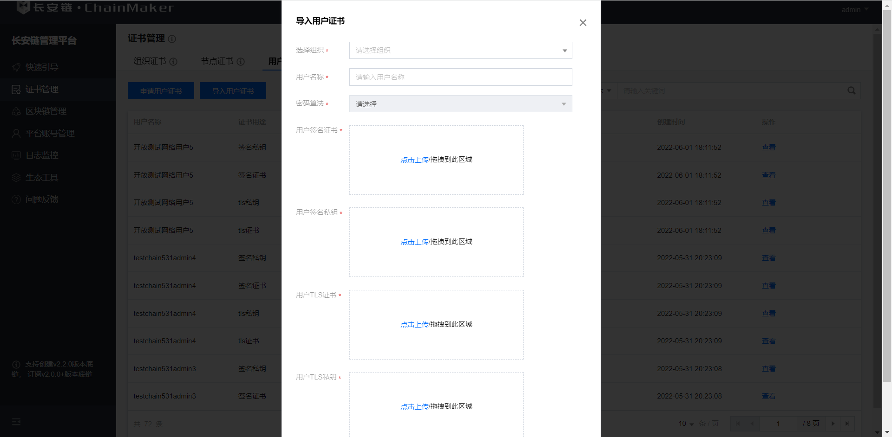

- 如果您已经通过长安链的ca服务，生成过用户证书，则可以将证书直接导入使用。
- 注意导入用户证书前需要先导入用户证书签发组织的组织证书，并且导入用户证书时所选择的组织信息，必须与本用户证书签发的组织保持一致。
- 目前暂不支持导入长安链体系外的ca证书。

#### 下载用户证书

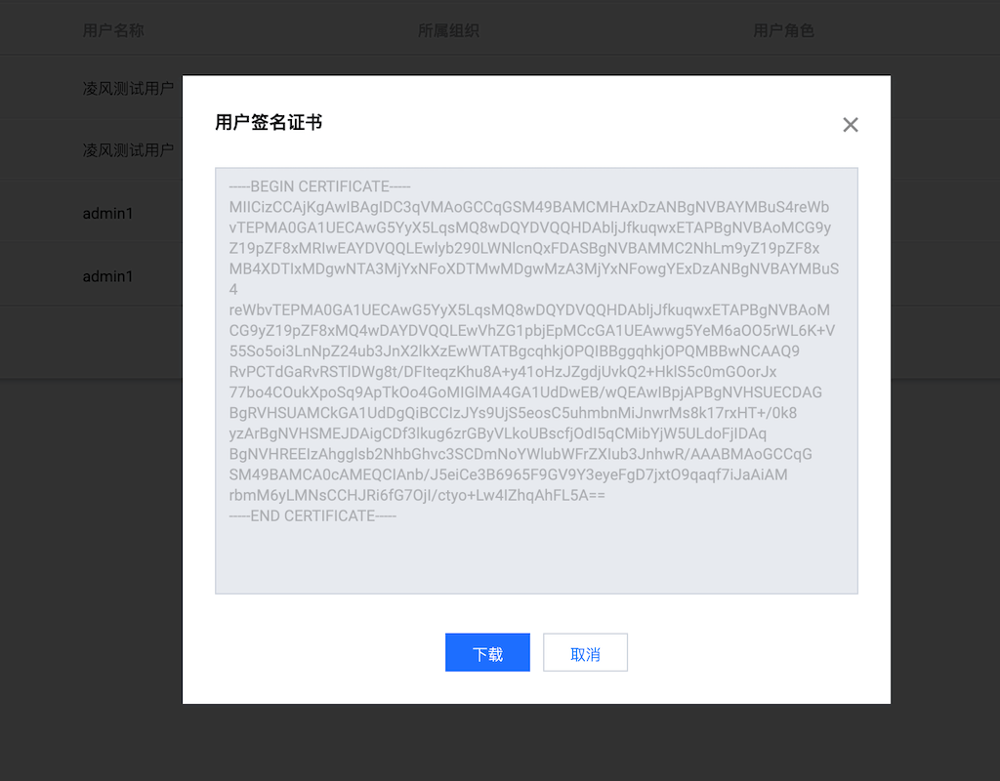

- 可以直接查看，并下载用户证书。下载后会得到一个压缩包，里头含用户的sign证书、sign私钥、Tls证书、Tls私钥，请自行解压文件。

### 公钥账户

#### 查看公钥账户列表
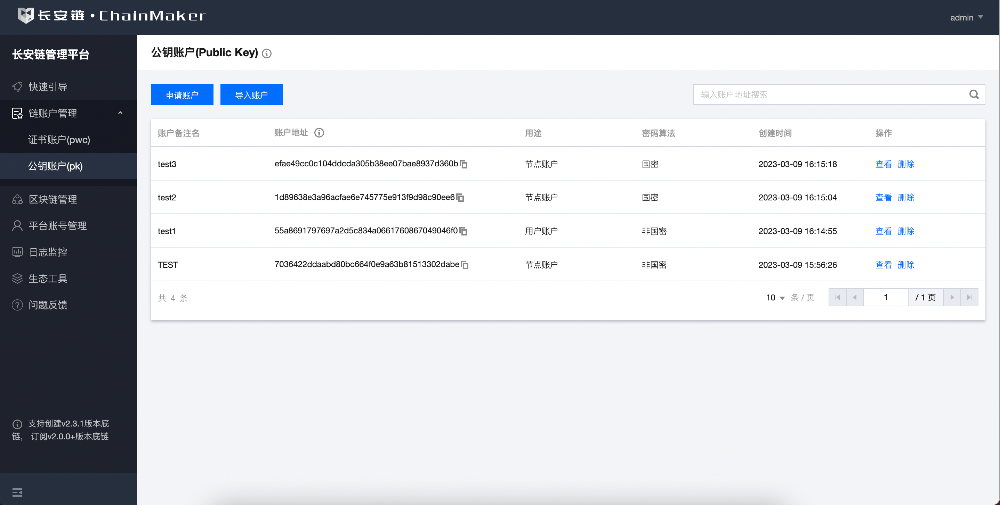

- 此处可查看已申请到的公钥账户列表，并且可以申请新的公钥账户，导入公钥账户，下载账户等。
- 支持删除未使用的公钥账户。

#### 申请公钥账户
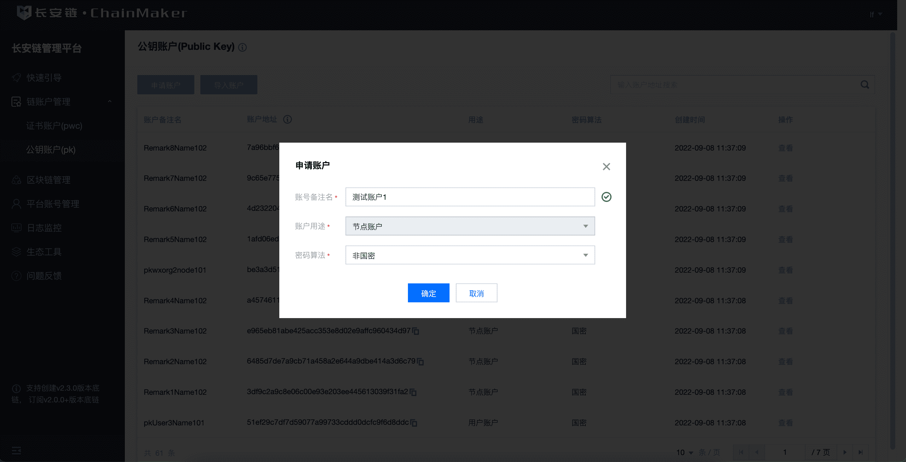

- 支持申请节点的公钥账户，以及用户的公钥账户。
- 支持国密和非国密两种算法。

#### 导入公钥账户
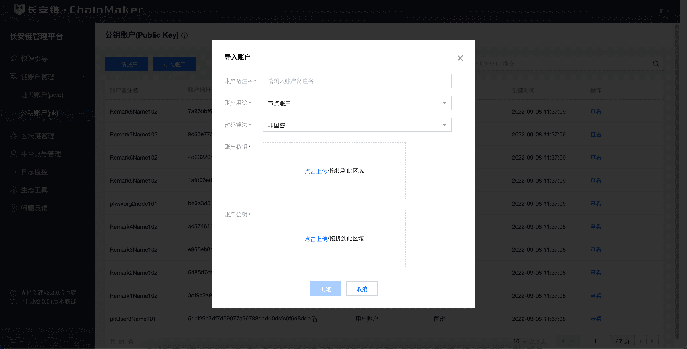

- 如果已经有公钥账户，可直接导入。

#### 下载公钥账户
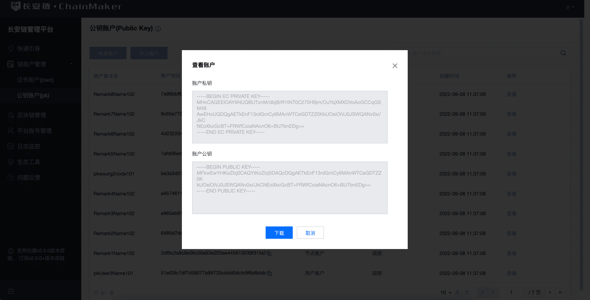

- 可以直接查看，并下载公钥账户，下载时会同时下载账户的私钥和公钥两个文件。

## 区块链管理

### 区块链概览

#### 查看区块链列表

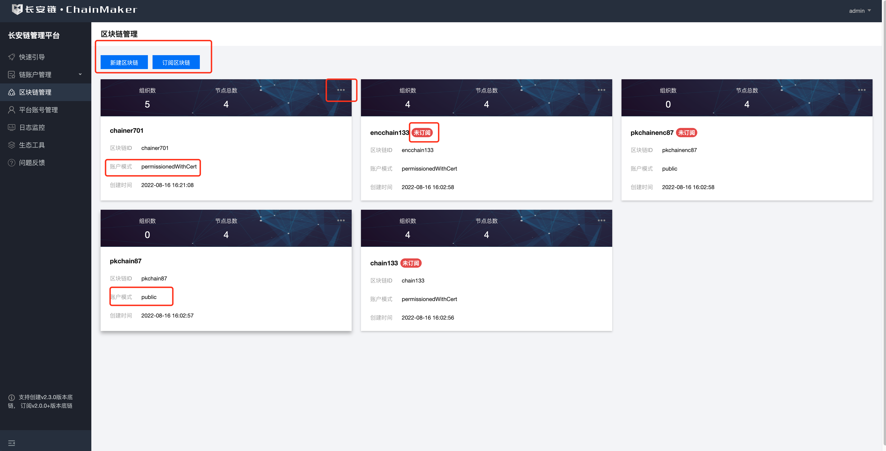

- 此处展示已跟本平台建立联系的区块链，其中如果点击未订阅的链，会跳转到下载链配置文件页面。如果已经订阅，则点击会进入链管理页面。
- 支持新增区块链配置文件，通过配置文件执行部署脚本可以快速部署链。
- 支持订阅已经部署运行的区块链。
- 如果所订阅的链的节点已经停止运行，或者获取不到链的信息，则为已失效。
- 如果订阅失效可重新订阅，并且支持删除已订阅的链。
- 支持暂停正在订阅中的链。

#### 新增区块链


- 链配置文件参数设定
  - 此处用于新增链配置文件，目前支持自定义链的id、名称、区块最大容量，出块间隔、交易过期时长，以及共识配置。
  - 目前支持配置`TBFT`、`RAFT`、`SOLO`、`MAXBFT`、`DPOS`等共识。
  - 申请链配置文件前，请先确保，所需的组织和节点证书已经申请/导入本管理平台。
  - 新增支持申请PK模式的链的配置文件。目前PK模式只支持选择`DPOS`和`TBFT`两种共识。
  - 如何部署PK模式长安链的教程可见[文档-启动PK模式的链](../instructions/启动PK模式的链.md)。
  - 支持根据需求选择你要部署的链所支持的虚拟机类型。
  - 支持单机部署和多机部署，请正确填写所要之后要部署区块链节点的机器所在的ip，并确保端口不冲突。
  - 如果开启报错日志采集服务，则在您部署到链运行过程中如果发生异常，管理台会收集报错日志，并汇总展示，方便定位问题。如果您开启了参与长安链改进计划，则采集到的报错日志，将自动上传给长安链官方团队，方便团队持续改进产品。

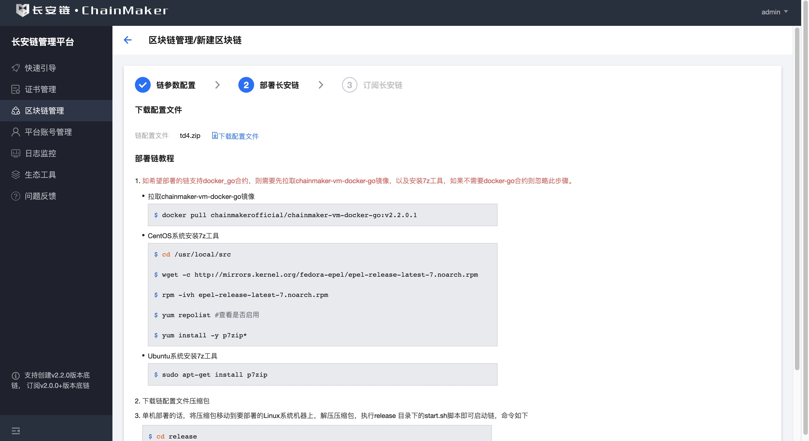

- 部署区块链

  - 设置完配置文件后，会自动生成链配置文件，并将配置文件和部署脚本以压缩包的形式提供，请下载压缩包文件。

  - 请将下载后的包，移动到要部署的机器上，执行`release`目录下的`start.sh`脚本即可启动链，命令如下：

  ```
  cd release
  ./start.sh
  ```

  - 在本地部署完链后，需要在管理台的订阅链模块，订阅所部署的链，以建立区块链与本管理台的联系。

#### 快速订阅链
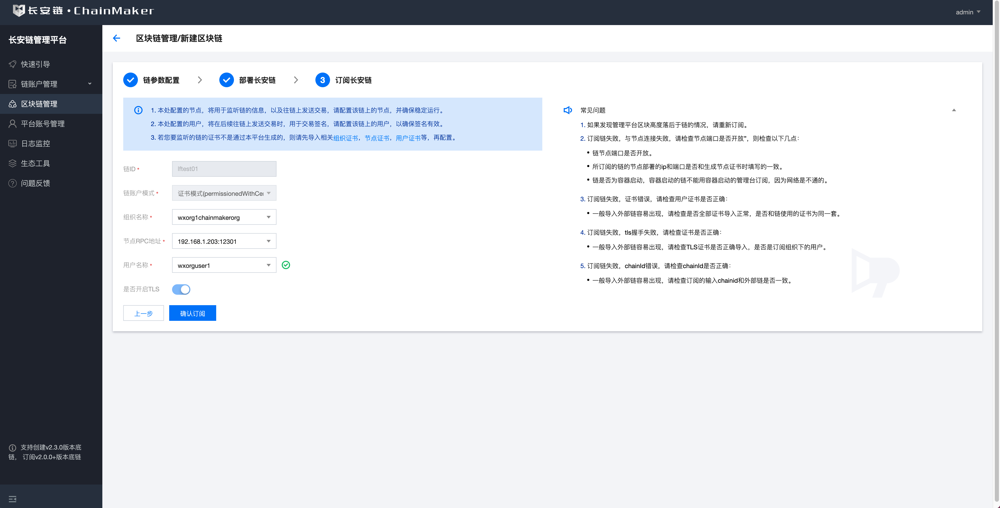

- 通过管理台生成配置文件并完成部署的长安链，可以在此处快速部署。


#### 订阅导入的区块链


- 如果您已经在服务器部署完区块链后，可在此处订阅区块链。
- 在后续的多签投票流程中，需要用到组织证书。
- 此处设置的节点，用于监听对应链的信息，以及通过该节点，往链上发送消息。
- 请填写所选择的订阅节点，所在的ip和rpc端口。
- 此处设置的用户，将在后续对链上发起交易请求时，用于签名。
- 故注意订阅前，请先确保所订阅的区块链的相关组织证书，节点证书，用户证书，均已导入本管理平台内。
- 新增订阅PK模式的链功能，订阅时请把链账户类型选成PK模式，输入对应的节点的RPC地址，并选择链的管理员进行订阅。

#### 修改区块链配置

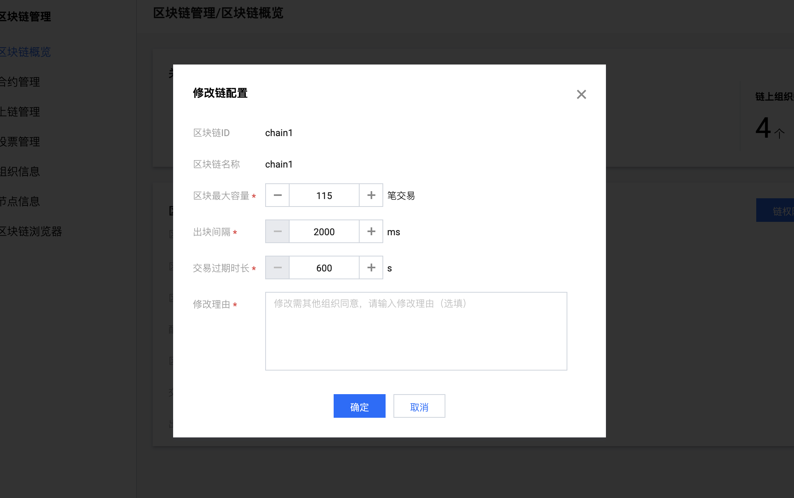

- 支持在链部署完成后，修改链的配置信息。

#### 链权限配置信息查询

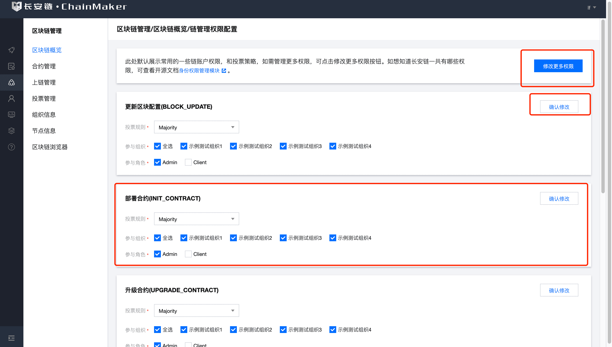

- 支持查看链相应的管理权限，包括所属权限的投票规则，以及参与方。
- 目前默认内置，更新区块配置，部署合约，升级合约，冻结合约，解冻合约权限，注销合约等权限。可直接修改相关权限的投票策略。
- 如需修改默认权限外的投票策略可点击修改更多权限按钮，添加相关的权限。长安链支持修改的权限列表请查看[身份和权限管理文档](../tech/身份和权限管理.md)

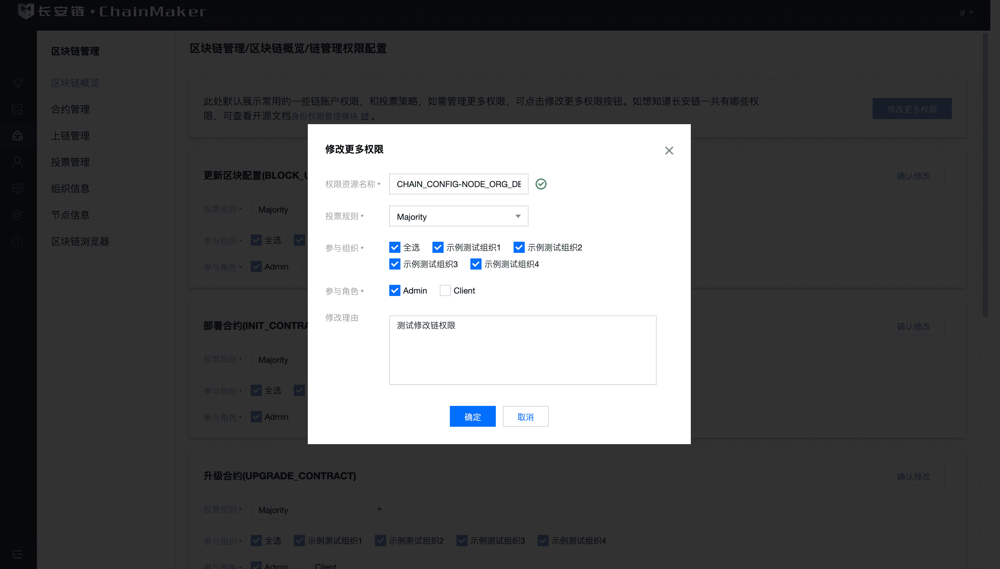

### 合约管理

#### 查看合约列表

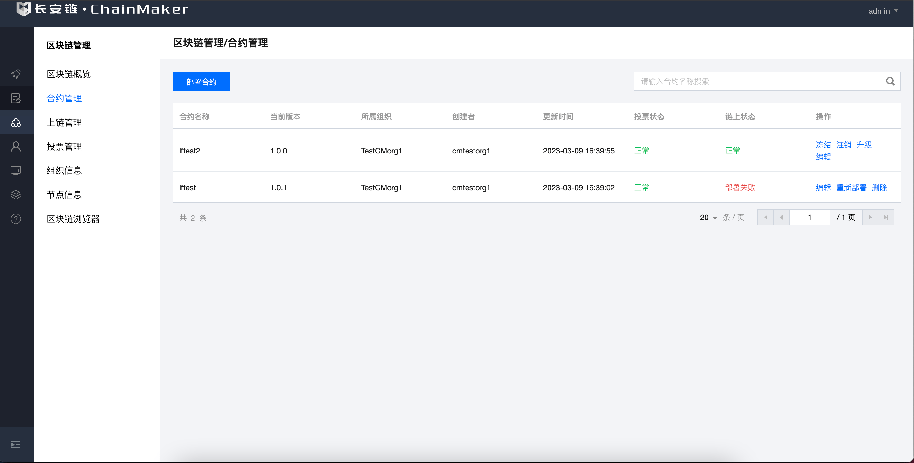

- 此处展示本区块链已经部署的合约信息。支持新增合约，升级合约，冻结合约，解冻合约，注销合约，编辑查看合约等。
- 支持删除未部署上链的合约

#### 部署合约


- 注意合约名称必须保证唯一。
- 目前支持的合约虚拟机类型为：`WASMER`、`EVM`、`WXVM`、`GASM`、`DOCKER_GO`。
- 需要上传编译后的合约文件。
- 如果在链权限配置处，设置了部署合约需要多签，则此处可填写部署理由，提交部署后，会生成投票议案，通过后会部署上链。
- 部署合约时，支持预设该合约的额外参数信息。
- 部署合约时，如果是Docker_go合约则需要确保您的链版本在v2.1.0以上，且开启docker-vm，详情可见开源文档使用docker_go进行智能合约开发模块。
- 部署合约时，如果是EVM合约会根据abi文件自动解析出合约调用方法，其他类型的合约支持手动录入调用方法，以便后面引用。
- 合约调用方法为选填项，此处录入只是方便管理台其他地方可以引用，就算不录入也不影响直接调用合约。
- 发起部署合约后，将会用订阅链时所选择的用户来构建交易，并进行交易签名。

#### 升级合约

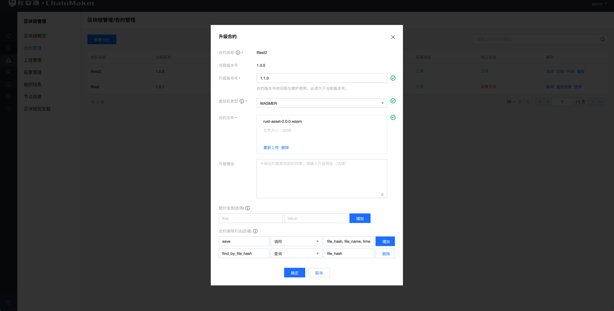

- 升级时，所填写的合约版本号，必须大于升级前的版本号。升级完成后，原合约将无法使用。
- 其余情况与部署合约类似。

#### 编辑合约

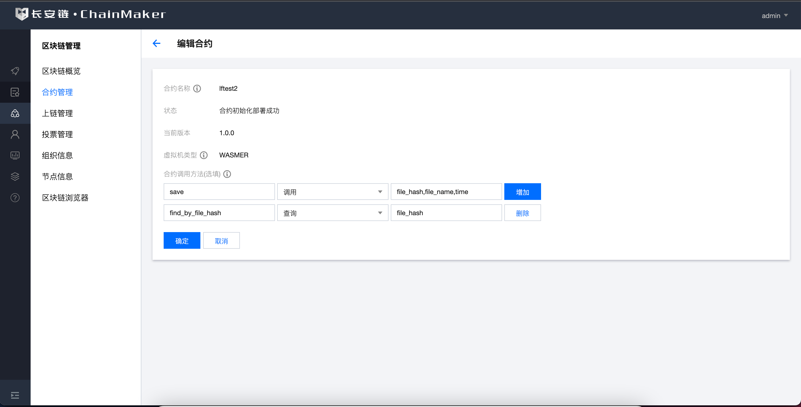

- 支持编辑合约调用方法，此处编辑的合约方法只是为链管理台上链管理功能处引用方便，并不影响链上合约代码。
- 请正确的填写合约调用方法，如果一个方法涉及多个入参，可以用逗号分隔。

#### 其他操作

- 处于正常状态下的合约，可以进行冻结操作。冻结行为需要经过多签投票后，才能执行。冻结后合约将暂时无法使用。
- 处于冻结状态下的合约，可以进行解冻操作，解冻行为需要经过多签投票后，才能执行。解冻后合约将恢复正常使用。
- 如果不需要使用该合约，可以将该合约注销，注销行为需要经过多签投票后，才能执行。注销后合约将永久无法使用。

### 上链管理

#### 查看已上链记录列表

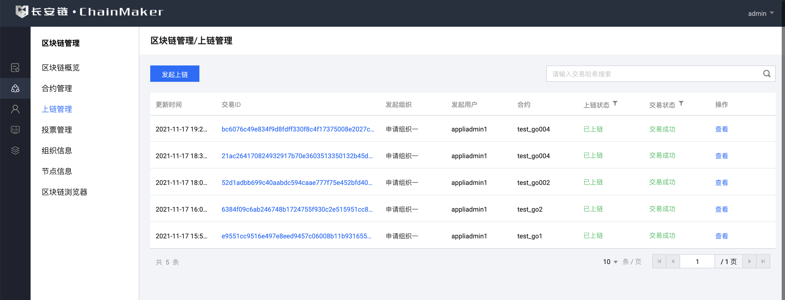

- 此处展示上链记录列表，可以继续发起上链交易，或者查看已经上链的交易详情。

#### 发起上链


- EVM合约通过解析abi文件可以自动获取合约调用方法，其他类型的合约目前需要手动录入调用方法。
- 此处选择链上合约后，如果在合约管理处已经录入过合约方法，则将自动引入，填写相关的value值即可发起合约调用（上链）操作。
- 同时支持手动输入调用方法，并填写相应的入参，发起合约调用（上链）操作。
- 发起上链请求后，将会用订阅链时所选择的用户来构建交易，并进行交易签名。

### 投票管理

#### 查看投票列表

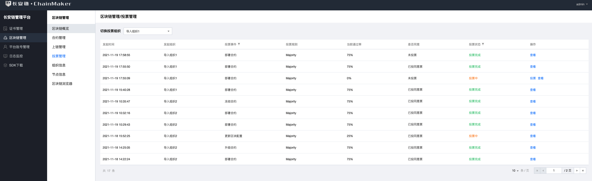

- 此处展示需要投票的投票议案，包括已投票议案的和未投票的议案。

- 长安链管理台的用户大多是自己部署了一条私有链进行测试，为了测试多组织投票的场景，此处模拟了投票的功能，用户可切换组织进行投票。

- 用户可在链权限配置模块，查看并修改投票事件和投票策略。比如将部署合约的投票策略由需要大多数组织同意改为任一组织同意即可部署等。

- 此处可通过切换组织，查看对应组织的投票情况。

#### 参与投票

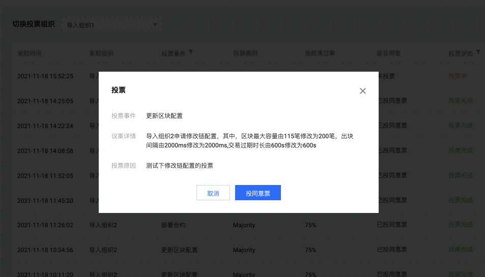

- 点击投票，弹出弹窗，查看投票议案的具体内容，并决定是否投票通过。
- 投票通过后，会检查是否满足链权限管理处的投票条件，如果满足的话，则往链上发起交易。

#### 查看投票详情

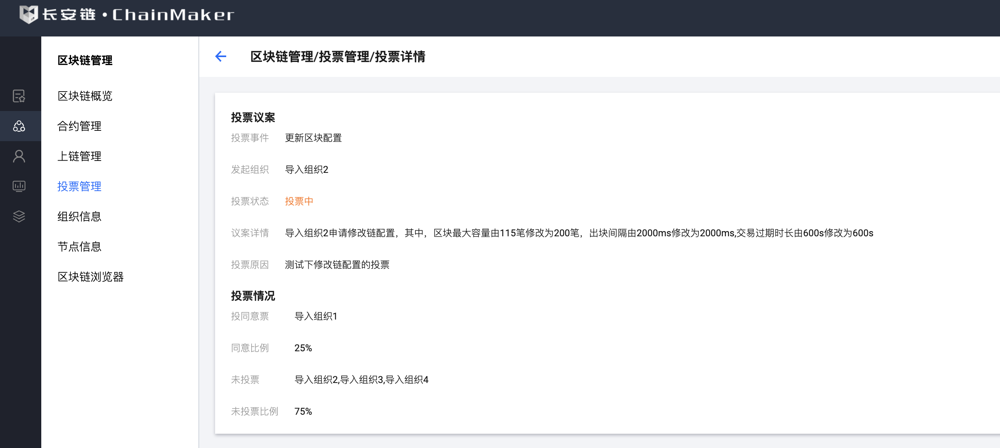

- 支持查看投票详情，查看哪些组织投票，哪些还尚未投票。

### 组织信息

#### 查看本链参与组织列表

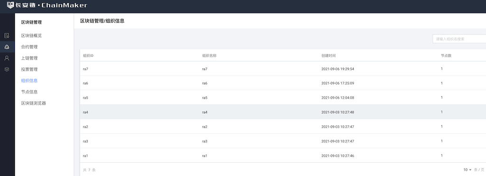

- 查看该条链的参与组织

### 节点信息

#### 查看本链参与节点列表

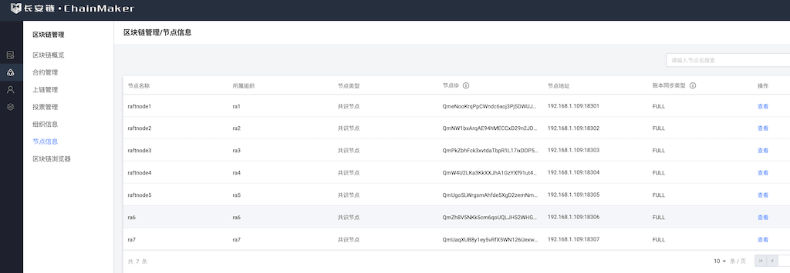

- 查看该条区块链的参与节点。

#### 查看节点详情

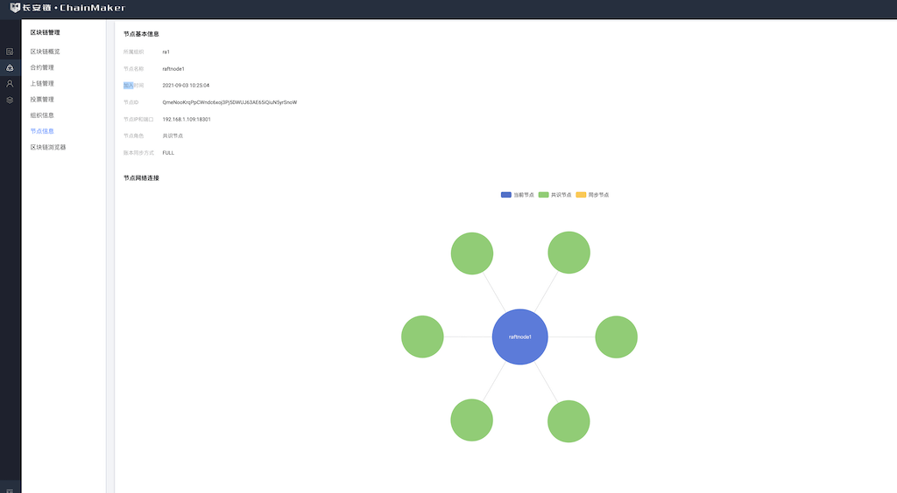

- 查看节点详情，以及节点的与其他节点的链接情况。

### 区块链浏览器

#### 浏览器整体概览


- 此处展示区块链的全部区块信息，交易信息和合约信息

- 支持通过区块高度，区块哈希，交易哈希，合约名称等搜索

#### 查看区块详情

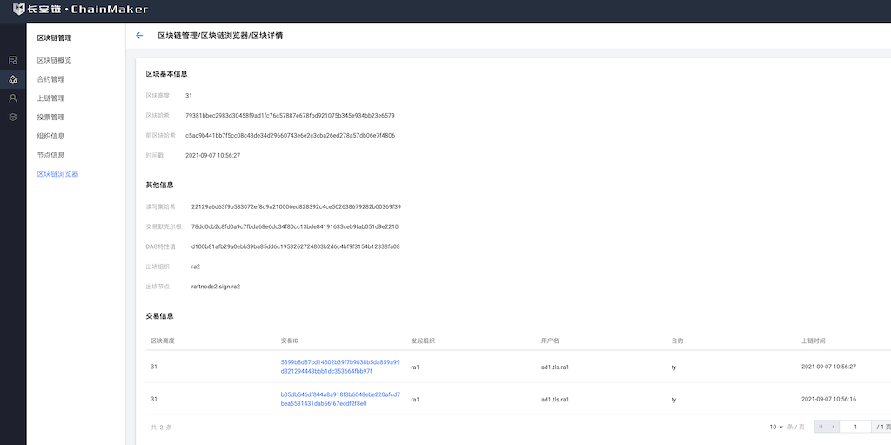

- 支持查看某一区块的具体信息，包括区块哈希，读写集哈希，DAG信息，以及本区块内的交易信息。


#### 查看交易详情


- 支持查看某一条交易详情，包括交易的所属区块信息，交易发起人信息，交易所调用的合约执行情况。


#### 查看合约详情

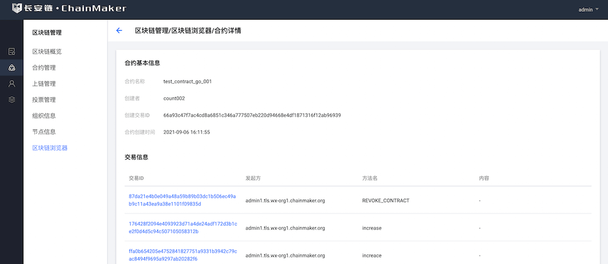

- 支持查看合约信息，包括合约的创建者信息，以及合约调用的历史交易记录。
- 暂不支持查看合约源码。

## 日志监控

### 查看日志监控信息


- 如果您在部署链的时候，选择开启日志监控，则当该链在运行过程中出现异常，日志监控服务会自动采集错误日志，并在此处展示。

- 管理台每隔一段时间会从监控服务处获取报错日志信息，您也可以点击右上角刷新按钮手动拉取最新数据。

- 您也可以将错误日志信息下载到本地查看，或者上传给长安链官方，方便官方持续优化产品。

- 如果开启自动上报，则日志监控服务采集到的错误日志信息会自动发送给长安链官方，官方会根据报错情况持续优化长安链产品。

## 生态工具

### 查看开源文档生态工具

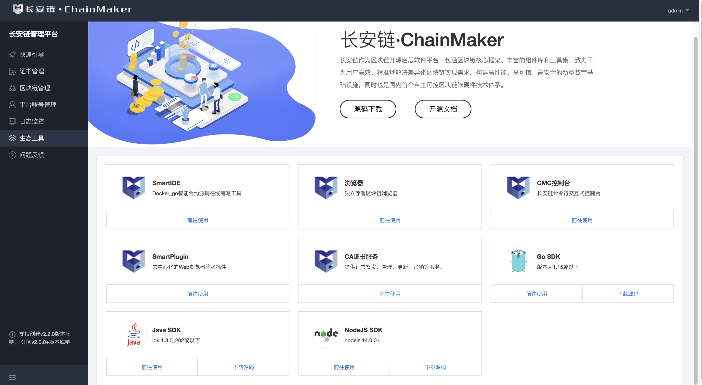

- 此处提供开源文档，长安链源码，以及各生态工具的下载入口。

## 视频教程

<a href="https://www.bilibili.com/video/BV1Dr4y1W7MP/" target="_blank" title="点击跳转至播放页面" ></a>

视频地址: <a href="https://www.bilibili.com/video/BV1Dr4y1W7MP/"  target="_blank">  使用管理台部署长安链V2.0 </a>