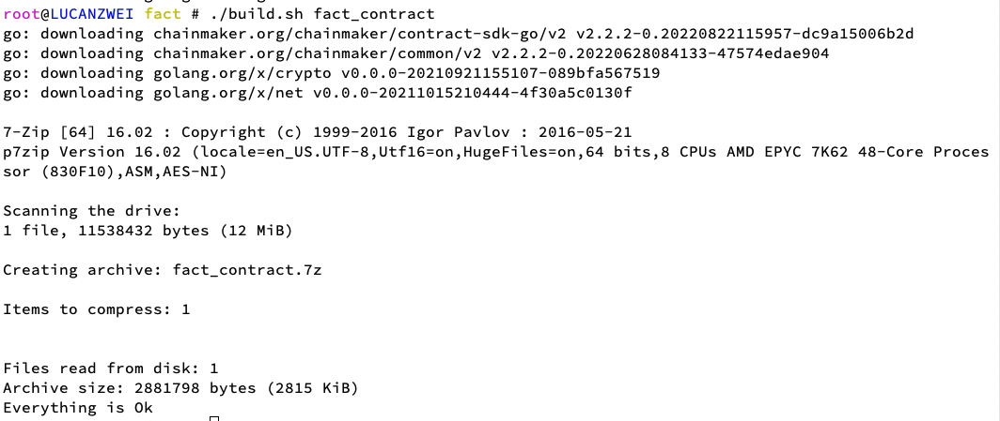

# 使用Golang进行智能合约开发
<font color=red>注意：本文档描述的智能合约编写方法适用于2.3.0以上的长安链，如需查看2.x.x版本的智能合约编写文档，请切换到[2.x.x版本的文档](https://docs.chainmaker.org.cn/v2.2.1/html/operation/%E6%99%BA%E8%83%BD%E5%90%88%E7%BA%A6.html#docker-go)。</font>

读者对象：本章节主要描述使用Golang进行ChainMaker合约编写的方法，主要面向于使用Golang进行ChainMaker的合约开发的开发者。


**概览**
1、运行时虚拟机类型（runtime_type）：DOCKER_GO
2、介绍了环境依赖
3、介绍了开发方式及sdk接口
4、提供了一个示例合约

## 环境依赖

1. 操作系统

	目前仅支持在Linux系统下部署和运行 Docker VM，合约的编译也必须在Linux环境下执行。如果需要在其他系统环境下编译合约，请参考Golang的交叉编译修改编译命令。

2. 软件依赖

	推荐使用Goland 或 vscode等IDE编写和编译Golang合约。

	编译后的合约需要经过7zip压缩形成最终的合约文件，7zip的安装请参看[7zip官网](https://sparanoid.com/lab/7z/)

3. 长安链环境准备

	准备一条支持Docker_VM的长安链，以及长安链CMC工具，用于将写编写好的合约，部署到链上进行测试。相关安装教程请详见：

	- [部署支持Docker_VM的长安链教程。](./启动支持Docker_VM的链.md)
	- [部署长安链CMC工具的教程。](../dev/命令行工具.md)


## 编写Golang合约

### 通过go.mod引用合约SDK

ChainMaker官方Golang合约SDK支持通过go.mod的方式引用，可直接使用go get引用，示例如下：

```shell
   $ go get chainmaker.org/chainmaker/contract-sdk-go/v2@v2.3.9
```


执行完成后，即可参考下文的编写合约注意事项，调用合约sdk的方法，编写合约。


### 编写合约注意事项

1. 代码入口包名必须为`main`

2. 代码入口

```go
package main

// sdk代码中，有且仅有一个main()方法
func main() {  
  // main()方法中，下面的代码为必须代码，不建议修改main()方法当中的代码
  // 其中，TestContract为用户实现合约的具体名称
err := sandbox.Start(new(FactContract))
if err != nil {
	log.Fatal(err)
}
}
```

3. 合约必要代码

```go
// 合约结构体，合约名称需要写入main()方法当中
type FactContract struct {
}

// 合约必须实现下面两个方法：
// InitContract() protogo.Response
// UpgradeContract() protogo.Response
// InvokeContract(method string) protogo.Response

// 用于合约的部署
// @return: 	合约返回结果，包括Success和Error
func (f *FactContract) InitContract() protogo.Response {
return sdk.Success([]byte("Init contract success"))
}

// 用于合约的升级
// @return: 	合约返回结果，包括Success和Error
func (f *FactContract) UpgradeContract() protogo.Response {
return sdk.Success([]byte("Upgrade contract success"))
}

// 用于合约的调用
// @param method: 交易请求调用的方法
// @return: 	合约返回结果，包括Success和Error
func (f *FactContract) InvokeContract(method string) protogo.Response {
	switch method {
	case "save":
		return f.save()
	case "findByFileHash":
		return f.findByFileHash()
	default:
		return sdk.Error("invalid method")
	}
}
```


### 合约SDK接口描述

长安链提供golang合约与链交互的相关接口，写合约时可直接导入包，并进行引用，具体信息可参考文章末尾"接口描述章节"。


### 编译合约
当合约编写完成后，则需要编译合约，具体教程如下

#### 使用脚本编译合约
1. 在合约工程中添加编译脚本build.sh搭建编译环境。

```shell
#!/bin/bash

contractName=$1
if  [[ ! -n $contractName ]] ;then
	echo "contractName is empty. use as: ./build.sh contractName"
	exit 1
fi

go build -ldflags="-s -w" -o $contractName

7z a $contractName $contractName
rm -f $contractName

```

2. 编译撰写好的智能合约。

	其中ContractName请替换成需要安装的合约名称 

	```shell
	./build.sh ContractName
	```

	编译成功，如下图所示：

	

#### 手动编译合约

手动编译合约时，首先使用golang编译成可执行文件，再对编译后的可执行文件进行7zip压缩，压缩后的".7z"文件为合约文件。

参考如下编译命令：

```shell
go build -ldflags="-s -w" -o contract_name

7z a contract_name contract_name
```

需要注意的是：合约的执行环境为linux环境，需要保证是在Linux环境下编译。如果在其他系统环境（mac或windows）下编译合约，请参考Golang的交叉编译修改go build命令。


### 部署调用合约

编译完成后，将得到一个`.7z`格式的合约文件，可将之部署到指定到长安链上，完成合约部署。
部署合约的使用教程可详见：[部署示例合约](./部署示例合约.md)。


## 示例合约使用演示

### 示例代码说明

ChainMaker官方提供了通过go.mod引用合约SDK进行合约开发的示例合约工程。

以存证合约为例，可以直接下载下编译存证合约，过程如下：
```shell
$ git clone  --depth=1 https://git.chainmaker.org.cn/contracts/contracts-go.git
$ cd contracts-go/fact
$ ./build.sh fact
...
```

更多合约示例可以直接查看仓库[contracts-go](https://git.chainmaker.org.cn/contracts/contracts-go)


### 存证合约示例源码展示
参考[存证合约示例源码](https://git.chainmaker.org.cn/chainmaker/contract-sdk-go/-/blob/v2.3.9/demo/contract_fact.go)

### 部署调用示例合约

#### 使用cmc工具部署调用合约

```shell
## 创建合约
./cmc client contract user create \
--contract-name=fact \
--runtime-type=DOCKER_GO \
--byte-code-path=./testdata/claim-docker-go-demo/docker-fact.7z \
--version=1.0 \
--sdk-conf-path=./testdata/sdk_config.yml \
--admin-key-file-paths=./testdata/crypto-config/wx-org1.chainmaker.org/user/admin1/admin1.tls.key,./testdata/crypto-config/wx-org2.chainmaker.org/user/admin1/admin1.tls.key,./testdata/crypto-config/wx-org3.chainmaker.org/user/admin1/admin1.tls.key,./testdata/crypto-config/wx-org4.chainmaker.org/user/admin1/admin1.tls.key \
--admin-crt-file-paths=./testdata/crypto-config/wx-org1.chainmaker.org/user/admin1/admin1.tls.crt,./testdata/crypto-config/wx-org2.chainmaker.org/user/admin1/admin1.tls.crt,./testdata/crypto-config/wx-org3.chainmaker.org/user/admin1/admin1.tls.crt,./testdata/crypto-config/wx-org4.chainmaker.org/user/admin1/admin1.tls.crt \
--sync-result=true \
--params="{}"

## 调用合约
./cmc client contract user invoke \
--contract-name=fact \
--method=save \
--sdk-conf-path=./testdata/sdk_config.yml \
--params="{\"file_name\":\"name007\",\"file_hash\":\"ab3456df5799b87c77e7f88\",\"time\":\"6543234\"}" \
--sync-result=true

## 查询合约
./cmc client contract user get \
--contract-name=fact \
--method=findByFileHash \
--sdk-conf-path=./testdata/sdk_config.yml \
--params="{\"file_hash\":\"ab3456df5799b87c77e7f88\"}"
```

#### 使用Go SDK部署调用合约

```go
// 创建合约
func testUserContractCreate(client *sdk.ChainClient, withSyncResult bool, isIgnoreSameContract bool, usernames ...string) {

   resp, err := createUserContract(client, factContractName, factVersion, factByteCodePath,
	   common.RuntimeType_DOCKER_GO, []*common.KeyValuePair{}, withSyncResult, usernames...)
   if !isIgnoreSameContract {
	   if err != nil {
		   log.Fatalln(err)
	   }
   }

   fmt.Printf("CREATE claim contract resp: %+v\n", resp)
}

func createUserContract(client *sdk.ChainClient, contractName, version, byteCodePath string, runtime common.RuntimeType, kvs []*common.KeyValuePair, withSyncResult bool, usernames ...string) (*common.TxResponse, error) {

   payload, err := client.CreateContractCreatePayload(contractName, version, byteCodePath, runtime, kvs)
   if err != nil {
	   return nil, err
   }

   endorsers, err := examples.GetEndorsers(payload, usernames...)
   if err != nil {
	   return nil, err
   }

   resp, err := client.SendContractManageRequest(payload, endorsers, createContractTimeout, withSyncResult)
   if err != nil {
	   return nil, err
   }

   err = examples.CheckProposalRequestResp(resp, true)
   if err != nil {
	   return nil, err
   }

   return resp, nil
}

// 调用合约
// 调用或者查询合约时，method参数请设置为 invoke_contract，此方法会调用合约的InvokeContract方法，再通过参数获得具体方法
func testUserContractInvoke(client *sdk.ChainClient, method string, withSyncResult bool) (string, error) {

   curTime := strconv.FormatInt(time.Now().Unix(), 10)

   fileHash := uuid.GetUUID()
   kvs := []*common.KeyValuePair{
	   {
		   Key: "method",
		   Value: []byte("save"),
	   },
	   {
		   Key:   "time",
		   Value: []byte(curTime),
	   },
	   {
		   Key:   "file_hash",
		   Value: []byte(fileHash),
	   },
	   {
		   Key:   "file_name",
		   Value: []byte(fmt.Sprintf("file_%s", curTime)),
	   },
   }

   err := invokeUserContract(client, factContractName, method, "", kvs, withSyncResult)
   if err != nil {
	   return "", err
   }

   return fileHash, nil
}

func invokeUserContract(client *sdk.ChainClient, contractName, method, txId string, kvs []*common.KeyValuePair, withSyncResult bool) error {

   resp, err := client.InvokeContract(contractName, method, txId, kvs, -1, withSyncResult)
   if err != nil {
	   return err
   }

   if resp.Code != common.TxStatusCode_SUCCESS {
	   return fmt.Errorf("invoke contract failed, [code:%d]/[msg:%s]\n", resp.Code, resp.Message)
   }

   if !withSyncResult {
	   fmt.Printf("invoke contract success, resp: [code:%d]/[msg:%s]/[txId:%s]\n", resp.Code, resp.Message, resp.ContractResult.Result)
   } else {
	   fmt.Printf("invoke contract success, resp: [code:%d]/[msg:%s]/[contractResult:%s]\n", resp.Code, resp.Message, resp.ContractResult)
   }

   return nil
}
```

## 接口描述

用户与链交互接口，参考：[Golang合约接口说明](https://git.chainmaker.org.cn/chainmaker/contract-sdk-go/-/blob/v2.3.9/sdk/sdk_interface.go)