# 通过SmartIDE编写Go智能合约

## SmartIDE产品使用介绍

### SmartIDE背景介绍
目前市面上主流的后端开发语言还是以Java、Go等语种为主，而区块链行业智能合约的开发语言的以Solidity居多，对于传统语种开发者想转型做合约开发而言存在一定的语言门槛。

为了降低使用门槛，使区块链出圈，团队致力打造Go语言合约相关生态，考虑到目前市面上尚无专门为Go语言服务的合约IDE产品，故我们自行研发长安链合约IDE， Chainmaker SmartEditor。

- 该产品目前免费对外提供服务，前往使用：[https://ide.chainmaker.org.cn/](https://ide.chainmaker.org.cn/)
- 可使用长安链官网账号，或者开源gitlab仓库账户直接登录。

### 整体业务流程

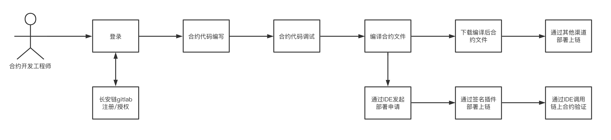


### 注册/登录


#### 注册

长安链合约IDE （Chainmaker SmartEditor）使用长安链官网账号或者GitLab账户直接登录，如果您没注册，可点击注册按钮跳转到 [注册页面](https://login.chainmaker.org.cn/auth/realms/BABEC/login-actions/registration?client_id=app&tab_id=xP7W3MhVCRA) 完成注册。

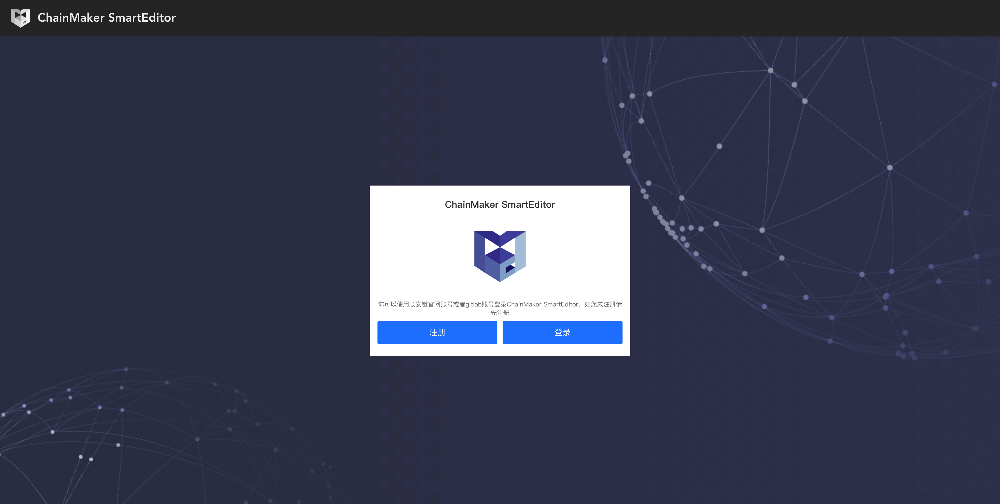

#### 使用长安链官网账号登录

如果您已经有长安链官网账号，点击登录跳转到长安链官网进行登录授权。
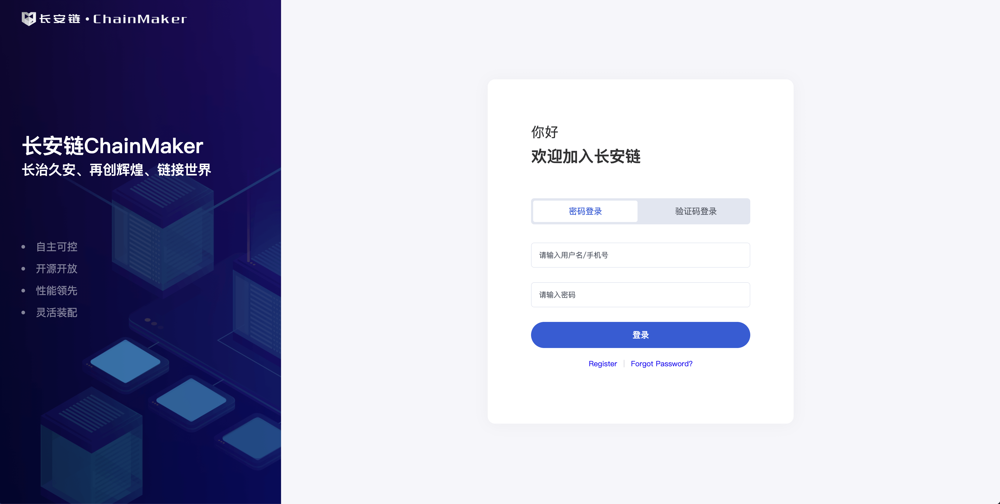

#### 使用gitlab仓库账号登录

如果您已经有长安链GitLab账户，点击登录按钮可跳转到长安链GitLab进行授权登录。

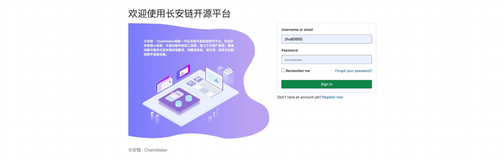

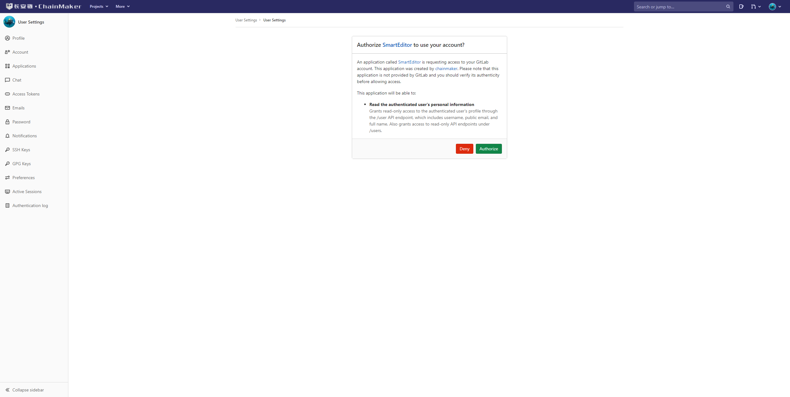

* 如果您已经授权过，则下次将免授权登录。
* 您如果需要替换IDE的登录账户，请先替换长安链GitLab账号，再重新登录。


### SmartIDE界面概述

合约IDE是一个在线合约编辑器，使用合约IDE可以方便、快速的写合约，调试合约，部署合约，调用合约，进行合约漏洞审查等。

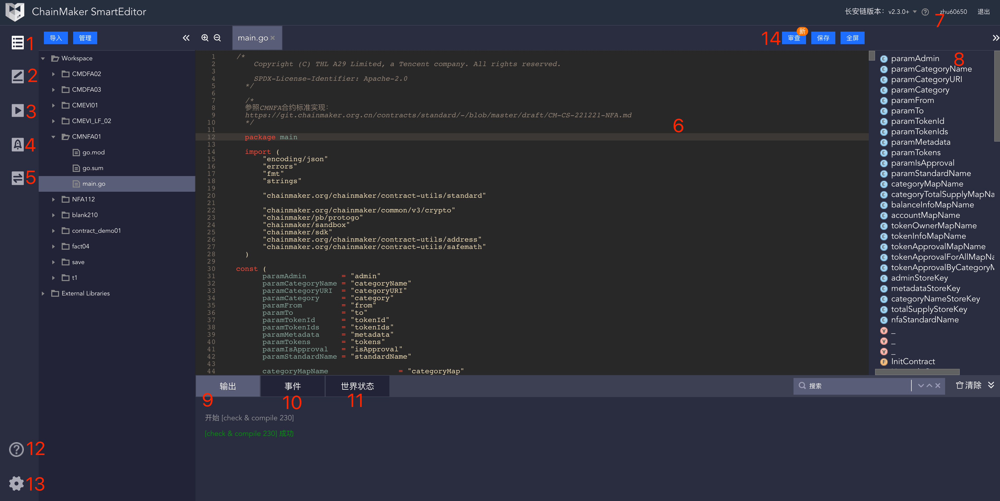

**IDE功能介绍**：

1. 文件目录：在 `workspace` 下创建的每一个目录都是一个单独的合约项目。可以创建多个合约项目。
2. 合约调试：模拟执行合约。
   1. 合约执行过程中打印的日志会在 `控制台->输出` 中展示。
   2. 合约执行过程中发送的事件会在`控制台->事件` 中展示。
   3. 合约执行的世界状态会在 `控制台->世界状态` 中展示。
   4. 合约执行结果会在执行结果下面显示。
3. 合约编译：编译合约，生成要部署的合约文件。
4. 合约部署：调用插件，通过插件部署合约到链上。
5. 合约调用：调用插件，通过插件调用链上的合约。
6. 代码编辑区：编写合约代码的地方。
7. 用户信息：用户名退出登录。
8. 代码大纲：显示代码整体结构，点击可快速跳转。
9. 控制台-输出：输出合约编译，合约调用过程的日志信息。
10. 控制台-事件：展示模拟执行过程产生的事件。
11. 控制台-世界状态：展示模拟执行时链的世界状态。
12. 帮助文档：点击跳转到帮助页面。
13. 设置：个性化设置。
14. 合约安全漏洞检测：可用于检查合约代码撰写是否规范，是否有安全漏洞


### 全局快捷键说明

#### 公用热键
- ctrl + q ：关闭当前编译器
- shift + left ：向左选中
- shift + right ：向左选中
- shift + up ：向上方选择一行
- shift + down ：向下方选择一行
- pageup ：向上翻页
- pagedown : 向下翻页
- ctrl + e ： 光标移至最右边
- ctrl + k ： 删除光标右侧本行内容
- ctrl + \ : 自动补全

#### mac系统
- command + 鼠标左键：跳转到函数方法详情
- command + shift + f ：格式化
- command + c：复制选中内容
- command+ v：粘贴所复制到内容
- command + f：查找替换功能
- command + s：格式化并保存当前编译器文件
- command + i: 选中当前所在词汇
- command + shift + k: 删除当前行
- command + [: 缩小选中行缩进
- command + ]: 放大选中行缩进
- command + /: 注释选中行
- command + left: 光标聚焦行首
- command + right: 光标聚焦行尾
- command + up: 光标聚焦文本首
- command + down: 光标聚焦文本尾
- command + shift + left ：向左选中本行
- command + shift + right ：向右选中本行
- command + shift + up ：向上方选择文本首
- command + shift + down ：向下方选择文本尾
- command + shift + f ：代码格式化
- command + shift + s ：保存全部
- ctrl+d： 向右删除
- ctrl+h： 向左删除
- ctrl+t： 光标文本后移

#### windows系统
- ctrl + 鼠标左键：跳转到函数方法详情
- ctrl + shift + f ：格式化
- ctrl + c：复制选中内容
- ctrl+ v：粘贴所复制到内容
- ctrl + f：查找替换功能
- ctrl + s：格式化并保存当前编译器文件
- ctrl + i: 选中当前所在词汇
- ctrl + shift + k: 删除当前行
- ctrl + [: 缩小选中行缩进
- ctrl + ]: 放大选中行缩进
- ctrl + /: 注释选中行
- ctrl + left: 光标分词左移
- ctrl + right: 光标分词右移
- ctrl + up: 光标聚焦文本首
- ctrl + down: 光标聚焦文本尾
- (ctrl或alt) + shift + left ：向左分词选中
- (ctrl或alt) + shift + right ：向右分词选中
- ctrl + shift + up ：向上方选择到文本首
- ctrl + shift + down ：向下方选择文本尾
- ctrl + shift + f ：代码格式化
- ctrl + shift + s ：保存全部
- ctrl + d： 选中当前分词
- ctrl + h： 向左删除


### 合约编写

#### 合约项目工程目录

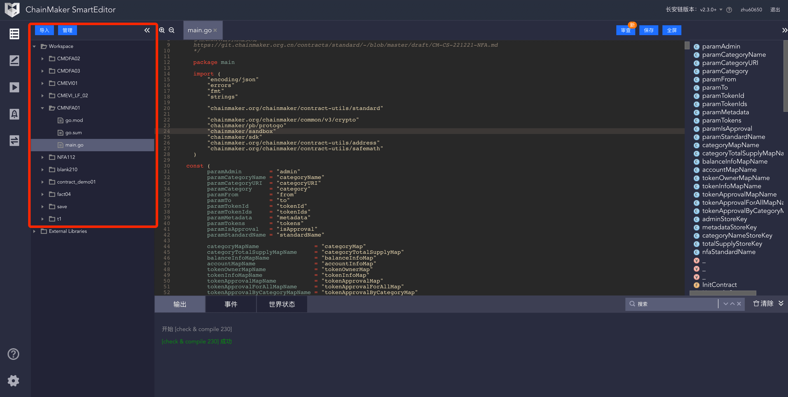

* 每个用户都有一个workspace空间。首次使用IDE时，系统会默认创建一个Demo存证合约，供开发者体验。
* 您也可以在workspace下创建自己的合约项目，一个账户支持创建多个合约项目，并以一个一级文件夹为基准区分合约工程。
* 支持对文件进行的常规操作，如新增、删除、导出、重命名等。
* 一个合约工程可以由多个文件构成，支持跨文件调用函数方法。
* 如果您已经有现成的合约文件，支持批量导入IDE内，单次最多可导入20个文件，每个文件大小不超过2M。如果文件实在太大无法导入，可以选择直接复制代码粘贴进来。

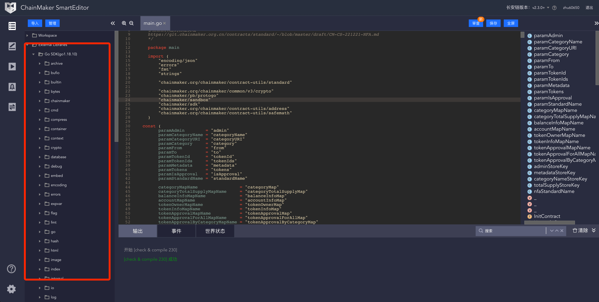

* 此处展示 Go SDK 和依赖的第三方库的源码。可在代码编写区通过快捷键（command + 鼠标左键）跳转到源码，查看源码详情。


#### 合约代码编写

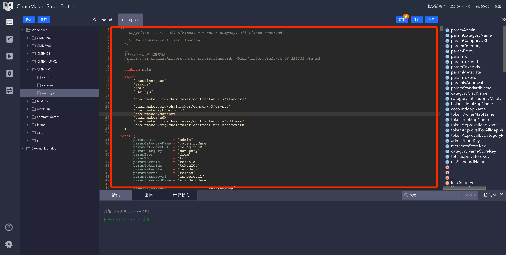

* 通过左上角的放大、缩小图标，快速改变代码编写区的的文字字体大小和行高。
* 通过右上角的展开/收齐图标可以展开/收齐代码编写区。
* 支持代码高亮、支持语义分析，语法检测、代码自动补全。
* 支持代码格式化。
* 支持同合约工程跨文件调用函数方法。
* 支持自动保存功能，每隔一段时间会自动保存所撰写的合约代码。


### 合约调试

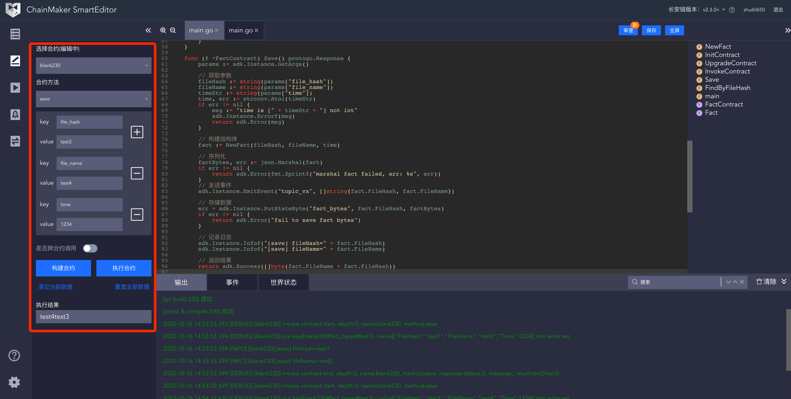

* 进行合约调试和部署时，请注意先保存合约确保调试部署的是最新的合约代码。
* 合约代码编写完后，会自动解析出代码里的的方法列表，支持在IDE内调用所编写的合约方法进行调试。
* 调试前需要先构建合约。
* 如果需要进行跨合约调用，则需要选择所要跨的合约，一并进行构建，构建成功后，才能调试。
* 调试合约过程中，在底部会展示相关的执行日志，并记录所产生的合约事件 ，以及合约状态。
* 支持引用已有的状态值进行二次调试。

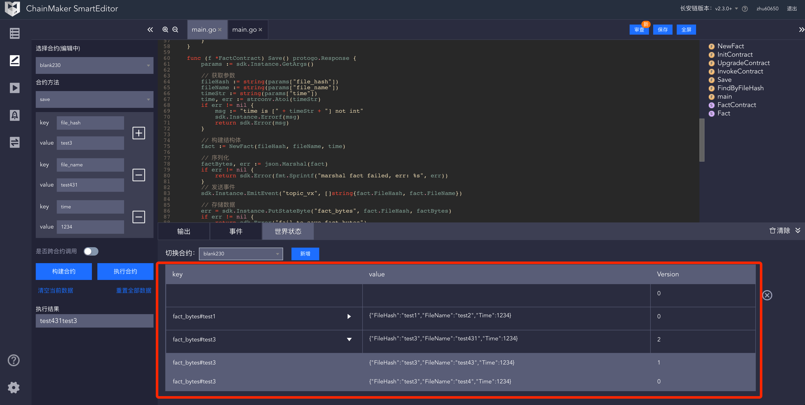

* 为方便调试，支持手动增删改合约世界状态的key和value。
* 双击某一行，可展开/收起合约世界状态的历史迭代器，其中历史记录只能查看，不能修改。
* 为方便查看跨合约调用的合约状态变更情况，支持在世界状态处切换合约。

### 合约安全漏洞审查

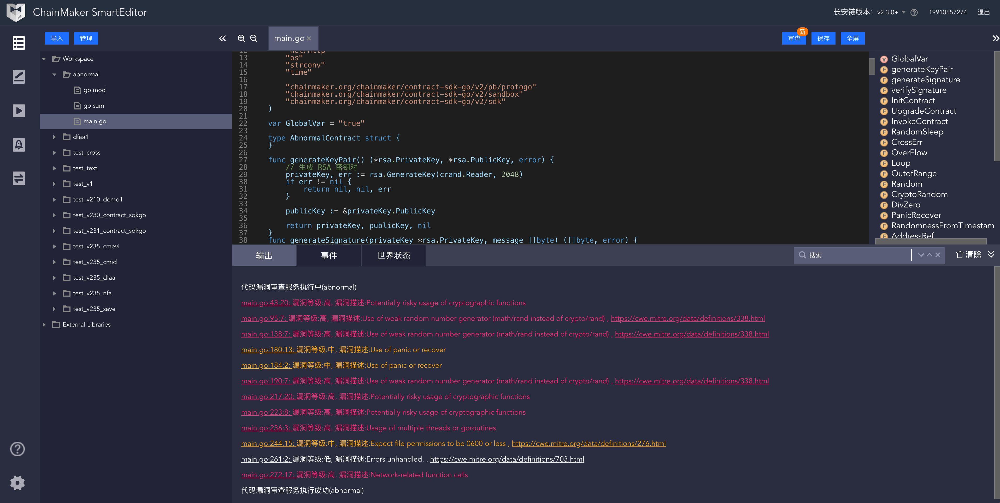

- 合约撰写完成后，可通过合约安全漏洞审查工具对合约源码进行审查，看看合约撰写是否符合相关标准规范，是否存在安全漏洞。

### 合约编译及导出

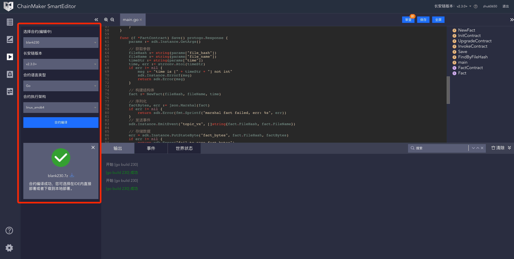

* 目前IDE所支持的合约语言为Go语言、支持的虚拟机类型为Docker Go虚拟机，支持的长安链版本为 V2.1.0+，以及长安链2.3.0+。
* 合约编译完成后，可直接在IDE内通过Web插件部署到链上，也可将编译后到文件下载到本地自行部署。

### 部署合约到链上

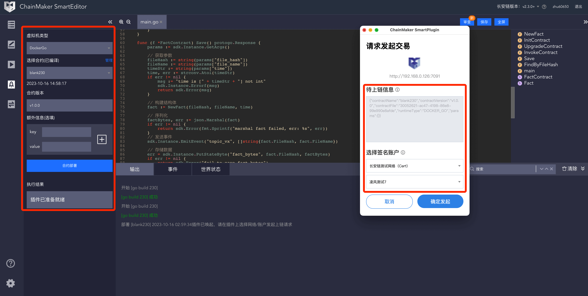

* 可将编译好的合约，通过Web3插件直接部署到指定的链上。若您部署合约时，未安装插件，请根据提示安装Web3插件后，再部署合约。
* 选择合约时，请留意最新的编译时间，以免选错合约。
* 请留意合约名称+合约版本号必须唯一，不能与链上已有的合约有冲突。
* 目前暂不支持升级合约。
* 如果所要部署的合约，需要填一些额外信息，可在部署时一并写入。

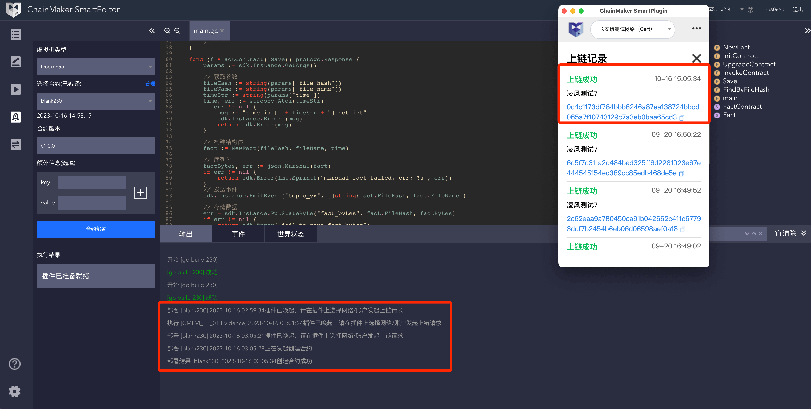

* 在Web插件上，需要预先链接区块链和添加上链账户信息，相关操作说明可参考 [Web插件使用说明文档](https://docs.chainmaker.org.cn/dev/%E9%95%BF%E5%AE%89%E9%93%BEWEB%E6%8F%92%E4%BB%B6-SmartPlugin.html)
* 通过IDE唤起Web3插件后，选择该合约要部署的链，以及要使用的上链账号，并进行签名，发起上链交易。上链过程，视区块网络情况而定，可能需要一定的时间，请耐心等待几秒钟。
* 部署成功后，可在Web3插件的上链记录里找到相关的上链记录，以及交易哈希，如需查看更多信息，可复制交易哈希到区块链浏览器内查看交易详情。

### 调用链上合约

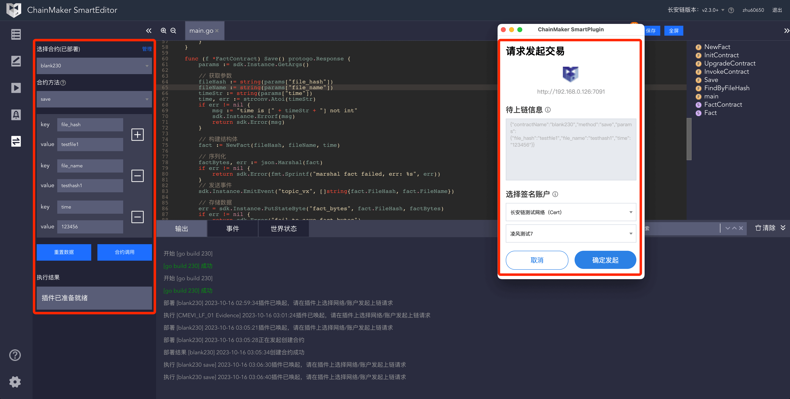

* 当部署合约成功后，可以通过IDE进行合约调用，以验证合约是否生效。
* 选择合约方法，输入参数后，点击合约调用，将唤起Web3插件，并在插件上选择相应的链账号，进行调用。
* 上链过程，视区块网络情况而定，可能需要一定的时间，请耐心等待几秒钟。


* 调用成功后，可在Web3插件的上链记录里找到相关的上链记录，以及交易哈希，如需查看更多信息，可复制交易哈希到区块链浏览器内查看交易详情。


## 使用合约SDK写一个简单合约

### SDK 简介

```go
"chainmaker/sandbox"
"chainmaker/sdk"
"chainmaker/pb/protogo"
```

上面是合约SDK提供的包。我们写合约时不需要完全了解包里面的内容，只需要知道里面一小部内容即可。

`chainmaker/sandbox`：是合约的入口函数。

`chainmaker/sdk`：是合约SDK的核心包。  


`chainmaker/pb/protogo`：我们只需要知道里面的一个结构体类型 `Response`  ，`Response` 是合约初始化方法和合约调用返回值的类型。

了解上面这些内容我们就可以开始在IDE中写合约了。下面我们看一下怎么写一个合约。

### 合约撰写实践案例

下面我们将写一个合约，合约的功能是保存和查询用户的年龄信息，合约的名字叫 `age_contract`。合约有两个方法：

第一个方法 `saveAge`：保存年龄信息。接收两个参数：姓名 `name` 和年龄 `age`，把姓名和年龄保存到链上，成功返回成功信息，失败返回错误信息。

第二个方法 `getAge`：查询年龄信息。接收一个参数 `name` ，如果链上存在用户的年龄信息则返回，如果不存在则返回 `-1`。

**编写合约的步骤如下：**

1. 创建合约。在 `文件目录的 workspace`上点击鼠标右键，选择创建合约工程，输入合约名字 `age_contract`，然后点击创建，此时在文件目录会有一个合约工程 `age_contract`。

2. 第二步创建合约文件。在 `age_contract` 上点击鼠标右键，选择创建文件，输入 `main.go`。然后点击创建，此时在 `arg_contract` 目录会有一个 `main.go` 文件。

3. 开始编写合约。打开 `main.go`, 复制下面代码到代码编辑区。保存代码 (`CTRL+s`)，保存时合约IDE会自动生成 `go.mod` 和 `go.sum` 文件。

    ```go
    package main

    import (
        "chainmaker/pb/protogo"
        "chainmaker/sdk"
        "chainmaker/sandbox"
    )

    // AgeContract save and get age
    type AgeContract struct {
    }

    // InitContract 合约初始化方法，会在合约部署到链上时执行
    func (ac *AgeContract) InitContract() protogo.Response {
        return sdk.Success([]byte("Init contract success"))
    }

    // InvokeContract 调用合约，在链上执行合约时，实际调用的是这个方法，此时调用合约会直接返回错误信息 `no contarct method`
    func (ac *AgeContract) InvokeContract(method string) protogo.Response {
        return sdk.Error("invalid method")
    }

    // UpgradeContract 合约升级方法, 会在合约升级时候调用 
    func (ac *AgeContract) UpgradeContract() protogo.Response {
        return sdk.Success([]byte("Upgrade contract success"))
    }
    
    //合约入口
    func main() {
        //运行合约
        err := sandbox.Start(new(AgeContract))
        if err != nil {
            log.Fatal(err)
        }
    }
    ```
    
    这段代码是空合约模板，没有实现任何方法，以后写合约的时候都可以先复制这段代码初始化合约文件。后面我们要做的是增加两个合约方法 `saveAge` 和 `getAge`。
    
4. 增加 `saveAge` 和 `getAge` 方法。复制下面代码到 `main.go`。

    ```go
    package main
    
    import (
        "strconv"
    
        "chainmaker/pb/protogo"
        "chainmaker/sdk"
        "chainmaker/sandbox"
    )
    
    // AgeContract save and get age
    type AgeContract struct {
    }
    
    // InitContract 合约初始化方法，会在合约部署到链上时执行
    func (ac *AgeContract) InitContract() protogo.Response {
        return sdk.Success([]byte("Init contract success"))
    }
    
    // InvokeContract 调用合约，在链上执行合约时，实际调用的是这个方法
    func (ac *AgeContract) InvokeContract(method string) protogo.Response {
        return sdk.Error("invalid method")
    }

    // UpgradeContract 合约升级方法, 会在合约升级时候调用 
    func (ac *AgeContract) UpgradeContract() protogo.Response {
        return sdk.Success([]byte("Upgrade contract success"))
    }
    
    // saveAge 保存用户年龄信息
    func (ac *AgeContract) saveAge() protogo.Response {
        //获取所有的合约参数
        args := sdk.Instance.GetArgs()
    
        name := string(args["name"])
        ageStr := string(args["age"])
        if name == "" || ageStr == "" {
            message := "name or age is empty"
            //打印日志，调试合约时，日志会在控制台输出中展示
            sdk.Instance.Infof(message)
            //返回合约执行错误信息
            return sdk.Error(message)
        }
    
        _, err := strconv.Atoi(ageStr)
        if err != nil {
            message := "convert age to int fail. err: " + err.Error()
            //打印日志，调试合约时，日志会在控制台输出中展示
        sdk.Instance.Infof(message)
            //返回合约执行错误信息
            return sdk.Error(message)
        }
    
        //保存用户年龄信息到链
        err = sdk.Instance.PutStateFromKey(name, ageStr)
        if err != nil {
            message := "put state from key fail. err: " + err.Error()
            //打印日志，调试合约时，日志会在控制台输出中展示
            sdk.Instance.Infof(message)
            //返回合约执行错误信息
            return sdk.Error(message)
        }
    
        //返回合约执行成功信息
        return sdk.Success([]byte("success"))
    }
    
    // getAge 获取用户年龄信息
    func (ac *AgeContract) getAge() protogo.Response {
        //获取所有的合约参数
        args := sdk.Instance.GetArgs()
    
        name := string(args["name"])
        if name == "" {
            message := "name is empty"
            //打印日志，调试合约时，日志会在控制台输出中展示
            sdk.Instance.Infof(message)
            //返回合约执行错误信息
            return sdk.Error("-1")
        }
    
        ageStr, err := sdk.Instance.GetStateFromKey(name)
        if err != nil {
            message := "get state from key fail. err: " + err.Error()
            //打印日志，调试合约时，日志会在控制台输出中展示
            sdk.Instance.Infof(message)
            //返回合约执行错误信息
            return sdk.Error("-1")
        }
    
        if ageStr == "" {
            message := "age not found"
            //打印日志，调试合约时，日志会在控制台输出中展示
            sdk.Instance.Infof(message)
            //返回合约执行错误信息
            return sdk.Error("-1")
        }
    
        //返回用户年龄
        return sdk.Success([]byte(ageStr))
    }
    
    func main() {
        //运行合约
        err := sandbox.Start(new(AgeContract))
        if err != nil {
            log.Fatal(err)
        }
    }
    ```

    这段代码较第三步增加了两个方法：

    ```go
    func (ac *AgeContract) saveAge() protogo.Response {}
    func (ac *AgeContract) getAge() protogo.Response {}
    ```

    这两个方法分别是存储和查询用户年龄。

    此时`saveAge` 和  `getAge` 方法是孤立存在的，不能通过合约调用到对应的方法，下面我们将在合约调用方法中关联合约和方法，这样调用合约方法时就能找到对应的方法。

5. 关联合约方法。复制完整的合约代码到 `main.go`。

    修改 `AgeContract .InvokeContract()` 方法，增加关联合约方法代码。修改后的内容如下：
    
    ```go
    // InvokeContract 调用合约，在链上执行合约时，实际调用的是这个方法

    func (ac *AgeContract) InvokeContract(method string) protogo.Response {

        switch method {
        case "saveAge":
        return ac.saveAge()
        case "getAge":
        return ac.getAge()
        default:
            return sdk.Error("no contract method")
        }
    }
    ```
   
    完整的合约代码如下：

    ```go
	package main

	import (
		"strconv"

		"chainmaker/pb/protogo"
		"chainmaker/sandbox"
		"chainmaker/sdk"
	)

	// AgeContract save and get age
	type AgeContract struct {
	}

	// InitContract 合约初始化方法，会在合约部署到链上时执行
	func (ac *AgeContract) InitContract() protogo.Response {
		return sdk.Success([]byte("Init contract success"))
	}

	// InvokeContract 调用合约，在链上执行合约时，实际调用的是这个方法
	func (ac *AgeContract) InvokeContract(method string) protogo.Response {

		switch method {
		case "saveAge":
			return ac.saveAge()
		case "getAge":
			return ac.getAge()
		default:
			return sdk.Error("no contract method")
		}

	}
	func (ac *AgeContract) UpgradeContract() protogo.Response {
		return sdk.Success([]byte("Upgrade contract success"))
	}

	// saveAge 保存用户年龄信息
	func (ac *AgeContract) saveAge() protogo.Response {
		//获取所有的合约参数
		args := sdk.Instance.GetArgs()

		name := string(args["name"])
		ageStr := string(args["age"])
		if name == "" || ageStr == "" {
			message := "name or age is empty"
			//打印日志，调试合约时，日志会在控制台输出中展示
			sdk.Instance.Infof(message)
			//返回合约执行错误信息
			return sdk.Error(message)
		}

		_, err := strconv.Atoi(ageStr)
		if err != nil {
			message := "convert age to int fail. err: " + err.Error()
			//打印日志，调试合约时，日志会在控制台输出中展示
			sdk.Instance.Infof(message)
			//返回合约执行错误信息
			return sdk.Error(message)
		}

		//保存用户年龄信息到链
		err = sdk.Instance.PutStateFromKey(name, ageStr)
		if err != nil {
			message := "put state from key fail. err: " + err.Error()
			//打印日志，调试合约时，日志会在控制台输出中展示
			sdk.Instance.Infof(message)
			//返回合约执行错误信息
			return sdk.Error(message)
		}

		//返回合约执行成功信息
		return sdk.Success([]byte("success"))
	}

	// getAge 获取用户年龄信息
	func (ac *AgeContract) getAge() protogo.Response {
		//获取所有的合约参数
		args := sdk.Instance.GetArgs()

		name := string(args["name"])
		if name == "" {
			message := "name is  empty"
			//打印日志，调试合约时，日志会在控制台输出中展示
			sdk.Instance.Infof(message)
			//返回合约执行错误信息
			return sdk.Error("-1")
		}

		ageStr, err := sdk.Instance.GetStateFromKey(name)
		if err != nil {
			message := "get state from key fail. err: " + err.Error()
			//打印日志，调试合约时，日志会在控制台输出中展示
			sdk.Instance.Infof(message)
			//返回合约执行错误信息
			return sdk.Error("-1")
		}

		if ageStr == "" {
			message := "age not found"
			//打印日志，调试合约时，日志会在控制台输出中展示
			sdk.Instance.Infof(message)
			//返回合约执行错误信息
			return sdk.Error("-1")
		}

		//返回用户年龄
		return sdk.Success([]byte(ageStr))
	}

	func main() {
		//运行合约
		err := sandbox.Start(new(AgeContract))
		if err != nil {
			log.Fatal(err)
		}
	}
    ```

6. 测试合约执行效果。至此我们的合约已经编写完成，下面我们可以通过合约调试功能测试一下合约执行效果。先双击 `main.go`，然后点击合约调试图标。如图所示，选中 `saveAge` 方法，增加 `name` 和 `age` 参数。然后点击构建合约，等构建完成之后点击执行合约，保存用户年龄信息到链上。

    左侧 **构建和执行合约** 按钮下面会显示合约执行结果。

    **控制台->输出** 会打印合约执行日志 `sdk.Instance.Infof` 的内容。
    
    **控制台->世界状态** 会显示合约的世界状态。`{key:"Bob","value":"22"}`
    

    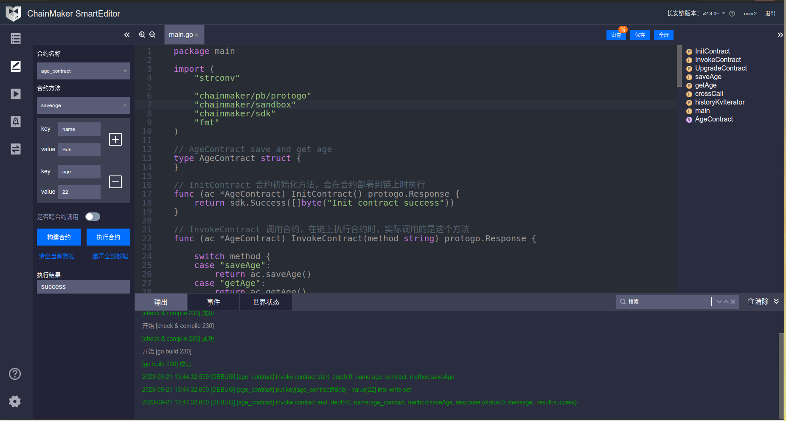


7. 调用 `getAge` 方法，查询存储的用户年龄信息。如下图：选中 `getAge` 方法，增加 `name` 参数，然后点击构建并执行。

    左侧 **构建和执行合约** 按钮下面会显示合约执行结果。

    **控制台->输出** 会打印合约执行日志 `sdk.Instance.Infof` 的内容。

    **控制台->世界状态** 会显示合约的世界状态。`{key:"Bob","value":"22"}`

Smartide-invokeGetAge
   
 

## SDK 详细介绍

上面我们一步一步创建了一个简单的合约，用到了SDK提供的一小部分方法。

```go
//保存用户年龄信息到链上
err = sdk.Instance.PutStateFromKey(name, ageStr)
//从链上查询用户年龄信息
ageStr, err := sdk.Instance.GetStateFromKey(name)
```

下面详细介绍一下SDK提供的方法。

### `SDKInterface` 接口

`SDKInterface` 定义了和链交互的方法，我们通过在合约中调用该接口的方法和链交互。方法列表如下：

```go
type SDKInterface interface{
    # 获取合约执行的参数
    GetArgs() map[string][]byte

    # 从链上查询信息
    # 查询信息 指定 key field
    GetState(key, field string) (string, error)
    GetStateWithExists(key, field string) (string, bool, error)
    GetStateByte(key, field string) ([]byte, error)
    GetBatchState(batchKeys []*vmPb.BatchKey) ([]*vmPb.BatchKey, error)
    # 查询信息 指定 key
    GetStateFromKey(key string) (string, error)
    GetStateFromKeyWithExists(key string) (string, bool, error)
    GetStateFromKeyByte(key string) ([]byte, error)

    # 存储数据到链上
    # 存储信息 指定key field
    PutState(key, field string, value string) error
    PutStateByte(key, field string, value []byte) error
    # 存储信息 指定 key
    PutStateFromKey(key string, value string) error
    PutStateFromKeyByte(key string, value []byte) error

    # 从链上删除数据
    # 删除信息 指定key field
    DelState(key, field string) error
    # 删除信息 指定key
    DelStateFromKey(key string) error

    # 获取合约创建者的组织ID
    GetCreatorOrgId() (string, error)
    # 获取合约创建者的角色
    GetCreatorRole() (string, error)
    # 获取合约创建者的公钥
    GetCreatorPk() (string, error)
    # 获取交易发起者的组织ID
    GetSenderOrgId() (string, error)
    # 获取交易交易发起者的角色
    GetSenderRole() (string, error)
    # 获取交易发起者的公钥
    GetSenderPk() (string, error)
    # 获取当前块高度
    GetBlockHeight() (int, error)
    # 获取交易ID
    GetTxId() (string, error)
    # 获取交易信息 
    GetTxInfo(txId string) protogo.Response
    # 获取交易时间戳
    GetTxTimeStamp() (string, error)

    # 发布合约事件
    EmitEvent(topic string, data []string)

    # 记录合约日志
    Log(message string)
    Debugf(format string, a ...interface{})
    Infof(format string, a ...interface{})
    Warnf(format string, a ...interface{})
    Errorf(format string, a ...interface{})

    # 跨合约调用
    CallContract(contractName, method string, args map[string][]byte) protogo.Response

    # 范围查询迭代器 [startKey, limitKey)
    NewIterator(startKey string, limitKey string) (ResultSetKV, error)
    # 范围查询迭代器 [key+startField, key+limitField)
    NewIteratorWithField(key string, startField string, limitField string) (ResultSetKV, error)
    # 前缀范围查询迭代器 有 `key+field` 前缀的数据
    NewIteratorPrefixWithKeyField(key string, field string) (ResultSetKV, error)
    # 前缀范围查询迭代器 有 `key` 前缀的数据
    NewIteratorPrefixWithKey(key string) (ResultSetKV, error)
            
    # 历史数据查询迭代器 key+field 数据的历史版本
    NewHistoryKvIterForKey(key, field string) (KeyHistoryKvIter, error)

    # 查询交易发起方地址
    GetSenderAddr() (string, error)
    Sender() (string, error)

    # 查询原始调用方地址
    Origin() (string,error)  
}        
// 结果集
type ResultSet interface {
    // NextRow get next row,
    // sql: column name is EasyCodec key, value is EasyCodec string val. as: val := ec.getString("columnName")
    // kv iterator: key/value is EasyCodec key for "key"/"value", value type is []byte. as: k, _ := ec.GetString("key") v, _ := ec.GetBytes("value")
    NextRow() (*serialize.EasyCodec, error)
    // HasNext return does the next line exist
    HasNext() bool
    // Close .
    Close() (bool, error)
}

type ResultSetKV interface {
    ResultSet
    // Next return key,field,value,code
    Next() (string, string, []byte, error)
}

type KeyHistoryKvIter interface {
    ResultSet
    // Next return txId, blockHeight, timestamp, value, isDelete, error
    Next() (*KeyModification, error)
}
```

写合约的时候我们通过编写代码完成合约逻辑，SDK提供了合约和链交互的方法，帮助我们完成和链交互。

###  `SDKInterface` 详细介绍

1. 跨合约调用，即在A合约中调用B合约的方法。跨合约调用需要用到 `CallContract` 方法。代码如下：

    ```go
    //crossCall 跨合约调用
    func (ac *AgeContract) crossCall() protogo.Response {
        
        //要调用的合约的基本信息
        contractName := "age_contract"
        calledMethod := "getAge"
    
        //跨合约调用的参数
        crossContractArgs := make(map[string][]byte)
        crossContractArgs["method"] = []byte(calledMethod)
        crossContractArgs["name"] = []byte("Bob")
    
        //开合约调用响应信息
        response := sdk.Instance.CallContract(contractName, calledMethod, crossContractArgs)
        sdk.Instance.EmitEvent("cross contract", []string{"success"})
        return response
    }
    ```

2. 迭代器使用，查询用户年龄的历史版本。

    ```go
    //historyKvIterator 历史迭代器
    func (ac *AgeContract) historyKvIterator() protogo.Response {
        key := "Bob"
        //创建历史迭代器
        result, err := sdk.Instance.NewHistoryKvIterForKey(key, "")
        if err != nil {
            msg := "failed to call get_state"
            sdk.Instance.Log(msg + " " + err.Error())
            return sdk.Error(msg)
        }
    
        //判断迭代器是否有数据，如果有迭代输出数据
        for result.HasNext() {
            v, err := result.Next()
            if err != nil {
                msg := "failed to call iterator"
                sdk.Instance.Log(msg + " " + err.Error())
                return sdk.Error(msg)
            }
            sdk.Instance.Log(fmt.Sprintf("NewHistoryKvIterForKey %v\n", v))
        }
    
        return sdk.Success([]byte("success"))
    }
    ```

3. 完整合约。包含 保存用户年龄信息`saveAge`、 查询用户年龄信息`getAge` 开合约调用`crossCall` 和 历史迭代器`historyKvIterator`。

    ```go
	package main

	import (
		"strconv"

		"chainmaker/pb/protogo"
		"chainmaker/sandbox"
		"chainmaker/sdk"
		"fmt"
	)

	// AgeContract save and get age
	type AgeContract struct {
	}

	// InitContract 合约初始化方法，会在合约部署到链上时执行
	func (ac *AgeContract) InitContract() protogo.Response {
		return sdk.Success([]byte("Init contract success"))
	}

	// InvokeContract 调用合约，在链上执行合约时，实际调用的是这个方法
	func (ac *AgeContract) InvokeContract(method string) protogo.Response {

		switch method {
		case "saveAge":
			return ac.saveAge()
		case "getAge":
			return ac.getAge()

		case "crossCall":
			return ac.crossCall()
		case "historyKvIterator":
			return ac.historyKvIterator()
		default:
			return sdk.Error("no contract method")
		}

	}
	func (ac *AgeContract) UpgradeContract() protogo.Response {
		return sdk.Success([]byte("Upgrade contract success"))
	}

	// saveAge 保存用户年龄信息
	func (ac *AgeContract) saveAge() protogo.Response {
		//获取所有的合约参数
		args := sdk.Instance.GetArgs()

		name := string(args["name"])
		ageStr := string(args["age"])
		if name == "" || ageStr == "" {
			message := "name or age is empty"
			//打印日志，调试合约时，日志会在控制台输出中展示
			sdk.Instance.Infof(message)
			//返回合约执行错误信息
			return sdk.Error(message)
		}

		_, err := strconv.Atoi(ageStr)
		if err != nil {
			message := "convert age to int fail. err: " + err.Error()
			//打印日志，调试合约时，日志会在控制台输出中展示
			sdk.Instance.Infof(message)
			//返回合约执行错误信息
			return sdk.Error(message)
		}

		//保存用户年龄信息到链
		err = sdk.Instance.PutStateFromKey(name, ageStr)
		if err != nil {
			message := "put state from key fail. err: " + err.Error()
			//打印日志，调试合约时，日志会在控制台输出中展示
			sdk.Instance.Infof(message)
			//返回合约执行错误信息
			return sdk.Error(message)
		}

		//返回合约执行成功信息
		return sdk.Success([]byte("success"))
	}

	// getAge 获取用户年龄信息
	func (ac *AgeContract) getAge() protogo.Response {
		//获取所有的合约参数
		args := sdk.Instance.GetArgs()

		name := string(args["name"])
		if name == "" {
			message := "name is  empty"
			//打印日志，调试合约时，日志会在控制台输出中展示
			sdk.Instance.Infof(message)
			//返回合约执行错误信息
			return sdk.Error("-1")
		}

		ageStr, err := sdk.Instance.GetStateFromKey(name)
		if err != nil {
			message := "get state from key fail. err: " + err.Error()
			//打印日志，调试合约时，日志会在控制台输出中展示
			sdk.Instance.Infof(message)
			//返回合约执行错误信息
			return sdk.Error("-1")
		}

		if ageStr == "" {
			message := "age not found"
			//打印日志，调试合约时，日志会在控制台输出中展示
			sdk.Instance.Infof(message)
			//返回合约执行错误信息
			return sdk.Error("-1")
		}

		//返回用户年龄
		return sdk.Success([]byte(ageStr))
	}

	func (ac *AgeContract) crossCall() protogo.Response {

		//要调用的合约的基本信息
		contractName := "age_contract"
		calledMethod := "getAge"

		//跨合约调用的参数
		crossContractArgs := make(map[string][]byte)
		crossContractArgs["method"] = []byte(calledMethod)
		crossContractArgs["name"] = []byte("Bob")

		//开合约调用响应信息
		response := sdk.Instance.CallContract(contractName, calledMethod, crossContractArgs)
		sdk.Instance.EmitEvent("cross contract", []string{"success"})
		return response
	}

	//historyKvIterator 历史迭代器
	func (ac *AgeContract) historyKvIterator() protogo.Response {
		key := "Bob"
		//创建历史迭代器
		result, err := sdk.Instance.NewHistoryKvIterForKey(key, "")
		if err != nil {
			msg := "failed to call get_state"
			sdk.Instance.Log(msg + " " + err.Error())
			return sdk.Error(msg)
		}

		//判断迭代器是否有数据，如果有迭代输出数据
		for result.HasNext() {
			v, err := result.Next()
			if err != nil {
				msg := "failed to call iterator"
				sdk.Instance.Log(msg + " " + err.Error())
				return sdk.Error(msg)
			}
			sdk.Instance.Log(fmt.Sprintf("NewHistoryKvIterForKey %v\n", v))
		}

		return sdk.Success([]byte("success"))
	}

	func main() {
		//运行合约
		err := sandbox.Start(new(AgeContract))
		if err != nil {
			log.Fatal(err)
		}
	}
    ```

## 编写合约注意事项

1. 合约工程目录下必须有一个 `main.go`，且 `main.go` 的包名需要是 `main`，合约的入口需要在 `main.go` 中，且 `InvokeContract()` 方法代码需要在 `main.go` 中。即 ：

    ```go
    package main

    import (

    "chainmaker/pb/protogo"
    "chainmaker/sandbox"
    "chainmaker/sdk"
    )
    
    ... ...
    ... ...
    
    // InvokeContract 调用合约，在链上执行合约时，实际调用的是这个方法
    func (ac *AgeContract) InvokeContract(method string) protogo.Response {

        switch method {
        case "saveAge":
            return ac.saveAge()
        case "getAge":
            return ac.getAge()

        case "crossCall":
            return ac.crossCall()
        case "historyKvIterator":
            return ac.historyKvIterator()
        default:
            return sdk.Error("no contract method")
        }

    }
        
        // 合约入口

    func main() {
        //运行合约
        err := sandbox.Start(new(AgeContract))
        if err != nil {
            log.Fatal(err)
        }
    }
    ```

2.  `InvokeContract` 里面关联方法逻辑需要是如下模式（合约调试会根据下面的模式解析方法名）。注意不要在 case 后面使用定义的常量。

    ```go
     switch method {
        case "字符串":
            ... ...
        case "字符串":
            ... ...
        default:
            return sdk.Error("no contarct method")
        }
    ```


3. 合约必须包含`InitContract()` 方法和 `UpgradeContract()`方法,合约部署到链上以后才可以进行安装和升级。     

4. 不能使用全局变量。在编写合约时，不要使用全局变量来存储数据，数据的存储可以直接存到链上，用 `getState` 和 `putState` 等方法存储。

5. 不支持在合约工程内创建内嵌的 go module。


