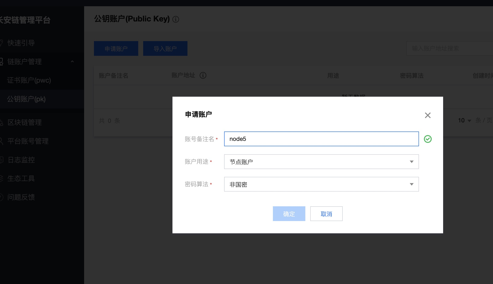
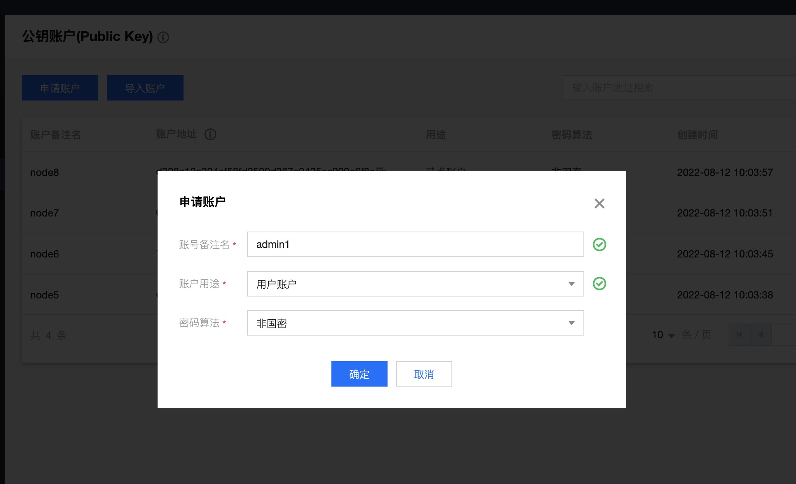
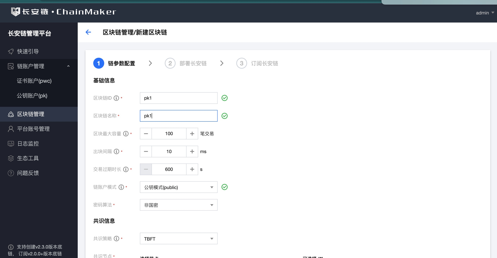
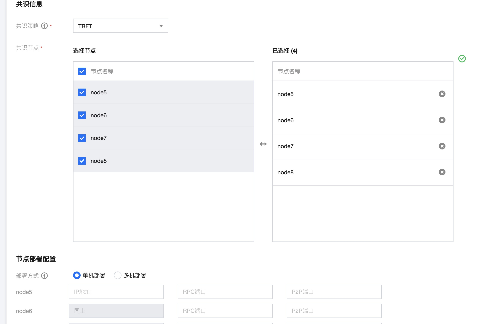
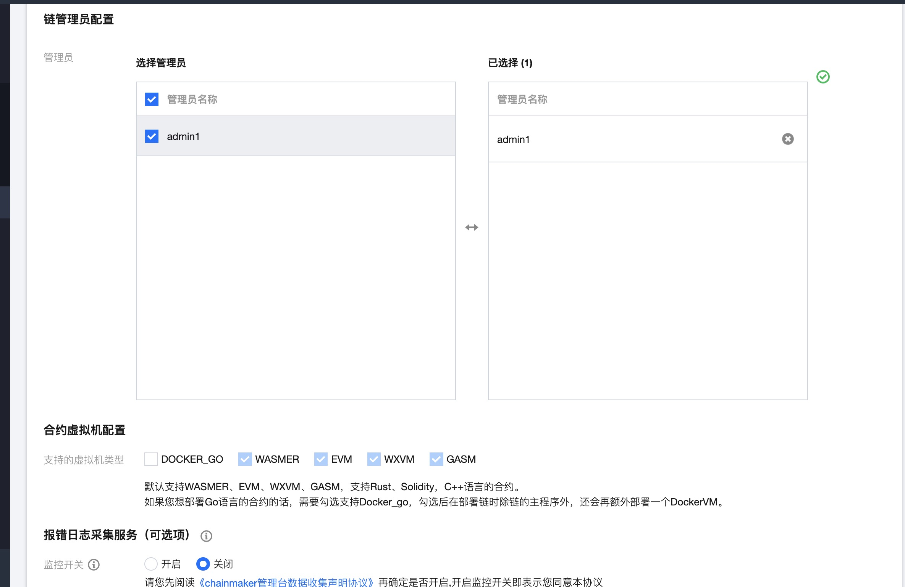
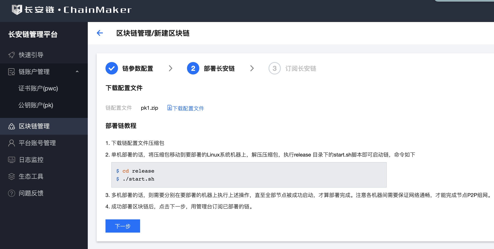
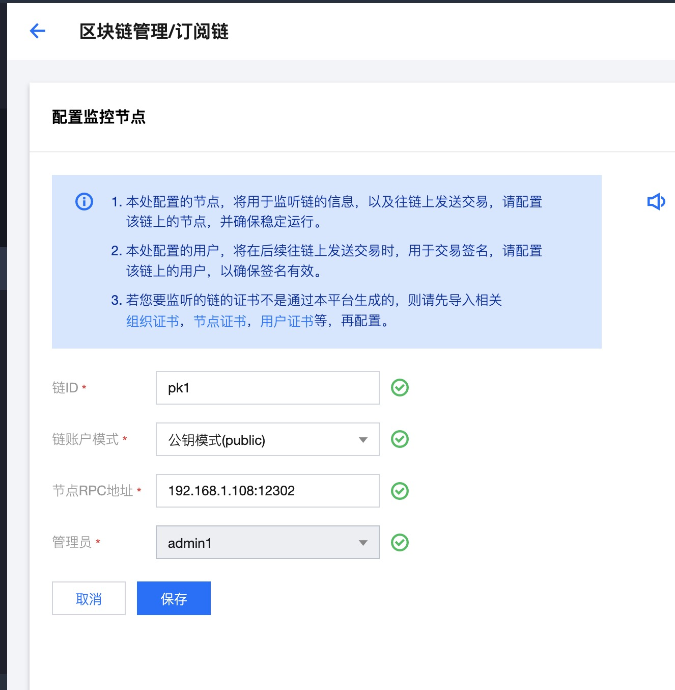

# 部署PK账户模式的链

## 通过命令行启动PK模式的链

### 环境依赖

#### 硬件环境

| 配置 | 最低配置 | 推荐配置 |
| ---- | -------- | -------- |
| CPU  | 1.5GHz   | 2.4GHz   |
| 内存 | 8GB      | 16GB     |
| 核心 | 4核      | 8核      |
| 带宽 | 2Mb      | 10Mb     |

#### 软件环境

当前文档在centos7.6操作下完成，以下为本次演示所需的依赖，软件列表如下：

| 名称                                          | 版本  | 描述                                                         | 是否必须 |
| --------------------------------------------- | ----- | ------------------------------------------------------------ | -------- |
| git                                           | /     | 源码管理                                                     | 是       |
| golang                                        | 1.16-1.19 | 编译环境（需修改国内代理）                              | 是       |
| gcc                                           | 7.3+  | 编译环境依赖                                                 | 是       |
| glibc                                         | 2.18  | 智能合约执行环境依赖                                         | 是       |
| tmux                                          | /     | 默认快速启动命令依赖                                         | 否       |
| wasmer运行时库 **libwasmer_runtime_c_api.so** | /     | https://git.chainmaker.org.cn/chainmaker/vm-wasmer/-/tree/master/wasmer-go/packaged/lib 目录下，找到对应链分支的库，将该库路径添加至系统PATH环境变量下<br>启动脚本默认包含，单独启动需加上如下配置：<br>cd deployPath/lib <br>cp xxx/main/libwasmer_runtime_c_api.so libwasmer.so<br>export LD_LIBRARY_PATH=deployPath/lib:$LD_LIBRARY_PATH | 是       |

##### git 

下载地址：[https://git-scm.com/downloads](https://git-scm.com/downloads)

安装步骤，请参看：[https://git-scm.com/book/en/v2/Getting-Started-Installing-Git](https://git-scm.com/book/en/v2/Getting-Started-Installing-Git)

##### golang 

> 版本为1.16-1.19


下载地址：[https://golang.org/dl/](https://golang.org/dl/)

安装步骤，请参看：[https://golang.org/doc/install](https://golang.org/doc/install)


##### gcc 

1. 检查 gcc 版本

```bash
gcc --version
```

显示结果若 < 7.3，则执行下面步骤升级

2. 升级 gcc 

```bash
sudo yum install centos-release-scl
sudo yum install devtoolset-7-gcc*
scl enable devtoolset-7 bash
```

注意：第三条指令`scl enable devtoolset-7 bash` 只是在当前会话中升级了gcc，如果想每次登录gcc自动升级，可以把`scl enable devtoolset-7 bash` 放在` ~/.bash_profile` 文件中。

### 环境搭建

下面将介绍`使用脚本搭建`搭建环境。

<span id="runUseScripts"></span>

> 适用于`Linux`、`MacOS`

#### 源码下载

从[长安链官网](https://chainmaker.org.cn/)下载源码：[https://git.chainmaker.org.cn/chainmaker/chainmaker-go](https://git.chainmaker.org.cn/chainmaker/chainmaker-go)

> 当前为私有仓库，需要先进行账号注册

- 下载`chainmaker-go`源码到本地

```bash
$ git clone -b v2.3.5 --depth=1 https://git.chainmaker.org.cn/chainmaker/chainmaker-go.git
```

- 下载`证书生成工具`源码到本地

```bash
$ git clone -b v2.3.5 --depth=1 https://git.chainmaker.org.cn/chainmaker/chainmaker-cryptogen.git
```

#### 源码编译

- 编译证书生成工具

```bash
$ cd chainmaker-cryptogen
$ make
```

#### 配置文件生成

- 将编译好的`chainmaker-cryptogen`，软连接到`chainmaker-go/tools`目录

```bash
# 进入工具目录
$ cd chainmaker-go/tools

# 软连接chainmaker-cryptogen到tools目录下
$ ln -s ../../chainmaker-cryptogen/ .
```


#### 账户生成
- 进入chainmaker-go/scripts目录，执行prepare_pk.sh脚本生成单链4节点集群配置，存于路径chainmaker-go/build中

- prepare_pk.sh脚本支持生成4/7/10/13/16节点公私钥和配置
```
# 进入脚本目录
$ cd ../scripts

# 查看脚本帮助
$ ./prepare_pk.sh -h
Usage:  
    prepare.sh node_cnt(1/4/7/10/13/16) chain_cnt(1-4)
               p2p_port(default:11301) rpc_port(default:12301)
               vm_go_runtime_port(default:32351) vm_go_engine_port(default:22351)
               -c consense-type: 1-TBFT,5-DPOS
               -l log-level: DEBUG,INFO,WARN,ERROR
               -v docker-vm-enable: true,false
               -h show help
                  --hash hash type: SHA256,SM3
    eg1: prepare_pk.sh 4 1
    eg2: prepare_pk.sh 4 1 11301 12301
    eg2: prepare_pk.sh 4 1 11301 12301 32351 22351
    eg2: prepare_pk.sh 4 1 11301 12301 32351 22351 -c 1 -l INFO  --hash SHA256 -v true 
    eg2: prepare_pk.sh 4 1 11201 12201 32251 22251 -c 5 -l DEBUG --hash SM3    -v false

# 生成单链4节点集群的密钥和配置
$ ./prepare_pk.sh 4 1
begin check params...
param P2P_PORT 11301
param RPC_PORT 12301
param VM_GO_RUNTIME_PORT 32351
param VM_GO_ENGINE_PORT 22351
input consensus type (1-TBFT(default),5-DPOS): 
param CONSENSUS_TYPE 1
input log level (DEBUG|INFO(default)|WARN|ERROR): 
param LOG_LEVEL INFO
input hash type (SHA256(default)|SM3): 
param HASH_TYPE SHA256
enable vm go (YES|NO(default))
param ENABLE_VM_GO 

config node total        4
begin generate node1 config...
begin generate node2 config...
begin generate node3 config...
begin generate node4 config...

# 查看生成好的节点密钥和配置
$ tree -L 3 ../build 
../build
├── config
│ ├── node1
│ │ ├── admin
│ │ ├── ca
│ │ ├── chainconfig
│ │ ├── chainmaker.yml
│ │ ├── client-tls
│ │ ├── log.yml
│ │ ├── node1.key
│ │ ├── node1.nodeid
│ │ ├── node1.pem
│ │ ├── node1.tls.crt
│ │ ├── node1.tls.key
│ │ └── user
│ ├── node2
│ │ ├── admin
│ │ ├── ca
│ │ ├── chainconfig
│ │ ├── chainmaker.yml
│ │ ├── client-tls
│ │ ├── log.yml
│ │ ├── node2.key
│ │ ├── node2.nodeid
│ │ ├── node2.pem
│ │ ├── node2.tls.crt
│ │ ├── node2.tls.key
│ │ └── user
│ ├── node3
│ │ ├── admin
│ │ ├── ca
│ │ ├── chainconfig
│ │ ├── chainmaker.yml
│ │ ├── client-tls
│ │ ├── log.yml
│ │ ├── node3.key
│ │ ├── node3.nodeid
│ │ ├── node3.pem
│ │ ├── node3.tls.crt
│ │ ├── node3.tls.key
│ │ └── user
│ └── node4
│     ├── admin
│     ├── ca
│     ├── chainconfig
│     ├── chainmaker.yml
│     ├── client-tls
│     ├── log.yml
│     ├── node4.key
│     ├── node4.nodeid
│     ├── node4.pem
│     ├── node4.tls.crt
│     ├── node4.tls.key
│     └── user
├── crypto-config
│ ├── node1
│ │ ├── admin
│ │ ├── ca
│ │ ├── client-tls
│ │ ├── node1.key
│ │ ├── node1.nodeid
│ │ ├── node1.pem
│ │ ├── node1.tls.crt
│ │ ├── node1.tls.key
│ │ └── user
│ ├── node2
│ │ ├── admin
│ │ ├── ca
│ │ ├── client-tls
│ │ ├── node2.key
│ │ ├── node2.nodeid
│ │ ├── node2.pem
│ │ ├── node2.tls.crt
│ │ ├── node2.tls.key
│ │ └── user
│ ├── node3
│ │ ├── admin
│ │ ├── ca
│ │ ├── client-tls
│ │ ├── node3.key
│ │ ├── node3.nodeid
│ │ ├── node3.pem
│ │ ├── node3.tls.crt
│ │ ├── node3.tls.key
│ │ └── user
│ └── node4
│     ├── admin
│     ├── ca
│     ├── client-tls
│     ├── node4.key
│     ├── node4.nodeid
│     ├── node4.pem
│     ├── node4.tls.crt
│     ├── node4.tls.key
│     └── user
├── crypto_config.yml
└── crypto_tls_config.yml

```

注：在v2.3.4及以后版本中，PK模式中的cmc/go-sdk与节点之间的连接支持配置TLS。在上面的配置示例中，node1.tls.crt是节点的证书，node1.tls.key是节点的私钥。在client-tls文件夹中，有多个cmc/go-sdk使用的证书和私钥对。这样的配置可以增强安全性，确保在cmc/go-sdk与节点之间的通信过程中数据的保密性和完整性。

#### 编译和安装包制作
- 生成账号（prepare_pk.sh脚本）后执行build_release.sh脚本，将编译chainmaker-go模块，并打包生成安装，存于路径chainmaker-go/build/release中
```
$ ./build_release.sh
$ tree ../build/release/
../build/release/
├── chainmaker-v2.3.5-node1-20240606153127-x86_64.tar.gz
├── chainmaker-v2.3.5-node2-20240606153127-x86_64.tar.gz
├── chainmaker-v2.3.5-node3-20240606153127-x86_64.tar.gz
├── chainmaker-v2.3.5-node4-20240606153127-x86_64.tar.gz
└── crypto-config-20240606153127.tar.gz
```
#### 启动和停止链
- 执行cluster_quick_start.sh脚本，会解压各个安装包，调用bin目录中的start.sh脚本，启动chainmaker节点
```
$ ./cluster_quick_start.sh normal
```
- 启动成功后，将*.tar.gz备份，以免下次启动再次解压缩时文件被覆盖

```
$ mkdir -p ../build/bak
$ mv ../build/release/*.tar.gz ../build/bak
```
若需要关闭集群，使用脚本：

```
$ ./cluster_quick_stop.sh
```

#### 查看节点是否存在
- 查看进程
```
$ ps -ef|grep chainmaker | grep -v grep
501 19216     1   0  3:36PM ttys002    0:00.86 ./chainmaker start -c ../config/node1/chainmaker.yml name-20240606153355
501 19238     1   0  3:36PM ttys002    0:00.72 ./chainmaker start -c ../config/node2/chainmaker.yml name-20240606153355
501 19258     1   0  3:36PM ttys002    0:00.67 ./chainmaker start -c ../config/node3/chainmaker.yml name-20240606153355
501 19277     1   0  3:36PM ttys002    0:00.71 ./chainmaker start -c ../config/node4/chainmaker.yml name-20240606153355
```
- 查看端口
```
$ netstat -lptn | grep 1230
tcp6       0      0 :::12301                :::*                    LISTEN      25261/./chainmaker  
tcp6       0      0 :::12302                :::*                    LISTEN      25286/./chainmaker  
tcp6       0      0 :::12303                :::*                    LISTEN      25309/./chainmaker  
tcp6       0      0 :::12304                :::*                    LISTEN      25335/./chainmaker 
```
- 查看日志
```
$ cat ../build/release/*/bin/panic.log
$ cat ../build/release/*/log/system.log
$ cat ../build/release/*/log/system.log |grep "ERROR\|put block\|all necessary"
//若看到all necessary peers connected则表示节点已经准备就绪。
```


#### 部署/调用智能合约
启动成功后，可进行部署/调用合约测试，以验证链是否正常运行。

此处提供示例合约的已编译之后的合约文件，可直接下载文件并部署合约。
- Rust：[rust-fact-2.0.0.wasm](https://git.chainmaker.org.cn/chainmaker/chainmaker-go/-/raw/v2.2.0/test/wasm/rust-fact-2.0.0.wasm)
  
##### CMC工具配置
使用长安链命令行工具cmc进行测试，详细教程请见[命令行工具pk](../dev/命令行工具pk.html#交易功能)
其中，cmc工具配置文件sdk_config_pk.yaml需要进行相应修改，主要修改以下配置:
- 客户端私钥：user_sign_key_file_path

```yaml
chain_client:
  # 链ID
  chain_id: "chain1"

  # 客户端用户交易签名私钥路径
  user_sign_key_file_path: "./testdata/crypto-config/node1/admin/admin1/admin1.key"
  # 客户端用户交易签名私钥密码(无密码则不需要设置)
  #  user_sign_key_pwd: "123"
  # 客户端用户私钥路径，用于tls连接
  # user_key_file_path: "./testdata/crypto-config/node1/client-tls/client1/client1.tls.key"
  # 客户端用户私钥密码(无密码则不需要设置)
  #  user_key_pwd: "123"
  # 客户端用户证书路径，用于tls连接
  # user_crt_file_path: "./testdata/crypto-config/node1/client-tls/client1/client1.tls.crt"
  # 签名使用的哈希算法，和节点保持一直
  crypto:
    hash: SHA256
  auth_type: public
  # 同步交易结果模式下，轮询获取交易结果时的最大轮询次数，删除此项或设为<=0则使用默认值 10
  retry_limit: 20
  # 同步交易结果模式下，每次轮询交易结果时的等待时间，单位：ms 删除此项或设为<=0则使用默认值 500
  retry_interval: 500
  # txid配置项：默认支持TimestampKey，如果开启enableNormalKey则使用NormalKey
  enable_normal_key: false

  nodes:
    - # 节点地址，格式为：IP:端口:连接数
      node_addr: "127.0.0.1:12301"
      # 节点连接数
      conn_cnt: 10
      # RPC连接是否启用双向TLS认证
      enable_tls: false
      # 信任证书池路径
      trust_root_paths:
        - "./testdata/crypto-config/node1/ca/wx-org1.chainmaker.org/ca"
      # TLS hostname
      tls_host_name: "chainmaker.org"

  archive:
    # 数据归档链外存储相关配置
    # 如果使用了新版本的归档中心,这个地方配置为archivecenter
    type: "mysql"  # archivecenter 归档中心, mysql mysql数据库
    dest: "root:123456:localhost:3306"
    secret_key: xxx

  rpc_client:
    max_receive_message_size: 100 # grpc客户端接收消息时，允许单条message大小的最大值(MB)
    max_send_message_size: 100 # grpc客户端发送消息时，允许单条message大小的最大值(MB)
    send_tx_timeout: 60 # grpc 客户端发送交易超时时间
    get_tx_timeout: 60 # rpc 客户端查询交易超时时间 

  # # 如果启用了归档中心,可以打开下面的归档中心配置  
  archive_center_query_first: true # 如果为true且归档中心配置打开,那么查询数据优先从归档中心查询 
  # archive_center_config:
  #   chain_genesis_hash: c670b598127f5795767d1acbae435e714797596f7e0a55dd05205da948de1a0a
  #   archive_center_http_url: http://127.0.0.1:13119
  #   request_second_limit: 10
  #   rpc_address: 127.0.0.1:13120
  #   tls_enable: false
  #   tls:
  #     server_name: archiveserver1.tls.wx-org.chainmaker.org
  #     priv_key_file: ./testdata/archivecenter/archiveclient1.tls.key
  #     cert_file: ./testdata/archivecenter/archiveclient1.tls.crt
  #     trust_ca_list:
  #       - ./testdata/archivecenter/ca.crt    
  #   max_send_msg_size: 200
  #   max_recv_msg_size: 200 
```

注：由于我们使用管理员账户进行测试，所以user_sign_key_file_path需要指定管理员私钥
注：从v2.3.4版本开始，PK模式中cmc/go-sdk与节点间连接支持配置TLS，默认为关闭状态。 为了实现这一功能，cmc/go-sdk配置文件（sdk_config_pk.yml）中新增了以下配置：

| 字段                 | 说明                                         | 
|--------------------|--------------------------------------------|
| user_key_file_path | 客户端用户私钥路径，用于tls连接                          |
| user_crt_file_path | 客户端用户证书路径，用于tls连接                          |
| enable_tls         | RPC连接是否启用双向TLS认证                           |
| trust_root_paths   | 信任证书池路径（节点根证书文件路径列表）                       |
| tls_host_name      | TLS主机名，在TLS握手过程中用于验证服务器证书的主题替代名或公用名是否与其匹配。 |

同时，节点配置文件（chainmaker.yml）中也新增了以下配置：

| 字段                    | 说明                           | 
|-----------------------|------------------------------|
| mode                  | 	TLS 模式，可以是 disable 或 twoway |
| cert_file             | 	节点证书文件路径                    |
| priv_key_file         | 	节点私钥文件路径                    |
| client_root_ca_paths	 | 信任证书池路径（客户端根证书文件路径列表）        |

#### 使用长安链SDK进行测试
- 通过长安链SDK进行部署/调用，详情[SDK使用说明章节](../sdk/GoSDK使用说明.md)
  - 需要将SDK所需的相关证书替换成，上文所生成的证书，然后进行操作。


## 通过管理台启动pk模式的链

#### 登录


- 私有化部署本平台时会生成的对应的admin账号，默认密码为a123456

#### 新增节点账户


- 填写账户备注名
- 选择节点账户
- 支持申请国密和非国密两种证书。

#### 新增用户账户


- 填写账户备注名
- 选择用户账户
- 支持申请国密和非国密两种证书。

#### 新建区块链




- 选择公钥模式
- 链配置文件参数设定
  - 此处用于新增链配置文件，目前支持自定义链的id、名称、区块最大容量，出块间隔、交易过期时长，以及共识配置。
  - 目前支持配置TBFT、DPOS等共识。
  - 申请链配置文件前，请先确保，所需的节点和用户账户已经申请/导入本管理平台。
  - 支持根据需求选择你要部署的链所支持的虚拟机类型。
  - 支持单机部署和多机部署，请正确填写所要之后要部署区块链节点的机器所在的ip，并确保端口不冲突。
  - 如果开启报错日志采集服务，则在您部署到链运行过程中如果发生异常，管理台会收集报错日志，并汇总展示，方便定位问题。如果您开启了参与长安链改进计划，则采集到的报错日志，将自动上传给长安链官方团队，方便团队持续改进产品。

#### 下载部署链


- 部署区块链
  - 下载链配置以zip包为准，zip包包含对应的链配置文件和部署脚本
  - 将下载的包移动到需要部署的机器上去（可以使用scp进行移动）
  - 执行`unzip`解压成`release`包，进入`release`包执行`start.sh`进行启动

#### 快速订阅链


- 链部署成功之后在管理台进行快速订阅
- 公钥需要选择公钥模式

#### 部署/调用合约验证链是否正常
订阅成功后，可进行部署/调用示例合约，以检查链功能是否正常。部署合约的使用教程可详见：[部署示例合约](./部署示例合约.md)。
