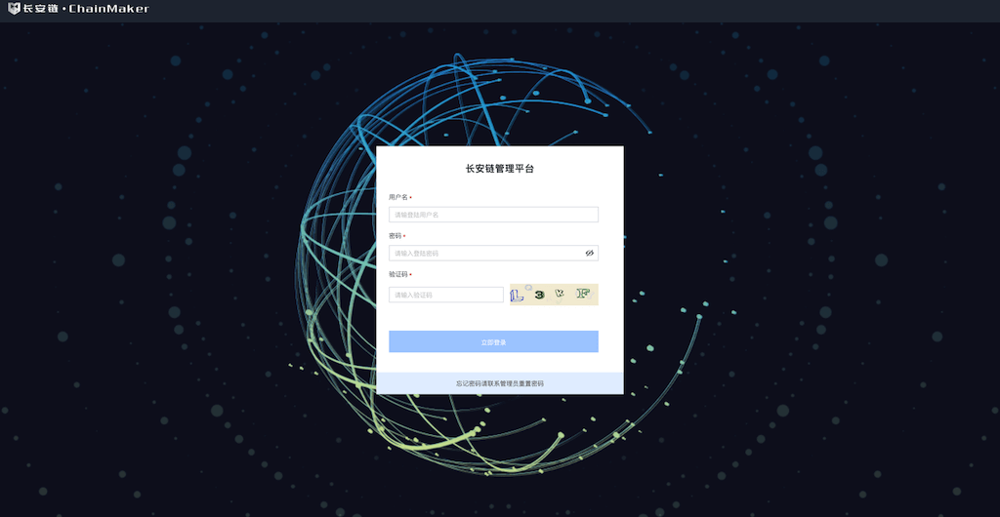
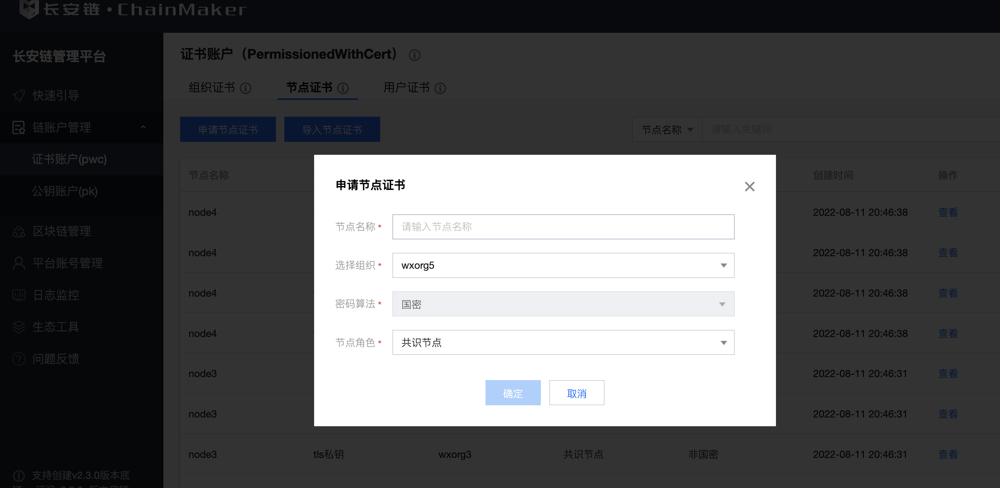
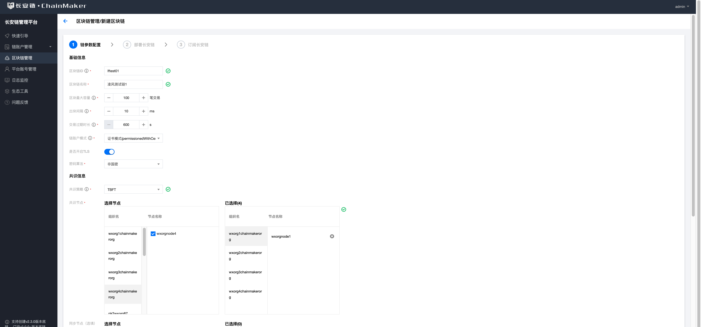
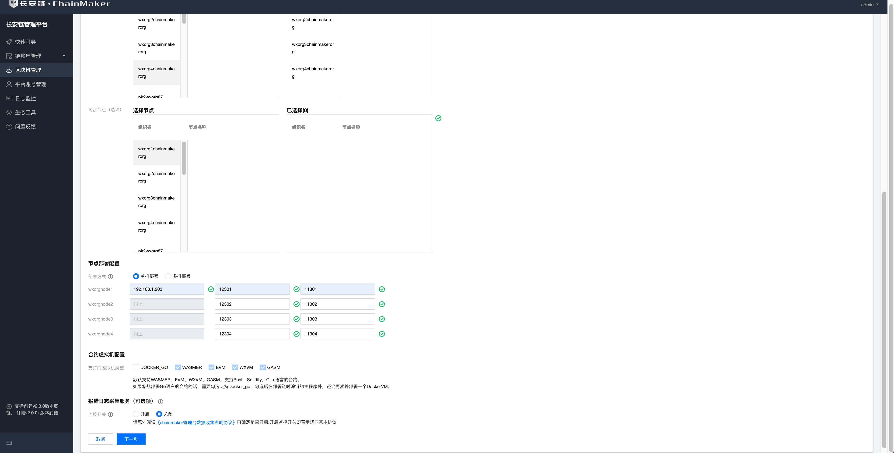
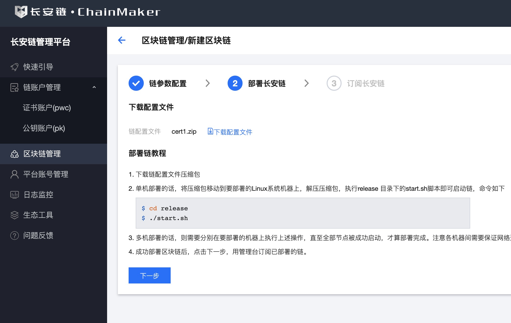
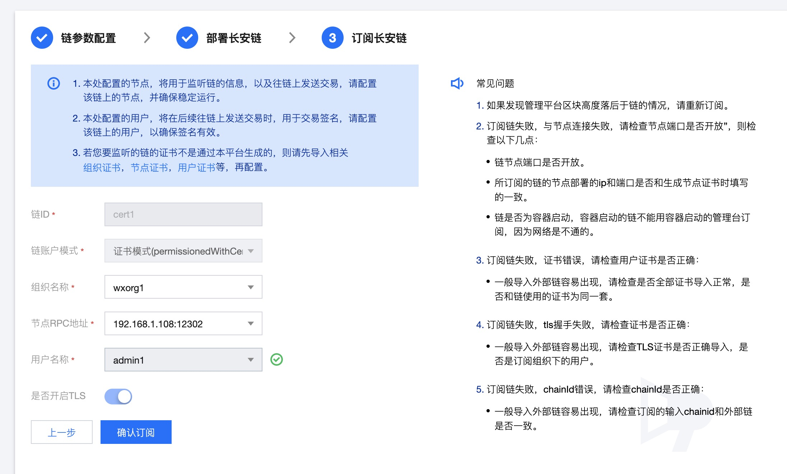
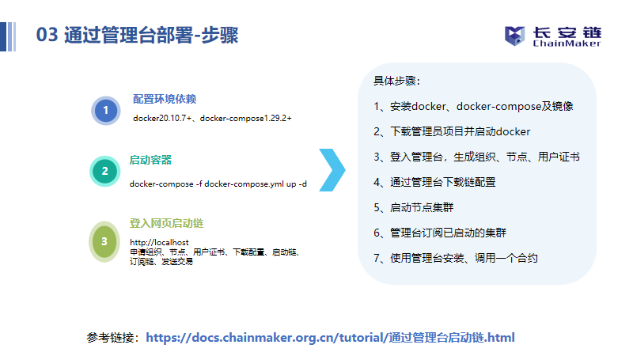

## 启动国密证书模式的链

### 通过管理台启动国密链

<a id='3.1.1'></a>

#### 登录


- 私有化部署本平台时会生成的对应的admin账号，默认密码为a123456

<a id='3.1.2'></a>

#### 新增组织证书


- 填写组织ID和组织名称
- 组织ID和组织名称不能重复
- 密码算法选择国密

#### 新增节点证书


- 目前节点证书角色分为共识节点和同步节点两种。
- 通过填写节点名称、组织信息，节点角色，申请节点证书。
- 密码算法选择国密

#### 新增用户证书


- 目前用户证书角色分为admin、client和light三种。
- 通过填写用户名称、组织信息，用户角色申请用户证书。
- 密码算法选择国密
- 合约部署需要对应的管理员证书，所以需要申请对应的管理员用户

#### 新建区块链




- 选择证书模式
- 链配置文件参数设定
  - 此处用于新增链配置文件，目前支持自定义链的id、名称、区块最大容量，出块间隔、交易过期时长，以及共识配置。
  - 注意密码算法处要选择国密算法。
  - 目前支持配置TBFT、RAFT、SOLO、MAXBFT共识。
  - 申请链配置文件前，请先确保，所需的组织和节点证书已经申请/导入本管理平台。
  - 支持根据需求选择你要部署的链所支持的虚拟机类型。
  - 支持单机部署和多机部署，请正确填写所要之后要部署区块链节点的机器所在的ip和端口，并确保在ip相同的情况下端口不冲突。
  - 如果开启报错日志采集服务，则在您部署到链运行过程中如果发生异常，管理台会收集报错日志，并汇总展示，方便定位问题。如果您开启了参与长安链改进计划，则采集到的报错日志，将自动上传给长安链官方团队，方便团队持续改进产品。

#### 下载部署链


- 部署区块链
  - 下载链配置以zip包为准，zip包包含对应的链配置文件和部署脚本
  - 将下载的包移动到需要部署的机器上去（可以使用scp进行移动）
  - 执行`unzip`解压成`release`包，进入`release`包执行`start.sh`进行启动

#### 快速订阅链


- 链部署成功之后在管理台进行快速订阅

#### 视频教程

<a href="https://www.bilibili.com/video/BV1Dr4y1W7MP/" target="_blank" title="点击跳转至播放页面" ></a>

视频地址: <a href="https://www.bilibili.com/video/BV1Dr4y1W7MP/"  target="_blank">  使用管理台部署长安链V2.0 </a>

### 通过命令行启动国密链（单证书模式）

#### 进行国密配置

- 进入`chainmaker-go/config/config_tpl/chainconfig`目录,修改`bc_4_7.yml`配置文件里的算法`crypto.hash`为国密
```
# 国密
# Crypto settings
crypto:
  # Hash algorithm, can be SHA256, SHA3_256 and SM3
  hash: SM3
# 非国密
# Crypto settings
crypto:
  # Hash algorithm, can be SHA256, SHA3_256 and SM3
  hash: SHA256
```

- 进入`chainmaker-go/tools/chainmaker-cryptogen/config`目录,修改`crypto_config_template.yml`配置文件里的算法`crypto_config.pk_algo`和`crypto_config.ski_hash`为国密
```
# 国密
crypto_config:
  - domain: chainmaker.org
    host_name: wx-org
    count: 4                # 如果为1，直接使用host_name，否则添加递增编号
    pk_algo: sm2
    ski_hash: sm3
# 非国密
crypto_config:
  - domain: chainmaker.org
    host_name: wx-org
    count: 4                # 如果为1，直接使用host_name，否则添加递增编号
    pk_algo: ecc_p256
    ski_hash: sha256
```

<a id='3.2.1'></a>

#### 证书生成

- 进入chainmaker-go/scripts目录，执行prepare.sh脚本生成单链4节点集群配置，存于路径chainmaker-go/build中

```
# 进入脚本目录
$ cd ../scripts
# 查看脚本帮助
$ ./prepare.sh -h
Usage:  
  prepare.sh node_cnt(1/4/7/10/13/16) chain_cnt(1-4) p2p_port(default:11301) rpc_port(default:12301)
    eg1: prepare.sh 4 1
    eg2: prepare.sh 4 1 11301 12301

# 生成单链4节点集群的证书和配置
$ ./prepare.sh 4 1
begin check params...
begin generate certs, cnt: 4
input consensus type (0-SOLO,1-TBFT(default),3-HOTSTUFF,4-RAFT,5-DPOS):
input log level (DEBUG|INFO(default)|WARN|ERROR):
enable docker vm (YES|NO(default))
begin generate node1 config...
begin generate node2 config...
begin generate node3 config...
begin generate node4 config...

# 查看生成好的节点证书和配置
$ tree -L 3 ../build/
../build/
├── config
│   ├── node1
│   │   ├── certs
│   │   ├── chainconfig
│   │   ├── chainmaker.yml
│   │   └── log.yml
│   ├── node2
│   │   ├── certs
│   │   ├── chainconfig
│   │   ├── chainmaker.yml
│   │   └── log.yml
│   ├── node3
│   │   ├── certs
│   │   ├── chainconfig
│   │   ├── chainmaker.yml
│   │   └── log.yml
│   └── node4
│       ├── certs
│       ├── chainconfig
│       ├── chainmaker.yml
│       └── log.yml
├── crypto-config
│   ├── wx-org1.chainmaker.org
│   │   ├── ca
│   │   ├── node
│   │   └── user
│   ├── wx-org2.chainmaker.org
│   │   ├── ca
│   │   ├── node
│   │   └── user
│   ├── wx-org3.chainmaker.org
│   │   ├── ca
│   │   ├── node
│   │   └── user
│   └── wx-org4.chainmaker.org
│       ├── ca
│       ├── node
│       └── user
└── crypto_config.yml
```
<a id='3.2.2'></a>

#### 编译和安装包制作
- 生成证书（prepare.sh脚本）后执行build_release.sh脚本，将编译chainmaker-go模块，并打包生成安装，存于路径chainmaker-go/build/release中
```
$ ./build_release.sh
$ tree ../build/release/
../build/release/
├── chainmaker-v2.0.0-wx-org1.chainmaker.org-20210406194833-x86_64.tar.gz
├── chainmaker-v2.0.0-wx-org2.chainmaker.org-20210406194833-x86_64.tar.gz
├── chainmaker-v2.0.0-wx-org3.chainmaker.org-20210406194833-x86_64.tar.gz
├── chainmaker-v2.0.0-wx-org4.chainmaker.org-20210406194833-x86_64.tar.gz
└── crypto-config-20210406194833.tar.gz
```
#### 启动和停止链
- 执行cluster_quick_start.sh脚本，会解压各个安装包，调用bin目录中的start.sh脚本，启动chainmaker节点
```
$ ./cluster_quick_start.sh normal
```
- 启动成功后，将*.tar.gz备份，以免下次启动再次解压缩时文件被覆盖

```
$ mkdir -p ../build/bak
$ mv ../build/release/*.tar.gz ../build/bak
```
若需要关闭集群，使用脚本：

```
$ ./cluster_quick_stop.sh
```
#### 查看节点是否存在
- 查看进程
```
$ ps -ef|grep chainmaker | grep -v grep
25261  2146  4 19:55 pts/20   00:00:01 ./chainmaker start -c ../config/wx-org1.chainmaker.org/chainmaker.yml
25286  2146  4 19:55 pts/20   00:00:01 ./chainmaker start -c ../config/wx-org2.chainmaker.org/chainmaker.yml
25309  2146  4 19:55 pts/20   00:00:01 ./chainmaker start -c ../config/wx-org3.chainmaker.org/chainmaker.yml
25335  2146  4 19:55 pts/20   00:00:01 ./chainmaker start -c ../config/wx-org4.chainmaker.org/chainmaker.yml
```
- 查看端口
```
$ netstat -lptn | grep 1230
tcp6       0      0 :::12301                :::*                    LISTEN      25261/./chainmaker  
tcp6       0      0 :::12302                :::*                    LISTEN      25286/./chainmaker  
tcp6       0      0 :::12303                :::*                    LISTEN      25309/./chainmaker  
tcp6       0      0 :::12304                :::*                    LISTEN      25335/./chainmaker 
```
- 查看日志
```
$ cat ../build/release/*/bin/panic.log
$ cat ../build/release/*/log/system.log
$ cat ../build/release/*/log/system.log |grep "ERROR\|put block\|all necessary"
//若看到all necessary peers connected则表示节点已经准备就绪。
```

#### 部署/调用合约验证链是否正常
启动成功后，可进行部署/调用示例合约，以检查链功能是否正常。部署合约的使用教程可详见：[部署示例合约](./部署示例合约.md)。


#### 视频教程


> 注：此视频教程为v1.0.0版本，长安链开源最新版本为v2.x.x，视频中遇到与版本号相关的，请更改为最新的版本。若为master分支，则已是最新v2.x.x版本
>
> 如：合约镜像为：docker pull chainmakerofficial/chainmaker-go-contract:v2.x.x


时间脚本:

• 01-04分钟：长安链简介及大纲介绍；

• 04-09分钟：环境安装演示；

• 09-26分钟：单机部署；

• 26-36分钟：智能合约开发（穿插常见问题）；

• 36-54分钟：部署合约（穿插常见问题）；

• 54---结束：常见问题及单机&多机部署对照表。

<a href="https://mp.weixin.qq.com/s/zGV320UDlGVVw1tTJcOsQQ" target="_blank" title="点击跳转至播放页面" ></a>

<!--

<iframe 
    width="100%" 
    height="450" 
    src="http://mpvideo.qpic.cn/0bf2zyaecaaalianjimylbqfbtwdihhaaqia.f10002.mp4?dis_k=2e34203a3e5cc39388748cf49c2b68ef&dis_t=1620901511&spec_id=Mzg4NzU2NjYwMA%3D%3D1620901511&vid=wxv_1862610372268965888&format_id=10002" 
    scrolling="no" 
    border="0" 
    frameborder="no" 
    framespacing="0" 
    allowfullscreen="true">
</iframe>
-->


### 通过命令行启动Public模式国密链（双证书模式）

> 目前国密双证书模式仅支持Cert模式和Public模式，不支持PWK模式。
> Cert模式和Public模式下国密双证书的原理是相同的，本质上都是按照Cert模式生成的国密证书，然后通过配置的方式将其关联。

#### 进行国密配置
- 进入`chainmaker-go/config/config_tpl_pk/chainconfig`目录,修改`bc_4_7.yml`配置文件里的算法`crypto.hash`为国密
```
# 国密
# Crypto settings
crypto:
  # Hash algorithm, can be SHA256, SHA3_256 and SM3
  hash: SM3
# 非国密
# Crypto settings
crypto:
  # Hash algorithm, can be SHA256, SHA3_256 and SM3
  hash: SHA256
```

- 进入`chainmaker-go/tools/chainmaker-cryptogen/config`目录,修改`pk_tls_config_template.yml`配置文件里的算法`crypto_config.pk_algo`和`crypto_config.ski_hash`为国密，`tls_mode`为双证书，
```
# 国密
crypto_config:
  - domain: chainmaker.org
    host_name: wx-org
    count: 4                # 如果为1，直接使用host_name，否则添加递增编号
    pk_algo: sm2
    ski_hash: sm3
    tls_mode: 1            # 0：单证书模式，1：双证书模式（国密tls标准需要双证书）
# 非国密
crypto_config:
  - domain: chainmaker.org
    host_name: wx-org
    count: 4                # 如果为1，直接使用host_name，否则添加递增编号
    pk_algo: ecc_p256
    ski_hash: sha256
```

#### 修改脚本

> 因v2.3.5版本在PK生成国密存在缺陷，需要在生成证书前修改下脚本，该操作必须完成。

> 对于v2.3.6及以上版本，该操作不是必须的，因为v2.3.6版本在PK生成国密已经修复了该问题。

- 进入`chainmaker-go/scripts`目录，修改`prepare_pk.sh`脚本，在脚本中大概200行左右的位置，修改为如下：

```shell
    #ca
    for ((i = 1;  i <= $node_count; i = i + 1)); do         #node$i
           for ((j = 1;  j <= $node_count; j = j + 1)); do  #wx-org$j
                  mkdir -p "$BUILD_CRYPTO_CONFIG_PATH/node$i/ca/$HOST_NAME$j.$DOMAIN/"
                  cp -rf "$BUILD_CRYPTO_CONFIG_PATH/$HOST_NAME$j.$DOMAIN/ca" "$BUILD_CRYPTO_CONFIG_PATH/node$i/ca/$HOST_NAME$j.$DOMAIN/"
           done

           #node
           cp "$BUILD_CRYPTO_CONFIG_PATH/$HOST_NAME$i.$DOMAIN/node/node1/node1.tls.crt" "$BUILD_CRYPTO_CONFIG_PATH/node$i/node$i.tls.crt"
           cp "$BUILD_CRYPTO_CONFIG_PATH/$HOST_NAME$i.$DOMAIN/node/node1/node1.tls.key" "$BUILD_CRYPTO_CONFIG_PATH/node$i/node$i.tls.key"
           #此处两行为新增的内容
           #add enc key and crt when gmtls1.1, but output to /dev/null where error.
           cp "$BUILD_CRYPTO_CONFIG_PATH/$HOST_NAME$i.$DOMAIN/node/node1/node1.tls.enc.crt" "$BUILD_CRYPTO_CONFIG_PATH/node$i/node$i.tls.enc.crt" 2>/dev/null || true
           cp "$BUILD_CRYPTO_CONFIG_PATH/$HOST_NAME$i.$DOMAIN/node/node1/node1.tls.enc.key" "$BUILD_CRYPTO_CONFIG_PATH/node$i/node$i.tls.enc.key" 2>/dev/null || true

           #client
            for ((k = 1;  k <= ${CLIENT_CNT}; k = k + 1)); do  #client$k
                 mkdir -p "$BUILD_CRYPTO_CONFIG_PATH/node$i/client-tls/client$k/"
                 cp "$BUILD_CRYPTO_CONFIG_PATH/$HOST_NAME$i.$DOMAIN/user/client$k/client$k.tls.crt" "$BUILD_CRYPTO_CONFIG_PATH/node$i/client-tls/client$k/"
                 cp "$BUILD_CRYPTO_CONFIG_PATH/$HOST_NAME$i.$DOMAIN/user/client$k/client$k.tls.key" "$BUILD_CRYPTO_CONFIG_PATH/node$i/client-tls/client$k/"
                 #此处两行为新增的内容
                 #add enc key and crt when gmtls1.1, but output to /dev/null where error.
                 cp "$BUILD_CRYPTO_CONFIG_PATH/$HOST_NAME$i.$DOMAIN/user/client$k/client$k.tls.enc.crt" "$BUILD_CRYPTO_CONFIG_PATH/node$i/client-tls/client$k/" 2>/dev/null || true
                 cp "$BUILD_CRYPTO_CONFIG_PATH/$HOST_NAME$i.$DOMAIN/user/client$k/client$k.tls.enc.key" "$BUILD_CRYPTO_CONFIG_PATH/node$i/client-tls/client$k/" 2>/dev/null || true
            done
    done
```

#### 生成证书

- 进入chainmaker-go/scripts目录，执行`prepare_pk.sh`脚本生成单链4节点集群配置，存于路径chainmaker-go/build中

```shell
# 脚本的帮助信息
[root@VM-16-16-tencentos scripts]# ./prepare_pk.sh -h
Usage:  
    prepare.sh node_cnt(1/4/7/10/13/16) chain_cnt(1-4)
               p2p_port(default:11301) rpc_port(default:12301)
               vm_go_runtime_port(default:32351) vm_go_engine_port(default:22351)
               -c consense-type: 1-TBFT,5-DPOS
               -l log-level: DEBUG,INFO,WARN,ERROR
               -v docker-vm-enable: true,false
               -h show help
                  --hash hash type: SHA256,SM3
    eg1: prepare_pk.sh 4 1
    eg2: prepare_pk.sh 4 1 11301 12301
    eg2: prepare_pk.sh 4 1 11301 12301 32351 22351
    eg2: prepare_pk.sh 4 1 11301 12301 32351 22351 -c 1 -l INFO  --hash SHA256 -v true 
    eg2: prepare_pk.sh 4 1 11201 12201 32251 22251 -c 5 -l DEBUG --hash SM3    -v false 
# 生成4节点配置
[root@VM-16-16-tencentos scripts]# ./prepare_pk.sh 4 1
begin check params...
param P2P_PORT 11301
param RPC_PORT 12301
param VM_GO_RUNTIME_PORT 32351
param VM_GO_ENGINE_PORT 22351
input consensus type (1-TBFT(default),5-DPOS): 1
param CONSENSUS_TYPE 1
input log level (DEBUG|INFO(default)|WARN|ERROR): 
param LOG_LEVEL INFO
# 此处注意选择SM3
input hash type (SHA256(default)|SM3): SM3
param HASH_TYPE SM3
enable vm go (YES|NO(default))
param ENABLE_VM_GO 

config node total 4
begin generate node1 config...
begin generate node2 config...
begin generate node3 config...
begin generate node4 config...

[root@VM-16-16-tencentos scripts]# tree ../build/
../build/
├── config
│   ├── node1
│   │   ├── admin
│   │   │   ├── admin1
│   │   │   │   ├── admin1.key
│   │   │   │   └── admin1.pem
│   │   │   ├── admin2
│   │   │   │   ├── admin2.key
│   │   │   │   └── admin2.pem
│   │   │   ├── admin3
│   │   │   │   ├── admin3.key
│   │   │   │   └── admin3.pem
│   │   │   ├── admin4
│   │   │   │   ├── admin4.key
│   │   │   │   └── admin4.pem
│   │   │   └── admin5
│   │   │       ├── admin5.key
│   │   │       └── admin5.pem
│   │   ├── ca
│   │   │   ├── wx-org1.chainmaker.org
│   │   │   │   └── ca
│   │   │   │       ├── ca.crt
│   │   │   │       └── ca.key
│   │   │   ├── wx-org2.chainmaker.org
│   │   │   │   └── ca
│   │   │   │       ├── ca.crt
│   │   │   │       └── ca.key
│   │   │   ├── wx-org3.chainmaker.org
│   │   │   │   └── ca
│   │   │   │       ├── ca.crt
│   │   │   │       └── ca.key
│   │   │   └── wx-org4.chainmaker.org
│   │   │       └── ca
│   │   │           ├── ca.crt
│   │   │           └── ca.key
│   │   ├── chainconfig
│   │   │   └── bc1.yml
│   │   ├── chainmaker.yml
│   │   ├── client-tls    ###此处为客户端通过国密双证书与底链连接时的配置，即需要配置在sdk中
│   │   │   ├── client1
│   │   │   │   ├── client1.tls.crt
│   │   │   │   ├── client1.tls.enc.crt
│   │   │   │   ├── client1.tls.enc.key
│   │   │   │   └── client1.tls.key
│   │   │   ├── client2
│   │   │   │   ├── client2.tls.crt
│   │   │   │   ├── client2.tls.enc.crt
│   │   │   │   ├── client2.tls.enc.key
│   │   │   │   └── client2.tls.key
│   │   │   ├── client3
│   │   │   │   ├── client3.tls.crt
│   │   │   │   ├── client3.tls.enc.crt
│   │   │   │   ├── client3.tls.enc.key
│   │   │   │   └── client3.tls.key
│   │   │   ├── client4
│   │   │   │   ├── client4.tls.crt
│   │   │   │   ├── client4.tls.enc.crt
│   │   │   │   ├── client4.tls.enc.key
│   │   │   │   └── client4.tls.key
│   │   │   └── client5
│   │   │       ├── client5.tls.crt
│   │   │       ├── client5.tls.enc.crt
│   │   │       ├── client5.tls.enc.key
│   │   │       └── client5.tls.key
│   │   ├── log.yml
│   │   ├── node1.key
│   │   ├── node1.nodeid
│   │   ├── node1.pem
│   │   ├── node1.tls.crt
│   │   ├── node1.tls.enc.crt
│   │   ├── node1.tls.enc.key
│   │   ├── node1.tls.key
│   │   └── user
│   │       └── client1
│   │           ├── client1.addr
│   │           ├── client1.key
│   │           └── client1.pem
│   ├── node2
│   ├── node3
│   ├── node4
```

#### 编译环境
- 执行build_release.sh脚本，将编译chainmaker-go模块，并打包生成安装，存于路径chainmaker-go/build/release中

```shell
[root@VM-16-16-tencentos scripts]# ./build_release.sh 
build chainmaker /root/chainmaker-go...
build for linux or mac
tar zcf crypto-config...
tar: Removing leading `../' from member names
tar zcf chainmaker-v2.3.4-node1...
tar zcf chainmaker-v2.3.4-node2...
tar zcf chainmaker-v2.3.4-node3...
tar zcf chainmaker-v2.3.4-node4...
wait tar...
[root@VM-16-16-tencentos scripts]# tree ../build/release/
../build/release/
├── chainmaker-v2.3.4-node1-20240927112610-x86_64.tar.gz
├── chainmaker-v2.3.4-node2-20240927112610-x86_64.tar.gz
├── chainmaker-v2.3.4-node3-20240927112610-x86_64.tar.gz
├── chainmaker-v2.3.4-node4-20240927112610-x86_64.tar.gz
└── crypto-config-20240927112610.tar.gz

0 directories, 5 files

```

#### 修改配置

- 进入`../build`目录下，将所有文件解压，然后进入到每个节点的`chainmaker.yml`配置文件中，修改rpc配置下对应tls的配置为国密双证书的模式，以node1为例（没有的配置项需要手动添加）：

```yml
  # RPC TLS settings
  tls:
    # TLS mode, can be disable, twoway.
    mode: twoway

    # TLS Certificate file path.
    cert_file: ../config/node1/node1.tls.crt

    # TLS private key file path.
    priv_key_file: ../config/node1/node1.tls.key

    # RPC enc TLS private key file path (only for gmtls1.1)
    priv_enc_key_file:  ../config/node1/node1.tls.enc.key

    # RPC enc TLS public key file path (only for gmtls1.1)
    cert_enc_file:      ../config/node1/node1.tls.enc.crt

    # TLS certificate file path
    # 该配置为sdk的tls握手认证的ca
    client_root_ca_paths:
      - ../config/node1/ca
```

#### 启动和停止链
- 执行cluster_quick_start.sh脚本，会解压各个安装包，调用bin目录中的start.sh脚本，启动chainmaker节点
```
$ ./cluster_quick_start.sh normal
```
- 启动成功后，将*.tar.gz备份，以免下次启动再次解压缩时文件被覆盖

```
$ mkdir -p ../build/bak
$ mv ../build/release/*.tar.gz ../build/bak
```
若需要关闭集群，使用脚本：

```
$ ./cluster_quick_stop.sh
```
#### 查看节点是否存在
- 查看进程
```
$ ps -ef|grep chainmaker | grep -v grep
25261  2146  4 19:55 pts/20   00:00:01 ./chainmaker start -c ../config/wx-org1.chainmaker.org/chainmaker.yml
25286  2146  4 19:55 pts/20   00:00:01 ./chainmaker start -c ../config/wx-org2.chainmaker.org/chainmaker.yml
25309  2146  4 19:55 pts/20   00:00:01 ./chainmaker start -c ../config/wx-org3.chainmaker.org/chainmaker.yml
25335  2146  4 19:55 pts/20   00:00:01 ./chainmaker start -c ../config/wx-org4.chainmaker.org/chainmaker.yml
```
- 查看端口
```
$ netstat -lptn | grep 1230
tcp6       0      0 :::12301                :::*                    LISTEN      25261/./chainmaker  
tcp6       0      0 :::12302                :::*                    LISTEN      25286/./chainmaker  
tcp6       0      0 :::12303                :::*                    LISTEN      25309/./chainmaker  
tcp6       0      0 :::12304                :::*                    LISTEN      25335/./chainmaker 
```
- 查看日志
```
$ cat ../build/release/*/bin/panic.log
$ cat ../build/release/*/log/system.log
$ cat ../build/release/*/log/system.log |grep "ERROR\|put block\|all necessary"
//若看到all necessary peers connected则表示节点已经准备就绪。
```

#### 配置sdk

- 以go-sdk的配置文件为例，在配置时修改如下的配置：

```yml
chain_client:
  # 链ID
  chain_id: "chain1"
  # 客户端用户交易签名私钥路径
  user_sign_key_file_path: "../testdata/crypto-config-pk/node1/admin/admin1/admin1.key"
  # 客户端用户交易签名私钥密码(无密码则不需要设置)
  #  user_sign_key_pwd: "123"
  # 客户端用户私钥路径，用于tls连接
  user_key_file_path: "../testdata/crypto-config-pk/node1/client-tls/client1/client1.tls.key"
  # 客户端用户私钥密码(无密码则不需要设置)
  #  user_key_pwd: "123"
  # 客户端用户证书路径，用于tls连接
  user_crt_file_path: "../testdata/crypto-config-pk/node1/client-tls/client1/client1.tls.crt"
  # 国密双证书模式下的enc私钥配置
  user_enc_key_file_path: "../testdata/crypto-config-pk/node1/client-tls/client1/client1.tls.enc.key"
  # 国密双证书模式下的enc证书配置
  user_enc_crt_file_path: "../testdata/crypto-config-pk/node1/client-tls/client1/client1.tls.enc.crt"
  crypto:
    hash: SM3
  auth_type: public
  # 同步交易结果模式下，轮询获取交易结果时的最大轮询次数，删除此项或设为<=0则使用默认值 10
  retry_limit: 20
  # 同步交易结果模式下，每次轮询交易结果时的等待时间，单位：ms 删除此项或设为<=0则使用默认值 500
  retry_interval: 500
  # txid配置项：默认支持TimestampKey，如果开启enableNormalKey则使用NormalKey
  enable_normal_key: false

  nodes:
    - # 节点地址，格式为：IP:端口:连接数
      node_addr: "127.0.0.1:12301"
      # 节点连接数
      conn_cnt: 10
      # RPC连接是否启用双向TLS认证
      enable_tls: true
      # 信任证书池路径
      # trust_root的配置为节点rpc-tls配置中证书的认证ca
      trust_root_paths:
        - "../testdata/crypto-config-pk/node1/ca/wx-org1.chainmaker.org/ca"
      # TLS hostname
      tls_host_name: "chainmaker.org"
```

> `../testdata/crypto-config-pk`目录指的是在节点build时，build目录下的`crypto-config`目录。
> 也可以不关注文件路径，`user_key_file_path、user_crt_file_path、user_enc_key_file_path、user_enc_crt_file_path`为节点创建时，生成的`client-tls`路径下的对应某个client的4个文件。
> 在节点的`chainmaker.yml`中配置的`client_root_ca_paths`是与其配套的。
> 在sdk配置中的`trust_root_paths`与节点rpc下的tls证书是配套的。


可以调用go-sdk查询chainconfig进行验证。

### 通过命令行启动Cert模式国密链（双证书模式）

#### 进行国密配置
- 进入`chainmaker-go/config/config_tpl/chainconfig`目录,修改`bc_4_7.yml`配置文件里的算法`crypto.hash`为国密
```
# 国密
# Crypto settings
crypto:
  # Hash algorithm, can be SHA256, SHA3_256 and SM3
  hash: SM3
# 非国密
# Crypto settings
crypto:
  # Hash algorithm, can be SHA256, SHA3_256 and SM3
  hash: SHA256
```

- 进入`chainmaker-go/tools/chainmaker-cryptogen/config`目录,修改`crypto_config_template.yml`配置文件里的算法`crypto_config.pk_algo`和`crypto_config.ski_hash`为国密，`tls_mode`为双证书，
```
# 国密
crypto_config:
  - domain: chainmaker.org
    host_name: wx-org
    count: 4                # 如果为1，直接使用host_name，否则添加递增编号
    pk_algo: sm2
    ski_hash: sm3
    tls_mode: 1            # 0：单证书模式，1：双证书模式（国密tls标准需要双证书）
# 非国密
crypto_config:
  - domain: chainmaker.org
    host_name: wx-org
    count: 4                # 如果为1，直接使用host_name，否则添加递增编号
    pk_algo: ecc_p256
    ski_hash: sha256
```

#### 生成证书

- 进入chainmaker-go/scripts目录，执行`prepare.sh`脚本生成单链4节点集群配置，存于路径chainmaker-go/build中

```shell
# 脚本的帮助信息
[root@VM-16-16-tencentos scripts]# ./prepare.sh -h
Usage:  
    prepare.sh node_cnt(1/4/7/10/13/16) chain_cnt(1-4)
               p2p_port(default:11301) rpc_port(default:12301)
               vm_go_runtime_port(default:32351) vm_go_engine_port(default:22351)
               -c consense-type: 1-TBFT,3-MAXBFT,4-RAFT 
               -l log-level: DEBUG,INFO,WARN,ERROR
               -v docker-vm-enable: true,false
               -h show help
    eg1: prepare.sh 4 1
    eg2: prepare.sh 4 1 11301 12301
    eg2: prepare.sh 4 1 11301 12301 32351 22351
    eg2: prepare.sh 4 1 11301 12301 32351 22351 -c 1 -l INFO -v true  
    eg2: prepare.sh 4 1 11301 12301 32351 22351 -c 1 -l INFO -v false 
# 生成4节点配置
[root@VM-16-16-tencentos scripts]# ./prepare.sh 4 1
begin check params...
param P2P_PORT 11301
param RPC_PORT 12301
param VM_GO_RUNTIME_PORT 32351
param VM_GO_ENGINE_PORT 22351
input consensus type (1-TBFT(default),3-MAXBFT,4-RAFT): 
param CONSENSUS_TYPE 1
input log level (DEBUG|INFO(default)|WARN|ERROR): 
param LOG_LEVEL INFO
enable vm go (YES|NO(default))
param ENABLE_VM_GO 

config node total 4
begin generate node1 config...
begin node1 chain1 cert config...
begin node1 trust config...
begin generate node2 config...
begin node2 chain1 cert config...
begin node2 trust config...
begin generate node3 config...
begin node3 chain1 cert config...
begin node3 trust config...
begin generate node4 config...
begin node4 chain1 cert config...
begin node4 trust config...

[root@VM-16-16-tencentos scripts]# tree ../build/
../build/
├── config
│   ├── node1
│   │   ├── certs
│   │   │   ├── ca
│   │   │   │   ├── wx-org1.chainmaker.org
│   │   │   │   │   └── ca.crt
│   │   │   │   ├── wx-org2.chainmaker.org
│   │   │   │   │   └── ca.crt
│   │   │   │   ├── wx-org3.chainmaker.org
│   │   │   │   │   └── ca.crt
│   │   │   │   └── wx-org4.chainmaker.org
│   │   │   │       └── ca.crt
│   │   │   ├── node
│   │   │   │   ├── common1
│   │   │   │   │   ├── common1.nodeid
│   │   │   │   │   ├── common1.sign.crt
│   │   │   │   │   ├── common1.sign.key
│   │   │   │   │   ├── common1.tls.crt
│   │   │   │   │   ├── common1.tls.enc.crt
│   │   │   │   │   ├── common1.tls.enc.key
│   │   │   │   │   ├── common1.tls.key
│   │   │   │   │   └── vm
│   │   │   │   │       ├── vm.tls.crt
│   │   │   │   │       ├── vm.tls.enc.crt
│   │   │   │   │       ├── vm.tls.enc.key
│   │   │   │   │       └── vm.tls.key
│   │   │   │   └── consensus1
│   │   │   │       ├── consensus1.nodeid
│   │   │   │       ├── consensus1.sign.crt
│   │   │   │       ├── consensus1.sign.key
│   │   │   │       ├── consensus1.tls.crt
│   │   │   │       ├── consensus1.tls.enc.crt
│   │   │   │       ├── consensus1.tls.enc.key
│   │   │   │       ├── consensus1.tls.key
│   │   │   │       └── vm
│   │   │   │           ├── vm.tls.crt
│   │   │   │           ├── vm.tls.enc.crt
│   │   │   │           ├── vm.tls.enc.key
│   │   │   │           └── vm.tls.key
│   │   │   └── user
│   │   │       ├── admin1
│   │   │       │   ├── admin1.sign.crt
│   │   │       │   ├── admin1.sign.key
│   │   │       │   ├── admin1.tls.crt
│   │   │       │   ├── admin1.tls.enc.crt
│   │   │       │   ├── admin1.tls.enc.key
│   │   │       │   └── admin1.tls.key
│   │   │       ├── client1             ### 使用这部分进行国密双证书通信
│   │   │       │   ├── client1.addr
│   │   │       │   ├── client1.sign.crt
│   │   │       │   ├── client1.sign.key
│   │   │       │   ├── client1.tls.crt
│   │   │       │   ├── client1.tls.enc.crt
│   │   │       │   ├── client1.tls.enc.key
│   │   │       │   └── client1.tls.key
│   │   │       └── light1
│   │   │           ├── light1.sign.crt
│   │   │           ├── light1.sign.key
│   │   │           ├── light1.tls.crt
│   │   │           ├── light1.tls.enc.crt
│   │   │           ├── light1.tls.enc.key
│   │   │           └── light1.tls.key
│   │   ├── chainconfig
│   │   │   └── bc1.yml
│   │   ├── chainmaker.yml
│   │   └── log.yml
│   ├── node2
```

#### 编译环境
- 执行build_release.sh脚本，将编译chainmaker-go模块，并打包生成安装，存于路径chainmaker-go/build/release中

```shell
[root@VM-16-16-tencentos scripts]# ./build_release.sh 
build chainmaker /root/chainmaker-go...
build for linux or mac
tar zcf crypto-config...
tar: Removing leading `../' from member names
tar zcf chainmaker-v2.3.4-wx-org1.chainmaker.org...
tar zcf chainmaker-v2.3.4-wx-org2.chainmaker.org...
tar zcf chainmaker-v2.3.4-wx-org3.chainmaker.org...
tar zcf chainmaker-v2.3.4-wx-org4.chainmaker.org...
wait tar...
[root@VM-16-16-tencentos scripts]# tree ../build/release/
../build/release/
├── chainmaker-v2.3.4-wx-org1.chainmaker.org-20240927145552-x86_64.tar.gz
├── chainmaker-v2.3.4-wx-org2.chainmaker.org-20240927145552-x86_64.tar.gz
├── chainmaker-v2.3.4-wx-org3.chainmaker.org-20240927145552-x86_64.tar.gz
├── chainmaker-v2.3.4-wx-org4.chainmaker.org-20240927145552-x86_64.tar.gz
└── crypto-config-20240927145552.tar.gz

0 directories, 5 files
```

#### 启动和停止链
- 执行cluster_quick_start.sh脚本，会解压各个安装包，调用bin目录中的start.sh脚本，启动chainmaker节点
```
$ ./cluster_quick_start.sh normal
```
- 启动成功后，将*.tar.gz备份，以免下次启动再次解压缩时文件被覆盖

```
$ mkdir -p ../build/bak
$ mv ../build/release/*.tar.gz ../build/bak
```
若需要关闭集群，使用脚本：

```
$ ./cluster_quick_stop.sh
```
#### 查看节点是否存在
- 查看进程
```
$ ps -ef|grep chainmaker | grep -v grep
25261  2146  4 19:55 pts/20   00:00:01 ./chainmaker start -c ../config/wx-org1.chainmaker.org/chainmaker.yml
25286  2146  4 19:55 pts/20   00:00:01 ./chainmaker start -c ../config/wx-org2.chainmaker.org/chainmaker.yml
25309  2146  4 19:55 pts/20   00:00:01 ./chainmaker start -c ../config/wx-org3.chainmaker.org/chainmaker.yml
25335  2146  4 19:55 pts/20   00:00:01 ./chainmaker start -c ../config/wx-org4.chainmaker.org/chainmaker.yml
```
- 查看端口
```
$ netstat -lptn | grep 1230
tcp6       0      0 :::12301                :::*                    LISTEN      25261/./chainmaker  
tcp6       0      0 :::12302                :::*                    LISTEN      25286/./chainmaker  
tcp6       0      0 :::12303                :::*                    LISTEN      25309/./chainmaker  
tcp6       0      0 :::12304                :::*                    LISTEN      25335/./chainmaker 
```
- 查看日志
```
$ cat ../build/release/*/bin/panic.log
$ cat ../build/release/*/log/system.log
$ cat ../build/release/*/log/system.log |grep "ERROR\|put block\|all necessary"
//若看到all necessary peers connected则表示节点已经准备就绪。
```

#### 配置sdk

- 以go-sdk的配置文件为例，在配置时修改如下的配置：

```yaml
chain_client:
  # 链ID
  chain_id: "chain1"
  # 组织ID
  org_id: "wx-org1.chainmaker.org"
  # 客户端用户交易签名私钥路径(若未设置，将使用user_key_file_path)
  user_sign_key_file_path: "../testdata/crypto-config/wx-org1.chainmaker.org/user/admin1/admin1.sign.key"
  # 客户端用户交易签名证书路径(若未设置，将使用user_crt_file_path)
  user_sign_crt_file_path: "../testdata/crypto-config/wx-org1.chainmaker.org/user/admin1/admin1.sign.crt"
  # 客户端用户私钥路径，用于tls握手
  user_key_file_path: "../testdata/crypto-config/wx-org1.chainmaker.org/user/client1/client1.tls.key"
  # 客户端用户证书路径，用于tls握手
  user_crt_file_path: "../testdata/crypto-config/wx-org1.chainmaker.org/user/client1/client1.tls.crt"
  # 国密双证书模式下的enc私钥配置
  user_enc_key_file_path: "../testdata/crypto-config/wx-org1.chainmaker.org/user/client1/client1.tls.enc.key"
  # 国密双证书模式下的enc证书配置
  user_enc_crt_file_path: "../testdata/crypto-config/wx-org1.chainmaker.org/user/client1/client1.tls.enc.crt"
  # 同步交易结果模式下，轮训获取交易结果时的最大轮训次数，删除此项或设为<=0则使用默认值 10
  retry_limit: 10
  # 同步交易结果模式下，每次轮训交易结果时的等待时间，单位：ms 删除此项或设为<=0则使用默认值 500
  retry_interval: 20000
  # 当前签名证书的别名。当设置此配置项时，chain client 对象将自动检查链上是否已添加此别名，如果没有则自动上链此证书别名，
  # 并且后续所有交易都会使用别名，别名可降低交易体大小。若为空则不启用。
  #  alias: my_cert_alias
  # 默认支持TimestampKey，如果开启enableNormalKey则是有NormalKey
  enable_normal_key: false

  nodes:
    - # 节点地址，格式为：IP:端口:连接数
      node_addr: "127.0.0.1:12301"
      # 节点连接数
      conn_cnt: 10
      # RPC连接是否启用双向TLS认证
      enable_tls: true
      # 信任证书池路径
      trust_root_paths:
        - "../testdata/crypto-config/wx-org1.chainmaker.org/ca"
      # TLS hostname
      tls_host_name: "chainmaker.org"
```