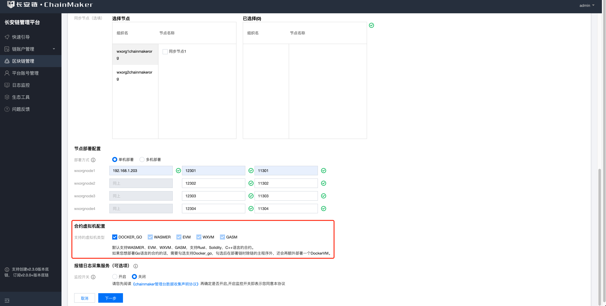
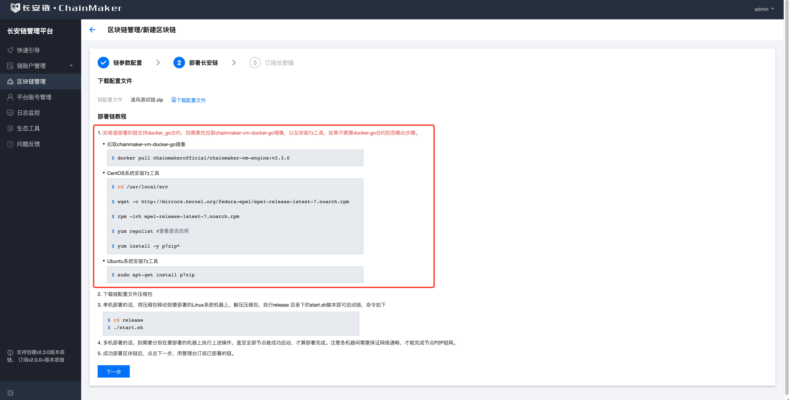

# 启动支持Docker_VM的链

## 通过管理台启动启用Docker虚拟机的链

<a id='3.1.1'></a>

### 登录


- 私有化部署本平台时会生成的对应的admin账号，默认密码为a123456

<a id='3.1.2'></a>

#### 新增组织证书


- 填写组织ID和组织名称
- 组织和和组织名称不能重复
- 支持申请国密和非国密两种证书。


#### 新增节点证书


- 目前节点证书角色分为共识节点和同步节点两种。
- 通过填写节点名称、组织信息，节点角色，申请节点证书。
- 支持申请国密和非国密两种证书。


#### 新增用户证书


- 目前用户证书角色分为admin、client和light三种。
- 通过填写用户名称、组织信息，用户角色申请用户证书。
- 支持申请国密和非国密两种证书。
- 合约部署需要对应的管理员证书，所以需要申请对应的管理员用户

#### 新建区块链




- 选择证书模式
- 链配置文件参数设定
  - 此处用于新增链配置文件，目前支持自定义链的id、名称、区块最大容量，出块间隔、交易过期时长，以及共识配置。
  - 目前支持配置TBFT、RAFT、SOLO、MAXBFT共识。
  - 申请链配置文件前，请先确保，所需的组织和节点证书已经申请/导入本管理平台。
  - 此处需要勾选Docker_VM
  - 支持单机部署和多机部署，请正确填写所要之后要部署区块链节点的机器所在的ip，并确保端口不冲突。

#### 下载部署链


- 如图所示需要先下载安装Docker_VM的环境依赖，然后再部署区块链。
- 部署区块链
  - 下载链配置以zip包为准，zip包包含对应的链配置文件和部署脚本
  - 将下载的包移动的需要部署的机器上去（可以使用scp进行移动）
  - 执行`unzip`解压成`release`包，进入`release`包执行`start.sh`进行启动

#### 快速订阅链


- 链部署成功之后在管理台进行快速订阅

#### 部署/调用合约验证链是否正常
订阅成功后，可进行部署/调用示例合约，以检查链功能是否正常。部署合约的使用教程可详见：[部署示例合约](./部署示例合约.md)。


## 通过命令行启动启用Docker虚拟机的链

### 环境依赖

**操作系统**

DockerVM依赖于cgroup v1，目前仅支持在Linux系统下部署和运行DockerVM。

注：检查系统cgroup版本的方法如下，v2的输出为`cgroup2fs`，v1的输出为`tmpfs`(`ubuntu22.04`版本开始默认为v2)。

```shell
stat -fc %T /sys/fs/cgroup/
```

**软件依赖**

docker，7zip

依赖软件下载：

- docker：请参看[https://docs.docker.com/engine/install/](https://docs.docker.com/engine/install/)
- 7zip：请参看[7zip官网](https://sparanoid.com/lab/7z/)

拉取官方Docker虚拟机镜像：

```shell
docker pull chainmakerofficial/chainmaker-vm-engine:v2.3.5
```

### 生成证书并初始化配置

**启用DockerVM**

在chainmaker中启用Docker VM有两种方式。

**方式一:**

 [通过命令行工具启动链](../recovery/通过命令行工具启动链.md)，在执行`prepare.sh`、`prepare_pk.sh`、`prepare_pwk.sh`时，`enable docker vm` 选择 YES

```shell
enable docker vm (YES|NO(default))
```

- 进入chainmaker-go/scripts目录，执行prepare.sh脚本生成单链4节点集群配置，存于路径chainmaker-go/build中

- prepare_pk.sh脚本支持生成4/7/10/13/16节点公私钥和配置

```shell
# 进入脚本目录
$ cd ../scripts
# 查看脚本帮助
$ ./prepare.sh -h
Usage:
    prepare.sh node_cnt(1/4/7/10/13/16) chain_cnt(1-4) p2p_port(default:11301) rpc_port(default:12301) vm_go_runtime_port(default:32351) vm_go_engine_port(default:22351)
    eg1: prepare.sh 4 1
    eg2: prepare.sh 4 1 11301 12301
    eg2: prepare.sh 4 1 11301 12301 32351 22351

# 生成单链4节点集群的证书和配置
./prepare.sh 4 1
begin check params...
begin generate certs, cnt: 4
input consensus type (0-SOLO,1-TBFT(default),3-MAXBFT,4-RAFT):
input log level (DEBUG|INFO(default)|WARN|ERROR):
enable vm go (YES|NO(default))YES
vm go transport protocol (uds|tcp(default))
input vm go log level (DEBUG|INFO(default)|WARN|ERROR):
config node total 4
begin generate node1 config...
begin node1 chain1 cert config...
begin node1 trust config...
begin generate node2 config...
begin node2 chain1 cert config...
begin node2 trust config...
begin generate node3 config...
begin node3 chain1 cert config...
begin node3 trust config...
begin generate node4 config...
begin node4 chain1 cert config...
begin node4 trust config...

# 查看生成好的节点证书和配置
$ tree -L 3 ../build/
../build/
├── backup
│   ├── backup_certs
│   │   ├── crypto-config_20220816164215
│   │   ├── crypto-config_20220816193731
│   │   ├── crypto-config_20220816193745
│   │   ├── crypto-config_20220817195010
│   │   ├── crypto-config_20220819164151
│   │   ├── crypto-config_20220822204421
│   │   ├── crypto-config_20220823193308
│   │   └── crypto-config_20220823193419
│   ├── backup_config
│   │   └── config_20220823193425
│   └── backup_release
│       ├── release_20220808210208
│       ├── release_20220809203122
│       ├── release_20220816193816
│       ├── release_20220817195117
│       └── release_20220819164434
├── config
│   ├── node1
│   │   ├── certs
│   │   ├── chainconfig
│   │   ├── chainmaker.yml
│   │   └── log.yml
│   ├── node2
│   │   ├── certs
│   │   ├── chainconfig
│   │   ├── chainmaker.yml
│   │   └── log.yml
│   ├── node3
│   │   ├── certs
│   │   ├── chainconfig
│   │   ├── chainmaker.yml
│   │   └── log.yml
│   └── node4
│       ├── certs
│       ├── chainconfig
│       ├── chainmaker.yml
│       └── log.yml
├── crypto-config
│   ├── wx-org1.chainmaker.org
│   │   ├── ca
│   │   ├── node
│   │   └── user
│   ├── wx-org2.chainmaker.org
│   │   ├── ca
│   │   ├── node
│   │   └── user
│   ├── wx-org3.chainmaker.org
│   │   ├── ca
│   │   ├── node
│   │   └── user
│   └── wx-org4.chainmaker.org
│       ├── ca
│       ├── node
│       └── user
├── crypto_config.yml
├── pkcs11_keys.yml
└── release
    ├── chainmaker-v2.3.0-wx-org1.chainmaker.org
    │   ├── bin
    │   ├── config
    │   ├── data
    │   ├── lib
    │   └── log
    ├── chainmaker-v2.3.0-wx-org1.chainmaker.org-20220819164205-x86_64.tar.gz
    ├── chainmaker-v2.3.0-wx-org2.chainmaker.org
    │   ├── bin
    │   ├── config
    │   ├── lib
    │   └── log
    ├── chainmaker-v2.3.0-wx-org2.chainmaker.org-20220819164205-x86_64.tar.gz
    ├── chainmaker-v2.3.0-wx-org3.chainmaker.org
    │   ├── bin
    │   ├── config
    │   ├── lib
    │   └── log
    ├── chainmaker-v2.3.0-wx-org3.chainmaker.org-20220819164205-x86_64.tar.gz
    ├── chainmaker-v2.3.0-wx-org4.chainmaker.org
    │   ├── bin
    │   ├── config
    │   ├── lib
    │   └── log
    ├── chainmaker-v2.3.0-wx-org4.chainmaker.org-20220819164205-x86_64.tar.gz
    └── crypto-config-20220819164205.tar.gz
```


**方式二**

 修改节点配置目录下的`chainmaker.yml`文件（`enable`设置为`true`）:

```yaml
vm:
  go:
    # 是否启用新版Golang容器
    enable: true
```

### DockerVM配置

**配置信息说明**

chainmaker.yml 文件相关配置如下：

```yaml
vm:
  go:
    # 是否启用新版Golang容器
    enable: true
    # 数据挂载路径, 包括合约、sock文件（uds）
    data_mount_path: ../data/wx-org1.chainmaker.org/go
    # 日志挂载路径
    log_mount_path: ../log/wx-org1.chainmaker.org/go
    # chainmaker和合约引擎之间的通信协议（可选tcp/uds）
    protocol: tcp
    # 如果需要自定义高级配置，请将vm.yml文件放入dockervm_config_path中，优先级：chainmaker.yml > vm.yml > 默认配置
    # dockervm_config_path: /config_path/vm.yml
    # 是否在控制台打印日志
    log_in_console: false
    # docker合约引擎的日志级别
    log_level: DEBUG

    # 下面两个server的最大消息发送大小, 默认100MB
    max_send_msg_size: 100
    # 下面两个server的最大消息接收大小, 默认100MB
    max_recv_msg_size: 100
    # 下面两个server的最大连接超时时间, 默认10s
    dial_timeout: 10

    # 合约引擎最多启用的原始合约进程数，默认为20（跨合约调用会额外拉起新的进程）
    max_concurrency: 20

    # 运行时服务器配置 (与合约实例进程交互，进行信息交换)
    runtime_server:
      # 端口号，默认为 32351
      port: 32351

    # 合约引擎服务器配置 (与chainmaker交互，进行交易请求、合约请求等交互)
    contract_engine:
      # 合约引擎服务器ip, 默认为 127.0.0.1
      host: 127.0.0.1
      # 端口号，默认为 22351
      port: 22351
      # 与合约引擎服务器的最大连接数
      max_connection: 5
```

**高级配置**

如果希望使用合约引擎高级配置，需要配置`vm:go`下`dockervm_config_path`中配置文件，配置文件模板如下：

```yaml
########### RPC ###########
rpc:
  chain_rpc_protocol: 1 # chain rpc protocol, 0 for unix domain socket, 1 for tcp(default)
  chain_host: 127.0.0.1 # chain tcp host
  chain_rpc_port: 22351 # chain rpc port, valid when protocol is tcp
  sandbox_rpc_port: 32351 # sandbox rpc port, valid when protocol is tcp
  max_send_msg_size: 100 # max send msg size(MiB)
  max_recv_msg_size: 100 # max recv msg size(MiB)
  server_min_interval: 60s # server min interval
  connection_timeout: 5s # connection timeout time
  server_keep_alive_time: 60s # idle duration before server ping
  server_keep_alive_timeout: 20s # ping timeout

########### Process ###########
process:
  # max original process num,
  # max_call_contract_process_num = max_original_process_num * max_contract_depth (defined in protocol)
  # max_total_process_num = max_call_contract_process_num + max_original_process_num
  max_original_process_num: 20
  exec_tx_timeout: 8s # process timeout while busy
  waiting_tx_time: 200ms # process timeout while tx completed (busy -> idle)
  release_rate: 30 # percentage of idle processes released periodically in total processes (0-100)
  release_period: 10m # period of idle processes released periodically in total processes

########### Log ###########
log:
  contract_engine:
    level: "info"
    console: true
  sandbox:
    level: "info"
    console: true

########### Pprof ###########
pprof:
  contract_engine:
    enable: false
    port: 21215
  sandbox:
    enable: false
    port: 21522

########### Contract ###########
contract:
  max_file_size: 20480 # contract size(MiB)
```

**⚠️注意：**

在容器启动脚本中，`max_concurrency`（最大启用的进程数量）默认为`20`（跨合约调用会额外拉起新的进程）。

如果是在生产环境下，建议根据cpu核数配置这三个参数。

|                 | 8C CPU | 16C CPU | 32C CPU |
| --------------- | ------ | ------- | ------- |
| max_concurrency | 20     | 100     | 1500    |

如果有较多跨合约调用交易，请根据跨合约调用的深度按比例减少`max_concurrency`的值，例如32核系统下，如果有较多两层跨合约调用，则`max_concurrency`值建议设为`750（1500/2）`。

如果使用脚本启动，请按需修改脚本里的参数配置。

### 编译和安装包制作

- 生成证书（prepare.sh脚本）后执行build_release.sh脚本，将编译chainmaker-go模块，并打包生成安装，存于路径chainmaker-go/build/release中

```shell
$ ./build_release.sh
$ tree ../build/release/
../build/release/
├── chainmaker-v2.3.0-wx-org1.chainmaker.org-20220823193812-x86_64.tar.gz
├── chainmaker-v2.3.0-wx-org2.chainmaker.org-20220823193812-x86_64.tar.gz
├── chainmaker-v2.3.0-wx-org3.chainmaker.org-20220823193812-x86_64.tar.gz
├── chainmaker-v2.3.0-wx-org4.chainmaker.org-20220823193812-x86_64.tar.gz
└── crypto-config-20220823193812.tar.gz
```


### 同时启动链和DockerVM

**启动**

- 执行cluster_quick_start.sh脚本，会解压各个安装包，调用bin目录中的start.sh脚本，启动chainmaker节点，并拉起节点需要的DockerVM容器

```shell
$ ./cluster_quick_start.sh normal
```

**查看节点是否存在**

- 查看进程

```shell
$ ps -ef|grep chainmaker | grep -v grep
2058348       1  4 19:40 pts/5    00:00:00 ./chainmaker start -c ../config/wx-org1.chainmaker.org/chainmaker.yml
2059604       1  3 19:40 pts/5    00:00:00 ./chainmaker start -c ../config/wx-org2.chainmaker.org/chainmaker.yml
2060801       1  4 19:40 pts/5    00:00:00 ./chainmaker start -c ../config/wx-org3.chainmaker.org/chainmaker.yml
2062057       1  5 19:40 pts/5    00:00:00 ./chainmaker start -c ../config/wx-org4.chainmaker.org/chainmaker.yml
```

- 查看端口

```shell
$ netstat -lptn | grep 1230
tcp6       0      0 :::12301                :::*                    LISTEN      2058348/./chainmake
tcp6       0      0 :::12302                :::*                    LISTEN      2059604/./chainmake
tcp6       0      0 :::12303                :::*                    LISTEN      2060801/./chainmake
tcp6       0      0 :::12304                :::*                    LISTEN      2062057/./chainmake
```

- 查看DockerVM容器

```shell
$ docker ps | grep "chainmakerofficial/chainmaker-vm-engine:2"
0955ccdb6ebc   chainmakerofficial/chainmaker-vm-engine:v2.3.5   "/bin/startvm"           4 minutes ago   Up 4 minutes                                                               VM-GO-wx-org4.chainmaker.org
b48bbb69e204   chainmakerofficial/chainmaker-vm-engine:v2.3.5   "/bin/startvm"           4 minutes ago   Up 4 minutes                                                               VM-GO-wx-org3.chainmaker.org
727adbb76c58   chainmakerofficial/chainmaker-vm-engine:v2.3.5   "/bin/startvm"           4 minutes ago   Up 4 minutes                                                               VM-GO-wx-org2.chainmaker.org
2c944fb3a1d9   chainmakerofficial/chainmaker-vm-engine:v2.3.5   "/bin/startvm"           4 minutes ago   Up 4 minutes                                                               VM-GO-wx-org1.chainmaker.org
```

- 查看日志

```shell
$ cat ../build/release/*/bin/panic.log
$ cat ../build/release/*/log/system.log
$ cat ../build/release/*/log/system.log |grep "ERROR\|put block\|all necessary"
```


### 独立部署DockerVM虚拟机

**首先去`./build/release`路径下解压各个节点证书及配置的jar包:**

```shell
tar -zxvf chainmaker-v2.3.0-wx-org4.chainmaker.org-20220824115035-x86_64.tar.gz
```

**启动节点1需要的DockerVM**

- 使用*docker-vm-standalone-start.sh*脚本启动DockerVM

```shell
$ ./docker-vm-standalone-start.sh
input path to cache contract files(must be absolute path, default:'./docker-go'): /home/data/wx-org1.chainmaker.org/go
contracts path does not exist, create it or not(y|n): y
input log path(must be absolute path, default:'./log'): /home/log/wx-org1.chainmaker.org/go
log path does not exist, create it or not(y|n): y
input log level(DEBUG|INFO(default)|WARN|ERROR): DEBUG
input expose port(default 22351): 22351
input runtime port(default 32351): 32351
input container name(default 'chainmaker-docker-vm'): VM-GO-wx-org1.chainmaker.org
# 不使用配置文件启动DockerVM，忽略该项
input vm config file path(use default config(default)):
docker-vm config is nil, use default config
start docker vm container
```

- 使用Docker命令启动

```shell
$ docker run -itd \
--net=host \
-v "/home/data/wx-org1.chainmaker.org/go":/mount \
-v "/home/log/wx-org1.chainmaker.org/go":/log \
-e CHAIN_RPC_PROTOCOL="1" \
-e CHAIN_RPC_PORT="22351" \
-e SANDBOX_RPC_PORT="32351" \
-e MAX_SEND_MSG_SIZE="100" \
-e MAX_RECV_MSG_SIZE="100" \
-e MAX_CONN_TIMEOUT="10" \
-e MAX_ORIGINAL_PROCESS_NUM="20" \
-e DOCKERVM_CONTRACT_ENGINE_LOG_LEVEL="DEBUG" \
-e DOCKERVM_SANDBOX_LOG_LEVEL="DEBUG" \
-e DOCKERVM_LOG_IN_CONSOLE="false" \
--name VM-GO-wx-org1.chainmaker.org \
--privileged chainmakerofficial/chainmaker-vm-engine:v2.3.5 \
> /dev/null
```

**然后启动节点1**

```shell
$ ./start.sh -f alone
```

**查看节点和容器是否已经建立链接**

```shell
$ cat /home/log/wx-org1.chainmaker.org/go/go.log |grep "Chain RPC Service"
```

按照上述步骤依次启动剩余节点。

### 使用高级配置独立部署DockerVM

**高级配置**

如果希望使用合约引擎高级配置，需要配置`vm:go`下`dockervm_config_path`高级配置文件路径，这里我们把节点1的DockerVM高级配置文件*vm.yml*放置在`/home/config_path/wx-org1.chainmaker.org`，在*chainmaker.yml*中对应的配置如下：

```yaml
# Contract Virtual Machine(VM) configs
vm:
  # Golang runtime in docker container
  go:
    ...
    # If use a customized VM configuration file, supplement it; else, do not configure
    # Priority: chainmaker.yml > vm.yml > default settings
    dockervm_config_path: /home/config_path/wx-org1.chainmaker.org/vm.yml
   	...
```

配置文件模板如下：

```yaml
########### RPC ###########
rpc:
  chain_rpc_protocol: 1 # chain rpc protocol, 0 for unix domain socket, 1 for tcp(default)
  chain_host: 127.0.0.1 # chain tcp host
  chain_rpc_port: 22351 # chain rpc port, valid when protocol is tcp
  sandbox_rpc_port: 32351 # sandbox rpc port, valid when protocol is tcp
  max_send_msg_size: 100 # max send msg size(MiB)
  max_recv_msg_size: 100 # max recv msg size(MiB)
  server_min_interval: 60s # server min interval
  connection_timeout: 5s # connection timeout time
  server_keep_alive_time: 60s # idle duration before server ping
  server_keep_alive_timeout: 20s # ping timeout

########### Process ###########
process:
  # max original process num,
  # max_call_contract_process_num = max_original_process_num * max_contract_depth (defined in protocol)
  # max_total_process_num = max_call_contract_process_num + max_original_process_num
  max_original_process_num: 20
  exec_tx_timeout: 8s # process timeout while busy
  waiting_tx_time: 200ms # process timeout while tx completed (busy -> idle)
  release_rate: 30 # percentage of idle processes released periodically in total processes (0-100)
  release_period: 10m # period of idle processes released periodically in total processes

########### Log ###########
log:
  contract_engine:
    level: "info"
    console: true
  sandbox:
    level: "info"
    console: true

########### Pprof ###########
pprof:
  contract_engine:
    enable: false
    port: 21215
  sandbox:
    enable: false
    port: 21522

########### Contract ###########
contract:
  max_file_size: 20480 # contract size(MiB)
```

**使用高级配置启动节点需要的DockerVM**

- 使用*docker-vm-standalone-start.sh*脚本启动DockerVM

```shell
$ ./docker-vm-standalone-start.sh
input path to cache contract files(must be absolute path, default:'./docker-go'): /home/data/wx-org1.chainmaker.org/go
contracts path does not exist, create it or not(y|n): y
input log path(must be absolute path, default:'./log'): /home/log/wx-org1.chainmaker.org/go
log path does not exist, create it or not(y|n): y
## 使用配置文件，忽略该项
input log level(DEBUG|INFO(default)|WARN|ERROR):
## 使用配置文件，忽略该项
input expose port(default 22351):
## 使用配置文件，忽略该项
input runtime port(default 32351):
input container name(default 'chainmaker-docker-vm'): VM-GO-wx-org1.chainmaker.org
input vm config file path(use default config(default)): /home/config_path/wx-org1.chainmaker.org/vm.yml
start docker vm container
```

- 使用Docker命令启动DockerVM

```shell
$ docker run -itd \
--net=host \
-v "/home/data/wx-org1.chainmaker.org/go":/mount \
-v "/home/log/wx-org1.chainmaker.org/go":/log \
--name VM-GO-wx-org1.chainmaker.org \
--privileged chainmakerofficial/chainmaker-vm-engine:v2.3.5 \
> /dev/null
```

**启动节点**

```shell
$ ./start.sh -f alone
```

**查看节点是否和DockerVM已经建立连接**

```shell
$ cat /home/log/wx-org1.chainmaker.org/go/go.log |grep "Chain RPC Service"
```

按照上述步骤依次启动剩余节点。

### 本地部署的停止

如果是通过`./cluster_quick_start.sh`同时启动的节点和虚拟机，可以通过对应的stop脚本同时停止链和DockerVM容器：

```shell
$ ./cluster_quick_stop.sh
```

如果同时需要清除所有链数据可以使用：

```shell
$ ./cluster_quick_stop.sh clean
```
由于DockerVM内使用容器内的root用户启动虚拟机服务，因此日志和缓存文件也属于root用户（uid=0）。如果以非root用户启动的程序，清除数据时可能会报错提示缺少文件访问的权限，需要以root权限删除数据，或者使用[userns-remap](https://docs.docker.com/engine/security/userns-remap/)的功能将容器里用户映射成普通用户。


### 独立部署的停止

**首先关闭链节点**

```shell
$ ./stop.sh alone
```

**然后关闭该节点对应的虚拟机**

```shell
$ docker stop VM-GO-wx-org1.chainmaker.org

```


## 使用docker部署支持docker-vm的链

“长安链·ChainMaker”支持Docker-go合约开发，Docker-go合约运行在独立Docker VM容器中，本文将介绍长安链使用docker方式部署时，与Docker-vm通信的几种部署方式。

###  使用docker方式部署ChainMaker:

```sh
cd chainmaker-go
# 清空旧的构建数据
rm -rf build
make docker-build
docker images
```

### 准备链需要的配置文件 

参考 [在工作目录下 使用脚本搭建](../recovery/通过命令行工具启动链.html#runUseScripts)，使用脚本生成docker需要的节点配置文件

```sh
cd chainmaker-go/scripts
./prepare_pk.sh 4 1
./build_release.sh
./cluster_quick_start.sh
./cluster_quick_stop.sh
```

### 复制配置文件到chainmaker docker能读取的位置

docker启动时，默认加载如下路径的配置：chainmaker-go/scripts/docker/config/four-nodes

```sh
cd chainmaker-go/scripts/docker/config/four-nodes
cp -r ../../../../build/release/chainmaker-v2.2.1-wx-org1.chainmaker.org/config/wx-org1.chainmaker.org ./
cp -r ../../../../build/release/chainmaker-v2.2.1-wx-org2.chainmaker.org/config/wx-org2.chainmaker.org ./
cp -r ../../../../build/release/chainmaker-v2.2.1-wx-org3.chainmaker.org/config/wx-org3.chainmaker.org ./
cp -r ../../../../build/release/chainmaker-v2.2.1-wx-org4.chainmaker.org/config/wx-org4.chainmaker.org ./
```

### 修改节点ip地址：

- 场景一：一台host启动4个chainmaker docker node
  需要将配置文件中的ip换成docker容器的ip
  -  分别打开四个节点的chainmaker文件:
  ```sh
  # 查看容器ip ipv4_address: 
  chainmaker-go/scripts/docker] vim four-nodes.docker-compose.yml
  # 修改chainmaker.yml的配置
  chainmaker-go/scripts/docker/config/four-nodes/wx-org1.chainmaker.org] vim chainmaker.yml
  ```
  - 找到如chainmaker.yml的如下位置
  ```yaml
  seeds:
    - "/ip4/127.0.0.1/tcp/11301/p2p/XXX"
    - "/ip4/127.0.0.1/tcp/11302/p2p/XXX"
    - "/ip4/127.0.0.1/tcp/11303/p2p/XXX"
    - "/ip4/127.0.0.1/tcp/11304/p2p/XXX"
  ```
    - 两种修改方式任选其一

    第一种：使用four-nodes.docker-compose.yml中配置的容器ip

     ```yaml
     seeds:
         - "/ip4/172.48.1.11/tcp/11301/p2p/XXX"
         - "/ip4/172.48.1.12/tcp/11302/p2p/XXX"
         - "/ip4/172.48.1.13/tcp/11303/p2p/XXX"
         - "/ip4/172.48.1.14/tcp/11304/p2p/XXX"
     ```

     第二种：使用four-nodes.docker-compose.yml中配置的容器名

     ```yaml
     seeds:
         - "/dns/cm-node1/tcp/11301/p2p/XXX"
         - "/dns/cm-node2/tcp/11302/p2p/XXX"
         - "/dns/cm-node3/tcp/11303/p2p/XXX"
         - "/dns/cm-node4/tcp/11304/p2p/XXX"
     ```

- 场景二：四台host启动4个chainmaker docker node

    参考如上修改方式，ip修改为四台host的ip

### 修改docker-vm相关配置

“长安链·ChainMaker”V2.2.1之后，在节点配置文件chainmaker.yml中关于docker的两种连接方式对应的配置为：

第一种：本地的socket文件

```
uds_open: true
```

第二种：tcp , **当chainmaker使用docker方式部署时，推荐使用这种配置**

```
uds_open: false
```

- 场景一：chainmaker以【docker】方式部署，docker-vm与chainmaker-vm部署在【不同的】host :

  假设：A(192.168.0.9)机器上启动了chainmaker 的docker容器, B(192.168.0.78)机器上启动了对应的docker-vm

  ```sh
    uds_open: false
    docker_vm_host: 192.168.0.78
    docker_vm_port: 22351
  ```

- 场景二：chainmaker以【docker】方式部署，docker-vm与chainmaker-vm部署在【同一台】host:

    假设：A机器上启动了chainmaker的docker容器，同时启动对应的docker-vm
          由于docker-vm和chainmaker在同一台host下，需要保证两个docker环境在使用同一个网桥的情况下ip在同一网段，即处在同一局域网内,例如使用如下命令启动docker-vm

  ```sh
  docker run -d -p22351:22359 --network docker_localnet --ip 172.48.1.21 --privileged chainmakerofficial/chainmaker-vm-docker-go:v2.2.1
  ```

  配置文件修改时，注意端口号为-p22351:22359中的后者， 并且ip 为上面指定的ip

  ```sh
  uds_open: false
    docker_vm_host: 172.48.1.21
    docker_vm_port: 22359
  ```

- 场景三：chainmaker以【进程方式】部署，docker-vm与chainmaker部署在【不同的】host:

  ```shell
  uds_open: false
    docker_vm_host: 192.168.0.78
    docker_vm_port: 22351
  ```

- 场景四：chainmaker以进程方式部署， docker-vm与chainmaker部署在【同一台】host:

  ```sh
  uds_open: false
    docker_vm_host: 127.0.0.1
    docker_vm_port: 22351
  ```


## 合约的安装与调用

合约的安装与调用请参考：[使用Golang进行智能合约开发](./使用Golang进行智能合约开发.md)
