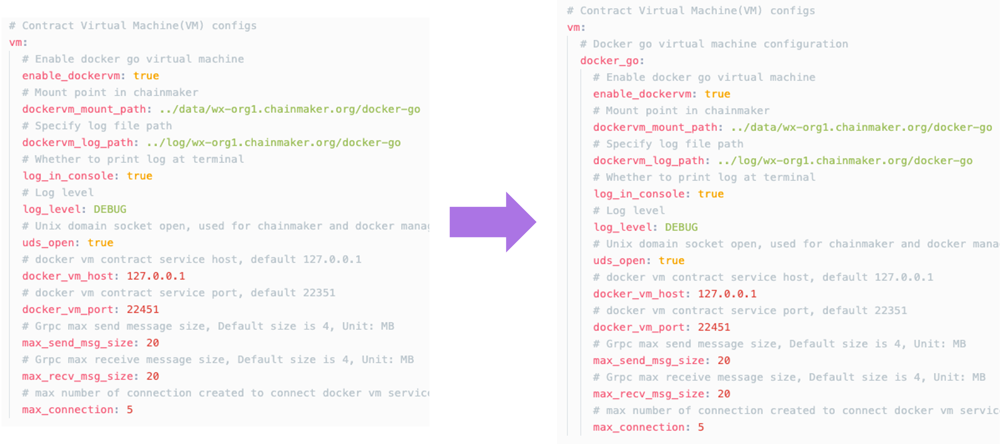

## v2.2.1 -> v2.3.0版本升级指南

若未选用`docker-vm`虚拟机引擎，则直接参考：[通用升级步骤参考](#upgradeStep) 。

版本v2.3.0进行了Docker Go合约引擎重构升级，相比之前的版本具有一定的性能和稳定性提升，支持多语言跨合约调用，推荐升级到v2.3.0版本。v2.3.0之前的Docker Go合约文件需要参考[v2.3.0合约升级指南](#upgradeDockerContract-v2.3.0)进行修改并升级。

### 升级 Docker Go 虚拟机

本次重构升级需要替换启停脚本、更新配置文件、更新合约引擎镜像、升级合约。针对各种应用场景的升级流程如下（更新详细操作见下方）：

* **从v2.2.x版本 chainmaker-go升级到v2.3.0，只使用v2.3.0合约SDK**
  - 拉取vm-engine镜像；
  - 执行`stop.sh`停止v2.2.x版本 chainmaker-go；
  - 替换`start.sh`、`stop.sh`和`restart.sh`为最新版本，更换chainmaker-go二进制文件为v2.3.0版本；
  - 编辑`chainmaker.yml`，将`vm:docker_go`部分替换为新版`vm:go`部分，参考[《vm go配置》](../instructions/启动支持旧版本Docker_VM的链.html#dockervm)；
  - 执行`start.sh`启动v2.3.0版本 chainmaker-go；
  - 将原有合约通过v2.3.0的contract-sdk-go重新编译升级。

* **从v2.2.x版本 chainmaker-go升级到v2.3.0，只使用v2.2.x合约SDK**
  - 升级vm-docker-go镜像；
  - 执行`stop.sh`停止v2.2.x版本 chainmaker-go；
  - 替换`start.sh`、`stop.sh`和`restart.sh`为最新版本，更换chainmaker-go二进制文件为v2.3.0版本；
  - 编辑`chainmaker.yml`，将原来`vm`下内容移到`vm`下`docker_go`部分，参考[《配置迁移》](../instructions/启动支持旧版本Docker_VM的链.html#migration-docker_vm-configuration)；
  - 执行`start.sh alone`启动v2.3.0版本 chainmaker-go。

* **从v2.2.x版本 chainmaker-go升级到v2.3.0，同时使用v2.2.x和v2.3.0合约SDK**
  - 拉取vm-engine镜像，升级vm-docker-go镜像；
  - 执行`stop.sh`停止v2.2.x版本 chainmaker-go；
  - 替换`start.sh`、`stop.sh`和`restart.sh`为最新版本，更换chainmaker-go二进制文件为v2.3.0版本；
  - 编辑`chainmaker.yml`，将原来`vm`下内容移到`vm`下`docker_go`部分，同时新增`go`部分；
  - 执行`start.sh`启动v2.3.0版本 chainmaker-go；
  - 新合约通过v2.3.0版本的contract-sdk-go编译。


具体如下：

1. **更新镜像**

   如果需要使用`v2.3.0`版本合约SDK，需要更新镜像chainmakerofficial/chainmaker-vm-engine，命令如下：

   ```shell
   docker pull chainmakerofficial/chainmaker-vm-engine:v2.3.0.1
   ```

   如果需要继续使用`v2.2.x`版本合约SDK，需要更新镜像chainmakerofficial/chainmaker-vm-docker-go，命令如下：

   ```shell
   docker pull chainmakerofficial/chainmaker-vm-docker-go:v2.3.0.1
   ```

2. **替换启停脚本**

   如果Docker VM是本机部署，在编译替换chainmaker的时候，需要同时替换下bin目录下的`start.sh, stop.sh, restart.sh`三个脚本，脚本会处理合约虚拟机的拉起和停止。脚本由`build_release.sh`生成，可以参考[《编译和安装包制作》](../instructions/启动支持旧版本Docker_VM的链.html#id11)。

   如果Docker VM是独立部署（比如部署在其他host），可以参考[《独立部署DockerVM》](../instructions/启动支持旧版本Docker_VM的链.html#id13)。


3. **更新配置文件**

   v2.3.0版本中chainmaker.yml中vm相关的配置项以虚拟机类型进行分类配置，旧版本相关配置划入"docker_go"中，新版本划入"go"中。

    3.1 ***继续使用旧版合约引擎/合约***

    如果希望继续使用旧版合约，请将之前的配置粘贴在`vm`模块的`docker_go`下方。配置如下

    <span id="docker_vm_update_config"></span>

    ```yaml
   # Contract Virtual Machine(VM) configs
   vm:
     # Docker go virtual machine configuration
     docker_go:
       # Enable docker go virtual machine
       enable_dockervm: true
       # Mount point in chainmaker
       dockervm_mount_path: ../data/wx-org1.chainmaker.org/docker-go
       # Specify log file path
       dockervm_log_path: ../log/wx-org1.chainmaker.org/docker-go
       # Whether to print log at terminal
       log_in_console: true
       # Log level
       log_level: DEBUG
       # Unix domain socket open, used for chainmaker and docker manager communication
       uds_open: true
       # docker vm contract service host, default 127.0.0.1
       docker_vm_host: 127.0.0.1
       # docker vm contract service port, default 22351
       docker_vm_port: 22451
       # Grpc max send message size, Default size is 4, Unit: MB
       max_send_msg_size: 20
       # Grpc max receive message size, Default size is 4, Unit: MB
       max_recv_msg_size: 20
       # max number of connection created to connect docker vm service
       max_connection: 5
    ```

    具体迁移方式如下：

    

    如果希望废弃旧合约的安装或升级，只使用新合约，请添加或修改下面的配置：

    ```yaml
   # Contract Virtual Machine(VM) configs
   vm:
     # Docker go virtual machine configuration
     docker_go:
       # Grpc max receive message size, Default size is 4, Unit: MB
       disable_install: true
       # max number of connection created to connect docker vm service
       disable_upgrade: true
    ```

    3.2 ***使用新版合约引擎/合约***

    新版合约引擎/合约的配置方式请参考[《v2.3.0合约引擎配置》](../instructions/启动支持旧版本Docker_VM的链.html#dockervm)

   <span id="upgradeDockerContract-v2.3.0"></span>

4. **合约升级（必须）**

   在[通用升级步骤参考](#upgradeStep)第7步启动链成功之后，**必须**更新合约SDK。

   更新合约SDK镜像（chainmakerofficial/contract-sdk-go）至v2.3.0版本，命令如下：

   ```go
    docker pull chainmakerofficial/contract-sdk-go:v2.3.0
   ```

   如果是v2.3.0之前的合约文件则对合约源码进行如下修改并升级：[【合约编译步骤参考】](../instructions/使用Golang进行智能合约开发.html#id4)：

   v2.1.0版本合约源码示例如下：

   ```go
   package main
   
   import (
   	"encoding/json"
   	"log"
   	"strconv"
   
   	"chainmaker.org/chainmaker/chainmaker-contract-sdk-docker-go/pb/protogo"
   	"chainmaker.org/chainmaker/chainmaker-contract-sdk-docker-go/shim"
   )
   
   type FactContract struct {
   }
   
   // --snip--
   
   func (f *FactContract) InitContract(stub shim.CMStubInterface) protogo.Response {
   	return shim.Success([]byte("Init Success"))
   }
   
   func (f *FactContract) InvokeContract(stub shim.CMStubInterface) protogo.Response {
   	// 获取参数
   	method := string(stub.GetArgs()["method"])
   	switch method {
   	case "save":
   		return f.save(stub)
   	case "findByFileHash":
   		return f.findByFileHash(stub)
   	default:
   		return shim.Error("invalid method")
   	}
   }
   
   func (f *FactContract) save(stub shim.CMStubInterface) protogo.Response {
   	params := stub.GetArgs()
   
   	// --snip--
     
   	stub.EmitEvent("topic_vx", []string{fact.FileHash, fact.FileName})
   	
     // --snip--
   }
   
   // --snip--
   
   func main() {
   
   	err := shim.Start(new(FactContract))
   	if err != nil {
   		log.Fatal(err)
   	}
   }
   ```

   v2.3.0 版本合约源码需要修改至如下格式：

   ```go
   package main
   
   import (
   	"encoding/json"
   	"log"
   	"strconv"
   
   	"chainmaker.org/chainmaker/contract-sdk-go/v2/pb/protogo"
   	"chainmaker.org/chainmaker/contract-sdk-go/v2/sandbox"
   	"chainmaker.org/chainmaker/contract-sdk-go/v2/sdk"
   )
   
   type FactContract struct {
   }
   
   func (f *FactContract) InitContract() protogo.Response {
   	return sdk.Success([]byte("init success"))
   }
   
   func (f *FactContract) UpgradeContract() protogo.Response {
   	return sdk.Success([]byte("upgrade success"))
   }
   
   func (f *FactContract) InvokeContract(method string) protogo.Response {
   
   	switch method {
   	case "save":
   		return f.save()
   	case "findByFileHash":
   		return f.findByFileHash()
   	default:
   		return sdk.Error("invalid method")
   	}
   }
   
   func (f *FactContract) save() protogo.Response {
   	params := sdk.Instance.GetArgs()
   	
     // --snip--
     
   	sdk.Instance.EmitEvent("topic_vx", []string{fact.FileHash, fact.FileName})
     
     // --snip--
   }
   
   // --snip--
   
   func main() {
   
   	err := sandbox.Start(new(FactContract))
   	if err != nil {
   		log.Fatal(err)
   	}
   }
   ```

   变更如下：

   1. package import 路径变更
   2. 新增`Contract`合约接口方法`UpgradeContract`，合约升级时由调用`InitContract`改为调用`UpgradeContract`
   3. 更新`Contract`合约接口方法`InvokeContract`，由之前的传递`CMStubInterface`来获取method，改为入参传递method，无需再传递stub手动获取method
   4. SDK使用方式变更，由之前每个函数入参传递一个`CMStubInterface`实例来使用SDK接口方法改为通过`sdk.Instance`全局变量来使用SDK提供的接口方法。更多合约信息请参看[《使用Golang进行智能合约开发》](../instructions/使用Golang进行智能合约开发.md)

