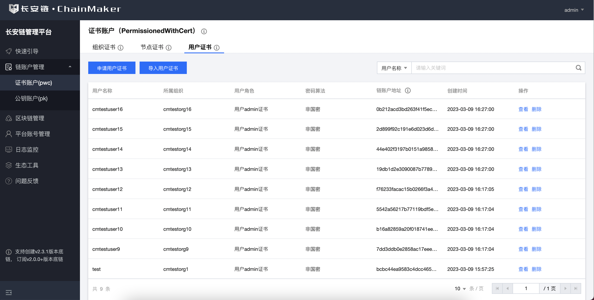
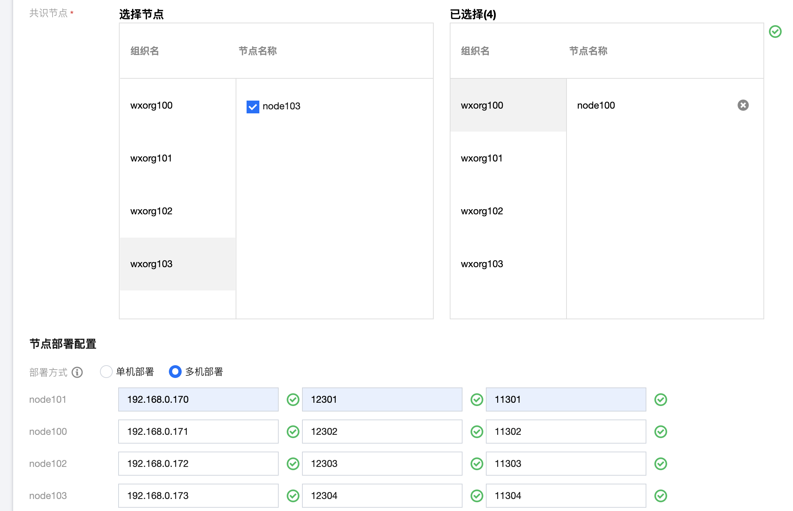

## 多机部署（普通证书模式）

> 多机之间，需要先把网络策略打开，保证网络通畅

### 通过管理台进行多机部署（普通证书模式）

#### 组织、节点、用户证书申请


- 请在管理台链账户管理-证书管理模块生成所需的组织证书、节点证书和用户证书，相关教程可见长安链管理台使用说明-证书管理章节。

#### 新建链


- 节点部署选择多机部署，使用不同的ip

#### 部署链
- 将链进行下载，然后将链部署到对应的机器上

```
# 进入下载目录
$ cd download

# 同步链到部署机器上
$ scp chain1.zip root@192.168.0.170:/data/multiMachineDeployment
...

# 进入链当前目录
$ ssh root@192.168.0.170
$ cd /data/multiMachineDeployment
# 解压
$ unzip chain1.zip
# 进入当前部署机器的节点，启动当前节点
$ cd release/wx-org1.chainmaker.org-node1/bin/ && sh start.sh
```

### 通过命令行进行多机部署（普通证书模式）

#### 证书生成

- 进入chainmaker-go/scripts目录，执行prepare.sh脚本生成单链4节点集群配置，存于路径chainmaker-go/build中

```
# 进入脚本目录
$ cd ../scripts
# 查看脚本帮助
$ ./prepare.sh -h
Usage:  
  prepare.sh node_cnt(1/4/7/10/13/16) chain_cnt(1-4) p2p_port(default:11301) rpc_port(default:12301)
    eg1: prepare.sh 4 1
    eg2: prepare.sh 4 1 11301 12301

# 生成单链4节点集群的证书和配置
$ ./prepare.sh 4 1
begin check params...
begin generate certs, cnt: 4
input consensus type (0-SOLO,1-TBFT(default),3-HOTSTUFF,4-RAFT,5-DPOS):
input log level (DEBUG|INFO(default)|WARN|ERROR):
enable docker vm (YES|NO(default))
begin generate node1 config...
begin generate node2 config...
begin generate node3 config...
begin generate node4 config...

# 查看生成好的节点证书和配置
$ tree -L 3 ../build/
../build/
├── config
│   ├── node1
│   │   ├── certs
│   │   ├── chainconfig
│   │   ├── chainmaker.yml
│   │   └── log.yml
│   ├── node2
│   │   ├── certs
│   │   ├── chainconfig
│   │   ├── chainmaker.yml
│   │   └── log.yml
│   ├── node3
│   │   ├── certs
│   │   ├── chainconfig
│   │   ├── chainmaker.yml
│   │   └── log.yml
│   └── node4
│       ├── certs
│       ├── chainconfig
│       ├── chainmaker.yml
│       └── log.yml
├── crypto-config
│   ├── wx-org1.chainmaker.org
│   │   ├── ca
│   │   ├── node
│   │   └── user
│   ├── wx-org2.chainmaker.org
│   │   ├── ca
│   │   ├── node
│   │   └── user
│   ├── wx-org3.chainmaker.org
│   │   ├── ca
│   │   ├── node
│   │   └── user
│   └── wx-org4.chainmaker.org
│       ├── ca
│       ├── node
│       └── user
└── crypto_config.yml
```


#### 修改节点对应`chainmaker.yml`
> 修改`build/config/nodeN`中所有的`chainmaker.yml` 如：build\config\node1\chainmaker.yml

```
net:
  provider: LibP2P
  listen_addr: /ip4/0.0.0.0/tcp/11301
  seeds:
    - "/ip4/127.0.0.1/tcp/11301/p2p/QmeSqRL6N4ZB4YwYho4eBXX3YzHZbtjTh2jashqLZmSPw7"
    - "/ip4/127.0.0.1/tcp/11302/p2p/QmNwkeUaJ4153by2Uf1GDsjHw9W25B8gRjkruoMuCjAGdB"
    - "/ip4/127.0.0.1/tcp/11303/p2p/QmcTJ231F9gTwrNGK8Pm4raSZLWLD1GR7Ura8YoEdeBzMr"
    - "/ip4/127.0.0.1/tcp/11304/p2p/QmSAqwDyHDo9RqTB75ZkKiyRGh1T1onHgJdnXhQKxp79Sx"
```
将net.seeds下 `/ip4/127.0.0.1/tcp/11301/p2p/QmeSqRL6N4ZB4YwYho4eBXX3YzHZbtjTh2jashqLZmSPw7` 修改为部署机器的ip/域名和port
```
eg:
 - "/ip4/192.168.0.1/tcp/11301/p2p/QmeSqRL6N4ZB4YwYho4eBXX3YzHZbtjTh2jashqLZmSPw7"
 - "/dns/cm-node1.com/tcp/11301/p2p/QmeSqRL6N4ZB4YwYho4eBXX3YzHZbtjTh2jashqLZmSPw7"
```
#### 编译和安装包制作
- 生成证书（prepare.sh脚本）后执行build_release.sh脚本，将编译chainmaker-go模块，并打包生成安装，存于路径chainmaker-go/build/release中
```
$ ./build_release.sh
$ tree ../build/release/
../build/release/
├── chainmaker-v2.0.0-wx-org1.chainmaker.org-20210406194833-x86_64.tar.gz
├── chainmaker-v2.0.0-wx-org2.chainmaker.org-20210406194833-x86_64.tar.gz
├── chainmaker-v2.0.0-wx-org3.chainmaker.org-20210406194833-x86_64.tar.gz
├── chainmaker-v2.0.0-wx-org4.chainmaker.org-20210406194833-x86_64.tar.gz
└── crypto-config-20210406194833.tar.gz
```

#### 节点启动
- 通过scp复制节点到部署的机器上，进入部署机器进行解压，然后启动节点内部bin目录下start.sh脚本
```
$ scp ./xxx.tar.gz username@ip:/路径
$ tar -zxvf xxx.tar.gz
$ cd xxx/bin && ./start.sh
```
- 若需要关闭节点，在部署机器上的节点bin目录下启动stop.sh脚本：

```
$ ./stop.sh
```

###  视频教程

<a href="https://www.bilibili.com/video/BV1vU4y1v78r/" target="_blank" title="点击跳转至播放页面" ></a>

视频地址: <a href="https://www.bilibili.com/video/BV1vU4y1v78r/"  target="_blank">  多机部署 </a>
