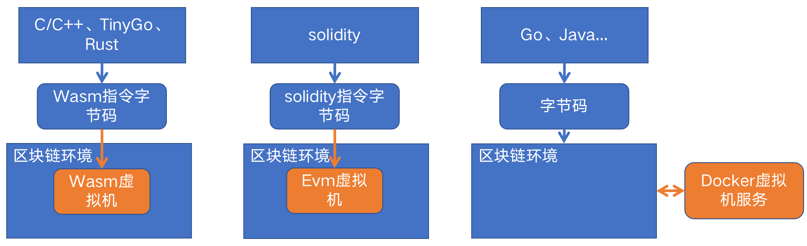
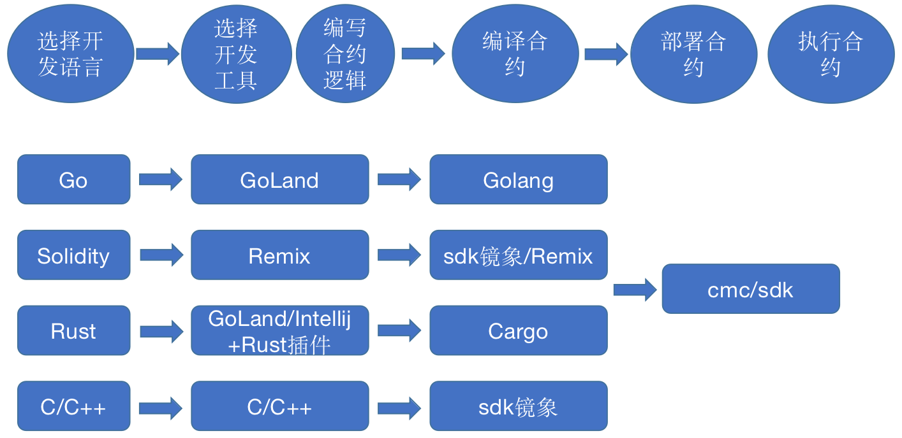

# 长安链智能合约开发整体介绍

## 长安链智能合约简介
“长安链·ChainMaker”智能合约是运行在长安链上的一组“动态代码”。可以认为它是长安链上承载具体业务场景和逻辑的软件实现，特点是以长安链为执行的输入和输出环境，可以动态地部署和使用。目前长安链已经支持使用Golang、Rust、Solidity、TinyGo、C++进行智能合约开发，很快将支持Java。本章节将介绍各种语言合约的编写环境、编写、编译以及部署等相关知识。

“长安链·ChainMaker”的智能合约类型根据使用的运行时类型，整体上可以分为Wasm、Solidity和基于Docker运行的合约三个大类，其中Wasm类型的合约包含Rust、TinyGo和C++三种开发语言，这一类型的合约需要先将智能合约使用对应的工具编译成Wasm文件，然后进行部署和调用；Solidtiy合约和以太坊类似，先编译成Solidity字节码，然后再进行部署和调用；基于Docker类型的合约包括Golang和Java语言合约（Java语言的合约支持在开发中，后续可能会扩展更多其他合约语言），Go合约直接编译成平台机器码压缩后进行部署和调用，Java类型的合约也是编译成Java字节码进行部署和调用。三种类型合约的执行原理如下图：

“长安链·ChainMaker”官方当前推荐的合约编程语言依次为Golang、Rust、Solidity、TinyGo和C++。其中Golang合约编程限制少（除开发注意事项中的限制外，可以使用所有Go语言的特性），运行时环境DockerGo虚拟机也是长安链自研的支持微服务化部署的高性能虚拟机，为第一推荐编程语言。
## 智能合约的开发过程
“长安链·ChainMaker”智能合约的开发需要经过选择开发语言、开发工具、编写合逻辑代码、编译合约、部署合约和调用合约几个过程，长安链提供了整套合约开发过程推荐的工具，如下图所示：

## 智能合约开发注意事项
### 通用部分
1. 智能合约中不要使用带有随机性的函数，以避免在不同的机器上合约执行结果不一致，从而导致交易无法达成共识，例如Golang常用的随机数函数包math/rand、获取系统时间的函数time.Now()和time.Date。
2. 智能合约中不要使用全局变量、静态变量，同一合约进程会执行多次交易，可能造成变量污染，全局变量对后续交易造成影响。需要将合约的函数设计成无状态的，每次运行结果具有确定性，不依赖于全局变量或者静态变量。
3. 智能合约中不要使用变量地址作为Key或value进行存储，不能包含成员变量，否则会引入随机性，导致无法共识。
4. 智能合约不能读写文件，否则可能造成无法共识。
5. 智能合约不能调用网络相关功能，否则可能造成无法共识。
3. 智能合约中避免使用多线程（或者多协程），避免出现随机性，从而导致交易无法达成共识。
4. 智能合约中状态数据key、field内容仅支持数字、字母以及._-。
5. 使用Golang编写合约时，应避免在合约中捕获panic异常输出，合约进程如果panic，栈信息会自动输出到合约产生的log中去。
6. 状态数据key、filed 字符串长度限制为1024，超出该长度将存储失败。
7. 合约中使用map作为迭代器，由于map是无序的，遍历可能会引入随机因素，可以使用有序的迭代器代替map，或二次确认使用map未带来随机因素。
8. 合约中应谨慎使用密码学函数：不使用对称加解密，避免密钥泄漏；不使用非对称加密函数，避免随机性；不使用非对称解密函数，避免私钥泄漏；不使用签名函数，避免私钥泄漏。可使用的是验签。

### Golang部分
1. 合约必须包含InitContract函数，否则合约无法安装。
2. 合约必须包含UpgradeContract函数，否则合约无法升级。

### CPP部分
1. 在安装**CPP**智能合约时，要求共识节点、非共识节点必须安装GCC。

### TinyGo部分
1. **TinyGo**对wasm的支持不太完善，对内存逃逸分析、GC等方面有不足之处，比较容易造成栈溢出。在开发合约时，应尽可能减少循环、内存申请等业务逻辑，使变量的栈内存地址在64K以内，要求tinygo version >= 0.17.0，推荐使用0.17.0。
2. **TinyGo**对导入的包支持有限，请参考：https://tinygo.org/lang-support/stdlib/，对列表中显示已支持的包，实际测试发现支持的并不完整，会发生一些错误，需要在实际开发过程中进行测试检验。
3. **TinyGo**引擎不支持`fmt`和`strconv`包。

## 智能合约开发语言和虚拟机

“长安链·ChainMaker”目前已经支持使用Golang、Rust、Solidity、TinyGo、C++进行智能合约开发，每种开发语言实现的合约由不同的虚拟机执行，在将合约发布到链上时通过Runtime Type来指定虚拟机类型，语言和类型的对应关系如下：

| 语言       | 类型                        |
|----------|---------------------------|
| 系统合约     | RuntimeType_NATIVE = 1    |
| Rust     | RuntimeType_WASMER = 2    |
| C++      | RuntimeType_WXVM = 3      |
| TinyGo   | RuntimeType_GASM = 4      |
| Solidity | RuntimeType_EVM = 5       |
| Golang   | RuntimeType_DOCKER_GO = 6 |

## 智能合约生命周期
长安链对智能合约有完善的生命周期管理，包括合约部署、升级、
合约可以使用命令行工具安装、调用、查询合约，请参看：[【命令行工具】](../dev/命令行工具.md)，也可使用SDK进行合约的安装、调用、查询，请参看：[【SDK】](../sdk/GoSDK使用说明.md)
