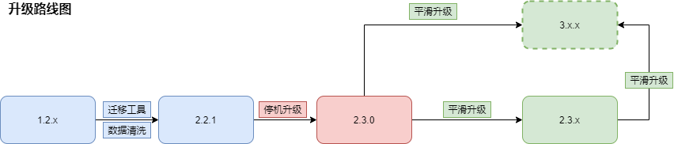

# 版本升级说明

## 概述

本文档主要描述将旧版本chainmaker升级为新版本的步骤，正常情况下，伴随着新版发布，都会有相应的升级描述。本文档根据版本号倒序排版，即最新版本升级描述会在最前面，请读者注意。

1.2.x升级到2.x版本需要先迁移到2.2.1版本。

2.3.0以前的版本想要升级到2.3.0以后，需要先升级到2.3.0过度。



> 说明：升级时尽量采用逐个版本升级的方式，尽量不要一次性跳跃升级。


## v2.3.5 -> v2.3.6版本升级指南
直接参考 v2.3.4 -> v2.3.5版本升级指南即可，chainmaker-vm-engine版本与v2.3.5一致。

## v2.3.4 -> v2.3.5版本升级指南
### 平滑升级
从v2.3.1版开始，支持了区块链网络的平滑升级，逐个将区块链网络中的节点升级为新版本，而在升级过程中区块链网络始终保持正常的接收交易和打包区块。
从v2.3.4平滑升级v2.3.5具体操作步骤如下：

**1.查看链配置，确保链版本为v2.3.4**

使用cmc的链配置查看命令，查看当前链配置的版本（**此时二进制文件还没有替换**）
```
./cmc client chainconfig query \
--sdk-conf-path=./testdata/sdk_config.yml
```
其中返回的"version"字段如果是"2030400"则直接进入下一步，如果不是，则需要通过之前的版本升级方式先升级至v2.3.4版本。

**2.停止并替换二进制**

如果您需要保持区块链网络的持续运行，可以修改客户端连接，将交易发送到另一个节点，然后使用`stop.sh`停止一个节点（需要停止虚拟机），然后替换二进制。如果是基于Docker或者K8s则停用容器或Pod，然后更新Docker镜像为v2.3.5版本。

**3.升级 Docker Go 虚拟机**

如果您使用vm-engine镜像，请更新chainmakerofficial/chainmaker-vm-engine，命令如下：

```
docker pull chainmakerofficial/chainmaker-vm-engine:v2.3.5
```

如果您使用vm-docker-go镜像，请更新chainmakerofficial/chainmaker-vm-docker-go，命令如下：

```
docker pull chainmakerofficial/chainmaker-vm-docker-go:v2.3.1
```

**4.启动节点和Docker Go虚拟机**

如果您使用了Docker Go虚拟机：

- 如果Docker Go是本机部署，需要同时替换下bin目录下的`start.sh`脚本，脚本会处理新合约虚拟机的拉起和停止。脚本由`build_release.sh`生成，可以参考[《编译和安装包制作》](../instructions/启动支持Docker_VM的链.html#id11)；
- 如果Docker Go是独立部署（比如部署在其他host），可以参考[《独立部署DockerVM》](../instructions/启动支持Docker_VM的链.html#id13)。

重新执行`start.sh`脚本启动节点（需要启动虚拟机）。

**5.逐个替换所有节点的二进制和DockerGo虚拟机**

针对链中的每一个共识节点和同步节点，逐个执行步骤2、3、4的操作，也就是行：停止->替换->启动 操作，确保所有节点都已经升级为最新版本。

**6.更新链配置，设置链版本为2030500**

当所有共识节点都升级完二进制后，使用cmc更新链配置version到最新的2030500
```
./cmc client contract user invoke \
--contract-name=CHAIN_CONFIG \
--method=UPDATE_VERSION \
--params="{\"block_version\":\"2030500\"}" \
--sdk-conf-path=./testdata/sdk_config.yml \
--sync-result=true \
--admin-key-file-paths=./testdata/crypto-config/wx-org1.chainmaker.org/user/admin1/admin1.sign.key,./testdata/crypto-config/wx-org2.chainmaker.org/user/admin1/admin1.sign.key,./testdata/crypto-config/wx-org3.chainmaker.org/user/admin1/admin1.sign.key \
--admin-crt-file-paths=./testdata/crypto-config/wx-org1.chainmaker.org/user/admin1/admin1.sign.crt,./testdata/crypto-config/wx-org2.chainmaker.org/user/admin1/admin1.sign.crt,./testdata/crypto-config/wx-org3.chainmaker.org/user/admin1/admin1.sign.crt
```
**7.检查升级是否成功**

更新链配置后，正常发起业务交易，系统会打包新区块，通过cmc查询最新区块，关注header中的block_version字段，如果该值为2030500，则说明平滑升级成功。
```
./cmc query block-by-height  --sdk-conf-path=./testdata/sdk_config.yml
```


## v2.3.3 -> v2.3.4版本升级指南
### 平滑升级
从v2.3.1版开始，支持了区块链网络的平滑升级，逐个将区块链网络中的节点升级为新版本，而在升级过程中区块链网络始终保持正常的接收交易和打包区块。
从v2.3.3平滑升级v2.3.4具体操作步骤如下：

**1.查看链配置，确保链版本为v2.3.3**

使用cmc的链配置查看命令，查看当前链配置的版本（**此时二进制文件还没有替换**）
```
./cmc client chainconfig query \
--sdk-conf-path=./testdata/sdk_config.yml
```
其中返回的"version"字段如果是"2030300"则直接进入下一步，如果不是，则需要通过之前的版本升级方式先升级至v2.3.3版本。

**2.停止并替换二进制**

如果您需要保持区块链网络的持续运行，可以修改客户端连接，将交易发送到另一个节点，然后使用`stop.sh`停止一个节点（需要停止虚拟机），然后替换二进制。如果是基于Docker或者K8s则停用容器或Pod，然后更新Docker镜像为v2.3.4版本。

**3.升级 Docker Go 虚拟机**

如果您使用vm-engine镜像，请更新chainmakerofficial/chainmaker-vm-engine，命令如下：

```
docker pull chainmakerofficial/chainmaker-vm-engine:v2.3.4
```

如果您使用vm-docker-go镜像，请更新chainmakerofficial/chainmaker-vm-docker-go，命令如下：

```
docker pull chainmakerofficial/chainmaker-vm-docker-go:v2.3.1
```

**4.启动节点和Docker Go虚拟机**

如果您使用了Docker Go虚拟机：

- 如果Docker Go是本机部署，需要同时替换下bin目录下的`start.sh`脚本，脚本会处理新合约虚拟机的拉起和停止。脚本由`build_release.sh`生成，可以参考[《编译和安装包制作》](../instructions/启动支持Docker_VM的链.html#id11)；
- 如果Docker Go是独立部署（比如部署在其他host），可以参考[《独立部署DockerVM》](../instructions/启动支持Docker_VM的链.html#id13)。

重新执行`start.sh`脚本启动节点（需要启动虚拟机）。

**5.逐个替换所有节点的二进制和DockerGo虚拟机**

针对链中的每一个共识节点和同步节点，逐个执行步骤2、3、4的操作，也就是行：停止->替换->启动 操作，确保所有节点都已经升级为最新版本。

**6.更新链配置，设置链版本为2030400**

当所有共识节点都升级完二进制后，使用cmc更新链配置version到最新的2030400
```
./cmc client contract user invoke \
--contract-name=CHAIN_CONFIG \
--method=UPDATE_VERSION \
--params="{\"block_version\":\"2030400\"}" \
--sdk-conf-path=./testdata/sdk_config.yml \
--sync-result=true \
--admin-key-file-paths=./testdata/crypto-config/wx-org1.chainmaker.org/user/admin1/admin1.sign.key,./testdata/crypto-config/wx-org2.chainmaker.org/user/admin1/admin1.sign.key,./testdata/crypto-config/wx-org3.chainmaker.org/user/admin1/admin1.sign.key \
--admin-crt-file-paths=./testdata/crypto-config/wx-org1.chainmaker.org/user/admin1/admin1.sign.crt,./testdata/crypto-config/wx-org2.chainmaker.org/user/admin1/admin1.sign.crt,./testdata/crypto-config/wx-org3.chainmaker.org/user/admin1/admin1.sign.crt
```
**7.检查升级是否成功**

更新链配置后，正常发起业务交易，系统会打包新区块，通过cmc查询最新区块，关注header中的block_version字段，如果该值为2030400，则说明平滑升级成功。
```
./cmc query block-by-height  --sdk-conf-path=./testdata/sdk_config.yml
```


## v2.3.2 -> v2.3.3版本升级指南
### 平滑升级
从v2.3.1版开始，支持了区块链网络的平滑升级，逐个将区块链网络中的节点升级为新版本，而在升级过程中区块链网络始终保持正常的接收交易和打包区块。
理论上可以由v2.3.1版本直接升级为v2.3.3版本，但稳妥起见，建议先从v2.3.1升级到v2.3.2，再由v2.3.2升级至v2.3.3。

从v2.3.2平滑升级v2.3.3具体操作步骤如下：

**1.更新链配置，确保链版本为v2.3.2**

使用cmc的链配置查看命令，查看当前链配置的版本（**此时二进制文件还没有替换**）
```
./cmc client chainconfig query \
--sdk-conf-path=./testdata/sdk_config.yml
```
其中返回的"version"字段如果是"2030200"则直接进入下一步，如果不是，则需要执行以下命令修改链配置中的版本：
```
./cmc client contract user invoke \
--contract-name=CHAIN_CONFIG \
--method=UPDATE_VERSION \
--params="{\"block_version\":\"2030200\"}" \
--sdk-conf-path=./testdata/sdk_config.yml \
--sync-result=true \
--admin-key-file-paths=./testdata/crypto-config/wx-org1.chainmaker.org/user/admin1/admin1.sign.key,./testdata/crypto-config/wx-org2.chainmaker.org/user/admin1/admin1.sign.key,./testdata/crypto-config/wx-org3.chainmaker.org/user/admin1/admin1.sign.key \
--admin-crt-file-paths=./testdata/crypto-config/wx-org1.chainmaker.org/user/admin1/admin1.sign.crt,./testdata/crypto-config/wx-org2.chainmaker.org/user/admin1/admin1.sign.crt,./testdata/crypto-config/wx-org3.chainmaker.org/user/admin1/admin1.sign.crt
```
执行成功后可以再次查询链配置中的version字段，确保version值为 “2030200"。

<span id="build_state_bloon_filter"></span>

**3.停止并替换二进制**

如果您需要保持区块链网络的持续运行，可以修改客户端连接，将交易发送到另一个节点，然后使用`stop.sh`停止一个节点（需要停止虚拟机），然后替换二进制。如果是基于Docker或者K8s则停用容器或Pod，然后更新Docker镜像为v2.3.3版本。

**4.升级 Docker Go 虚拟机**

如果您使用vm-engine镜像，请更新chainmakerofficial/chainmaker-vm-engine，命令如下：

```
docker pull chainmakerofficial/chainmaker-vm-engine:v2.3.3
```

如果您使用vm-docker-go镜像，请更新chainmakerofficial/chainmaker-vm-docker-go（理论上是没有变化的，但建议更新），命令如下：

```
docker pull chainmakerofficial/chainmaker-vm-docker-go:v2.3.1
```

**5.启动节点和Docker Go虚拟机**

如果您使用了Docker Go虚拟机：

- 如果Docker Go是本机部署，需要同时替换下bin目录下的`start.sh`脚本，脚本会处理新合约虚拟机的拉起和停止。脚本由`build_release.sh`生成，可以参考[《编译和安装包制作》](../instructions/启动支持Docker_VM的链.html#id11)；
- 如果Docker Go是独立部署（比如部署在其他host），可以参考[《独立部署DockerVM》](../instructions/启动支持Docker_VM的链.html#id13)。

```yml
storage:
  statedb_config: #StateDB 数据库配置
    provider: sqlkv  #数据库类型，支持LevelDB，BadgerDB，TikvDB，Mysql，这里示例为Mysql, 优先推荐使用'sqlkv'代替 'sql'
    # 或者 provider: sql
    sqldb_config: #SQL数据库的详细配置
      sqldb_type:  mysql #具体的RDBMS为mysql，也可以是sqlite、mssql等
      dsn:  root:password@tcp(127.0.0.1:3306)/ #MySQL的数据库连接字符串
      max_idle_conns: 10  #连接池中维持的最大的空闲连接数，默认为10
      max_open_conns: 10  #最大的可用连接数，默认为10
      conn_max_lifetime: 60  #连接维持的最长时间，单位秒，默认为60
  
```

配置完成后， 重新执行`start.sh`脚本启动节点（需要启动虚拟机）。

**6.逐个替换所有节点的二进制和DockerGo虚拟机**

针对链中的每一个共识节点和同步节点，逐个执行步骤2、3、4的操作，也就是行：停止->替换->启动 操作，确保所有节点都已经升级为最新版本。

**7.更新链配置，设置链版本为2030300**

当所有共识节点都升级完二进制后，使用cmc更新链配置version到最新的2030300
```
./cmc client contract user invoke \
--contract-name=CHAIN_CONFIG \
--method=UPDATE_VERSION \
--params="{\"block_version\":\"2030300\"}" \
--sdk-conf-path=./testdata/sdk_config.yml \
--sync-result=true \
--admin-key-file-paths=./testdata/crypto-config/wx-org1.chainmaker.org/user/admin1/admin1.sign.key,./testdata/crypto-config/wx-org2.chainmaker.org/user/admin1/admin1.sign.key,./testdata/crypto-config/wx-org3.chainmaker.org/user/admin1/admin1.sign.key \
--admin-crt-file-paths=./testdata/crypto-config/wx-org1.chainmaker.org/user/admin1/admin1.sign.crt,./testdata/crypto-config/wx-org2.chainmaker.org/user/admin1/admin1.sign.crt,./testdata/crypto-config/wx-org3.chainmaker.org/user/admin1/admin1.sign.crt
```
**8.检查升级是否成功**

更新链配置后，正常发起业务交易，系统会打包新区块，通过cmc查询最新区块，关注header中的block_version字段，如果该值为2030300，则说明平滑升级成功。
```
./cmc query block-by-height  --sdk-conf-path=./testdata/sdk_config.yml
```

## v2.3.1 -> v2.3.2版本升级指南
### 平滑升级
从v2.3.1版开始，支持了区块链网络的平滑升级，逐个将区块链网络中的节点升级为新版本，而在升级过程中区块链网络始终保持正常的接收交易和打包区块。从v2.3.1平滑升级v2.3.2具体操作步骤如下：

**1.更新链配置，确保链版本为v2.3.1**

使用cmc的链配置查看命令，查看当前链配置的版本（**此时二进制文件还没有替换**）
```
./cmc client chainconfig query \
--sdk-conf-path=./testdata/sdk_config.yml
```
其中返回的"version"字段如果是"2030100"则直接进入下一步，如果不是，则需要执行以下命令修改链配置中的版本：
```
./cmc client contract user invoke \
--contract-name=CHAIN_CONFIG \
--method=UPDATE_VERSION \
--params="{\"block_version\":\"2030100\"}" \
--sdk-conf-path=./testdata/sdk_config.yml \
--sync-result=true \
--admin-key-file-paths=./testdata/crypto-config/wx-org1.chainmaker.org/user/admin1/admin1.sign.key,./testdata/crypto-config/wx-org2.chainmaker.org/user/admin1/admin1.sign.key,./testdata/crypto-config/wx-org3.chainmaker.org/user/admin1/admin1.sign.key \
--admin-crt-file-paths=./testdata/crypto-config/wx-org1.chainmaker.org/user/admin1/admin1.sign.crt,./testdata/crypto-config/wx-org2.chainmaker.org/user/admin1/admin1.sign.crt,./testdata/crypto-config/wx-org3.chainmaker.org/user/admin1/admin1.sign.crt
```
执行成功后可以再次查询链配置中的version字段，确保version值为 “2030100"。

**2.停止并替换二进制**

如果您需要保持区块链网络的持续运行，可以修改客户端连接，将交易发送到另一个节点，然后使用`stop.sh`停止一个节点（需要停止虚拟机），然后替换二进制。如果是基于Docker或者K8s则停用容器或Pod，然后更新Docker镜像为v2.3.2版本。

**3.升级 Docker Go 虚拟机**

如果您使用vm-engine镜像，请更新chainmakerofficial/chainmaker-vm-engine，命令如下：

```
docker pull chainmakerofficial/chainmaker-vm-engine:v2.3.2
```

如果您使用vm-docker-go镜像，请更新chainmakerofficial/chainmaker-vm-docker-go，命令如下：

```
docker pull chainmakerofficial/chainmaker-vm-docker-go:v2.3.1
```

**4.启动节点和Docker Go虚拟机**

如果您使用了Docker Go虚拟机：

- 如果Docker Go是本机部署，需要同时替换下bin目录下的`start.sh`脚本，脚本会处理新合约虚拟机的拉起和停止。脚本由`build_release.sh`生成，可以参考[《编译和安装包制作》](../instructions/启动支持Docker_VM的链.html#id11)；
- 如果Docker Go是独立部署（比如部署在其他host），可以参考[《独立部署DockerVM》](../instructions/启动支持Docker_VM的链.html#id13)。

重新执行`start.sh`脚本启动节点（需要启动虚拟机）。

**5.逐个替换所有节点的二进制和DockerGo虚拟机**

针对链中的每一个共识节点和同步节点，逐个执行步骤2、3、4的操作，也就是行：停止->替换->启动 操作，确保所有节点都已经升级为最新版本。

**6.更新链配置，设置链版本为2030200**

当所有共识节点都升级完二进制后，使用cmc更新链配置version到最新的2030200
```
./cmc client contract user invoke \
--contract-name=CHAIN_CONFIG \
--method=UPDATE_VERSION \
--params="{\"block_version\":\"2030200\"}" \
--sdk-conf-path=./testdata/sdk_config.yml \
--sync-result=true \
--admin-key-file-paths=./testdata/crypto-config/wx-org1.chainmaker.org/user/admin1/admin1.sign.key,./testdata/crypto-config/wx-org2.chainmaker.org/user/admin1/admin1.sign.key,./testdata/crypto-config/wx-org3.chainmaker.org/user/admin1/admin1.sign.key \
--admin-crt-file-paths=./testdata/crypto-config/wx-org1.chainmaker.org/user/admin1/admin1.sign.crt,./testdata/crypto-config/wx-org2.chainmaker.org/user/admin1/admin1.sign.crt,./testdata/crypto-config/wx-org3.chainmaker.org/user/admin1/admin1.sign.crt
```
**7.检查升级是否成功**

更新链配置后，正常发起业务交易，系统会打包新区块，通过cmc查询最新区块，关注header中的block_version字段，如果该值为2030200，则说明平滑升级成功。
```
./cmc query block-by-height  --sdk-conf-path=./testdata/sdk_config.yml
```

### 新系统合约的启用

在本次v2.3.2的版本升级中，增加交易黑名单新特性，如果您考虑使用该功能，在完成了上述的平滑升级后，可以通过以下命令初始化之前版本中没有初始化的系统合约：
```
./cmc client contract user invoke \
--contract-name=CONTRACT_MANAGE \
--method=INIT_NEW_NATIVE_CONTRACT \
--sdk-conf-path=./testdata/sdk_config.yml \
--sync-result=true \
--result-to-string=true
```
本命令返回的message是OK，则说明新系统合约初始化成功。

## v2.3.0 -> v2.3.1版本升级指南
### 平滑升级
在之前的版本中，要进行版本升级需要将所有节点停止，然后进行二进制替换和配置修改，会造成业务服务的中断，从v2.3.1版开始，将支持了区块链网络的平滑升级，逐个将区块链网络中的节点升级为新版本，而在升级过程中区块链网络始终保持正常的接收交易和打包区块。平滑升级具体操作步骤如下：

**1.更新链配置，确保链版本为v2.3.0**

使用cmc的链配置查看命令，查看当前链配置的版本（**此时二进制文件还没有替换**）
```
./cmc client chainconfig query \
--sdk-conf-path=./testdata/sdk_config.yml
```
其中返回的"version"字段如果是"v2.3.0"则直接进入下一步，如果不是，则需要执行以下命令修改链配置中的版本：
```
./cmc client contract user invoke \
--contract-name=CHAIN_CONFIG \
--method=UPDATE_VERSION \
--params="{\"block_version\":\"2301\"}" \
--sdk-conf-path=./testdata/sdk_config.yml \
--sync-result=true \
--admin-key-file-paths=./testdata/crypto-config/wx-org1.chainmaker.org/user/admin1/admin1.sign.key,./testdata/crypto-config/wx-org2.chainmaker.org/user/admin1/admin1.sign.key,./testdata/crypto-config/wx-org3.chainmaker.org/user/admin1/admin1.sign.key \
--admin-crt-file-paths=./testdata/crypto-config/wx-org1.chainmaker.org/user/admin1/admin1.sign.crt,./testdata/crypto-config/wx-org2.chainmaker.org/user/admin1/admin1.sign.crt,./testdata/crypto-config/wx-org3.chainmaker.org/user/admin1/admin1.sign.crt
```
执行成功后可以再次查询链配置中的version字段，确保version值为 “v2.3.0“或者是”2301”都可。

**2.停止并替换二进制**

如果您需要保持区块链网络的持续运行，可以修改客户端连接，将交易发送到另一个节点，然后使用`stop.sh`停止一个节点（需要停止虚拟机），然后替换二进制。如果是基于Docker或者K8s则停用容器或Pod，然后更新Docker镜像为v2.3.1版本。

**3.升级 Docker Go 虚拟机**

如果您使用vm-engine镜像，请更新chainmakerofficial/chainmaker-vm-engine，命令如下：

```
docker pull chainmakerofficial/chainmaker-vm-engine:v2.3.1
```

如果您使用vm-docker-go镜像，请更新chainmakerofficial/chainmaker-vm-docker-go，命令如下：

```
docker pull chainmakerofficial/chainmaker-vm-docker-go:v2.3.1
```

**4.启动节点和Docker Go虚拟机**

如果您使用了Docker Go虚拟机：

- 如果Docker Go是本机部署，需要同时替换下bin目录下的`start.sh`脚本，脚本会处理新合约虚拟机的拉起和停止。脚本由`build_release.sh`生成，可以参考[《编译和安装包制作》](../instructions/启动支持Docker_VM的链.html#id11)；
- 如果Docker Go是独立部署（比如部署在其他host），可以参考[《独立部署DockerVM》](../instructions/启动支持Docker_VM的链.html#id13)。

重新执行`start.sh`脚本启动节点（需要启动虚拟机）。

**5.逐个替换所有节点的二进制和DockerGo虚拟机**

针对链中的每一个共识节点和同步节点，逐个执行步骤2、3、4的操作，也就是行：停止->替换->启动 操作，确保所有节点都已经升级为最新版本。

**6.更新链配置，设置链版本为2030100**

当所有共识节点都升级完二进制后，使用cmc更新链配置version到最新的2030100
```
./cmc client contract user invoke \
--contract-name=CHAIN_CONFIG \
--method=UPDATE_VERSION \
--params="{\"block_version\":\"2030100\"}" \
--sdk-conf-path=./testdata/sdk_config.yml \
--sync-result=true \
--admin-key-file-paths=./testdata/crypto-config/wx-org1.chainmaker.org/user/admin1/admin1.sign.key,./testdata/crypto-config/wx-org2.chainmaker.org/user/admin1/admin1.sign.key,./testdata/crypto-config/wx-org3.chainmaker.org/user/admin1/admin1.sign.key \
--admin-crt-file-paths=./testdata/crypto-config/wx-org1.chainmaker.org/user/admin1/admin1.sign.crt,./testdata/crypto-config/wx-org2.chainmaker.org/user/admin1/admin1.sign.crt,./testdata/crypto-config/wx-org3.chainmaker.org/user/admin1/admin1.sign.crt
```
**7.检查升级是否成功**

更新链配置后，正常发起业务交易，系统会打包新区块，通过cmc查询最新区块，关注header中的block_version字段，如果该值为2030100，则说明平滑升级成功。
```
./cmc query block-by-height  --sdk-conf-path=./testdata/sdk_config.yml
```

### 新系统合约的启用

在本次v2.3.1的版本升级中，启用了中继跨链使用的系统合约，如果您考虑使用中继跨链功能，在完成了上述的平滑升级后，可以通过以下命令初始化之前版本中没有初始化的系统合约：
```
./cmc client contract user invoke \
--contract-name=CONTRACT_MANAGE \
--method=INIT_NEW_NATIVE_CONTRACT \
--sdk-conf-path=./testdata/sdk_config.yml \
--sync-result=true \
--result-to-string=true
```
本命令返回的message是OK，则说明新系统合约初始化成功。

### 账本文件临时存储的启用
长安链默认使用文件来存储区块和交易的账本数据，使用数据库存储区块和交易的索引信息，由于账本文件占存储空间的大部分，出于成本和扩展性的考虑，一般会将账本文件存储在NFS之类的网络文件系统中。但是NFS的临时卡顿会影响整个链的出块，为此可以启用账本文件的临时存储功能。具体操作步骤如下：

**1.修改配置文件**

修改节点的chainmaekr.yml配置，storage选项下，增加block_store_tmp_path选项，值为本地高速磁盘
```
storage:
  store_path: /nfs/ledgerData  #账本的持久化文件存储路径
  block_store_tmp_path: /ssd/ledgerData_tmp #启用临时的账本文件存储，建议本地高速磁盘
  ......
```

**2.停止节点，移动.END文件，启动节点**

停止节点，将store_path下的.END文件移动到block_store_tmp_path下，这里的移动为了安全起见，建议先拷贝再删除原有的.END文件。移动完成后启动节点即可。

**3.若节点为多链结构**

若节点为多链结构，则chainID有多个，如: chain1,chain2,chain3…, 此时:
```
originfile1: /data/wx-org1.chainmaker.org/ledgerData1/chain1/bfdb —-移动.END文件到—> tmpfile1: /ssd/ledgerData_TMP/chain1/bfdb

originfile2: /data/wx-org1.chainmaker.org/ledgerData1/chain2/bfdb —-移动.END文件到—> tmpfile1: /ssd/ledgerData_TMP/chain2/bfdb

originfile3: /data/wx-org1.chainmaker.org/ledgerData1/chain3/bfdb —-移动.END文件到—> tmpfile1: /ssd/ledgerData_TMP/chain3/bfdb
```

## v2.2.1 -> v2.3.1版本升级指南

由于v2.3.1中启用了全新的平滑升级特性，该特性通过读取链配置中的version来决定所产区块的版本，所以**必须**通过先升级v2.3.0的方式，然后再按前面提到的v2.3.0升级v2.3.1的操作流程升级到v2.3.1。

<font color="red">长安链不支持v2.2.1及之前版本**直接升v2.3.1**</font>

<font color="red">长安链不支持v2.2.1及之前版本**直接升v2.3.1**</font>

<font color="red">长安链不支持v2.2.1及之前版本**直接升v2.3.1**</font>

## v2.2.1 -> v2.3.0版本升级指南

若未选用`docker-vm`虚拟机引擎，则直接参考：[通用升级步骤参考](#upgradeStep) 。

版本v2.3.0进行了Docker Go合约引擎重构升级，相比之前的版本具有一定的性能和稳定性提升，支持多语言跨合约调用，推荐升级到v2.3.0版本。v2.3.0之前的Docker Go合约文件需要参考[v2.3.0合约升级指南](#upgradeDockerContract-v2.3.0)进行修改并升级。

### 升级 Docker Go 虚拟机

**1. 更新镜像**

更新镜像chainmakerofficial/chainmaker-vm-engine，命令如下：

```shell
docker pull chainmakerofficial/chainmaker-vm-engine:v2.3.0.1
```

**2. 替换启停脚本**

如果Docker VM是本机部署，在编译替换chainmaker的时候，需要同时替换下bin目录下的`start.sh, stop.sh, restart.sh`三个脚本，脚本会处理合约虚拟机的拉起和停止。脚本由`build_release.sh`生成，可以参考[《编译和安装包制作》](../instructions/启动支持Docker_VM的链.html#id11)。

如果Docker VM是独立部署（比如部署在其他host），可以参考[《独立部署DockerVM》](../instructions/启动支持Docker_VM的链.html#id13)。

**3. 更新配置文件**

<span id="upgradeDockerContract-v2.3.0"></span>

v2.3.0版本中chainmaker.yml中vm相关的配置项如下：

1. 只运行旧版本合约，请参考[《支持旧版本Docker VM》](../instructions/启动支持旧版本Docker_VM的链.html#migration-docker_vm-configuration)。

2. 只运行新版本合约，请参考[《支持新版本Docker VM》](../instructions/启动支持Docker_VM的链.html#dockervm)。

3. 同时运行新旧版本合约，或存在旧版本合约升级到新版本合约的操作，需要同时进行上述两种配置。


**4. 合约升级（推荐）**

在[通用升级步骤参考](#upgradeStep)第7步启动链成功之后，**推荐**更新合约SDK并重新编译合约。

合约SDK主要变更如下：

1. package import 路径变更
2. 添加key、field校验，仅支持数字、字母以及._-
3. 新增`Contract`合约接口方法`UpgradeContract`，合约升级时由调用`InitContract`改为调用`UpgradeContract`
4. 更新`Contract`合约接口方法`InvokeContract`，由之前的传递`CMStubInterface`来获取method，改为入参传递method，无需再传递stub手动获取method
5. SDK使用方式变更，由之前每个函数入参传递一个`CMStubInterface`实例来使用SDK接口方法改为通过`sdk.Instance`全局变量来使用SDK提供的接口方法。

v2.3.0版本合约编写请参考：[《使用Golang进行智能合约开发》](../instructions/使用Golang进行智能合约开发.md)。

## v2.1.0, v2.2.0 -> v2.2.1版本升级指南

由于版本v2.2.0使用了新版本的wasm引擎，请注意在执行 [通用升级步骤参考](#upgradeStep) 的第4步时，需要同时将 ./main/libwasmer_runtime_c_api.so 文件复制为生产环境的 /usr/lib64/libwasmer.so 文件。

### 升级 Docker Go VM虚拟机

如果启用了Docker VM虚拟机，除[通用升级步骤参考](#upgradeStep)中的操作外，需要额外做以下操作：

1. **替换启停脚本**
   
   在v2.2.1 版本中Docker VM虚拟机不再由Chainmaker节点程序拉起，
   
   如果Docker VM是本机部署，在第4步编译替换chainmaker的时候，需要同时替换下bin目录下的`start.sh, stop.sh, restart.sh`三个脚本，脚本会处理合约虚拟机的拉起和停止。脚本由`build_release.sh`生成，可以参考[《通过命令行体验链》](../quickstart/通过命令行体验链.html)。
   
   如果Docker VM是独立部署（比如部署在其他host），可以参考[《启动支持Docker_VM的链》](../instructions/启动支持Docker_VM的链.html)。

2. **更新vm-docker-go虚拟机镜像**
   
   在第4步替换二进制之后，也需要更新vm-docker-go虚拟机镜像（chainmakerofficial/chainmaker-vm-docker-go）至v2.2.1版本，命令如下：
   
   ```shell
   docker pull chainmakerofficial/chainmaker-vm-docker-go:v2.2.1
   ```

3. **contract-sdk-docker-go 合约升级（强烈建议）**
   
    在第7步启动链成功之后，**强烈建议**更新合约SDK。
   
    更新合约SDK镜像（chainmakerofficial/chainmaker-docker-go-contract）至v2.2.1版本，命令如下：
   
   ```shell
   docker pull chainmakerofficial/chainmaker-docker-go-contract:v2.2.1
   ```
   如果是v2.2.0之前的合约文件还需要对合约源码进行一些修改，参考[v2.1.0 -> v2.2.0版本升级指南](#upgradeTo220)升级合约文件。

<span id="upgradeTo220"></span>

## v2.1.0 -> v2.2.0版本升级指南

由于版本v2.2.0使用了新版本的wasm引擎，请注意在执行 [通用升级步骤参考](#upgradeStep) 的第4步时，需要同时将 ./main/libwasmer_runtime_c_api.so 文件复制为生产环境的 /usr/lib64/libwasmer.so 文件。

### vm-docker-go 虚拟机引擎升级

如果启用了vm-docker-go虚拟机（必须）， [通用升级步骤参考](#upgradeStep)中需要额外做以下操作：

其中，在第3步停止节点之后，需要更新vm-docker-go虚拟机镜像（chainmakerofficial/chainmaker-vm-docker-go）至v2.2.0.1版本，命令如下：

```shell
docker pull chainmakerofficial/chainmaker-vm-docker-go:v2.2.0.1
```

### contract-sdk-docker-go 合约升级（强烈建议）

在第7步启动链成功之后，**强烈建议**更新合约SDK。

更新合约SDK镜像（chainmakerofficial/chainmaker-docker-go-contract）至v2.2.0.1版本，命令如下：

```shell
docker pull chainmakerofficial/chainmaker-docker-go-contract:v2.2.0.1
```

在第8步编译合约文件之前，还需要对合约源码进行一些修改，修改内容如下，[【合约编译步骤参考】](../instructions/使用Golang进行智能合约开发.html#id4)：

v2.1.0版本合约源码示例如下：

```go
package main

import (
  "encoding/json"
  "log"
  "strconv"

  "chainmaker.org/chainmaker-contract-sdk-docker-go/pb/protogo"
  "chainmaker.org/chainmaker-contract-sdk-docker-go/shim"
)
   // ---snip---
```

v2.2.0.1版本合约源码需要修改至如下格式（合约SDK import路径需要更新）：

```go
package main

import (
    "encoding/json"
    "log"
    "strconv"

    "chainmaker.org/chainmaker/chainmaker-contract-sdk-docker-go/pb/protogo"
    "chainmaker.org/chainmaker/chainmaker-contract-sdk-docker-go/shim"
)
// ---snip---
```


## v2.0.0 -> v2.1.0版本升级指南

v2.1.0兼容v2.0.0，升级时只需要替换相应二进制文件（无需修改配置文件），并重启所有节点。升级所有生态工具即可。

[通用升级步骤参考](#upgradeStep)

从历史版本升级为 v2.1.0版本，新功能只支持自研网络（需将所有节点停止，并修改chainmaker.yml文件的net.provider为liquid后，再启动）。若想体验其他新功能如java国密、公钥身份、透明加密等，请重新安装新版本ChainMaker。

<span id="upgradeStep"></span>

## 通用升级操作步骤

**写在最前面：建议所有操作都备份**

- **1.停止交易：** 停止所有向节点发交易请求，即不要再让链出新块。

- **2.确认同步：** 确认现有全部节点状态已同步到一致，即块高度一致。

- **3.停止节点：** 停止所有节点服务。

- **4.编译chainmaker：** 编译新版本的可执行文件，并替换原版本的可执行文件（一般在目录bin中）。

- **5.修改配置：** 若不使用新版本特性，则可跳过；若需使用，可修改所有节点的chainmaker.yml对应部分。

- **6.启动：** 启动所有节点，观察日志有无错误信息。若使用`cluster_quick_start.sh `命令启动则需要移除release下的*tar.gz文件。

- **7.链升级成功：** 正常情况下，至此版本升级成功。

- **8.（强烈建议）编译合约文件：** 使用和chainmaker-go最近版本的合约SDK编译新的合约文件。

- **9.（强烈建议）升级合约：** 使用新的合约升级以前版本的合约。

- **10.（强烈建议）升级配套工具：** 如果有使用`sdk`或者`cmc`工具，请将`sdk`或`cmc`版本升级为和链一致的版本,否则可能会导致交易失败。

### 新添加节点注意事项

1.新节点的`bc*.yml`文件必须与旧版本时期保持一致（路径参数则需要路径对应的内容保持一致），无需修改为新的版本。新的版本程序已对其做了兼容，如果修改`bc*.yml`会导致创世块不一致，无法完成同步。

2.新节点的`chainmaker.yml`文件需要与新的版本格式保持一致。


<br><br>