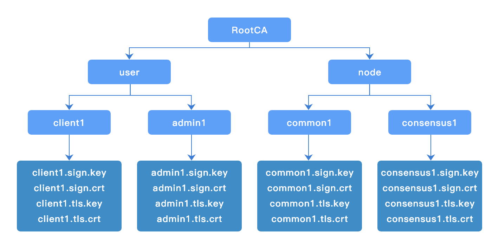
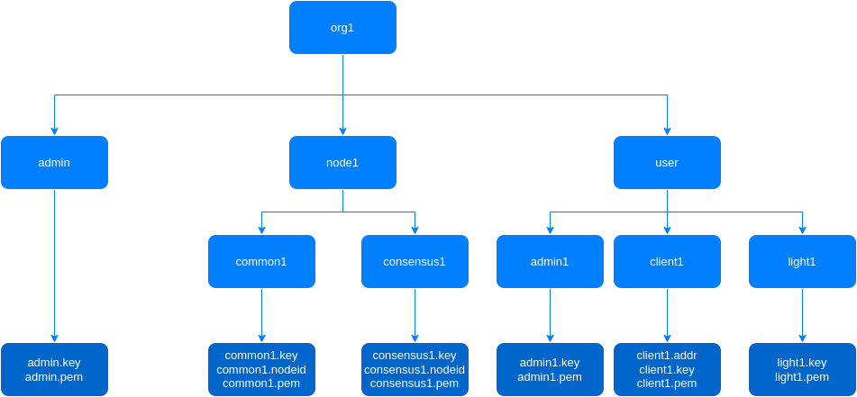
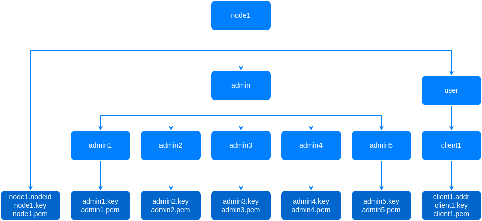

# 证书生成工具

## 概述

`chainmaker-cryptogen`是长安链基于证书配置模板文件生成`ChainMaker`节点和客户端证书的工具。

## 编译

```shell
$ git clone -b v2.3.0  --depth=1 https://git.chainmaker.org.cn/chainmaker/chainmaker-cryptogen.git
$ cd chainmaker-cryptogen
$ make
$ cd bin
$ ./chainmaker-cryptogen -h
```

## 证书配置模板

### 证书模式

> 配置文件路径：`chainmaker-cryptogen/config/crypto_config_template.yml`

```yml
crypto_config:
  - domain: chainmaker.org
    host_name: wx-org
    count: 4                # 如果为1，直接使用host_name，否则添加递增编号
    pk_algo: ecc_p256
    ski_hash: sha256
    tls_mode: 0 # 该配置仅当pk_algo设置为sm2时有效， 其中，0：国密tls单证书模式，1：国密tls双证书模式
    #pkcs11配置
    pkcs11:
      enabled: false
      library: /usr/local/lib64/pkcs11/libupkcs11.so
      label: HSM
      password: 11111111
      session_cache_size: 10
      hash: "SHA256" # hash algorithm used to compute SKI
    specs: &specs_ref
      expire_year:  10
      sans:
        - chainmaker.org
        - localhost
        - 127.0.0.1
    location: &location_ref
      country:            CN
      locality:           Beijing
      province:           Beijing
    # CA证书配置
    ca:
      location:
        <<: *location_ref
      specs:
        <<: *specs_ref
    # 节点证书配置
    node:
      - type: consensus
        # 共识节点数量
        count: 1
        # 共识节点配置
        location:
          <<: *location_ref
        specs:
          <<: *specs_ref
          expire_year:  5
      - type: common
        # 普通节点数量
        count: 1
        # 普通节点配置
        location:
          <<: *location_ref
        specs:
          <<: *specs_ref
          expire_year:  5
    user:
      - type: admin
        # 管理员证书数量
        count: 1
        # 管理员证书配置
        location:
          <<: *location_ref
        expire_year:  5
      - type: client
        # 普通用户证书数量
        count: 1
        # 普通用户证书配置
        location:
          <<: *location_ref
        expire_year:  5
      - type: light
        # 轻节点用户证书数量
        count: 1
        # 轻节点用户证书配置
        location:
          <<: *location_ref
        expire_year:  5
```

### 公钥身份模式

配置文件路径：`chainmaker-cryptogen/config/pwk_config_template.yml`

```yml
pwk_config:
  - domain: chainmaker.org
    host_name: wx-org
    count: 4                # 如果为1，直接使用host_name，否则添加递增编号
    pk_algo: ecc_p256
    hash_algo: sha256
    #pkcs11配置
    pkcs11:
      enabled: false
      library: /usr/local/lib64/pkcs11/libupkcs11.so
      label: HSM
      password: 11111111
      session_cache_size: 10
      hash: "SHA256" # hash algorithm used to compute SKI

    # Admin配置
    admin:
    # 节点证书配置
    node:
      - type: consensus
        # 共识节点数量
        count: 1
      - type: common
        # 普通节点数量
        count: 1
    user:
      - type: admin
        # 管理员证书数量
        count: 1
      - type: client
        # 普通用户证书数量
        count: 1
      - type: light
        # 轻节点用户证书数量
        count: 1
```


### 公链模式

配置文件路径：`chainmaker-cryptogen/config/pk_config_template.yml`

```yml
pk_config:
    pk_algo: ecc_p256
    hash_algo: SHA256
    #pkcs11配置
    pkcs11:
      enabled: false
      library: /usr/local/lib64/pkcs11/libupkcs11.so
      label: HSM
      password: 11111111
      session_cache_size: 10
      hash: "SHA256" # hash algorithm used to compute SKI

    # Admin配置
    admin:
      count: 5
    # 节点证书配置
    node:
      - count: 4
    user:
      - type: client
        # 普通用户证书数量
        count: 1
```


## 支持命令

> 可执行文件路径：`chainmaker-cryptogen/bin`

```bash
./chainmaker-cryptogen -h                         
Usage:
  chainmaker-cryptogen [command]

Available Commands:
  extend       Extend existing network
  extend-pk    Extend existing network
  extend-pwk   Extend existing network
  generate     Generate key material
  generate-pk  Generate public-key material
  generate-pwk Generate permission-with-key material
  help         Help about any command
  showconfig   Show config

Flags:
  -c, --config string        specify config file path (default "../config/crypto_config_template.yml")
  -h, --help                 help for chainmaker-cryptogen
  -p, --pkcs11_keys string   specify pkcs11 keys file path (default "../config/pkcs11_keys.yml")

Use "chainmaker-cryptogen [command] --help" for more information about a command.

```

| 命令         | 用途                                                         |
| ------------ | ------------------------------------------------------------ |
| generate     | 证书模式下，批量生成节点和用户证书                           |
| extend       | 证书模式下，扩展节点和用户证书，即保持组织已签发证书不变，签发新的证书 |
| generate-pwk | 公钥身份模式下，批量生成节点和用户证书                       |
| extend-pwk   | 公钥身份模式下，扩展节点和用户证书，即保持组织已签发证书不变，签发新的证书 |
| generate-pk  | 公链模式下，批量生成节点和用户证书                           |
| extend-pk    | 公链模式下，扩展节点和用户证书，即保持组织已签发证书不变，签发新的证书 |
| showconfig   | 展示配置模板内容                                             |

## 使用方法

### 证书模式

#### 生成证书

```bash
$ ./chainmaker-cryptogen generate

$ tree -L 3 crypto-config/
crypto-config/
├── wx-org1.chainmaker.org
│   ├── ca
│   │   ├── ca.crt
│   │   └── ca.key
│   ├── node
│   │   ├── common1
│   │   └── consensus1
│   └── user
│       ├── admin1
│       ├── client1
│       └── light1
├── wx-org2.chainmaker.org
│   ├── ca
│   │   ├── ca.crt
│   │   └── ca.key
│   ├── node
│   │   ├── common1
│   │   └── consensus1
│   └── user
│       ├── admin1
│       ├── client1
│       └── light1
├── wx-org3.chainmaker.org
│   ├── ca
│   │   ├── ca.crt
│   │   └── ca.key
│   ├── node
│   │   ├── common1
│   │   └── consensus1
│   └── user
│       ├── admin1
│       ├── client1
│       └── light1
└── wx-org4.chainmaker.org
    ├── ca
    │   ├── ca.crt
    │   └── ca.key
    ├── node
    │   ├── common1
    │   └── consensus1
    └── user
        ├── admin1
        ├── client1
        └── light1
```

#### 证书目录结构



```sh
$ tree crypto-config/wx-org1.chainmaker.org/
crypto-config/wx-org1.chainmaker.org/
├── ca
│   ├── ca.crt
│   └── ca.key
├── node
│   ├── common1
│   │   ├── common1.nodeid
│   │   ├── common1.sign.crt
│   │   ├── common1.sign.key
│   │   ├── common1.tls.crt
│   │   └── common1.tls.key
│   └── consensus1
│       ├── consensus1.nodeid
│       ├── consensus1.sign.crt
│       ├── consensus1.sign.key
│       ├── consensus1.tls.crt
│       └── consensus1.tls.key
└── user
    ├── admin1
    │   ├── admin1.sign.crt
    │   ├── admin1.sign.key
    │   ├── admin1.tls.crt
    │   └── admin1.tls.key
    ├── client1
    │   ├── client1.addr
    │   ├── client1.sign.crt
    │   ├── client1.sign.key
    │   ├── client1.tls.crt
    │   └── client1.tls.key
    └── light1
        ├── light1.sign.crt
        ├── light1.sign.key
        ├── light1.tls.crt
        └── light1.tls.key

#注：当启用国密TLS双证书模式（pk_algo设置为sm2, tls_mode设置为1时），除了tls签名证书xxx.tls.crt和xxx.tls.key外，会同时生成tls加密证书xxx.tls.enc.crt和xxx.tls.enc.key
```

<span id="extendCA"></span>

#### 扩展证书

> 注意：扩展节点/用户证书将会为所有已存在的组织扩展节点/用户证书

例如需要增加1个共识节点和1个同步节点，即修改配置模板中的count <br>
consensus和common中的count值可以根据实际需要生成的节点数量自由搭配。<br>
如下配置：

```yml
    node:
      - type: consensus
        # 共识节点数量
        count: 1
        # 共识节点配置
        location:
          <<: *location_ref
        specs:
          <<: *specs_ref
          expire_year:  5
      - type: common
        # 普通节点数量
        count: 1
        # 普通节点配置
        location:
          <<: *location_ref
        specs:
          <<: *specs_ref
          expire_year:  5
```

修改为：

```yml
    node:
      - type: consensus
        # 共识节点数量
        count: 2
        # 共识节点配置
        location:
          <<: *location_ref
        specs:
          <<: *specs_ref
          expire_year:  5
      - type: common
        # 普通节点数量
        count: 2
        # 普通节点配置
        location:
          <<: *location_ref
        specs:
          <<: *specs_ref
          expire_year:  5
```

执行`extend`命令，完成各增加1个共识节点证书和1个同步节点证书：

```bash
$ ./chainmaker-cryptogen extend -c ../config/crypto_config_template.yml
```

拓展后证书目录结构如下：

```yml
$ tree -L 3 crypto-config/
crypto-config/
├── wx-org1.chainmaker.org
│   ├── ca
│   │   ├── ca.crt
│   │   └── ca.key
│   ├── node
│   │   ├── common1
│   │   ├── common2
│   │   ├── consensus1
│   │   └── consensus2
│   └── user
│       ├── admin1
│       ├── client1
│       └── light1
├── wx-org2.chainmaker.org
│   ├── ca
│   │   ├── ca.crt
│   │   └── ca.key
│   ├── node
│   │   ├── common1
│   │   ├── common2
│   │   ├── consensus1
│   │   └── consensus2
│   └── user
│       ├── admin1
│       ├── client1
│       └── light1
├── wx-org3.chainmaker.org
│   ├── ca
│   │   ├── ca.crt
│   │   └── ca.key
│   ├── node
│   │   ├── common1
│   │   ├── common2
│   │   ├── consensus1
│   │   └── consensus2
│   └── user
│       ├── admin1
│       ├── client1
│       └── light1
└── wx-org4.chainmaker.org
    ├── ca
    │   ├── ca.crt
    │   └── ca.key
    ├── node
    │   ├── common1
    │   ├── common2
    │   ├── consensus1
    │   └── consensus2
    └── user
        ├── admin1
        ├── client1
        └── light1
```


### 公钥身份模式

#### 生成证书

```yml
$ ./chainmaker-cryptogen generate-pwk -c ../config/pwk_config_template.yml

$ tree -L 3 crypto-config/
crypto-config/
├── wx-org1.chainmaker.org
│   ├── admin
│   │   ├── admin.key
│   │   └── admin.pem
│   ├── node
│   │   ├── common1
│   │   └── consensus1
│   └── user
│       ├── admin1
│       ├── client1
│       └── light1
├── wx-org2.chainmaker.org
│   ├── admin
│   │   ├── admin.key
│   │   └── admin.pem
│   ├── node
│   │   ├── common1
│   │   └── consensus1
│   └── user
│       ├── admin1
│       ├── client1
│       └── light1
├── wx-org3.chainmaker.org
│   ├── admin
│   │   ├── admin.key
│   │   └── admin.pem
│   ├── node
│   │   ├── common1
│   │   └── consensus1
│   └── user
│       ├── admin1
│       ├── client1
│       └── light1
└── wx-org4.chainmaker.org
    ├── admin
    │   ├── admin.key
    │   └── admin.pem
    ├── node
    │   ├── common1
    │   └── consensus1
    └── user
        ├── admin1
        ├── client1
        └── light1
```


#### 证书目录结构



```yml
$ tree crypto-config/wx-org1.chainmaker.org/
crypto-config/wx-org1.chainmaker.org/
├── admin
│   ├── admin.key
│   └── admin.pem
├── node
│   ├── common1
│   │   ├── common1.key
│   │   ├── common1.nodeid
│   │   └── common1.pem
│   └── consensus1
│       ├── consensus1.key
│       ├── consensus1.nodeid
│       └── consensus1.pem
└── user
    ├── admin1
    │   ├── admin1.key
    │   └── admin1.pem
    ├── client1
    │   ├── client1.addr
    │   ├── client1.key
    │   └── client1.pem
    └── light1
        ├── light1.key
        └── light1.pem
```

#### 拓展证书

修改配置模板`chainmaker-cryptogen/config/pwk_config_template.yml`，**consensus**、**common**节点各新增一个

```yml
    # 节点证书配置
    node:
      - type: consensus
        # 共识节点数量
        count: 1
      - type: common
        # 普通节点数量
        count: 1
```

修改为如下配置

```yml
    # 节点证书配置
    node:
      - type: consensus
        # 共识节点数量
        count: 2
      - type: common
        # 普通节点数量
        count: 2
```

执行`extend-pwk`命令，完成各增加1个共识节点证书和1个同步节点证书：

```shell
$ ./chainmaker-cryptogen extend-pwk -c ../config/pwk_config_template.yml
```

拓展后证书目录结构如下：

```yml
$ tree -L 3 crypto-config/                  
crypto-config/
├── wx-org1.chainmaker.org
│   ├── admin
│   │   ├── admin.key
│   │   └── admin.pem
│   ├── node
│   │   ├── common1
│   │   ├── common2
│   │   ├── consensus1
│   │   └── consensus2
│   └── user
│       ├── admin1
│       ├── client1
│       └── light1
├── wx-org2.chainmaker.org
│   ├── admin
│   │   ├── admin.key
│   │   └── admin.pem
│   ├── node
│   │   ├── common1
│   │   ├── common2
│   │   ├── consensus1
│   │   └── consensus2
│   └── user
│       ├── admin1
│       ├── client1
│       └── light1
├── wx-org3.chainmaker.org
│   ├── admin
│   │   ├── admin.key
│   │   └── admin.pem
│   ├── node
│   │   ├── common1
│   │   ├── common2
│   │   ├── consensus1
│   │   └── consensus2
│   └── user
│       ├── admin1
│       ├── client1
│       └── light1
└── wx-org4.chainmaker.org
    ├── admin
    │   ├── admin.key
    │   └── admin.pem
    ├── node
    │   ├── common1
    │   ├── common2
    │   ├── consensus1
    │   └── consensus2
    └── user
        ├── admin1
        ├── client1
        └── light1
```


### 公链模式

#### 生成证书

```yml
$ ./chainmaker-cryptogen generate-pk -c ../config/pk_config_template.yml
$ tree -L 3 crypto-config/                                              
crypto-config/
├── node1
│   ├── admin
│   │   ├── admin1
│   │   ├── admin2
│   │   ├── admin3
│   │   ├── admin4
│   │   └── admin5
│   ├── node1.key
│   ├── node1.nodeid
│   ├── node1.pem
│   └── user
│       └── client1
├── node2
│   ├── admin
│   │   ├── admin1
│   │   ├── admin2
│   │   ├── admin3
│   │   ├── admin4
│   │   └── admin5
│   ├── node2.key
│   ├── node2.nodeid
│   ├── node2.pem
│   └── user
│       └── client1
├── node3
│   ├── admin
│   │   ├── admin1
│   │   ├── admin2
│   │   ├── admin3
│   │   ├── admin4
│   │   └── admin5
│   ├── node3.key
│   ├── node3.nodeid
│   ├── node3.pem
│   └── user
│       └── client1
└── node4
    ├── admin
    │   ├── admin1
    │   ├── admin2
    │   ├── admin3
    │   ├── admin4
    │   └── admin5
    ├── node4.key
    ├── node4.nodeid
    ├── node4.pem
    └── user
        └── client1
```


#### 证书目录结构



```yml
$ tree crypto-config/node1/                 
crypto-config/node1/
├── admin
│   ├── admin1
│   │   ├── admin1.key
│   │   └── admin1.pem
│   ├── admin2
│   │   ├── admin2.key
│   │   └── admin2.pem
│   ├── admin3
│   │   ├── admin3.key
│   │   └── admin3.pem
│   ├── admin4
│   │   ├── admin4.key
│   │   └── admin4.pem
│   └── admin5
│       ├── admin5.key
│       └── admin5.pem
├── node1.key
├── node1.nodeid
├── node1.pem
└── user
    └── client1
        ├── client1.addr
        ├── client1.key
        └── client1.pem
```


#### 拓展证书

修改配置模板`chainmaker-cryptogen/config/pk_config_template.yml`，新增一个节点

```yml
    # 节点证书配置
    node:
      - count: 4
```

修改为如下配置

```yml
    # 节点证书配置
    node:
      - count: 5
```

执行`extend-pwk`命令，完成各增加1个共识节点证书和1个同步节点证书：

```shell
$ ./chainmaker-cryptogen extend-pk -c ../config/pk_config_template.yml 
```

拓展后证书目录结构如下：

```yml
$ tree -L 3 crypto-config/ 
crypto-config/
├── node1
│   ├── admin
│   │   ├── admin1
│   │   ├── admin2
│   │   ├── admin3
│   │   ├── admin4
│   │   └── admin5
│   ├── node1.key
│   ├── node1.nodeid
│   ├── node1.pem
│   └── user
│       └── client1
├── node2
│   ├── admin
│   │   ├── admin1
│   │   ├── admin2
│   │   ├── admin3
│   │   ├── admin4
│   │   └── admin5
│   ├── node2.key
│   ├── node2.nodeid
│   ├── node2.pem
│   └── user
│       └── client1
├── node3
│   ├── admin
│   │   ├── admin1
│   │   ├── admin2
│   │   ├── admin3
│   │   ├── admin4
│   │   └── admin5
│   ├── node3.key
│   ├── node3.nodeid
│   ├── node3.pem
│   └── user
│       └── client1
├── node4
│   ├── admin
│   │   ├── admin1
│   │   ├── admin2
│   │   ├── admin3
│   │   ├── admin4
│   │   └── admin5
│   ├── node4.key
│   ├── node4.nodeid
│   ├── node4.pem
│   └── user
│       └── client1
└── node5
    ├── admin
    │   ├── admin1
    │   ├── admin2
    │   ├── admin3
    │   ├── admin4
    │   └── admin5
    ├── node5.key
    ├── node5.nodeid
    ├── node5.pem
    └── user
        └── client1
```


<br><br>

