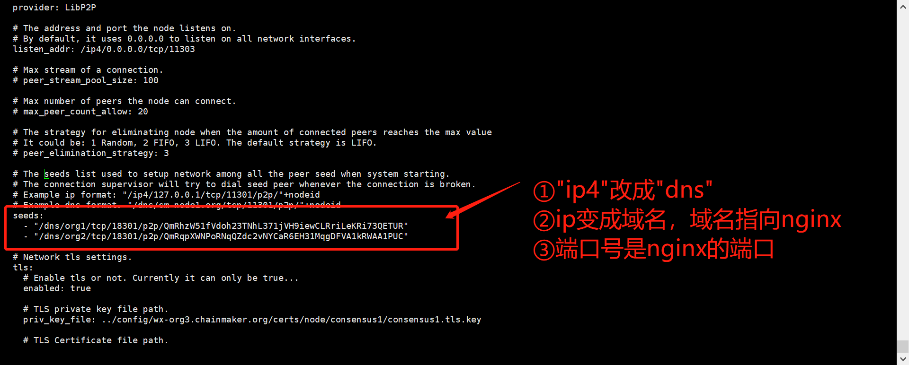
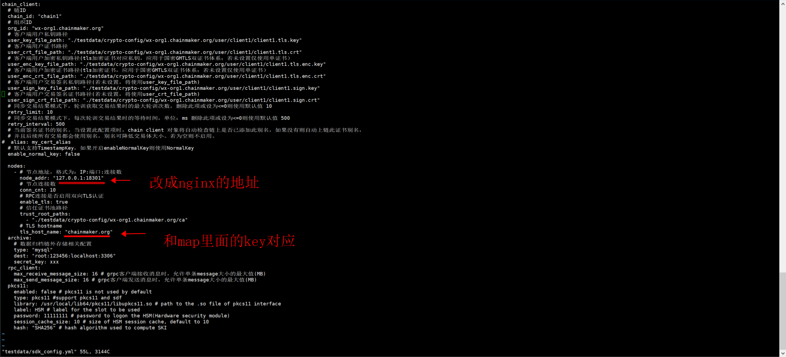

# 使用nginx转发p2p流量部署节点

##  背景
长安链的p2p连接请求，可以被nginx转发。这一方式可以有效应对某些特定的网络场景，比如<br>
①某个局域网环境新增开放端口的流程十分复杂，不能为新增节点快速开放新的端口。<br>
②基于某些安全策略，某个局域网只能使用特定端口进行p2p连接。<br>

针对上述场景，本章节将介绍：<br>
①如何借用nginx转发节点p2p流网。<br>
②如何借用nginx转发rpc的流量。<br>

## 部署架构
通过nginx转发，可以完成如下组网：<br>
①多个节点部署在一个局域网环境（如下图蓝色局域网环境）中，对外只开放了一个特定端口。<br>
②这个特定端口指向nginx的侦听端口。<br>
③该局域网外部有其他节点想要通过这个端口来访问局域网内部的多个节点。<br>
④外部节点可能部署在另一个局域网中，也可能部署在外网。<br>

具体见下面截图：


## nginx转发p2p流量
如上一章节的截图，节点3和节点4，不直接和节点1、2相连。而是将请求发给nginx，通过nginx转发给节点1、2。<br>
所以需要在nginx.conf文件中配置转发规则，同时在chainmaker.yml文件中配置nginx地址作为seed的地址。<br>
下面会分别具体描述如何配置nginx.conf和chainmaker.yml。<br>

### nginx配置
修改配置nginx.conf，下面几个地方需要注意：

①stream里配置一个map，该map包含了node1和node2的转发规则。下面配置的具体含义是：将servername==org1的请求转发给node1，将servername==org2的请求转发给node2。<br>
重点：这个org1和org2是chainmaker.yml里面的域名（节点tls证书的cn）！ chainmaker.yml配置会在下一章节具体说明。<br>
②stream里面配置了两个upstream分别是node1和node2和他们的地址。这两个node就对应两个chainmaker节点，地址也是chainmaker节点的地址。<br>
stream-upstream node1-server 后面的ip:端口就是chainmaker-node1的ip和端口。同理stream-upstream node2-server 后面的ip:端口就是chainmaker-node2的ip和端口。<br>
③server里面的listen是nginx的侦听端口。<br>
④ssl_preread on;这一行不能缺省。<br>
下面给出一个完整的nginx.conf文件。
   ```
#user  nobody;
worker_processes  1;

#error_log  logs/error.log;
#error_log  logs/error.log  notice;
#error_log  logs/error.log  info;

#pid        logs/nginx.pid;


events {
    worker_connections  1024;
}

stream {
  map $ssl_preread_server_name $targetBackend {
      org1 node1;
      org2 node2;
  }
  
  upstream node1 {
      server 127.0.0.1:11301;
  }

  upstream node2 {
      server 127.0.0.1:11302;
  }


  server {
      listen 18301;
      ssl_preread on;
      proxy_pass $targetBackend;
  }
}

   ```
### 内部节点配置
内部节点的连接请求不会发给nginx，他们是被动等待连接，所以chainmaker.yml 正常配置即可。下图是节点1的配置截图，使用者可以根据自己的情况配置随意修改。


### 外部节点配置
外部节点需要将连接请求发给nginx，靠nginx转发给内部。因为chainmaker的网络连接是tls（标准tls或国密，这里统称tls）的。所以节点地址需要使用 “dns/域名“的方式。

chainmaker.yml 中seeds字段的每个地址 需要修改3个地方：<br>
①ip4改成dns。<br>
②ip改成域名，域名指向nginx（可以通过配置hosts或者dns等方法）。<br>
③端口号改成nginx的侦听端口。<br>

重点："/dns/" 后面的域名（org1和org2）需要指向nginx。而且这个域名（org1和org2） 同时还是nginx.conf里面stream-map的key值。


 ```
	 seeds:
    - "/dns/org1/tcp/18301/p2p/QmRhzW51fVdoh23TNhL371jVH9iewCLRriLeKRi73QETUR"
    - "/dns/org2/tcp/18301/p2p/QmRqpXWNPoRNqQZdc2vNYCaR6EH31MqgDFVA1kRWAA1PUC"

 ```
## nginx转发rpc流量
chainmaker的rpc服务可以响应sdk的rpc请求。这个请求也可以通过nginx完成转发。需要配置nginx.conf和sdk_config.yml两个文件。

### 配置 nginx.conf
①需要在原先的map里为rpc单独配置一个k-v对应关系：chainmaker.org  node1-grpc;
重点：key值是 sdk_config.yml文件里的tls_host_name的值。value对应一个upstream即可。
```
  map $ssl_preread_server_name $targetBackend {
      chainmaker.org node1-grpc;
  }
```
②为rpc配置一个upstream ，这个upstream指向chainmaker节点的grpc的ip和端口
```
 upstream node1-grpc {
      server 127.0.0.1:12301;
  }
```
下面给出完整的nginx.conf文件。
 ```
#user  nobody;
worker_processes  1;

#error_log  logs/error.log;
#error_log  logs/error.log  notice;
#error_log  logs/error.log  info;
#error_log  logs/error.log  debug;

#pid        logs/nginx.pid;


events {
    worker_connections  1024;
}

stream {


  map $ssl_preread_server_name $targetBackend {
      org1 node1;
      org2 node2;
      chainmaker.org node1-grpc;
  }
  
  upstream node1 {
      server 127.0.0.1:11301;
  }

  upstream node2 {
      server 127.0.0.1:11302;
  }

  upstream node1-grpc {
      server 127.0.0.1:12301;
  }


  server {
      listen 18301;
      ssl_preread on;
      proxy_pass $targetBackend;
  }
}

 ```

### 内部节点配置
同理内部节点的连接请求不会发给nginx，他们是被动等待连接，所以chainmaker.yml 正常配置即可。
### 配置 sdk_config.yml
sdk_config.yml需要修改两个地方：<br>
①node_addr 后面的地址不再是chainmaker的rpc地址，需要改成nginx的地址。<br>
②nodes-tls_host_name后面的值，需要和nginx.conf文件 map中转发rpc的key值对应<br>

下面给出一个sdk_config.yml的截图：


 ```
  nodes:
    - # 节点地址，格式为：IP:端口:连接数 需要修改
      node_addr: "127.0.0.1:18301"
      # 节点连接数
      conn_cnt: 10
      # RPC连接是否启用双向TLS认证
      enable_tls: true
      # 信任证书池路径
      trust_root_paths:
        - "./testdata/crypto-config/wx-org1.chainmaker.org/ca"
      # TLS hostname 需要修改
      tls_host_name: "chainmaker.org"

 ```

## 原理介绍
上面几个章节仅仅展示了如何配置，本章节对原理做一个小结。<br>
nginx依靠tls请求中的servername字段实现转发，nginx拿到servername再从map中找到对应的upstream，最终转给分给该upstream。<br>
chainmaker根据这一特点，将节点地址里面的域名作为tls请求中servername的值。<br>
rpc则是直接用nodes-tls_host_name字段的值作为servername。<br>

所以只要chainmaker的域名和nginx的map的key一一对应，就能实现 节点tls请求的转发。<br>
rpc的sdk配置文件sdk_config.yml中的tls_host_name和nginx的map的key一一对应，就能实现 rpc请求的转发。