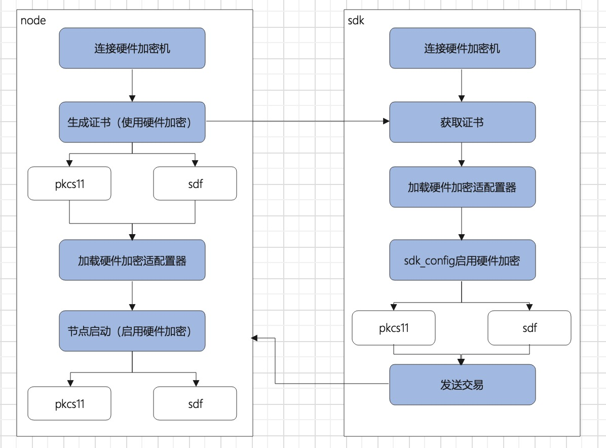
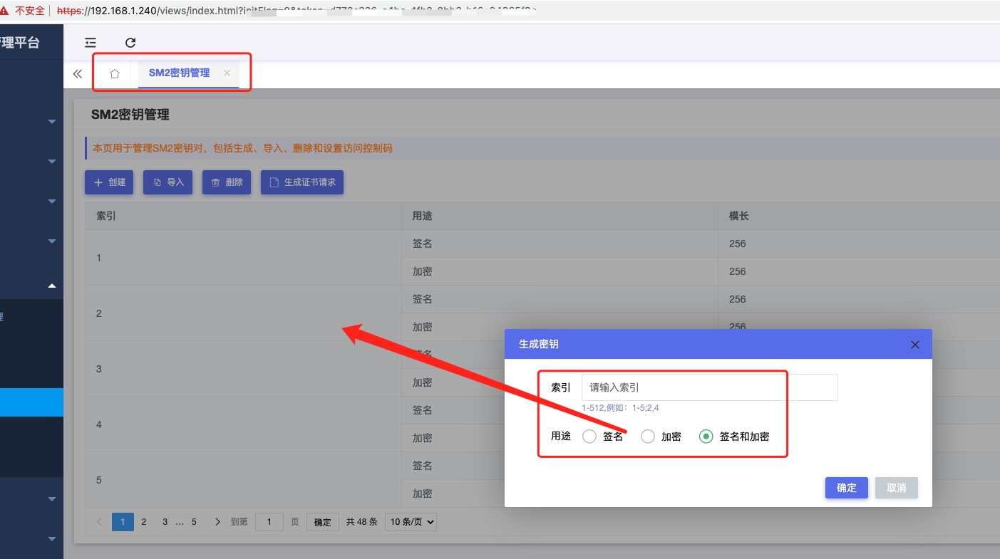

# 部署启用硬件加密的链


本章节将介绍“长安链·ChainMaker”配置连接硬件加密机的运行过程。

## 启用硬件加密验证的测试网络架构

<span id="buildChainWithHSM"></span>

典型的硬件加密测试网络包含三个组成部分：

1. 使用硬件加密的证书颁发机构(cryptogen)
2. 使用硬件加密的区块链节点(chainmaker)
3. 使用硬件加密的sdk应用端(sdk)


## 配置流程简介

​		2.3.0版本的chainmaker的硬件加密支持两种标准：pkcs11和sdf（以下配置项统一以pkcs11配置为例，sdf参考配置说明）。

​		假设cryptogen和chainmaker的4个节点在一台服务器，sdk在另一台服务器，他们连接同一台硬件加密机，构建硬件加密环境的部署流程如图：




## 连接硬件加密机的配置

前置条件：已经存在某厂商（本文示例中使用三未信安）提供的硬件加密机，在其提供的配置服务中，添加好对应的密钥（以SM2密钥为例）：



### 下载硬件加密相关的配置文件

以三未信安的密码机为例，需要以下文件：

- ​		libswsds.so swsds.ini 密码机连接库

- ​		libupkcs11.so upkcs11.ini 密码机pkcs11库

### 配置硬件加密机所在的ip，端口号以及密码：

```sh
vim swsds.ini

[HSM1]
ip=192.168.1.240
port=8000
passwd=xxxxxxxxxxxxxxxxxxxxxxxx

```

### 部署连接环境

1. 将libswsds.so和libupkcs11.so 拷贝到/usr/local/lib64/pkcs11目录下
2. 将swsds.ini和upkcs11.ini 拷贝到/etc/目录下


## 配置生成证书时使用硬件加密

### 方式一：使用chainmaker-cryptogen生成证书(支持sdf)

 关于chainmaker-cryptogen的使用，参考：[通过命令行工具启动链](../recovery/通过命令行工具启动链.md)

1. 配置chainmaker-cryptogen/config/crypto_config_template.yml

   ```yaml
       pk_algo: SM2
       ski_hash: SM3
       tls_mode: 0 # 0：单证书模式，1：双证书模式（国密tls标准需要双证书）
       #pkcs11配置
       pkcs11:
         enabled: true
         type: sdf
         #type: pkcs11 #support sdf | pkcs11
         library: /usr/local/lib64/pkcs11/libswsds.so
         label: Sansec HSM
         password: 11111111
         session_cache_size: 10
         hash: "SHA256" # hash algorithm used to compute SKI
   ```

   **配置说明：**

   - 使用非国密示例：
     
     ```yaml
     pk_algo: ecc_p256
     ski_hash: sha256
     ```
     
   - 使用国密示例：
     
     ```yaml
     pk_algo: SM2
     ski_hash: SM3
     ```
     
   - 开启硬件加密：
     
     ```yaml
     pkcs11:
             enabled: true
     ```
     
   - 配置不同的硬件加密标准：
     
     ```yaml
     type: pkcs11 #国际标准
     # 或
     type: sdf # 国内标准
     ```
     
   - 配置library
     
     ```yaml
     library: /usr/local/lib64/pkcs11/libupkcs11.so #pkcs11
     library: /usr/local/lib64/pkcs11/libswsds.so #sdf
     ```
     
     

2. 配置密码机私钥

   ​        三未信安的密码机针对每种密钥有通用的前缀，例如SM2SignKey，RSASignKey，RSAEncKey等，前缀加上管理台的索引就是密钥的id

   ​        将密码机中配置的密钥id填写到配置文件chainmaker-cryptogen/config/pkcs11_keys.yml 中:

   - 在2.3.0版本，pkcs11_keys.yml的配置如下：

   ```yaml
   pkcs11_keys:
     - wx-org1.chainmaker.org:
         ca:
           consensus:
             - 2,123456
             - 3,123456
           common:
             - 3,123456
         user:
           admin:
             - 4,123456
           client:
             - 5,123456
           light:
             - 6,123456
     - wx-org2.chainmaker.org:
         ca:
           - 7,123456
         node:
           consensus:
             - 8,123456
             - 9,123456
           common:
             - 9,123456
         user:
           admin:
             - 10,123456
           client:
             - 11,123456
           light:
             - 12,123456
     - wx-org3.chainmaker.org:
         ca:
           - 13,123456
         node:
           consensus:
             - 14,1234561
             - 15,1234562
           common:
             - 15,123456
         user:
           admin:
             - 16,123456
           client:
             - 17,123456
           light:
             - 18,123456
     - wx-org4.chainmaker.org:
         ca:
           - 19,123456
         node:
           consensus:
             - 20,123456
             - 21,123456
           common:
             - 21,123456
         user:
           admin:
             - 22,123456
           client:
             - 23,123456
           light:
             - 24,123456
   ```

   - 在2.2.0及以前的版本，前辍SM2SignKey被配置在pkcs11_keys.yml文件中， pkcs11_keys.yml的配置如下：

   ```yaml
   pkcs11_keys:
     - wx-org1.chainmaker.org:
         ca:
           - SM2SignKey1
         node:
           consensus:
             - SM2SignKey2
           common:
             - SM2SignKey3
         user:
           admin:
             - SM2SignKey4
           client:
             - SM2SignKey5
           light:
             - SM2SignKey6
     - wx-org2.chainmaker.org:
         ca:
           - SM2SignKey7
         node:
           consensus:
             - SM2SignKey8
           common:
             - SM2SignKey9
         user:
           admin:
             - SM2SignKey10
           client:
             - SM2SignKey11
           light:
             - SM2SignKey12
     - wx-org3.chainmaker.org:
         ca:
           - SM2SignKey13
         node:
           consensus:
             - SM2SignKey14
           common:
             - SM2SignKey15
         user:
           admin:
             - SM2SignKey16
           client:
             - SM2SignKey17
           light:
             - SM2SignKey18
     - wx-org4.chainmaker.org:
         ca:
           - SM2SignKey19
         node:
           consensus:
             - SM2SignKey20
           common:
             - SM2SignKey21
         user:
           admin:
             - SM2SignKey22
           client:
             - SM2SignKey23
           light:
             - SM2SignKey24
   ```

### 方式二：使用chainmaker-ca生成证书(暂不支持sdf) 

关于chainmaker-ca的使用，参考：[CA证书服务](../tech/CA证书服务.md)

1. 配置启用硬件加密

   ```yaml
     hash_type: SM3
     key_type: SM2                                  # SHA256/SHA3_256/SM3
     ###....
     ###其他配置项省略
     ###....
   pkcs11_config:
     enabled: true
     library: /usr/local/lib64/pkcs11/libupkcs11.so
     label: HSM
     password: 11111111
     session_cache_size: 10
     hash: "SHA256"
   ```

   

2. 私钥配置（目前用户证书不支持硬件加密，只有CA证书支持硬件加密）

   ```yaml
   intermediate_config:
     - csr:
         CN: ca-wx-org1.chainmaker.org
         O: wx-org1.chainmaker.org
         OU: ca
         country: CN
         locality: Beijing
         province: Beijing
       key_id: SM2SignKey2
     - csr:
         CN: ca-wx-org2.chainmaker.org
         O: wx-org2.chainmaker.org
         OU: ca
         country: CN
         locality: Beijing
         province: Beijing
       key_id: SM2SignKey3
   
     - csr:
         CN: ca-wx-org3.chainmaker.org
         O: wx-org3.chainmaker.org
         OU: ca
         country: CN
         locality: Beijing
         province: Beijing
       key_id: SM2SignKey14
   
     - csr:
         CN: ca-wx-org4.chainmaker.org
         O: wx-org4.chainmaker.org
         OU: ca
         country: CN
         locality: Beijing
         province: Beijing
       key_id: SM2SignKey15
   ```

## 节点启用硬件加密

### 修改节点配置模板文件：

chainmaker-go/config/config_tql/chainmaker.tpl

```yaml
  pkcs11: 
    enabled: true
    type: pkcs11 #支持pkcs11和sdf
    library: /usr/local/lib64/libupkcs11.so     
    label: Sansec HSM                                       
    password: 12345678                               
    session_cache_size: 10                     
    hash: "" 
```

### 使用命令行方式构建链，并启动4个节点

参考：[通过命令行工具启动链](../recovery/通过命令行工具启动链.md)

## 应用端(sdk)启用硬件加密：

修改sdk_config.yml:

```yaml
  #pkcs11配置（配置说明参考cryptogen）
  pkcs11:
    enabled: true
    type: pkcs11
    library: /usr/local/lib64/libupkcs11.so
    label: HSM
    password: 12345678 
    session_cache_size: 10
    hash: ""
```

## 配置环境变量

在2.3.0之后，chainmaker的密码机环境提供了配置环境变量的方式：

1. 配置密码机连接的环境变量（必须）

   ```shell
   export LD_LIBRARY_PATH=/usr/local/lib64/pkcs11
   ```

2. 加载适配器插件（必选）
   下载适配器相关代码：

   ```shell
   git clone  --depth=1 https://git.chainmaker.org.cn/chainmaker/common.git
   ```

   构建适配器：

   ```shell
   cd common/crypto/hsm/swxa
   ./build.sh
   ```

   将生成的sansec_hsm_adapter.so 复制到/usr/local/lib64下

   ```shell
   cp sansec_hsm_adapter.so /usr/local/lib64sansec_hsm_adapter.so
   export HSM_ADAPTER_LIB=/usr/local/lib64/sansec_hsm_adapter.so
   ```

3. 配置硬件加密选项（可选）

   以下环境变量的配置与配置文件中的功能相同，二选一即可

   Pkcs11:

   ```shell
   export HSM_LIB=/usr/local/lib64/libupkcs11.so  
   export HSM_SESSION_CACHE_SIZE=10 
   export HSM_LABEL="Sansec HSM" 
   export HSM_PASSWORD=11111111 
   ```

## 发送交易

​		完成以上配置，启动节点和sdk后，可以使用cmc命令以及sdk的方式向链上发送交易

