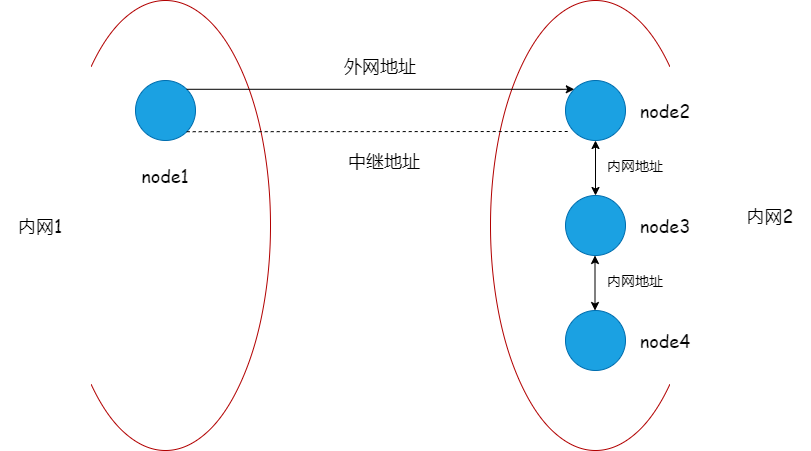

# P2P网络管理

## 概述
chainmaker网络模块支持`Libp2p`和`Liquid`两种模式
下面详细介绍每种模式的管理操作。

了解网络模块的设计方案，请点击如下链接：
[P2P网络设计文档](../tech/P2P网络.md)

## Libp2p管理

### 在chainmaker中启用Libp2p

Lib2p2的参数配置主要在chainmaker.yml（-c 启动参数指定的文件）配置文件中net标签下，具体参数如下：

```yaml
net:
  # 底层网络类型，必选项，支持libp2p
  provider: LibP2P
  # 本地网路监听地址及端口，必选项
  listen_addr: /ip4/0.0.0.0/tcp/11301
  # 每个节点连接stream池大小上限，可选项，不配默认为100
  peer_stream_pool_size: 100
  # 允许与本节点建立链接的节点总数量，可选项，不配默认为20
  max_peer_count_allow: 10
  # 节点连接淘汰策略，可选项，1 Random, 2 FIFO, 3 LIFO。不配默认为3
  peer_elimination_strategy: 3
  # 种子节点地址列表，用于节点发现，可选项
  # 建议将所有已知共识节点网络地址都配置为种子节点
  # seeds ip格式为： "/ip4/127.0.0.1/tcp/11301/p2p/"+nodeid
  # seeds dns格式为："/dns/cm-node1.org/tcp/11301/p2p/"+nodeid
  seeds: 
    - "/ip4/127.0.0.1/tcp/11301/p2p/QmQZn3pZCcuEf34FSvucqkvVJEvfzpNjQTk17HS6CYMR35"
  # TLS认证相关配置
  tls:
    # TLS认证开关，必选项，当前必须为true
    enabled: true
    # TLS证书配置，必选项
    priv_key_file: ./crypto-config/wx-org1.chainmaker.org/node/consensus1/consensus1.tls.key
    cert_file:     ./crypto-config/wx-org1.chainmaker.org/node/consensus1/consensus1.tls.crt
  # 组网黑名单配置，可选项，不配默认不开启黑名单
  blacklist:
    # 黑名单地址，可选项，[ip]:[port]或者[ip]两者均可
    addresses:
      - "127.0.0.1:11305"
      - "192.168.1.8"
    # 黑名单节点ID，可选项
    node_ids:
      - "QmeyNRs2DwWjcHTpcVHoUSaDAAif4VQZ2wQDQAUNDP33gH"
      - "QmVSCXfPweL1GRSNt8gjcw1YQ2VcCirAtTdLKGkgGKsHqi"
```
### 节点总连接数管理

节点连接数到达上限后，当新的节点要连接本节点时，本节点会根据连接淘汰策略，从现有的连接淘汰一个，淘汰策略有：

1. Random策略：

如果新节点优先级为高，优先随机淘汰一个低优先级节点，若没有低优先级节点，则随机淘汰一个高优先级节点。

如果新节点优先级为低，随机淘汰一个低优先级节点，若没有低优先级节点，则淘汰该新节点。

2. FIFO: 先进先出策略：

如果新节点优先级为高，优先淘汰一个最早添加的低优先级节点，若没有低优先级节点，则淘汰一个最早添加的高优先级节点。

如果新节点优先级为低，淘汰一个低优先级节点，若没有低优先级节点，则淘汰该新节点。

3. LIFO: 后进先出策略：

如果新节点优先级为高，优先淘汰一个最晚添加的低优先级节点，若没有低优先级节点，则淘汰该新节点。

如果新节点优先级为低，淘汰该新节点。

**Libp2p的淘汰策略与Liquid保持一致**

### 节点连接认证

在链初始化阶段，网络模块会将根据链配置（例如：bc1.yml）中的trust_roots配置的根证书创建TLS根证书池，在节点连接建立时，TLS握手阶段会依次使用每条链的TLS根证书池验证对方节点TLS证书，若认证通过则认为对方节点属于当前根证书池对应的链，确定链ID，并将对方节点ID加入到对应链的pubsub服务白名单中。这样就可以保证链内的广播消息不会发送给不属于该链组织的节点。

在多链场景下，只需要保证每个链的trust_roots里都配有该节点TLS证书对应的CA或根证书即可，不需要额外的其他配置。

例如：

1.假设节点N有两个链分别是blockchain1、blockchain2；

2.假设节点N的TLS证书是由组织ID为“wx-org2.chainmaker.org”的CA证书签发；

3.假设blockchain1链的配置文件为bc1.yml，blockchain2链的配置文件为bc2.yml。

那么bc1.yml中trust_roots配置：
```yaml
trust_roots:
  - org_id: "wx-org1.chainmaker.org"
    root: "../config/wx-org1/certs/ca/wx-org1.chainmaker.org/ca.crt"
  - org_id: "wx-org2.chainmaker.org"
    root: "../config/wx-org2/certs/ca/wx-org2.chainmaker.org/ca.crt"
```

bc2.yml中trust_roots配置：
```yaml
trust_roots:
  - org_id: "wx-org2.chainmaker.org"
    root: "../config/wx-org2/certs/ca/wx-org2.chainmaker.org/ca.crt"
  - org_id: "wx-org3.chainmaker.org"
    root: "../config/wx-org3/certs/ca/wx-org3.chainmaker.org/ca.crt"
```

这样节点N就既属于blockchain1链也属于blockchain2链，但两个链间的数据是隔离的。

## Liquid管理

### 在chainmaker中启用Liquid

Liquid的参数配置同样在chainmaker.yml（-c 启动参数指定的文件）配置文件中net标签下，具体参数如下：

```yaml
net:
  # 底层网络类型，必选项，支持liquid
  provider: liquid
  # 本地网路监听地址及端口，必选项
  listen_addr: /ip4/0.0.0.0/tcp/11301
  # 每个节点连接stream池大小上限，可选项，不配默认为100
  peer_stream_pool_size: 100
  # 允许与本节点建立链接的节点总数量，可选项，不配默认为20
  max_peer_count_allow: 10
  # 节点链接淘汰策略，可选项，1 Random, 2 FIFO, 3 LIFO。不配默认为3
  peer_elimination_strategy: 3
  # 节点最大连接数
  max_conn_count_each_peer: 5
  # 大消息体拆包/组包
  pkt_enabled: true
  # 消息发送优先级控制
  priority_control: true
  # 种子节点地址列表，用于节点发现，可选项
  # 建议将所有已知共识节点网络地址都配置为种子节点
  # seeds ip格式为： "/ip4/127.0.0.1/tcp/11301/p2p/"+nodeid
  # seeds dns格式为："/dns/cm-node1.org/tcp/11301/p2p/"+nodeid
  seeds: 
    - "/ip4/127.0.0.1/tcp/11301/p2p/QmQZn3pZCcuEf34FSvucqkvVJEvfzpNjQTk17HS6CYMR35"
  # TLS认证相关配置
  tls:
    # TLS认证开关，必选项，当前必须为true
    enabled: true
    # TLS证书配置，必选项
    priv_key_file: ./crypto-config/wx-org1.chainmaker.org/node/consensus1/consensus1.tls.key
    cert_file:     ./crypto-config/wx-org1.chainmaker.org/node/consensus1/consensus1.tls.crt
  # 组网黑名单配置，可选项，不配默认不开启黑名单
  blacklist:
    # 黑名单地址，可选项，[ip]:[port]或者[ip]两者均可
    addresses:
      - "127.0.0.1:11305"
      - "192.168.1.8"
    # 黑名单节点ID，可选项
    node_ids:
      - "QmeyNRs2DwWjcHTpcVHoUSaDAAif4VQZ2wQDQAUNDP33gH"
      - "QmVSCXfPweL1GRSNt8gjcw1YQ2VcCirAtTdLKGkgGKsHqi"
```

要想在chainmaker-go中启用Liquid作为网络实现，只需将

```yaml
net:
  provider: libp2p
```

改为

```yaml
net:
  provider: liquid
```

**Liquid与Libp2p传输协议不兼容，所以使用Liquid的节点与使用Libp2p的节点无法建立连接。**

Liquid支持TCP、QUIC两种底层传输协议，具体使用哪种协议会根据本地监听地址自动识别。

使用TCP举例：

```yaml
net:
  listen_addr: /ip4/0.0.0.0/tcp/11301
```

使用QUIC举例：

```yaml
net:
  listen_addr: /ip4/0.0.0.0/udp/11301/quic
```

其他节点地址格式也需要对应，例如：

使用TCP：

```
/ip4/127.0.0.1/tcp/11302/p2p/QmcQHCuAXaFkbcsPUj7e37hXXfZ9DdN7bozseo5oX4qiC4
```

使用QUIC：

```
/ip4/127.0.0.1/udp/11302/quic/p2p/QmcQHCuAXaFkbcsPUj7e37hXXfZ9DdN7bozseo5oX4qiC4
```

### Liquid在chainmaker中的扩展特性支持

#### 多连接自动扩容复用并行发送

Liquid支持多连接复用并行发送，假设我们允许与每个其他节点最多创建`5`个连接，可通过如下配置开启：

```yaml
net:
  max_conn_count_each_peer: 5
```

#### 大消息体拆包/组包

LiquidNet支持将大消息体拆分为最多256个小包并行发送和将接收的若干小包组装为一个大消息体的功能。目的是提升大消息体的发送效率。可通过如下配置开启：

```yaml
net:
  pkt_enabled: true
```

#### 消息发送优先级控制

LiquidNet支持消息发送优先级控制，可通过如下配置开启：

```yaml
net:
  priority_control: true
```

优先级总共划分为[0,9]总共10级，值越高，优先级越高。

默认优先级：

> 优先级9：共识引擎消息
>
> 优先级8：区块消息
>
> 优先级7：交易消息
>
> 优先级5：同步引擎消息


<span id="relay_use"></span>

#### 中继转发

[Liquid Relay（中继）介绍](../tech/P2P网络.html#relay_introduce)

Relay（中继）的使用需要在特殊的网络环境下，例如下图：




场景：

- node1位于内网1
- node2，node3，node4位于内网2，并且node2，node3和node4之间采用内网地址互相连接
- node2有一个外网可以访问的地址和端口映射


在这种场景下，如果不采用Relay或者NAT穿透功能的话，虽然node1和node2之间可以建立连接，但是node1与node3，node1与node4之间并不能打通进行直接通信。当我们启用中继功能，配置中继地址的话，就可以通过node2作为媒介，将**node1<--->node3**，**node1<--->node4**建立。具体配置如下：

在节点配置文件**chainmaker.yml**里，我们找到网络的配置部分

```yaml
net:
  # Network provider, can be libp2p or liquid.
  # libp2p: using libp2p components to build the p2p module.
  # liquid: a new p2p network module. We build it from 0 to 1.
  # This item must be consistent across the blockchain network.
  provider: liquid

  # The address and port the node listens on.
  # By default, it uses 0.0.0.0 to listen on all network interfaces.
  listen_addr: /ip4/0.0.0.0/tcp/11301

  # Max stream of a connection.
  # peer_stream_pool_size: 100

  # Max number of peers the node can connect.
  # max_peer_count_allow: 20

  # The strategy for eliminating node when the amount of connected peers reaches the max value
  # It could be: 1 Random, 2 FIFO, 3 LIFO. The default strategy is LIFO.
  # peer_elimination_strategy: 3

  # The seeds list used to setup network among all the peer seed when system starting.
  # The connection supervisor will try to dial seed peer whenever the connection is broken.
  # Example ip format: "/ip4/127.0.0.1/tcp/11301/p2p/"+nodeid
  # Example dns format："/dns/cm-node1.org/tcp/11301/p2p/"+nodeid
  seeds:
    - "/ip4/82.156.18.139/tcp/11302/p2p/QmUiTTdDZ1SSEozG9nCKZwndM2r4eTHUXKtBEJrBGKpnR4"
    - "/ip4/82.156.18.139/tcp/11302/p2p/QmUiTTdDZ1SSEozG9nCKZwndM2r4eTHUXKtBEJrBGKpnR4/p2p-circuit/p2p/QmcVgh7SioZJo8Fq5XKr7DeoHqmtGz5yDZ6XtXw2HmFz2d"
    - "/ip4/82.156.18.139/tcp/11302/p2p/QmUiTTdDZ1SSEozG9nCKZwndM2r4eTHUXKtBEJrBGKpnR4/p2p-circuit/p2p/QmVwpnUqq6VYCGzRMGkPLvVqLfWHWttdg4DpqBRQofXFvU"
```

在网络的配置部分，我们找到种子节点配置**seeds**，按照上文图片中的案例，依次配置node1，node2，node3，node4的**seeds**部分


- **已知环境**：

  node2 ID：QmUiTTdDZ1SSEozG9nCKZwndM2r4eTHUXKtBEJrBGKpnR4

  node3 ID：QmcVgh7SioZJo8Fq5XKr7DeoHqmtGz5yDZ6XtXw2HmFz2d

  node4 ID：QmVwpnUqq6VYCGzRMGkPLvVqLfWHWttdg4DpqBRQofXFvU

  

  node2 内网IP端口：172.21.32.5:11302

  node2 外网IP端口：82.156.18.139:11302

  node3 内网IP端口：172.21.32.7:11303

  node4 内网IP端口：172.21.32.6:11304

  

- **具体配置**

  node1 seeds：

  ```yaml
  seeds:
      - "/ip4/82.156.18.139/tcp/11302/p2p/QmUiTTdDZ1SSEozG9nCKZwndM2r4eTHUXKtBEJrBGKpnR4"
      - "/ip4/82.156.18.139/tcp/11302/p2p/QmUiTTdDZ1SSEozG9nCKZwndM2r4eTHUXKtBEJrBGKpnR4/p2p-circuit/p2p/QmcVgh7SioZJo8Fq5XKr7DeoHqmtGz5yDZ6XtXw2HmFz2d"
      - "/ip4/82.156.18.139/tcp/11302/p2p/QmUiTTdDZ1SSEozG9nCKZwndM2r4eTHUXKtBEJrBGKpnR4/p2p-circuit/p2p/QmVwpnUqq6VYCGzRMGkPLvVqLfWHWttdg4DpqBRQofXFvU"
  ```

  node2 seeds：

  ```yaml
  seeds:
      - "/ip4/172.21.32.7/tcp/11303/p2p/QmcVgh7SioZJo8Fq5XKr7DeoHqmtGz5yDZ6XtXw2HmFz2d"
      - "/ip4/172.21.32.6/tcp/11304/p2p/QmVwpnUqq6VYCGzRMGkPLvVqLfWHWttdg4DpqBRQofXFvU"
  ```

  node3 seeds：

  ```yaml
  seeds:
      - "/ip4/172.21.32.5/tcp/11302/p2p/QmUiTTdDZ1SSEozG9nCKZwndM2r4eTHUXKtBEJrBGKpnR4"
      - "/ip4/172.21.32.6/tcp/11304/p2p/QmVwpnUqq6VYCGzRMGkPLvVqLfWHWttdg4DpqBRQofXFvU"
  ```

  node4 seeds：

  ```yaml
  seeds:
      - "/ip4/172.21.32.5/tcp/11302/p2p/QmUiTTdDZ1SSEozG9nCKZwndM2r4eTHUXKtBEJrBGKpnR4"
      - "/ip4/172.21.32.7/tcp/11303/p2p/QmcVgh7SioZJo8Fq5XKr7DeoHqmtGz5yDZ6XtXw2HmFz2d"
  ```

- **配置详解**

  假设节点QmA要通过中继节点QmR连接节点QmB

  ```yaml
  /ip4/7.7.7.7/tcp/55555/p2p/QmR/p2p-circuit/p2p/QmB
  ```

  - ip4：ipv4协议的标志
  - 7.7.7.7：中继节点QmR的IP地址
  - tcp：采用tcp协议
  - 55555：中继节点QmR的端口号
  - p2p：p2p协议标志（用于切割地址的符号）
  - QmR：节点QmR的PeerId
  - p2p-circuit：中继地址的标志（用于切割中继地址的符号）
  - QmB：要连接目的节点的PeerId

#### NAT穿透
在满足两个节点所在NAT类型是可以打洞成功的条件下，liquid网络一般无需添加额外配置，即可实现NAT穿透。

特出情况：如果同时满足下面3个条件，需要在chainmaker.yml中额外配置 enable_punch: true
- ①两个需要NAT穿透才能互联的节点。
- ②两节点的chainmaker.yml文件中listen_addr字段均为tcp协议。
- ③两节点的listen_addr端口是相同的（即他们的tcp listen端口相同）。

(只有tcp会出现这种情况的原因是:liquid针对tcp协议实现了特有的tls握手方式，该握手方式对端口有一定要求)
  
下面实例表示 enable_punch: true 和seeds处于同一级，不需要配置 enable_punch: true以外的任何内容。正常情况建议 不要配置这个选项。
  ```yaml

  seeds:
      - "/ip4/172.21.32.5/tcp/11302/p2p/QmUiTTdDZ1SSEozG9nCKZwndM2r4eTHUXKtBEJrBGKpnR4"

  enable_punch: true
  ```

<br><br>