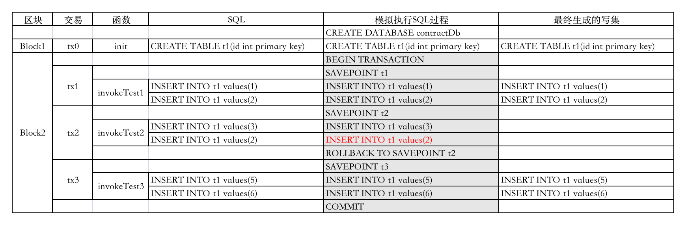

# SQL合约支持

## 概述
长安链支持在智能合约中直接编写SQL语句，对状态数据库（必须配置为关系数据库类型，比如MySQL）进行操作。
## SQL合约的处理逻辑
在长安链SQL合约中，SQL语句按功能的不同，被分为三种：
* DDL数据结构定义的语句，包括对表（TABLE）、视图（VIEW）和索引（INDEX）的创建（CREATE）、修改（ALTER）、删除（DROP）等操作。另外清空表内容（TRUNCATE TABLE）也是属于DDL语句。
* DML数据管理语句，包括增加（INSERT）、删除（DELETE）和修改（UPDATE）三种。
* DQL也就是各种SELECT查询语句，只读，不产生数据更改。
### 合约创建
用户合约在创建时，系统会自动创建一个新的数据库给该合约，所以不同的用户合约的状态数据以数据库进行区隔。在创建合约对应的数据库后，系统会执行合约init_contract函数中的SQL语句，包含非数据库事务的DDL语句，出于安全考虑，一个创建合约的交易或升级合约的交易将会被单独打包到区块中，不能与其他普通合约调用的交易一起打包。

### 合约调用
用户在合约中拼接SQL语句，并以字符串形式传入合约SDK，在合约执行时，由于无法像KV数据那样生成读写集，然后基于读写集判断一个区块中的多笔交易是否允许并行执行还是串行执行，所以在支持SQL合约的执行过程中，将全部按串行方式执行。一个区块对应一个数据库中的事务，区块开始处理第一笔交易时开启事务，然后针对每一笔交易，在交易执行前将建立事务的SavePoint保存点，然后再逐步执行交易中的多条SQL语句，如果全部SQL语句执行完成，并交易结果返回成功，那么将会把所有DML语句记录到写集中（SELECT语句不产生数据变更，不记录到写集），并建立一个新的事务SavePoint，继续处理下一笔交易。但一旦该交易中有SQL语句执行失败，或者最终该交易的结果返回为失败，则回滚到上一个SavePoint，并清空该交易的读写集。直到处理完本区块的最后一笔交易，提交整个数据库事务，每个合约对其状态数据库的更改落盘完成。以下为一个合约的多笔Invoke交易被打包到一个区块后的执行过程和结果示例：

最终在打包区块2后，我们查询合约的状态数据库，可以看到：

<table border="2">
<tr><th>t1</th></tr>
<tr><td> 1 </td></tr>
<tr><td> 2 </td></tr>
<tr><td> 5 </td></tr>
<tr><td> 6 </td></tr>
</table>

<br>

### 合约查询

当用户通过Query语句调用合约的查询函数时，查询函数内部拼接DQL，并直接将DQL传入对应的数据库，查询后返回结果给用户。查询函数中不得使用DDL或DML语句，只能使用DQL语句。
### 合约升级
合约升级时将调用新合约中的upgrade函数，该函数中用户可以定义对数据库进行更改的DDL或者对现有数据进行更新的DML。合约升级交易由于包含DDL，所以也必须要单独出块，不能和其他普通合约调用交易一起混合打包。
## SQL合约的编写规范
* 建表、索引、视图等DDL语句只能在合约安装init_contract 和合约升级upgrade中使用，暂不支持用户自定义函数、存储过程、触发器等。
* SQL中，禁止跨数据库操作，无需指定数据库名。比如select * from db.table 是禁止的； use db;是禁止的。
* SQL中，禁止使用事务相关操作的语句，比如commit 、rollback等，事务由ChainMaker框架自动控制。
* SQL中，禁止使用随机数、获得系统时间等不确定性函数，这些函数在不同节点产生的结果会不一样。
* SQL中，禁止多条SQL拼接成一个SQL字符串传入。
* 在建表时，禁止使用自增Sequence做主键，需由合约外控制生成主键。
* 升级合约时，禁止执行DML语句，防止DML语句与DDL语句交叉执行导致事务不可控。
* 禁止操作（包括建立、修改、删除、查询、写入）表名为“state_infos”的表，这是系统自带的提供KV数据存储的表，用于存放PutState函数对应的数据，其中的数据通过PutState和GetState操作。
* 禁止DCL语句，如GRANT，REVOKE等
* mysql连接的用户需具有创建数据库、创建表、创建索引等权限


注意：
1、发送交易为query交易时，只能执行DQL语句，不可执行DML语句。若含有则会报错。
2、在一个交易中，若执行了多条语句（DQL、DML），其中一条或多条语句（DQL、DML）执行失败，则整个交易将执行失败并会回滚到上一个savePoint
## SQL合约的使用
### 节点状态数据库配置
默认情况下，长安链只支持KV数据的合约操作，也就是常见的PutState、GetState操作，如果调用合约框架中的Sql函数，则合约会报错。如果希望合约支持SQL操作，首先需要确保每个节点的状态数据库为SQL数据库类型。节点配置示例如下：

`chainmaker.yml`

``` yml
storage:
  store_path: ../data/org1/ledgerData1
  blockdb_config:
    provider: leveldb
    leveldb_config:
      store_path: ../data/org1/blocks
  statedb_config:
    provider: sql #状态数据库为SQL数据库
    sqldb_config:
      sqldb_type:  mysql #具体数据库类型为mysql
      dsn:  root:password@tcp(127.0.0.1:3306)/dbname  #mysql连接字符串，dbname为已存在数据库，或者省略
  historydb_config:
    provider: leveldb
    leveldb_config:
      store_path: ../data/org1/history
  resultdb_config:
    provider: leveldb
    leveldb_config:
      store_path: ../data/org1/result
  disable_contract_eventdb: true  #是否禁止合约事件存储功能，默认为true，如果设置为false,需要配置mysql
```

### 链配置中启用SQL合约
在确保每个节点的状态数据库为SQL数据库后，需要在创世区块配置(bcN.yml)中修改合约参数`enable_sql_support`为`true`，实现合约方法SQL调用。

`bc1.yml`

``` yml
contract:
  enable_sql_support: true
```
### SQL合约SDK接口
#### Golang（tinygo sdk）
``` go
// 接口定义
type SqlSimContext interface {
	SimContextCommon
	// sql method
	// ExecuteQueryOne
	ExecuteQueryOne(sql string) (*EasyCodec, ResultCode)
	ExecuteQuery(sql string) (ResultSet, ResultCode)
	// #### ExecuteUpdateSql execute update/insert/delete sql
	// ##### It is best to update with primary key
	//
	// as:
	//
	// - update table set name = 'Tom' where uniqueKey='xxx'
	// - delete from table where uniqueKey='xxx'
	// - insert into table(id, xxx,xxx) values(xxx,xxx,xxx)
	//
	// ### not allow:
	// - random methods: NOW() RAND() and so on
	// return: 1 Number of rows affected;2 result code
	ExecuteUpdate(sql string) (int32, ResultCode)
	// ExecuteDDLSql execute DDL sql, for init_contract or upgrade method. allow table create/alter/drop/truncate
	//
	// ## You must have a primary key to create a table
	// ### allow:
	// - CREATE TABLE tableName
	// - ALTER TABLE tableName
	// - DROP TABLE tableName
	// - TRUNCATE TABLE tableName
	//
	// ### not allow:
	// - CREATE DATABASE dbName
	// - CREATE TABLE dbName.tableName
	// - ALTER TABLE dbName.tableName
	// - DROP DATABASE dbName
	// - DROP TABLE dbName.tableName
	// - TRUNCATE TABLE dbName.tableName
	// not allow:
	// - random methods: NOW() RAND() and so on
	//
	ExecuteDdl(sql string) (int32, ResultCode)
}
// 结果集游标
type ResultSet interface {
   // 返回下一行数据
   NextRow() (*EasyCodec, ResultCode)
   // 返回是否有下一行
   HasNext() bool
   // 关闭
   Close() (bool, ResultCode)
}
```
**使用接口方式**

``` go
// 获取SDK SQL对象
ctx := NewSqlSimContext()
// 执行DDL语句
ctx.ExecuteDdl(sql)
// 执行DML语句
ctx.ExecuteUpdate(sql)
// 执行DQL语句
ctx.ExecuteQueryOne(sqlQuery)
// 执行DQL语句
rs:=ctx.ExecuteQuery(sql)
for rs.HasNext() {
    ec, _ := NextRow()
    ctx.log(ec.ToJson())
}
rs.Close()
```


#### Rust

``` rust
// sql sdk
pub trait SqlSimContext {
    fn execute_query_one(&self, sql: &str) -> Result<EasyCodec, result_code>;
    fn execute_query(&self, sql: &str) -> Result<Box<dyn ResultSet>, result_code>;

    /// #### ExecuteUpdateSql execute update/insert/delete sql
    /// ##### It is best to update with primary key
    ///
    /// as:
    ///
    /// - update table set name = 'Tom' where uniqueKey='xxx'
    /// - delete from table where uniqueKey='xxx'
    /// - insert into table(id, xxx,xxx) values(xxx,xxx,xxx)
    ///
    /// ### not allow:
    /// - random methods: NOW() RAND() and so on
    fn execute_update(&self, sql: &str) -> Result<i32, result_code>;

    /// ExecuteDDLSql execute DDL sql, for init_contract or upgrade method. allow table create/alter/drop/truncate
    ///
    /// ## You must have a primary key to create a table
    /// ### allow:     
    /// - CREATE TABLE tableName
    /// - ALTER TABLE tableName
    /// - DROP TABLE tableName   
    /// - TRUNCATE TABLE tableName
    ///
    /// ### not allow:
    /// - CREATE DATABASE dbName
    /// - CREATE TABLE dbName.tableName
    /// - ALTER TABLE dbName.tableName
    /// - DROP DATABASE dbName   
    /// - DROP TABLE dbName.tableName   
    /// - TRUNCATE TABLE dbName.tableName
    /// not allow:
    /// - random methods: NOW() RAND() and so on
    ///
    fn execute_ddl(&self, sql: &str) -> Result<i32, result_code>;
}
// 结果集
pub trait ResultSet {
   // 返回下一行数据
    fn next_row(&self) -> Result<EasyCodec, result_code>;
   // 返回是否有下一行
    fn has_next(&self) -> bool;
   // 关闭
    fn close(&self) -> bool;
}
```
**使用接口方式**

```rust
// 获取上下文
let ctx = &mut sim_context::get_sim_context();
// 获取sql ctx
let ctx_sql = ctx.get_sql_sim_context();
// 执行ddl语句
ctx.execute_ddl(sql);
// 执行dml语句
ctx.execute_update(sql);
// 执行查询语句
ctx.execute_query_one(sql);
// 执行查询语句
let rs = ctx.execute_query(sql);
// 遍历查询结果
while rs.has_next() {
    let ec = rs.next_row().unwrap();
    ctx.log(&ec.to_json());
}
// 关闭查询游标
rs.close();
```


## 合约示例

### Golang（tinygo sdk）合约示例
``` go
/*
Copyright (C) BABEC. All rights reserved.

SPDX-License-Identifier: Apache-2.0

*/

package main

import (
	"strconv"
)

//安装合约时会执行此方法，必须
//export init_contract
func initContract() {
	// 获取SDK SQL对象
	ctx := NewSqlSimContext()
	// 创建表 sql语句
	sqlCreateStudent := `create table student_gasm (
					id varchar(128) primary key,
					teacher_id varchar(128),
					name varchar(64) DEFAULT '',
					age int DEFAULT 0,
					score int DEFAULT 0,
					id_card_no varchar(19) DEFAULT '',
					attend_school_time date
					)
				`
	// 打印日志
	ctx.Log("init contract sql: " + sqlCreateStudent)
	// 执行DDL语句
	_, resultCode := ctx.ExecuteDdl(sqlCreateStudent)
	// 校验执行结果
	if resultCode != SUCCESS {
		msg := "initContract error. resultCode=" + strconv.Itoa(int(resultCode)) + " sqlCreateStudent=" + sqlCreateStudent
		ctx.Log(msg)
		ctx.ErrorResult(msg)
		return
	} else {
		ctx.Log("create table student_gasm success.")
	}
	// 返回信息
	ctx.SuccessResult("create table student、teacher_gasm success")
	// 打印日志便于调试
	ctx.Log("initContract success.")
}

// 升级合约时会执行此方法，必须
//export upgrade
func upgrade() {
	// 获取SDK SQL对象
	ctx := NewSqlSimContext()
	ctx.Log("upgrade [start]")

	// 修改表结构 sql语句
	sqlAddColumn := "ALTER TABLE student_gasm ADD address varchar(255) NULL"
	// 记录执行语句
	ctx.Log("upgrade contract sql: " + sqlAddColumn)
	// 执行DDL语句
	_, resultCode := ctx.ExecuteDdl(sqlAddColumn)

	// 校验执行结果
	if resultCode != SUCCESS {
		msg := "upgrade error."
		ctx.Log(msg)
		// 返回信息
		ctx.ErrorResult(msg)
	} else {
		ctx.Log("upgrade success.")
		// 返回信息
		ctx.SuccessResult("upgrade success.")
	}
}

// 插入一条数据
//export sql_insert
func sqlInsert() {
	// 获取SDK SQL对象
	ctx := NewSqlSimContext()

	// 获取参数
	id, _ := ctx.Arg("id")
	age, _ := ctx.Arg("age")
	name, _ := ctx.Arg("name")
	idCardNo, _ := ctx.Arg("id_card_no")

	// 校验参数
	if len(id) == 0 || len(age) == 0 {
		ctx.Log("param id/age is required")
		ctx.ErrorResult("param id/age is required")
		return
	}

	// 插入数据 sql语句
	sqlInsert := "insert into student_gasm(id, name, age, id_card_no) VALUES ('" + id + "', '" + name + "', '" + age + "', '" + idCardNo + "')"
	ctx.Log("insert data sql:" + sqlInsert)

	// 执行DML语句
	rowCount, resultCode := ctx.ExecuteUpdate(sqlInsert)

	// 校验执行结果
	if resultCode != SUCCESS {
		ctx.Log("sql_insert error")
		ctx.ErrorResult("sql_insert error")
		return
	} else {
		msg := "sql_insert update row=" + strconv.Itoa(int(rowCount))
		ctx.Log(msg)
	}
	// 返回信息
	ctx.SuccessResult("ok")
}

// 查询一条数据
//export sql_query_by_id
func sqlQueryById() {
	// 获取SDK SQL对象
	ctx := NewSqlSimContext()

	// 获取参数
	id, _ := ctx.Arg("id")
	if len(id) == 0 {
		ctx.Log("param id is required")
		ctx.ErrorResult("param id is required")
		return
	}

	// 查询数据 sql语句
	sqlQuery := "select id, name, age, id_card_no from student_gasm where id='" + id + "'"
	ctx.Log("query data sql:" + sqlQuery)

	// 执行DQL语句
	ec, resultCode := ctx.ExecuteQueryOne(sqlQuery)

	// 校验执行结果
	if resultCode != SUCCESS {
		ctx.Log("ExecuteQueryOne error")
		ctx.ErrorResult("ExecuteQueryOne error")
		return
	}
	jsonStr := ec.ToJson()
	ctx.Log("sql_query_by_id ok result:" + jsonStr)
	// 返回信息
	ctx.SuccessResult(jsonStr)
}

// 范围查询
//export sql_query_range_of_age
func sqlQueryRangeOfAge() {
	// 获取SDK SQL对象
	ctx := NewSqlSimContext()

	// 获取参数
	maxAge, _ := ctx.Arg("max_age")
	minAge, _ := ctx.Arg("min_age")
	// 校验参数
	if len(maxAge) == 0 || len(minAge) == 0 {
		ctx.Log("param max_age/min_age is required")
		ctx.ErrorResult("param max_age/min_age is required")
		return
	}
	if minAge >= maxAge {
		ctx.Log("param max_age/min_age is invalid")
		ctx.ErrorResult("param max_age/min_age is invalid")
		return
	}

	// 查询数据 sql语句
	sqlQuery := "select id, name, age, id_card_no from student_gasm where age>" + minAge + " and age<" + maxAge
	ctx.Log("query data sql:" + sqlQuery)

	// 执行DQL语句
	resultSet, resultCode := ctx.ExecuteQuery(sqlQuery)
	if resultCode != SUCCESS {
		ctx.Log("ExecuteQuery error")
		ctx.ErrorResult("ExecuteQuery error")
		return
	}

	var count int
	// 判断结果集是否还有数据
	for resultSet.HasNext() {
		// 获取下一行结果
		ec, resultCode := resultSet.NextRow()
		if resultCode != SUCCESS {
			ctx.Log("NextRow error")
			ctx.ErrorResult("NextRow error")
			return
		}
		jsonStr := ec.ToJson()
		ctx.Log("NextRow: " + jsonStr)
		count++
	}
	// 关闭迭代器【必须】
	resultSet.Close()

	// 返回信息
	ctx.SuccessResult(strconv.Itoa(count))
}

// 更新数据
//export sql_update
func sqlUpdate() {
	// 获取SDK SQL对象
	ctx := NewSqlSimContext()

	// 获取参数
	name, _ := ctx.Arg("name")
	id, _ := ctx.Arg("id")

	// 更新数据 sql语句
	sqlUpdate := "update student_gasm set name='" + name + "' where id='" + id + "'"
	ctx.Log("update data sql:" + sqlUpdate)

	// 执行DML语句
	rowCount, resultCode := ctx.ExecuteUpdate(sqlUpdate)

	// 校验结果
	if resultCode != SUCCESS {
		ctx.Log("ExecuteUpdateSingle error")
		ctx.ErrorResult("ExecuteUpdateSingle error")
		return
	} else {
		msg := "ExecuteUpdateSingle update row=" + strconv.Itoa(int(rowCount))
		ctx.Log(msg)
	}
	// 返回信息
	ctx.SuccessResult("ok")
}

// 删除数据
//export sql_delete
func sqlDelete() {
	// 获取SDK SQL对象
	ctx := NewSqlSimContext()

	id, _ := ctx.Arg("id")

	// 删除数据 sql语句
	sqlDelete := "delete from student_gasm where id='" + id + "'"
	ctx.Log("delete data sql:" + sqlDelete)

	// 执行DML语句
	rowCount, resultCode := ctx.ExecuteUpdate(sqlDelete)

	// 校验结果
	if resultCode != SUCCESS {
		ctx.Log("ExecuteUpdateSingle error")
		ctx.ErrorResult("ExecuteUpdateSingle error")
		return
	} else {
		msg := "ExecuteUpdateSingle update row=" + strconv.Itoa(int(rowCount))
		ctx.Log(msg)
	}
	// 返回影响行数
	ctx.SuccessResult(strconv.Itoa(int(rowCount)))
}

// 执行不存在表的操作
//export sql_option_not_exist_table
func sqlOptionNotExistTable() {
	// 获取SDK SQL对象
	ctx := NewSqlSimContext()

	option, _ := ctx.Arg("option")

	var sql string
	switch option {
	case "insert":
		sql = "insert into notExistTable(id, name) values('id', 'name')"
	case "update":
		sql = "update notExistTable set name='abc'"
	case "delete":
		sql = "delete from notExistTable where id='id'"
	case "query":
		sql = "select * from notExistTable"
		ctx.ExecuteQuery(sql)
		ctx.Log("sql:" + sql)
		return
	default:
		ctx.Log("not found available option")
		ctx.ErrorResult("not found available option")
		return

	}
	ctx.Log("sql:" + sql)

	// 执行DML语句
	rowCount, resultCode := ctx.ExecuteUpdate(sql)
	// 校验结果
	if resultCode != SUCCESS {
		ctx.Log("ExecuteUpdateSingle error")
		ctx.ErrorResult("ExecuteUpdateSingle error")
		return
	} else {
		msg := "ExecuteUpdateSingle update row=" + strconv.Itoa(int(rowCount))
		ctx.Log(msg)
	}
	// 返回影响行数
	ctx.SuccessResult(strconv.Itoa(int(rowCount)))
}

func main() {

}

```
### Rust合约示例
``` rust
use crate::easycodec::*;
use crate::sim_context;
use sim_context::*;

// 安装合约时会执行此方法，必须
#[no_mangle]
pub extern "C" fn init_contract() {
    let ctx = &mut sim_context::get_sim_context();
    let ctx_sql = ctx.get_sql_sim_context();
    // create teacher
    let sql_create_teacher = "create table teacher (
							id varchar(128) primary key,
							name varchar(64) DEFAULT ''
						)";
    let r = ctx_sql.execute_ddl(sql_create_teacher);
    match r {
        Err(_) => {
            let msg = "initContract error. create table teacher error";
            ctx.log(msg);
            ctx.error(msg);
            return;
        }
        _ => {
            ctx.log("create table teacher success.");
        }
    }

    // create student
    let sql_create_student = "create table student (
					id varchar(128) primary key,
					teacher_id varchar(128),
					name varchar(64) DEFAULT '',
					age int DEFAULT 0,
					score int DEFAULT 0,
					id_card_no varchar(19) DEFAULT '',
					attend_school_time date
				)";
    let r = ctx_sql.execute_ddl(sql_create_student);
    match r {
        Err(_) => {
            let msg = "initContract error. create table student error";
            ctx.log(msg);
            ctx.error(msg);
            return;
        }
        _ => {
            ctx.log("create table student success.");
        }
    }

    ctx.ok("create table student、teacher success".as_bytes());
    ctx.log("initContract success.");
}

// 升级合约时会执行此方法，必须
#[no_mangle]
pub extern "C" fn upgrade() {
    let ctx = &mut sim_context::get_sim_context();
    let ctx_sql = ctx.get_sql_sim_context();

    let sql_add_column = "ALTER TABLE student ADD address varchar(255)";

    let r = ctx_sql.execute_ddl(sql_add_column);
    if r.is_err() {
        ctx.log("upgrade error.");
        ctx.error("upgrade error.");
    } else {
        ctx.log("upgrade success.");
        ctx.ok("upgrade success.".as_bytes());
    }
}

#[no_mangle]
pub extern "C" fn sql_insert() {
    let ctx = &mut sim_context::get_sim_context();
    let ctx_sql = ctx.get_sql_sim_context();

    let id = ctx.arg_default_blank("id");
    let age = ctx.arg_default_blank("age");
    let name = ctx.arg_default_blank("name");
    let id_card_no = ctx.arg_default_blank("id_card_no");

    if id.len() == 0 || age.len() == 0 {
        ctx.log("param id/age is required");
        ctx.error("param id/age is required");
        return;
    }

    // insert
    let sql_insert = format!(
        "insert into student(id, name, age, id_card_no) VALUES ('{}', '{}', {}, '{}')",
        id, name, age, id_card_no
    );

    ctx.log("sql_insert");
    ctx.log(&sql_insert);
    let r = ctx_sql.execute_update(&sql_insert);
    if r.is_err() {
        ctx.log("execute_update_single error. ");
        ctx.error("execute_update_single error. ");
        return;
    }

    ctx.log("execute_update_single ok");
    ctx.ok("ok".as_bytes());
}

#[no_mangle]
pub extern "C" fn sql_query_by_id() {
    sim_context::log("sql_query_by_id");
    let ctx = &mut sim_context::get_sim_context();
    let ctx_sql = ctx.get_sql_sim_context();

    let id = ctx.arg_default_blank("id");
    if id.len() == 0 {
        ctx.log("param id is required");
        ctx.error("param id is required");
        return;
    }

    let mut msg = "sql_query_by_id id:".to_string();
    msg.push_str(&id);
    ctx.log(&msg);

    let sql_query = format!(
        "select id, name, age, id_card_no from student where id='{}'",
        id
    );

    let r = ctx_sql.execute_query_one(&sql_query);
    if r.is_err() {
        ctx.log("execute_query error. ");
        ctx.error("execute_query error. ");
        return;
    }
    let ec = r.unwrap();
    let mut msg = "sql_query_by_id ok result:".to_string();
    msg.push_str(&ec.to_json());
    ctx.log(&msg);
    ctx.ok(ec.to_json().as_bytes());
}

#[no_mangle]
pub extern "C" fn sql_query_range_of_age() {
    sim_context::log("sql_query_range_of_age");
    let ctx = &mut sim_context::get_sim_context();
    let ctx_sql = ctx.get_sql_sim_context();

    let max_age = ctx.arg_default_blank("max_age");
    let min_age = ctx.arg_default_blank("min_age");
    if max_age.len() == 0 || min_age.len() == 0 {
        ctx.log("param max_age/min_age is required");
        ctx.error("param max_age/min_age is required");
        return;
    }

    let sql_query = format!(
        "select id, name, age, id_card_no from student where age>{} and age<{}",
        min_age, max_age
    );

    let r = ctx_sql.execute_query(&sql_query);
    if r.is_err() {
        ctx.log("execute_query error. ");
        ctx.error("execute_query error. ");
        return;
    }
    let result_set = r.unwrap();
    let mut result = "".to_string();
    while result_set.has_next() {
        let ec = result_set.next_row().unwrap();
        ctx.log(&ec.to_json());
        result.push_str(ec.to_json().as_str());
    }
    result_set.close();

    ctx.log("sql_query_range_of_age ok ");
    ctx.ok(result.as_bytes());
}

#[no_mangle]
pub extern "C" fn sql_update() {
    let ctx = &mut sim_context::get_sim_context();
    let ctx_sql = ctx.get_sql_sim_context();

    let name = ctx.arg_default_blank("name");

    // insert
    let sql_insert = format!("update student set name='{}' ", name);

    let r = ctx_sql.execute_update(&sql_insert);

    if r.is_err() {
        ctx.log("execute_update_single error. ");
        ctx.error("execute_update_single error. ");
        return;
    } else {
        ctx.log("execute_update_single success. ");
    }
    ctx.log("sql_update ok");
    ctx.ok("ok".as_bytes());
}

#[no_mangle]
pub extern "C" fn sql_update_rollback_save_point() {
    let ctx = &mut sim_context::get_sim_context();
    let ctx_sql = ctx.get_sql_sim_context();

    let name = ctx.arg_default_blank("name");
    let tx_id = ctx.get_tx_id();

    // insert
    let sql_update = format!("update student set name='{}' ", name);
    ctx.log(&sql_update);

    let r = ctx_sql.execute_update(&sql_update);
    if r.is_err() {
        ctx.log("execute_update_single sql_update error. ");
        ctx.error("execute_update_single sql_update error. ");
        return;
    } else {
        ctx.log("execute_update_single sql_update success. ");
    }

    let sql_insert = format!("insert into student(id, name, age, id_card_no) VALUES ('{}', 'Tom', '18', '409787417841395')", tx_id);

    ctx.log(&sql_insert);
    let r = ctx_sql.execute_update(&sql_insert);

    if r.is_err() {
        ctx.log("execute_update_single sql_insert error. ");
        ctx.error("execute_update_single sql_insert error. ");
        return;
    } else {
        ctx.log("execute_update_single sql_insert success. ");
    }
    ctx.log("sql_update ok");
    ctx.error("save point test");
}

#[no_mangle]
pub extern "C" fn sql_delete() {
    let ctx = &mut sim_context::get_sim_context();
    let ctx_sql = ctx.get_sql_sim_context();

    let id = ctx.arg_default_blank("id");

    // insert
    let sql_delete = format!("delete from student where id='{}'", id);

    let r = ctx_sql.execute_update(&sql_delete);

    if r.is_err() {
        ctx.log("execute_update_single error. ");
        ctx.error("execute_update_single error. ");
        return;
    } else {
        ctx.log("execute_update_single success. ");
    }
    ctx.log("sql_delete ok");
    ctx.ok("ok".as_bytes());
}

#[no_mangle]
pub extern "C" fn sql_cross_call() {
    let ctx = &mut sim_context::get_sim_context();

    let mut contract_name = ctx.arg_default_blank("contract_name");
    let mut min_age = ctx.arg_default_blank("min_age");
    let mut max_age = ctx.arg_default_blank("max_age");

    if contract_name.len() == 0 {
        contract_name = "contract01".to_string();
    }
    if min_age.len() == 0 {
        min_age = "0".to_string();
    }
    if max_age.len() == 0 {
        max_age = "20".to_string();
    }

    let mut ec = EasyCodec::new();
    ec.add_string("min_age", &min_age);
    ec.add_string("max_age", &max_age);

    let r = ctx.call_contract(&contract_name, "sql_query_range_of_age", ec);
    if r.is_err() {
        ctx.log("【error】 sql_cross_call sql_query_range_of_age contract");
        ctx.error("!!!!!!!!!!!!!!!!!!!test fail.!!!!!!!!!!!!!!!!!!!");
        return;
    } else {
        ctx.log("【success】 sql_cross_call sql_query_range_of_age contract");
    }
    let result = r.unwrap();
    let fact_str = std::str::from_utf8(&result).unwrap();
    ctx.log(&format!(
        " call contract find_by_file_hash result={}",
        fact_str
    ));
    ctx.ok(fact_str.as_bytes());
}

// Exception test Error test
// 只能在init_contract  upgrade执行的 create table index view
// 1、建表、索引、视图等DDL语句只能在合约安装init_contract 和合约升级upgrade中使用。
#[no_mangle]
pub extern "C" fn sql_execute_ddl() {
    let ctx = &mut sim_context::get_sim_context();
    let ctx_sql = ctx.get_sql_sim_context();
    // create
    let sql_create_teacher = "create table teacher_normal_ddl (
        id varchar(128) primary key,
        name varchar(64) DEFAULT ''
    )";
    let r = ctx_sql.execute_ddl(sql_create_teacher);
    match r {
        Err(_) => {
            let msg = "sql_execute_ddl execute error. 符合预期In line with expectations";
            ctx.log(msg);
            ctx.error(msg);
            return;
        }
        _ => {
            ctx.log("sql_execute_ddl sql_drop execute success. 不符合预期 Not as expected");
        }
    }

    // create
    let sql_create_teacher = "create table teacher_normal_ddl (
        id varchar(128) primary key,
        name varchar(64) DEFAULT ''
    )";
    let r = ctx_sql.execute_ddl(sql_create_teacher);
    match r {
        Err(_) => {
            let msg = "sql_execute_ddl sql_drop execute error. 符合预期In line with expectations";
            ctx.log(msg);
            ctx.error(msg);
        }
        _ => {
            ctx.log("sql_execute_ddl sql_drop execute success. 不符合预期 Not as expected");
        }
    }

    let sql_drop = "drop table student";
    let r = ctx_sql.execute_ddl(sql_drop);
    match r {
        Err(_) => {
            let msg = "sql_execute_ddl sql_drop execute error. 符合预期In line with expectations";
            ctx.log(msg);
            ctx.error(msg);
        }
        _ => {
            ctx.log("sql_execute_ddl sql_drop execute success. 不符合预期 Not as expected");
        }
    }

    let sql_drop = "drop table teacher";
    let r = ctx_sql.execute_ddl(sql_drop);
    match r {
        Err(_) => {
            let msg = "sql_execute_ddl execute error. 符合预期In line with expectations";
            ctx.log(msg);
            ctx.error(msg);
        }
        _ => {
            ctx.log("sql_execute_ddl execute success. 不符合预期 Not as expected");
        }
    }

    let sql_alter = "ALTER TABLE teacher MODIFY COLUMN name varchar(129) ";
    let r = ctx_sql.execute_ddl(sql_alter);
    match r {
        Err(_) => {
            let msg = "sql_execute_ddl sql_alter execute error. 符合预期In line with expectations";
            ctx.log(msg);
            ctx.error(msg);
        }
        _ => {
            ctx.log("sql_execute_ddl sql_alter execute success. 不符合预期 Not as expected");
        }
    }
    ctx.ok("ok".as_bytes());
}

// 2、SQL中，禁止跨数据库操作，无需指定数据库名。比如select * from db.table 是禁止的； use db;是禁止的。
#[no_mangle]
pub extern "C" fn sql_dbname_table_name() {
    let ctx = &mut sim_context::get_sim_context();
    let ctx_sql = ctx.get_sql_sim_context();

    // insert
    let sql_delete = format!("delete from mysql.student where id='123'");

    let r = ctx_sql.execute_update(&sql_delete);

    if r.is_err() {
        let msg = "sql_dbname_table_name execute_update execute error. delete from mysql.student where id='123' 符合预期 In line with expectations";
        ctx.log(msg);
        ctx.error(msg);
    } else {
        ctx.log("sql_dbname_table_name execute_update execute success. delete from mysql.student where id='123' 不符合预期 Not as expected");
    }

    // insert
    let sql_delete = format!("use statedb_chain1");

    let r = ctx_sql.execute_update(&sql_delete);

    if r.is_err() {
        let msg = "sql_dbname_table_name execute_update execute error. use statedb_chain1 符合预期 In line with expectations";
        ctx.log(msg);
        ctx.error(msg);
    } else {
        ctx.log("sql_dbname_table_name execute_update execute success. use statedb_chain1 不符合预期 Not as expected");
    }
    ctx.ok("ok".as_bytes());
}

// 3、SQL中，禁止使用事务相关操作的语句，比如commit 、rollback等，事务由ChainMaker框架自动控制。
#[no_mangle]
pub extern "C" fn sql_execute_commit() {
    let ctx = &mut sim_context::get_sim_context();
    let ctx_sql = ctx.get_sql_sim_context();

    // insert
    let sql_delete = format!("commit;");

    let r = ctx_sql.execute_update(&sql_delete);

    if r.is_err() {
        let msg = "sql_dbname_table_name execute_update execute error. commit 符合预期 In line with expectations";
        ctx.log(msg);
        ctx.error(msg);
    } else {
        ctx.log("sql_dbname_table_name execute_update execute success. commit 不符合预期 Not as expected");
    }

    // insert
    let sql_delete = format!("rollback;");

    let r = ctx_sql.execute_update(&sql_delete);

    if r.is_err() {
        let msg = "sql_dbname_table_name execute_update execute error. rollback 符合预期 In line with expectations";
        ctx.log(msg);
        ctx.error(msg);
    } else {
        ctx.log("sql_dbname_table_name execute_update execute success. rollback 不符合预期 Not as expected");
    }
    ctx.ok("ok".as_bytes());
}

// 4、SQL中，禁止使用随机数、获得系统时间等不确定性函数，这些函数在不同节点产生的结果可能不一样，导致合约执行结果无法达成共识。
#[no_mangle]
pub extern "C" fn sql_random_key() {
    let ctx = &mut sim_context::get_sim_context();
    let ctx_sql = ctx.get_sql_sim_context();

    // insert
    let sql_insert = format!("update student set name='a' where id=now() ");

    let r = ctx_sql.execute_update(&sql_insert);

    if r.is_err() {
        ctx.log("execute_update_single error. ");
        ctx.error("execute_update_single error. ");
        return;
    } else {
        ctx.log("execute_update_single success. ");
    }
    ctx.log("sql_update ok");
    ctx.ok("ok".as_bytes());
}

#[no_mangle]
pub extern "C" fn sql_random_str() {
    let ctx = &mut sim_context::get_sim_context();
    let ctx_sql = ctx.get_sql_sim_context();

    // insert
    let sql_insert = format!("update student set name='now()1'");

    let r = ctx_sql.execute_update(&sql_insert);

    if r.is_err() {
        ctx.log("sql_random_str error. ");
        ctx.error("sql_random_str error. ");
        return;
    } else {
        ctx.log("sql_random_str success. ");
    }

    // insert
    let sql_insert = format!("update student set name=\"now()2\"");

    let r = ctx_sql.execute_update(&sql_insert);

    if r.is_err() {
        ctx.log("sql_random_str error. ");
        ctx.error("sql_random_str error. ");
        return;
    } else {
        ctx.log("sql_random_str success. ");
    }
    ctx.log("sql_update ok");
    ctx.ok("ok".as_bytes());
}

#[no_mangle]
pub extern "C" fn sql_random_query_str() {
    let ctx = &mut sim_context::get_sim_context();
    let ctx_sql = ctx.get_sql_sim_context();

    // insert
    let sql_insert = format!("select * from student where name='now()1'");

    let r = ctx_sql.execute_query(&sql_insert);

    if r.is_err() {
        ctx.log("sql_random_str error. ");
        ctx.error("sql_random_str error. ");
        return;
    } else {
        ctx.log("sql_random_str success. ");
        r.unwrap().close();
    }

    ctx.log("sql_update ok");
    ctx.ok("ok".as_bytes());
}

// 5、SQL中，禁止多条SQL拼接成一个SQL字符串传入。
#[no_mangle]
pub extern "C" fn sql_multi_sql() {
    let ctx = &mut sim_context::get_sim_context();
    let ctx_sql = ctx.get_sql_sim_context();

    // insert
    let sql_insert = format!("update student set name='111';update student set name='222';");
    let r = ctx_sql.execute_update(&sql_insert);

    if r.is_err() {
        let msg = "sql_dbname_table_name execute_update execute error. commit 符合预期 In line with expectations";
        ctx.log(msg);
        ctx.error(msg);
    } else {
        ctx.log("sql_dbname_table_name execute_update execute success. commit 不符合预期 Not as expected");
    }
    ctx.ok("ok".as_bytes());
}

// 6、禁止建立、修改或删除表名为“state_infos”的表，这是系统自带的提供KV数据存储的表，用于存放PutState函数对应的数据。
#[no_mangle]
pub extern "C" fn sql_update_state_info() {
    let ctx = &mut sim_context::get_sim_context();
    let ctx_sql = ctx.get_sql_sim_context();

    // insert
    let sql_insert = format!("update STATE_INFOS set block_height='100'");
    let r = ctx_sql.execute_update(&sql_insert);

    if r.is_err() {
        let msg = "sql_dbname_table_name execute_update execute error. commit 符合预期 In line with expectations";
        ctx.log(msg);
        ctx.error(msg);
    } else {
        ctx.log("sql_dbname_table_name execute_update execute success. commit 不符合预期 Not as expected");
    }
    ctx.ok("ok".as_bytes());
}

#[no_mangle]
pub extern "C" fn sql_query_state_info() {
    let ctx = &mut sim_context::get_sim_context();
    let ctx_sql = ctx.get_sql_sim_context();

    // insert
    let sql_insert = format!("select * from STATE_INFOS");
    let r = ctx_sql.execute_query(&sql_insert);

    if r.is_err() {
        let msg = "sql_dbname_table_name execute_update execute error. commit 符合预期 In line with expectations";
        ctx.log(msg);
        ctx.error(msg);
    } else {
        ctx.log("sql_dbname_table_name execute_update execute success. commit 不符合预期 Not as expected");
    }
    ctx.ok("ok".as_bytes());
}
```
