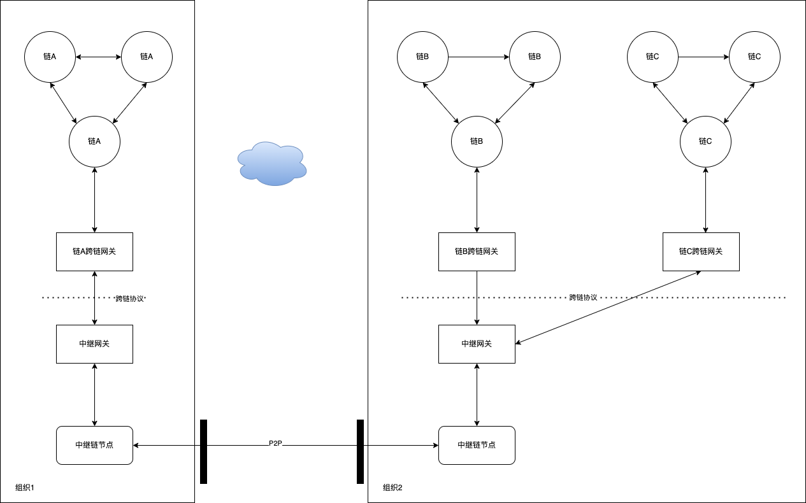
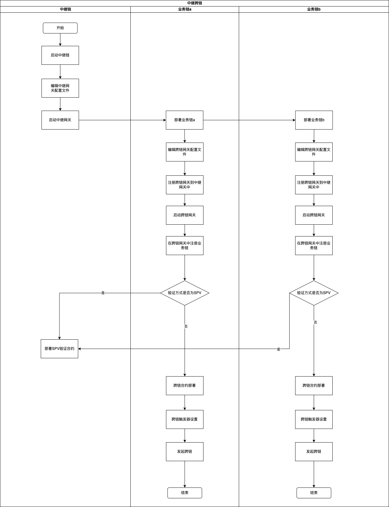

# ChainBridge-TCIP中继跨链使用指南

> 温馨提示，ChainBridge-TCIP中继跨链使用指南请参见：[ChainBridge-TCIP中继跨链使用指南](../manage/TCIP中继跨链使用指南)

## 长安链·ChainBridge“链桥”

什么是跨链？简单理解就是两条或多条链之间进行数据交换，以一个简单易懂的案例来说明，假设有两条链，其中一条链是招行（用户A在该银行中有存款），另外一条链是建行（用户B在该银行中有账户），如果用户A想将自己在招行的存款转账给用户B（建行），那么就需要进行跨链操作。

## 概述

根据长安链的跨链设计，完成一次跨链操作需要中继链（至少一条）、中继网关（至少一个）、跨链网关（至少两个）、事务合约、业务链（至少两条）。跨链使用强依赖于ChainMaker本身，因此请在阅读该跨链使用前先对ChainMaker进行一定程度上的熟悉，否则可能会存在无法部署成功或使用的情况。

> 温馨提示：本项要求长安链版本为v2.3.1及以上，低于该版本需要自行适配，暂时不支持chainmaker业务链使用EVM合约
> 
> Hyperledger Fabric sdk版本为v1.0.0，理论上与此版本sdk适配的链版本均可使用，本项目基于fabric 2.2.0开发
> 
> FISCO-BCOS sdk版本为v1.0.0，理论上与此版本sdk适配的链版本均可使用，本项目基于2.9.0开发

## 相关代码

### tcip-samples 快速部署示例

```shell
git clone https://git.chainmaker.org.cn/chainmaker/tcip-samples.git
```

### tcip-relayer 中继网关

```shell
git clone https://git.chainmaker.org.cn/chainmaker/tcip-relayer.git
```

### tcip-chainmaker 长安链跨链网关

```shell
git clone https://git.chainmaker.org.cn/chainmaker/tcip-chainmaker.git
```

### tcip-fabric fabric跨链网关

```shell
git clone https://git.chainmaker.org.cn/chainmaker/tcip-fabric.git
```

### tcip-bcos bcos跨链网关

```shell
git clone https://git.chainmaker.org.cn/chainmaker/tcip-bcos.git
```

### tcip-go golang语言tcip协议

```shell
git clone https://git.chainmaker.org.cn/chainmaker/tcip-go.git
```

### tcip tcip协议

```shell
git clone https://git.chainmaker.org.cn/chainmaker/tcip.git
```

<a id="deploy"></a>
## 中继跨链部署详解

### 部署方式


TCIP中继跨链服务有两种部署方式，一是组织内跨链，可以使用中心化中继网关的方式部署跨链服务，如上图组织2内部进行跨链；二是组织间进行跨链，可以使用分布式中继网关的方式部署跨链服务，如上图组织一和组织2之间进行跨链。

部署跨链服务的核心是部署中继链、业务链、中继网关、跨链网关、业务链、部署业务合约，主要步骤如下：

#### 中继链相关部署
1. 启动中继链（要求chainmaker版本大于等于v2.3.1），参考[长安链通过命令行工具启动链](../quickstart/通过命令行体验链.md)，此处示例合约为docker-go合约，所以要求启动支持docker-go的长安链节点，参考[通过命令行启动启用Docker虚拟机的链](../instructions/启动支持Docker_VM的链.md)；
2. 下载中继网关代码，编译代码，修改主配置文件`tcip_relay.yml`，使用编译好的命令行工具启动中继网关；
```shell
# 下载中继网关代码
git clone https://git.chainmaker.org.cn/chainmaker/tcip-relayer.git
```
```shell
# 进入主目录,选择相应的tag，编译代码
cd tcip-relayer
git checkout -b [tag]
make
```
```shell
# 修改配置文件
cd config
cat tcip_relayer.yml
```
配置文件内容介绍
```shell
# 网关基础配置
base:
  gateway_id: relay                           # 中继网关ID（保持唯一）
  gateway_name: relay_gateway                 # 中继网关的名称（尽量保持唯一）
  default_timeout: 1000                       # 全局默认超时时间

# rpc服务配置
rpc:
  port: 19999                                   # Web服务监听端口
  restful:
    max_resp_body_size: 10                      # body最大值，单位M
  tls:
    mode: twoway                                # disable, oneway, twoway
    ca_file: config/cert/server/ca.crt          # tlsca文件
    cert_file: config/cert/server/server.crt    # tls证书文件
    key_file: config/cert/server/server.key     # tls私钥文件
    server_name: chainmaker.org                 # 证书中的域名
  max_send_msg_size: 10                         # 最大发送数据大小，单位M
  max_recv_msg_size: 10                         # 最大接收数据大小，单位M
  client_key: config/cert/client/client.key     # 客户端私钥,用来访问跨链网关
  client_cert: config/cert/client/client.crt    # 客户端证书,用来访问跨链网关

# 中继链配置
relay_chain:
  chainmaker_sdk_config_path: config/sdk_config.yml                # 中继链sdk配置文件路径
  users:                                                           # 创建合约需要的用户信息（需要满足中继链的签名策略）
    - sign_key_path: config/crypto-config/wx-org1.chainmaker.org/user/admin1/admin1.sign.key   # 签名私钥路径
      sign_crt_path: config/crypto-config/wx-org1.chainmaker.org/user/admin1/admin1.sign.crt   # 签名证书路径
      org_id: wx-org1.chainmaker.org                                                           # 组织ID
    - sign_key_path: config/crypto-config/wx-org2.chainmaker.org/user/admin1/admin1.sign.key
      sign_crt_path: config/crypto-config/wx-org2.chainmaker.org/user/admin1/admin1.sign.crt
      org_id: wx-org2.chainmaker.org
    - sign_key_path: config/crypto-config/wx-org3.chainmaker.org/user/admin1/admin1.sign.key
      sign_crt_path: config/crypto-config/wx-org3.chainmaker.org/user/admin1/admin1.sign.crt
      org_id: wx-org3.chainmaker.org
    - sign_key_path: config/crypto-config/wx-org4.chainmaker.org/user/admin1/admin1.sign.key
      sign_crt_path: config/crypto-config/wx-org4.chainmaker.org/user/admin1/admin1.sign.crt
      org_id: wx-org4.chainmaker.org

# 日志配置，用于配置日志的打印
# 模块名称取值为：
#  default:默认的日志配置,未配置日志的模块会使用该配置
#  server:服务日志
#  cli:命令行日志
#  access_control:权限控制日志
#  cross_chain_tx_manager:跨链交易日志
#  gateway_manager:跨链网关管理日志
#  handler:控制器日志
#  prove_manager:交易证明日志
#  relay_chain_manager:中继链管理日志
#  rquest_manager:接口请求日志
#  rpc_server:rpc日志
log:
  - module: default                 # 模块名称(取值为：default/server/cli/access_control/)
    log_level: DEBUG                # 日志打印级别
    file_path: logs/default.log     # 日志文件路径
    max_age: 365                    # 日志最长保存时间，单位：天
    rotation_time: 1                # 日志滚动时间，单位：小时
    log_in_console: false           # 是否展示日志到终端，仅限于调试使用
    show_color: true                # 是否打印颜色日志

  - module: server                  # 模块名称
    log_level: DEBUG                # 日志打印级别
    file_path: logs/server.log      # 日志文件路径
    max_age: 365                    # 日志最长保存时间，单位：天
    rotation_time: 1                # 日志滚动时间，单位：小时
    log_in_console: false           # 是否展示日志到终端，仅限于调试使用
    show_color: true                # 是否打印颜色日志
```

<a id="setAdmin"></a>
将中继网关使用的用户证书设置为跨链管理员（以cmc命令行工具发送为例，使用说明详见：[命令行工具](../dev/命令行工具.md)）

```shell
# 设置跨链管理员权限（发送该交易需要admin权限）
./cmc client contract user invoke \
--contract-name=RELAY_CROSS \
--method=SET_CROSS_ADMIN \
--sdk-conf-path=./testdata/sdk_config.yml \
--params="{\"CROSS_ADMIN_ADDRESS\":\"c3877b61d40c757449ad94eec8297bd8bb72d467\"}" \
--sync-result=true
# 查询交易发送者是否拥有管理员权限
./cmc client contract user invoke \
--contract-name=RELAY_CROSS \
--method=IS_CROSS_ADMIN \
--sdk-conf-path=./testdata/sdk_config.yml \
--params="{}" \
--sync-result=true
# 删除跨链管理员（发送该交易需要admin权限）
./cmc client contract user invoke \
--contract-name=RELAY_CROSS \
--method=DELETE_CROSS_ADEMIN \
--sdk-conf-path=./testdata/sdk_config_admin.yml \
--params="{\"CROSS_ADMIN_ADDRESS\":\"c3877b61d40c757449ad94eec8297bd8bb72d467\"}" \
--sync-result=true
```
```shell
# 启动中继网关
nohup ./tcip-relayer start -c ./config/tcip_relayer.yml > panic.log 2>&1 &
```

#### 业务链相关部署

3. 部署业务链，本教程以chainmaker跨chainmaker为例，额外部署两条业务链（中继链也可以作为业务链使用），参考[长安链通过命令行工具启动链](../quickstart/通过命令行体验链.md)；
4. 下载跨链网关代码，编译代码，修改主配置文件，使用编译好的命令行工具到中继网关注册跨链网关，获取到跨链网关编号ID；
```shell
# 下载中继网关代码
git clone https://git.chainmaker.org.cn/chainmaker/tcip-chainmaker.git
git clone https://git.chainmaker.org.cn/chainmaker/tcip-fabric.git
git clone https://git.chainmaker.org.cn/chainmaker/tcip-bcos.git
```
```shell
# 进入主目录,选择相应的tag，编译代码
cd [tcip-chainmaker/tcip-fabric/tcip-bcos]
git checkout -b [tag]
make
```
配置文件内容介绍
```shell
# 修改配置文件
cd config
cat [tcip_chainmaker.yml/tcip_fabric.yml/tcip_bcos.yml]

##################tcip_chainmaker.yml##################
# 网关基础配置
base:
  gateway_id: 0                                # 跨链网关ID（注册的时候由中继网关返回）
  gateway_name: relay_gateway                  # 跨链网关的名称（尽量保持唯一）
  address: 127.0.0.1:19998                     # 中继网关访问跨链网关的地址
  server_name: chainmaker.org                  # 跨链网关的server name（证书中的sans）
  tls_ca: config/cert/client/ca.crt            # 跨链网关的ca证书
  client_cert: config/cert/client/client.crt   # 跨链网关的client证书
  client_key: config/cert/client/client.key    # 跨链网关的client私钥
  to_gateway_list:                             # 允许向哪些跨链网关发起跨链请求，不配置则没有限制
  from_gateway_list:                           # 允许哪些跨链网关对本网关发起跨链请求，不配置则没有限制
  tx_verify_type: spv                          # 交易验证方式，取spv、notneed，这里需要注意的，如果业务链本身又是中继链，那么需要设置为notneed
  tx_verify_interface:                         # 该配置在此项目中不需要设置
  call_type: grpc                              # 调用方式 取值为grpc，暂不支持restful
  default_timeout: 1000                        # 默认全局延时，s

# rpc服务配置
rpc:
  port: 19998                        # Web服务监听端口
  restful:
    max_resp_body_size: 10           # body最大值，单位M
  tls:
    ca_file: config/cert/server/ca.crt          # tlsca文件
    cert_file: config/cert/server/server.crt    # tls证书文件
    key_file: config/cert/server/server.key     # tls私钥文件
    server_name: chainmaker.org                 # 证书中的域名
  max_send_msg_size: 10                # 最大发送数据大小，单位M
  max_recv_msg_size: 10                # 最大接收数据大小，单位M

# 中继链配置
relay:
  address: 127.0.0.1:19999                       # 中继网关地址
  server_name: chainmaker.org                    # 中继网关域名
  tls_ca: config/cert/server/ca.crt              # 中继网关的tlsca证书
  client_cert: config/cert/client/client.crt     # 中继网关客户端证书
  client_key: config/cert/client/client.key      # 中继网关客户端私钥
  call_type: grpc                                # 中继网关调用方式，grpc，暂不支持restful的形式

# leveldb数据库路径
db_path: "./database"

# 日志配置，用于配置日志的打印
# 模块名称取值为：
#  default:默认的日志配置,未配置日志的模块会使用该配置
#  server:服务日志
#  cli:命令行日志
#  access_control:权限控制日志
#  cross_chain_tx_manager:跨链交易日志
#  gateway_manager:跨链网关管理日志
#  handler:控制器日志
#  prove_manager:交易证明日志
#  relay_chain_manager:跨链链管理日志
#  rquest_manager:接口请求日志
#  rpc_server:rpc日志
log:
  - module: default                 # 模块名称(取值为：default/start/register)
    log_level: DEBUG                 # 日志打印级别
    file_path: logs/default.log     # 日志文件路径
    max_age: 365                    # 日志最长保存时间，单位：天
    rotation_time: 1                # 日志滚动时间，单位：小时
    log_in_console: true           # 是否展示日志到终端，仅限于调试使用
    show_color: true                # 是否打印颜色日志

##################tcip_fabric.yml##################
# 网关基础配置
base:
  gateway_id: 0                                  # 跨链网关ID（注册的时候由中继网关返回）
  gateway_name: relay_gateway                    # 跨链网关的名称（尽量保持唯一）
  address: 127.0.0.1:19998                       # 中继网关访问跨链网关的地址
  server_name: chainmaker.org                    # 跨链网关的server name（证书中的sans）
  tls_ca: config/cert/client/ca.crt              # 跨链网关的ca证书
  client_cert: config/cert/client/client.crt     # 跨链网关的client证书
  client_key: config/cert/client/client.key      # 跨链网关的client私钥
  to_gateway_list:                               # 允许向哪些跨链网关发起跨链请求，不配置则没有限制
  from_gateway_list:                             # 允许哪些跨链网关对本网关发起跨链请求，不配置则没有限制
  tx_verify_type: rpc                            # 交易验证方式，rpc、notneed
  tx_verify_interface:                           # 交易验证接口，如果是notneed则不需要配置
    address: 127.0.0.1:19998/v1/TxVerify         # 交易验证地址（本项目为本服务地址）
    tls_enable: true                             # 是否启用tls，ture的话要配置下面两个个证书路径和域名
    tls_ca: config/cert/client/ca.crt            # ca证书
    client_cert: config/cert/client/client.crt   # 客户端证书
    host_name: chainmaker.org                    # 域名
  call_type: grpc                                # 调用方式 取值为grpc，暂不支持restful
  default_timeout: 100                           # 默认全局延时，s

# rpc服务配置
rpc:
  port: 19998                        # Web服务监听端口
  restful:
    max_resp_body_size: 10           # body最大值，单位M
  tls:
    ca_file: config/cert/server/ca.crt          # tlsca文件
    cert_file: config/cert/server/server.crt    # tls证书文件
    key_file: config/cert/server/server.key     # tls私钥文件
    server_name: localhost                      # 证书中的域名
  max_send_msg_size: 10                # 最大发送数据大小，单位M
  max_recv_msg_size: 10                # 最大接收数据大小，单位M

# 中继链配置
relay:
  address: 127.0.0.1:19999                       # 中继网关地址
  server_name: chainmaker.org                    # 中继网关域名
  tls_ca: config/cert/server/ca.crt              # 中继网关的tlsca证书
  client_cert: config/cert/client/client.crt     # 中继网关客户端证书
  client_key: config/cert/client/client.key      # 中继网关客户端私钥
  call_type: grpc                                # 中继网关调用方式，grpc/restful

# 日志配置，用于配置日志的打印
# 模块名称取值为：
#  default:默认的日志配置,未配置日志的模块会使用该配置
#  server:服务日志
#  cli:命令行日志
#  access_control:权限控制日志
#  cross_chain_tx_manager:跨链交易日志
#  gateway_manager:跨链网关管理日志
#  handler:控制器日志
#  prove_manager:交易证明日志
#  relay_chain_manager:跨链链管理日志
#  rquest_manager:接口请求日志
#  rpc_server:rpc日志
log:
  - module: default                 # 模块名称(取值为：default/start/register)
    log_level: DEBUG                 # 日志打印级别
    file_path: logs/default.log     # 日志文件路径
    max_age: 365                    # 日志最长保存时间，单位：天
    rotation_time: 1                # 日志滚动时间，单位：小时
    log_in_console: true           # 是否展示日志到终端，仅限于调试使用
    show_color: true                # 是否打印颜色日志

# leveldb数据库路径
db_path: "./database"

##################tcip_bcos.yml##################
# 网关基础配置
base:
  gateway_id: 0                                # 跨链网关ID（注册的时候由中继网关返回）
  gateway_name: relay_gateway                  # 跨链网关的名称（尽量保持唯一）
  address: 127.0.0.1:19998                     # 中继网关访问跨链网关的地址
  server_name: chainmaker.org                  # 跨链网关的server name（证书中的sans）
  tls_ca: config/cert/client/ca.crt            # 跨链网关的ca证书
  client_cert: config/cert/client/client.crt   # 跨链网关的client证书
  client_key: config/cert/client/client.key    # 跨链网关的client私钥
  to_gateway_list:                             # 允许向哪些跨链网关发起跨链请求，不配置则没有限制
  from_gateway_list:                           # 允许哪些跨链网关对本网关发起跨链请求
  tx_verify_type: rpc                          # 交易验证方式，取rpc、notneed
  tx_verify_interface:                         # 交易验证接口，如果是notneed则不需要配置
    address: 127.0.0.1:19998/v1/TxVerify       # 交易验证地址（本项目为本服务地址）
    tls_enable: true                           # 是否启用tls，ture的话要配置下面两个个证书路径和域名
    tls_ca: config/cert/client/ca.crt          # ca证书
    client_cert: config/cert/client/client.crt # 客户端证书
    host_name: chainmaker.org                  # 域名
  call_type: grpc                              # 调用方式 取值为grpc，暂不支持restful
  default_timeout: 1000                        # 默认全局延时，s

# rpc服务配置
rpc:
  port: 19998                        # Web服务监听端口
  restful:
    max_resp_body_size: 10           # body最大值，单位M
  tls:
    ca_file: config/cert/server/ca.crt          # tlsca文件
    cert_file: config/cert/server/server.crt    # tls证书文件
    key_file: config/cert/server/server.key     # tls私钥文件
    server_name: chainmaker.org                 # 证书中的域名
  max_send_msg_size: 10                # 最大发送数据大小，单位M
  max_recv_msg_size: 10                # 最大接收数据大小，单位M

# 中继链配置
relay:
  address: 127.0.0.1:19999                       # 中继网关地址
  server_name: chainmaker.org                    # 中继网关域名
  tls_ca: config/cert/server/ca.crt              # 中继网关的tlsca证书
  client_cert: config/cert/client/client.crt     # 中继网关客户端证书
  client_key: config/cert/client/client.key      # 中继网关客户端私钥
  call_type: grpc                                # 中继网关调用方式，grpc/restful

# leveldb数据库路径
db_path: "./database"

# 日志配置，用于配置日志的打印
# 模块名称取值为：
#  default:默认的日志配置,未配置日志的模块会使用该配置
#  server:服务日志
#  cli:命令行日志
#  access_control:权限控制日志
#  cross_chain_tx_manager:跨链交易日志
#  gateway_manager:跨链网关管理日志
#  handler:控制器日志
#  prove_manager:交易证明日志
#  relay_chain_manager:跨链链管理日志
#  rquest_manager:接口请求日志
#  rpc_server:rpc日志
log:
  - module: default                 # 模块名称(取值为：default/start/register)
    log_level: DEBUG                 # 日志打印级别
    file_path: logs/default.log     # 日志文件路径
    max_age: 365                    # 日志最长保存时间，单位：天
    rotation_time: 1                # 日志滚动时间，单位：小时
    log_in_console: true           # 是否展示日志到终端，仅限于调试使用
    show_color: true                # 是否打印颜色日志
```
```shell
# 注册跨链网关
./tcip-chainmaker register -c config/tcip_chainmaker.yml
./tcip-fabric register -c config/tcip_fabric.yml
./tcip-bcos register -c config/tcip_bcos.yml
```
根据生成的注册json文件调用中继网关的/v1/GatewayRegister进行注册，参考[tcip协议规范](../tech/中继跨链协议.md)
```shell
# 将返回的跨链网关编号ID写入配置文件中
{"gateway_id":"1","message":"GATEWAY_SUCCESS"}
```
5. 修改主配置文件`tcip-chainmaker.yml`，将中继网关编号ID写入配置文件，使用编译好的命令行工具启动跨链网关；
```shell
# 将返回的跨链网关编号ID写入配置文件中
{"gateway_id":"1","message":"GATEWAY_SUCCESS"}
```
```shell
# 启动跨链网关
nohup ./tcip-chainmaker start -c ./config/tcip_chainmaker.yml > panic.log 2>&1 &
nohup ./tcip-fabric start -c ./config/tcip_chainmaker.yml > panic.log 2>&1 &
nohup ./tcip-bcos start -c ./config/tcip_chainmaker.yml > panic.log 2>&1 &
```
6. 在跨链网关中注册业务链；

调用跨链网关的/v1/ChainIdentity接口进行注册，参考[tcip协议规范](../tech/中继跨链协议.md)
```shell
# chainmaker示例
{
  "version": 0,
  "operate": 0,
  "chainmaker_config": {
    "chain_rid": "chainmaker001",
    "chain_id": "chain2",
    "org_id": "wx-org.chainmaker.org",
    "sign_cert": "签名证书字符串",
    "sign_key": "签名私钥字符串",
    "tls_cert": "tls证书字符串",
    "tls_key": "tls私钥字符串",
    "node": [
      {
        "node_addr": "127.0.0.1:12301",
        "trust_root": [
          "ca证书字符串"
        ],
        "conn_cnt": 10,
        "enable_tls": true,
        "tls_host_name": "chainmaker.org"
      }
    ]
  }
}
#fabric示例
{
  "version": 0,
  "operate": 0,
  "fabric_config": {
    "chain_rid": "chain001",
    "chain_id": "mychannel",
    "org": [
      {
        "org_id": "Org1",
        "msp_id": "Org1MSP",
        "sign_cert": "签名证书字符串",
        "sign_key": "签名私钥字符串",
        "peers": [
          {
            "node_addr": "grpcs://9.134.82.212:7051",
            "trust_root": ["peer ca证书字符串"],
            "tls_host_name": "peer0.org1.example.com"
          }
        ]
      },
      {
        "org_id": "Org2",
        "msp_id": "Org2MSP",
        "sign_cert": "签名证书字符串",
        "sign_key": "签名私钥字符串",
        "peers": [
          {
            "node_addr": "grpcs://9.134.82.212:9051",
            "trust_root": ["peer ca证书字符串"],
            "tls_host_name": "peer0.org2.example.com"
          }
        ]
      }
    ],
    "tls_cert": "tls证书字符串",
    "tls_key": "tls私钥字符串",
    "orderers": [
      {
        "node_addr": "grpcs://9.134.82.212:7050",
        "trust_root": ["orderer ca证书字符串"],
        "tls_host_name": "orderer.example.com"
      }
    ]
  }
}
#bcos示例
{
  "version": 0,
  "operate": 0,
  "bcos_config": {
    "chain_rid": "chain002",
    "ca": "ca证书字符串",
    "tls_key": "tls私钥字符串",
    "tls_cert": "tls证书字符串",
    "private_key": "私钥字符串",
    "group_id": "1",
    "address": "127.0.0.1:20200",
    "chain_id": 1,
    "is_sm_crypto": false
  }
}
```

#### spv验证合约部署
7. tcip-chainmaker验证方式为spv时，需要部署spv合约，合约名称为`spv[gatewayId][chainRid]`([tcip-samples](https://git.chainmaker.org.cn/chainmaker/tcip-samples.git) 项目提供了spv验证合约，如需自己实现需要完全按照该合约的方法和参数进行改造)

#### 跨链合约部署
8. 部署跨链合约（要求跨链合约中需要有合约事件产生，事件中需要包含跨链所需要的数据，[tcip-samples](https://git.chainmaker.org.cn/chainmaker/tcip-samples.git) 项目提供了示例的跨链合约，可以参考该合约进行实现）

    chainmaker可以参考[命令行工具安装合约](../dev/命令行工具.md)

    fabric可以参考[在通道中部署智能合](https://hyperledger-fabric.readthedocs.io/zh_CN/release-2.2/deploy_chaincode.html)

    bcos可以参考[合约开发样例](https://fisco-bcos-documentation.readthedocs.io/zh_CN/latest/docs/sdk/go_sdk/contractExamples.html)

#### 跨链触发器设置
9. 在跨链网关中注册跨链事件触发器；
调用跨链网关的/v1/CrossChainEvent接口注册跨链事件触发器参考[tcip协议规范](../tech/中继跨链协议.md)
```shell
#chainchain-chainmaker示例
{
  "version": 0,
  "operate": 0,
  "cross_chain_event": {
    "cross_chain_event_id": "0000001",
    "chain_rid": "chainmaker001",
    "contract_name": "erc20_01",
    "cross_chain_name": "test",
    "cross_chain_flag": "test",
    "trigger_condition": 1,
    "event_name": "transfer",
    "timeout": 1000,
    "cross_type": 1,
    "chainmaker_event_data_type": [
      0, 0, 0
    ],
    "is_cross_chain": "one == \"lockaddress\"",
    "confirm_info": {},
    "cancel_info": {
      "chain_rid": "chainmaker001",
      "contract_name": "erc20_01",
      "method": "invoke_contract",
      "parameter": "{\"method\":\"minter\",\"to\":\"%s\",\"value\":\"%s\"}",
      "param_data": [0, 2]
    },
    "cross_chain_create": [
      {
        "gateway_id":"1",
        "chain_rid": "chainmaker002",
        "contract_name": "erc20_02",
        "method": "invoke_contract",
        "parameter": "{\"method\":\"minter\",\"to\":\"2988661373ff198c5e5b14a65d78569a710cccfb3e44bb60cf2d8c0e440f12ef\",\"value\":\"%s\"}",
        "param_data": [2],
        "confirm_info": {
          "chain_rid": "chainmaker002",
          "contract_name": "erc20_02",
          "method": "invoke_contract",
          "parameter": "{\"method\":\"transfer\",\"to\":\"%s\",\"value\":\"%s\"}",
          "param_data": [0, 2]
        },
        "cancel_info": {
          "chain_rid": "chainmaker002",
          "contract_name": "erc20_02",
          "method": "invoke_contract",
          "parameter": "{\"method\":\"burn\",\"value\":\"%s\"}",
          "param_data": [2]
        }
      }
    ]
  }
}
#fabric-bcos示例
{
  "version": 0,
  "operate": 0,
  "cross_chain_event": {
    "cross_chain_event_id": "0000001",
    "chain_rid": "chain001",
    "contract_name": "crosschain1",
    "cross_chain_name": "test",
    "cross_chain_flag": "test",
    "trigger_condition": 1,
    "event_name": "test",
    "timeout": 1000,
    "fabric_event_data_type": 6,
    "cross_type": 1,
    "fabric_array_event_data_type": [
      0, 0
    ],
    "is_cross_chain": "zero == \"fabr2bcoskey\"",
    "confirm_info": {
      "chain_rid": "chain001",
      "contract_name": "crosschain1",
      "method": "CrossChainConfirm",
      "parameter": "[\"%s\"]",
      "param_data": [0]
    },
    "cancel_info": {
      "chain_rid": "chain001",
      "contract_name": "crosschain1",
      "method": "CrossChainCancel",
      "parameter": "[\"%s\"]",
      "param_data": [0]
    },
    "cross_chain_create": [
      {
        "gateway_id":"1",
        "chain_rid": "chain002",
        "contract_name": "ADDRESS1",
        "method": "CrossChainTry",
        "parameter": "[\"%s\",\"%s\"]",
        "param_data": [0, 1],
        "param_data_type": [0, 0],
        "abi": "合约abi字符串",
        "confirm_info": {
          "chain_rid": "chain002",
          "contract_name": "ADDRESS1",
          "method": "CrossChainConfirm",
          "parameter": "[\"%s\"]",
          "param_data": [0],
          "param_data_type": [0],
          "abi": "合约abi字符串"
        },
        "cancel_info": {
          "chain_rid": "chain002",
          "contract_name": "ADDRESS1",
          "method": "CrossChainCancel",
          "parameter": "[\"%s\"]",
          "param_data": [0],
          "param_data_type": [0],
          "abi": "合约abi字符串"
        }
      }
    ]
  }
}
#bcos-fabric示例
{
  "version": 0,
  "operate": 0,
  "cross_chain_event": {
    "cross_chain_event_id": "0000001",
    "chain_rid": "chain002",
    "contract_name": "ADDRESS1",
    "cross_chain_name": "test",
    "cross_chain_flag": "test",
    "trigger_condition": 1,
    "event_name": "Test(string,string)",
    "timeout": 1000,
    "cross_type": 1,
    "bcos_event_data_type": [
      0, 0, 0
    ],
    "is_cross_chain": "one == \"bcos2fabkey\"",
    "confirm_info": {
      "chain_rid": "chain002",
      "contract_name": "ADDRESS1",
      "method": "CrossChainConfirm",
      "parameter": "[\"%s\"]",
      "param_data": [
        1
      ],
      "param_data_type": [
        0
      ],
      "abi": "合约abi字符串"
    },
    "cancel_info": {
      "chain_rid": "chain002",
      "contract_name": "ADDRESS1",
      "method": "CrossChainCancel",
      "parameter": "[\"%s\"]",
      "param_data": [
        1
      ],
      "param_data_type": [
        0
      ],
      "abi": "合约abi字符串"
    },
    "abi": [
      "{\"name\":\"value\",\"type\":\"string\"}","{\"name\":\"flag\",\"type\":\"string\"}"
    ],
    "cross_chain_create": [
      {
        "gateway_id":"0",
        "chain_rid": "chain001",
        "contract_name": "crosschain1",
        "method": "CrossChainTry",
        "parameter": "[\"%s\",\"%s\"]",
        "param_data": [1, 2],
        "confirm_info": {
          "chain_rid": "chain001",
          "contract_name": "crosschain1",
          "method": "CrossChainConfirm",
          "parameter": "[\"%s\"]",
          "param_data": [1]
        },
        "cancel_info": {
          "chain_rid": "chain001",
          "contract_name": "crosschain1",
          "method": "CrossChainCancel",
          "parameter": "[\"%s\"]",
          "param_data": [1]
        }
      }
    ]
  }
}
```

#### 发起跨链
10. 发起跨链请求，调用相应的合约方法；

    chainmaker可以参考[命令行工具安装合约](../dev/命令行工具.md)

    fabric可以参考[在通道中部署智能合](https://hyperledger-fabric.readthedocs.io/zh_CN/release-2.2/deploy_chaincode.html)

    bcos可以参考[合约开发样例](https://fisco-bcos-documentation.readthedocs.io/zh_CN/latest/docs/sdk/go_sdk/contractExamples.html)
11. 查询跨链结果，调用相应的合约方法进行查询；

    chainmaker可以参考[命令行工具安装合约](../dev/命令行工具.md)

    fabric可以参考[在通道中部署智能合](https://hyperledger-fabric.readthedocs.io/zh_CN/release-2.2/deploy_chaincode.html)

    bcos可以参考[合约开发样例](https://fisco-bcos-documentation.readthedocs.io/zh_CN/latest/docs/sdk/go_sdk/contractExamples.html)

#### 部署流程图示


## 快速部署

1. 下载tcip-samples项目(文件树述请参考该项目中的README.md文件)
> 该项目中需要用到chainmaker、cmc的二进制文件
> 
> 请下载chainmaker的二进制文件到chainmaker2chainmaker/chainmaker-go-run/chainmaker/bin和fabric2bcos/chainmaker-go-run/chainmaker/bin文件夹下，下载地址：[chainmaker-v2.3.2-linux-x86_64](https://git.chainmaker.org.cn/chainmaker/chainmaker-go/uploads/b7f6f31a96334c4ea49aab0d680bbf75/chainmaker-v2.3.2-linux-x86_64.tar.gz)，并解压命名为chainmaker
> 
> 请下载cmc的二进制文件到chainmaker2chainmaker/chainmaker-go-run和fabric2bcos/chainmaker-go-run文件夹下，下载地址：[cmc-v2.3.2-linux-x86_64](https://git.chainmaker.org.cn/chainmaker/chainmaker-go/uploads/0d820ef4c4864db6b8b9b28540564fa2/cmc-v2.3.2-linux-x86_64.tar.gz)，并解压命名为cmc
> 
> 温馨提示：tcip-samples项目启动前，需要将中继网关使用的证书设置为跨链管理员，设置方法参考[将中继网关使用的用户证书设置为跨链管理员](#setAdmin)。
```shell
git clone https://git.chainmaker.org.cn/chainmaker/tcip-samples.git
```
2. 进入主项目目录
```shell
cd tcip-samples
```
3. 项目目录如下
```shell
├── chainmaker2chainmaker #长安链跨长安链环境快速搭建目录
├── fabric2bcos           #fabric、bcos互相跨链环境快速搭建目录
├── Makefile              #makefile
├── README.md             #帮助文档
└── test.sh               #测试脚本
```
4. 部署流程详见该项目README.md

> 温馨提示：tcip-samples项目中的跨链网关可以随意自由组合，这里只是提供了三种跨链场景，长安链与fabric互跨、长安链与bcos互跨场景可以参考[中继跨链部署](#deploy)详解自行搭建，中继网关可以按需搭建多个，达到去中心化的目的。

## 更新网关信息

1. 修改对应的跨链网关配置；
2. 使用如下命令生成配置信息：
```shell
./tcip-chainmaker update -c config/tcip_chainmaker.yml
./tcip-fabric update -c config/tcip_chainmaker.yml
./tcip-bcos update -c config/tcip_chainmaker.yml
```
3. 生成"update.json"文件,使用该文件内容作为body，调用/v1/GatewayUpdate接口进行更新，参考[tcip协议规范](../tech/中继跨链协议.md)

## 中继网关断电恢复

处于跨链过程中的跨链交易，当中继网关断电后会自动恢复。

> 需要注意的是，由于中继网关断电导致的区块头同步失败，会导致中继链在断电恢复的过程中多次尝试请求区块头，从而减慢中继网关的启动速度，并且处于WAIT_EXECUTE状态的跨链交易会因为交易验证失败进入回滚状态，需要在正常的情况下再次触发