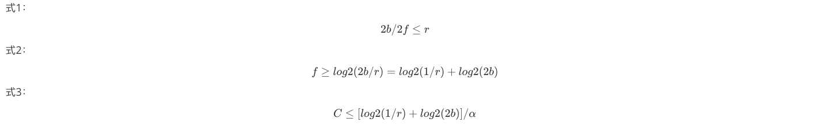
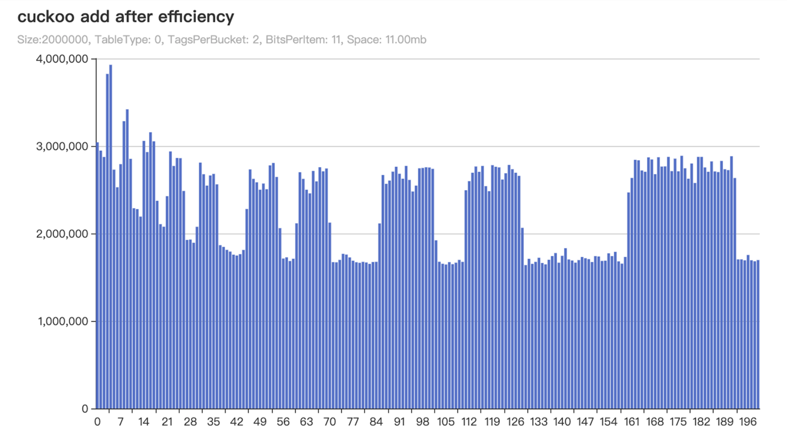
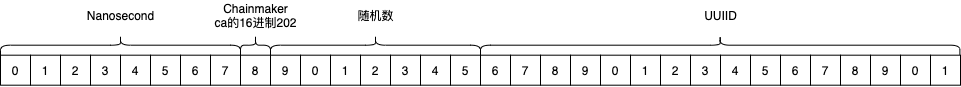

# 交易过滤器-配置指南

阅读该文档您可以充分的了解到交易过滤器中每个字段的含义，以及开启后对业务的影响，您还可以了解到布谷鸟过滤器的性能调优公式选择适合自己的配置或者您也可以直接查看[建议配置](#id10)。

## 配置解析

交易过滤器的配置在`chainmaker.yml`中，`tx_filter`是交易过滤器的根节点，包含如下3个属性：

参考配置如下：

```yaml
# Transaction filter settings
tx_filter:
  # default(store) 0; bird's nest 1; map 2; 3 sharding bird's nest
  # 3 is recommended.
  type: 3
  # sharding bird's nest config
  # total keys = sharding.length * sharding.birds_nest.length * sharding.birds_nest.cuckoo.max_num_keys
  sharding:
    ...
  # bird's nest config
  # total keys = birds_nest.length * birds_nest.cuckoo.max_num_keys
  birds_nest:
    ...
```

交易过滤器类型（`tx_filter.type`）：可选项有4种，分别为： 0 [默认交易过滤器（store）](#store)、1 [鸟巢交易过滤器（bird's nest）](#birds-nest)类型
、2 [map交易过滤器（map）](#map-map)、3 [分片鸟巢交易过滤器（sharding bird's nest）](#sharding-bird-s-nest)类型

鸟巢交易过滤器（`tx_filter.birds_nest`）：鸟巢交易过滤器，是可选参数，如果配置鸟巢交易过滤器类型，需要将`tx_filter.type`设置为`1`
，并且该属性为必填，具体配置请请参照[鸟巢交易过滤器（bird's nest）](#birds-nest)

分片鸟巢交易过滤器（`tx_filter.sharding`）：分片鸟巢交易过滤器包含多个鸟巢交易过滤器，是可选参数，如果配置分片鸟巢交易过滤器类型，需要将`tx_filter.type`设置为`3`
，并且该属性为必填，具体配置请请参照[分片鸟巢交易过滤器（sharding bird's nest）](#sharding-bird-s-nest)

### 默认交易过滤器（store）

该类型是交易过滤器的默认选项，选择该类型交易查重操作会直接查询数据库。

参考配置如下：

```yml
# Transaction filter settings
tx_filter:
  # default(store) 0; bird's nest 1; map 2; 3 sharding bird's nest
  type: 0
```

### 鸟巢交易过滤器（birds_nest）

鸟巢交易过滤器类型是由多个[布谷鸟过滤器（cuckoo）](#cuckoo)组成的，添加交易时会顺序的填充到每个布谷鸟中，通过增加时间的概念，在多个布谷鸟过滤器中淘汰最老的一个，实现在鸟巢交易过滤器中只留存最近的一批交易。

参考配置如下：

```yml
# Transaction filter settings
tx_filter:
  # default(store) 0; bird's nest 1; map 2; 3 sharding bird's nest
  # 3 is recommended.
  type: 1
  # bird's nest config
  # total keys = birds_nest.length * birds_nest.cuckoo.max_num_keys
  birds_nest:
    # bird's nest size
    length: 10
    snapshot:
      # serialize type
      # 0 Serialization by height interval
      # 1 Serialization by time interval
      type: 0
      block_height:
        # Block height interval
        interval: 10
      timed:
        # Time interval in seconds
        interval: 10
      # file path
      path: ../data/{org_id}/tx_filter
    # Transaction filter rules
    rules:
      # Absolute expiration time /second
      # Based on the number of transactions per day, for example, the current total capacity of blockchain transaction
      # filters is 100 million, and there are 10 million transaction requests per day.
      #
      # total keys = sharding.length * sharding.birds_nest.length * sharding.birds_nest.cuckoo.max_num_keys
      #
      # absolute expire time = total keys / number of requests per day
      absolute_expire_time: 172800
    cuckoo:
      # num of tags for each bucket, which is b in paper. tag is fingerprint, which is f in paper.
      # If you are using a semi-sorted bucket, the default is 4
      # 2 is recommended.
      tags_per_bucket: 2
      # num of bits for each item, which is length of tag(fingerprint)
      # 11 is recommended.
      bits_per_item: 11
      # keys number
      max_num_keys: 2000000
      # 0 TableTypeSingle normal single table
      # 1 TableTypePacked packed table, use semi-sort to save 1 bit per item
      # 0 is recommended
      table_type: 0
```

#### 布谷鸟过滤器数量（length）

布谷鸟过滤器数量（`tx_filter.birds_nest.length`）: 该字段定义了鸟巢交易过滤器中包含的布谷鸟过滤器的数量

#### 快照（snapshot）

鸟巢交易过滤器是以快照的形式将内存中的布谷鸟过滤器保存到磁盘中。

参考配置如下：

```yaml
snapshot:
  # serialize type
  # 0 Serialization by height interval
  # 1 Serialization by time interval
  type: 0
  block_height:
    # Block height interval
    interval: 10
  timed:
    # Time interval in seconds
    interval: 10
  # file path
  path: ../data/{org_id}/tx_filter
```

##### 快照类型（type）

快照类型（`tx_filter.birds_nest.snapshot.type`）：字段有如下类型

- 0 区块高度间隔持久化

  根据区块高度间隔持久化鸟巢交易过滤器中的数据，需指定`tx_filter.birds_nest.snapshot.block_height.interval`数值；单位：区块高度

- 1 时间间隔持久化

  根据时间间隔持久化鸟巢交易过滤器中的数据，需指定`tx_filter.birds_nest.snapshot.timed.interval`数值；单位：秒

##### 快照路径（path）

快照路径（`tx_filter.birds_nest.snapshot.path`）：用于指定文件存储路径

#### 规则（rules）

由于[鸟巢交易过滤器（bird's nest）](#birds-nest)或者[分片鸟巢交易过滤器（sharding bird's nest）](#sharding-bird-s-nest)
中只保存最近的一批交易，所以根据规则印证这个Key是否在过滤器的查重处理范围之内，如果在就可以使用过滤器快速查重。

参考配置如下：

```yaml
# Transaction filter rules
rules:
  # Absolute expiration time /second
  # Based on the number of transactions per day, for example, the current total capacity of blockchain transaction
  # filters is 100 million, and there are 10 million transaction requests per day.
  #
  # total keys = sharding.length * sharding.birds_nest.length * sharding.birds_nest.cuckoo.max_num_keys
  #
  # absolute expire time = total keys / number of requests per day
  absolute_expire_time: 172800
```

##### 绝对超时时间（absolute_expire_time）

由于[鸟巢交易过滤器（bird's nest）](#birds-nest)或者[分片鸟巢交易过滤器（sharding bird's nest）](#sharding-bird-s-nest)
中只保存最近的一批交易，所以绝对超时时间规则可以简单有效的判断这个Key是否在过滤器之内。

关于[时间交易ID规范](#id)的说明。

绝对超时时间规则（`tx_filter.birds_nest.rules.absolute_expire_time`）：该字段表示一个时间范围，交易ID中的时间在提案和校验时不可以超过当前时间±绝对超时时间范围，细节请参考[绝对超时时间属性相关说明](#id13)。

```
(currentTime-absoluteExpireTime, currentTime+absoluteExpireTime) = { x ∈ R: currentTime-absoluteExpireTime < x < currentTime+absoluteExpireTime}
```

#### 布谷鸟过滤器（cuckoo）

当前章节只对字段进行说明，如何选择相关参数会在下一章节体现[性能分析](#id6)

参考配置如下：

```yaml
cuckoo:
  # num of tags for each bucket, which is b in paper. tag is fingerprint, which is f in paper.
  # If you are using a semi-sorted bucket, the default is 4
  # 2 is recommended.
  tags_per_bucket: 2
  # num of bits for each item, which is length of tag(fingerprint)
  # 11 is recommended.
  bits_per_item: 11
  # keys number
  max_num_keys: 2000000
  # 0 TableTypeSingle normal single table
  # 1 TableTypePacked packed table, use semi-sort to save 1 bit per item
  # 0 is recommended
  table_type: 0
```

##### 布谷鸟过滤器类型（table_type）

布谷鸟过滤器类型（`tx_filter.birds_nest.cuckoo.table_type`）：布谷鸟过滤器类型有两种类型，针对该字段的选择可以参考[空间复杂度](#id9)这节。

- 0 单桶（`TableTypeSingle`），占用空间略大于半序桶，但插入耗时相对更均衡，建议使用
- 1 半序桶（`TableTypePacked`），半序桶相对单桶在相同配置的情况下可以节省11.1%的空间占用，但插入效率抖动略大于单桶

##### 桶大小（tags_per_bucket）

桶大小（`tx_filter.birds_nest.cuckoo.tags_per_bucket`）：桶大小，每个桶存储指纹的数量

##### 指纹长度（bits_per_item）

指纹长度（`tx_filter.birds_nest.cuckoo.bits_per_item`）：指纹长度是指交易ID经过Hash后的存储在桶中的位数，指纹长度越长占用空间越多

##### Key数量（max_num_keys）

Key数量（`tx_filter.birds_nest.cuckoo.max_num_keys`）：布谷鸟过滤器存储的Key数量

### map交易过滤器（map）

会保存全量的key在内存中，优点是相比过滤器没有假阳性，缺点是没有淘汰策略，占用的空间会越来越大；key会存储在内存中，没有持久化措施重启数据会消失，不建议线上引用。

参考配置如下：

```yml
# Transaction filter settings
tx_filter:
  # default(store) 0; bird's nest 1; map 2; 3 sharding bird's nest
  type: 2
```

### 分片鸟巢交易过滤器（sharding bird's nest）

分片鸟巢交易过滤器是由多个鸟巢交易过滤器组成的，是原有的鸟巢交易过滤器的优化方案，每一个鸟巢交易过滤器都代表一个分片，用并行的方式提高鸟巢交易过滤器的处理能力。

参考配置如下：

```yml
# Transaction filter settings
tx_filter:
  # default(store) 0; bird's nest 1; map 2; 3 sharding bird's nest
  # 3 is recommended.
  type: 3
  # sharding bird's nest config
  # total keys = sharding.length * sharding.birds_nest.length * sharding.birds_nest.cuckoo.max_num_keys
  sharding:
    # sharding size
    length: 5
    # sharding task timeout in seconds
    timeout: 3
    snapshot:
      # serialize type
      # 0 Serialization by height interval
      # 1 Serialization by time interval
      type: 0
      block_height:
        # Block height interval
        interval: 10
      timed:
        # Time interval in seconds
        interval: 10
      # file path
      path: ../data/{org_id}/tx_filter
    # bird's nest config
    birds_nest:
      # bird's nest size
      length: 10
      # Transaction filter rules
      rules:
        # Absolute expiration time /second
        # Based on the number of transactions per day, for example, the current total capacity of blockchain transaction
        # filters is 100 million, and there are 10 million transaction requests per day.
        #
        # total keys = sharding.length * sharding.birds_nest.length * sharding.birds_nest.cuckoo.max_num_keys
        #
        # absolute expire time = total keys / number of requests per day
        absolute_expire_time: 172800
      cuckoo:
        # num of tags for each bucket, which is b in paper. tag is fingerprint, which is f in paper.
        # If you are using a semi-sorted bucket, the default is 4
        # 2 is recommended.
        tags_per_bucket: 2
        # num of bits for each item, which is length of tag(fingerprint)
        # 11 is recommended.
        bits_per_item: 11
        # keys number
        max_num_keys: 2000000
        # 0 TableTypeSingle normal single table
        # 1 TableTypePacked packed table, use semi-sort to save 1 bit per item
        # 0 is recommended
        table_type: 0
```

#### 分片数量（length）

分片数量（`tx_filter.sharding.length`）：每一个分片都代表一个鸟巢交易过滤器

#### 分片超时时间（timeout）

分片超时时间（`tx_filter.sharding.timeout`）：在执行分片算法时，协程的超时时间，单位：秒

#### 分片快照（snapshot）

快照（`tx_filter.sharding.snapshot`）：分片快照和鸟巢交易过滤器中介绍的快照是一致的，可参考[快照（snapshot）](#snapshot)

值得注意的是，内存中分片鸟巢交易过滤器和其包含的鸟巢交易过滤器都需要持久化快照功能，所以只需要在分片鸟巢交易过滤器中配置快照即可，鸟巢交易过滤器中不需要配置快照。

#### 鸟巢交易过滤器（birds_nest）

鸟巢交易过滤器（`tx_filter.sharding.birds_nest`）：用于设置分片鸟巢交易过滤器下的鸟巢交易过滤器，可参考[鸟巢交易过滤器（bird's nest）](#birds-nest)

## 性能分析

### 布谷鸟过滤器的重要参数

**会用到的数学符号：**

| 符号  | 属性（对应长安链配置） | 含义                                           |
| ----- | ---------------------- | ---------------------------------------------- |
| **k** |                        | **hash函数个数（固定为2）**                    |
| **b** | **tags_per_bucket**    | **每个桶存储多少个指纹**                       |
| **f** | **bits_per_item**      | **每个指纹存储键的哈希值的多少位**             |
| **r** |                        | **假阳性概率（可以通过桶和指纹长度计算出来）** |
| **α** |                        | **负载因子 (0 ≤ α ≤ 1)**                       |
| **C** |                        | **每个项的平均位**                             |

根据论文[[2]](#reference)得知以下结论：

- 过滤器无法 100% 填满，存在最大负载因子 α，那么均摊到每个项上的存储占用空间就是 f/α
- 当保持过滤器总大小不变时，桶越大负载因子越高，即空间利用率越高，但每个桶存储的指纹越多，查询时可能发生冲突的概率也越高，为了维持假阳性率不变，桶越大，就需要越大的指纹

根据上述的理论依据，得出的相关实验数据有：

- 使用 k=2 个哈希函数时，当桶大小 b=1（即直接映射哈希表）时，负载因子 α 为 50%，但使用桶大小 b=2、4 或 8 时则分别会增加到 84%、95% 和 98%

- 为了保证假阳性率 r，需要保证 ***式1***，那么指纹 f 大小约为 ***式2*** ，那每个项的均摊成本即为 ***式3***



- 实验数据表明，当 r>0.002 时。每桶有两个条目比每桶使用四个条目产生的结果略好；当 r 减小到 0.00001<r≤0.002 时，每个桶四个条目可以最小化空间

- 如果使用半排序桶，可以对每一个存储项减少 1bit 的存储空间，但其仅作用于 b=4 的过滤器

**过滤器大小选择（已实现封装在鸟巢交易过滤器中）**

过滤器的桶总大小一定是 2 的指数倍，因此在设置过滤器大小时，尽量满足`size/α =(<)2n`，size 即为想要一个过滤器存储的数据量，必要时应选择小一点的过滤器，使用多个过滤器达到目标效果。

### 实验结果

基于以上结论和实验依据

k和size的配置已经被封装，只需要考虑b和f的设置即可，所以b和f的设置需要同时满足***式1***，***式2***，***式3***

1. b（桶大小）的求值范围

   基于论文[[2]](#reference)得知b的取值范围为需要遵循`2^n`原则，又因负载因子 α 在b = 2、4 或 8 时会分别会增加到84%、95% 和 98% ，故b的求值范围为 2、4、8

2. f（指纹长度）的求值范围

   基于布谷鸟代码的实现中存储指纹的类型为`uint`类型，`uint`的取值范围为32bit，故f的取值范围为`{ f ∈ R: 0 < x <= 32}`

基于1、2两点得知b和f的取值范围，穷举 b 和 f 的排列组合，在将其套入 ***式1*** ， ***式2*** ， ***式3*** 得出满足公式的 b 和 f 的组合，再进行实际验证。

### 空间复杂度

在空间复杂度方面，在实际验证中布谷鸟key数量设置为200w的情况下，f 每增加1位则空间占用会多增加1Mb，在使用时需要酌情均衡时间复杂度和空间复杂度的平衡。

如果使用的是半排序桶空间占用相比单桶可以节省11.1%，在特殊场景下也是较好的选择；半序桶类型对比单桶类型，同在200w数据的情况下，b = 4，f = 9半序桶占用4Mb空间，单桶占用4.5Mb空间。

## 建议配置

在总数据量1亿的情况下（***式4***）建议使用分片鸟巢交易过滤器（Sharding bird's nest），配置如表，得到结果如 ***图1*** 相对较平稳，假阳性几率低。

式4：

```
分片大小*鸟巢交易过滤器大小*布谷鸟k的数量 = 5*10*2000000 = 100000000 = 总的key容纳数量 
```

| 属性                                                   | 值       |
| ------------------------------------------------------ |---------|
| `tx_filter.sharding.length`                            | 5       |
| `tx_filter.sharding.birds_nest.length`                 | 10      |
| `tx_filter.sharding.birds_nest.cuckoo.max_num_keys`    | 2000000 |
| `tx_filter.sharding.birds_nest.cuckoo.tags_per_bucket` | 2       |
| `tx_filter.sharding.birds_nest.cuckoo.bits_per_item`   | 11      |

[图表的查看方式](#id12)


<center>图1：</center>

交易过滤器可以在海量数据的基础上提供快速的交易防重能力，减少查询数据库给服务器带来的压力，降低交易请求的处理时长，但您在使用交易过滤器中的[鸟巢交易过滤器（bird's nest）](#birds-nest)
或者[分片鸟巢交易过滤器（sharding bird's nest）](#sharding-bird-s-nest)时有一些限制需要注意：

1. 客户端发送交易时集成v2.2.1以上版本SDK，该版本支持长安链时间交易ID的实现
2. 自定义交易ID需要遵循[长安链的交易ID生成规则](#id)

简单来说，只开启长安链节点的交易过滤器，还不能享受交易过滤器带来的交易防重能力，客户端也需要更新SDK或者基于[时间交易ID规范](#id)生成交易ID。

以上两点不是硬性要求，因为交易过滤器提供处理普通交易ID的[兼容措施](#id14)可以保证正常流程。

## 其余说明

### 时间交易ID规范

交易ID是一个32byte数组

1. [0,8)前8位是当前时间纳秒
2. [8]是chainmaker中16进制 `ca` 转换成10进制 `202` 的固定值
3. [9,31)规范内部不做限制，可以使用随机数填充
4. [31]最后一位要用于[分片鸟巢交易过滤器（sharding bird's nest）](#sharding-bird-s-nest)分片使用

**长安链的交易ID实现方式**

1. [0,8)前8位是当前时间纳秒
2. [8]是chainmaker中16进制 `ca` 转换成10进制 `202` 的固定值
3. [9,16)是7位随机数
4. [16,32)是16位的UUID

请参考v2.2.1版本[git.chainmaker.org.cn/chainmaker/utils](https://git.chainmaker.org.cn/chainmaker/utils)生成交易ID的方法，或者使用v2.2.1版本[git.chainmaker.org.cn/chainmaker/sdk-go](https://git.chainmaker.org.cn/chainmaker/sdk-go)生成交易ID的方法

图如下：



### 本文图表如何查看

`X`轴：指的是每次执行1w笔交易。  
`Y`轴：指的是每执行1w笔交易所消耗的时间，单位：纳秒。  
`Size`：该字段描述布谷鸟的容量大小。  
`TableType`：该字段指布谷鸟过滤器的类型。

- 0 单桶（`TableTypeSingle`）
- 1 半序桶（`TableTypePacked`）

`TagsPerBucket`：桶大小，每个桶的存储指纹的数量。  
`BitsPerItem`：指纹长度。

### 绝对超时时间属性相关说明

**举例说明绝对超时时间属性设置规则**

例如：

交易过滤器的总容量为1亿个交易（`total keys`），链每天发生的交易数量为1千万。

**如何计算绝对超时时间的总容量**

```
绝对超时时间的总容量 = 交易过滤器的总容量 / 链每天发生的交易数量
```

**获得交易过滤器的总容量（鸟巢交易过滤器）**

```
total keys = birds_nest.length * birds_nest.cuckoo.max_num_keys
```

**获得交易过滤器的总容量（分片鸟巢交易过滤器）**

```
total keys = sharding.length * sharding.birds_nest.length * sharding.birds_nest.cuckoo.max_num_keys
```

**主要有两个地方校验规则**

1. 提案时校验交易ID规则，不符合规则的交易ID会直接从交易池中删除
2. 校验区块时会检查交易ID在过滤器中是否存在，在校验是否存在时

**如果交易ID不符合绝对超时时间规则则会返回如下错误**

```
key 16df7ec04ca34540ca52fdfc072182652fae1849df0845479885bf5d50eb0e73 is out of the range x-x
```

### 非时间交易ID兼容措施

如果您配置了[鸟巢交易过滤器（bird's nest）](#birds-nest)或者[分片鸟巢交易过滤器（sharding bird's nest）](#sharding-bird-s-nest)
，并且在使用非时间类型交易ID访问过滤器的情况下，非时间类型的交易会直接访问数据库，时间类型交易则会访问过滤器。

- **是否存在（IsExists）**：查询数据库中该交易ID是否存在
- **添加区块到过滤器（Adds）**：什么也不做，因为长安链在提交区块时已经将数据存储到数据库中，所以过滤器什么都不做直接返回

### 交易过滤器预热流程

交易过滤器预热是在初始化阶段读取数据库的交易补全自身的过程，当交易过滤器的高度与数据库最新区块高度一致时完成预热流程。

当使用[鸟巢交易过滤器（bird's nest）](#birds-nest)或者[分片鸟巢交易过滤器（sharding bird's nest）](#sharding-bird-s-nest)
时，有两种情况会执行交易过滤器预热操作。

1. 节点停止，没有及时将快照序列化到磁盘
2. 磁盘交易过滤器相关文件损坏、丢失

注意：交易过滤器预热的时间取决于当前节点的数据多少，过程中会输出当前预热进度`chasing block, height: 1`，height表示当前高度。

实测一万个区块，每个区块一万笔交易大概需要15~30分钟左右，实际运行所消耗的时长也取决于服务器配置等因素。

#### 相关日志

**预热启动：**

```log
chase block start,filter height: 0, block height: 21
```

**当前预热进度：**

```log
chasing block, height: 1
```

**交易过滤器模块启动成功：**

```log
BASE INIT STEP (5/5) => init base[TxFilter] success :)
```

## 引用（reference）

[1\].[cuckoo-filter GitHub.linvon](https://github.com/linvon/cuckoo-filter)  
[2\].[布谷鸟过滤器：实际上优于布隆过滤器.linvon译](http://www.linvon.cn/posts/cuckoo/)  
[3\].[Cuckoo Filter: Practically Better Than Bloom.Bin Fan, David G. Andersen, Michael Kaminsky† , Michael D. Mitzenmacher](https://www.cs.cmu.edu/~dga/papers/cuckoo-conext2014.pdf)  