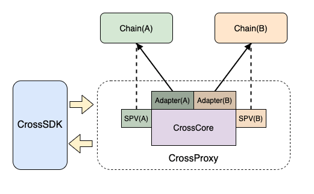
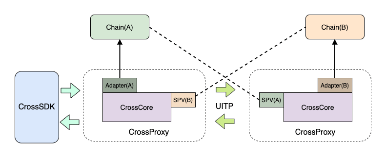

# 代理跨链使用指南

## 概述

根据长安链的跨链设计，完成一次跨链操作需要跨链代理（网关）、SPV、事务合约等几部分组成。目前版本的跨链代理中已经集成了SPV功能，因此SPV节点不需要再单独部署。跨链使用强依赖于ChainMaker本身，因此请在阅读该跨链使用前先对ChainMaker进行一定程度上的熟悉，否则可能会存在无法部署成功或使用的情况。

> 温馨提示：长安链在v1.2.0起支持跨链服务, 当前跨链服务适配到chainmaker2.1.x版本

## 跨链部署

跨链的部署核心是进行合约的安装和跨链网关的部署，其步骤主要包括如下步骤：

1. 业务合约/事务合约安装(chainmaker2.1.0+内置有事务系统合约)；
2. 下载源码并编译跨链代理程序；
3. 修改主配置文件`cross_chain.yml`；
4. 修改其他配置文件，包括SDK、SPV配置等；
5. 启动跨链代理；
6. 调用跨链SDK进行验证；

### 安装业务合约

一个具体的跨链业务通常需要跨两条链，每条链都需要部署具体的业务合约以便于跨链服务进行调用。业务合约即普通的合约，是用户进行具体跨链操作的合约。例如在转账跨链操作中，该合约即转账合约，由用户自主编写。

需要注意的是，业务合约需要提供正逆向操作的接口，正向接口即业务完成需要调用的合约入口，逆向接口即当正向接口操作失败进行业务回滚时调用的合约入口。

业务合约的安装属于普通合约安装，此处不再赘述。

### 安装事务合约

事务合约是调用具体业务合约的入口，该合约是所有业务合约进行跨链操作的入口，该合约的主要作用有以下几点：

+ 完成对具体业务合约的调用；
+ 记录事务的状态，保证事务操作的唯一性，防止重复操作；

对于每个需要跨链的具体业务链而言，该合约必须进行安装，且在正常情况下每条链只需要安装一次。目前该合约基于ChainMaker的版本已经编写好，具体业务链维护人员在业务链部署完成后，便可直接部署该合约，该合约的信息如下：

+ 路径：{项目路径}/contract/transaction_contract/transaction.wasm
+ 信息：该合约采用go语言，合约执行环境选择：RuntimeType_GASM RuntimeType = 4
+ 合约名称：推荐使用 `TransactionStable`

该合约虽然是事务调度合约，但本质仍是普通合约，其安装流程此处不再赘述。

### 部署方式选择

跨链代理支持两种部署方式，一种是一对多模型，即直接访问多条链实现跨链操作，如下图所示：



在该模型中，只需要部署一个跨链代理即可完成链A与B的跨链操作，在该部署模式下，跨链代理需要同时可以访问两条链（A与B，通过Adapter配置）并可以对两条链的交易执行结果进行验证（SPV对应的A与B）。

该部署模型非常简单，只需要部署一个跨链代理即可，但要求该跨链代理可同时访问两条链。

另外一种则是一对一模型，即每个跨链代理只访问一条业务链，其中一个跨链代理可以称之为 **主跨链代理** ，该跨链代理用于接收业务客户端发来的跨链消息，这里需要说明的是，每个跨链代理都可以是主跨链代理，仅仅是是否接收业务客户端发送的跨链消息的区别。不同的跨链代理之间通过UITP协议进行通信，每个跨链代理将访问独立的链，并且可以对另外的链交易结果进行验证，部署方式如下所示：




该部署方式用于网络环境较为复杂的环境，采用该方案会部署多个跨链代理，要求每个跨链代理可访问自己处理的业务链，并同时可通过spv模块获取到另外链的信息。

业务系统在进行跨链时，可根据实际的网络情况选择部署方式，从性能和稳定性角度讲，推荐使用一对多（第一种）的部署方式，具体部署时如何配置将会在后续章节进行描述。

### 程序编译

下载跨链代理服务源码：

```shell
git clone --recursive https://git.chainmaker.org.cn/chainmaker/chainmaker-cross.git
```

进入项目主路径，运行install.sh脚本：

```shell
cd chainmaker-cross-chain/main
go mod tidy
./install.sh
```

脚本执行成功后会在主路径下产生一个release路径，进入该目录，其结构如下所示：

```shell
cd release
tree 
├── bin
│   ├── shutdown.sh
│   └── start.sh
├── config
│   ├── chainmaker
│   │   ├── chainmaker_chain1_sdk.yml
│   │   ├── chainmaker_chain1_spv.yml
│   │   ├── chainmaker_chain2_sdk.yml
│   │   ├── chainmaker_chain2_spv.yml
│   │   ├── crypto-config
│   │   │   └── wx-org1.chainmaker.org
│   │   │       ├── ca
│   │   │       │   ├── ca.crt
│   │   │       │   └── ca.key
│   │   │       ├── node
│   │   │       │   ├── common1
│   │   │       │   │   ├── common1.nodeid
│   │   │       │   │   ├── common1.sign.crt
│   │   │       │   │   ├── common1.sign.key
│   │   │       │   │   ├── common1.tls.crt
│   │   │       │   │   └── common1.tls.key
│   │   │       │   └── consensus1
│   │   │       │       ├── consensus1.nodeid
│   │   │       │       ├── consensus1.sign.crt
│   │   │       │       ├── consensus1.sign.key
│   │   │       │       ├── consensus1.tls.crt
│   │   │       │       └── consensus1.tls.key
│   │   │       └── user
│   │   │           ├── admin1
│   │   │           │   ├── admin1.sign.crt
│   │   │           │   ├── admin1.sign.key
│   │   │           │   ├── admin1.tls.crt
│   │   │           │   └── admin1.tls.key
│   │   │           └── client1
│   │   │               ├── client1.sign.crt
│   │   │               ├── client1.sign.key
│   │   │               ├── client1.tls.crt
│   │   │               └── client1.tls.key
│   │   └── spv_config.yml
│   ├── cross_chain.yml
│   └── ecprikey.key
├── lib
│   └── cross-chain
├── logs
└── storage
```

其中config目录下的`chainmaker`目录内容为测试使用，实际用户部署时可能看不到该目录。

### 修改配置

跨链配置文件位于release目录下的config中，它的主配置文件名为`cross_chain.yml`，业务方根据自己的实际部署方式及业务链情况对其中的内容进行修改。其核心的修改主要包括：adapter、router及spv三部分。

#### Adapter配置调整

adapter指的是适配器，可以理解为对链SDK的一种封装，它的配置是用于描述直接访问业务链的信息，配置信息如下所示：

```yml
# 适配器配置，用于配置访问具体类型的业务链的适配器信息
adapters:
  - provider: chainmaker    # 表示该链的类型，后面配置信息将是访问该链的配置信息
    chain_id: chain1    # 该链的唯一ID标识
    config_path: chainmaker/chainmaker_chain1_sdk.yml    # 该链对应Adapter（通常为SDK）的配置路径

  - provider: chainmaker    # 表示该链的类型，后面配置信息将是访问该链的配置信息
    chain_id: chain2    # 该链的唯一ID标识
    config_path: chainmaker/chainmaker_chain2_sdk.yml    # 该链对应Adapter的配置路径
```

每项配置的说明可参见其中的注释部分，其中需要重点说明的是`config_path`，它的内容是一个配置路径，该路径即访问某条业务链的SDK配置文件路径，该路径建议使用绝对路径，若使用相对路径则是以`release`作为相对主路径，`chainmaker/chainmaker_chain1_sdk.yml`的配置内容如下所示：

```yml
chain_client:
  # 链ID
  chain_id: "chain1"
  # 组织ID
  org_id: "wx-org1.chainmaker.org"
  # 客户端用户私钥路径，使用绝对路径
  user_key_file_path: "/root/wx-org1.chainmaker.org/user/client1/client1.tls.key"
  # 客户端用户证书路径，使用绝对路径
  user_crt_file_path: "/root/wx-org1.chainmaker.org/user/client1/client1.tls.crt"
  # 客户端用户交易签名私钥路径(若未设置，将使用user_key_file_path)，使用绝对路径
  user_sign_key_file_path: "/root/wx-org1.chainmaker.org/user/client1/client1.tls.key"
  # 客户端用户交易签名证书路径(若未设置，将使用user_crt_file_path)，使用绝对路径
  user_sign_crt_file_path: "/root/wx-org1.chainmaker.org/user/client1/client1.tls.crt"

  nodes:
    - # 节点地址，格式为：IP:端口:连接数
      node_addr: "192.168.1.1:12301"
      # 节点连接数
      conn_cnt: 5
      # RPC连接是否启用双向TLS认证
      enable_tls: true
      # 信任证书池路径，使用绝对路径
      trust_root_paths:
        - "/root/wx-org1.chainmaker.org/ca"
        - "/root/wx-org2.chainmaker.org/ca"
      # TLS hostname
      tls_host_name: "chainmaker.org"
    - # 节点地址，格式为：IP:端口:连接数
      node_addr: "192.168.1.1:12302"
      # 节点连接数
      conn_cnt: 5
      # RPC连接是否启用双向TLS认证
      enable_tls: true
      # 信任证书池路径，使用绝对路径
      trust_root_paths:
        - "/root/wx-org1.chainmaker.org/ca"
        - "/root/wx-org2.chainmaker.org/ca"
      # TLS hostname
      tls_host_name: "chainmaker.org"
```

#### Router配置调整

Router，顾名思义就是路由的概念，在跨链网关（代理）中，路由描述的就是另外的跨链代理的访问方式，该配置即用于对另外的跨链代理进行配置，那么很明显，该配置只在第二种部署方式中适用，目前跨链网关支持libp2p和http两种路由配置，libp2p方式配置如下：

```yml
# 路由集配置，用于配置其他跨链代理节点的访问信息
routers:
  - provider: libp2p    # 远端跨链代理1的网络访问方式，下面的配置信息将是该协议下的配置方式
    libp2p: # 远端跨链代理1网络的具体信息
      address: /ip4/192.168.12.39/tcp/19527/p2p/Qme7gKTmZVFMY8sjNQiAZTQ1vJ5oU3GZHfGPJGTxamJ54j    # 远端跨链代理1基于libp2p访问下的地址
      protocol_id: /listener    # 协议ID，该值需要和对端ChannelListener的协议ID一致
      delimit: "\n"    # 发送到该跨链代理的消息处理分割符，通过该分割符对消息进行区分，必须使用双引号
    chain_ids:    # 远端跨链代理1可直接操作的链集合，该集合为远端跨链代理adapters配置中支持的链列表
      - chain2

  - provider: libp2p    # 远端跨链代理2的网络访问方式，下面的配置信息将是该协议下的配置方式
    libp2p: # 远端跨链代理2网络的具体信息
      address: /ip4/192.168.1.101/tcp/19527/p2p/Qme8hrTmZVFMY8sjNQiAZTQ1vJ5oU3GZHfGPJGTxbcL32a    # 远端跨链代理2基于libp2p访问下的地址
      protocol_id: /listener    # 协议ID，该值需要和对端ChannelListener的协议ID一致
      delimit: "\n"    # 发送到该跨链代理的消息处理分割符，通过该分割符对消息进行区分，必须使用双引号
    chain_ids:    # 远端跨链代理2可直接操作的链集合，该集合为远端跨链代理adapters配置中支持的链列表
      - chain3
      - chain4
```

上面是libp2p的访问方式，该访问路径需要知道另外节点的地址信息，该地址为另外的跨链代理启动时配置的channel地址（该配置会在后面描述）。

跨链代理间的http路由方式配置如下：
```yml
# 路由集配置，用于配置其他跨链代理节点的访问信息
routers:
  - provider: http  #对端跨链代理的访问方式
    http:
      address: 10.1.101.2:8080  #对端跨链代理的地址和端口
      max_connection: 10000  #访问对端代理的连接池中活跃的最大连接数
      idle_conn_timeout: 120  #空闲连接超时时间
      request_timeout: 40  #请求超时时间(s)
      enable_tls: false  #对端代理是否开启了tls，如果开启了那么下面的security一定要配置
      security:
        enable_cert_auth: false   #是否开启对对端代理的证书进行验证，如果开启，那么配置下面的ca证书
        ca_file: "/root/tls/ca1/ca.crt" #多个文件","分割，enable_cert_auth开启，ca证书用于验证服务器身份
        cert_file: "/root/tls/client/client.crt"    #如果对端代理开启了双向验证，那么需要配置本代理的tls证书文件
        key_file: "/root/tls/client/client.key"  #如果对端代理开启了双向验证，那么需要配置本代理的tls私钥文件
    chain_ids: # 远端跨链代理可直接操作的链集合，该集合为远端跨链代理adapters配置中支持的链列表
      - chain1
      - chain2

  provider: http  #对端跨链代理的访问方式
    http:
      address: 10.1.101.3:8080  #对端跨链代理的地址和端口
      max_connection: 10000  #访问对端代理的连接池中活跃的最大连接数
      idle_conn_timeout: 120  #空闲连接超时时间
      request_timeout: 40  #请求超时时间(s)
      enable_tls: true  #对端代理是否开启了tls，如果开启了那么下面的security一定要配置
      security:
        enable_cert_auth: true   #是否开启对对端代理的证书进行验证，如果开启，那么配置下面的ca证书
        ca_file: "/root/tls/ca1/ca.crt,/root/tls/ca2/ca.crt" #多个文件","分割，enable_cert_auth开启，ca证书用于验证服务器身份
        cert_file: "/root/tls/client/client.crt"     #如果对端代理开启了双向验证，那么需要配置本代理的tls证书文件
        key_file: "/root/tls/client/client.key"  #如果对端代理开启了双向验证，那么需要配置本代理的tls私钥文件
    chain_ids: # 远端跨链代理可直接操作的链集合，该集合为远端跨链代理adapters配置中支持的链列表
      - chain3
      - chain4
```

#### SPV配置调整

SPV即轻节点的概念，它用于提供交易证明，即对交易的信息进行验证，它的配置与Adapter类似，也是需要通过SDK访问具体的业务链，其配置信息如下：

```yml
# 证明集配置，用于配置当前跨链代理可访问的支持证明节点的信息
provers:
  - provider: spv    # 可提供证明的类型，可选择：spv和trust，spv配置如下所示
    config_path: chainmaker/chainmaker_chain1_spv.yml    # 该链对应的spv节点的配置路径
    chain_ids:    # 该证明类型下支持的链列表
      - chain1

  - provider: trust    # 可提供证明的类型，spv和trust，trust不需要配置其他信息，它表示所有验证全部通过，通常用于自测使用
    chain_ids: # 该证明类型下支持的链列表
      - chain2
```

其中`config_path`的内容是用于描述该链对应的SPV的配置路径，`chainmaker/chainmaker_chain1_spv.yml`的内容格式如下：

```yml
# 链ID
chain_id: "chain1"

# 同步配置，同步链信息的时间间隔
sync_chainInfo_interval: 10000    # 同步链中节点区块最新高度信息的时间间隔，单位：毫秒

# sdk配置，该配置指的是对应链的SDK配置，为了更好的访问该配置，建议配置为绝对路径
sdk_config_path: "/root/chainmaker/chainmaker_chain1_sdk.yml"    #  sdk配置文件路径

# 存储配置，用于配置当前SPV对区块头和交易哈希的存储记录
storage:
  provider: "leveldb"    #  当前存储采用的类型
  leveldb:    # 存储采用leveldb的情况下，对应leveldb的详细配置
    store_path: "../data/spv_state_db1"    # leveldb的存储路径
    write_buffer_size: 4    # leveldb的写入Buffer大小，单位：M
    bloom_filter_bits: 10    # leveldb的布隆过滤器的bit长度

# 日志配置，用于配置日志的打印
log:
  system:     # 当前默认配置，当模块找不到相关配置时统一采用该配置
    log_level: "INFO"    # 日志打印级别
    file_path: "../data/log/spv.log"     # 日志文件路径
    max_age: 365                  # 日志最长保存时间，单位：天
    rotation_time: 1              # 日志滚动时间，单位：小时
    log_in_console: false         # 是否展示日志到终端，仅限于调试使用
    show_color: true              # 是否打印颜色日志
```

配置的参数含义不再赘述，其中需要说明的是对应的`sdk_config_path`配置，该配置描述的是访问某条链的SDK的配置，对于长安链而言，该配置与`Adapter中配置的SDK配置`文件内容格式一致，可参考Adapter配置调整章节。

#### 其他配置调整

除了上述配置等关键配置外，默认还有其他的配置需要进行调整，主要包括三部分：Web监听配置、Channel监听配置及存储配置。

首先是Web监听配置，该配置描述的是跨链SDK访问的对端，即接收业务系统调用跨链SDK时发送的跨链事件的入口配置，其详细配置信息如下所示：

```yml
# 监听器配置，包括WebListener和ChannelListener
listener:
  # WebListener配置，用于监听跨链SDK发送的跨链请求
  web:
    address: 127.0.0.1    # Web服务监听网卡地址
    port: 8080  # Web服务监听端口
web:
  # WebListener配置，用于监听跨链SDK以及其他跨链代理发送的跨链请求
  address: 127.0.0.1    # Web服务监听网卡地址
  port: 8080            # Web服务监听端口
  open_tx_router: true    
  enable_tls: false #web服务是启用tls，如果启用，需要配置security
  security:
    cert_file: "/root/tls/server/server.crt"    #web服务的tls证书文件
    key_file: "/root/tls/server/server.key"  #web服务的tls私钥文件
    enable_cert_auth: false   #是否启用验证对端证书,即双向验证，如果开启，那么需要配置ca_file
    ca_file: "/root/tls/ca/ca.crt" #多个文件","分割，enable_cert_auth开启，ca证书用于验证客户端身份
```

然后是Channel监听配置，该配置描述的是用于接收另外的跨链代理发送的事务事件消息，其详细配置如下所示：

```yml
# ChannelListener配置，用于监听其他跨链代理发送的事务请求
channel:
  provider: libp2p    # Channel监听方式，libp2p表示采用libp2p协议
  libp2p:
    address: /ip4/0.0.0.0/tcp/19527    # Channel监听的地址
    priv_key_file: crypto/channel_listener.key    # Channel监听服务对应的私钥信息
    protocol_id: /listener    # Channel监听协议ID
    delimit: "\n"    # Channel监听消息的处理分割符，通过该分割符对消息进行分割
```

最后是存储配置 ，目前存储实现只支持leveldb，其详细配置如下所示：

```yml
# 存储配置，用于配置当前跨链代理对所有跨链请求的处理存储记录
storage:
  provider: leveldb    #  当前存储采用的类型
  leveldb:    # 存储采用leveldb的情况下，对应leveldb的详细配置
    store_path: ../storage/statedb    # leveldb的存储路径
    write_buffer_size: 4    # leveldb的写入Buffer大小，单位：M
    bloom_filter_bits: 10    # leveldb的布隆过滤器的bit长度
```

### 跨链代理启动

按照上述方式完成修改后，可使用release路径下的启动脚本开启服务：

```
./bin/start.sh
```

在 `logs` 中查看当前服务的活动日志，也可以使用 `ps -ef | grep cross_chain | grep -v grep | awk '{print $2}'`  命令查看是否启动成功。

## 跨链SDK使用

### 跨链SDK配置调整

跨链SDK是提供给业务方使用的SDK，通过该SDK，业务方用户可以构建跨链请求，发送至对应的跨链网关（主跨链网关）。

跨链SDK在使用时也需要配置一些信息，这些信息用于生成跨链SDK的工厂对象，其配置内容如下所示：`cross_chain_sdk.yml`

```yml
configs:
  - chain_id: chain1  #链的名字
    chain_type: "chainmaker" #链类型，目前支持chainmaker和fabric
    org_id: "wx-org1.chainmaker.org"  #组织id
    sign_key_path: "/root/chainmaker/user/sign.key"  #签名的私钥
    sign_crt_path: "/root/chainmaker/user/sign.crt" #签名的证书
    extra_params:

  - chain_id: mychannel   //如果是fabric，chain_id是通道id
    chain_type: "fabric"
    org_id: "aliceOrg"  #组织id
    sign_key_path: "/root/fabric/user/sign.key"  #签名的私钥
    sign_crt_path: "/root/fabric/user/sign.crt" #签名的证书
    extra_params:
#跟跨链代理http的通信配置
http:
  enable_tls: false #跨链代理是否启用了tls，如果启用了tls则需要配置security
  security:
    enable_cert_auth: true  #验证跨链代理的证书
    ca_file: "/root/tls/ca/ca.crt"    #ca文件，多个可用","分割
    key_file: "/root/tls/client/client.crt"  #如果跨链代理开启了双向验证，那么需要配置SDK的tls私钥文件
    cert_file: "/root/tls/client/client.key" #tls证书

```
### 跨链SDK代码调用

下面是跨链SDK的使用方式：

```go
//用配置文件创建一个跨链SDK实例
crossSDK, err := NewCrossSDK(WithConfigFile("./config/template/cross_chain_sdk.yml"))
require.NoError(t, err)
//创建构造交易的上下文
tx1Ctx := NewCrossTxBuildCtx(
    //链名字
	"chain1",
    //交易在跨链交易中的索引值
    0,
    //事务合约Excute时，要执行的业务合约信息
    builder.NewContract("balance_003", "Plus", builder.NewParamsWithMap(map[string]string{"number": "1"})),
    //事务合约Rollback时，要执行的业务合约信息
    builder.NewContract("balance_003", "Minus", builder.NewParamsWithMap(map[string]string{"number": "1"})),
)
tx2Ctx := NewCrossTxBuildCtx(
    //链名字
    "chain2",
    //交易在跨链交易中的索引值
    1,
    //事务合约Excute时，要执行的业务合约信息
    builder.NewContract("balance_003", "GetProof", builder.NewParamsWithMap(map[string]string{"number": "1"})),
    //事务合约Rollback时，要执行的业务合约信息
    builder.NewContract("balance_003", "Minus", builder.NewParamsWithMap(map[string]string{"number": "1"})),
	//如果业务合约中使用proof，此可选项会将proofkey写入合约参数中，chainmaker中存放在key为proofKey的参数中, fabric写在参数列表的第一个参数
    builder.WithUseProofKey(true),
	)
//生成跨链事件
crossEvent, err := crossSDK.GenCrossEvent(tx1Ctx, tx2Ctx)
require.NoError(t, err)

//发送跨链事件，参数syncResult代表是否同步等待跨链结果
//SendCrossEvent(event *CrossEventContext, url string, syncResult bool, opts ...EventSendOption)
ctx, _ := context.WithTimeout(context.Background(), 10*time.Second)
res, err := crossSDK.SendCrossEvent(crossEvent, "https://localhost:8080", true, WithContextOpt(ctx), WithSyncStrategyOpt(SyncStrategy{
0, 2 * time.Second, 1 * time.Second,
}))
require.NoError(t, err)
//获取crossID对应的跨链结果
res, err = crossSDK.QueryCrossResult(crossEvent.GetCrossID(), "https://localhost:8080")
require.NoError(t, err)
```

## 跨链服务验证

安装上述流程完成部署后，可以通过系统提供的转账的示例合约进行验证，该合约只是一个示例，其内容比较简单，可作为参考，但不建议直接作为实际业务合约使用。

### 安装验证示例业务合约

目前在代码库的contract目录下创建了一个可以进行测试的合约示例，名称为：`balance.wasm`，其查看方式如下：

```shell
tree contract/balance
contract/balance
├── balance.wasm
├── chainmaker.go
├── contract_test.go
├── easycodec.go
└── main.go
```

其中main.go中为该合约的核心源码，可供参考。该示例合约是一个转账合约，它主要包括四个函数：

```go
Show()：显示内置账号的余额；
Plus()：增加指定数量的token；
Minus()：减少指定数量的token；
Reset()：将token数量重置为1000；
```

该合约采用go语言编写，合约执行环境选择：RuntimeType_GASM RuntimeType = 4，然后通过chainmaker-sdk-go在 **两条链** 上安装该合约。

### 调用跨链SDK进行验证

根据`跨链SDK使用`章节，可对结果跨链服务是否安装成功进行验证，若前面的操作完全按照文档完成，那么跨链SDK的调用基本不需要做修改，主要修改的地方不要忘记CrossProxy的访问地址。

一次完成的跨链操作完成后，预期chain1（第一条链）中账号的token变为`999`，chain2中账号的token变为`1001`，这两个值的结果可以通过分别调用两个业务合约的Show()方法查询实现。若查询结果与上述一致，则表明跨链服务成功，若不一致则表明跨链服务部署失败，需要查看日志以确认失败原因。