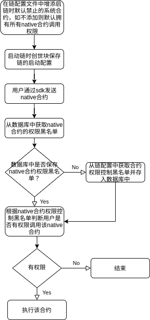

# 系统合约管理

## 简介

v2.2.0版本, ChainMaker中有如下系统合约:
```go
// 对链配置获取与修改参数等操作
SystemContract_CHAIN_CONFIG
// 对区块或交易进行查询等操作
SystemContract_CHAIN_QUERY
// 对证书进行管理
SystemContract_CERT_MANAGE
// 治理合约
SystemContract_GOVERNANCE
// 进行多签操作调用合约
SystemContract_MULTI_SIGN
// 对合约进行管理
SystemContract_CONTRACT_MANAGE
// 隐私计算合约
SystemContract_PRIVATE_COMPUTE
// dpos共识下标准ERC20转账合约
SystemContract_DPOS_ERC20
// 负责dpos共识的权益质押管理、验证人选举
SystemContract_DPOS_STAKE
// 订阅区块、交易、合约信息
SystemContract_SUBSCRIBE_MANAGE
// 归档、恢复管理
SystemContract_ARCHIVE_MANAGE
// 跨链事务合约
SystemContract_CROSS_TRANSACTION
// 公钥管理
SystemContract_PUBKEY_MANAGE
// 账户管理
SystemContract_ACCOUNT_MANAGER
```

用户可以通过以上native合约查询区块，获取链配置等等。

在默认情况下，用户有权限通过sdk调用任何一种系统合约，这在一定程度上并不符合我们的设计原则。
比如 `tbft` 共识算法配置的链不应该对`SystemContract_DPOS_ERC20`  等  `dpos` 算法类型才需要使用的方法使用权限。
本文将详细介绍ChainMaker中对系统合约的管理模块以及配置文件。

## 设计思路
1.通过提供一个native合约权限的黑名单来控制对native合约权限的管理，即在此黑名单上的native合约用户没有权限进行调用。
为了减少用户的操作成本，在不修改链配置文件`bc1.yml`中相应字段的情况下(具体请看模块组成)默认为用户有权限调用所有
的native合约

2.为了维护和使用该黑名单在`contract_manage`模块中新增对此名单的增删查以及校验接口(具体请看模块组成)

## 模块组成
native合约控制模块主要由在链的配置`bc1.yml`文件中新增字段`disabled_native_contract`以及针对这个列表在`contract manage`
中新增的增删查以及校验接口所组成

1.在`bc1.yml`文件中新增的字段示例
```yml
// 默认禁用 DPOS_ERC20, DPOS_STAKE两种native合约
// 如此字段列表为空，则默认用户有权限调用所有native合约
disabled_native_contract:
  - DPOS_ERC20
  - DPOS_STAKE
```

2.在`contract manage`模块中新增整个上述黑名单的增删查以及校验接口
```go
func registerContractManagerMethods(log protocol.Logger) map[string]common.ContractFunc {
	methodMap := make(map[string]common.ContractFunc, 64)
    ...
	
	// 新增下列四个接口用于维护上述黑名单
	methodMap[syscontract.ContractManageFunction_GRANT_CONTRACT_ACCESS.String()] = runtime.grantContractAccess
	methodMap[syscontract.ContractManageFunction_REVOKE_CONTRACT_ACCESS.String()] = runtime.revokeContractAccess
	methodMap[syscontract.ContractManageFunction_VERIFY_CONTRACT_ACCESS.String()] = runtime.verifyContractAccess
	methodMap[syscontract.ContractQueryFunction_GET_DISABLED_CONTRACT_LIST.String()] = runtime.getDisabledContractList

	return methodMap

}
```

## 主要流程
用户调用native合约的主要流程: <br></br>
 <br>

<br></br>
若所调用的native合约为`contract_manage`模块中所提供的上述四种接口之一：<br></br>
1.若所调用的native合约为`contract_manage`模块中所提供的上述四种接口中的增和删(分别对应`GRANT_CONTRACT_ACCESS`以及
`REVOKE_CONTRACT_ACCESS`)，则对native合约黑名单做出相应的操作(增加，删除)，并将改动后的名单在数据库中进行更新。 <br>
2.若所调用的native合约为`contract_manage`模块中所提供的上述四种接口中的查(对应`GET_DISABLED_CONTRACT_LIST`)，
则从数据库中将native合约黑名单返回给用户。 <br>
3.若所调用的native合约为`contract_manage`模块中所提供的上述四种接口中的查(对应`GET_DISABLED_CONTRACT_LIST`)，
  则从数据库中将native合约黑名单返回给用户
4.3.若所调用的native合约为`contract_manage`模块中所提供的上述四种接口中的校验(对应`VERIFY_CONTRACT_ACCESS`)，
则根据native合约黑名单判断用户是否有权限调用目标native合约并返回true或者false


## 使用示例
以下将给出一些在chainMaker-go中通过sdk调用上述接口的示例
[CMC示例参考](../dev/命令行工具.html#manage)

1.开放对某些native合约的调用权限

```go
// 开放Native合约权限
func testAddNativeContract(t *testing.T, list ...string) string {
	txId := utils.GetRandTxId()
	require.True(t, len(txId) > 0)

	fmt.Println("============test add native contract============")
	val, _ := json.Marshal(list)
	pairs := []*commonPb.KeyValuePair{
		{
			Key:   "native_contract_name",
			Value: val,
		},
	}
	sk, member := native.GetUserSK(1)

	resp, err := native.UpdateSysRequest(sk, member, &native.InvokeContractMsg{TxId: txId, TxType: commonPb.TxType_INVOKE_CONTRACT, ChainId: CHAIN1,
		ContractName: syscontract.SystemContract_CONTRACT_MANAGE.String(), MethodName: syscontract.ContractManageFunction_GRANT_CONTRACT_ACCESS.String(), Pairs: pairs})
	processResults(resp, err)

	assert.Nil(t, err)
	fmt.Printf("\n\n ========end test add native contract======== \n ")
	return txId
}
```


2.关闭对某些native合约的调用权限
```go
// Revoke Native合约权限
func testRevokeNativeContract(t *testing.T, list ...string) string {
    txId := utils.GetRandTxId()
    require.True(t, len(txId) > 0)

    fmt.Println("============test revoke native contract============")
    val, _ := json.Marshal(list)
    pairs := []*commonPb.KeyValuePair{
        {
            Key:   "native_contract_name",
            Value: val,
        },  
    }
    sk, member := native.GetUserSK(1)

    resp, err := native.UpdateSysRequest(sk, member, &native.InvokeContractMsg{TxId: txId, TxType: commonPb.TxType_INVOKE_CONTRACT, ChainId: CHAIN1,
    ContractName: syscontract.SystemContract_CONTRACT_MANAGE.String(), MethodName: syscontract.ContractManageFunction_REVOKE_CONTRACT_ACCESS.String(), Pairs: pairs})
    processResults(resp, err)

    assert.Nil(t, err)
    fmt.Printf("\n\n ========end test revoke native contract======== \n ")
    return txId
}
```

3. 获取native合约控制黑名单
```go
// Native合约list查询
func testGetDisabledNativeContractList(t *testing.T, expectedList []string) {
	fmt.Println("============ test get disabled contract list ===========")

	sk, member := native.GetUserSK(1)
	resp, err := native.QueryRequest(sk, member, &client, &native.InvokeContractMsg{TxType: commonPb.TxType_QUERY_CONTRACT, ChainId: CHAIN1,
		ContractName: syscontract.SystemContract_CONTRACT_MANAGE.String(), MethodName: syscontract.ContractQueryFunction_GET_DISABLED_CONTRACT_LIST.String(), Pairs: nil})
	processResults(resp, err)

	assert.Nil(t, err)
	disabledContractList := parseDisabledContractList(resp.ContractResult.Result)
	require.Equal(t, expectedList, disabledContractList)
	fmt.Printf("\n\n ========finished get disabled contract list======== \n ")
}
```
