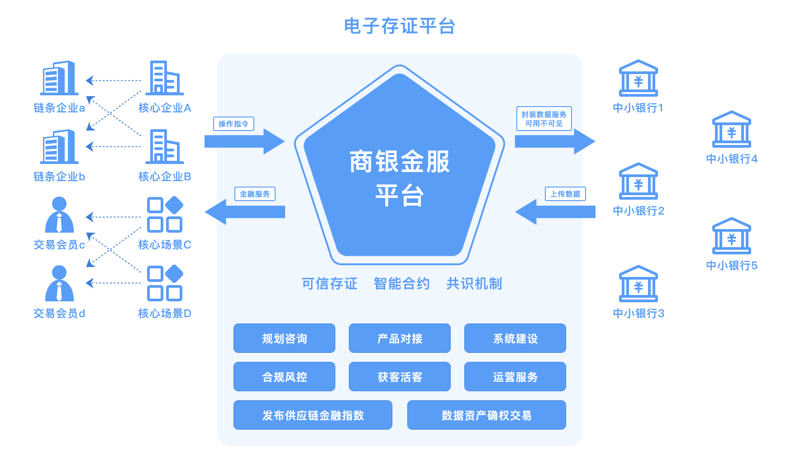

# 供应链金融

## 问题

供应链金融是指在融资过程中，引入核心企业、物流公司等供应链参与主体作为新的风险控制变量，并对供应链上申请融资的企业提供信贷支持以及其他综合服务的融资模式。供应链金融的发展源于中小微企业在实际经营过程中，由于自身缺乏信用背书以及足够的抵押物，因此无法从传统金融机构获取充足的流动性资源。然而，随着全球经济分工细化程度加深，供应链产业体系成为主要的产业形态，上下游企业日益形成休戚与共的共同体，任何一个环节出现流动性紧缺都会对供应链整体造成重大的影响。尽管随着互联网技术的发展，供应链金融体系得到了一定程度的发展，然而由于供应链上各企业之间 ERP 系统并未连通， 因此在数据安全和数据准确性等方面存在隐患，使得供应链上核心企业与上下游企业之间缺乏完全互信的基础，进而在资金流、信息流、物流和商流这“四流”中带来各种信息割裂、信息孤岛等问题。

## 解决方案

产业应增强金融服务实体经济能力，支持高新技术企业利用股权、知识产权开展质押融资，规范、稳妥开发航运物流金融产品和供应链融资产品。长安链凭借点对点的分布式账本技术、非对称加密算法等技术，将供应链中各个企业、银行及相应的未来可预见的现金流信息上链，通过链上数据全流程不可篡改、可追溯及永久存储等技术方式实现可完整穿透的数据追溯和审计。

与此同时，通过对不同层级设置不同的信息查阅权限，可使基于区块链技术的整个供应链金融系统信息在实现全流程可溯源、确保信息真实准确的同时，保证相应的隐私安全，从而促进整个供应链金融体系的健康稳定的发展。通过加强区块链技术在供应链金融体系的建设，能够快速提升传统优势产业在提高获取现金流动性的同时，改善企业金融融资能力，促进相应产业的发展。

  
