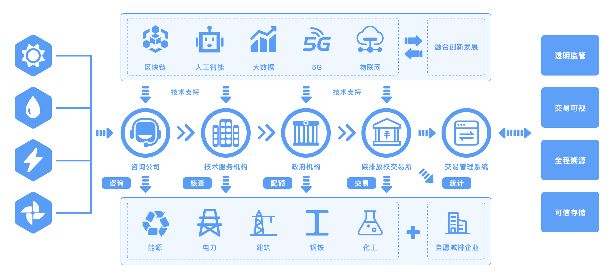

# 碳交易

## 背景
国家电网有限公司董事长、党组书记辛保安表示，国家电网公司认真学习贯彻习近平总书记重要讲话和指示精神，主动服务国家重大战略实施，正在研究制定“碳达峰、碳中和”行动方案，努力为推动能源清洁低碳转型、促进绿色发展贡献力量。区块链作为极具创新潜力的现代信息技术，能够较好地支撑碳足迹全生命周期的可信记录、碳排放全要素的可信流转，可以为碳交易提供更安全、更高效、更经济的市场环境，以及可视、可信、可靠的监管环境。国家电网公司成立了央企首家区块链专业公司，牵头搭建中央企业区块链合作创新平台，加大区块链等先进技术攻关力度，深化在电力交易、电网调度、营销服务等领域应用，开展了60余项区块链典型应用创新探索。

## 应用
八家中央企业发布“区块链+碳交易”生态网络场景：

一是碳资产交易。聚合产业链上下游相关信息，实现碳交易从排放权获取、交易、流通，到交易核销、统计的全流程数据上链存储与可信共享应用，支撑政府加快完善碳交易机制，促进碳交易市场的透明化、有序化、便捷化。

二是清洁能源消纳。建成基于区块链的清洁能源消纳平台，构建灵活的能源交易模式、高效的资源配置体系和智能化的补贴核算机制，推动发电侧、电网侧与需求侧凝聚清洁能源消纳合力，积极服务我国新能源发展。

三是冬奥绿电溯源。将可再生能源发电、配套电网输电、冬奥场馆用电等关键环节数据上链，首次建立了基于区块链的绿电溯源机制，并制定我国首个绿电交易规则——《京津冀绿色电力市场化交易规则》，构建了按需生产、合理调度、智能交易的绿色电力保障方案。

辛保安表示，实现“碳达峰、碳中和”目标，区块链技术大有可为。国家电网公司将在各部委、各级政府部门的指导支持下，秉持开放合作理念，携手上下游企业，聚合优质资源，继续加大区块链技术应用推广力度，加快建设更加绿色、智慧、安全、友好的能源互联网，为长安链提供丰富多元的应用场景，全面助力北京国际科技创新中心建设。

  
