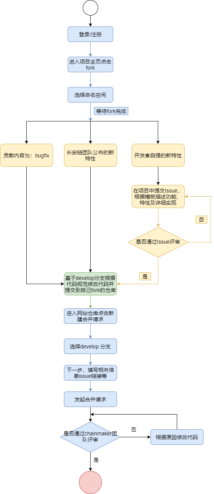
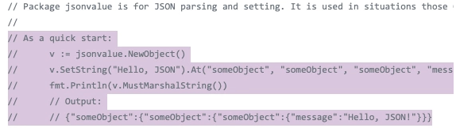
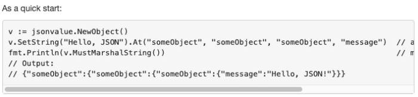
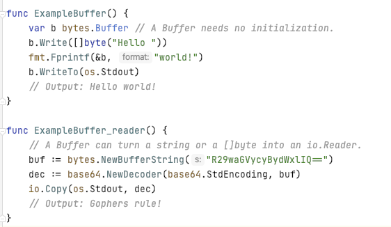
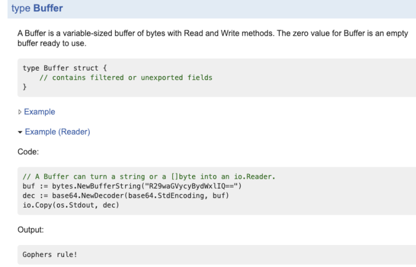

# 贡献代码管理规范及流程


## ChainMaker 贡献代码流程

<a href="https://git.chainmaker.org.cn/" target="_blank">长安链官方仓库</a>： <a href="https://git.chainmaker.org.cn/" target="_blank">https://git.chainmaker.org.cn/</a>

开源社区的代码贡献并不是从提交PR开始。在您决定为长安链贡献代码前，您可以通过提交[isuue](https://git.chainmaker.org.cn/chainmaker/issue/-/issues)或其他方式提前与我们取得联系，说明您希望贡献的内容或解决的问题，我们会和您共同讨论您要贡献的内容及方案。没有与社区委员会充分讨论并达成共识的贡献内容很可能会需要返工或不被审查。

方案已经达成共识后，您需要和我们签订[长安链贡献者许可协议(CLA)](https://chainmaker.org.cn/user/cla)，以授权我们对代码进行分发，已经签署过协议的代码才会最终被合并。

 签署贡献者协议后您可以进入正式的代码贡献流程中，您的代码需要符合相关规范。流程如下：


1. 注册/登录
2. fork需要贡献的chainmaker项目
3. 提交代码到自己空间的项目
4. 创建合并请求到chainmaker空间项目的develop分支
5. 等待反馈，合并完成





## ChainMaker 注释编写规范

1. 在编码阶段同步写好变量、函数、文件注释、包注释，注释可以通过 `godoc` 导出生成文档。
2. 程序中每一个被导出的(大写的)名字，都应该有一个文档注释。
3. 所有注释掉的代码在提交 code review 前都应该被删除，除非添加注释讲解为什么不删除， 并且标明后续处理建议（比如删除计划）。

### 【必须】包注释

- 每个包都应该有一个包注释。

- 包如果有多个 go 文件，只需要出现在一个 go 文件中（一般是和包同名的文件）即可，格式为：“// Package 包名 包信息描述”。

  ```javascript
  // Package math provides basic constants and mathematical functions.
  package math
  
  // 或者
  
  /*
  Package template implements data-driven templates for generating textual
  output such as HTML.
  ....
  */
  package template
  ```

### 【必须】文件注释

- 每个文件都必须有一个文件注释；

- 文件头需要写明license和文件描述。其中license如下：

  ```go
  /*
  Copyright (C) The ChainMaker Authors
  
  SPDX-License-Identifier: Apache-2.0
  
  @Description 该文件中实现了合约相关命令行查询功能具体包括：
  	1.按合约名字查询合约对象
  	2.查询所有的合约列表
  	3.查询被禁用的系统合约
  */
  ```

### 【必须】结构体注释

- 每个需要导出的自定义结构体或者接口都必须有注释说明。

- 注释对结构进行简要介绍，放在结构体定义的前一行。

- 格式为："// 结构体名 结构体信息描述"。

- 结构体内的可导出成员变量名，如果是个生僻词，或者意义不明确的词，就必须要给出注释，放在成员变量的前一行或同一行的末尾。

  ```javascript
  // User 用户结构定义了用户基础信息
  type User struct {
      Name  string
      Email string
      // Demographic 族群
      Demographic string
  }
  ```

  

### 【必须】方法注释

- 每个需要导出的函数或者方法（结构体或者接口下的函数称为方法）都必须有注释。注意，如果方法的接收器为不可导出类型，可以不注释，但需要质疑该方法可导出的必要性。

- 注释描述函数或方法功能、调用方等信息。

- 格式为："// 函数名 函数信息描述"。

  ```javascript
  // NewtAttrModel 是属性数据层操作类的工厂方法
  func NewAttrModel(ctx *common.Context) *AttrModel {
      // TODO
  }
  ```

  

- 例外方法：

- Write Read 用于常见IO

- ServeHTTP 用于HTTP服务

- String 用于打印

- Unwrap Error 用于错误处理

- Len Less Swap 用于排序

### 【必须】变量和常量注释

- 每个需要导出的常量和变量都必须有注释说明。

- 该注释对常量或变量进行简要介绍，放在常量或者变量定义的前一行。

- 大块常量或变量定义时，可在前面注释一个总的说明，然后每一行常量的末尾详细注释该常量的定义。

- 格式为："// 变量名 变量信息描述"，斜线后面紧跟一个空格。

  ```javascript
  // FlagConfigFile 配置文件的命令行参数名
  const FlagConfigFile = "--config"
  
  // 命令行参数
  const (
      FlagConfigFile1 = "--config" // 配置文件的命令行参数名1
      FlagConfigFile2 = "--config" // 配置文件的命令行参数名2
      FlagConfigFile3 = "--config" // 配置文件的命令行参数名3
      FlagConfigFile4 = "--config" // 配置文件的命令行参数名4
  )
  
  // FullName 返回指定用户名的完整名称
  var FullName = func(username string) string {
      return fmt.Sprintf("fake-%s", username)
  }
  ```

  

### 【必须】类型注释

- 每个需要导出的类型定义（type definition）和类型别名（type aliases）都必须有注释说明。

- 该注释对类型进行简要介绍，放在定义的前一行。

- 格式为："// 类型名 类型信息描述"。

  ```javascript
  // StorageClass 存储类型
  type StorageClass string
  
  // FakeTime 标准库时间的类型别名
  type FakeTime = time.Time
  ```

  

## 注释相关工具

### godoc和pkgsite

```javascript
go install  golang.org/x/tools/cmd/godoc@latest
godoc -http=:6060
```

pkgsite的用法类似

```javascript
go install golang.org/x/pkgsite/cmd/pkgsite@latest
pkgsite -http=:6060
```

然后打开浏览器访问 http://localhost:6060/chainmaker.org/chainmaker/xxxx/v2 即可查看web文档

### Goland插件Goanno

Goanno插件可以提供自动生成Go代码注释的模板，然后开发人员根据模板填写入完整注释即可。
安装好Goanno插件后，Tool->Goanno Setting可以设置模板

### golangci-lint检查

请下载[.golangci.yml](https://git.chainmaker.org.cn/chainmaker/chainmaker-tools/-/blob/master/golangci/.golangci.yml)文件，这个文件放到$GOPATH/src/chainmaker.org目录，或者需要进行lint检查某个项目文件夹下，然后下载安装golangci-lint（下载地址：https://github.com/golangci/golangci-lint ），然后在需要lint检查的某个项目仓库文件夹下执行命令
`golangci-lint run ./...`
即可对该文件夹中的源码进行lint检查。

### gocloc注释覆盖率计算

注释覆盖率才采用gocloc这个工具进行计算，安装命令：
`go install github.com/hhatto/gocloc/cmd/gocloc@latest`
安装后执行命令：
`gocloc --include-lang=Go --output-type=json --not-match=_test.go . | jq '(.total.comment-.total.files*6)/(.total.code+.total.comment)*100'`

### 包注释规则

- 注释必连续，如果有段落，段落之间的空行也需要注释，否则会被godoc忽略
- 包注释以Package packagename开头，应尽量简短，如果比较长，放在包的doc.go文件中

### 代码注释规则

- type, const, function, var注释以名称开头，紧临代码来写，函数注释描述函数的功能、参数和返回值，调用注意事项等

- 特殊开头的关键字：

BUG(who) ：描述函数未解决的bug

TODO: 描述待处理事项，godoc命令生成时需要指定--note关键字

Deprecated：已废弃，只为了保持兼容，写明代替方式

- 段落用空行注释表示

- 预格式化（缩进）可以被识别为代码块，

示例：



展示效果



### Example文件规则

- Example文件和代码放在同一个文件夹下，文件名以example_开头，以_test结尾，如example_xxx_test.go，example的包名也是以example_开头，以_test结尾，如package example_xxx_test.

- Example函数名以Example开头，格式是Example[function name]_[tag]，如果没有函数名，Example会被展示在OverView，如果有function name，会被展示在函数说明里。

- Example 输出用关键字写在函数结尾处

示例：



展示效果：



参考资料：

<a href="https://blog.golang.org/godoc" taget="_blank">https://blog.golang.org/godoc</a>


## ChainMaker Git库代码管理规范

### 提交规范

格式： [option] [(fileName or moduleName)] :   [msg]

示例：fix(main.go): line 25 ,  return value of `txContext.Get` is not checked

	feat: 新特性
	fix: bug修复
	docs: 文档修改
	style: 格式、缺少分号、换行等；无生产代码更改
	refactor: 重构代码，例如重命名变量、结构
	test: 添加缺失的测试，重构测试；无生产代码更改
	chore: 其他杂项

### Git仓库的目录结构

在Git仓库中，除了存放源码外，还需要将自动化测试代码、脚本和配置文件也放在该库中，同源管理。

```sh
Project
|----conf
|----test
|----....
|----....
```

**1.conf目录下存放配置项**

**配置项可分为：**

1) 环境配置项
与所运行的环境有关，例如：域名、其他系统的地址和端口等。

2) 应用配置项
信息安全控制和应用程序自身有关，例如：账号密码、初始分配内存大小、数据库连接池大小等。

3) 业务配置项
与应用程序执行的业务行为相关，每个设置有个默认值。例如，功能特性开关。

根据使用时机不同，可将这些配置项分为：构建时、部署时和运行时配置。 构建时和部署时配置相当于静态配置，通常和环境相关。

**conf目录下的推荐结构**：

```sh
config
|-----dev
|-----test
|-----prod
```

**2.test目录下存放自动化测试代码。**

**3.Git的大文件管理**

代码库中超过100MB的二进制文件推荐进行大文件管理。超过500MB的二进制文件必须进行大文件管理。

**4.Git的忽略列表**

根据项目类型设置Git的忽略文件列表，可参考：<a href="https://github.com/github/gitignore" target="_blank">各类语言模版</a>

## ChainMaker 贡献代码规范

- 需满足上方介绍的注释规范；
- 需满足上方介绍的golangci-lint检查，并于提交合并时粘贴截图；
- 需满足上方介绍注释覆盖率大于15%，并于提交合并时粘贴截图；
- 需满足上方介绍的目录结构规范；
- 合并请求需合入develop分支。

