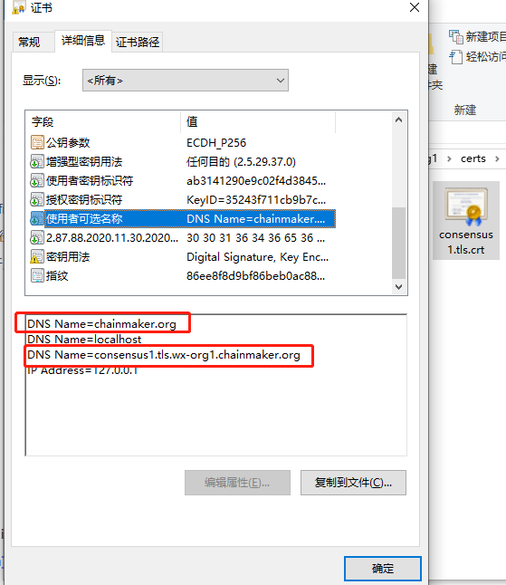

# FAQ

## 错误排查

1、sdk、cmc：在sdk.log查看异常日志；

2、链上日志：在log目录system.log；

3、合约日志：go合约：log/go, log/docker-go。其他合约： 在system.log 查看，需要在config/wx-org1.chainmaker.org/log.yml 需将vm改为debug级别；

4、panic日志：在bin/panic.log

目录结构如下：

详情参考：

```sh
# 若 ./cluster_quick_start.sh 脚本启动。一般是在如下位置：
tree -L 2 chainmaker-go/build/release/chainmaker-v2.3.2-wx-org1.chainmaker.org/
├── bin
│   ├── chainmaker
│   ├── panic.log
│   ├── start.sh
│   ├── stop.sh
│   └── version.sh
├── data
├── config
│   └── wx-org1.chainmaker.org
└── log
    ├── brief.log
    └── system.log
```


## 部署编译相关

### unknown revision v2.0.0

> go: chainmaker.org/chainmaker/pb-go@v2.0.0+incompatible: reading chainmaker.org/chainmker/pb-go/go.mod at revision v2.0.0: unknown revision v2.0.0

1、可能chainmaker.org域名可能记录为其他主机地址了，删除 `~/.ssh/known_hosts文件` 重试即可。
2、可能代理无法访问chainmaker.org，请切换代理尝试`go env -w GOPROXY=https://goproxy.cn,direct`

### missing go.sum entry

到对应目录执行`go mod download` 或者 `go mod tidy`

### not found GLIBC_2.18

原因：缺少glibc的库，二进制文件glibc版本比服务器glibc版本高

解决方案一：

在linux下可进入：https://git.chainmaker.org.cn/chainmaker/chainmaker-go/-/tree/v1.2.7/scripts/3rd 网站下载`glibc-2.18.tar.gz`和`install.sh`到任一同级目录，文件设置install.sh可执行权限后直接用root权限执行该脚本即可安装 GLIBC_2.18依赖。

```sh
# 注：此操作为安装替换GCC版本，请慎重操作。一旦出错系统将不可用。
chmod +x install.sh
sh install.sh
```

解决方案二：

使用将要部署的服务器编译二进制文件，保证glibc版本一致。

### build constraints exclude all Go files

由于未启用CGO导致 ,开启CGO后,继续编译即可 
```sh
go env -w CGO_ENABLED=1

```

### /opt/go/pkg/mod/github.com/xiaotianfork/quic-go@v0.21.24/internal/qtls/go118.go:5:13: cannot use "quic-go doesn't build on Go 1.18 yet." 

老版本未适配 Go 1.18 编译问题，后面发布的版本会升级依赖的 quic-go 版本,解决该问题，可以使用Go1.16 或 Go1.17 进行编译。最新版已经支持Go 1.22

### 启动失败，vmInstancesManagerProvider为nil导致painc
问题产生的原因：
go1.16 run main.go start -c ../config/wx-org1-solo/chainmaker.yml该命令忽略了component_registry.go
修改为go1.16 run main.go component_registry.go start -c ../config/wx-org1-solo/chainmaker.yml或者 go1.16 run . start -c ../config/wx-org1-solo/chainmaker.yml即可

### restart.sh 权限不足

> ./restart.sh: Permission denied

给脚本添加可执行权限

```sh
cd chainmaker-go/script/bin
chmod +x *.sh
```

### syscall/js.valueGet not exported

>执行gasm合约时报错：resolve imports: syscall/js.valueGet not exported in module env

tinygo不支持fmt等函数，tinygo支持的包参考：https://tinygo.org/lang-support/stdlib/

### 通过命令行部署长安链出现cmlogagentd文件没有发现
注释掉执行脚本的启动 cmlogagentd后重试。


### 请问 enclave-server.manifest.template 文件应该放在那个目录下？
graphene项目跟目录下就可以。https://git.chainmaker.org.cn/chainmaker/graphene/-/blob/master/enclave-server.manifest.template


### ./build_release.sh 的时候，一直提示assertions 的多重定义，后面日志还提示：对‘static_assert’未定义的引用

请先查看linux操作系统的 gcc版本号是否大于 7.3 => gcc --version
如果 gcc 版本小于7.3，请升级 gcc

centos升级gcc方案一：

```sh
# 安装源
yum -y install centos-release-scl
# 安装
yum install devtoolset-7 -y
# 当前会话（窗口）生效
source /opt/rh/devtoolset-7/enable
# 加入环境，新会话也生效
echo "source /opt/rh/devtoolset-7/enable" >>/etc/profile
```

centos升级gcc方案二：

```sh
cd /etc/yum.repos.d
# 备份
mv CentOS-SCLo-scl-rh.repo CentOS-SCLo-scl-rh.repo.bak
vim CentOS-SCLo-scl-rh.repo
# 添加如下内容======开始=====
[centos-sclo-rh]
name=CentOS-7 - SCLo rh
baseurl=http://vault.centos.org/centos/7/sclo/$basearch/rh/
gpgcheck=1
enabled=1
gpgkey=file:///etc/pki/rpm-gpg/RPM-GPG-KEY-CentOS-SIG-SCLo
# 添加内容======结束=====
# 安装gcc
yum install devtoolset-7 -y
# 当前会话（窗口）生效
source /opt/rh/devtoolset-7/enable
# 加入环境，新会话也生效
echo "source /opt/rh/devtoolset-7/enable" >>/etc/profile
```


### error: unrecognized command line option '--js-library' Makefile:47: recipe for target 'main.wasm' failed

请使用emake make进行编译，参考开源文档https://docs.chainmaker.org.cn/operation/%E6%99%BA%E8%83%BD%E5%90%88%E7%BA%A6.html#c

### 请问有没有对arm架构支持的计划，如果有大概什么时候会推出？
长安链目前已经支持ARM64架构，如果您指的是macOS的M1的话，也是可以支持的，下载源码编译即可。


### Mac M1 上编译长安链镜像报错，github.com/xiaotianfork/q-tls-common/x509这个包的编译报错。
目前已发布版本不支持M1架构直接编译，可以通过交叉编译的方式进行编译。（M1可以运行x86指令）
在编译命令前加上CGO_ENABLED=1 GOOS=darwin GOARCH=amd64
如果使用make方式进行编译，在chainmaker-go执行：CGO_ENABLED=1 GOOS=darwin GOARCH=amd64 make


### 系统macOS 12.4 M1 8c16G,JDK版本JDK-8u181, chainmaker-sdk-java 版本2.2.0， 创建合约时候出现netty+grpc问题
- 暂不支持Mac M1架构的国密支持，国密请使用linux平台，mac-amd64平台或者windows平台。
- Mac M1非国密可以在gradle更换包依赖：implementation name: 'netty-tcnative-openssl-static-2.0.39.Final'替换为：implementation('io.netty:netty-tcnative-boringssl-static:2.0.44.Final')


### runtime type error | byte code validation failed

> 发送交易成功，但链打印错误信息：contract invoke failed, runtime type error, expect rust:[2], but got 4。同时根据该交易id查询到交易错误信息。
> failed to create vm runtime, contract: contract_test, [contract_test], byte code validation failed

执行交易时异步的（查询类交易除外），返回的状态为链成功接收到交易的状态。执行合约是，runtimeType选择错误，需要根据自己的合约语言选择对应的runtimeType。
byte code validation failed：可能原因：1、运行类型错误；2、wasm文件损坏；3、wasm文件非官网指定渠道编译

| 语言     | 类型                      |
| :------- | ------------------------- |
| 系统合约 | RuntimeType_NATIVE = 1    |
| rust     | RuntimeType_WASMER = 2    |
| c++      | RuntimeType_WXVM = 3      |
| tinygo   | RuntimeType_GASM = 4      |
| solidity | RuntimeType_EVM = 5       |
| golang   | RuntimeType_DOCKER_GO = 6 |

### 返回成功，但实际执行失败

>使用sdk、cmc执行安装、调用合约时，SDK 返回message为ok，但链和交易显示执行失败

交易的执行是异步的。SDK返回的成功信息指的是链成功接收到该交易。
获取查看交易实际结果的方式：

- 根据txId查询该交易，解析出结果。
- 使用SDK是选择同步发送交易，等待执行结果。

### 出块标记是什么

>进入log目录，查看日志文件 筛选  `put block` 即可
> `cat system.log|grep "ERROR\|put block"` 
>其中一行解释如下：
>2021-11-04 15:55:06.351 [INFO] [Storage] @chain1 blockstore_impl.go:363 chain[chain1]: put block[1] (txs:1 bytes:15946), time used (mashal:0, log:1, blockdb:0, statedb:0, historydb:0, resultdb:0, contractdb:0, batchChan:0, total:1)
>时间 [日志级别] [模块] @链名称 文件名.go:行数 链chain[链名称]:put block[区块高度](txs:交易个数 bytes:区块大小), 使用时间毫秒(mashal:0, log:1, blockdb:0, statedb:0, historydb:0, resultdb:0, contractdb:0, batchChan:0, total:1)

### 组网成功标记是什么

组网成功后，即可发送交易。此时接收到的交易将进入到交易池当中，并且会广播给网络的每一个节点（共识、同步节点、轻节点），随后等待共识成功选举leader开始打包区块。
启动成功日志： `init blockchain[chain1] success` 
多节点时，组网成日志： `all necessary peers connected`

### 如何查看合约内的日志

1、修改log.yml配置文件将vm的级别调整为debug
2、重启该节点
3、发起交易，即可查看到以后的日志
如下：

```sh
vim chainmaker-v2.2.0-wx-org1.chainmaker.org/config/wx-org1.chainmaker.org/log.yml

log:
  system: # 链日志配置
    log_level_default: INFO       # 默认日志级别
    log_levels:
      core: INFO                  # 查看commit block落快信息关键字，需将core改为info级别及以下
      net: INFO
      vm: DEBUG                   # 合约中的日志，需将vm改为debug级别
      storage: INFO               # sql模式查看sql语句，需将storage改为debug级别
```

### 系统提示“x509: certificate signed by unknown authority”，是什么原因？

安装/升级自己服务器的`ca-certificates`

### 修改配置文件bc1.yml新增信任组织重启所有节点链上原交易数据丢失

链启动后，请勿修改bc1.yml，因为这个配置文件用于生成创世块。创世块生成完毕后，需要使用sdk发送配置更新交易的方式更新链配置。

### 创建链后第0个区块的默认时间是什么？
这个第0块其实就是区块链的创世块，创世块不需要经过共识提案，各节点根据自己的创世文件生成。为保证各个节点的创世块时间戳一致，目前长安链创世块的时间戳为默认值1606669261。如果需要可自行修改。


### 链启动后，无法能否再通过修改bc1.yml来修改出块时间、块内交易数配置。
1、bc1.yml是创世区块配置，链启动后，不可修改。
2、如果需要修改链配置，请通过cmc或sdk调整，如果是觉得不用易用，就自己再封装一层API接口。
3、如果需要可视化界面修改，就把链订阅到长安链管理台，通过长安链管理台修改。


### 创世块共识投票不过，提示is not send time是什么原因？
节点的创世区块不一致，请检查一下各节点bc.yml文件是不是不一致。

### fail to verify the block with Rwset whose height is 1 可能是因为什么原因报错的错？
创世块不一致，新增的bc.yml的内容和初始bc.yml不一致导致。

### 如何对已经部署的长安链进行版本升级
可以详细描述您的需求，比如什么版本升级到什么版本，或者您也可以参考操作文档进行升级https://docs.chainmaker.org.cn/v2.2.1/html/intro/版本升级操作指南.html?highlight=升级。

## P2P网络相关

### grpc 支持配置ipv6地址吗？
这个与长安链无关，本身grpc支持ipv6，就支持ipv6


### seeds多节点可以每个节点写不同得共识地址吗？
seeds节点是节点启动后可以主动连接的节点，两个节点连接到相同seed后可以互相发现。例如有1 2 3 4节点，2 3 4可以把1配置为种子节点，从而实现四个节点两两连接；如果2的种子节点是1，4的种子节点是3，会形成1 2；3 4两个子网络，这样就不可以。

### 节点的node_id如何生成

可使用cmc工具可获取nodeid: ./cmc cert nid -h，是对证书的公钥进行SHA2_256，再base58编码后形成nodeid

### 长安链是否支持多链架构，类似Fabric的通道、FISCO BCOS的群组这种。
支持，长安链一个节点可以加入多条链，可参考：https://docs.chainmaker.org.cn/instructions/%E5%9F%BA%E4%BA%8E%E7%8E%B0%E6%9C%89%E8%8A%82%E7%82%B9%E6%96%B0%E5%A2%9E%E4%B8%80%E6%9D%A1%E9%93%BE.html


## 链账户身份与权限相关

### PermissionedWithCert、PermissionedWithKey、Public 模式的区别是什么？

长安链的用户标识体系分为以下两大类：

1. 基于数字证书的用户标识体系——PermissionedWithCert 即证书模式，为长安链的默认用户标识体系。通常适用于权限控制要求较高的应用场景。
2. 基于公钥的用户标识体系：
   - PermissionedWithKey，该模式下进行管理操作时需要权限验证，通常适用于权限控制要求较高的应用场景。
   - Public 该模式下进行管理操作时不需要权限验证，通常适用于权限控制要求不高的应用场景。

### 一条链是否支持同时使用PermissionedWithCert、PermissionedWithKey、Public等多个模式？

暂不支持，某条链只能选择其中一种模式。

### 长安链的组织证书是用来干嘛的？

长安链的组织证书即是配置trust_root里面的证书，用来验证交易发起者或链参与者是否为该链的联盟成员。trust_root中可以配置组织根证书或组织中间证书。建议使用组织中间证书，以免根证书遗失或不慎泄露造成的不便。

### 长安链的节点证书是用来干嘛的？

长安链的节点证书分为两类。一类是tls证书，一类是sign证书。tls证书用于跟客户端建立tls链接以及节点间通信。sign证书用于签名验签等，通常在共识投票过程中使用。上述证书均需通过`CA证书` 签发获得。
通过建链脚本生成的节点证书为consensus和common两套，均包括上述tls和sign证书。其中，配置使用的是consensus，而common作为预留。

### 长安链的用户证书是用来干嘛的？

长安链的用户证书从角色上分为admin、client和light三类。

- admin角色证书，通常称为管理员证书，该证书拥有对系统合约（管理类）调用交易的签名投票权限。链配置中的权限配置项，默认为admin角色。
- client角色证书，通常称为普通用户证书，该证书拥有用户合约（普通类）调用交易和查询类交易的操作权限。
- light角色证书，通
  上述每种角色的用户从用途上分为tls和sign两种，的tls证书和sign证书的主要作用是
- 用户tls证书主要用户跟节点建立tls链接。
- 用户sign证书主要用户签名验签。

### 如何申请证书？

证书包括

- CA 证书
- 节点证书
  -  共识节点的TLS 证书和sign证书  
  -  同步节点的TLS证书和sign证书
  -  轻节点的TLS证书和sign证书
- 用户证书
  - admin 证书的TLS证书和 sign 证书
  - client 证书的TLS证书和 sign 证书

以上证书均可以通过 [chainmaker-crypogen](../instructions/证书生成工具) 或者[自建 CA 证书服务生成](../dev/CA证书服务)


### 不同组织间有没有共同的ca，证书的组织和org_id有什么联系？

不同组织间的CA证书可以使用同一个。但是不建议这样做，建议是一个组织一个CA证书。
证书的组织字段和trust_roots的org_id字段，无强制联系。

```
# 各组织不同CA配置
trust_roots:
  - org_id: "wx-org1.chainmaker.org"
    root: "ca1.crt"
  - org_id: "wx-org2.chainmaker.org"
    root: "ca2.crt"
  - org_id: "wx-org3.chainmaker.org"
    root: "ca3.crt"
    
# 各组织相同CA配置
trust_roots:
  - org_id: "wx-org1.chainmaker.org"
    root: "ca1.crt"
  - org_id: "wx-org2.chainmaker.org"
    root: "ca1.crt"
  - org_id: "wx-org3.chainmaker.org"
    root: "ca1.crt"
```

### 一个组织的证书申请数量是否有有上限？

理论上没有上限

### 组织间的数据能否实现哪些数据可以公开给对方，哪些数据不能公开给对方

上链数据均共享。可以根据场景需要，采用混合加密、分层身份加密、同态加密、零知识证明等方式保护数据隐私。

### 是否支持外部证书，外部证书和长安链证书在使用上有什么差异点？

支持外部证书。目前长安链的用户、节点的签名证书（即业务证书）支持使用BJCA、CFCA等国家认可的第三方CA颁发的外部证书。因TLS证书仅作用于通信层，故无需使用外部证书。[外部证书参考](../recovery/外部证书兼容配置手册)
外部证书和长安链证书的差别是，外部证书需要在链的外部进行签名，然后链拿到签名，和外部证书的私钥进行匹配。需要和外部进行通信，长安链的证书可以不经过外部调用，自己内部可以生成证书。

### 证书的有效期为多久？

用x509将证书解析出来。
例如：openssl x509 -in ca-sign.crt -noout -text

``` 
Certificate:
    Data:
        Version: 3 (0x2)
        Serial Number: 464217 (0x71559)
        Signature Algorithm: 1.2.156.10197.1.501
        Issuer: C = CN, ST = Beijing, L = Beijing, O = wx-org1.chainmaker.org, OU = root-cert, CN = ca.wx-org1.chainmaker.org
        Validity
            Not Before: Feb 11 03:08:18 2022 GMT
            Not After : Feb  9 03:08:18 2032 GMT
        Subject: C = CN, ST = Beijing, L = Beijing, O = wx-org1.chainmaker.org, OU = root-cert, CN = ca.wx-org1.chainmaker.org
        Subject Public Key Info:
            Public Key Algorithm: id-ecPublicKey
                Public-Key: (256 bit)
                pub:
                    04:b3:8d:35:b6:3c:d1:2e:1e:be:ee:b4:d5:19:e1:
                    fc:f4:f3:99:d0:51:1e:29:e4:c5:c1:b7:36:cf:75:
                    6a:63:66:a2:83:a3:0e:9a:a6:ea:35:8c:85:87:11:
                    68:d7:52:8f:a3:08:b1:c5:81:36:d1:e0:49:99:32:
                    37:b4:71:d3:cd
                ASN1 OID: SM2
        X509v3 extensions:
            X509v3 Key Usage: critical
                Certificate Sign, CRL Sign
            X509v3 Basic Constraints: critical
                CA:TRUE
            X509v3 Subject Key Identifier: 
                AE:F3:05:93:10:85:6E:EC:94:47:0E:42:54:35:46:1A:7E:03:D8:57:63:31:E7:D9:84:42:7C:CF:7C:93:8B:9B
            X509v3 Subject Alternative Name: 
                DNS:chainmaker.org, DNS:localhost, DNS:ca.wx-org1.chainmaker.org, IP Address:127.0.0.1
    Signature Algorithm: 1.2.156.10197.1.501
         30:45:02:21:00:b6:1c:57:ae:10:93:61:a2:1e:a3:4d:08:6a:
         f3:4e:b0:e6:99:ee:f8:22:de:7f:4b:0d:dc:1b:4b:b9:63:88:
         2e:02:20:1e:ba:ac:2a:e0:14:fc:43:77:cc:92:ff:6f:d4:8b:
         3a:3f:02:19:0e:b3:af:07:da:bf:68:3e:fe:6c:a3:33:66

```

如下。位于两个时间段之内的都是在有效期内。有效期可以在生成的时候指定

``` 
Validity
            Not Before: Feb 11 03:08:18 2022 GMT
            Not After : Feb  9 03:08:18 2032 GMT
```

### 证书支持哪些管理，如何管理证书？

证书的管理支持：查询证书，添加证书，查询证书，生成crl列表，冻结证书，解除冻结证书，吊销证书。可以参考 go 的 sdk 来进行证书管理操作，[见文档](../sdk/GoSDK使用说明.md)`证书管理接口`。 长安链提供了也cmc工具管理证书：cmc目前支持，生成crl列表，冻结证书，解除冻结证书，吊销证书等功能。
cmc命令参考如下
1.生成crl(Certificate Revocation List)列表

```
$ ./cmc cert crl -C ./ca.crt -K ca.key --crl-path=./client1.crl --crt-path=../sdk/testdata/crypto-config/wx-org2.chainmaker.org/user/client1/client1.tls.crt
```

2.冻结证书

```
$ ./cmc client certmanage freeze \
--sdk-conf-path=./testdata/sdk_config.yml \
--cert-crl-path=./client1.crl \
--admin-crt-file-paths=./testdata/crypto-config/wx-org1.chainmaker.org/user/admin1/admin1.tls.crt \
--admin-key-file-paths=./testdata/crypto-config/wx-org1.chainmaker.org/user/admin1/admin1.tls.key
```

3.解除冻结证书

```
$ ./cmc client certmanage unfreeze \
--sdk-conf-path=./testdata/sdk_config.yml \
--cert-crl-path=./client1.crl \
--admin-crt-file-paths=./testdata/crypto-config/wx-org1.chainmaker.org/user/admin1/admin1.tls.crt \
--admin-key-file-paths=./testdata/crypto-config/wx-org1.chainmaker.org/user/admin1/admin1.tls.key
```

4.吊销证书

```
$ ./cmc client certmanage revoke \
--sdk-conf-path=./testdata/sdk_config.yml \
--cert-crl-path=./client1.crl \
--admin-crt-file-paths=./testdata/crypto-config/wx-org1.chainmaker.org/user/admin1/admin1.tls.crt \
--admin-key-file-paths=./testdata/crypto-config/wx-org1.chainmaker.org/user/admin1/admin1.tls.key
```

[通过cmc命令工具进行管理证书](../dev/命令行工具.html#certManage)


### 证书过期了如何续期
请参考文档：https://docs.chainmaker.org.cn/manage/%E5%A6%82%E4%BD%95%E6%9B%B4%E6%96%B0%E5%BF%AB%E8%A6%81%E8%BF%87%E6%9C%9F%E7%9A%84%E8%AF%81%E4%B9%A6.html


### Error: get cert hash failed, get cert hash failed, send QUERY_CONTRACT failed, grpc connections unavailable
证书文件错误，请检查证书是否有误。配置的路径是否正确


### Error: check user cert on chain failed, check user upload cert on chain failed, try again later, user cert havenot on chain yet, and try again
大概率是证书不匹配导致的失败，请检查是否使用正确的证书，


### TLS证书是否一定需求，还是可以按需选择？

起链的时候可以选择是否要开启TLS，如果开启则需要，如果不开启则不需要。
chainmaker.yml  **rpc** 支持 net 不支持

### TLS怎么开启和关闭？

参考 chainmaker.yml 的配置rpc的 tls 配置

```
# RPC TLS settings
  tls:
    # TLS mode, can be disable, oneway, twoway.
    mode:           disable

    # RPC TLS private key file path
    priv_key_file:  ../config/wx-org1.chainmaker.org/certs/node/consensus1/consensus1.tls.key

    # RPC TLS public key file path
    cert_file:      ../config/wx-org1.chainmaker.org/certs/node/consensus1/consensus1.tls.crt
```

tls 关闭时，mode的值为 disable。
tls 开启时，mode的值可以是 oneway 或 twoway。

- oneway 模式即单向认证，客户端保存着rpc的tls证书并信任该证书即可使用。
- twoway 模式即双向认证，用户企业应用。双向认证模式先决条件是有两个或两个以上的证书，一个是rpc的tls证书，另一个或多个是客户端证书。长安链上保存着客户端的证书并信任该证书，客户端保存着长安链的证书并信任该证书。这样，在证书验证成功时可以完成链的相关操作。

### 长安链是否支持国密TLS,如果支持，再哪里可以启用？

支持国密。可以在生成tls证书的时候选用国密方式，tls证书接入到长安链上，长安链会根据tls的加密方式匹配到国密的加密方式，无需用户多余的操作。
长安链支持用 chainmaker-cryptogen 工具生成tls证书
需要修改配置 pk_algo: sm2。配置文件参考

```yaml
crypto_config:
  - domain: chainmaker.org
    host_name: wx-org
    count: 4                # 如果为1，直接使用host_name，否则添加递增编号
		pk_algo: sm2
    ski_hash: sha256
    ## pkcs11配置
```

[参考文档](../manage/长安链配置管理.html#chainmaker-cryptogen)


###  已经部署了一条非国密的长安链，能否转成国密的？
国密和非国密是两套密码体系，不能混用。如果要修改的话需要重新部署一条新的链，然后把原有的数据迁移到新链上

### Error: get cert hash failed, get cert hash failed, send QUERY_CONTRACT failed, all client connections are busy是什么原因
可能是tls证书与链节点的不匹配，建立tls链接时失败，请检查tls证书是否正确。

### 链权限是否支持动态配置，如何配置？

链权限是基于系统合约去修改的，可以动态配置，只要符合多签的要求，配置块落块，新配置就会生效。

### 使用permissionedWithKey权限方式添加pubkey失败
1、pwk模式添加的公钥需要由trust_root的公钥签名才是合法的；
2、pwd模式发送交易的公钥，需要由trust_root的公钥签名才是合法的。或用已有的trust_root admin公钥发送。

### 如何把一个组织踢出网络？

删除组织根证书。即删除trustroot证书。cmc命令参考

```
./cmc client chainconfig trustroot remove \
--sdk-conf-path=./testdata/sdk_config.yml \
--org-id=wx-org1.chainmaker.org \
--user-tlscrt-file-path=./testdata/crypto-config/wx-org1.chainmaker.org/user/client1/client1.tls.crt \
--user-tlskey-file-path=./testdata/crypto-config/wx-org1.chainmaker.org/user/client1/client1.tls.key \
--user-signcrt-file-path=./testdata/crypto-config/wx-org1.chainmaker.org/user/client1/client1.sign.crt \
--user-signkey-file-path=./testdata/crypto-config/wx-org1.chainmaker.org/user/client1/client1.sign.key \
--admin-crt-file-paths=./testdata/crypto-config/wx-org1.chainmaker.org/user/admin1/admin1.sign.crt,./testdata/crypto-config/wx-org2.chainmaker.org/user/admin1/admin1.sign.crt,./testdata/crypto-config/wx-org3.chainmaker.org/user/admin1/admin1.sign.crt \
--admin-key-file-paths=./testdata/crypto-config/wx-org1.chainmaker.org/user/admin1/admin1.sign.key,./testdata/crypto-config/wx-org2.chainmaker.org/user/admin1/admin1.sign.key,./testdata/crypto-config/wx-org3.chainmaker.org/user/admin1/admin1.sign.key \
--trust-root-org-id=wx-org5.chainmaker.org \
--trust-root-path=./testdata/crypto-config/wx-org5.chainmaker.org/ca/ca.crt
```

### 组织被踢出网络后，对组织下的节点和用户会有什么影响？

该组织下的节点不能入网参与共识，用户不能发起交易。

### 新增组织时，可以不添加consensus节点而仅添加一个common节点吗？
可以的，新增组织与节点无关，新增组织的时候，没有带任何节点都可以新增。

### 怎样替换组织根证书
删除共识节点后，还需要删除共识组织。删完共识组织后就可以更新trustroot证书了,可参考https://git.chainmaker.org.cn/chainmaker/issue/-/issues/351
```
./cmc client chainconfig consensusnodeorg remove
```

### 长安链可以创建单组织，多共识节点吗？
可以的，共识节点组网和组织没有关系，共识内部依赖的是网络通信地址，不依赖于这个节点属于哪个组织


### 新增节点之后，该节点是不是没有投票权限？
首先有没有投票权限和节点无必然联系。
1、可到投票策略看的是新加入的组织是否有权限。
2、可到管理台链权限管理处查看并修改链各种权限的投票策略，比如选择那些组织能参与投票，选择组织内的那类用户可参与投票，是admin账户还是client


## 核心交易引擎相关

### 日志提示添加到交易池已满，提示 TxPool is full。可能原因：
1. 链不出块，导致交易池不消费，累计满了；
2. 节点失去连接，导致交易不能广播，同步不到其他节点的区块；
3. 客户端压力太大，链处理不过来。


### Add tx failed, TxTimestamp error
```go
func validateTxTime(tx *commonPb.Transaction, conf protocol.ChainConf) error {
if IsTxTimeVerify(conf) {
timestamp := tx.Payload.Timestamp
chainTime := utils.CurrentTimeSeconds()
if math.Abs(float64(chainTime-timestamp)) > MaxTxTimeTimeout(conf) {
return commonErr.ErrTxTimeout
}
}
return nil
}
```
交易的时间戳如果超过了链配置的时长，那么就会被认为是过期的交易。建议您检查一下Java sdk所在服务器的时间与节点的系统时间是不是差别太大。


## 共识相关

### 长安链是否周支持共识协议扩展、节点数量扩展、ARM架构
1、支持共识协议扩展，可根据共识接口扩展自定义共识算法。关于切换共识协议，目前一条链一旦启动，就无法改变共识协议。共识协议动态切换在开发中，会在后续版本支持。
2、节点数量支持扩展，共识节点需发链配置交易更新链配置，同步节点可直接连接到网络中。
3、支持arm架构，支持国产化cpu、操作系统，详情可以看长安链的公众号文章。


### MAXBFT会出现空块是正常的么
您好，产生空区块与合约交易失败无关，而是由MaxBFT共识算法的原理和机制决定的。MaxBFT共识算法的基本原理来源于链式hotstuff共识算法，链式hotstuff共识算法由于需要借助后续区块的产生来推动前序区块的多轮共识达成，所以无论有无交易，都会不断换主、产生区块，没有交易的时候，产生的就是空区块。MaxBFT在链式hotstuff共识算法的基础上做了大量优化，从不断产生区块，优化到最多只连续产生三个空区块（用于对最后一个非空区块达成三轮共识），所以您会看到交易提交后，又产生了三个空的区块。更详细的信息可以参考长安链官方文档，关于MaxBFT共识算法原理的部分：https://docs.chainmaker.org.cn/tech/%E5%85%B1%E8%AF%86%E7%AE%97%E6%B3%95.html#maxbft 。感谢支持~


### 同步节点可以进行交易和查询吗？
可以，同步节点与共识节点唯一的不同就是不参与共识投票，其他都可以。

### 如何把共识节点降级为同步节点？

长安链把共识节点降级为同步节点，只需要在链上将该共识节点的nodeId删除。
删除共识节点nodeid的cmc命令参考

```
./cmc client chainconfig consensusnodeid remove \
--sdk-conf-path=./testdata/sdk_config.yml \
--org-id=wx-org1.chainmaker.org \
--user-tlscrt-file-path=./testdata/crypto-config/wx-org1.chainmaker.org/user/client1/client1.tls.crt \
--user-tlskey-file-path=./testdata/crypto-config/wx-org1.chainmaker.org/user/client1/client1.tls.key \
--user-signcrt-file-path=./testdata/crypto-config/wx-org1.chainmaker.org/user/client1/client1.sign.crt \
--user-signkey-file-path=./testdata/crypto-config/wx-org1.chainmaker.org/user/client1/client1.sign.key \
--admin-crt-file-paths=./testdata/crypto-config/wx-org1.chainmaker.org/user/admin1/admin1.sign.crt,./testdata/crypto-config/wx-org2.chainmaker.org/user/admin1/admin1.sign.crt,./testdata/crypto-config/wx-org3.chainmaker.org/user/admin1/admin1.sign.crt \
--admin-key-file-paths=./testdata/crypto-config/wx-org1.chainmaker.org/user/admin1/admin1.sign.key,./testdata/crypto-config/wx-org2.chainmaker.org/user/admin1/admin1.sign.key,./testdata/crypto-config/wx-org3.chainmaker.org/user/admin1/admin1.sign.key \
--node-id=QmcQHCuAXaFkbcsPUj7e37hXXfZ9DdN7bozseo5oX4qiC4 \
--node-org-id=wx-org1.chainmaker.org
```

### 如何把一个共识节点踢出网络？

#### BFT类(TBFT、HotStuff)共识、RAFT共识

- 1.[使用cmc删除共识节点](../dev/命令行工具.html#chainConfig.delConsensusNodeId)
- 2.停止节点程序
  `$ kill -15 <节点程序pid>`

#### DPoS共识

- 1.[查询网络验证人节点的最少抵押数量要求](../dev/命令行工具.html#chainConfig.dposMinSelfDelegation)
- 2.[查询验证人数据](../dev/命令行工具.html#chainConfig.dposValidatorInfo)
- 3.[解除共识节点的抵押](../dev/命令行工具.html#chainConfig.dposUndelegate)
- 4.停止节点程序
  `$ kill -15 <节点程序pid>`

### 如何把一个同步节点升级为共识节点？

1.停止当前的同步节点

```
$ kill -15 <节点程序pid>
```

2.用ca证书签发一套共识节点的证书
可以用长按链提供的正式生成工具[chainmaker-cryptogen](../instructions/证书生成工具)
3.添加共识节点Id
在该节点基础上增加一个 nodeid命令如下

```
./cmc client chainconfig consensusnodeid add \
--sdk-conf-path=./testdata/sdk_config.yml \
--org-id=wx-org1.chainmaker.org \
--user-tlscrt-file-path=./testdata/crypto-config/wx-org1.chainmaker.org/user/client1/client1.tls.crt \
--user-tlskey-file-path=./testdata/crypto-config/wx-org1.chainmaker.org/user/client1/client1.tls.key \
--user-signcrt-file-path=./testdata/crypto-config/wx-org1.chainmaker.org/user/client1/client1.sign.crt \
--user-signkey-file-path=./testdata/crypto-config/wx-org1.chainmaker.org/user/client1/client1.sign.key \
--admin-crt-file-paths=./testdata/crypto-config/wx-org1.chainmaker.org/user/admin1/admin1.sign.crt,./testdata/crypto-config/wx-org2.chainmaker.org/user/admin1/admin1.sign.crt,./testdata/crypto-config/wx-org3.chainmaker.org/user/admin1/admin1.sign.crt \
--admin-key-file-paths=./testdata/crypto-config/wx-org1.chainmaker.org/user/admin1/admin1.sign.key,./testdata/crypto-config/wx-org2.chainmaker.org/user/admin1/admin1.sign.key,./testdata/crypto-config/wx-org3.chainmaker.org/user/admin1/admin1.sign.key \
--node-id=QmcQHCuAXaFkbcsPUj7e37hXXfZ9DdN7bozseo5oX4qiC4 \
--node-org-id=wx-org5.chainmaker.org
```

### 长安链是否支持多链架构，类似Fabric的通道、FISCO BCOS的群组这种

长安链支持一个节点同时加入多条链以达到类似于Fabric通道的效果，建议单个节点同时加入的链不要超过5个。

### 目前长安链共识支持动态切换吗，不停链共识切换。我看文档里核心模块中提到可插拔共识支持，文档中没有看到共识切换操作说明。
当前版本还不支持共识动态切换，但是已经在接下来的版本计划中，请耐性等待

## 智能合约相关

### 智能合约支持什么语言？

智能合约目前支持 Golang、Rust、Solidity、TinyGo和C++

### 合约开发建议采用哪种开发语言？建议使用的开发工具是什么？

建议开发语言：rust，合约内可以引用大多数外部依赖（如：含随机数的不可用）。 建议开发工具：vscode，+ 插件：rust-analyzer

### 智能合约中PutState有两个参数是什么意思？

```
func PutState(key string, field string, value string) ResultCode
```

实际存储到leveldb的key为：contractName + “#” + key + field
长度限制： key:64、 field:64、 value:1M
且key、field符合正则 `^[a-zA-Z0-9._-]+$` ，只能为英文字母、数字、点、横杠、下划线
两个参数的原因：一个逻辑性的命名空间概念，key作为namespace，一般为有规律的值。

### 合约代码是否需要每个组织节点都部署？

合约代码部署也是一个交易。发送给某个节点后，该节点会把交易广播到自己的网络中。其他节点也就有了这个交易了。交易上链需要各个节点达成共识，其他共识节点也会执行该交易。

### 智能合约里面如何获取时间？
当前链时间这里，各个节点的时间可能存在不一致，会给合约引入不确定性，有分叉风险。可以考虑使用get_block_height这类确定性的接口代替

### 启动chainmaker, 系统提示 “symbol lookup error: ./chainmaker undefine symbol: XXXXXXXXXXXX”，是什么原因？

检查使用的 libwasmer.so 是否已经更新成链版本对应的 libwasmer.so，libwasmer.so文件可在仓库https://git.chainmaker.org.cn/chainmaker/vm-wasmer/-/tree/master/wasmer-go/packaged/lib中对应的分支下可发现，并将其放在每个节点目录的lib文件夹下。

### 编译cainmaker-go报wasmer相关的错误，是什么原因？

请检查一下gcc的版本，需要7.3+

### solidity合约部署后，如何获得合约地址？部署后的合约又如何调用？

合约部署完成后，会返回字节切片类型的result，将result反序列化为contract类型（chainmaker/pb-go/common/contract.pb.go文件内）。其中，contract.Name为合约名，contract.Address为合约地址。用合约名或者地址都可以调用合约。

注意：2.2.1及之前的版本，contract无Address字段，solidity合约的contract.Name内存储的是合约地址，其他合约的contract.Name内存的就是普通合约名。2.2.2版本以后，contract.Name为合约名，contract.Address为合约地址。

### 长安链的EVM虚拟机是否实现了ecRecover ？除此之外，是否还有其他未实现内容？

ecrecover尚未实现，后续版本会添加，引用了ecrecover的库，比如常见的openzeppelin开源库也因此暂时无法使用。除ecrecover，还有四个预编译合约尚未实现，分别是bn256Add、bn256ScalarMul、bn256Pairing、blake2F，后续版本会和ecrecover一同添加。


### solidity合约支持跨合约调用么
长安链2.3.0以下版本的链，支持solidity合约跨合约调用solidity合约。
长安链2.3.0及以上版本的链，增加支持solidity合约跨合约调用go语言合约。


### 支持链上evm合约于evm合约直接的调用嘛？
一直支持，直接使用call即可。

### 智能合约中能输出INFO级别的日志吗？
长安链2.3.0以下版本的链，合约sdk只提供了debug级别的日志，对于合约进程来说只会输出debug级别的日志（到标准输出），所以无法输出info级别的日志。
长安链2.3.0及以上版本的链，增加了info级别的日志输出接口。

### 部署合约失败常见原因？

部署合约失败时，大多由以下原因造成的：未指定合约运行时、合约字节码文件路径错误、未指定合约部署参数（构造防范使用）、未指定证书路径或证书路径错误。对于solidity合约，除以上常见原因，还可能因为未指定ABI文件路径。

请首先排除，部署合约失败，是否由以上常见问题造成。


### contract initial fail,bad contract file 是什么原因？

部署docker-go合约是，如果环境欠缺则会报则个错，解法方案如下。
需要安装p7zip以及其插件centos机器上可以直接`yum install p7zip*`

### contract initial fail，contract engine client not connected 是什么原因
请检查docker go虚拟机没有启动，


### c++合约docker镜像里需要openssl如何操作

当前C++合约编译openssl库没有经过验证，可能存在问题，另外wasm对多线程支持并不完善，不太建议使用。如果需要复杂功能，建议使用golang合约（docker go）

### 请问虚拟机执行完交易后，怎么从返回的result中获得交易执行完后的读写集？
根据交易ID查询交易时，包含了交易、交易的读写集。
详情

### 长安链支持合约部署合约吗？

目前只有solidity合约支持，且必须是2.3.0版及以上。


### 部署1155合约，状态数据库为mysql，链不能启动可能是什么原因
原因是合约文件大于mysql可以提交的数据了.可以修改下mysql的配置,max_allowed_packet= 20971520,重启mysql服务器,重启相应节点,重新安装一下试试。


### 查询合约和调用合约的差别是什么？
1、query（查询）合约不上链。
2、invoke（执行）合约上链。
3、用invoke方式调用合约内的查询方法，会上链。
4、用query方式查询合约内的写入方法，不会上链。而且有可能执行失败。


### ERC20类型的token交易常见失败原因？

部署失败：ERC20合约的构造方法需要一个地址作为参数，请先检查是否指定了该部署参数。

调用transfer方法失败：请检查msg.sender额度是否够用，收账地址是否合法且存在。

调用transferFrom方法失败：请检查转出地址和收账地址是否合法且存在，被转出地址余额是否大于转账额，被转出账户是否已调用过approve方法对当前交易的msg.sender授权额度。

### 如何生成calldata调用solidity合约？

solidity合约编译的时候指定abi选项，例如：solc **--abi** --bin -o ./build TestBB.sol，编译完后除bin文件外还会生成一个.abi文件。调用chainmaker提供的abi计算包(chainmaker/common/evmutils/abi)计算calldata。

​		1 读取合约的abi文件，例如：abiJson, err := ioutil.ReadFile(token_ABI_path)；

​		2 调用abi.JSON构建abi对象，例如：abiObj, err := abi.JSON(strings.NewReader(string(abiJson)))

​		3 使用abi对象计算calldata，例如：callData, err := abiObj.Pack("transfer", "ce244336a16f64c5b6b27feae28a5ebd270be8ee", 100)


### 使用solidity编译的合约报install contract failure错误
这个问题是因为用8.0以后的solidity编译器造成的。目前chainmaker对solidity最新版编译器的支持已开发完成，正在内测，预计会在V2.3.2版本发布。在此之前，请降低编译器版本编译solidity代码尝试一下。


### 合约里是否可以用time和随机数？

不可以，随机数会导致共识节点执行不一致，从而无法共识出块。各个节点获取的时间也很难完全相同，也会导致共识问题。

### 在DockerVM本地部署中，以普通用户（非root）启用虚拟机时，清除链数据时提示无权限。

在本地部署模式下启用DockerVM，默认会挂载日志文件路径和合约缓存路径到本地，日志和缓存文件的所属用户为root用户（uid为0）。

因此，如果以非root用户启动节点和DockerVM虚拟机，在清除链数据时会提示缺少文件访问的权限，需要以root权限删除数据，或者使用[userns-remap](https://docs.docker.com/engine/security/userns-remap/)的功能将容器里用户映射成普通用户。

### 通过Query来调用同步节点的DockerVM合约时出现bad contract错误。

该问题出现的场景如下：
1. 调用query合约时（>=v2.3.0 go），发送到快速同步节点；
2. 调用query合约时（>=v2.3.0 go），发送到普通同步节点，普通同步节点删除过合约文件并重启。

该问题已经在v2.3.1版本修复

### contract verify failed, method length is not 8
evm虚拟机不支持明文方法和参数，需要将方法和参数用ABI计算为calldata。对于方法来说，其实是计算函数签名的hash，然后截取前4个字节，转成16进制字符串就是8个字节.调用时，截取calldata的前8位，就可以获取ABI编码的方法。


### 部署docker-go智能合约时报错trying to send message larger than max (6153961 vs. 4194304)

此问题需要修改CMC的连接配置文件sdk_config.yml，需要增加或调大max_send_message_size。
```
rpc_client:
    max_receive_message_size: 1000
    max_send_message_size: 1000
```

### system的log上看不到，请问这个如何跟踪到是否调用到solidity的方法，怎么打印才可以看到
Event在Transaction.Result.ContractResult.ContractEvent里面，你根据交易ID查询这个交易就能看到。


### Rust合约是否可以提供历史值迭代函数 类似go合约的NewHistoryKvIterForKey
rust 目前没有提供历史数据迭代器的功能，可能会在后续版本中增加。

### chainmaker smartplugin的示例合约CMDFA/CMNFA/CMID哪里可以查阅参考
https://git.chainmaker.org.cn/contracts/standard/-/tree/master/living，这个仓库里同质化数字资产和非同质化数字资产协议标准，协议文档里有官方示例合约的地址


### 长安链非同质化数字资产合约标准是否支持NFA的操作记录查询
您可以基于标准协议扩展自己的合约功能，目前标准协议没有扩展的计划
        
### solidity合约文件构造函数中包含int64类型参数报错
这个问题是因为用8.0以后的solidity编译器造成的，目前chainmaker对solidity最新版编译器的支持将在2.3.3版本发布。在此之前，请降低编译器版本编译solidity代码尝试一下。
        
        
### 想问一下控制台对solidity合约的构造函数怎么传参啊，示例的token合约一直尝试都失败了，就那个地址怎么传啊？
地址可以通过cmc命令或sdk的工具类计算证书的地址。https://docs.chainmaker.org.cn/dev/%E5%91%BD%E4%BB%A4%E8%A1%8C%E5%B7%A5%E5%85%B7.html#address

### 请问长安链2.3.0版本以上是否提供基于golang的对于SQL智能合约的SDK？官方文档里golang的示例合约实际是基于tinygo的。
SQL智能合约不是长安链官方推荐的合约类型，后续不会提供。

### 在evm中使用solidity合约中调用其他solodity合约报jump out of range错
将长安链升级到V2.3.2版本后可解决该问题。使用跨合约调用时，请注意代码的版本。
        
### 请问启用docker-vm推荐使用的docker版本号范围是什么？
大部分rpc连接有问题，及vm_go无法连接的问题可以通过cgroup2降级到c1解决，方法如下：
https://docs.docker.com/config/containers/runmetrics/#changing-cgroup-version
```
# docker info
# vim /etc/default/grub
GRUB_CMDLINE_LINUX="systemd.unified_cgroup_hierarchy=0"
# update-grub
# reboot
```


### contract-sdk-tinygo是否有获取发送者地址接口
暂未提供该接口，推荐使用v2.3.1的链及docker go合约或者rust合约。若想区别身份信息可使用get sender pk接口。


### 通过 sLoadAction 获取的文件是怎么解析在程序里面使用的
在solidity合约中正常使用mapping结构即可，不用关注编译后指令，如果想进一步了解原理，可以读一下evm源码


### 如何解析ContractEvent结构体中的EventData数据？
EventData是字符串数组，在合约编写的时候塞入的内容是什么，就按对应的格式来解析即可。

### ARM芯片，ubuntu22.04，v2.3.0版本，源码编译生成配置文件时选择了vm go，启动时报错
长安链v2.4.0以下版本不支持，目前可使用vm-engine项目make build-image在本地构建镜像可以使用。长安链V2.4.0及以上版本支持。

### 想实现类似fabric里CreateCompositeKey 构建多属性key，然后再根据属性枚举的功能，该怎么如何处理？
自己写一个CreateCompositeKey即可，示例如下
```go
func CreateCompositeKey(prefix string, data []string) string{
	return prefix+"_"+strings.Join(data,"_")
}
```

### 安装合约报错：contract initial fail, Fail

安装合约执行失败可能原因如下：

1、二进制glibc太高了。请选用小于等于链服务器glibc版本的环境编译合约。

2、平台架构不一样。请选用与链服务器架构一致的环境编译合约。

3、合约init逻辑返回了sdk.error。请检查安装合约入参，确保安装过程执行init逻辑正确。

4、虚拟机引擎未启动

5、链服务器达到性能瓶颈

## 存储相关

### store模块报错： read log failed, err:not found

can not load block data from wal err:not found

这个尝试从原来的wal中获取区块来提升GetBlock的效率。如果没有获取到的话，会再从kvdb中获取。不会影响链的运行。

### 数据归档时报：archive block failed, chain last height too low to archive”区块高度太低无法归档，请问最低归档高度是多少？
默认最低高度是300000,可以在chainmaker.yml的storage中修改unarchive_block_height参数，比如修改成unarchive_block_height: 200,重启节点后，可以归档到高度6(206-200)，另外归档会跳过配置区块。
注意: chainmaker.yml中disable_block_file_db: false 时，归档功能暂不可用。


### 搭建私有链归档数据到mysql报签名不符合要求。报如下错误：Error: tx verify failed, verify tx authentation failed, authentication error: authentication fail: signers do not meet the requirement (ARCHIVE),
这里归档的权限需要admin，client证书是没有归档权限的，需要把sdk_config.yml里的证书全部换成admin证书。


### entry is bigger than max shard size


日志中报类似 警告信息 


[WARN] [Storage] @chain1 cache/cache_wrap.go:87 set cache key[CONTRACT_MANAGE#ContractByteCode:job_manager] get error:entry is bigger than max shard size


出现以上日志，节点是正常的，不要恐慌。以上信息，说明开启了statedb的cache，但是在写入key/value时，value长度大于cache中的限制，就会报warning。数据没写入cache也没问题，数据不会丢。
可以调大 这个 参数 max_entry_size ，比如调成 1024 或更大 来解决.

## SDK相关

### 使用 nodejs sdk 调用合约上链报错：140AB18E:SSL routines:SSL_CTX_use_certificate:ca md too weak
Nodejs SDK暂时不支持国密算法，如果有国密算法需求，推荐使用go或者java SDK进行开发


### build失败，错误：找不到符号 import sun.security.ec.CurveDB;

CurveDB是用来实现国密tls的依赖包。jdk 在1.8的不同版本中该包位置有变动，较低版本为sun.security.ec.CurveDB，
较高版本为sun.security.util.CurveDB，请自行替换。maven官方仓库为较低版本sun.security.ec.CurveDB。

### SDK里 add_cert 添加证书方法的作用是什么。
add_cert方法是将证书的hash上链，发送交易的时候就可以将证书换成证书hash，可以减少交易的大小。

### java sdk 调用solidity合约，应该在哪里传入abi文件
可以查看https://git.chainmaker.org.cn/chainmaker/sdk-java/-/blob/master/src/test/java/org/chainmaker/sdk/TestEvmContract.java 示例
直接使用web3j的库组织入参即可。不需要abi。org.web3j.abi


### 使用Javasdk获取区块信息时，控制台打印返回结果乱码。
pb定义的结构为byte，想查看正常hex哈希，请将字段单独 hex。
```
Hex.toHexString(blockInfo.getBlock().getHeader().getBlockHash().toByteArray())
```

### JAVA SDK调用时UNAVAILABLE: io exception
需要下载sdk-java / lib目录下的netty等包，然后本地引入。

### SDK怎么给指定组织生成用户证书，然后拿到用户证书的UserKey和TlsUserKey
sdk没有签发新证书、吊销等管理功能。所需要请参考ca服务。sdk的addCert是将已有的证书，发送到链上，加快链出块的速度。吊销同理，是将已被吊销的证书列表crl发送到链上。
https://docs.chainmaker.org.cn/dev/CA%E8%AF%81%E4%B9%A6%E6%9C%8D%E5%8A%A1.html


### 在sdk使用说明中，没有提到国密相关内容，是否需要特殊设置。目前jdk调用时，跟踪sslContext创建，没有国密相关的密码套件。
直接使用国密证书，按正常方式使用即可。无特殊配置。

### 使用Javasdk获取区块信息时，控制台打印出的区块哈希和其他哈希值都存在乱码问题，且无法转化成正常的哈希值。
pb定义的结构为byte，想查看正常hex哈希，请将字段单独 hex。

```
Hex.toHexString(blockInfo.getBlock().getHeader().getBlockHash().toByteArray())
```

### 如何在链上存储pdf、jpg等文件
不建议直接在链上存文件，可以hash之后将文件放其他存储,然后将文件的hash上链。或者将文件上传IPFS,将CID放链上。

### 调用 根据区块哈希查询区块GetBlockByHash 报错
block hash需要是hex格式，可以使用hex.EncodingToString构造hex block hash

### Node SDK初始化脚本./cmc archive dump失败
这种问题一般有如下原因：
1、证书错误，需要检查sdk+config.yaml中使用的证书是否和启动链的时候使用的是同一套；
2、节点地址配置错误；
3、网络问题。


### 添加组织根证书后，sdk无法处理请求，重启服务恢复正常是什么原因？
修改链配置后会导致服务重新启动，以应用新的配置。所以之前的GRPC连接断开了。SDK在使用时建议写代码重新打开新的连接


### all client connections are busy 是什么原因
该错误是client连接不上链导致，可能的原因如下，出现该问题，大部分都是网络不通畅导致的，可自行排查。
- 链账户不正确，比如用户证书TLS证书等不匹配导致。
- 网络不通畅导致，比如防火墙限制，docker容器内网络问题等。
- 节点故障，节点停机了导致连接不上。


### 请问java sdk demo支持public模式的智能合约调用和查询吗
支持：直接使用PK配置文件初始化client即可：https://git.chainmaker.org.cn/chainmaker/sdk-java/-/blob/master/src/test/resources/sdk_config_pk.yml


### 远程服务器已经配置好链节点，开放了sdk访问接口，如何在宿主机windows系统下跟链进行交互

使用go sdk或者编译cmc调用链即可，如需API调用，可在自行封装API服务。


### rpc error: code = ResourceExhausted desc = grpc: received message larger than max (11514671 vs. 10485760)
发送的消息体过大，建议降低消息体大小，或者提高rpc的max_send_msg_size，您需要修改的是sdk与chainmaker之间的连接配置，在chainmaker.yml中rpc下面

### grpc: received message larger than max怎么处理
将长安链升级到V2.3.2版本后可解决该问题。

### 请求cc.SendPubkeyManageRequest函数时报tx verify failed, verify tx authentation failed, authentication error: authentication failed, [refine endorsements failed, all endorsers have failed verification]
提示权限不足，你所要进行的操作需要半数以上admin的私钥签名投票后才能执行。可参考长安链角色和权限管理章节的文档，查看你所要进行的操作的的权限策略说明。

### 发送交易sendTxRequest失败：connect to peer error 

与节点建立连接失败，可能由以下原因导致：

    1. 链节点端口未开放
    2. 链节点端口配置错误
    3. tls证书和私钥配置错误，及sdk_config.yml中的user_key_file_path和user_crt_file_path配置，需和链用户保持一致
    4. 根证书路径trust_root_paths配置错误，该配置值为证书路径
    5. 链开启tls，而sdk关闭tls，或者相反。总之原则就是同时开启或者同时关闭

### 发送交易异常：tx verify failed, verify tx authentation failed, authentication error: authentication failed, [refine endorsements failed, all endorsers have failed verification]

交易发送者用户身份错误，具体表现为签名证书配置错误：sdk_config.yml中的`user_sign_key_file_path`和`user_sign_crt_file_path`配置，需和链用户保持一致

### 发烧交易异常：transport: authentication handshake failed: EOF
交易发送者用户tls身份错误，具体表现为tls证书配置错误：请检查 sdk_config.yml的 [tls_host_name](#how_tls_host_name)、`user_enc_key_file_path`、`user_enc_crt_file_path`、`node_addr`、`trust_root_paths`参数是否正确

### 创建合约异常（多签异常）：authentication fail: not enough participants support this action: 3 valid endorsements required, 2 valid endorsements received

创建合约需线下多签，多签用户不足，或多签用户证书配置错误，java sdk test中的多签用户为TestBase中的adminUser1、adminUser2、adminUser3，需为这个三个用户配置正确的证书和私钥

###  依赖sdk jar包须知

应用项目中，使用sdk jar包可通过maven仓库直接依赖，需注意一下几点：

    1. 需将sdk代码/lib目录中提供的netty-tcnative-openssl-static-2.0.39.Final.jar包引入到项目中
    2. 需将sdk的配置文件放在应用项目中
    3. windows系统需将动态库文件 libcrypto-1_1-x64.dll 和 libssl-1_1-x64.dll 放到项目中的resources/win32-x86-64目录中，可参考skd代码。本机需安装openssl。


### org.bouncycastle.cert.X509CertificateHolder cannot be cast to org.bouncycastle.openssl.PEMKeyPair
jar包冲突了，请参考对应分支的：https://git.chainmaker.org.cn/chainmaker/sdk-java/-/blob/master/build.gradle，依赖的版本号

### 在使用2.3.0版本SDK尝试连接国密算法的链时报错，请问如何获取sm.h和sm2.h?

报错内容如下：

```
vendor/chainmaker.org/chainmaker/common/v2/opencrypto/tencentsm/tencentsm/base.go:12:10: fatal error: sm.h: No such file or directory
 #include "sm.h"
          ^~~~~~
compilation terminated.
# chainmaker.org/chainmaker/common/v2/opencrypto/gmssl/gmssl
vendor/chainmaker.org/chainmaker/common/v2/opencrypto/gmssl/gmssl/certificate.go:59:10: fatal error: openssl/sm2.h: No such file or directory
 #include <openssl/sm2.h>
          ^~~~~~~~~~~~~~~
compilation terminated.
```

处理方式如下：
```
# 注意：执行此方法前需要切换common项目到对应分支或commit
# 密码学 gmssl 相关
# 在chainmaker-go同级目录clone common仓库：git clone git@git.code.tencent.com:ChainMaker/common.git
cd ../common && git checkout v2.3.1.2_qc && git pull
cp -a ../common/opencrypto/gmssl/gmssl/include ./vendor/chainmaker.org/chainmaker/common/v2/opencrypto/gmssl/gmssl/
cp -a ../common/opencrypto/gmssl/gmssl/lib ./vendor/chainmaker.org/chainmaker/common/v2/opencrypto/gmssl/gmssl/lib/

# 密码学 tencentsm 相关
cp -a ../common/opencrypto/tencentsm/tencentsm/include ./vendor/chainmaker.org/chainmaker/common/v2/opencrypto/tencentsm/tencentsm/
cp -a ../common/opencrypto/tencentsm/tencentsm/lib ./vendor/chainmaker.org/chainmaker/common/v2/opencrypto/tencentsm/tencentsm/

# 密码学 bulletproofs 相关
cp -a ../common/crypto/bulletproofs/bulletproofs_cgo/c_include ./vendor/chainmaker.org/chainmaker/common/v2/crypto/bulletproofs/bulletproofs_cgo/c_include/
cp -a ../common/crypto/bulletproofs/bulletproofs_cgo/c_lib ./vendor/chainmaker.org/chainmaker/common/v2/crypto/bulletproofs/bulletproofs_cgo/c_lib/

# 虚拟机 wasmer-go 相关
mkdir -p ./vendor/chainmaker.org/chainmaker/vm-wasmer/v2/wasmer-go/
cp -a ${GOPATH}/pkg/mod/chainmaker.org/chainmaker/vm-wasmer/v2@v2.3.2/wasmer-go ./vendor/chainmaker.org/chainmaker/vm-wasmer/v2/wasmer-go/

```


### Can't load AMD 64-bit .dll on a IA 32-bit platform
你用的jdk是32位的。换成64位的jdk就可以了

### java sdk发送交易出现如下错误“java sdk UNAVAILABLE: io exception”，是什么原因？

java.util.concurrent.ExecutionException: io.grpc.StatusRuntimeException: UNAVAILABLE: io exception

Caused by: javax.net.ssl.SSLHandshakeException: error:14094438:SSL routines:ssl3_read_bytes:tlsv1 alert internal error

可能是由于以下原因造成：

- 链所在服务器端口未开放

-  tls_hostname错误，可打开证书查看cn、dns字段

-  ca文件夹路径错误，需所连接节点的ca证书

-  证书路径错误，需该证书的ca已上链

-  未引入官网提供的[tls-netty库包](https://git.chainmaker.org.cn/chainmaker/chainmaker-tools/-/tree/master/tls-netty)

-  netty的某些依赖版本过低：

   - 已知可能影响ssl连接的包：

     - io.netty.netty-handler 需要：4.1.53.Final - 4.1.65.Final
     - bcpkix-jdk15on 1.62+


<span id="how_tls_host_name"/>
### tls_host_name应该写什么？怎么查看？

- tls证书关系

1. tls_host_name 必须和被连接节点tls证书CN/DNS一致
2. trust_root_paths必须是被连接节点tls证书的CA证书
3. tls证书必须是链上合法证书

- 可视化系统（windows/mac/ubuntu）： 双击节点tls证书（如：consensus1.tls.crt）
- 命令行方式： openssl x509 -noout -text -in consensus1.tls.crt




### tx verify failed, verify tx authentation fail
证书配置不正确，导致交易发送到链上后权限校验失败。建议查看下sdk demo中配置的私钥和证书，是否和链端兼容。

## 生态工具
### 长安链CMC工具

#### CMC工具在国密算法启动环境的链中执行报错check user cert on chain failed
这种情况绝大多数是因为客户端（cmc）和服务端（chainmaker）证书不匹配。即sdk_config.yml中配置的证书与链节点证书不是一套。可以检查一下.


### 长安链管理台

#### 订阅链失败

如提示"订阅链失败，与节点连接失败，请检查节点端口是否开放"，需检查以下几点:

    1. 链节点端口是否开放
    
    2. 所订阅的链的节点部署的ip和端口是否和生成节点证书时填写的一致;导入外部证书时，填写的ip和端口是否与已启动的链一致。
    
    3. 链是否为容器启动，容器启动的链不能用容器启动的管理台订阅，因为网络是不通的。
    
    4. 外部导入的tls证书是否正确
    
    5. 申请和导入节点证书时，ip地址不能填127.0.0.1

如提示"订阅链失败，证书错误，请检查用户证书是否正确"，需检查以下几点:

    1. 一般导入外部链容易出现，请检查是否全部证书导入正常，是否和链使用的证书为同一套。

如提示"订阅链失败，tls握手失败，请检查证书是否正确"，需检查以下几点:

    1. 一般导入外部链容易出现，请检查TLS证书是否正确导入，是否是订阅组织下的用户。

如提示"订阅链失败，chainId错误，请检查chainId是否正确"，需检查以下几点:

    1. 请检查订阅的输入chainid是否和链一致。

#### 管理平台区块高度落后于链

一般由管理平台订阅中断导致，请重新订阅。订阅中断可能由以下原因引起：

    1. 链节点关闭或重启
    2. 链节点所在机器磁盘空间不足
    3. 链节点出现异常，检查日志
    4. 导入已经部署的2.1.0版本链，并使用docker-go合约，会导致订阅失败

####  管理平台上链交易失败

一般由合约问题和合约参数问题导致，检查合约和参数是否正常，检查链是否正常运行


#### 调用合约，提示已经上链，但是交易失败
长安链对执行失败的交易也会上链，也会落块。


#### 管理平台上链成功后，交易id不存在或不能跳转

管理平台调用合约后，会同步查询该交易txID，确认是否成功出块，如果查不到会导致该问题，可能由以下原因导致

    1. 链异常，检查链日志和panic日志
    2. 链返回数据大，导致超时

#### 长安链管理台内网环境安装离线镜像，容器内curl80服务正常，映射宿主机80，无法访问
docker-compose与docker启动时候使用的网卡gateway不同，宿主机Docker0 gateway无法转发此部分流量到容器内容

#### 管理平台部署合约为什么要投票

部署合约需按照对应策略进行线下多签，才能正常部署到链上。
  目前策略分别有MAJORITY、ANY、ALL，分别对应超半数组织投票，任意组织投票和所有组织投票。可通过sdk或者cmc工具修改多签策略

#### 长安链管理台上对合约进行投票，提示该投票需要admin用户签名，请先申请或者导入admin用户证书。
多签是需要各组织的admin账号做签名的，依据提示导入相应的组织admin证书处理即可。

#### 投票失败

检查投票组织下是否有用户，如果没有请申请用户证书，如果是导入的组织，请导入该组织下用户证书

#### 投票完成后，合约部署失败

合约部署失败可能由以下几个原因引起：

    1. 链异常，检查链日志和panic日志
    2. 链返回数据大，导致超时
    3. 合约或者传参有问题

#### 部署其他类型的合约成功，但是部署docker-go合约失败

按如下顺序排查：

    1、检查各个节点是否启动了docker-vm。
    2、检查各个节点是否安装了7z。
    3、检查各个节点的docker-vm容器与节点的的连接是否通畅，如果节点是docker启动的，从两个容器的网络通讯处排查。
    4、检查客户端与链grpc收发消息的消息体大小是否设置过小。建议不低于20M。
    5、检查客户端客户端与链grpc通讯的超时时间是否过短。

#### 管理平台的浏览器合约执行结果乱码

合约执行结果是由合约内容控制，需自己手写合约。系统合约执行是乱码，比如部署用户合约，实际是调用了系统合约，该交易执行结果为乱码


#### 管理平台，区块链管理/区块链浏览器/交易详情 里面交易发起用户的地址是怎么算出来的？这个地址是不是就是合约的owner？
1、链账户地址是将账户公钥通过对应的算法生成所得，用于标识该账户在链上的唯一身份。目前长安链支持两种链账户地址的计算方式，一种是ETH模式，一种是Chainmaker模式。本管理台和浏览器内所涉及到的链账户地址，均为ETH计算模式；

2、creator意为该合约时由谁部署的，至于合约的owner是谁，是由合约内部代码逻辑决定的，可以是合约的部署者也可以是其他用户；

3、sender为发起调用该合约的地址，可以是用户也可以是合约；

4、origin为发起该交易的人，指的是构建交易结构的sender；


#### 怎么修改节点ip和端口

#### 怎么在管理台动态新增节点
目前不支持，管理台定位为新手入门体验使用，如需高级功能请购买长安链baas
        
#### win10 长安链管理台 启动容器 报错 Error 1062: Duplicate entry 'admin' for key 'user_name_index'
这个提示不影响服务，只是说明之前创建过admin用户。因为服务每次重启都会重新创建admin用户，所以会有这个提示

目前还不支持修改

### 长安链浏览器

#### 区块链浏览器中数据如何清空.
把已经订阅的链删除订阅，就可清空相关数据。

#### 阿里云上使用长安链管理台和浏览器报错。

长安链项目中默认的tls主机头是chainmaker.org，而这个域名是长安链的，不是你在阿里云备案过的真实域名，所以会触发阿里云的域名检查，当然通不过，直接阿里云就把链接强制断开了
所以解决办法就是使用自己备案的域名。

#### 订阅链失败

需检查以下几点:
    

    1. 链节点端口是否开放
    2. 所订阅的链的节点部署的ip和端口是否与已启动的链一致。
    3. 链是否为容器启动，容器启动的链不能用容器启动的浏览器订阅，因为网络是不通的，需要手动修改两个docker容器的网络通讯。
    4. tls证书是否正确
    5. 节点ip地址不能填127.0.0.1


#### 通过链上多签部署合约，为什么浏览器没有立即展示出来。
链上多签合约本质上是调用系统合约去进行多签部署，而系统合约在浏览器里默认是不展示的。不过线上多签完成后，合约已经部署到链上了，只是需要调用所部署的合约一次后，浏览器才会感知到有新的合约。


### 长安链合约IDE

#### 请问在线编辑平台smartEditor是否开源？
目前还未开源，在做代码重构，和功能完善，后续有开源计划

### 长安链web签名插件

#### 将长安链添加到插件内失败，怎么处理。

长安链默认的客户端与节点的网络通讯方式是gRPC，而Web插件客户端的通讯方式是HTTP，故插件内置了网络转发代理服务，将HTTP通讯转换成gRPC，目前插件内的代理服务是部署在公网环境的。如果在Web插件添加区块链网络失败按如下方式排查。

- 插件内默认的网络代理代理是部署在公网的，如果所要订阅的链是部署在局域网的，且和公网网络不通，则无法订阅。需要自行手动在局域网内部署网络代理服务，部署教程可参考web3插件使用文档。
- 如果网络通畅，请检查添加链时，所填写的信息是否正确。
- 长安链默认的tlshostname是chainmaker.org，如果所添加的链节点基于nginx做了网络转发，或者自行修改了tlshostname，请填写修改后的信息。
- 如果你不想使用代理服务，则可修改节点配置文件chainmaker.yml，将gateway字段改为ture，然后确保节点所在的服务器和公网网络通畅后，重启节点，用重启后的节点添加到Web插件。

#### 导入到插件内的私钥安全如何保证

长安链Web3插件，完全基于前端实现，插件内所有数据均保存在用户浏览器本地，不托管私钥。

#### 支持添加哪些类型的长安链。

| 类型           | PermissionWithCert   | Public                     |
|----------------|---------------------|-----------------------------|
| 密码学支持      | 非国密                | 非国密、国密                  |
| 通讯方式        | HTTP、gRPC           | HTTP、gRPC                  |


### 跨链相关

### 轻节点相关
#### SPV轻节点对部署硬件的性能要求是不是有所降低？

是的，spv节点本质是go sdk的封装，所以节点要求会降低。具体配置可以尝试1U1GB，官方暂时没有推荐的配置。


### 预言机相关
#### 预言机用户合约调用query_http 返回的result都为null
因为执行用户合约的时候,预言机是没有进行取数据操作的.只是预言机合约接收到了用户合约的调用,放出了一个事件.所以result是空的. cmc这次执行命令成功,代表的是用户合约调用预言机合约成功,所以cmc侧返回了success.用户合约与语言机合约本身是不对输入的url正确性做校验的.  您可以看一下预言机服务也就是server的日志,如果您输入的url地址是错的,那么他会有取不到数据的日志,然后会进行fibnoacci重试进行取数据


## 隐私计算与数据保护相关

### 长安链在隐私计算方面的能力

长安链目前支持同态加密、零知识证明、层级加密等算法，并基于隐私合约方案在长安链上原生支持基于TEE的硬件可信计算环境方案，后续还会逐渐丰富扩展。


### TEE环境下，合约能读取TEE中保存的密钥吗
这个暂时不支持，tee密钥是保存在tee环境内的其实并不是保存在链上了。


### 隐私计算执行命令gramine-direct   ./enclave-server -module=1报错如下 error: PAL failed No 'loader.entrypoint' is specified in the manifest
是因为在下载材料中的配置文件信息不全导致，在配置文件中添加loader.entrypoint相关的配置信息即可


### 隐私计算中，部署gateway时失败，隐私计算是否支持v2.3.0

v2.3.0分支对原来隐私计算项目的支持未做验证。隐私计算特性分支，官方目前已经发布的版本分支是v2.2.1_private_contract，建议使用这个分支。

### 启用硬件密码机后，cmc client chainconfig xxx 中--admin-key-*这些该怎么填？
启用硬件密码，对cmc命令无影响。 --admin-key-*参数指定的路径不变，内容会有变化

### 启用硬件密码机是否需要重新生成ca、node、user的证书和秘钥？
需要，启用 or 不启用，目前是不兼容的，（启用硬件机密机时，需要使用专门的硬件密码机（单独采购，并进行相应的配置）

### 启用硬件密码机是全局的还是可以部分启用？比如仅user部分启用node部分不启用
可以部分启用。 为了方便，长安链生成的测试证书，还未支持部分启用。 如果有需求，可以通过手工方式去颁发user部分证书


## 环境依赖

### docker报错 open xxx chainmaker.yml permission denied

可能原因：1、该文件没有docker用户的读写权限。2、服务器启用了selinux

centos关闭selinux 方式如下:

```sh
# 查看状态
# enforcing表示开启，需设置为permissive
getenforce

# 方法1、临时关闭selinux
setenforce 0    ##设置SELinux 成为permissive模式
setenforce 1    ##设置SELinux 成为enforcing模式

# 方法2、永久关闭selinux,
# 修改/etc/selinux/config 文件
# 将SELINUX=enforcing改为SELINUX=disabled
```


### transport: Error while dialing dial tcp 127.0.0.1:22351: connect: connection refused"
环境问题，重装服务器系统，选用ubuntu20.04解决了。


### collect2: error: ld returned 1 exit status
版本过低，需要把环境中 gcc 的版本升到 7.3.1 以上


### SECURITY ERRORThis download does NOT match the one reported by the checksum server.The bits may have been replaced on the origin server, or an attacker may have intercepted the download attempt.
GOPROXY的问题，改成： GOPROXY="https://goproxy.cn,direct" 即可解决。


## 其他

### 长安链的性能表现
TPS能达到10万级，并获得了信通院可信区块链联盟测试报告。

### 长安链TPS的测试方法
长安链TPS目前已通过权威外部测评，获得了信通院可信区块链联盟测试报告。基于社区版本，我们的测试软硬件配置信息如下：32核CPU，64G内存，SSD硬盘，万兆网络，在TBFT共识、国密算法、1K存证数据下进行测试。

### 如何使用gmssl生成sm2公私钥对
./gmssl genpkey -algorithm EC -pkeyopt ec_paramgen_curve:sm2p256v1 -out private.key
./gmssl sm2 -in priv.key -pubout -out public.pem

