# 长安链开放测试网络

## 产品背景及定位

1、产品背景 

为方便社区用户能够更加直接的从事区块链应用的开发和测试，共同探索国内区块链赛道更多的落地场景，长安链官方团队推出[长安链开放测试网络](https://chainmaker.org.cn/testnet)，供社区用户更低门槛的体验长安链功能，并基于开放测试网络，开发测试区块链应用。

2、产品定位 

- 长安链测试网络是由长安链官方团队运维的，目前不开放外部节点和组织加入的功能。
- 长安链开放测试网络是免费开放的，社区用户可申请这条链的用户证书，并与链进行交互。 
- 长安链测试网络是仅供测试的，社区用户可在这条链上做区块链应用的测试。同时由于是测试链，所以官方保留对链的重启，升级，关停等的权利，不承诺数据不丢失，因而不建议在测试网络上部署正式环境的应用。 

## 用户使用指南 
### 开放测试网络产品矩阵 

| 产品名称 | 版本号                  | 说明 | 
|----------|-------------------------------------|-------------------|
| 长安链       | 2.3.0   | 最新版本长安链，会随底链发布持续更新       | 
| 长安链浏览器  | 2.2.0         | 支持查看开放测试链上的区块信息、交易信息、合约信息   | 
| 长安链CMC    | 2.3.0   | 交互式命令行工具，用于和长安链进行交互      | 
| Smart IDE   | 1.2.0         | 在线Go语言合约IDE                      | 
| SmartPlugin | 1.1.0         | 长安链Web3插件，可通过该插件与部署在长安链开放测试网络上的dapp进行交互        | 
| SDK         | 2.3.0   | 提供Go、Java、Node、Python 等多种语言的SDK  | 
| 区块链应用    | --            | 官方将持续提供应用示例，供社区应用开发者体验交流 | 

### 整体使用流程说明 

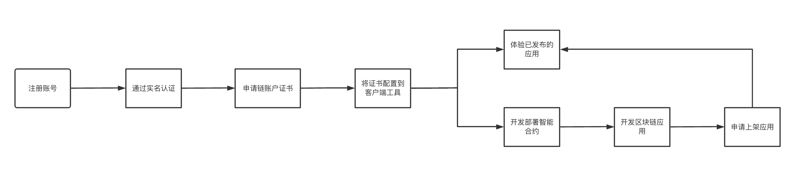

- 在长安链官网申请账户，并通过实名认证后，可申请开放测试网络的用户证书。
- 如之前已经有长安开源代码仓库账号，也可直接使用该账户登录官网，申请证书。
- 根据自身使用场景将所申请到的证书配置到Web3插件钱包(SmartPlugin)、长安链SDK、CMC工具上，通过这些工具可以和开放测试网络的链进行交互。
- 欢迎社区开发者基于开放测试网络部署合约开发应用，如所开发的应用希望邀请更多人体验，可在社群里联系官方将应用公开上架到开放测试网络官网上，供其他人体验。

### 注册/登录长安链账号 
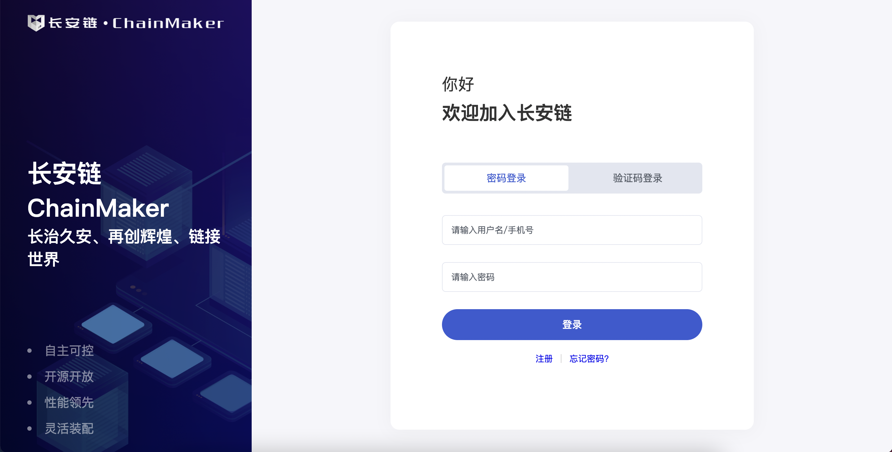

- 如未注册过账号，请先到长安链官网上注册账号，如已有账户请[直接登录](https://login.chainmaker.org.cn/auth/realms/BABEC/protocol/openid-connect/auth?response_type=code&client_id=app&state=UqyzX1EU4QRECtITWI7QdfjbBUjh9cfh&redirect_uri=https://portalbackend.chainmaker.org.cn/base/loginWithChainmakerAuthenticationCenter?loginUrl=https://chainmaker.org.cn/home)
- 为减少存量用户使用成本，原长安链gitlab开源代码仓库注册的老账号，可直接登录长安链官网。
- 目前支持使用该账号登录长安链在线合约编辑器，[SmartIDE。](https://ide.chainmaker.org.cn/)
- 注册使用长安链账户时，请先阅读《长安链用户使用协议》 《长安链服务条款》 《长安链用户隐私保护协议》。

### 申请开放测试网络链账户用户证书 
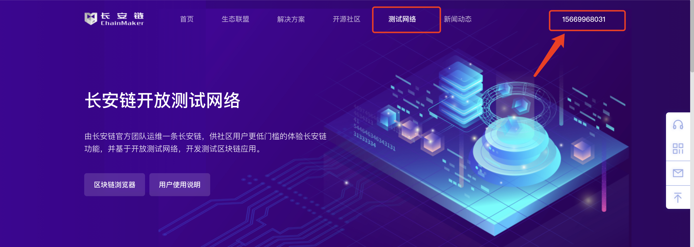

- 登录后进入长安链官网，再点击右上角的账户，进入个人中心
- 在个人中心的用户信息处，先通过实名认证，然后即可在证书管理处申请链账户用户证书

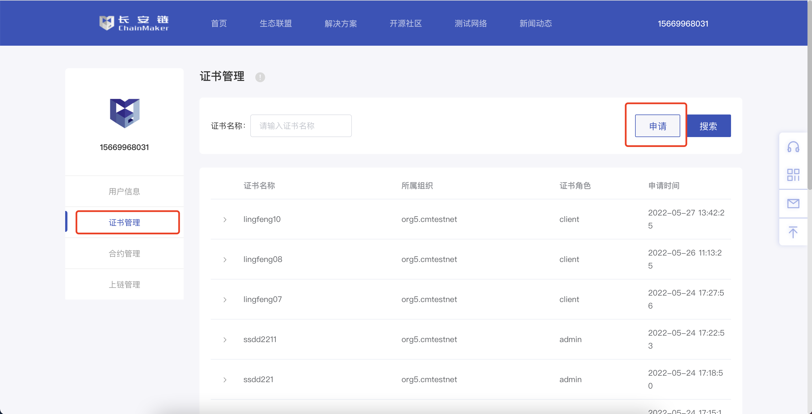

- 填写相关证书信息即可免费申请长安链开放测试网络用户证书。
- 首次申请证书时，会邀请填写一份用户问卷调研，请方便之余填写下，方便我们更好的改进产品。
- 证书名称不可重复，会根据所输入的证书名称生成相应的证书，示例：
  - lingfeng01.client.sign.org5.cmtestnet，
  - 用户自定义的证书名称.证书角色.证书用途.组织ID。
- **【此处需要重点注意】：长安链官方不会存储用户申请的证书的私钥，请在申请完证书后，自行下载到本地并妥善保存，如果不幸丢失。目前没有找回的途径。**
  

### 使用web3插件关联开放测试网络
#### 下载长安链Web3插件(SmartPlugin)

- [点击此处查看SmartPlugin使用说明文档](../dev/长安链Web3插件.md)
- [点击此处前往下载Smartplugin插件](https://git.chainmaker.org.cn/chainmaker/chainmaker-smartplugin/-/releases)，如需登录，请使用长安链开源代码仓库账号登录。

#### 安装SmartPlugin
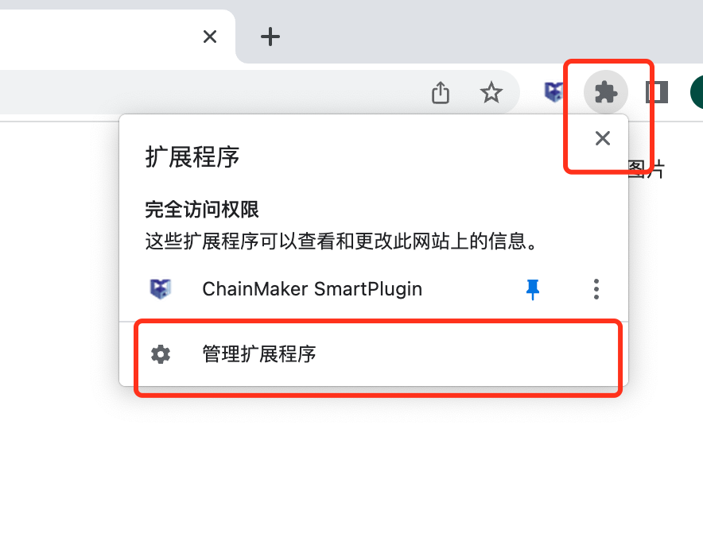

下载后，先请解压Zip压缩包文件，然后打开Chrome浏览器，进⼊插件⻚⾯ [chrome://extensions/](chrome://extensions/)。

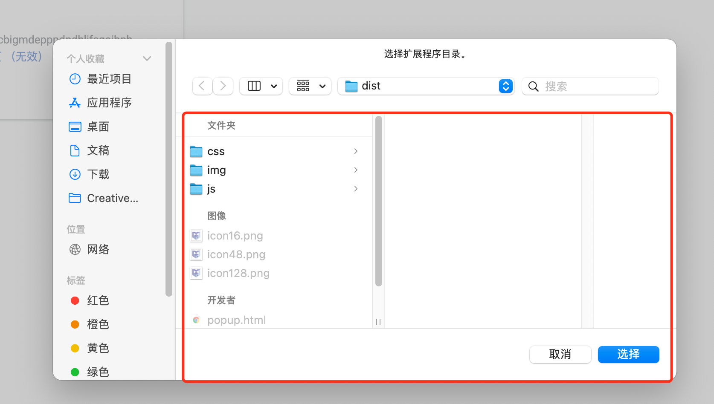

打开浏览器开发者模式，并重启浏览器，加载已解压到本地的dist文件夹，完成添加插件。

#### 将申请到的开放测试网络用户证书添加到Smartplugin

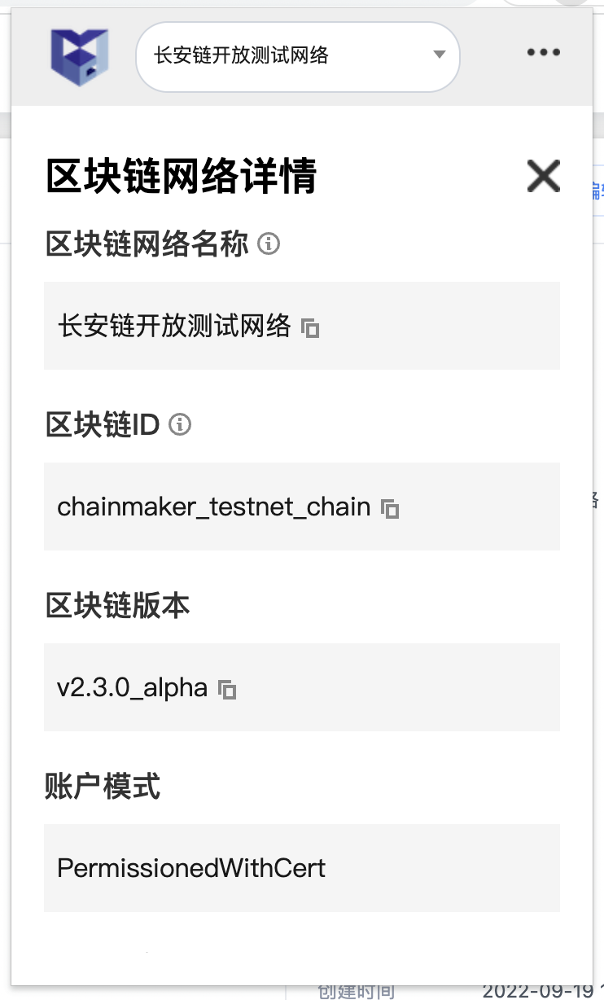

- Smartplugin内已内置订阅了长安链开放测试网络。
- 可在Smartplugin账户管理处，添加已经申请到的用户证书。

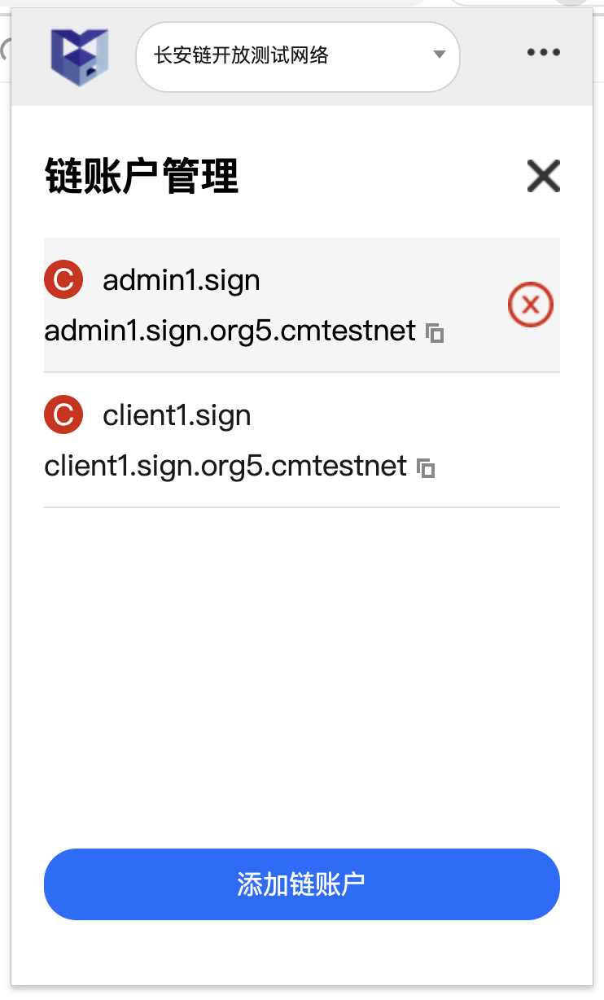
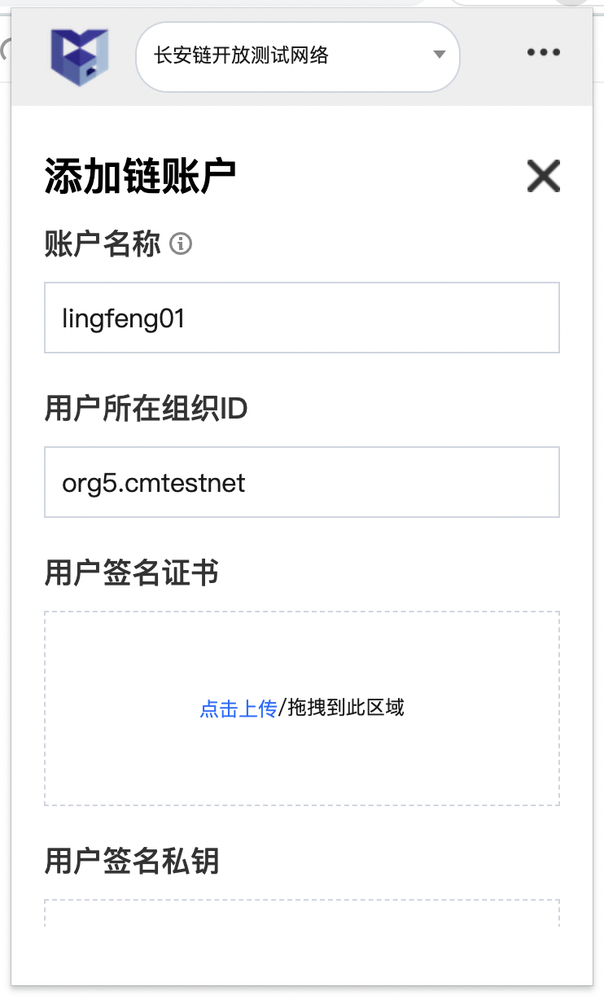

### 使用SDK和链进行交互

#### SDK配置信息

| 参数名称 | 详情  | 
|----------|----------------|
| chainid  | chainmaker_testnet_chain | 
| orgid    | org5.cmtestnet  | 
| orgCrt    | [点击此处下载组织证书](https://git.chainmaker.org.cn/chainmaker/sdk-java-demo/-/raw/v2.2.0_online_opennet/src/main/resources/crypto-config/org5.cmtestnet/ca/org1.cmtestnet/ca.crt?inline=false)  需重命名为`ca.crt` | 
| nodeaddr | certnode1.chainmaker.org.cn:13301 | 
| TLS_host_name | consensus1.tls.org1.cmtestnet | 
| userCrt  | 请使用申请到的用户签名证书   | 
| userKey  | 请使用申请到的用户签名证书私钥  | 
| userTLSCrt  | 请使用申请到的用户TLS证书 | 
| userTLSKey  | 请使用申请到的用户TLS证书私钥  | 

- 配置文件可参考：[配置文件](https://git.chainmaker.org.cn/chainmaker/sdk-java-demo/-/blob/v2.2.0_online_opennet/src/main/resources/sdk_config.yml)

#### 配置并使用SDK

- 关于如何配置并使用SDK，可详见 [开源文档-SDK模块](../sdk/GoSDK使用说明.md) 

### 使用SmartIDE进行智能合约开发
#### 开发智能合约

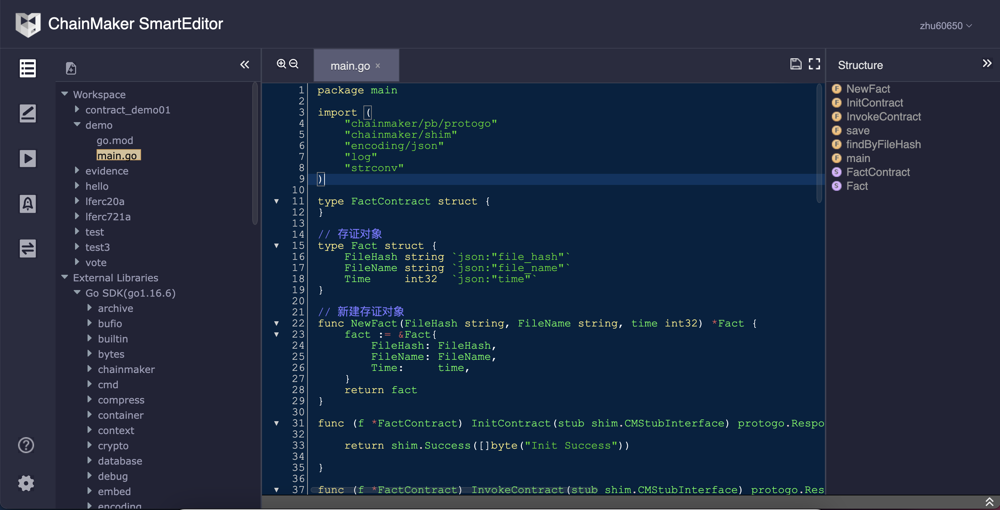

- 利用长安链账号，直接登录长安链在线合约IDE，[点击前往使用](https://ide.chainmaker.org.cn/login)。
- 在合约IDE内进行智能合约的编写，以及本地调试，并编译可部署的智能合约文件。目前仅支持Docker_go语言。

#### 利用SmartPlugin部署和调用合约

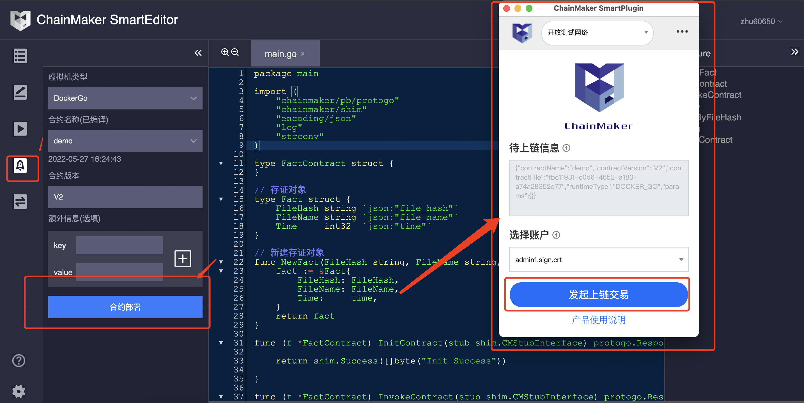

- 在本地调试编译通过后，可利用SmartPlugin进行合约部署，部署时请确保已经在浏览器上安装了SmartPlugin，并导入了开放测试网络的用户证书。

- 完成合约部署后，可利用SmartPlugin 调用已经部署的合约。

#### 查看上链信息
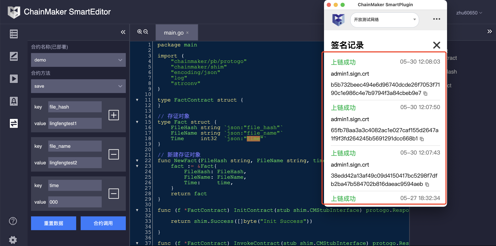

- 上链成功后，可在SmartPlugin上查看到上链记录，通过交易ID可在区块链浏览器上查看到具体的链上信息。
- 更多的SmartIDE的使用说明，请详见[合约IDE使用说明文档](https://ide.chainmaker.org.cn/doc/SmartEditor%20%E4%BD%BF%E7%94%A8%E8%AF%B4%E6%98%8E/)

### 体验长安链存证核验Dapp

#### 体验存证功能
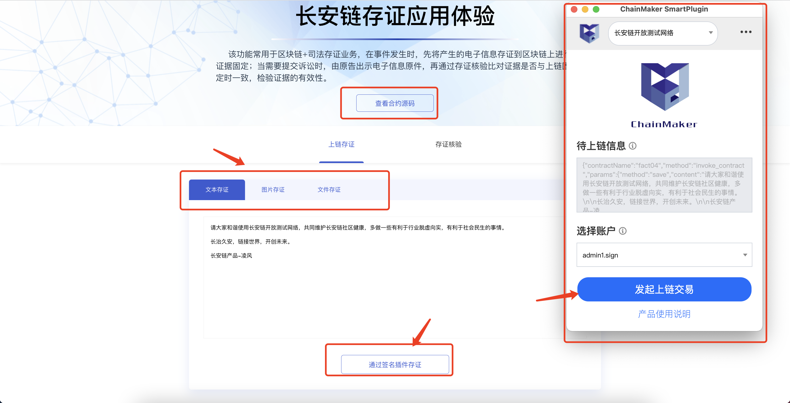

- 可通过查看源码，查看该应用的合约源码。
- 目前支持文本存证，图片存证和文件存证，本质上是将内容先sha256后，在进行上链。
- 文本原文内容会上链，图片和文件不上链，长安链平台也不存储。
- 发起上链前，请确保已经在浏览器上安装了SmartPlugin，并导入了开放测试网络的用户证书。
- **【此处请重点关注】：开放测试网络链是为开源社区服务的公共基础设施，在往链上发送交易时，请遵守相关法律规定，如果发送违规的内容，官方有权吊销已颁发的用户证书。**

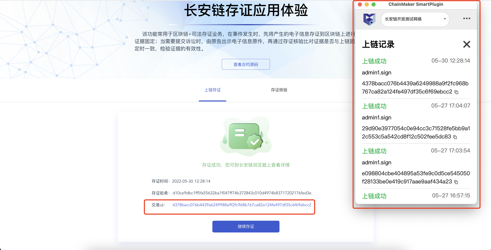

- 存证成功后，可在区块链浏览器上查看存证的具体信息。

#### 体验核验功能
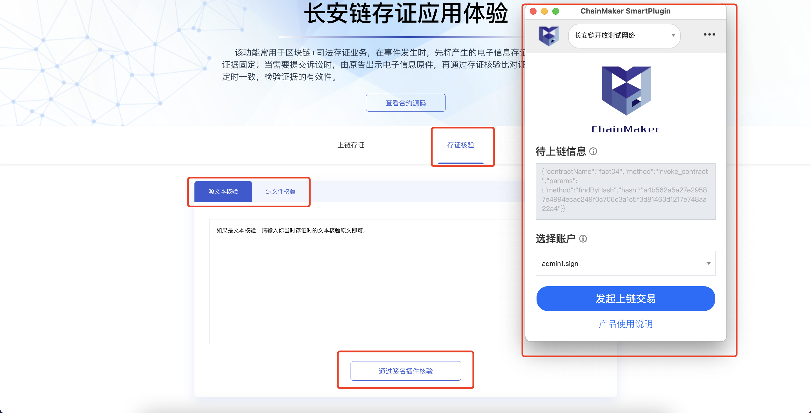

- 支持通过文本原文核验，和上传文件核验（图片本身也是文件，核验图片存证时上传原图片即可）
- 本质上是将内容SHA256后，比对和链上的存证合约里是否存在相同的哈希值。
- 相同的存证哈希值，存证合约里只能有一条记录，从而规避了重复存证的问题。

### 查看开放测试网络的区块链浏览器

#### 查看整体信息

- 浏览器首页里，统计了开放测试网络的相关数据，如区块高度、累计交易数、累计合约数、链上用户数等。
- 需要注意的是，如果只是申请了证书，但是没往链上发送过交易，则不计入链上用户数的统计中。
- 可在区块链浏览器里，查看区块信息、交易信息、合约信息等。

#### 查看区块信息

#### 查看交易信息

- 其中如果上链的内容违规，区块链浏览器上将不予展示。

#### 查看合约信息

- 包括合约的交易记录、合约源码，合约事件、及合约安装部署记录。
- 目前会将长安链官方团队提供的合约进行合约源码展示，比如存证合约，各种示例合约等。
- 如社区用户有需要将自己的部署在开放测试网络上的dapp合约源码进行公开展示，可在微信群里联系长安链官方人员。
- 倡议社区用户分享自己的dapp应用合约，共建长安链合约生态。

