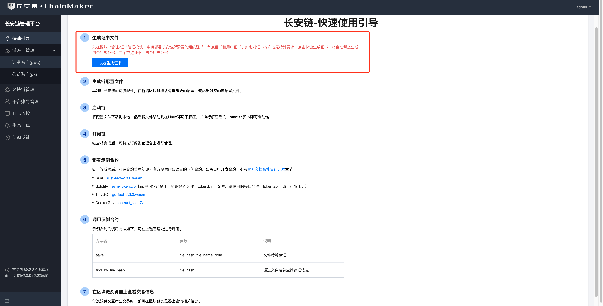
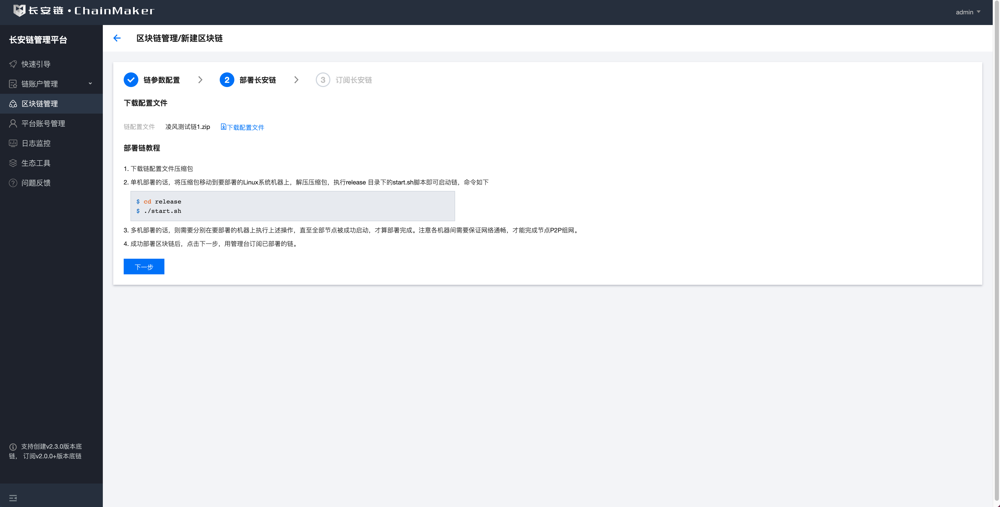
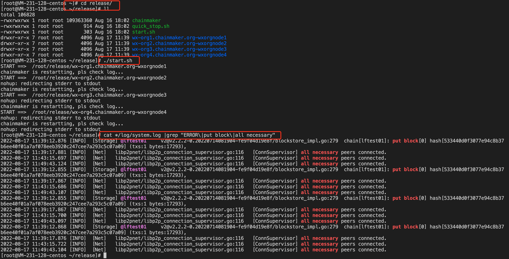
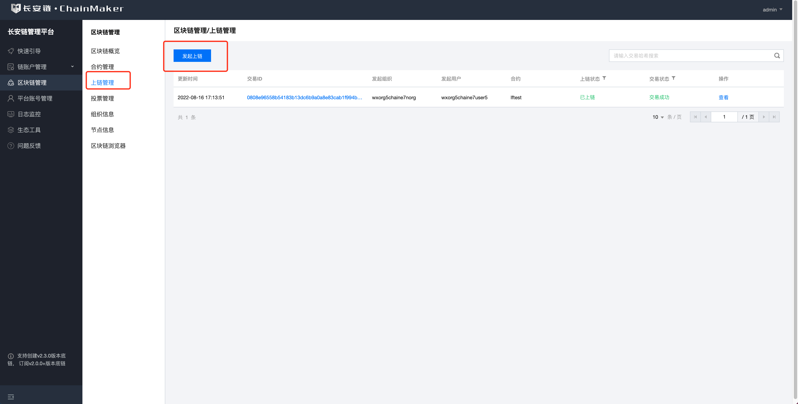
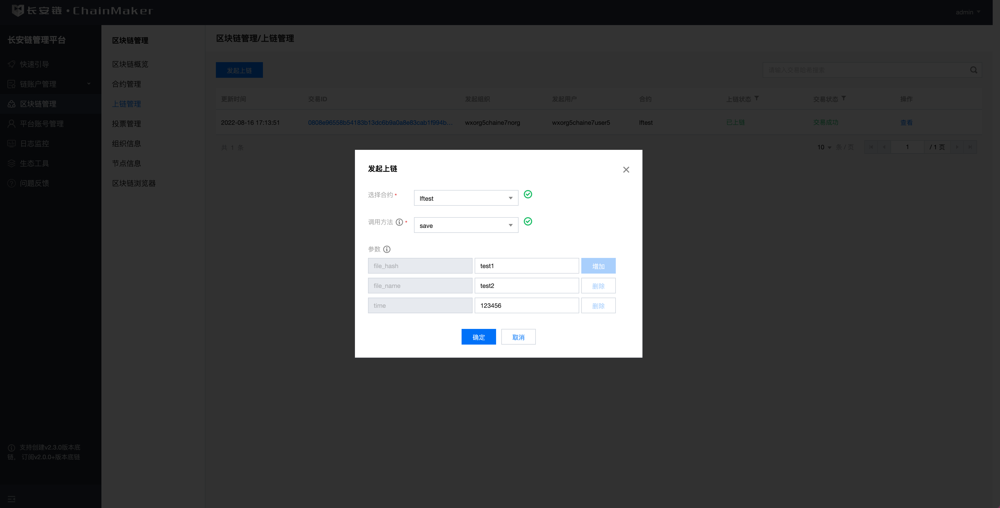
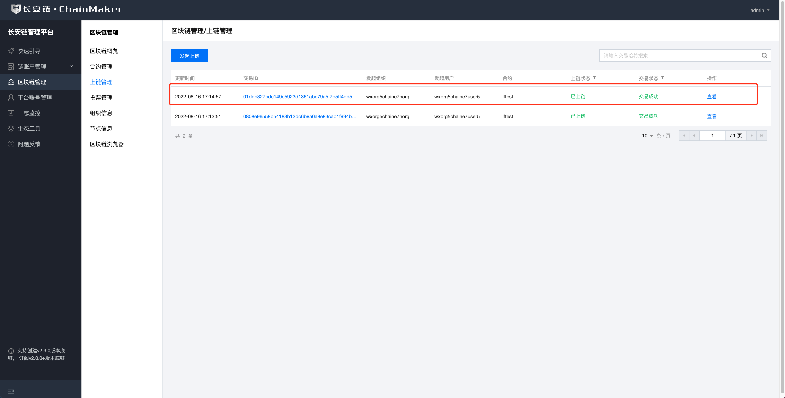
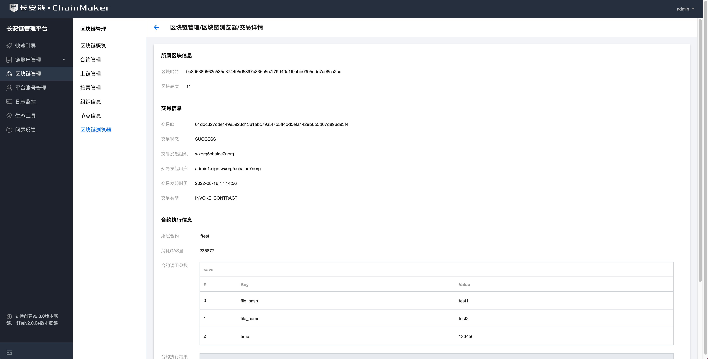

# 通过管理台体验长安链

## 安装长安链管理台
首先我们需要先安装最新版本的长安链管理台。

### 管理台版本支持

目前管理台支持长安链`v1.2.4`、`v1.2.5`、`v1.2.6`、`v2.0.0`、`v2.1.0`、`2.2.0`、`2.3.0`、`2.3.1`、`2.3.2`、`2.3.3`、`2.3.4`版本，因长安链1.X版本和2.X版本底层数据结构不同，目前相互之间不兼容。

### 管理台环境依赖

#### docker环境依赖

docker版本为20.10.7或以上 `docker-compose` 版本为1.29.2或以上

下载地址：

https://docs.docker.com/engine/install/

https://docs.docker.com/compose/install/

若已安装，请通过命令查看版本：

```
$ docker -v
$ docker-compose -v
```

### 部署管理台


管理平台主要由前端、后端及数据库三部分组成。通过docker的方式部署。

#### 代码下载

下载地址： https://git.chainmaker.org.cn/chainmaker/management-backend 下载代码：


```
$ git clone -b v2.3.4 --depth=1 https://git.chainmaker.org.cn/chainmaker/management-backend.git
```

#### 启动容器

下载后端代码后，进入management-backend目录，执行以下命令

```
$ cd management-backend
$ docker-compose up
```

启动成功后，浏览器访问localhost即可，如果发现启动过程中有端口被占用的情况，请修改docker-compose.yml文件中的端口

## 通过管理台部署长安链
然后再准备一台linux服务器，建议最低配置不低于2核8g。准备就绪后我们演示如何通过管理台部署一条长安链。

类目 | 说明
---|---
区块链组织数 | 4个
区块链节点数 | 4个
区块链用户数 | 1个
共识策略 | TBFT
链账户类型 | 证书账户（PermissionedWithCert）
链版本号 | 最新版本
是否开启Docker-VM | 否
是否开启TLS | 是

### 登录管理台


在安装好管理台之后，打开管理台进入登录页面，默认的账号为的`admin`账号，默认密码为`a123456`。如需新增其他账号，可通过admin账号，在平台账户管理处新增。

### 申请链账户的证书文件



- 登录后，在长安链快速引导处，点击快速生成证书按钮，系统将自动生成四个组织证书、四个节点证书、四个用户证书。


- 您可以前往链账户管理-证书账户处，查看已经自动生成的证书。下一步我们根据这些证书生成对应的链配置文件。

### 生成链配置文件


- 进入区块链管理页面，点击左上角到新建区块链。
- 长安链支持可装配性特性，可以根据用户场景需要装配出对应的长安链。在此处我们生成下文所述配置的长安链。

类目 | 说明
---|---
区块链组织数 | 4个
区块链节点数 | 4个
区块链用户数 | 1个
共识策略 | TBFT
链账户类型 | 证书账户（PermissionedWithCert）
链版本号 | 最新版本
是否开启Docker-VM | 否
是否开启TLS | 是


- 首先我们按照图上指示，填写生成配置文件所需的内容。其中
    - chainid：为该链的唯一标识
    - 区块链名称：为该链在长安链管理台上的备注名，仅方便管理台使用实际不上链。
    - 区块链最大容量：为单位区块最多容纳多少笔交易，此处我们保持默认值即可。
    - 出块间隔：为最低出块间隔时长，此处我们保持默认值即可。
    - 交易过期时间：交易最长多久有效，过期后将不再执行。此处我们保持默认值即可。
    - 密码算法：分为国密和非国密，此处我们选择默认的非国密即可。
    - 账户模式：为该链所支持的账户类型，此处我们选择证书模式（permissionedWithcert）
    - 是否开启TLS：为节点和客户端通讯的时候是否加密，此处我们选择开启。
- 接着在共识算法处我们选择TBFT共识，并且选择上文已经申请下来的4个节点。
    - 并在节点部署配置处选择单机部署，并填写我们准备好的linux服务器的ip地址，以及我们打算部署的4个节点所占用的网络端口。
    - 此处需要确保端口没被占用，且网络通畅。
- 在合约虚拟机配置处，如果勾选了Docker-VM则需要再装相关的Docker-VM需要的环境依赖，此处我们可先不勾选。
- 其他的可按照默认值选定即可，全部填写完成后，点击下一步，生成链配置文件。

### 通过脚本部署长安链



- 在此处我们可看到上文所生成的链配置文件zip包，将之下载到本地。
- 注意，此处下载的文件大小大约在50M左右，一般下载完成需要10～20秒，如果网络比较慢的话，需要等待更多的时间，请耐心等待。
- 然后移动到我们准备好的linux服务上，解压zip包，并进入release文件夹内执行脚本启动链。具体命令如下：

```
$ cd release
$ ./start.sh
```

执行完成后通过如下命令检查是否启动成功

```
$ cat */log/system.log |grep "ERROR\|put block\|all necessary"
//若看到all necessary peers connected则表示节点已经准备就绪。
```



当看到该图时，则表示链部署成功，此时我们可用管理台订阅该条链，以便于后续的使用。

### 将部署好的长安链订阅到管理台内


- 部署完成后，我们回到管理台，下载链配置文件界面，点击下一步，进入到如图所示的订阅长安链页面。
- 点击订阅长安链完成订阅。
- 管理台将通过此处配置的链节点信息，同步长安链上的信息，和往链上发送交易。
- 此处配置的用户信息，将用于对所发送的交易进行交易签名。
- 请注意，保持管理台和链之间的网络通畅，如果订阅链失败，请查看常见问答处排查下原因，大多数情况都是网络原因导致。

## 使用管理台体验长安链
现在我们开始基于管理台使用已经部署好的长安链，包括部署、调用合约、查看链上信息等。

### 部署示例智能合约
#### 下载示例合约


我们先到如图所示位置下载长安链官方提供的示例合约。
其中rust合约为存证合约，部署合约时可根据下表配置对应的合约方法，具体方法如下：

Method |  Param |  说明
---|---|---
save | file_hash,file_name,time  | 根据文件哈希，文件名称，时间进行存证
find_by_file_hash | file_hash | 根据文件哈希查询存证信息

之后我们以rust合约为例做说明。

#### 部署示例合约


我们先从区块链管理列表页面，点击我们已经订阅成功的长安链，进入链管理详情页面。
在里头找到合约管理，然后点击左上角的部署合约按钮，弹出如下图弹窗。


- 如图填写相关信息，其中
    - 合约名称不能和已有的合约重复。
    - 合约版本虚拟机选择wasmer
    - 上传已下载到本地的rust合约文件
    - 在合约调用方法处，填写上述的合约方法和参数。


### 调用合约



- 当合约部署完成后，我们进入上链管理处，点击左上角的发起上链将唤起如图弹窗



- 选择我们刚刚部署的合约，以及要调用的方法，输入参数，点击确定发起调用。




- 调用成功后，我们将在上链管理列表里看到一条新的交易记录，点击交易id可跳转到区块链浏览器查看交易详情。
- 此处如果立刻点击交易id跳转到浏览器后发现短时间没数据，是因为管理台正在同步链上数据，一般等个5~10秒钟后会同步到数据。




### 通过区块链浏览器查看链上信息


- 在区块链浏览器处，我们可查看该条链上的信息，包括区块信息，交易信息，合约信息等。
- 一般交易发送成功后很快将同步到信息，如果长时间没同步到信息，可参考常见问题处排查问题。

### 其他使用介绍
更多长安链管理台的使用说明，如订阅已经存在的链，部署使用其他语言的合约，修改链的权限等等，可详见[长安链管理台。](../dev/长安链管理台.md)