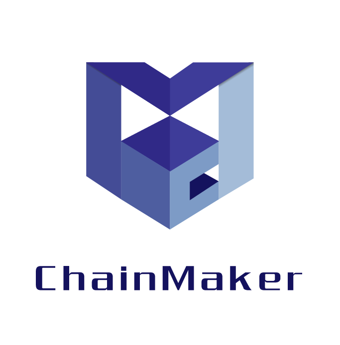
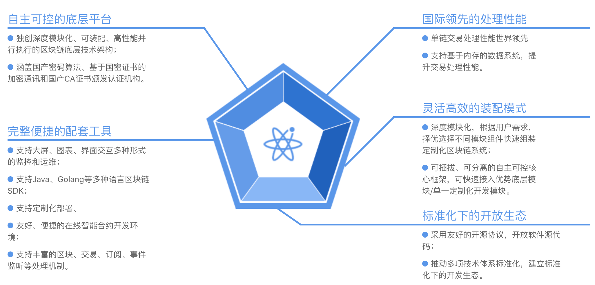

# 长安链底层技术平台介绍

## 简介

“长安链·ChainMaker”具备自主可控、灵活装配、软硬一体、开源开放的突出特点，由北京微芯研究院、清华大学、北京航空航天大学、腾讯、百度和京东等知名高校、企业共同研发。取名“长安链”，喻意“长治久安、再创辉煌、链接世界”。
  长安链作为区块链开源底层软件平台，包涵区块链核心框架、丰富的组件库和工具集，致力于为用户高效、精准地解决差异化区块链实现需求，构建高性能、高可信、高安全的新型数字基础设施，同时也是国内首个自主可控区块链软硬件技术体系。
  长安链的应用场景，涵盖供应链金融、碳交易、食品追溯等一系列关乎国计民生的重大领域。

## 联系我们

微信小助手：ChainMaker2021

公众号搜索：长安链ChainMaker

官网地址： <a href="https://chainmaker.org.cn" target="_blank">https://chainmaker.org.cn</a>

电话：010-50828678

邮箱：operation@chainmaker.org

地址：北京市海淀区中关村南三街18号国家区块链技术创新中心

## 项目背景

中共中央政治局第十八次集体学习时，习近平总书记强调要把区块链作为核心技术自主创新的重要突破口，加快推动区块链技术和产业创新发展。尽管区块链在产业发展中的作用愈加明显，但在发展中过程中仍存在以下问题：
  1、区块链底层基础设施产品多采用国外开源技术，国内自主开发性、创新性能力薄弱。
 2、区块链技术与产业结合深度有待提高，区块链场景多集中在存证方向。区块链如何与产业深度融合，更好地发挥赋能价值流动的作用还需进一步研究。
 3、区块链底层基础设施该如何发展还未明确方向。
  为解决这些问题，北京微芯区块链与边缘计算研究院联合多家知名高校和业内顶尖企业，合作研发国内首个自主可控区块链软硬件一体技术体系“长安链·ChainMaker”，运算速度超过10万TPS，“长安链”运算速度和安全性都处于全球领先水平。

### 长安链生态愿景
构建基于“长安链·ChainMaker”的数字经济国家主链，以重大场景应用为牵引，构建长安链生态网络，汇集数据要素，增进业务协同，繁荣数字经济新生态。

### 关键技术
“长安链·ChainMaker”秉承开源开放、共建共享的理念，已开放程序源码。“长安链·ChainMaker”坚持自主研发，秉承开源开放、共建共享的理念，面向大规模节点组网、高交易处理性能、强数据安全隐私等下一代区块链技术需求，融合区块链专用加速芯片硬件和可装配底层软件平台，为构建高性能、高可信、高安全的数字基础设施提供新的解决方案。
  **并行调度**
 在提案-验证整体框架下，支持基于DAG的块内交易并行调度提案和并行验证；调度支持确定性调度和随机调度等多种并行调度算法。

**广域网络**
 基于PubSub机制，支持多链隔离下P2P网络的复用与数据隔离；
支持NAT穿透，复杂网络拓扑下的大规模节点组网，支持网络节点动态治理。

**多链架构**
 支持并行多链实现不同参与方间的数据隔离；
 可根据场景灵活扩展子链以支持业务和吞吐量的需求。

**权限管理**
  为链上每个操作定义访问权限，支持细粒度权限管理策略；
 结合组织、角色等提供灵活的身份权限配置方案。

### 技术优势

**自主可控**
 面向世界科技前沿，秉持自主创新原则，汇聚国内顶级工程师和科学家团队，长安链·ChainMaker构建了全球独创的底层技术框架，关键技术模块全部自研，成为国际区块链技术发展的新动能，为国家“新基建”提供自主、可控、安全的区块链数字经济基础设施。独创深度模块化、可装配、高性能并行执行的区块链底层技术架构；
  覆盖国产密码算法、基于国密证书的加密通讯和国产CA证书颁发认证机构。

**开源开放**
 自诞生起，长安链践行开源、开放的理念，最大范围联合产、学、研、用各类科研力量，由顶尖高校、知名企业等优势力量共同开发，同时广泛拥抱个人和企业开发者，打造标准规范体系，共建开源开放充满活力的区块链技术生态；
  采用友好的开源协议，开放软件源代码，推动多项技术体系标准化，建立标准化下的开发生态。

**性能领先**
 长安链拥有高效并行调度算法、高性能可信安全智能合约执行引擎、流水线共识算法等国际领先的区块链底层技术，具备高并发、低延时、大规模节点组网等先进技术优势，交易吞吐能力可达10万TPS，位居全球领先水平；
 支持基于内存的数据系统，提升交易处理性能。

**灵活装配**
 长安链将区块链执行流程标准化、模块化，推进区块链技术从手工作业模式演进到自动装配生产模式，方便用户根据不同的业务需求搭建区块链系统，为技术的规模化应用提供基础；
  可插拔、可分离的自主可控核心框架，可快速接入优势底层模块/单一定制化开发模块。

 

  

## 基础术语说明

| 名称          | 说明                   |
| :-------- | :-------------------- |
| 区块（Block）      |区块是区块链中存储交易和交易相关的数据的单元，通常由区块头和区块体组成。                  |
| 区块链（Blockchain）      | 使用密码技术链接将共识确认过的区块按顺序追加而形成的分布式账本。 |
| 智能合约（SmartContract）       | 以数字形式定义的能够自动执行条款的合约。|
| 读写集 （Read-write set）       | 区块链上的一条交易执行过程中，被读取和被修改或写入的状态数据的集合。|
| 交易（Transaction）      | 也称为事务，区块链上的一次原子性账本数据状态变更及其过程和结果记录。|
| 交易哈希（TransactionHash）       | 交易上链成功后，产生的唯一哈希值。|
| 对等网络（Peer-to-peer Networking）       | 一种仅包含对控制和操作能力等效的节点的计算机网络。|
| 可装配性 （Assemblability ）      | 对于可装配区块链系统，其组成模块的易替代性使得整个系统具备易变更性，从而适应各种定制需求，称为可装配性。|
| 交易调度（TransactionScheduling）   | 将一批交易按照调度策略分配计算资源进行执行的过程。 交易调度的调度策略决定一批交易的执行顺序和交易并行冲突的处理机制。 |
| 可装配区块链系统 （Assemblable Blockchain System）   | 可装配区块链系统是由一组易替代、遵循一定规范的模块按照使用者的定制需求组合而成的可正常运作的区块链系统。 该系统具备易变更的特性，通过替换模块能够灵活变更为具备不同特性的另一个可正常运作的区块链系统。 |
| 可装配区块链系统框架  （Assemblable Blockchain System Framework）   | 可装配区块链系统框架是指为确定区块生成流程而设计的具有一定约束性的支撑结构。 框架决定了各个模块的调用规则，根据区块生成的具体要求选择相应的框架按照使用者的定制需求组合模块或 在已有框架上扩展、安插更多的模块，从而更迅速和方便地构建完整的区块链系统。 |
| 提议节点（ProposingNode）      | 区块链网络中负责产生新的候选区块的节点。|
| 验证节点（VerifyingNode）       | 区块链网络中负责验证新的候选区块的节点。 对某一候选区块而言，除提议此区块的节点外其余区块链节点均为验证节点。 在不同轮次中提议节点和验证节点身份可互相转换。 |
|  可信执行环境（TrustedExecutionEnvironment）         | 提供硬件级别的资源隔离和信任度量能力，其中最具代表性的是 Intel SGX。|
|  交易读取 （Transactionreading）         | 链上拉取区块，并读取区块中解析交易信息的过程。 |
|  默克尔根（Merkle root）         | 在构造Merkle树时通过从下到上两两计算得出的最后的唯一哈希值为默克尔根。|
|  有向无环图（DAG）         | DAG原本是计算机领域一种常用数据结构， 因为独特的拓扑结构所带来的优异特性，经常被用于处理动态规划、导航中寻求最短路径、数据压缩等多种算法场景。 有向无环图指的是一个无回路的有向图。 如果有一个非有向无环图，且A点出发向B经C可回到A，形成一个环。 将从C到A的边方向改为从A到C，则变成有向无环图。 |
|  以太坊虚拟机（Ethereum Virtual Machine）     | EVM是简化版的虚拟机，为了保证智能合约运行的流畅度，EVM并没有模拟完整的计算机， 而是采用了轻量级的虚拟机架构。 |
| 长安链可执行文件（chainmaker binary） | 长安链项目chainmaker-go源码编译后生成的可执行二进制文件执行make命令后将生成在chainmaker-go/bin目录下 |
| 长安链SDK（chainmaker SDK） | 用于与长安链交互（发送交易，订阅等）的软件开发工具 |
| 合约SDK（contract SDK） | 用于开发智能合约的软件开发工具，使编译的wasm文件可与长安链进行交互 |
| wasm文件（webassembly file） | 长安链指的智能合约编译后生成的文件。 wasm指通过各自符合WebAssembly规范的编译器编译出来的以.wasm结尾的文件。 c++: emmake make rust: wasm-pack build tinygo: tinygo build -no-debug -opt=s -o main.wasm -target wasm |
| 长安链CA（chainmaker CA） | 指使用长安链配套证书管理工具chainmaker-cryptogen管理的证书、密钥体系 |
| SPV（Simplified Payment Verification） | 轻节点，通过同步区块头和部分其他数据实现对交易的有效性证明 |
| 外部证书 | 非长安链CA服务（chainmaker-ca）或证书生成工具（chainmaker-cryptogen）颁发的数字证书 |

  

## 功能清单说明

| 功能名称           |                                                              | 描述                                                         |
| ------------------ | ------------------------------------------------------------ | ------------------------------------------------------------ |
| 合约引擎           | VM_DOCKER_GO、GASM、WASMER、WXVM、EVM、NATIVE、分别对应 golang、tinygo、rust、 c++、 solidity等 合约语言native为内置系统合约，用于链管理 | 智能合约的运行环境                                           |
| 合约功能           | put、get、跨合约调用、迭代器范围查询、隐私计算、事件         | 合约内支持的与链交互的功能                                   |
| 合约加密方案       | 层级身份加密、paillier半同态加密、bulletproofs零知识证明     | 合约内可提供加密方案                                         |
| 系统合约           | 证书管理、节点管理、链配置更新、区块/交易信息查询、线上多签、合约管理、公钥管理(pwk) | 长安链内置合约                                               |
| 共识算法           | 0-SOLO, 1-TBFT, 3-MAXBFT, 4-RAFT, 5-DPOS, 6-ABFT             |                                                              |
| 加密算法           | （ecc_p256、rsa2048、sm2）（sha3_256、sm3）（aes、sm4）      |                                                              |
| 国密库             | gmssl, tencentsm and tjfoc                                   |                                                              |
| 交易并行调度       | DAG有向无环图                                                | 使交易可并行执行的方案                                       |
| KV存储引擎         | LevelDB、BadgerDB、MySQL、TiKV、TDSql                        | 使用KV格式存储数据                                           |
| SQL合约存储引擎    | MySQL，SQLite、TDSql                                         | 使用结构化存储数据                                           |
| SQL合约引擎        | tinygo、rust                                                 | 可在合约内写sql语句                                          |
| 存储内存加速       |                                                              | 将需要存储的内容预先放在内存， 异步存储落盘                  |
| P2P网络模块        | libp2p、liquid。本地配置种子节点和信任根                     | 节点间连接网络                                               |
| RPC服务            | 提供与SDK交互接口                                            | 链与其他工具交互接口                                         |
| 交易缓存           | normal 常规模式交易池、batch 批量交易池、single 旧版交易池   | 接收交易的交易池                                             |
| 轻节点             | SPV，跨链模式：同步块头和交易有效性校验，节点模式：仅可同步当前组织发送的交易。 | 同步部分数据的客户端                                         |
| 跨链               | chainmaker-cross、tcip-chainmaker；异构链，正/逆向操作的合约实现。 | 区块链数据互通技术                                           |
| 归档               | 历史数据归档、恢复、查询功能                                 |                                                              |
| 数据恢复           | 回滚链到指定高度、非区块数据库恢复、快速同步                 |                                                              |
| 权限控制           | 使用证书、公钥标识账户体系                                   |                                                              |
| 证书类型           | root、ca、common、consensus、admin、client、light            |                                                              |
|                    | 支持三未信安                                                 |                                                              |
| 工具：运维监控     | Prometheus、Grafana                                          |                                                              |
| 工具：自拉起服务   |                                                              | 使服务在电脑重启后可自动运行                                 |
| 工具：链SDK        | go、java、nodejs、python。支持发送交易、查询交易、订阅区块/交易/合约事件 | 与链交互的软件包                                             |
| 工具：CMC          | 命令行工具。支持发送交易、查询交易                           | 与链交互的命令行工具                                         |
| 工具：证书生成工具 | chainmaker-cryptogen                                         | 生成链需要的证书的工具                                       |
| 生态：区块链浏览器 |                                                              | 可查看链区块、交易数据和链状态                               |
| 生态：CA证书服务   |                                                              | 提供签发证书功能                                             |
| 生态：在线IDE      |                                                              | 可在线编辑golang合约，完成编辑、编译、模拟执行、部署、调用上链等操作 |
| 生态：管理台       |                                                              | 单机快速部署长安链用于产品体验和测试                         |
| 生态：预言机       |                                                              | 预言机，提供链上可获取链下数据的功能                         |
| 长安链Web3插件     |                                                              | Web插件直接与链进行交互                                      |
| 数据迁移工具       | Fabric –> Chainmaker、Chainmaker 1.x –> Chainmaker 2.x       |                                                              |

## 编写语言

| 项目         | 编程语言                            | 说明                                                         |
| ------------ | ----------------------------------- | ------------------------------------------------------------ |
| 长安链主项目 | golang                              | 长安链主项目采用golang，以降低并发编程的使用门槛，提升整体性能。 |
| SDK          | golang、java、nodejs、python        | 长安链SDK目前支持golang、java和nodejs，方便使用者与业务系统集成开发。 后续会增加对python的支持。 |
| 智能合约     | golang、c++、rust、solidity、tinygo | 长安链智能合约目前支持golang、c++、rust、solidity等语言，方便各个开发者选择熟悉的语言开发业务逻辑。 不久as(assembly script) 也将支持 |
| 生态工具     | golang                              | 长安链证书生成工具、区块链浏览器、区块链管理平台等一系列生态工具的后端目前也选择golang作为开发语言。 |

  