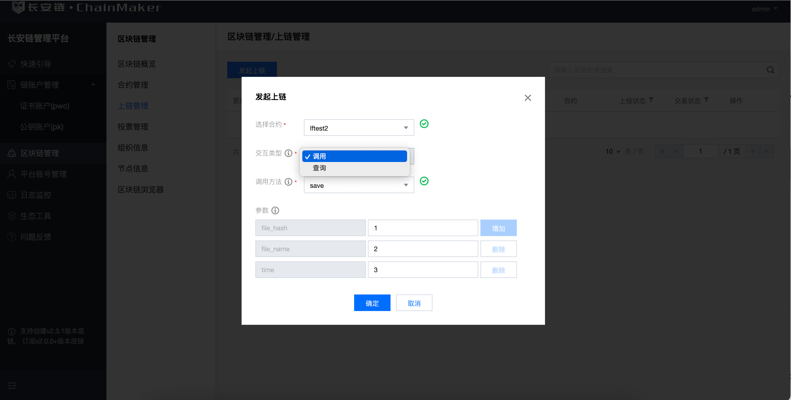
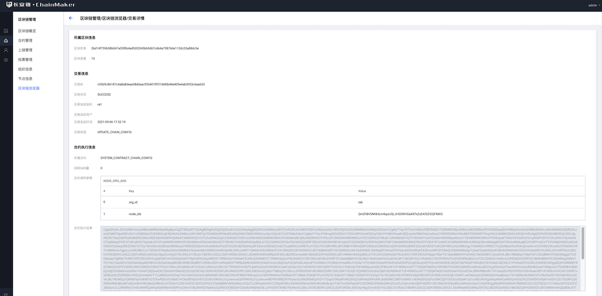

## 验证所部署的链是否正常

### 下载示例合约
此处提供示例合约的已编译之后的合约文件，请安先将之下载到本地，并通过下文的教程部署合约，调用合约，完成验证。
- Rust：[rust-fact-2.0.0.wasm](https://git.chainmaker.org.cn/chainmaker/chainmaker-go/-/raw/v2.2.0/test/wasm/rust-fact-2.0.0.wasm)

### 管理台验证

#### 通过管理台，部署合约


- 在长安链管理台-区块链管理-合约管理模块的部署合约功能里，上传所下载的合约文件即可部署合约。
- 上文示例合约的调用方法如下

Method |  Param |  说明
---|---|---
save | file_hash,file_name,time  | 根据文件哈希，文件名称，时间进行存证
find_by_file_hash | file_hash | 根据文件哈希查询存证信息
  


- 通过管理平台起的长安链，如您未特殊修改，一般部署的权限为Majority，故您在合约管理模块部署完成后，还需要到区块链管理-投票管理处，进行多签投票，当满足Majority条件后，所部署的合约才生效。

#### 通过管理台，调用合约
在长安链管理台-区块链管理-上链管理模块的发起上链功能里，可输入参数对已部署的合约进行调用。



#### 通过管理台，查看交易信息
每次部署或者调用合约，都会产生相关都交易信息，您可以在管理台-区块链管理-区块链浏览器模块中交易详情里查看具体信息。




### cmc验证

#### 编译&配置

> 创建工作目录 $WORKDIR 比如 ~/chainmaker
> 启动测试链 在工作目录下 使用脚本搭建

```
# 编译cmc
$ cd $WORKDIR/chainmaker-go/tools/cmc
$ go build
# 配置测试数据
$ cp -rf $WORKDIR/chainmaker-go/build/crypto-config $WORKDIR/chainmaker-go/tools/cmc/testdata/ # 使用chainmaker-cryptogen生成的测试链的证书
# 查看help
$ cd $WORKDIR/chainmaker-go/tools/cmc
$ ./cmc --help
```

#### 合约部署(eg:WASMER)
```
$ ./cmc client contract user create \
--contract-name=fact \
--runtime-type=WASMER \
--byte-code-path=./testdata/claim-wasm-demo/rust-fact-2.0.0.wasm \
--version=1.0 \
--sdk-conf-path=./testdata/sdk_config.yml \
--admin-key-file-paths=./testdata/crypto-config/wx-org1.chainmaker.org/user/admin1/admin1.sign.key,./testdata/crypto-config/wx-org2.chainmaker.org/user/admin1/admin1.sign.key,./testdata/crypto-config/wx-org3.chainmaker.org/user/admin1/admin1.sign.key \
--admin-crt-file-paths=./testdata/crypto-config/wx-org1.chainmaker.org/user/admin1/admin1.sign.crt,./testdata/crypto-config/wx-org2.chainmaker.org/user/admin1/admin1.sign.crt,./testdata/crypto-config/wx-org3.chainmaker.org/user/admin1/admin1.sign.crt \
--sync-result=true \
--params="{}"
```
> 如下返回表示成功：

>response: message:”OK” contract_result:<result:”\n\004fact\022\0031.0\030\002*<\n\026wx-org1.chainmaker.org\020\001\032 F]\334,\005O\200\272\353\213\274\375nT\026%K\r\314\362\361\253X\356*2\377\216\250kh\031” message:”OK” > tx_id:”991a1c00369e4b76853dadf410182bcdfc86062f8cf1478f93482ba9000191d7”

#### 合约调用(eg:WASMER)
```
$ ./cmc client contract user invoke \
--contract-name=fact \
--method=save \
--sdk-conf-path=./testdata/sdk_config.yml \
--params="{\"file_name\":\"name007\",\"file_hash\":\"ab3456df5799b87c77e7f88\",\"time\":\"6543234\"}" \
--sync-result=true
```
> 如下返回表示成功：
> INVOKE contract resp, [code:0]/[msg:OK]/[contractResult:gas_used:12964572 contract_event:<topic:”topic_vx” tx_id:”7c9e98befbb64cec916765d760d4def5aa26f8bac78d419c9018b8d220e7f041” contract_name:”fact” contract_version:”1.0” event_data:”ab3456df5799b87c77e7f88” event_data:”” event_data:”6543234” > ]/[txId:7c9e98befbb64cec916765d760d4def5aa26f8bac78d419c9018b8d220e7f041]

如果需要配置其他合约，请参考
<a href="../dev/%E5%91%BD%E4%BB%A4%E8%A1%8C%E5%B7%A5%E5%85%B7.html"  target="_blank"> cmc工具 </a>


### sdk验证

#### 源码下载
> 在chainmaker-go工程同级目录，执行下面命令获取go sdk
```
$ git clone -b v2.3.2 --depth=1 https://git.chainmaker.org.cn/chainmaker/sdk-go.git
```
#### 证书关联
> 将通过prepare.sh工具生成的crypto-config目录，软连接到sdk-go/testdata目录
```
$ cd sdk-go/testdata

# 这里我们使用新生成的用户证书，请先将testdata已有的crypto-config移除
$ /bin/rm -rf crypto-config
# 软连接使用prepare.sh脚本生成的证书目录
$ ln -s ../../chainmaker-go/build/crypto-config/ .
```
#### 配置修改
>修改sdk单元测试使用的配置文件：sdk-go/testdata/sdk_config.yml
根据需要修改节点地址：
```
nodes:
      - # 节点地址，格式为：IP:端口:连接数
        node_addr: "127.0.0.1:12301"
```
如果证书路径有调整，修改对应的证书路径配置：
```
    # 客户端用户私钥路径
    user_key_file_path: "./testdata/crypto-config/wx-org1.chainmaker.org/user/client1/client1.tls.key
    # 客户端用户证书路径
    user_crt_file_path: "./testdata/crypto-config/wx-org1.chainmaker.org/user/client1/client1.tls.crt"
    # 客户端用户交易签名私钥路径(若未设置，将使用user_key_file_path)
    user_sign_key_file_path: "./testdata/crypto-config/wx-org1.chainmaker.org/user/client1/client1.sign.key"
    # 客户端用户交易签名证书路径(若未设置，将使用user_crt_file_path)
    user_sign_crt_file_path: "./testdata/crypto-config/wx-org1.chainmaker.org/user/client1/client1.sign.crt"
```
#### 执行存证合约example
该单测会进行存证合约的部署、调用和查询。
```
$ cd sdk-go/examples/user_contract_claim
$ go run main.go
```
看到success或OK等类似输出，说明功能验证成功。

