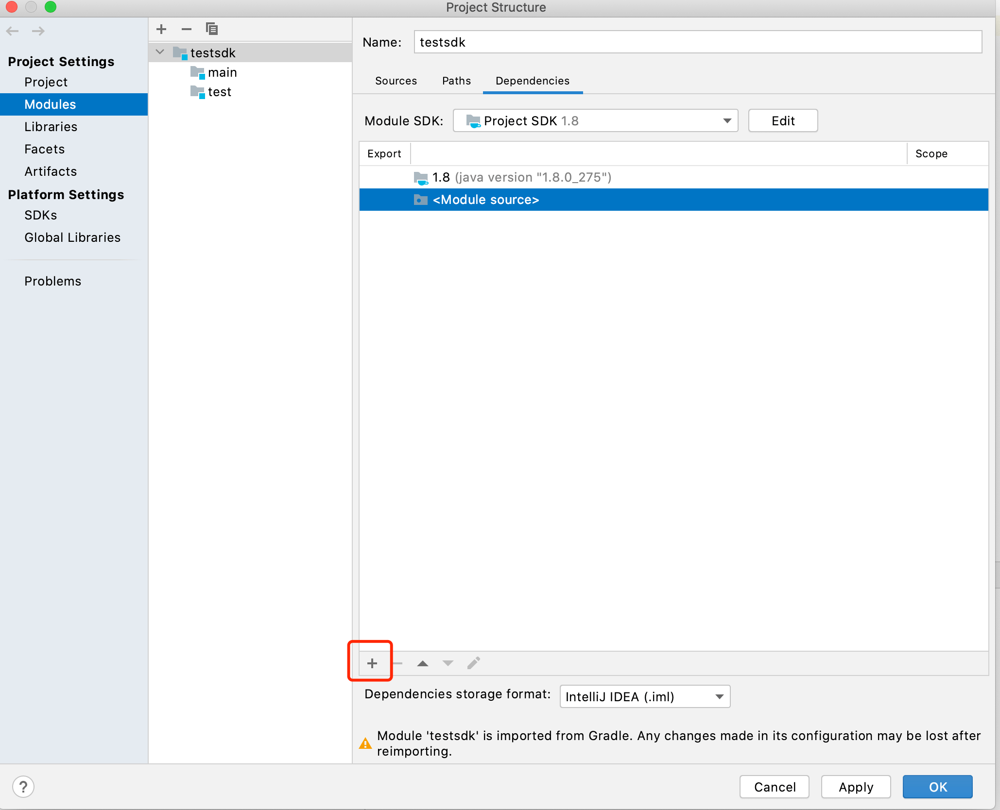

#  Java SDK 使用说明

本篇介绍：

1、环境依赖

2、sdk依赖使用

3、普通合约安装、调用

4、EVM合约安装、调用

5、更多的示例及全部接口

## 基本概念定义

Java SDK定义了User、Node、ChainClient和ChainManager和SdkConfig几个类，分别介绍如下：

- User: 表示链的一个用户信息，主要包括证书和private key，用来给要发送的交易payload签名或者给多签的payload签名。
- Node：表示链的一个节点信息，它定义了节点的各种属性，如节点连接的RPC地址，连接所用的密钥信息等，一个ChainClient对象需要包含一个或多个Node，这样才能对过节点实现各种功能。
- ChainClient：客户端开发最重要也是使用最多的类，代表逻辑上的一条链，所有客户端对链的操作接口都来自ChainClient。
- ChainManager：负责管理所有创建过的链客户端，是一个链客户端管理类，避免用户同一条链客户端创建多个ChainClient。用户可以使用ChainManager来检查某条链客户端是否已经创建，或者直接创建某条链客户端，如果这条链客户端已经创建，ChainManager会直接返回之前已经创建过的。
- SdkConfig: 创建ChainClient所需的配置类。

数据结构定义如下：

```java
public class User {
    // the organization id of the user
    private String orgId;
    // user's private key used to sign transaction
    private PrivateKey privateKey;
    // user's certificate
    private Certificate certificate;
    // user's private key used to sign transaction
    private PrivateKey tlsPrivateKey;
    // user's certificate
    private Certificate tlsCertificate;
    // the bytes of user's certificate
    private byte[] certBytes;
    // the hash of the cert
    private byte[] certHash;

    private CryptoSuite cryptoSuite;
}

public class Node {
    // node grpc address
    private String grpcUrl;
    // the organization's ca cert bytes
    private byte[][] tlsCertBytes;
    // the hostname in client certificate
    private String hostname;
    // TLS or PLAINTEXT
    private String negotiationType;
    // OPENSSL or JDK
    private String sslProvider;
    // node connect count
    private int connectCount;
}

public class ChainClient {
    // chainId is the identity of the chain
        private String chainId;
        // rpc connection Pool
        private ConnectionPool connectionPool;
        // archive config
        private ArchiveConfig archiveConfig;
        // the user used to sign transactions
        private User clientUser;
}

public class ChainManager {
    // chains' map
    private final Map<String, ChainClient> chains = new HashMap<>();
    // for singleton mode
    private static final ChainManager chainManager = new ChainManager();
}

```

## 环境准备
### 软件依赖

**java**

> jdk 8, jdk 11, jdk17

下载地址：https://www.oracle.com/java/technologies/downloads/


> 若jdk版本较高，请在路径为`cryto/ChainmakerX509CryptoSuite.java`的代码中修改`import sun.security.ec.CurveDB`为`import sun.security.util.CurveDB`，若无法自动编译，也可直接下载jar：[chainmaker-sdk-java-2.2.0.jar](..%2Fdownload%2Fchainmaker-sdk-java-2.2.0.jar)


若已安装，请通过命令查看版本：

```bash
$ java -version
java version "1.8.0_202"
```

### 下载安装

```bash
$ git clone -b v2.3.6 --depth=1 https://git.chainmaker.org.cn/chainmaker/sdk-java.git
```

### jar包依赖

需将`sdk`中依赖的`jar`包导入本地工程中，
同时，需将`sdk`中`lib`目录下的`netty-tcnative-openssl-static-2.0.39.Final.jar`包导入工程中，以便适配国密`tls`通信。
需要手动引入的jar包：io.netty.netty-handler 需要：4.1.53.Final - 4.1.65.Final，bcpkix-jdk15on 1.62+，grpc。
参考：https://git.chainmaker.org.cn/chainmaker/sdk-java-demo/-/tree/v2.3.2_online_opennet

## 怎么使用SDK

### maven中央仓库

```
<dependency>
    <groupId>org.chainmaker</groupId>
    <artifactId>chainmaker-sdk-java</artifactId>
    <version>2.3.3</version>
</dependency>
```

### 应用demo

java sdk应用示例，请参考：<a href="https://git.chainmaker.org.cn/chainmaker/sdk-java-demo/-/tree/v2.2.0"  target="_blank"> sdk-java-demo </a>

### 示例代码

示例用法参考：[src/test/java/org/chainmaker/sdk · v2.3.3 · chainmaker / sdk-java · GitLab](https://git.chainmaker.org.cn/chainmaker/sdk-java/-/tree/v2.3.6/src/test/java/org/chainmaker/sdk)

> 注： 下方文档示例可能过时，以gitlab示例为准。
>
> evm和其他合约使用方法在构建参数时有区别。
>
> evm的可参考示例：[TestEvmContract](https://git.chainmaker.org.cn/chainmaker/sdk-java/-/blob/v2.3.6/src/test/java/org/chainmaker/sdk/TestEvmContract.java)
> 
> 特别的：若要解析字符串数组，需要用新版本的4.x web3j abi，而非5.0的（4.9.7支持jdk8）

#### 以参数形式创建ChainClient

> 更多内容请参看：`TestBase`

```java
public void initWithNoConfig() throws SdkException {
    byte[][] tlsCaCerts = new byte[][]{FileUtils.getResourceFileBytes(ORG1_CERT_PATH)};
    
    SdkConfig sdkConfig = new SdkConfig();
    ChainClientConfig chainClientConfig = new ChainClientConfig();
    sdkConfig.setChainClient(chainClientConfig);

    RpcClientConfig rpcClientConfig = new RpcClientConfig();
    rpcClientConfig.setMaxReceiveMessageSize(MAX_MESSAGE_SIZE);

    ArchiveConfig archiveConfig = new ArchiveConfig();
    archiveConfig.setDest(DEST);
    archiveConfig.setType(TYPE);
    archiveConfig.setSecretKey(SECRET_KEY);

    NodeConfig nodeConfig = new NodeConfig();
    nodeConfig.setTrustRootBytes(tlsCaCerts);
    nodeConfig.setTlsHostName(TLS_HOST_NAME1);
    nodeConfig.setEnableTls(true);
    nodeConfig.setNodeAddr(NODE_GRPC_URL1);
    nodeConfig.setConnCnt(CONNECT_COUNT);

    NodeConfig[] nodeConfigs = new NodeConfig[]{nodeConfig};

    chainManager = ChainManager.getInstance();
    chainClient = chainManager.getChainClient(CHAIN_ID);

    chainClientConfig.setOrgId(ORG_ID1);
    chainClientConfig.setChainId(CHAIN_ID);
    chainClientConfig.setUserKeyBytes(FileUtils.getResourceFileBytes(CLIENT1_TLS_KEY_PATH));
    chainClientConfig.setUserCrtBytes(FileUtils.getResourceFileBytes(CLIENT1_TLS_CERT_PATH));
    chainClientConfig.setUserSignKeyBytes(FileUtils.getResourceFileBytes(CLIENT1_KEY_PATH));
    chainClientConfig.setUserSignCrtBytes(FileUtils.getResourceFileBytes(CLIENT1_CERT_PATH));
    chainClientConfig.setRpcClient(rpcClientConfig);
    chainClientConfig.setArchive(archiveConfig);
    chainClientConfig.setNodes(nodeConfigs);

    if (chainClient == null) {
        chainClient = chainManager.createChainClient(sdkConfig);
    }
}
```

#### 以配置文件形式创建ChainClient

> 更多内容请参看：`TestBase`

```java
public void init() throws IOException, SdkException {
    Yaml yaml = new Yaml();
    InputStream in = TestBase.class.getClassLoader().getResourceAsStream(SDK_CONFIG);

    SdkConfig sdkConfig;
    sdkConfig = yaml.loadAs(in, SdkConfig.class);
    assert in != null;
    in.close();

    for (NodeConfig nodeConfig : sdkConfig.getChain_client().getNodes()) {
        List<byte[]> tlsCaCertList = new ArrayList<>();
        for (String rootPath : nodeConfig.getTrustRootPaths()){
            List<String> filePathList = FileUtils.getFilesByPath(rootPath);
            for (String filePath : filePathList) {
                tlsCaCertList.add(FileUtils.getFileBytes(filePath));
            }
        }
        byte[][] tlsCaCerts = new byte[tlsCaCertList.size()][];
        tlsCaCertList.toArray(tlsCaCerts);
        nodeConfig.setTrustRootBytes(tlsCaCerts);
    }

    chainManager = ChainManager.getInstance();
    chainClient = chainManager.getChainClient(sdkConfig.getChain_client().getChainId());

    if (chainClient == null) {
        chainClient = chainManager.createChainClient(sdkConfig);
    }
}
```

#### 创建合约

> 更多内容请参看：`TestUserContract `、`TestEvmContract`，evm需要abi编码，故需特殊处理

```java
public void testCreateContract() throws IOException, InterruptedException, ExecutionException, TimeoutException {
    ResultOuterClass.TxResponse responseInfo = null;
    try {
        byte[] byteCode = FileUtils.getResourceFileBytes(CONTRACT_FILE_PATH);
 
        // 1. create payload
        Request.Payload payload = chainClient.createContractCreatePayload(CONTRACT_NAME, "1", byteCode,
                ContractOuterClass.RuntimeType.WASMER, null);
 
        //2. create payloads with endorsement
        Request.EndorsementEntry[] endorsementEntries = SdkUtils.getEndorsers(payload, new User[]{adminUser1, adminUser2, adminUser3});
 
        // 3. send request
        responseInfo = chainClient.sendContractManageRequest(payload, endorsementEntries, rpcCallTimeout, syncResultTimeout);
    } catch (SdkException e) {
        e.printStackTrace();
        Assert.fail(e.getMessage());
    }
    Assert.assertNotNull(responseInfo);
}
```

#### 调用合约

> 更多内容请参看：`TestUserContract `、`TestEvmContract`，evm需要abi编码，故需特殊处理

```java
public void testInvokeContract() throws Exception {
    ResultOuterClass.TxResponse responseInfo = null;
    try {
        responseInfo = chainClient.invokeContract(CONTRACT_NAME, INVOKE_CONTRACT_METHOD,
                null, null, rpcCallTimeout, syncResultTimeout);
    } catch (Exception e) {
        e.printStackTrace();
        Assert.fail(e.getMessage());
    }
    Assert.assertNotNull(responseInfo);
}
```

### 更多示例和用法

> 更多示例和用法，请参看单元测试用例

| 功能     | 单测代码                |
| -------- | ----------------------- |
| 基础配置 | `TestBase`              |
| 用户合约 | `TestUserContract`      |
| EVM合约  | `TestEvmContract`      |
| 系统合约 | `TestSystemContract`    |
| 链配置   | `TestChainConfig`       |
| 证书管理 | `TestBaseCertManage`    |
| 消息订阅 | `TestSubscribe`         |
| 线上多签 | `TestContractMultisign` |
| 公钥身份 | `TestPubkeyManage`      |

## 接口说明

请参考：[JavaSDK接口说明](./JavaSDK接口说明.md)

## 使用过程

客户端使用SDK的过程如下：

1. 创建SdkConfig对象
2. 获取ChainManager对象
3. 使用ChainManager获取或创建链对象，创建ChainClient时需要将SdkConfig对象作为参数传入
4. 调用ChainClient对象的接口进行操作

### 使用示例

1. 初始化，创建ChainClient

```java
   public void init() {
       Yaml yaml = new Yaml();
       InputStream in = TestBase.class.getClassLoader().getResourceAsStream(SDK_CONFIG);

       SdkConfig sdkConfig;
       sdkConfig = yaml.loadAs(in, SdkConfig.class);
       assert in != null;
       in.close();

       for (NodeConfig nodeConfig : sdkConfig.getChain_client().getNodes()) {
           List<byte[]> tlsCaCertList = new ArrayList<>();
           for (String rootPath : nodeConfig.getTrustRootPaths()){
               List<String> filePathList = FileUtils.getFilesByPath(rootPath);
               for (String filePath : filePathList) {
                   tlsCaCertList.add(FileUtils.getFileBytes(filePath));
               }
           }
           byte[][] tlsCaCerts = new byte[tlsCaCertList.size()][];
           tlsCaCertList.toArray(tlsCaCerts);
           nodeConfig.setTrustRootBytes(tlsCaCerts);
       }

       chainManager = ChainManager.getInstance();
       chainClient = chainManager.getChainClient(sdkConfig.getChain_client().getChainId());

       if (chainClient == null) {
           chainClient = chainManager.createChainClient(sdkConfig);
       }
   }
```

2. 创建合约

```java
   public void testCreateContract() throws IOException, InterruptedException, ExecutionException, TimeoutException {
       ResultOuterClass.TxResponse responseInfo = null;
       try {
           byte[] byteCode = FileUtils.getResourceFileBytes(CONTRACT_FILE_PATH);

           // 1. create payload
           Request.Payload payload = chainClient.createContractCreatePayload(CONTRACT_NAME, "1", byteCode,
                   ContractOuterClass.RuntimeType.WASMER, null);

           //2. create payloads with endorsement
           Request.EndorsementEntry[] endorsementEntries = SdkUtils.getEndorsers(payload, new User[]{adminUser1, adminUser2, adminUser3});

           // 3. send request
           responseInfo = chainClient.sendContractManageRequest(payload, endorsementEntries, rpcCallTimeout, syncResultTimeout);
       } catch (SdkException e) {
           e.printStackTrace();
           Assert.fail(e.getMessage());
       }
       Assert.assertNotNull(responseInfo);
   }
```

3. 调用合约

```java
   public void testInvokeContract() throws Exception {
       ResultOuterClass.TxResponse responseInfo = null;
       try {
           responseInfo = chainClient.invokeContract(CONTRACT_NAME, INVOKE_CONTRACT_METHOD,
                   null, null, rpcCallTimeout, syncResultTimeout);
       } catch (Exception e) {
           e.printStackTrace();
           Assert.fail(e.getMessage());
       }
       Assert.assertNotNull(responseInfo);
   }
```

### SDK Jar包引用方式

#### 源码编译

```
git clone --depth=1 https://git.chainmaker.org.cn/chainmaker/sdk-java.git
// 说明：需要使用openjdk 1.8.151+并提前安装gradle，也可以使用intelliJ IDEA打开项目进行编译
cd chainamker-sdk-java
./gradlew build
```

#### maven中央仓库

```
<dependency>
    <groupId>org.chainmaker</groupId>
    <artifactId>chainmaker-sdk-java</artifactId>
    <version>2.3.3</version>
</dependency>
```

#### 使用

##### 导入`jar`包
导入`jar`包，这里使用`IntelliJ`为示例引用`jar`包，将编译好的`jar`包拷贝到需要使用sdk的项目下（一般可以在项目下建一个`libs`目录），然后打开`IntelliJ IDEA->File->Project Structures`，如下图点击`“+”`号，选择`JARs or Directories`，选中`jar`包点击`open`即可。



##### 依赖库
导入依赖`jar`包，需将`sdk`中依赖的`jar`包导入本地工程中，同时，需将`sdk`中`lib`目录下的`netty-tcnative-openssl-static-2.0.39.Final.jar`包导入工程中，以便适配国密`tls`通信。
`tcnative`的`jar`包及动态库地址：<a href="https://git.chainmaker.org.cn/chainmaker/chainmaker-tools/-/tree/master/tls-netty"  target="_blank"> tcnative </a>

##### 引用

   在要使用sdk的源文件里使用import引用sdk包，如下：

   ```
   import org.chainmaker.sdk.*;
   ```
##### 应用demo

java sdk应用示例，请参考<a href="https://git.chainmaker.org.cn/chainmaker/sdk-java-demo/-/tree/v2.3.2"  target="_blank"> sdk-java-demo </a>

<br><br>


### 密码机支持

#### 密码机介绍


| 项目    | 备注        |
|-------|-----------|
| 密码机厂商 | 三未新安      |
| 密码机型号    | SJJ1012-A |

#### 引用方式

- 将`sdk`中`lib`目录下的`crypto_v5.3.3.8.jar`、`swxajce_v5.3.3.8.jar`包和`swsds.ini`文件导入当前项目的`lib`目录下，
- 导入依赖`jar`包，需将`sdk`中依赖的`crypto_v5.3.3.8.jar`、`swxajce_v5.3.3.8.jar`包导入本地工程中
- 将`lib`目录下`swsds.ini`文件中与密码机相关的配置进行修改

```
[HSM1]
# 密码机ip
ip=192.168.1.240 
port=8008
passwd=11111111
```

#### 配置修改

##### 配置文件方式修改

- sdk_config.yml(将`pkcs11.enable`设置为true)
```
  pkcs11:
    enabled: true # pkcs11 is not used by default
```

##### ChainClientConfig方式修改

- sdk_config.yml(将`pkcs11.enable`设置为true)
```
    ChainClientConfig chainClientConfig = new ChainClientConfig();
    Pkcs11Config pkcs11Config = new Pkcs11Config();
    pkcs11Config.setEnabled(true);
    chainClientConfig.setPkcs11(pkcs11Config);
```

##### 用户配置

- 配置用户时，将`pkcs11Enable`参数设置为true
```
    adminUser = new User(ORG_ID3, FileUtils.getResourceFileBytes(ADMIN3_KEY_PATH),
         FileUtils.getResourceFileBytes(ADMIN3_CERT_PATH),
         FileUtils.getResourceFileBytes(ADMIN3_TLS_KEY_PATH),
         FileUtils.getResourceFileBytes(ADMIN3_TLS_CERT_PATH), true);
```


#### 归档中心支持

##### 配置文件修改
- sdk_config.yml(将`archive_center_query_first`设置为true)
```
  archive:
    # mysql archivecenter 归档中心 数据归档链外存储相关配置
    type: "archivecenter"
    dest: "root:123456:localhost:3306"
    secret_key: xxx
  # 如果为true且归档中心配置打开,那么查询数据优先从归档中心查询
  # 如果是false,则不访问归档中心，只访问链数据
  archive_center_query_first: false
  # 归档中心
  archive_center_config:
    chain_genesis_hash: a23a0c6fd402010efbc31741b2a868c9e6558471fda1e8d1f16673ef683e06db
    archive_center_http_url: http://127.0.0.1:13119
    request_second_limit: 10
    rpc_address: 127.0.0.1:13120
    tls_enable: false
    tls:
      server_name: archiveserver1.tls.wx-org.chainmaker.org
      priv_key_file: src/test/resources/archivecenter/archiveclient1.tls.key
      cert_file: src/test/resources/archivecenter/archiveclient1.tls.crt
      trust_ca_list:
        - src/test/resources/archivecenter/ca
    max_send_msg_size: 200
    max_recv_msg_size: 200  
```

#### 低配模式支持

- 如果使用低配模式，获取到rpc连接会立即释放

```yaml
   ##连接池配置
  connPool:
    # 是否使用低配
    enableLowProfile: false
    # 最大连接数
    maxTotal: 100
    # 最少空闲连接
    minIdle: 5
    #最大空闲连接
    maxIdle: 20
    #连接空闲最小保活时间，默认即为-1，单位：ms
    #当空闲的时间大于这个值时，强制移除该空闲对象
    minEvictableIdleTime: -1
    #连接空闲最小保活时间，默认即为30分钟(1800000)，单位：ms
    #当对象的空闲时间超过这个值，并且当前空闲对象的数量大于最小空闲数量(minIdle)时，执行移除操作
    softMinEvictableIdleTime: 1800000
    #回收空闲线程的执行周期，单位毫秒。默认值5分钟(300000） ，-1 表示不启用线程回收资源，单位：ms
    timeBetweenEvictionRuns: 300000
    #没有空闲连接时，获取连接是否阻塞
    blockWhenExhausted: true
    #当没有空闲连接时，获取连接阻塞等待时间，单位：ms
    maxWaitMillis: 11000
```

##### 注意事项

- http模式，sdk不支持归档注册，不支持归档，需要使用归档服务进行注册和归档
- chain_genesis_hash为链的第一个区块的hash值，可以通过如下方式获取
```
    ChainmakerBlock.BlockInfo blockInfo = null;
    try {
        blockInfo = chainClient.getBlockByHeight(0, false, rpcCallTimeout);
    } catch (SdkException e) {
        e.printStackTrace();
    }
    System.out.println(Hex.toHexString(blockInfo.getBlock().getHeader().getBlockHash().toByteArray()));
```
- grpc模式支持tls开启，开关状态和归档中心服务保持一致
- 优先级
  - 若设置type为mysql，则使用mysql模式
  - 若设置type为archivecenter，则会先判断rpc连接是否存在，存在会使用rpc模式
  - 若rpc连接不存在，判断http连接是否存在，存在会使用http模式
  - 若两者都没有，则不会使用归档中心

## JavaSDK连接长安链部署的区块链网络
请参考：[JavaSDK连接长安链管理台部署的区块链网络](./JavaSDK连接长安链管理台部署的区块链网络.md)

## changelog

按发布时间倒序

### v2.3.3

| 概要              | 描述                                                                          |
|-----------------|-----------------------------------------------------------------------------|
| 增加自定义签名算法接口实现   | 增加自定义签名算法接口实现                                                               |
| 优化获取国密公钥地址      | 优化获取国密公钥地址                                                                  |
| 优化根据配置文件地址获取公司钥 | 优先使用相对路径，然后在获取resources里面的文件                                                |
| 增加同步获取交易结果rpc实现 | 增加同步获取交易结果rpc实现, 使用enable_send_request_sync和enable_tx_result_dispatcher进行判断 |
| 增加低配模式          | 根据enable_low_profile判断是否使用低配模式，低配模式获取到连接之后直接返回到连接池                          |


### v2.3.1.4

| 概要                            | 描述                                   |
| :------------------------------ | :------------------------------------- |
| 修复同步订阅模式下死循环问题    | 订阅失败重连时区块高度超过当前链高度   |
| 优化日志打印                    | 某些错误信息以WARN堆栈形式打印         |
| 修复失败节点识别问题            | 节点识别从url改成url+tlshostname       |
| 修复web3j解析字符串数组失败问题 | 将web3j-abi降级成jdk8支持的最新版4.9.7 |

### v2.3.2

| 概要                     | 描述                                                            |
|------------------------|---------------------------------------------------------------|
| 支持归档中心                 | 增加归档中心，若`archive_center_query_first`为true，则可以设置归档中心，访问归档服务的数据 |
| 国密支持jdk8，jdk11，jdk17   | 在支持jdk8，jdk11的同时，进行了版本升级，支持jdk17                              |
| 依赖包升级                  | grpc等版本升级，使用可以参考build.gradle内依赖                               |
| 新增异常类型                 | 可以根据异常类型进行判断，确认是否需要重试等操作                                      |
| 新增代付者处理                | 包含发送合约管理请求，发起多签请求等                                            |
| 新增gas limit限制          | 包含发起多签投票以及发起多签请求构建payload的操作                                  |
| 新增修改链基本配置操作            | 包含链的default_gas_price， install_base_gas,install_gas_price     |

### v2.3.1.3

| 概要                       | 描述                                                   |
| -------------------------- | ------------------------------------------------------ |
| 连接池使用方式改为先进先出 | 在配置多个节点后，可达到负载均衡上链效果               |
| 修复连接关闭但未释放问题   | 修复连接异常关闭未从连接池销毁，导致所有连接不可用问题 |
| 有条件的负载订阅           | 可以通过修改配置文件中的node顺序，达到负载均衡的效果   |

### v2.3.1.2

| 概要                                        | 描述                                                              |
|-------------------------------------------|-----------------------------------------------------------------|
| 连接池频繁关闭/创建优化                              | 添加连接池参数：softMinEvictableIdleTime，修改默认扫描时间5分钟。修改默认配置生产可用。        |
| 连接异常关闭后续处理                                | 连接异常关闭之后，不返回连接到连接池，直接对连接进行销毁处理                                  |
| 订阅获取交易结果写入Map                             | 订阅修改交易结果写入map，修改mapValue类型为对象，invoke注册key，如果有key才会进行写入，拿到结果进行注销 |
| 修复ManagedChannel allocation site连接未正常关闭错误 | 在将对象设置为null之前，关闭该对象。                                            |
| 连接节点超时时间加长                                | 连接超时时间默认从3秒改成10秒                                                |


## v2.3.2升级说明

- 由于2.3.2版本升级包含依赖版本升级，所以在使用时，需要升级依赖版本,可以参考[sdk-demo](https://git.chainmaker.org.cn/chainmaker/sdk-java-demo/-/commit/e84acae8435e7cc6814c22d6e68fdb887b5499d7)。
- 其他依赖升级可以根据使用进行修改，参考java-sdk中[build.gradle](https://git.chainmaker.org.cn/chainmaker/sdk-java/-/blob/v2.3.2/build.gradle)。
- 若不需要归档中心，可以继续使用v2.3.1.3中sdk_config.yaml,若需要使用归档中心，则可以增加对应的归档中心配置。


