# JavaSDK 连接长安链管理台部署的区块链网络

## 环境准备

### 软件环境依赖

| 软件                  | 版本                      |
|---------------------|-------------------------|
| MacOS Kernel        | 23.4.0                  |
| Docker              | 20.10.22, build 3a2c30b |
| Docker Compose      | v2.15.1                 |
| 长安链管理台              | v2.3.3                  |
| 长安链底链版本             | v2.3.3                  |
| JDK                 | 1.8.0_401               |
| chainmaker-sdk-java | v2.3.3                  |

### 底链环境依赖

使用java-sdk前，请先确保已完成长安链的部署工作，如尚未部署，请参考：

通过命令行启动链：<https://docs.chainmaker.org.cn/quickstart/%E9%80%9A%E8%BF%87%E7%AE%A1%E7%90%86%E5%8F%B0%E4%BD%93%E9%AA%8C%E9%93%BE.html#id2>

通过管理台启动链：<https://docs.chainmaker.org.cn/quickstart/%E9%80%9A%E8%BF%87%E7%AE%A1%E7%90%86%E5%8F%B0%E4%BD%93%E9%AA%8C%E9%93%BE.html#id9>

先行完成部署链事宜，再进行后续操作。

若您已有正在运行中的长安链，可通过如下方式检查链是否运行正常。

1. 在区块链服务器中执行，如下命令确认4个节点进程存在，

```shell
ps -ef|grep chainmaker
```
若出现下文情况则表示节点存在。

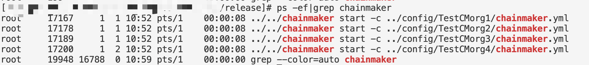


2. 确认从sdk所在机器连接区块链节点机器端口连接成功

```shell
telnet node-ip node-rpc-port
```

若出现下文情况则表示网络连接正常

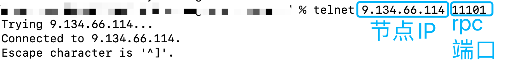

## 如何使用chainmaker-sdk-java

### IntelliJ IDEA 环境配置
使用IntelliJ IDEA打开chainmaker-sdk-java

首先进行如下设置：

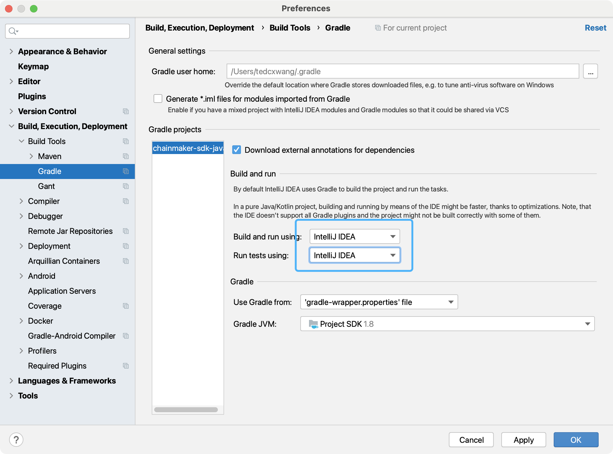

### 新建项目

File->New->Maven，如下：

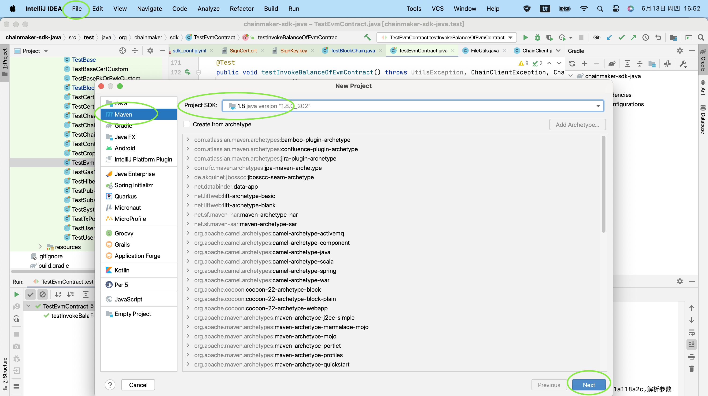

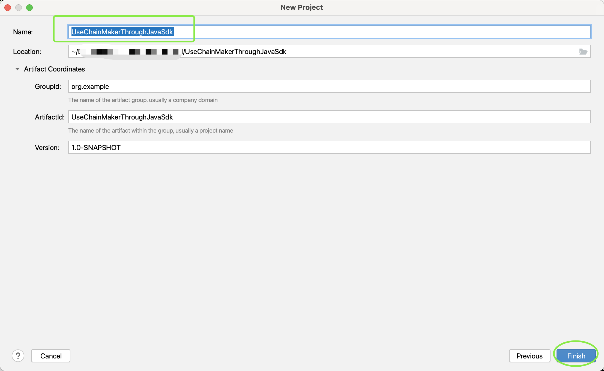

通过pom.xml文件在maven中引入chainmaker-java-sdk，并完成下载，如下：

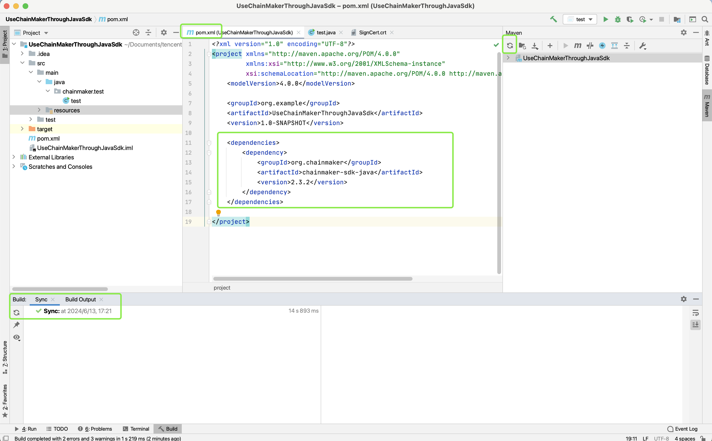

注：上图示例中2.3.2、2.3.3版本对下面示例没有影响。

新建包（chainmaker.test）


新建类（test）

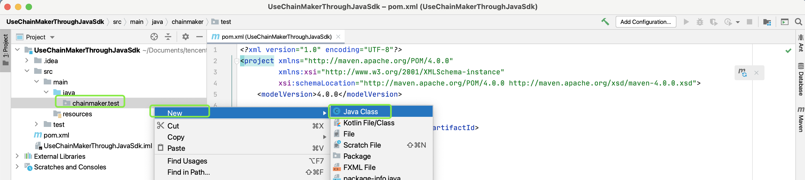

编写main方法

出现如下结果，确认本地idea、java环境一切就绪：

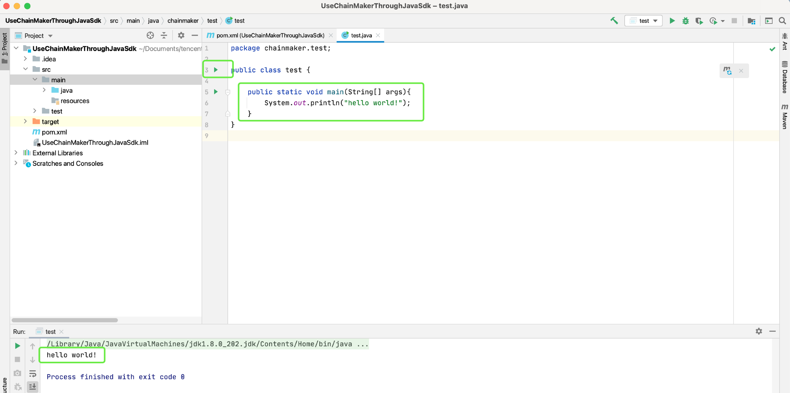

通过上述操作已确保区块链环境、java环境、idea环境一切就绪，下面进行chanmaker-sdk-java相关的配置。

### 获取并修改SDK配置

#### 通过管理台下载SDK配置及链账户信息文件

从管理台下载配置文件，如下图：

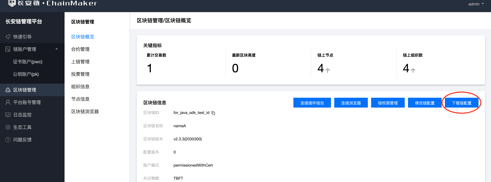

配置解压后，文件结构如下：

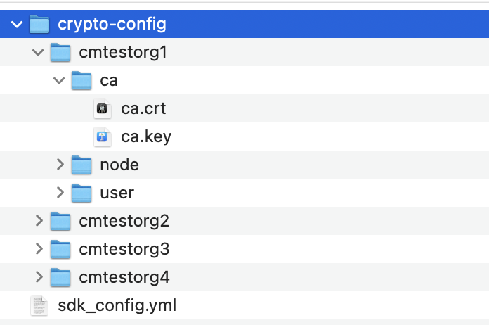

将解压文件拷贝到src/resouces目录中，如下：

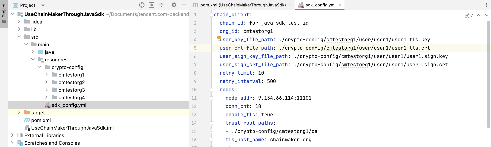

正常情况下，可直接使用此处下载的SDK配置文件，因java版本或链版本的不同，部分情况下需要微调配置文件，如遇问题，可到下文的常见问题解答处寻找解决方案。

#### 自行构建配置文件

##### sdk配置文件介绍

下文是长安链的java-sdk配置文件（sdk_config.yml）模版内容节选，如需自行生成，则需要将模版里的部分内容进行替换。重点包含：

1. 链id
2. 组织id
3. 客户端用户私钥路径
4. 客户端用户证书路径
5. 客户端交易签名路径
6. 客户端交易签名证书路径
7. 节点rpc地址
8. 节点信任证书池路径（ca证书）
9. tls_host_name

其余内容一般使用默认值即可，亦可按需调整。
```yaml
chain_client:

# 链ID

chain_id: "chainmaker_testnet_chain"

# 组织ID

org_id: "org5.cmtestnet"

# 客户端用户私钥路径

user_key_file_path: "src/main/resources/crypto-config/org5.cmtestnet/user/client/ytf002.tls.key"

# 客户端用户证书路径

user_crt_file_path: "src/main/resources/crypto-config/org5.cmtestnet/user/client/ytf002.tls.crt"

# 客户端用户交易签名私钥路径(若未设置，将使用user_key_file_path)

user_sign_key_file_path: "src/main/resources/crypto-config/org5.cmtestnet/user/client/ytf002.sign.key"

# 客户端用户交易签名证书路径(若未设置，将使用user_crt_file_path)

user_sign_crt_file_path: "src/main/resources/crypto-config/org5.cmtestnet/user/client/ytf002.sign.crt"

nodes:

  - # 节点地址，格式为：IP:端口:连接数

    node_addr: "certnode1.chainmaker.org.cn:13301"

  # 节点连接数

  conn_cnt: 10

  # RPC连接是否启用双向TLS认证

  enable_tls: true

  # 信任证书池路径

  trust_root_paths:

    - "src/main/resources/crypto-config/org1.cmtestnet/ca/org1.cmtestnet"

    # TLS hostname

    tls_host_name: "consensus1.tls.org1.cmtestnet"

```

##### 获取所在链的相关信息

- 链id信息，可从管理台区块链概览处获取，如图所示

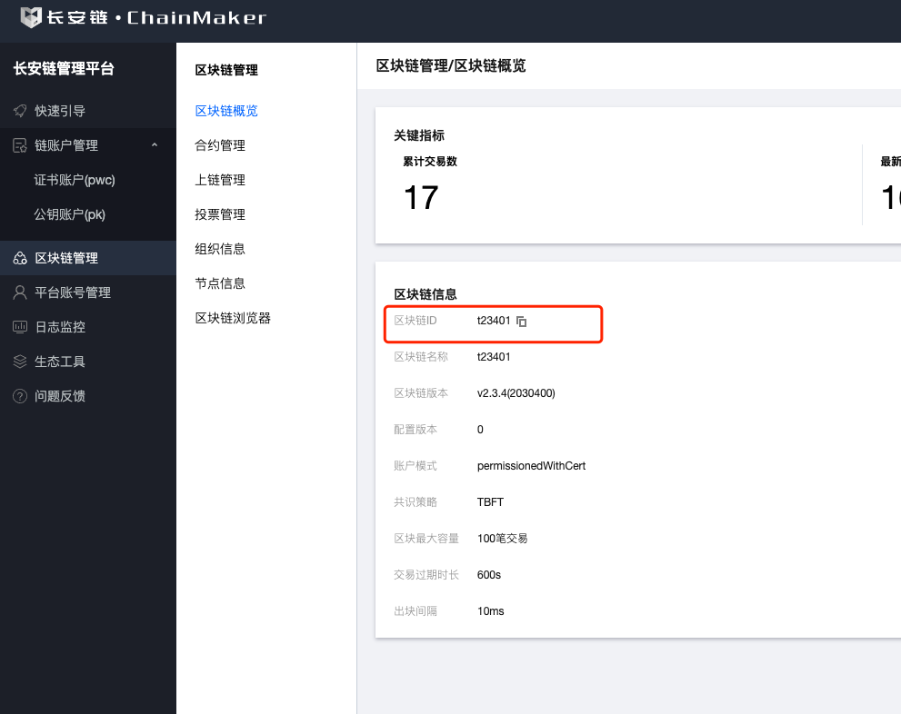

- 链账户证书文件获取

其中所需的链账户证书信息等，建议按照如下图所示的目录结构放置，实际的证书和组织id名称以实际的部署的链的情况为准。放置好后，用真实的路径信息替换上文sdk_config模版里的路径。

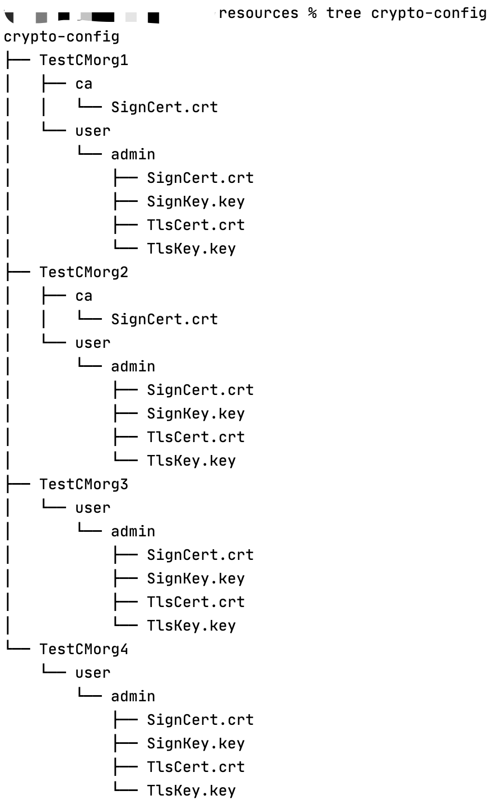

- ca证书文件、user证书文件，可从管理台账户管理处获取。如图所示：

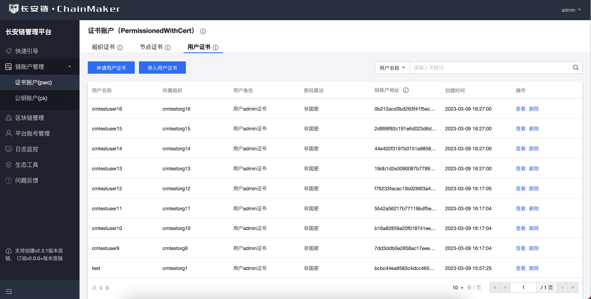

点击查看按钮可查看并下载对应的证书，注意所用到的user证书必须都是以本ca证书作为跟证书向下签发的，即需要都是同一个所属组织名下的。

- 组织id可从所下载到的组织ca证书里获取，如图所示

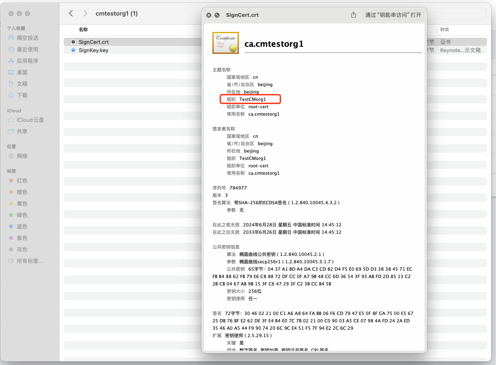

- tls_host_name可从所下载到的tls证书处获取，如图所示


- 节点rpc为创建链时，所填写的节点部署地址，如下图所示

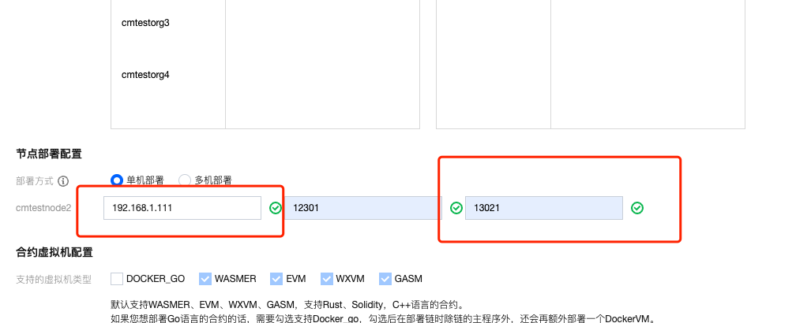

若所部署的节点使用了nginx等网络转发策略，请以实际的节点所在的地址为准，需自行确保sdk所在网络环境和该节点环境网络连接通畅。

##### 将相关文件导入到项目中

相关信息都获取并修改完成后，拷贝crypto-config（证书及私钥）和sdk_config.yml到resources，如下图：

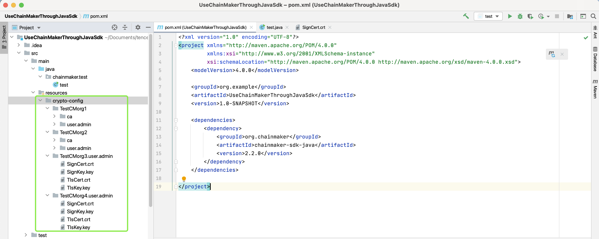

### 代码编写
```java
package chainmaker.test;

import org.chainmaker.pb.config.LocalConfig;
import org.chainmaker.sdk.*;
import org.chainmaker.sdk.config.NodeConfig;
import org.chainmaker.sdk.config.SdkConfig;
import org.chainmaker.sdk.utils.FileUtils;
import org.yaml.snakeyaml.Yaml;

import java.io.InputStream;
import java.util.ArrayList;
import java.util.List;

public class test {
    static String SDK_CONFIG = "sdk_config.yml";

    static ChainClient chainClient;
    static ChainManager chainManager;
    static SdkConfig sdkConfig;


    static long rpcCallTimeout = 10000;

    public static void main(String[] args) throws Exception {

        //完成chainClient、chainManager、adminUseer1、adminUser2、adminUser3的初始化
        initChainClient();

        checkNewBlockChainConfig();
    }


    public static void initChainClient() throws Exception {
        Yaml yaml = new Yaml();
        InputStream in = test.class.getClassLoader().getResourceAsStream(SDK_CONFIG);

        sdkConfig = yaml.loadAs(in, SdkConfig.class);
        assert in != null;
        in.close();

        for (NodeConfig nodeConfig : sdkConfig.getChainClient().getNodes()) {
            List<byte[]> tlsCaCertList = new ArrayList<>();
            if (nodeConfig.getTrustRootPaths() != null) {
                for (String rootPath : nodeConfig.getTrustRootPaths()) {
                    List<String> filePathList = FileUtils.getFilesByPath(rootPath);
                    for (String filePath : filePathList) {
                        tlsCaCertList.add(FileUtils.getFileBytes(filePath));
                    }
                }
            }
            byte[][] tlsCaCerts = new byte[tlsCaCertList.size()][];
            tlsCaCertList.toArray(tlsCaCerts);
            nodeConfig.setTrustRootBytes(tlsCaCerts);
        }

        chainManager = ChainManager.getInstance();
        chainClient = chainManager.getChainClient(sdkConfig.getChainClient().getChainId());

        if (chainClient == null) {
            chainClient = chainManager.createChainClient(sdkConfig);
        }
    }

    public static void checkNewBlockChainConfig() {
        LocalConfig.CheckNewBlockChainConfigResponse response =
                null;
        try {
            response = chainClient.checkNewBlockChainConfig(sdkConfig.getChainClient().getNodes()[0], rpcCallTimeout);
        } catch (ChainClientException e) {
            e.printStackTrace();
        }
        System.out.println(response.getCode());
        System.out.println(response.getMessage());
    }
}
```
1.导入所需的库和包（3-12行）：导入了一系列所需的库和包，包括ChainMaker的SDK、配置类、文件工具类等。

2.定义全局变量（15-22行）：定义了一些全局变量，如SDK配置文件名、链客户端、链管理器、SDK配置对象等。这些变量将在整个程序中使用。

3.主函数（main）（24-30行）：程序的入口点。在主函数中，首先调用initChainClient()方法完成链客户端、链管理器等的初始化。接着，调用checkNewBlockChainConfig()方法检查新的区块链配置。

4.initChainClient()方法：这个方法主要用于初始化链客户端、链管理器等对象。首先，使用Yaml库加载SDK配置文件，并将其解析为SdkConfig对象。然后，遍历配置文件中的每个节点配置，加载其信任根证书，并将其转换为字节数组。最后，获取或创建链客户端实例。

5.checkNewBlockChainConfig()方法：这个方法用于检查新的区块链配置。调用链客户端的checkNewBlockChainConfig()方法，传入节点配置和RPC调用超时时间。捕获可能的异常，并输出响应的代码和消息。

### 执行

设置工作目录，如下：

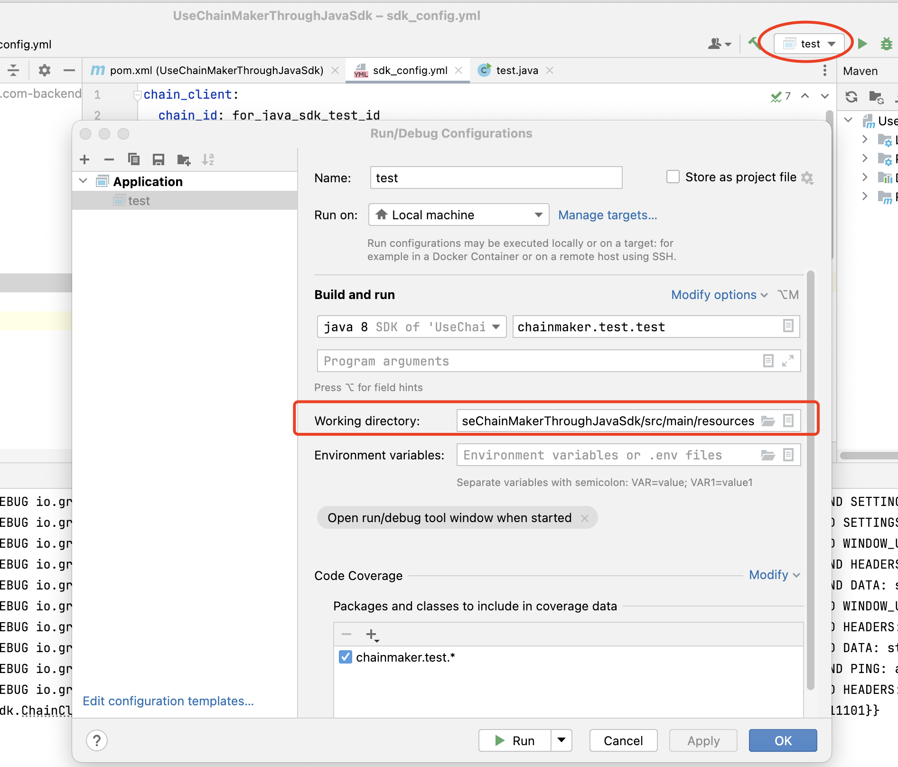

工作目录与sdk_config.yml文件中路径设置保持一致，如管理台中下载的sdk_config.yml文件中路径设置如下：
```yaml
user_key_file_path: ./crypto-config/cmtestorg1/user/user1/user1.tls.key

user_crt_file_path: ./crypto-config/cmtestorg1/user/user1/user1.tls.crt

user_sign_key_file_path: ./crypto-config/cmtestorg1/user/user1/user1.sign.key

user_sign_crt_file_path: ./crypto-config/cmtestorg1/user/user1/user1.sign.crt
```

则工作目录（Working directory）设置到resrouces，如上面截图。

运行，出现下图结果表示执行成功，如下：

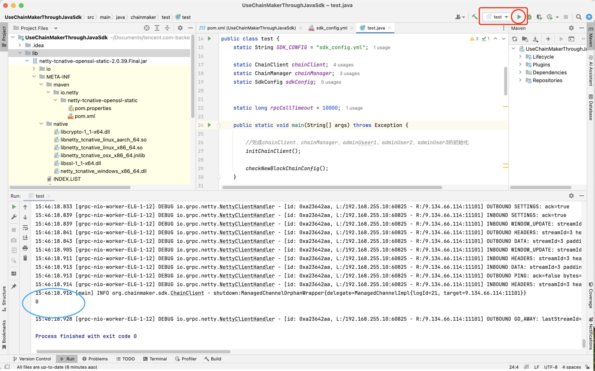

## 使用java-sdk部署/调用合约

### EVM合约部署/调用

#### 部署合约

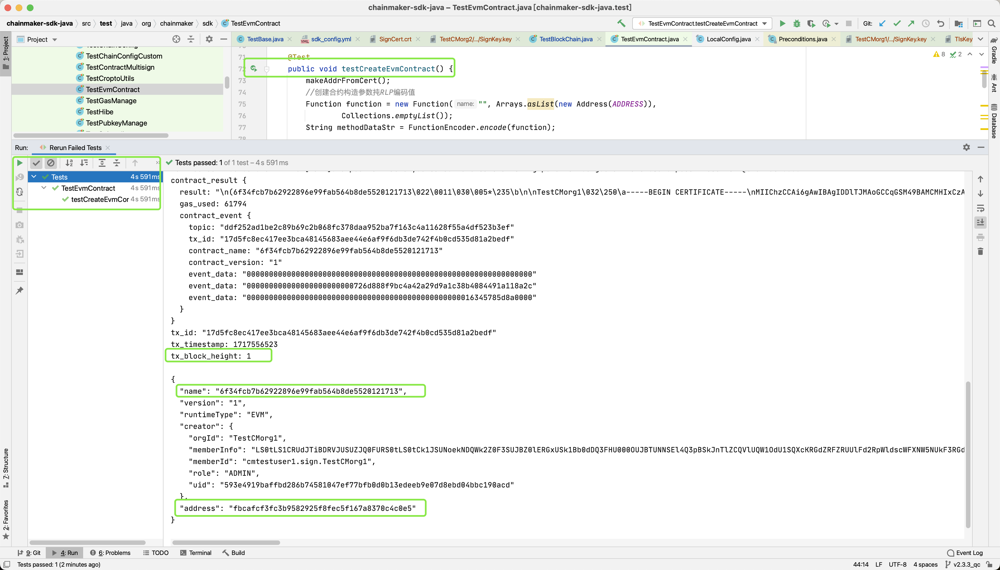

如上图所示，执行成功。

#### 调用合约

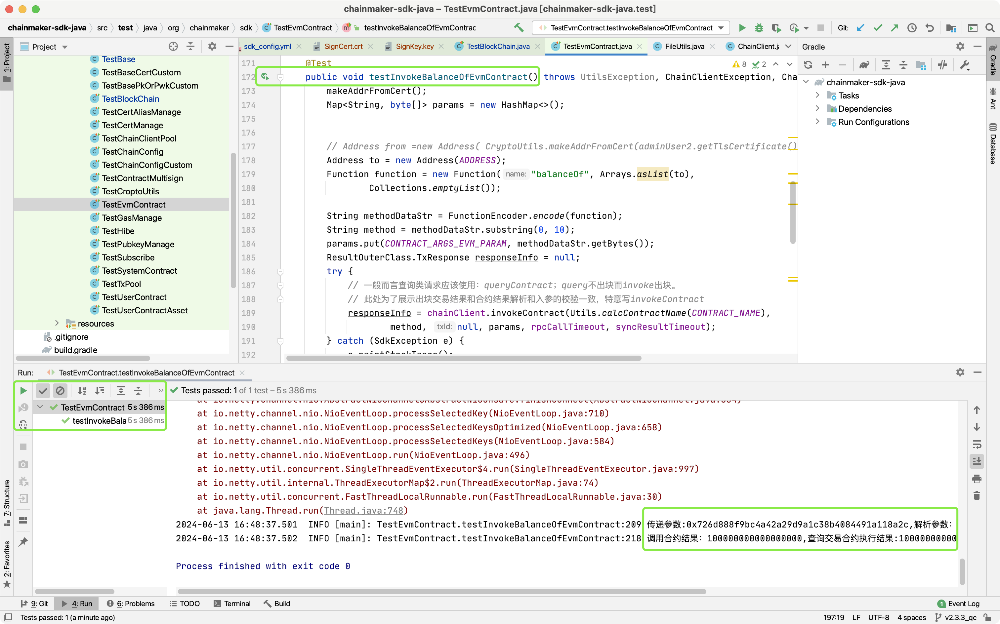

如上图所示，执行成功。

### Go 语言合约部署/调用

#### 部署合约

部署合约过程与部署EVM合约过程基本相同，代码如下：
```java
public void testCreateDockerGoContract() {
        ResultOuterClass.TxResponse responseInfo = null;
        try {
            byte[] byteCode = FileUtils.getResourceFileBytes(GO_CONTRACT_FILE_PATH);
            // 1. create payload
            Request.Payload payload = chainClient.createContractCreatePayload(CONTRACT_NAME,
                    "1", byteCode,
                    ContractOuterClass.RuntimeType.DOCKER_GO, null);

            //2. create payloads with endorsement
            Request.EndorsementEntry[] endorsementEntries = SdkUtils.getEndorsers(
                    payload, new User[]{adminUser1, adminUser2, adminUser3});

            // 3. send request
            responseInfo = chainClient.sendContractManageRequest(
                    payload, endorsementEntries, rpcCallTimeout, syncResultTimeout);
            System.out.println(responseInfo);

            if (responseInfo.getCode() == ResultOuterClass.TxStatusCode.SUCCESS) {
                Contract contract = Contract.newBuilder().mergeFrom(responseInfo.getContractResult().getResult().toByteArray()).build();
                String jsonStr = JsonFormat.printer().print(contract);
                System.out.println(jsonStr);
            }
        } catch (SdkException e) {
            e.printStackTrace();
            Assert.fail(e.getMessage());
        } catch (InvalidProtocolBufferException e) {
            throw new RuntimeException(e);
        }
        Assert.assertNotNull(responseInfo);
    }

```

注意第8行中合约类型为ContractOuterClass.RuntimeType.DOCKER_GO

调用成功，结果如下：

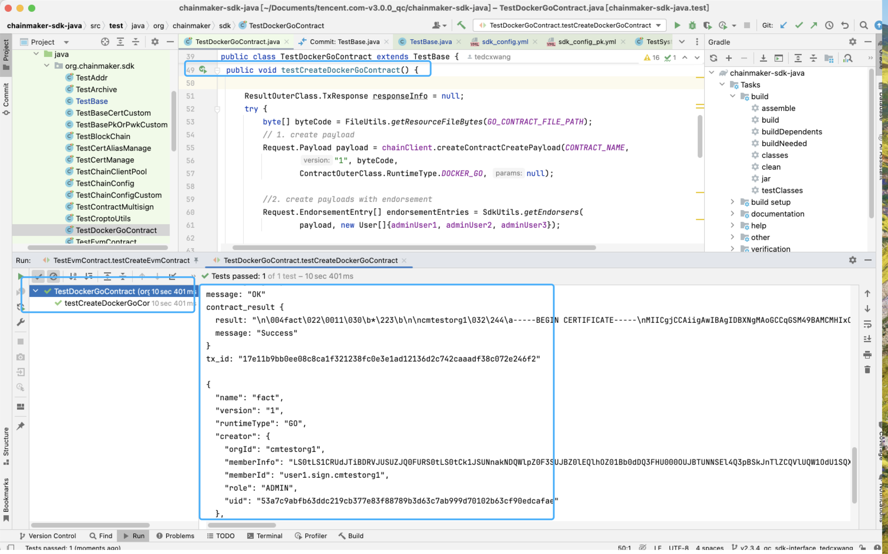

#### 调用合约

调用合约过程与调用EVM合约过程基本相同，代码如下：
```java
public void testInvokeDockerGoContract() throws UtilsException, ChainClientException, ChainMakerCryptoSuiteException {
        Map<String, byte[]> params = new HashMap<>();
        params.put("method", "save".getBytes());
        params.put("time", "time-test".getBytes());
        params.put("file_hash", "hash-test".getBytes());

        ResultOuterClass.TxResponse responseInfo = null;
        try {
            // 一般而言查询类请求应该使用：queryContract；query不出块而invoke出块。
            // 此处为了展示出块交易结果和合约结果解析和入参的校验一致，特意写invokeContract
            responseInfo = chainClient.invokeContract(CONTRACT_NAME,
                    "invoke_contract", null, params, rpcCallTimeout, syncResultTimeout);
        } catch (SdkException e) {
            e.printStackTrace();
            Assert.fail(e.getMessage());
        }
        Assert.assertNotNull(responseInfo);
        //查询本次交易结果
        ChainmakerTransaction.TransactionInfo tx = chainClient.getTxByTxId(responseInfo.getTxId(), rpcCallTimeout);
        logger.info("调用合约结果：{},查询交易合约执行结果:{}", Numeric.toBigInt(responseInfo.getContractResult().getResult().toByteArray()),
                tx.getTransaction());
    }

```

调用成功，结果如下：

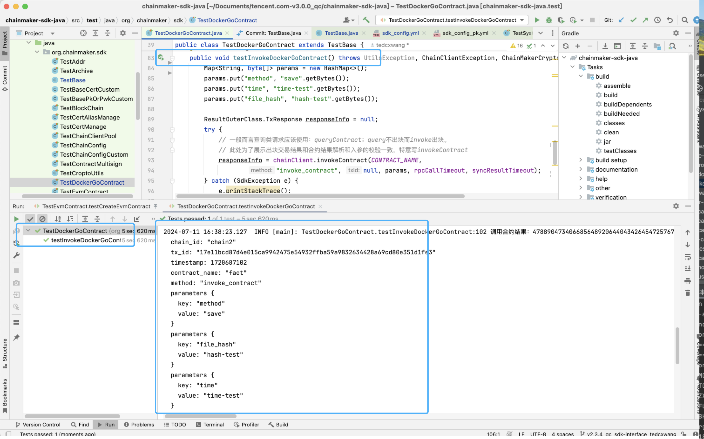

## 常见问题

### 不同版本间配置文件兼容性问题

注意不同版本支持的sdk_config.yml中配置不同，根据错误信息进行修改，如下：

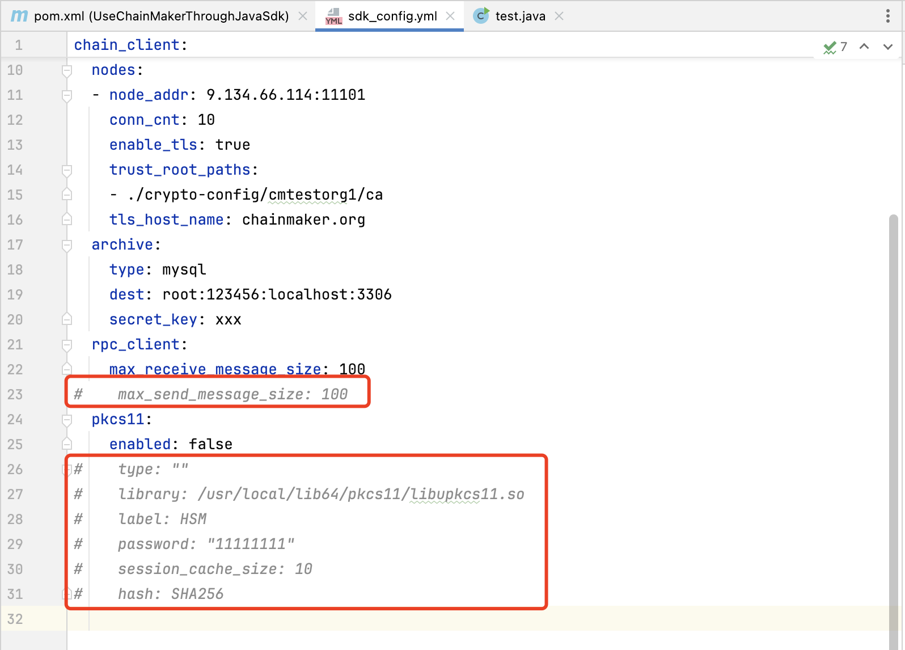

如不进行上面修改，会出现如下错误：

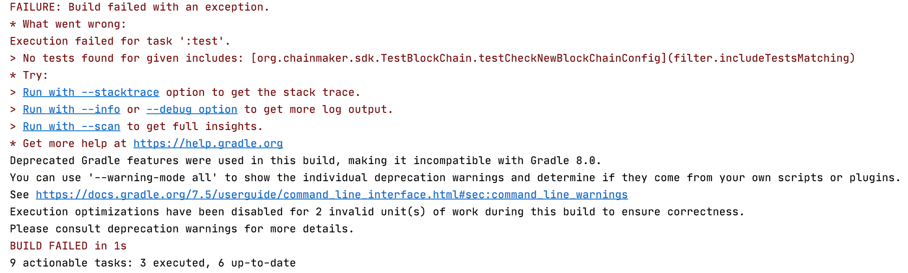

### 配置文件路径错误问题

打开：src/test/java/org.chainmaker.sdk.TestBlockChain，运行testCheckNewBlockChainConfig()会出现如下错误：

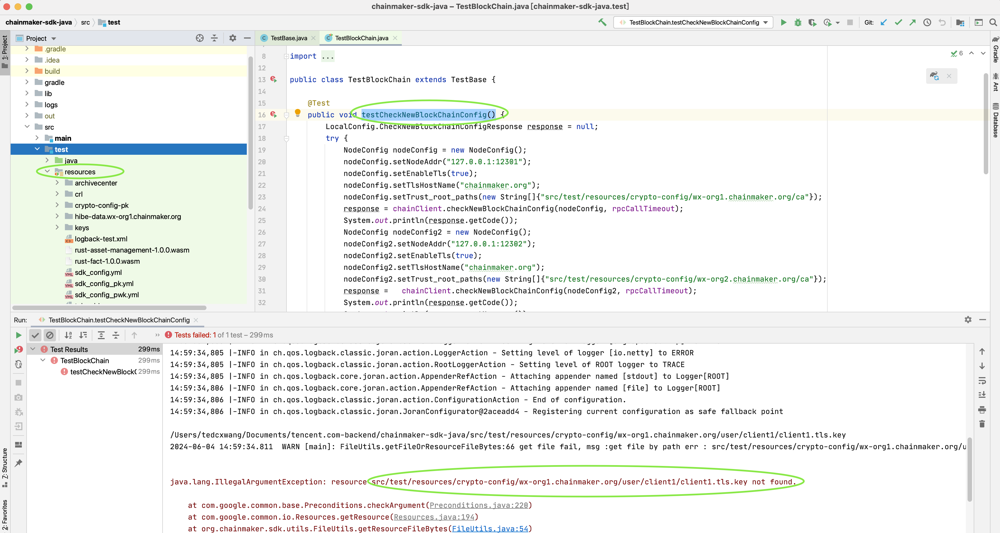

错误原因是没有找到用户相关配置。

### rpc传输大小限制问题

sdk端设置（rpc-client）：

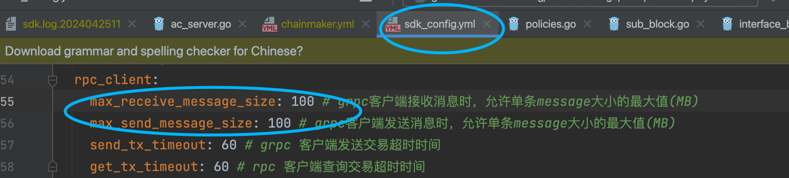

节点端设置（rpc-server）：

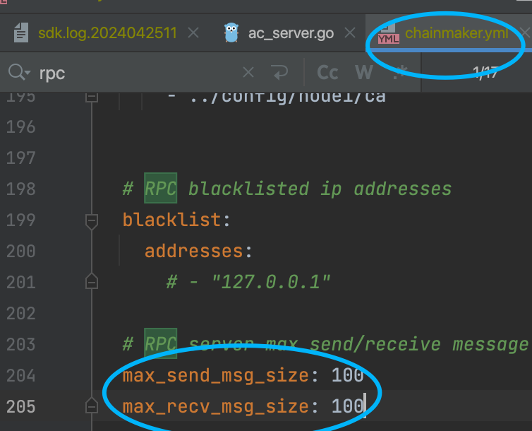

如不进行上述设置，会出现如下问题：
```text
Error: send INVOKE_CONTRAcT failed, client.call failed, rpc error: codeResourceExhausted desc =tryingsend message larger than max(7328680 vs.4194304)
```
