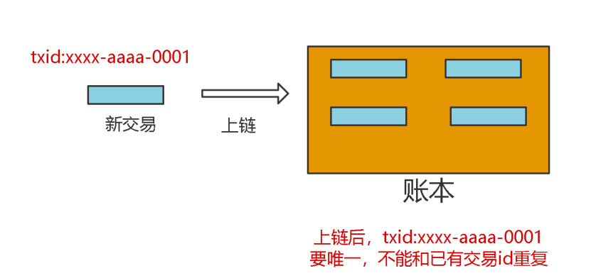
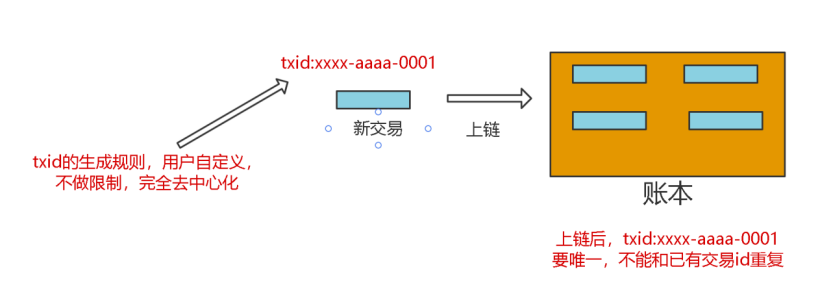
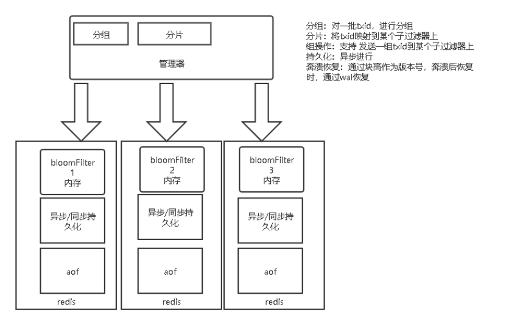
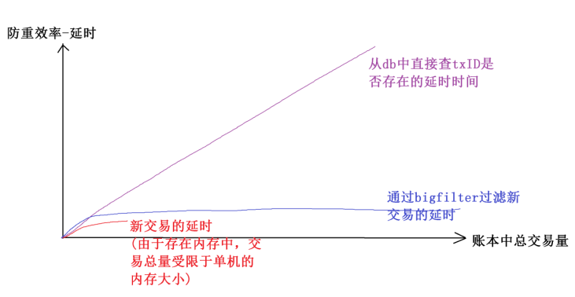

# DB交易防重 

## 背景
区块链账本中新交易都需要一个交易id，交易id必须全局唯一，不能和账本中的已有交易冲突(一样)，因为区块链账本中交易不断增加，所以账本中累积的交易会越来越多。

新交易要存储到账本中，必须要检查新交易的交易id是否在账本中已存在。这个检查我们称之为交易过滤（防重）。对应的数学模型是一个新元素newTxID是否存在集合leadger_txIDs中。数学模型很简单，结合区块链场景，需求是：
1. txID生成规则，必须去中心化，由用户任意生成，不做限制；
2. txID不能重复。
看似很简单的需求，但是实际上是非常难。具体难在哪里呢？

## 难点分析  
- 难点1：要求交易过滤要快。
技术上，验证一个元素是否在一个集合中，最快的是用哈希集合；算法上，时间复杂度O(1)，空间复杂度O(n)建立一个集合Set，每个元素先判断集合中是否存在，做一次哈希运算即可。
但是集合是建立在内存中的，如果几千、几万个txid存在内存中可以接受，但如果是10亿个txid，这个量级过大，内存未必可以存下；更何况，区块链中的交易是只增不减的，集合会越来越大，一定会撑爆内存。
- 难点2：交易数多。
区块链中的交易是只增不减的。如果账本中累积的交易数达到10亿，怎么办？内存中存10亿未必存的下。上面提到，用哈希时间复杂度是O(1)，但空间复杂度是O(n)；10亿个TxID存到内存中，10^9*32B=32GB（假设一个txid由2个uuid，共32Byte）。
- 难点3：单机资源有限。
单机服务器内存有限。如果有50亿、100亿、甚至1000亿的交易，单机肯定存不下，100亿将占用320G内存。
- 难点4：交易不丢失。
交易不能只写到内存中，因为断电会丢失数据，所以需要有持久化功能。

## 技术方案分析  
- 算法上
通过哈希函数将TxID映射到某一个值是不错的选择，同时不能直接使用原字符串txID存储到集合中。

- 存储的效率
如果直接把txid存在内存中，占用空间很大。
换个思路:
通过一个函数，把txid映射到0-n的整型区间段内的某个整数，比如txid->interN；再通过一个函数把interN映射到一个二进制数的某一位bit上；通过上面两步，就可以把一些txid映射到一个二进制数的某一位bit上，这样就相当于可以把一堆txid，存储到了一个二进制数上，判断一个txid是否存在，只要运算两个函数+一次与运算即可，这就是布隆过滤器的原型。
这样，100亿个txid，只需要10^10个bit位，只需要1200MB(大约)存储空间；而直接存需要320000MB，效率对比266倍。

- 节点的扩展
单机的存储空间和计算资源都有限，为了能存更多数据和同时并行的利用更多资源做计算需要再加一个函数，把txid映射到一些服务器中的某个服务器上；同时，要支持批量处理一批txid是否存在，还需要能够做sharding和聚合。

- 持久化
最快的写是WAL。因为机械磁盘寻道时间，包括磁盘旋转+移动磁头，随机读写数据的时间远远大于顺序读写数据的时间。我们如果把txid写在WAL中，是最快的、不丢数据的方案；同时为了更快的过滤，需要用到布隆过滤器，并且bitmap数据应该常驻在内存中。

## 长安链解决方案-bigfilter  
综合以上的背景、问题、难点和技术分析我们设计实现了bigfilter。bigfilter的功能如下：
- 更快过滤新交易。底层用到布隆过滤器，数据存储在内存中，以redis-bloom插件形式使用。
- 支持海量交易。通过一个管理器管理多个redis-bloom节点，完成数据的sharding和聚合。
- 持久化。通过wal把新交易写到log中，同时会在redis中以内存和aof持久化方式存储，做到数据不丢失、崩溃后可自动恢复。
- 批量过滤。支持批量写一批新交易到bigfilter中，也支持批量判断一批新交易是否在bigfilter中并做到并行计算。

## 实现效果  
我们从存储空间、防重稳定性、读写性能、准确率四个维度去评估效果。
存储空间：是指实现交易过滤，使用的内存、磁盘等空间大小的情况。

| 存储对比 | 磁盘 | 内存 | 备注 | 交易数量 |
| ---- | ---- | ---- | ---- | ---- |
| bigfilter | 10GB | 5G | |100亿 |
| leveldb | 500GB || txid直接存 | 100亿 |
| Redis set | >1TB | 1TB | 以set方式存 | 100亿| 

可以看到，bigfilter占用内存和磁盘空间相对是最少的，比直接存储原txid的方式效率是几十倍、甚至百倍的差距。
防重稳定性：是指随着账本中积累的交易数量不断增加，做一次新交易过滤需要花费的时间延迟是否会随着账本中总交易量的增加而显著增加。

可以看到，bigfilter随着交易总量增加，过滤新交易的延迟时间基本不变。而基于db做交易过滤，随着交易总量的增加延迟也不断增加；基于内存的过滤方式，由于受单机内存的限制不能够支持太多的交易量。
读写性能：是指写一些新交易到账本中和过滤一些新交易是否在账本中的延迟情况。

在我们的测试中:
- 在交易id，完全去中心化，不限制生成规则的情况下；
- 在账本中已存在50亿交易的情况下。
读写性能-批量过滤，判断1万个新交易是否在50亿个交易中存在(过滤)需要30ms，平均每个交易3us。
读写性能-批量写，写入1万个交易，需要10ms，平均每个交易1us。
准确率：是指新交易，不在账本中，但经过过滤器中防重计算，有时会被误判为 这个新交易txID在账本中存在，去掉这种误判的情况，得到的交易防重的准确率百分比。
在不同的配置下，表现是不一样的，因为bigfilter是分布式的支持多个节点存储的组件。理论上讲，在总交易量一定的情况下，节点越多，交易过滤的准确率越高。在我们的测试环境中，在50亿总交易量下，可以达到99%的准确率。

## 总结  
测试结果：
- 存储空间。50亿交易,redis aof占用10G。内存占用5G。
- 防重稳定性。基本稳定，具体看图。
- 读写性能-批量过滤。判断1万个新交易是否在50亿个交易中存在(过滤)需要30ms，平均每个交易3us。
- 读写性能-批量写。写入1万个交易，需要10ms。平均每个交易1us。