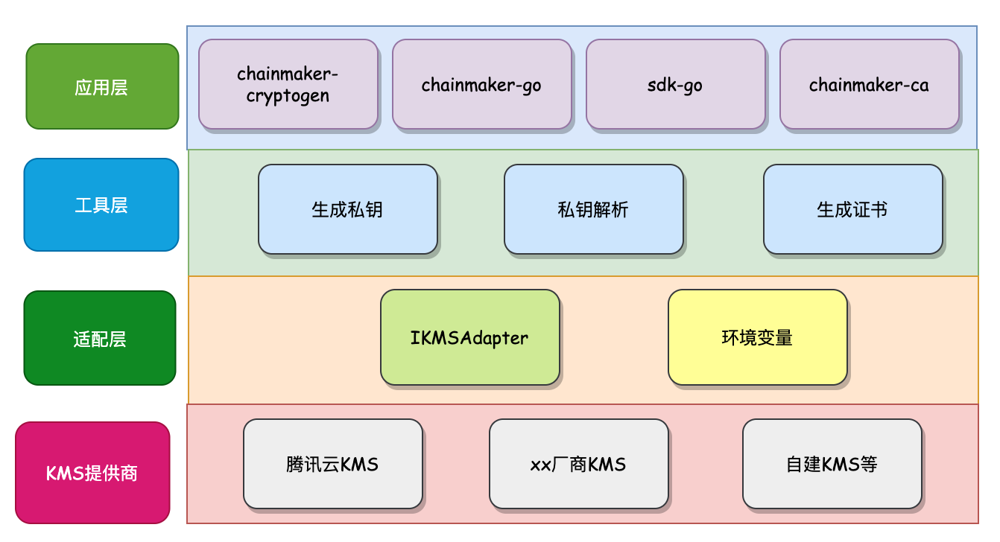

# 密钥管理系统KMS

密钥管理系统KMS(Key Management Service，KMS)是一款密钥管理和数据加密服务平台，功能类似硬件加密机，可以让您轻松创建和安全管理密钥, 符合监管和合规要求。
长安链支持KMS的接入，能够提供更加安全的节点私钥、用户端私钥保护能力。

## 整体设计
为了保证不强制绑定特定厂商KMS，设计上采用KMS插件方式来接入不同厂商的KMS，对上层提供加密、签名以及私钥保护的能力。  

**长安链支持KMS整体设计**：



- KMS提供商：厂商提供，一般通过http协议对外提供密码服务。
- 适配层：提供KMS适配层，用来屏蔽不同厂商KMS实现上的差异，方便接入
- 工具层：为了上层应用方便调用底层密码接口，工具层对KMS密钥结构进行了封装，并提供了封装/解析功能；同时提供了生成数字证书的功能。
- 应用层：长安链在证书生成工具、节点共识投票、交易签名等应用组件上都对KMS进行了支持。


### 适配层
为了支持不同厂商KMS系统，长安链根据上层应用需要的密码功能，设计了一套适配器接口`IKMSAdapter`, 不同厂商KMS实现差异
通过适配器插件的方式封装在适配层，供上层统一调用, 包括KMS连接初始化、密码服务调用等。

IKMSAdapter接口定义如下：
```golang
type IKMSAdapter interface {
	NewPrivateKey(keyId string, keyType string, keyAlias string) (bccrypto.PrivateKey, error)
	NewPublicKey(keyId string) (bccrypto.PublicKey, error)
}
```

长安链默认支持了腾讯云KMS, 不需要单独实现适配器插件，如果要支持其他厂商KMS需要提供适配器插件，并实现`IKMSAdapter`接口，
实现方式可参考长安链gitlab托管的common仓库，默认实现在`common/crypto/kms/default.go`.  

实现以上接口后，通过go工具打包成golang插件，如下：
```shell
go build -buildmode=plugin -o kms_adapter.so kms_adapter.go
```
然后通过环境变量指定该适配器插件，如下：
```shell
export KMS_ADAPTER_LIB= ./kms_adapter.go #路径根据实际情况指定
```

### 工具层
工具层主要用来生成和解析KMS私钥，并生成测试证书等。

**KMS私钥结构**  
长安链共识节点私钥、客户端私钥可以通过KMS控制台生成，在长安链使用过程中，使用json形式表示私钥，结构如下：
```shell
$ cat crypto-config/wx-org1.chainmaker.org/node/consensus1/consensus1.sign.key | jq
{
  "key_id": "4ad75e10-5ead-11eb-a04f-5254009cd9d4",
  "key_type": "SM2DSA",
  "key_alias": ""
}
```
其中，`key_id`表示密钥唯一id，`key_type`表示密钥类型（如在腾讯云KMS平台上，国密sm2的密钥类型为SM2DSA），`key_alias`为
密钥别名（可选）。  

**KMS私钥生成和解析**
```golang
// CreateKMSKey - create kms private key
func CreateKMSKey(keyType, keyId, keyAlias string, extParams map[string]string) ([]byte, crypto.PrivateKey, error) {
	privKey, err = kms.GetKMSAdapter().NewPrivateKey(keyId, keyType, keyAlias)
	if err != nil {
		return nil, nil, errors.WithMessagef(err, "failed to get kms private key, "+
			"keyId = %s, keyType = %s, keyAlias = %s", keyId, keyType, keyAlias)
	}

	keySpec := &kmsKeySpec{
		KeyType:  keyType,
		KeyId:    keyId,
		KeyAlias: keyAlias,
	}
	keySpecJson, _ := json.Marshal(keySpec)

	return keySpecJson, privKey, nil
}

// ParseKMSPrivKey parse a kms private key
func ParseKMSPrivKey(keySpecJson []byte) (crypto.PrivateKey, error) {
	var keySpec kmsKeySpec
	if err := json.Unmarshal(keySpecJson, &keySpec); err != nil {
		return nil, errors.WithMessage(err, "failed to parse kms keySpec")
	}
	return kms.GetKMSAdapter().NewPrivateKey(keySpec.KeyId, keySpec.KeyType, keySpec.KeyAlias)
}
```

### 应用层

```golang
//签名
keySpec, _ := ioutil.ReadFile(userKeyPath)
sk, _ := ParseKMSPrivKey(keySpec)
sig, _ := sk.SignWithOpts([]byte(msg), nil)

//验签， cert为解析x509证书文件得到
ok, _ := cert.PublicKey.VerifyWithOpts(msg, sig, nil)
```

## 长安链KMS配置
**长安链配置**

在`chainmaker-go/config/config_tpl/chainmaker.tpl`配置模板中node配置项下开启kms配置
```shell
...
node:
  # 节点类型：full、spv
  type:              full
  org_id:            {org_id}
  priv_key_file:     ../config/{org_path}/certs/{node_cert_path}.key
  cert_file:         ../config/{org_path}/certs/{node_cert_path}.crt
  signer_cache_size: 1000
  cert_cache_size:   1000
  pkcs11:
    enabled: false
    library: # path to the so file of pkcs11 interface
    label: # label for the slot to be used
    password: # password to logon the HSM
    session_cache_size: 10 # size of HSM session cache, default to 10
    hash: "SHA256" # hash algorithm used to compute SKI
  kms:
    enabled: true            # kms enable flag, set true if use kms
    is_public: true           # private cloud kms or public cloud kms, set true if use public kms
    secret_id: "AKIDW*****9RVUF"             # cloud kms SecretId
    secret_key: "b0DSa*****LCsHQ"            # cloud kms SecretKey
    address: "kms.tencentcloudapi.com" # kms server address, ip or dns
    region: "ap-beijing"    # kms server region
    sdk_scheme: "https"       # kms sdk scheme, http or https
    ext_params: ""            # optional，this is a map string, like "".
 ...
 
```

chainmaker-cryptogen需要在
`config/hsm_keys.yml`内配置KMS测试密钥，如下：
```shell
$ cat chainmaker-cryptogen/config/hsm_keys.yml

hsm_keys:
  - wx-org1.chainmaker.org:
      ca:
        - e2920cd5-5a02-11eb-840b-525400e8e6ea,SM2DSA,
      node:
        consensus:
          - 4ad75e10-5ead-11eb-a04f-5254009cd9d4,SM2DSA,
        common:
          - 4ad75e10-5ead-11eb-a04f-5254009cd9d4,SM2DSA,
      user:
        admin:
          - 4a296f1a-5ead-11eb-8768-525400ce83fb,SM2DSA,
        client:
          - 4a5ebd1d-5ead-11eb-840b-525400e8e6ea,SM2DSA,
        light:
          - 4a5ebd1d-5ead-11eb-840b-525400e8e6ea,SM2DSA,
  - wx-org2.chainmaker.org:
      ca:
        - c4c263c2-5d9c-11eb-8768-525400ce83fb,SM2DSA,
      node:
        consensus:
          - c4e8faa1-5d9c-11eb-b9b1-525400d9da05,SM2DSA,
        common:
          - c4e8faa1-5d9c-11eb-b9b1-525400d9da05,SM2DSA,
      user:
        admin:
          - c50e9d19-5d9c-11eb-840b-525400e8e6ea,SM2DSA,
        client:
          - c5330fdf-5d9c-11eb-8787-52540018dc09,SM2DSA,
        light:
          - c5330fdf-5d9c-11eb-8787-52540018dc09,SM2DSA,
  - wx-org3.chainmaker.org:
      ca:
        - d71bbbf9-5d98-11eb-8768-525400ce83fb,SM2DSA,
      node:
        consensus:
          - d770a3e9-5d98-11eb-a04f-5254009cd9d4,SM2DSA,
        common:
          - d770a3e9-5d98-11eb-a04f-5254009cd9d4,SM2DSA,
      user:
        admin:
          - d6f5c969-5d98-11eb-840b-525400e8e6ea,SM2DSA,
        client:
          - 3fd1cfad-5d68-11eb-8787-52540018dc09,SM2DSA,
        light:
          - 3fd1cfad-5d68-11eb-8787-52540018dc09,SM2DSA,
  - wx-org4.chainmaker.org:
      ca:
        - e9570909-5d65-11eb-840b-525400e8e6ea,SM2DSA,
      node:
        consensus:
          - e971f0e9-5d65-11eb-840b-525400e8e6ea,SM2DSA,
        common:
          - e9570909-5d65-11eb-840b-525400e8e6ea,SM2DSA,
      user:
        admin:
          - 2efc1a70-5d64-11eb-8768-525400ce83fb,SM2DSA,
        client:
          - dd1bfef9-5d62-11eb-b9b1-525400d9da05,SM2DSA,
        light:
          - 2efc1a70-5d64-11eb-8768-525400ce83fb,SM2DSA,
```

在chainmaker-crptogen中开启kms
```shell
$ vim config/crypto_config_template.yml

crypto_config:
  - domain: chainmaker.org
    host_name: wx-org
    count: 4                # 如果为1，直接使用host_name，否则添加递增编号
    pk_algo: sm2
    ski_hash: sm3
    kms:
      enabled: true            # kms enable flag, set true if use kms
      is_public: true           # private cloud kms or public cloud kms, set true if use public kms
      secret_id: "AKIDW*****9RVUF"             # cloud kms SecretId
      secret_key: "b0DSa*****LCsHQ"            # cloud kms SecretKey
      address: "kms.tencentcloudapi.com" # kms server address, ip or dns
      region: "ap-beijing"    # kms server region
      sdk_scheme: "https"       # kms sdk scheme, http or https
      ext_params: ""            # optional，this is a map string, like "".

...
```
生成配置
```shell
cd chainmaker-go/scripts && ./prepare.sh 4 1
```
打包
```shell
./build_release.sh
```
sdk_config.yml中开启kms
```shell
chain_client:
  # 链ID
  chain_id: "chain1"
  # 组织ID
  org_id: "wx-org1.chainmaker.org"
  # 客户端用户私钥路径
...

  kms:
    enabled: true            # kms enable flag, set true if use kms
    is_public: true           # private cloud kms or public cloud kms, set true if use public kms
    secret_id: "AKIDW*****9RVUF"             # cloud kms SecretId
    secret_key: "b0DSa*****LCsHQ"            # cloud kms SecretKey
    address: "kms.tencentcloudapi.com" # kms server address, ip or dns
    region: "ap-beijing"    # kms server region
    sdk_scheme: "https"       # kms sdk scheme, http or https
    ext_params: ""            # optional，this is a map string, like "".

  nodes:
    - # 节点地址，格式为：IP:端口:连接数
      node_addr: "127.0.0.1:12301"
      # 节点连接数
      conn_cnt: 10
...

```

pk模式下的配置修改：

chainmaker-cryptogen中配置KMS密钥
```shell
$ cat config/hsm_keys_pk.yml

hsm_keys:
  node1:
    consensus:
      - "8b2b9607-691a-11ef-adff-562333b38071,SM2DSA,"
    user:
      admin:
        - "af404797-691a-11ef-8467-52540006abbe,SM2DSA,"
      client:
        - "af404797-691a-11ef-8467-52540006abbe,SM2DSA,"
  node2:
    consensus:
      - "908c2109-691a-11ef-b1f0-5254003cca81,SM2DSA,"
    user:
      admin:
        - "dad6f5e2-691a-11ef-a5d2-52540024cbd7,SM2DSA,"
      client:
        - "dad6f5e2-691a-11ef-a5d2-52540024cbd7,SM2DSA,"
  node3:
    consensus:
      - "967f0622-691a-11ef-a5d2-52540024cbd7,SM2DSA,"
    user:
      admin:
        - "e1e216d8-691a-11ef-b1f0-5254003cca81,SM2DSA,"
      client:
        - "e1e216d8-691a-11ef-b1f0-5254003cca81,SM2DSA,"
  node4:
    consensus:
      - "9dd896ad-691a-11ef-9f67-525400c86b9d,SM2DSA,"
    user:
      admin:
        - "e7c3c3fe-691a-11ef-8467-52540006abbe,SM2DSA,"
      client:
        - "e7c3c3fe-691a-11ef-8467-52540006abbe,SM2DSA,"
 
```
chainmaker-cryptogen开启kms
```shell
$ cat config/pk_config_template.yml

pk_config:
    pk_algo: sm2
    hash_algo: sm3
    #pkcs11配置
    pkcs11:
      enabled: false
      library: /usr/local/lib64/pkcs11/libupkcs11.so
      label: HSM
      password: 11111111
      session_cache_size: 10
      hash: "SHA256" # hash algorithm used to compute SKI
    kms:
      enabled: true            # kms enable flag, set true if use kms
      is_public: true           # private cloud kms or public cloud kms, set true if use public kms
      secret_id: "AKIDWu*****9RVUF"             # cloud kms SecretId
      secret_key: "b0DSa*****LCsHQ"            # cloud kms SecretKey
      address: "kms.tencentcloudapi.com" # kms server address, ip or dns
      region: "ap-beijing"    # kms server region
      sdk_scheme: "https"       # kms sdk scheme, http or https
      ext_params: ""            # optional，this is a map string, like "".
    # Admin配置
    admin:
      count: 4
    # 节点证书配置
    node:
      - count: 4
    user:
      - type: client
        # 普通用户证书数量
        count: 1

```

chainmaker-go开启kms
```shell
$ cat chainmaker-go/config/config_tpl_pk/chainmaker.tpl

...
# Blockchain node settings
node:
  # Private key file path
  priv_key_file: ../config/{org_path}/{node_pk_path}.key  # [*]

  # Certificate cache size, used to speed up member identity verification.
  # By default the cache size is 1000.
  cert_cache_size:   1000

  # fast sync settings
  fast_sync:
    # Enable it or not, true means do not execute smart contract
    enabled: true  # [*]
    # KMS settings
  kms:
    # Enable it or not
    enabled: true

    # Public cloud or private cloud
    is_public: true

    # KMS SecretId
    secret_id: "AKIDWu*****9RVUF"

    # KMS SecretKey
    secret_key: "b0DSa*****LCsHQ"

    # KMS server address, ip or dns
    address: "kms.tencentcloudapi.com"

    # KMS server region
    region: "ap-beijing"

    # KMS sdk scheme, http or https
    sdk_scheme: "https"

    # Optional settings，style "{k1:v1, k2:v2}".
    ext_params: ""
   ...
```


**适配器插件配置**  
参考- [ChainMaker - KMS适配层](./KMS.html#适配层)  
注：如果使用腾讯云KMS，则无需配置kms适配器。

