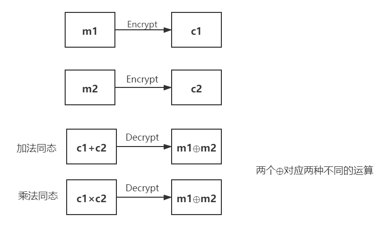
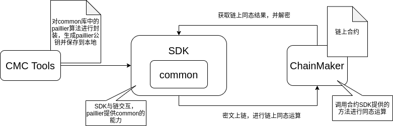
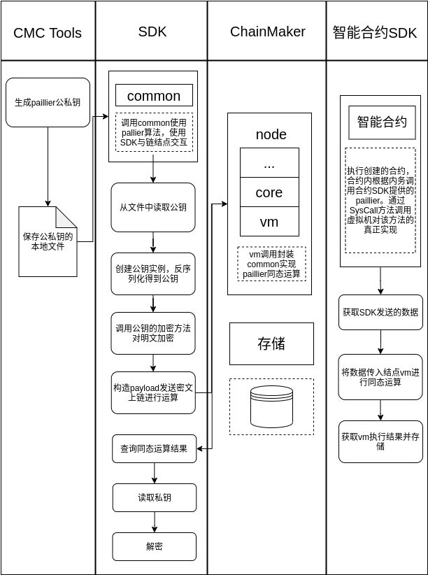

长安链同态加密方案设计文档
==========================

背景
----

需求
~~~~

需求概述
^^^^^^^^

在互联网技术不断成熟完善的今天，为了保护用户隐私，数据往往以密文的形式在计算机内进行存储。但是，密文形式的数据难以计算、处理的特性从某种程度上来说限制了诸如云计算、匿名投票等许多应用。同态加密作为解决该问题的有效手段得到了迅速的发展。同态加密除了能实现传统的数据加密之外，还可以保证密文操作与明文操作对应，从根本上解决了加密数据不可操作性的问题。Paillier
算法就是一种具有良好同态特性的加密算法，在需要密文加法计算、密文明文乘法计算的场合极具竞争力。总而言之，同态加密提供了一种对加密数据进行处理的功能，任何人都可以对加密数据进行运算，运算过程不中不会泄露任何原始内容。同时，拥有密钥的用户对处理过的数据进行解密后，得到的正好是运算后的结果。

具体场景
^^^^^^^^

-  结合区块链中的智能合约和同态加密技术，在个人征信隐私保护中，利用同态加密，设置访问权限，在不暴露个人明文信息的同时，创建与之相匹配的合约，但征信系统无法得知访问用户的需求。

-  强调隐私的业务，例如机构之间转账，隐藏账户余额，将用户账户余额进行加密后，通过密文之间的加减计算，进行隐秘的转账。

Paillier加密算法
~~~~~~~~~~~~~~~~

Paillier算法概述
^^^^^^^^^^^^^^^^

Paillier算法是公钥加密体系的一个代表算法。但是，不同于传统的公钥加密算法，Paillier
算法除了实现对数据的公钥加密，还能保证在密文上直接进行加法操作，其结果解密后与在明文上进行操作的结果一样，因此Paillier算法完全的满足密文的加法同态性。除此之外，Paillier算法还支持明文和密文的乘法操作，具有良好的同态性，相比于当前的其他同态加密更加实用。

算法流程
''''''''

Paillier加密算法定义与一般公钥加密相同，主要由以下三个部分组成：

-  :math:`\mathsf{KeyGen}(\lambda) \rightarrow (pk, sk)`\ ：密钥生成算法，由KGA运行，输入为安全参数\ :math:`\lambda`\ ，输出为一对公钥私钥对\ :math:`(pk,sk)`\ 。
-  :math:`\mathsf{Encrypt}(m,pk) \rightarrow CT`\ ：加密算法，由加密方运行，输入为用户公钥\ :math:`pk`\ ，明文空间的任一消息\ :math:`m`\ ，输出对应密文
   :math:`CT`\ 。
-  :math:`\mathsf{Decrypt}(sk,CT) \rightarrow m`\ ：解密算法，由解密方运行，输入为解密私钥\ :math:`sk`\ ，密文\ :math:`CT`\ ，输出对应明文\ :math:`m`\ 。

同态性质
''''''''

​
同态加密是指这样一种加密函数，对明文进行环上的加法和乘法运算再加密，与加密后对密文进行相应的运算，结果是等价的。由于这个良好的性质，人们可以委托第三方对数据进行处理而不泄露信息。具有同态性质的加密函数是指两个明文\ :math:`a、b`\ 满足\ :math:`Dec(En(a)⊙En(b))=a⊕b`\ 的加密函数。其中\ :math:`En`\ 是加密运算，\ :math:`Dec`\ 是解密运算，\ :math:`⊙、⊕`\ 分别对应明文和密文域上的运算。当\ :math:`⊕`\ 代表加法时，称该加密为加同态加密：当\ :math:`⊕`\ 代表乘法时，称该加密为乘同态加密。

对于Paillier算法明文空间里的明文\ :math:`m_1, m_2`\ ，Paillier加密算法具有如下同态性。

-  加法同态性

:math:`\mathsf{Encrypt}(m_1)*\mathsf{Encrypt}(m_2) = \mathsf{Encrypt}(m_1+m_2)`
;

即，\ :math:`m_1 + m_2 = \mathsf{Decrypt}(\mathsf{Encrypt}(m_1)*\mathsf{Encrypt}(m_2))`
。

-  明文和密文乘法同态性

:math:`\mathsf{Encrypt}(m_1)^{m_2} = \mathsf{Encrypt}(m_1*m_2)`
;

即，\ :math:`m_1 * m_2 = \mathsf{Decrypt}(\mathsf{Encrypt}(m_1)^{m_2})`
。

安全性分析
''''''''''

分析Paillier算法的加密过程，不难发现。Paillier算法，每次加密都随机选择一个随机数，这会导致同一明文两次加密会产生不同密文，这给选择明文攻击带来了不小的难度，提高了加密方案的安全性。加密算法对于保护数据安全性具有非常重要的价值，但计算复杂度也会随着算法安全性的提高而增加。

Pailier算法研究现状
^^^^^^^^^^^^^^^^^^^

研究进展
''''''''

Paillier\ `1 <#refer1>`__\ 在1999年提出了一种新的同态加密算法，即Paillier加密算法，由于Paillier算法可以进行有效的加法同态，受到了广泛的关注。2001 年，Damgard 和 Jurik
`2 <#refer2>`__ 使用模\ :math:`n^i`\ 进一步对 Paillier加密体制进行了推广，并对其应用进一步推广。 Choi等人\ `3 <#refer3>`__\ 通过选取特殊的参数\ :math:`g`，\ :math:`(g^λ =1+ n\mod n^2，λ = lcm( p −1,q −1))`\ 改进了 Paillier加密体制。 但是Choi 等提出的变体方案不能抵抗选择密文攻击。在2006
年的欧密会上，Schoenmakers和Tuyls `4 <#refer4>`__\ 将\ :math:`x∈Z_n`\ 的Paillier 加密方案，扩展到了对\ :math:`x`\ 进行逐比特加密的Pailier加密方案。2013
年的欧密会上，Joye 和Libert `5 <#refer5>`__
利用\ :math:`2^k`\ 阶剩余问题进一步对Paillier 加密方案进行了推广。在2014年的亚密会上，Catalano `6 <#refer6>`__\ 等等人则是提出了支持Paillier加密实例的外包密文的公开可验证授权计算方案。Castagnos Laguilaumie
`7 <#refer7>`__\ 在2015年设计了一种线性同态加密方案，其安全性依赖于判定Diffie-Hellman困难问题。

同态算法对比
''''''''''''

同态加密更具其同态完备性不同可以分为全同态和部分同态，所谓全同态就是指加密方案支持乘法和加法同态，部分同态则是指其只满足加法或者乘法同态。Paillier就是具备良好的加法同态的部分同态加密算法，除了Paillier之外，还有支持乘法同态的RSA和EIGamal算法，以及支持比特异或同态的Goldwasser
Micali算法。下表1对目前经典的三种同态加密方案从计算复杂度、安全性、同态性三个方面进行了对比。

​ 表1 经典同态算法对比

+----------------+--------------+------------------------+----------+--------------------------+
| 同态加密算法   | 计算复杂度   | 原理                   | 安全性   | 同态性                   |
+================+==============+========================+==========+==========================+
| Paillier算法   | 较低         | 判断复合剩余类困难性   | 强       | 加法同态、明文乘法同态   |
+----------------+--------------+------------------------+----------+--------------------------+
| RSA 算法       | 较低         | 分解大素数             | 较弱     | 乘法同态                 |
+----------------+--------------+------------------------+----------+--------------------------+
| Gentry 算法    | 高           | 离散子集求和问题       | 强       | 加法同态，乘法同态       |
+----------------+--------------+------------------------+----------+--------------------------+

采用的paillier同态加密算法
~~~~~~~~~~~~~~~~~~~~~~~~~~

基本概念
^^^^^^^^

​
:math:`Paillier`\ 加密系统是一种加法同态公钥加密系统，这种加密技术已广泛应用于加密信号处理或第三方数据处理领域。其同态特性表现为:在加密后可直接对密文进行相应的算术运算，其运算结果与明文域中对应的运算结果一致。其概率特性表现为:对于相同的明文，可通过不同的加密过程得到不同的密文，从而保证了密文的语义安全。

前提假设​：
^^^^^^^^^^^

1. 随机选择两个大质数p、q满足\ :math:`gcd(pq, (p-1)*(q-1))`\ ​。
2. :math:`计算n=p*q`
3. :math:`g = n+1`
4. :math:`λ = φ(n) = (p-1)*(q-1)`
5. 定义\ :math:`L(x) = (x-1) / n`
6. :math:`μ = φ(n)^{-1} (mod{n})`
7. 公钥为\ :math:`(n，g)`
8. 私钥为\ :math:`(λ，μ)`

算法构造：
^^^^^^^^^^

Encryption
^^^^^^^^^^

1. 设\ :math:`m`\ 为要加密的消息，显然需要满足，\ :math:`0  \leq  m < n`
2. 选择随机 :math:`r`\ ，保证\ :math:`gcd(r, n) = 1`
3. 密文\ :math:`c`\ ：\ :math:`c = (g^m) *(r^n) mod n^2`

Decryption
^^^^^^^^^^

1. :math:`m = ( L( c^λ mod n^2 ) * μ ) mod n`

简化的证明过程：

由 :math:`L(c^λ (mod{n^2}) * μ)  (mod{n})`

有 :math:`L(g^{mλ}*r^{nλ} pmod{n^2}*μ) (mod{n})` ①

其中\ :math:`λ = (p-1)*(q-1)， μ = φ(n)^{-1} pmod{n}`

∵\ :math:`r^{nλ} = r^{n(p-1)*(q-1)} = r^{φ(n^2)}`

由欧拉定理：\ :math:`r^{φ(n^2)}\equiv1(mod{n^2})`

①式 => :math:`L(g^{mλ} pmod{n^2}*μ) pmod{n}` ②

∵\ :math:`g = n+1`

∴\ :math:`g^{mλ} = (1+n)^{mλ} \equiv nλ+1 (mod{n^2})`

②式=> :math:`L((nmλ+1)*μ) mod{n}`

=> :math:`\frac{(nmλ+1)-1}{n}*μ (mod{n})`

=>\ :math:`(mλ*μ) (mod{n})` ③

∵\ :math:`λ = φ(n)，μ = φ(n)^{-1} (mod{n})`

∴③式： :math:`(mλ*μ) \equiv m (mod{n})`

证毕

同态加法
^^^^^^^^

两个密文的乘积解密为明文之和

:math:`D\left(E\left(m_{1}, r_{1}\right) \cdot E\left(m_{2}, r_{2}\right) \bmod n^{2}\right)=m_{1}+m_{2} \bmod n`

证明

:math:`\begin{array}{l}D\left(E\left(m_{1}, r_{1}\right) \cdot E\left(m_{2}, r_{2}\right) \bmod n^{2}\right)=D\left(g^{m_{1}} \cdot r_{1}^{n} \cdot g^{m_{2}} \cdot r_{2}^{n}\right) \bmod n^{2}=D\left(g^{m_{1}+m_{2}} \cdot\left(r_{1} r_{2}\right)^{n}\right) \bmod n^{2}=m_{1}+m_{2}\end{array}`

同态数乘
^^^^^^^^

密文的明文次幂解密为明文的数乘

:math:`D\left(E\left(m_{1}, r_{1}\right)^{k} \bmod n^{2}\right)=k m_{1} \bmod n`

证明：

:math:`D\left(E\left(m_{1}, r_{1}\right)^{k} \bmod n^{2}\right)=D\left(\left(g^{m_{1}} \cdot r_{1}^{n}\right)^{k}\right) \bmod n^{2}=D\left(g^{k m_{1}} \cdot r_{1}^{k} n\right) \bmod n^{2}=k m_{1} \bmod n`

方案描述
--------

整体架构
~~~~~~~~

执行流程
~~~~~~~~

参考
----

.. raw:: html

   

.. raw:: html

   

[1] Paillier P. Public-Key Cryptosystems Based on Composite Degree
Residuosity Classes[J]. Lecture Notes in Computer Science, 1999,
547(1):223-238.

.. raw:: html

   

.. raw:: html

   

[2] Damgård I, Jurik M. A Generalisation, a Simplication and Some
Applications of Paillier's Probabilistic Public-Key System[J]. Lecture
Notes in Computer Science, 2001, 7(45):119-136.

.. raw:: html

   

.. raw:: html

   

[3] Choi D H, Choi S, Won D. Improvement of Probabilistic Public Key
Cryptosystems Using Discrete Logarithm[C]. International Conference
Seoul on Information Security and Cryptology. Springer-Verlag,
2001:72-80.

.. raw:: html

   

.. raw:: html

   

[4] Schoenmakers B, Tuyls P. Efficient Binary Conversion for Paillier
Encrypted Values[C]. Advances in Cryptology - EUROCRYPT 2006:522-537.

.. raw:: html

   

.. raw:: html

   

[5] Joye M, Libert B. Efficient Cryptosystems from 2k-th Power Residue
Symbols[M]. Advances in Cryptology – EUROCRYPT 2013. Springer Berlin
Heidelberg, 2013:651-4.

.. raw:: html

   

.. raw:: html

   

[6] Catalano D, Marcedone A, Puglisi O. Authenticating Computation on
Groups: New Homomorphic Primitives and Applications [M]. Advances in
Cryptology – ASIACRYPT 2014. 193-212.

.. raw:: html

   

.. raw:: html

   

[7] Castagnos G, Laguillaumie F. Linearly Homomorphic Encryption from
DDH [M]// Topics in Cryptology –- CT-RSA 2015. Springer International
Publishing, 2015:487-505.-
