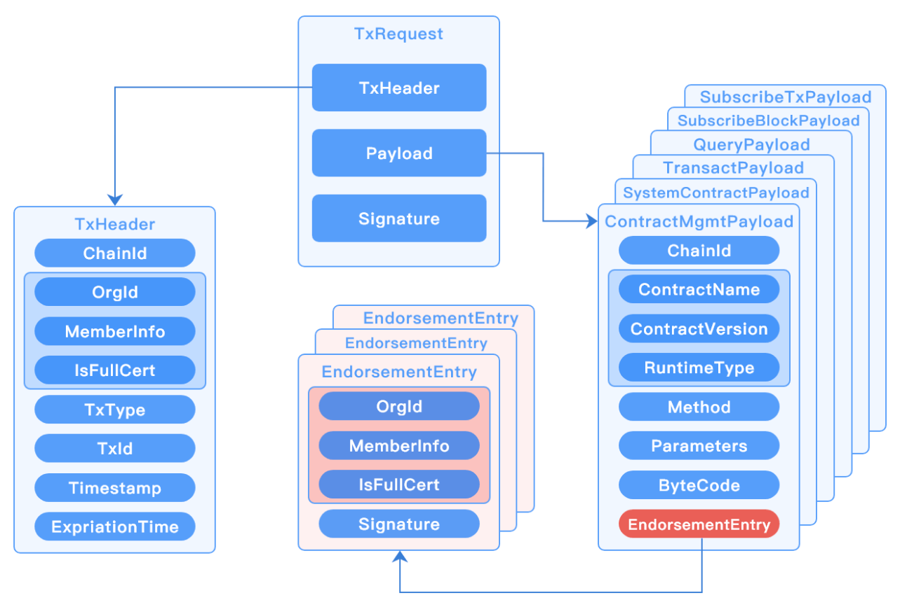
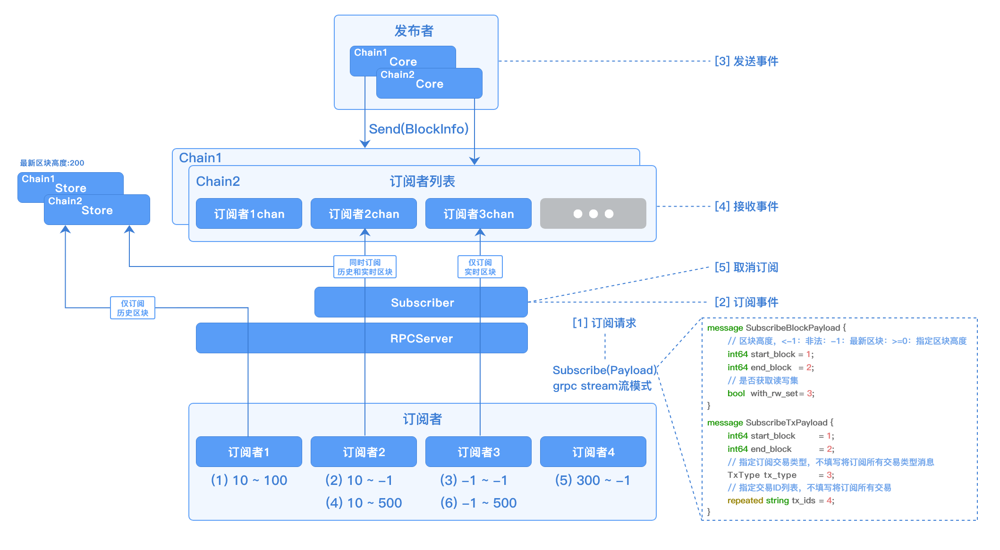

# RPC服务

## 概述

`RPCServer`采用`gRPC`实现的远程过程调用系统，采用`HTTP/2` 传输协议，使用`Protobuf` 作为接口描述语言，实现系统间的高效交互。

功能上支持处理节点请求、基于流模式的消息订阅，通信上支持`TLS`单向和双向认证、流控机制等。

## 配置说明

```yml
rpc:
  # 模式，当前仅支持grpc方式
  provider: grpc
  # 监听端口
  port: 12301
  # 检查链配置TrustRoots证书变化时间间隔，实现自动刷新，单位：s，最小值为10s
  check_chain_conf_trust_roots_change_interval: 60
  # 流量控制配置，采用令牌桶限流
  ratelimit:
    # rpc接口限速功能开关
    enabled: true
    # 限速类型：0-全局限速；1-基于来源IP限速
    type: 0
    # 每秒补充令牌数，取值：-1-不受限；0-默认值（10000）
    token_per_second: -1
    # 令牌桶大小，取值：-1-不受限；0-默认值（10000）
    token_bucket_size: -1
  subscriber:
    # 历史消息订阅流控，实时消息订阅不会进行流控
    ratelimit:
      # 每秒补充令牌数，取值：-1-不受限；0-默认值（1000）
      token_per_second: 100
      # 令牌桶大小，取值：-1-不受限；0-默认值（1000）
      token_bucket_size: 100
  tls:
    # TLS模式:
    #   disable - 不启用TLS
    #   oneway  - 单向认证
    #   twoway  - 双向认证
    mode:           twoway
    priv_key_file:  ./certs/node/consensus1/consensus1.tls.key
    cert_file:      ./certs/node/consensus1/consensus1.tls.crt
  blacklist:            
    addresses:          
      # IP黑名单地址填写于此，若没有请为空
      #- "127.0.0.1"
```

## 接口定义

```protobuf
service RpcNode {
	// 交易消息请求处理
	rpc SendRequest(common.TxRequest) returns (common.TxResponse) {};

	// 消息订阅请求处理
	rpc Subscribe(common.TxRequest) returns (stream common.SubscribeResult) {};

	// 更新日志级别
	rpc RefreshLogLevelsConfig(config.LogLevelsRequest) returns (config.LogLevelsResponse) {};

	// 获取长安链版本
	rpc GetChainMakerVersion(config.ChainMakerVersionRequest) returns(config.ChainMakerVersionResponse) {};

	// 检查链配置并动态加载新链
	rpc CheckNewBlockChainConfig(config.CheckNewBlockChainConfigRequest) returns (config.CheckNewBlockChainConfigResponse) {};
}
```

## 关键逻辑

### 交易请求结构说明

交易请求（`TxRequest`）包含交易头（`TxHeader`）、`Payload`和签名（`Signature`），`Payload`是字节数组，根据不同的`TxType`可以解码成各种类型的`Payload`。




### 消息订阅（事件通知）实现原理



（1）订阅者发起消息订阅请求，当前支持订阅区块消息和交易消息

（2）如果只是订阅历史数据，直接从账本存储（`Store`）中获取后返回给订阅者

（3）如果需要订阅实时数据，则会有`Subscriber`发起订阅事件，将`chan`注册到订阅者列表中，当`Core`模块有新区块产生，会发送事件通知，通过`chan`通知到`Subscriber`，通过`RPCServer`返回给订阅者

（4）如果需要同时订阅历史和实时数据，则会分别从账本存储（`Store`）以及消息订阅发布者获取，而后返回给订阅者

（5）若订阅消息发送完，`RPCServer`会主动关闭订阅通道，避免资源浪费

注：从 v2.3.4 版本开始，当订阅区块的起始高度大于最新高度时，系统将不再报错，而是输出一个 WARN 级别的日志。同时，订阅的起始高度将被设置为当前最新高度。

### 限流说明

`RPCServer`采用令牌桶方式进行限流，可以对**接口请求调用**和**消息订阅事件推送**分别进行限流，后者仅会对历史消息进行流控，对实时消息未做限制（实时消息可以通过接口请求调用限流来进行流控）。

- 接口请求调用限流配置

  > 关于限速类型说明：
  >
  > - 0-全局限速：构造一个全局的令牌桶对象，不区分来源方，粒度比较粗
  > - 1-基于来源IP限速：为不同的来源IP构造单独的令牌桶对象，可以比较精确的针对来源方进行限速

```yaml
  # 流量控制配置，采用令牌桶限流
  ratelimit:
    # rpc接口限速功能开关
    enabled: true
    # 限速类型：0-全局限速；1-基于来源IP限速
    type: 0
    # 每秒补充令牌数，取值：-1-不受限；0-默认值（10000）
    token_per_second: -1
    # 令牌桶大小，取值：-1-不受限；0-默认值（10000）
    token_bucket_size: -1
```

- 消息订阅事件推送限流配置

```yaml
  subscriber:
    # 历史消息订阅流控，实时消息订阅不会进行流控
    ratelimit:
      # 每秒补充令牌数，取值：-1-不受限；0-默认值（1000）
      token_per_second: 100
      # 令牌桶大小，取值：-1-不受限；0-默认值（1000）
      token_bucket_size: 100
```

### 请求审计日志

默认将在`brief.log`日志文件输出请求审计日志。

- 格式

`LogDateTime|IP:Port|OrgId|ChainId|TxType|TxId|Timestamp|ContractName|Method|RetCode|RetCodeMsg|RetMsg`

- 举例

```bash
2021-10-20 15:27:13.955 |127.0.0.1:43916|wx-org1.chainmaker.org|chain1|INVOKE_CONTRACT|1ddcc164dc594d75b2ca4fae7f7a6f5bcdc896cc00944b00b145a3eca8978521|1634714833|CONTRACT_MANAGE|INIT_CONTRACT|0|SUCCESS|OK

2021-10-20 15:27:15.995 |127.0.0.1:43916|wx-org1.chainmaker.org|chain1|INVOKE_CONTRACT|5ea9ee9d873d4b9b9e2d2456624ad1571d5ef4a2560d4af9aa1d627c3147d3d9|1634714835|claim001|save|0|SUCCESS|OK

2021-10-20 15:27:18.006 |127.0.0.1:43916|wx-org1.chainmaker.org|chain1|QUERY_CONTRACT|61219a5f85974b61954ab2027f42e174ca7ac969d08f445e8b0bc128f1047d04|1634714838|claim001|find_by_file_hash|0|SUCCESS|SUCCESS
```

- 关闭方法

审计日志采用`INFO`级别输出，如果需要关闭请求审计日志的输出，请修改`log.yml`配置文件，将`brief`日志级别`log_level_default`设置为`WARN`或`ERROR`。

```yaml
  brief:
    log_level_default: INFO
    file_path: ../log/brief.log
```

<br><br>
