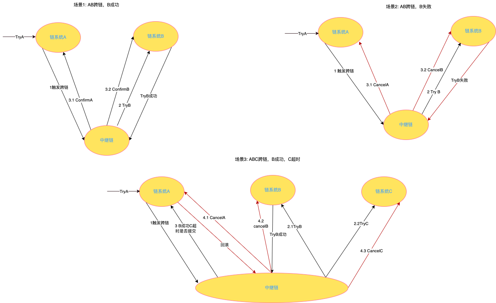
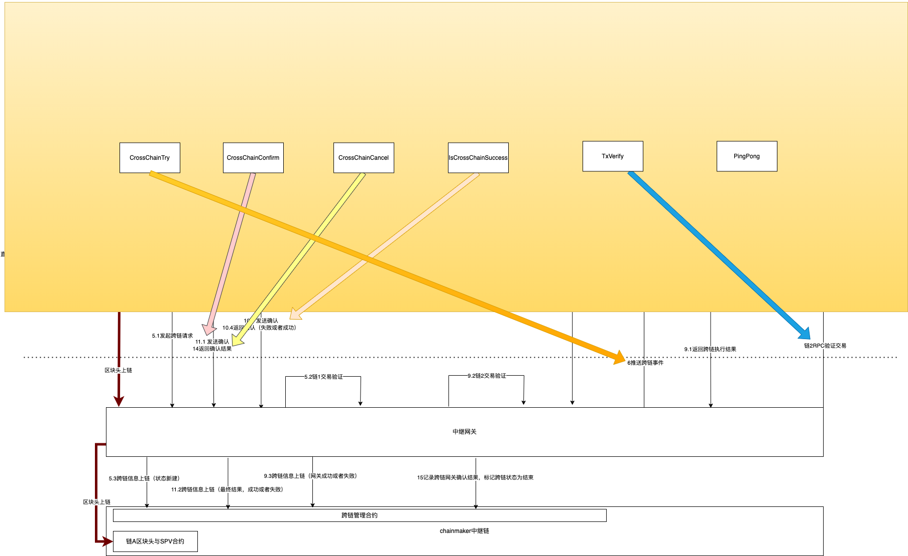
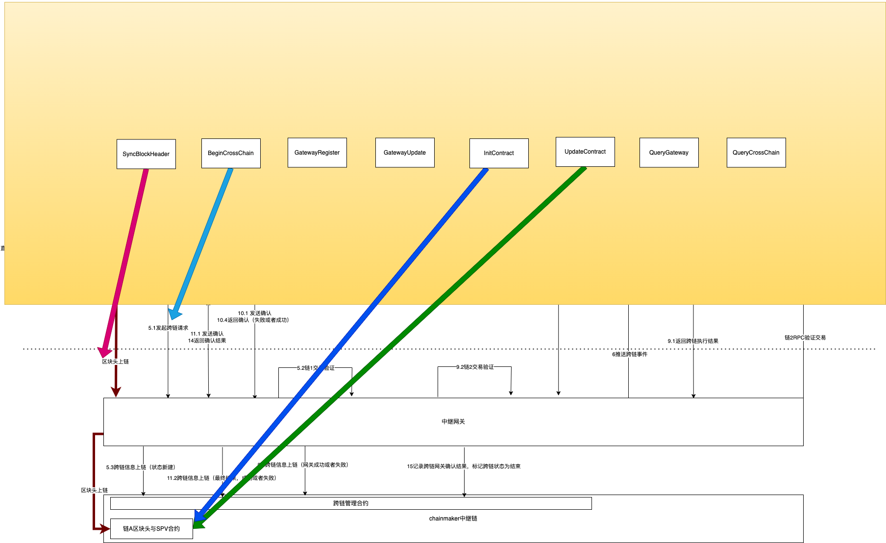
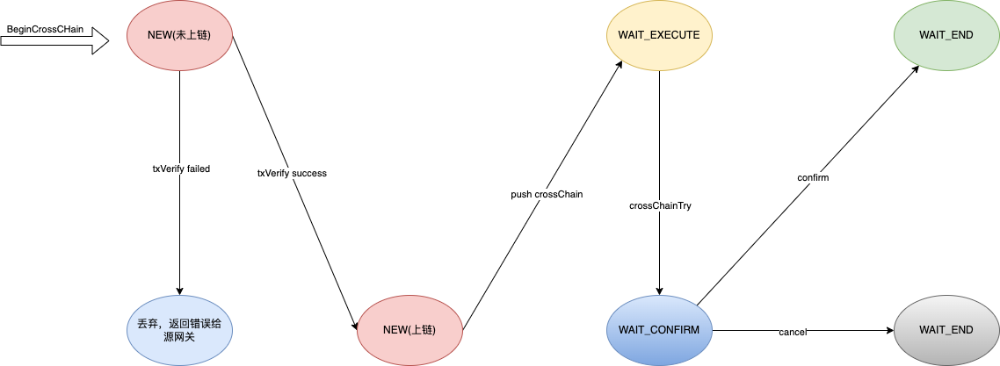
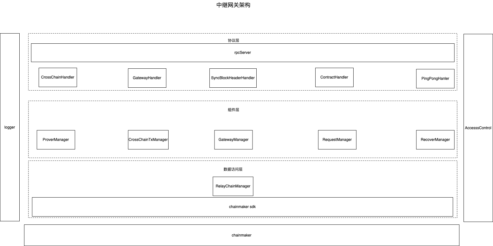
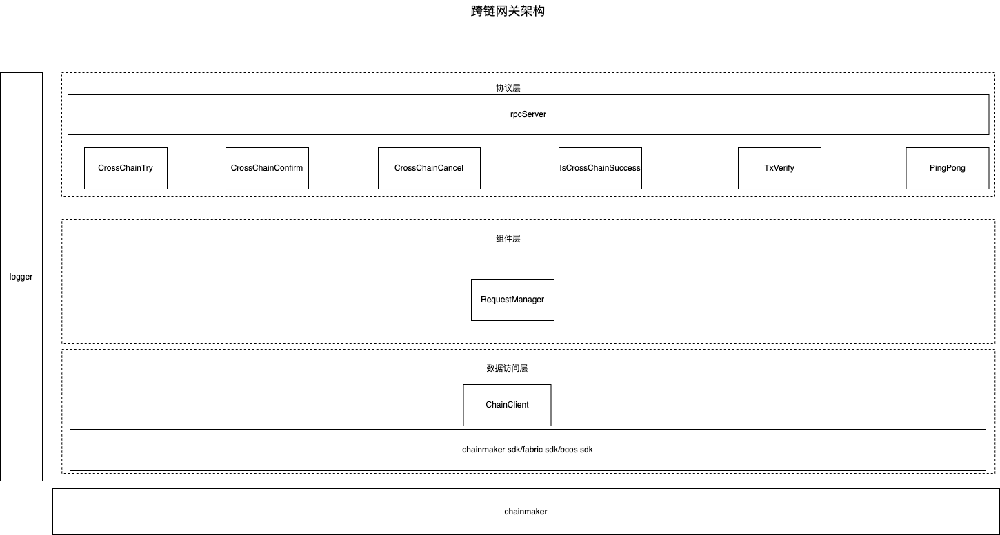

# ChainBridge-TCIP中继跨链方案

> 温馨提示，TCIP中继跨链使用指南请参见：[TCIP中继跨链使用指南](../manage/TCIP中继跨链使用指南)

## 长安链·ChainBridge“链桥”

长安链正式发布全场景技术平台——ChainBridge“链桥”。该平台支持所有异构、同构的区块链完成协作，满足跨领域、跨地域、跨行业、跨层级的任意类型区块链之间数据互联互通的需求。这对于破解目前国内区块链各自为“链”带来的孤岛难题，加速聚链成网，织密国家级区块链网络，实现全国数据要素可信、高效流通，具有极为重要的意义。

什么是跨链？简单理解就是两条或多条链之间进行数据交换，以一个简单易懂的案例来说明，假设有两条链，其中一条链是招行（用户A在该银行中有存款），另外一条链是建行（用户B在该银行中有账户），如果用户A想将自己在招行的存款转账给用户B（建行），那么就需要进行跨链操作。

## TCIP中继跨链协议方案设计-概述

TCIP是ChainBridge的跨链协议，全称Trust Chain Interoperability Protocol，将长安链作为中继链，理论上支持所有异构以及同构链之间进行跨链，尽量不侵入用户合约，不侵入用户链。此外不仅仅是链，理论上也支持数据库这种支持事务操作的的系统。

## 概念
### 业务链
业务链是指用户正在使用的链，这个链需要接收来自其他业务链的跨链请求或者需要向其他业务链发起跨链请求。
### 跨链网关
跨链网关是指与业务链交互的网关，它通过监听业务链的合约事件，来判断该事件是否为跨链事件，若满足触发条件则发起跨链交易。
> 跨链网关可以配置多条业务链。
> 当前提供了chainmaker、fabric和bcos三种链的跨链网关实现，用户可以根据自身需求使用，或者根据TCIP协议自行开发其它链或系统的跨链网关。
### 跨链触发器
跨链触发器是一种跨链网关如何处理监听到业务链中的合约事件，如果不满足跨链触发器的判断条件，那么会将此条合约事件丢弃，如果满足了跨链触发器的判断条件，那么跨链网关会根据跨链触发器的配置，构建一条跨链交易。
> 跨链触发器绑定在业务链上，即一条业务链可以有多个跨链触发器，一个跨链触发器只能绑定在一条业务链上。
### 中继链
中继链（relay-chain）又名中继器，是一个第三方链，通过跨链消息传递协议，连接区块链网络中的其它链。
### 中继网关
中继网关顾名思义，它与中继链建立了链接，通过与中继链中的跨链管理合约进行交互，对跨链交易的各个阶段进行调度，并提供交易验证功能。
> 中继网关部署一个，即可满足跨链的功能需求，也可以去中心化部署多个。

## 跨链场景描述

场景一（AB跨链，B成功）：
1. 用户调用链A，执行TryA，触发跨链；
2. 中继链调用链系统B，执行Try B，TryB执行成功，返回给中继链；
3. 中继链分别调用链系统A、链系统B，执行Confirm。

场景二（AB跨链，B失败）：
1. 用户调用链A，执行TryA，触发跨链；
2. 中继链调用链系统B，执行Try B，TryB执行失败，返回给中继链；
3. 中继链分别调用链系统A、链系统B，执行Cancel。

场景三（ABC跨链）：
1. 用户调用链A，执行TryA，触发跨链；
2. 中继链调用链系统B、链系统C，执行Try B、TryC，TryB执行成功，返回给中继链，TryC超时无响应；
3. 中继链询问链系统A，B成功C超市是否需要提交，链系统A要求回滚；
4. 中继链分别调用链系统A、链系统B、链系统C，执行Cancel。

## 详细流程

>注，1-4、7-8、12-13为示例流程，具体由用户根据自身业务实现，除以下流程外，用户还可以在跨链网关构建跨链事件内容，复用链合约本身的事件，也可以从APP向网关直接发起跨链请求，以达到不侵入用户合约的目的。如果支持spv验证，那么需要跨链网关调用中继网关，将区块头上链。

1. APP调用业务合约TryA；
2. 在业务合约中调用跨链事件工具，生成跨链事件；
3. 返回事件内容；
4. 处理事件

    4.1 向APP返回执行结果；

    4.2、触发网关A中的跨链事件监听；
5. 中继网关处理跨链请求

    5.1、跨链网关A向中继网关发起跨链请求；

    5.2、中继网关对跨链网关A发送的交易信息进行验证；支持两种验证模式：一是SPV验证，中继网关将交易内容、SPV验证路径、区块高度等信息发送到SPV合约，验证交易的合法性；二是RPC接口验证，中继网关从中继链的跨链注册信息中找到交易验证的RPC接口，直接访问RPC接口获得交易合法性的结果。

    5.3、将跨链信息上链，状态为新建；
6. 向目标跨链网关B（可以是多个）推送跨链事件；
7. 跨链网关B向目标链B发起调用业务合约TryB；
8. 跨链网关B接收到合约执行的结果；
9. 中继网关处理目标链交易信息

    9.1、跨链网关B向中继网关返回跨链执行结果；

    9.2、中继网关验证跨链网关返回的交易信息，同样可以通过SPV模式或者RPC接口模式进行验证；

    9.3、将目标网关的执行结果上链；
10. 中继网关查询链上的跨链信息，并做出以下不同的行为：

    1>所有跨链结果为成功，Flag=成功

    2>所有跨链结果为失败，Flag=失败

    3>部分跨链结果成功，向源跨链网关A发送跨链结果，由源跨链网关A根据交易执行结果判断此次跨链式是否成功，并向中继网关返回确认结果；并标记Flag
11. 中继网关处理提交或者回滚

    11.1、中继网关根据Flag向跨链网关A和B发送Confirm或者Cancel调用；

    11.2、将跨链最终结果写入中继链
12. 各个跨链网关收到Confirm或者Cancel请求，调用业务合约对应方法；
13. APP监听到跨链完成事件。
14. 各跨链网关将Confirm或者Cancel交易的结果返回给中继网关。
15. 中继网关记录下跨链网关返回的结果到中继链，并标记跨链状态为结束。

## 接口介绍
>此处只展示了部分关键接口，全部接口以及数据结构详情请参看[tcip协议规范](./中继跨链协议.md)

穿过详细流程图中虚线的箭头，即为TCIP跨链协议的内容，其接口描述如下：

#### 跨链网关接口：

    CrossChainTry（必须）: 接收跨链交易的接口；
    CrossChainConfirm（必须）:跨链成功后接收跨链确认的接口；
    CrossChainCancel（必须）：跨链失败后接收交易回滚的接口；
    IsCrossChainSuccess（非必需）：中继网关询问跨链是否成功的接口，如果是一对一跨链，则不需要实现，如果是一对多跨链，该接口必须实现；
    TxVerify（非必需）：交易验证接口，该接口目前只支持restful接口风格的Post调用，主要用于不支持spv验证的区块链进行交易验证；
    PingPong（必须）：心跳检测接口。
#### 中继网关接口

    SyncBlockHeader：区块头同步接口，该接口为spv交易验证方式提供同步区块头的功能，区块头会被保存在对应链的spv合约中；
    BeginCrossChain：跨链网关向中继网关发起跨链请求的接口；
    GatewayRegister：跨链网关注册接口；
    GatewayUpdate：跨链网关信息更新接口；
    InitContract：用于跨链网关安装spv交易验证合约的接口；
    UpdateContract： 用于跨链网关更新spv交易验证合约的接口；
    QueryGateway：用于查询跨链网关信息的接口；
    QueryCrossChain：用于查询跨链交易的接口。
## 跨链交易状态迁移

跨链交易在整个跨链交易生命周期中的状态变化

## 系统架构

中继网关和跨链网关采用了模块化分层设计，主要分为三层：协议层、组件层和数据访问层。

协议层：为跨链网关提供接口调用，为用户提供信息查询；

组件层：提供业务流程调用的各种组件，包括交易证明管理、跨链交易管理、网关管理、请求管理、断电恢复管理；

数据访问层：主要提供中继网关与中继链的交互功能

协议层：为中继网关提供接口调用；

组件层：提供业务流程调用的组件，包括请求管理；

数据访问层：主要提供跨链网关与业务链的交互功能。

## 协议内容

[协议内容](./中继跨链协议.md)