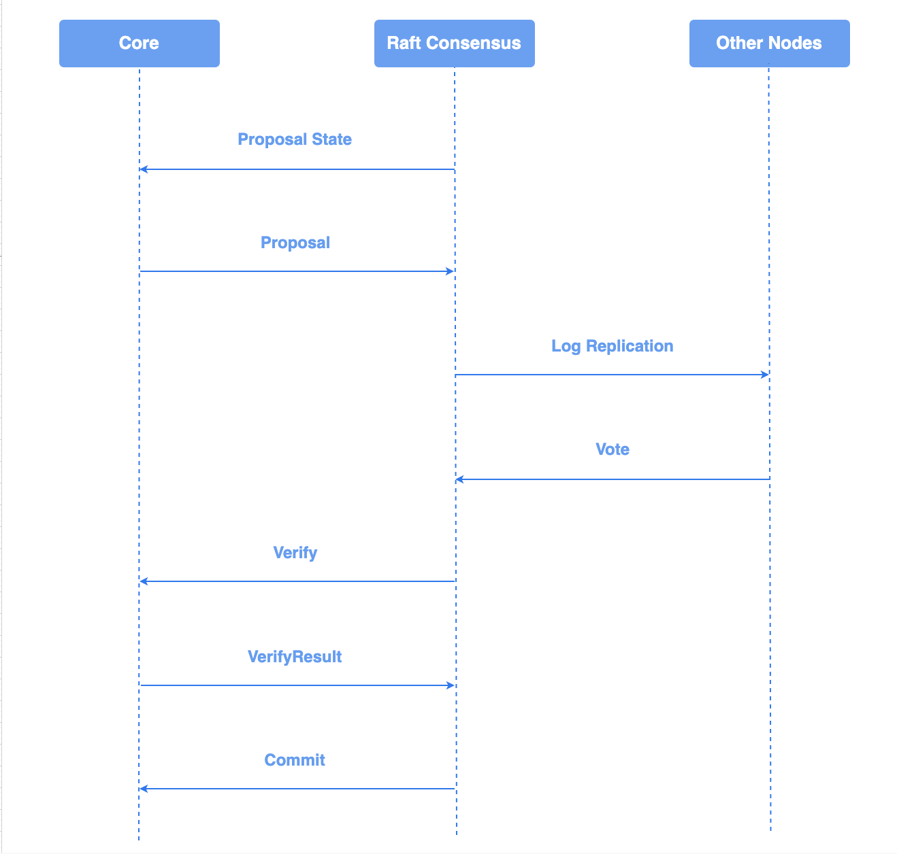
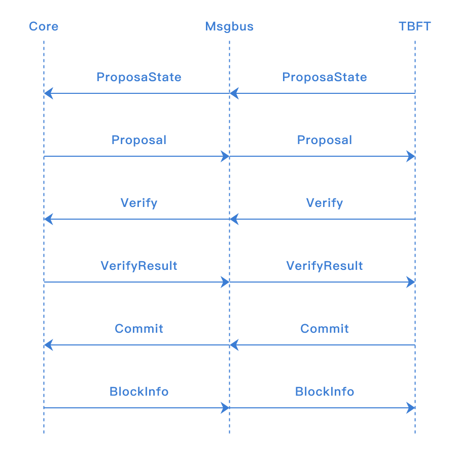
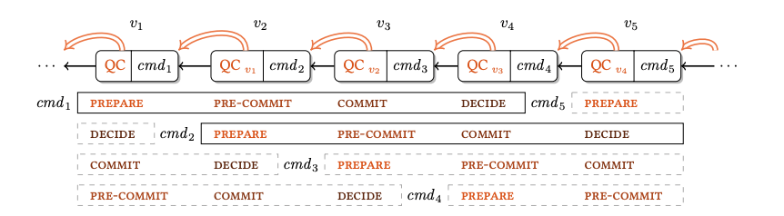
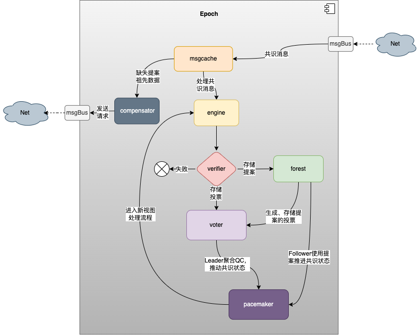
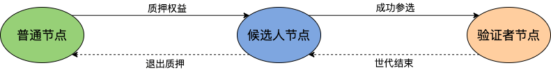

# 共识算法

## 共识算法简介

共识算法是指在分布式场景中，多个节点为了达成相同的数据状态而运行的一种分布式算法。
在分布式场景中，可能出现网络丢包、时钟漂移、节点宕机、节点作恶等等故障情况，共识算法需要能够容忍这些错误，保证多个节点取得相同的数据状态。

根据可容忍的故障类型的不同，可以将共识算法分为两类：

- 容忍宕机错误类算法（crash fault tolerant consensus algorithm），可以容忍网络丢包、时钟漂移、部分节点宕机这种节点为良性的错误。常见算法有 Paxos、Raft。
- 容忍拜占庭错误类算法（byzantine fault tolerant consensus algorithm），可以容忍部分节点任意类型错误，包括节点作恶的情况。常见算法有 PBFT、PoW、PoS等。

根据使用场景的不同，又可将共识算法分为公链共识、联盟链共识两类。

### 公链共识

公链的特点是节点数量多且节点分布分散，主要使用的共识算法有PoW和PoS，这两种共识的优点是可以支持的节点数量多，缺点是TPS较低和交易确认时间长。

### 联盟链共识

联盟链的特点是节点之间网络较为稳定且节点有准入要求，根据需要容忍的错误类型可以选择Raft和PBFT类算法，这类算法的优点是TPS较高且交易可以在毫秒级确认，缺点是支持的节点数量有限，通常不多于100个节点。

### 公链共识和联盟链共识的对比

| 共识       | 支持的节点数量 | TPS   | 交易时延 |
| ---------- | -------------- | ----- | -------- |
| 公有链共识 | 10000+         | 10+   | 10min+   |
| 联盟链共识 | 100+           | 1000+ | 1s+      |

### 长安链中的共识

长安链自v1.1.0开源版本起支持Solo，Raft，TBFT，Maxbft，DPoS 五种共识类型。四种共识对比如下：

| 共识类型 | 故障节点数为n(n>=0)时，网络中最少节点数 | 使用场景                                                     |
| -------- | --------------------------------------- | ------------------------------------------------------------ |
| Solo     | Solo只支持1个节点                       | 主要用于测试及搭建demo                                       |
| Raft     | 2n+1                                    | 联盟链中不需要考虑恶意节点，且需要性能较高的场景             |
| TBFT     | 3n+1                                    | 联盟链中需要考虑恶意节点的场景                               |
| Maxbft   | 3n+1                                    | 联盟链中需要考虑恶意节点的场景                               |
| DPoS     | 3n+1                                    | 公链、联盟链中存在大量参与方，又希望在考虑恶意节点情况下保持较高tps的场景 |

## Solo

### 算法简介

SOLO是单节点无共识投票过程的“共识算法”。

### 算法用途

1. 快速部署单节点运行，降低试用门槛；
2. 供开发人员进行除网络和共识模块的全流程测试。

### 如何使用算法

部署一个长安链节点，将链配置的共识算法进行如下修改，清除数据启动即可：

```sh
#共识配置
consensus:
  # 共识类型(0-SOLO,1-TBFT,3-Maxbft,4-RAFT,10-POW)
  type: 0
```

## Raft

### 算法简介

[Raft算法](https://en.wikipedia.org/wiki/Raft_(algorithm))是目前使用最广泛的非拜占庭容错类共识算法。
Raft算法主要依靠投票机制和日志复制机制来实现节点间的共识。节点通过投票选出一个leader，由leader负责处理所有请求，再将请求以日志的方式复制到其他节点。

### 算法用途

1. 不考虑恶意节点的多节点环境；
2. 需要支持高TPS的环境。

### 共识接口说明

Raft 实现了长安链的ConsensusEngine接口。
Start 方法用来初始化Raft内部状态及启动Raft实例。
Stop 方法用来停止Raft实例。

```go
type ConsensusEngine interface {      
  // Init starts the consensus engine.
  Start() error                       
                                      
  // Stop stops the consensus engine. 
  Stop() error                        
}  
```

### Raft共识与核心引擎交互图

流程图如下：
<br>

### 如何使用算法

Raft共识建议配置节点数为2n+1(n>=0)，将链配置（参见配置模块，链配置章节）的共识算法进行如下修改，清除数据启动即可：

```sh
#共识配置
consensus:
  # 共识类型(0-SOLO,1-TBFT,3-HOTSTUFF,4-RAFT,5-DPoS,10-POW)
  type: 4
  nodes:                                                                                                                                 
    - org_id: "wx-org1.chainmaker.org"                                                                                                   
      node_id:                                                                                                                           
        - "QmcQHCuAXaFkbcsPUj7e37hXXfZ9DdN7bozseo5oX4qiC4"                                                  
    - org_id: "wx-org2.chainmaker.org"                                                                                                   
      node_id:                                                                                                                           
        - "QmeyNRs2DwWjcHTpcVHoUSaDAAif4VQZ2wQDQAUNDP33gH"                                                  
    - org_id: "wx-org3.chainmaker.org"                                                                                                   
      node_id:                                                                                                                           
        - "QmXf6mnQDBR9aHauRmViKzSuZgpumkn7x6rNxw1oqqRr45"                                                  
```

## TBFT

### 算法简述

TBFT 是一种拜占庭容错的共识算法，可以在拜占庭节点数小于总数1/3的情况下，保证系统的安全运行。
TBFT 的每轮共识可以分为5个步骤：

1. NewRound: 共识投票的准备阶段，会初始化共识相关状态；
2. Proposal: 提案阶段，leader节点会打包区块，并广播给follwer节点；
3. Prevote: 预投票阶段，follower节点在收到proposal并验证proposal合法后，广播自己的prevote投票到其他节点；
4. Precommit: 预提交阶段，节点收到 >2/3 针对proposal的prevote投票后，广播自己的precommit投票到其他节点；
5. Commit: 提交阶段，节点收到 >2/3 针对proposal的precommit投票后，提交proposal中的区块到账本。

其中共识投票是指其中的Proposal，Prevote，Precommit三个阶段。 阶段图示如下：
<br>

流程图如下：
<br>

### 与PBFT的区别

1. TBFT基于Tendermint算法，与PBFT的最大区别在于：PBFT有一个固定的leader节点打包交易，当leader节点故障的时候会
使用view-change子协议更换leader；而在TBFT中，leader是轮换的，每提交n个块（可以配置）leader会轮换成下一个节点。
因此，TBFT比PBFT有更好的公平性。
2. TBFT实现了随机性交易的剔除，当一个交易具有随机性执行结果的时候(该交易在不同节点执行结果不一致，比如说该交易调用合约时获取一个时间戳或者产生一个随机值)，TBFT可以通过共识对该交易进行剔除，从而保证链的稳定性和正确性。从节点在收到提案进行验证的时候对这种随机性的交易的读写集进行判断，如果读写集不一致，则会在发起prevote投票的时候，加上对该交易进行剔除的投票。当收集到f+1个对该交易的剔除投票，则会调用核心引擎对该交易进行剔除。

### 与msgbus交互流程



`ProposaState`: TBFT发送给核心引擎本节点在当前高度是否是leader节点，核心引擎判断是否需要打包区块 <br>
`Proposal`: 核心引擎打包区块并发送给TBFT <br>
`Verify`: 当本节点收到主节点发来的区块后，向核心引擎验证区块读写集等信息 <br>
`VerifyResult`: 核心引擎返回给TBFT Verify的结果，当区块合法时，本节点将会投票给区块 <br>
`Commit`: TBFT完成共识后，向核心引擎发送提交区块的信号，核心引擎提交区块到账本 <br>
`BlockInfo`: 核心引擎告知TBFT已提交区块的高度等信息，TBFT进入下一个高度 <br>

### 接口说明

TBFT 实现了长安链的`ConsensusEngine`接口。 <br>
`Start` 方法用来初始化TBFT内部状态及启动TBFT实例。 <br>
`Stop` 方法用来停止TBFT实例。 <br>

```go
type ConsensusEngine interface {      
  // Init starts the consensus engine.
  Start() error                       
                                      
  // Stop stops the consensus engine. 
  Stop() error                        
}    
```

### 数据结构

```protobuf
// TBFTMsgType defines different type message in tbft
enum TBFTMsgType {
  propose   = 0;
  prevote   = 1;
  precommit = 2;
  state     = 3;
}

message TBFTMsg {
  TBFTMsgType type = 1;
  bytes msg        = 2;
}

// Proposal defined a consesensus proposal which can 
// be gossiped to other node and can be serilized 
// for persistent store.
message Proposal {
  string voter                 = 1;
  int64 height                 = 2;
  int32 round                  = 3;
  int32 pol_round              = 4;
  Block block                  = 5;
  EndorsementEntry endorsement = 6;
}

// VoteType represents the type of vote
enum VoteType {
  VotePrevote   = 0;
  VotePrecommit = 1;
}

// Vote represents a tbft vote
message Vote {
  VoteType type = 1;
  string voter  = 2;
  int64 height  = 3;
  int32 round   = 4;
  bytes hash    = 5;
  EndorsementEntry endorsement = 6;
}

// Step represents the step in a round 
enum Step {
  NewHeight     = 0;
  NewRound      = 1;
  Propose       = 2;
  Prevote       = 3;
  PrevoteWait   = 4;
  Precommit     = 5;
  PrecommitWait = 6;
  Commit        = 7;
}
```

###  配置参数

TBFT 可以通过在配置块中的`ext_config`字段配置相关参数：

1. "TBFT_propose_timeout": 提案的超时时间，如`10s`, `1m`；
2. "TBFT_propose_delta_timeout": 每轮提案超时增加的时间，如`10s`, `1m`；
3. "TBFT_blocks_per_proposer": 每个节点连续出块数，如 `"3"`。


## Maxbft

consensus-maxbft模块实现了hotstuff流水线共识，是一种优化后的三阶段BFT算法，当拜占庭节点数小于共识节点数的1/3时，可以保证系统的安全、高效运行、并提供状态的最终性保证；相较于其它BFT算法在如下方面进行了优化：

* 优化投票流程，使用星型网络减少网络通信量至O(n)
* 使用流水线模式简化三阶段共识消息类型：提案消息、投票消息
* 活性(liveness)规则与安全性(safetyRules)规则解耦

hotstuff是一种基于view的共识算法，每个view又称为level，每次进行view切换时，更新下一个view的proposer、触发新提案的生成，具有如下特性；

* 共识算法运转过程中，存在两个全局累加的变量：区块高度、共识view，指定的区块高度可能经历多轮共识才达成一致，当节点生成有效区块或当前共识view超时未达成一致，共识view递增但区块高度不变
* hotstuff流水线共识算法中，当前共识view提案的投票发送下一个共识view的proposer节点，由下一个view的proposer收集投票信息组成QC，包含在下一个view生成的提案中
* hotstuff共识算法为三阶段协议：prepareQC、precommitQC、commitQC
  * 由于每一阶段都是对特定类型的消息收集投票，因此在流水线模式实现中，对投票流程和消息类型进行了优化
  
  	  * prepareQC：当共识节点接收视图为view的提案验证通过后，对view提案进行投票并发送给view+1的Leader，共识view+1的Leader基于view生成新提案时，将视图view投票聚合的QC包含在view+1的提案中，广播给其它共识节点，当其它共识节点收到view+1提案消息验证通过后，则表示网络中（n-f）个共识节点对视图view的提案达成第一轮共识（prepareQC）
	  * precommitQC/lockedQC：视图view提案的precommitQC是由视图view+1提案的prepareQC间接确认的，即view+2的Leader将验证者集合对view+1提案的共识投票作为QC包含在view+2的提案中，其它共识节点收到view+2提案并验证通过时，表示对视图view+1提案的prepareQC阶段达成，对视图view提案的precommitQC阶段达成
	  * commitQC：与precommitQC阶段达成类似，视图view提案的commitQC是通过对视图view+2提案的prepareQC间接达成的；共识节点收到视图view+2的提案、验证通过后进行投票，视图view+3的Leader接收投票聚合为QC、将其包含在view+3生成的提案中，广播给其它共识节点。当其它共识节点收到view+3的提案并验证通过时，表示链上验证集合对视图view提案的commitQC达成，此时会将view的提案提交上链、达成状态最终性
	  * 因此在上述三阶段中，网络中的共识消息类型被简化为2种：提案消息`ProposalData`，投票消息`VoteData`；且将precommitQC、commitQC阶段通过下一个视图的prepareQC阶段间接达成，减少了共识的交互流程
	  
	* 因此hotstuff流水线共识中，节点最少会缓存三个视图(view、view+1、view+2)的待提交提案信息，直至接受视图view+3提案时，将view的提案进行提交、并标识视图view+3的提案为待提交.

Maxbft 当前仅支持共识节点数 >= 4的场景，1）当创世节点数小于4时，节点无法成功启动；2）当链上共识节点数量动态减少时，导致链上节点数小于4的交易，执行失败

**名字解释**

* QC(quorum certificate)：(n−f)个节点对指定proposal消息的签名投票集合
* prepareQC：prepare阶段收集的投票集合
* precommitQC：precommit阶段收集的投票集合
* commitQC：commit阶段收集的投票集合




### 模块设计

共识模块主要由几个组件组成，世代`epoch`、提案消息缓存服务`msgcache`、共识消息处理引擎`engine`、共识消息验证器`verifier`、提案消息存储服务`forest`、投票处理器`voter`、共识活性服务`pacemaker`、wal存储`wal`、节点间共识信息同步服务`compensator`、各模块相互配合实现maxbft流水线共识算法。

* epoch：共识运行过程中由一个个epoch组成，每个epoch包含一组共识节点、在预定的视图范围内由这些共识节点生成提案、投票共识信息、驱动共识运行；每个epoch的最后一个提案初始化下一个epoch的信息，当前epoch最后一个提案被提交上链后触发世代切换
* msgcache：检查网路中接收的提案消息是否缺失祖先提案，缓存缺失祖先提案的消息、并触发请求获取缺失的提案
* engine：处理世代内接收到的共识消息
* verifier：实现了共识消息的提案、投票验证规则
* forest：缓存验证过的提案信息、并维护共识的各种QC状态genericQC、lockedQC、finalQC
* voter：缓存验证过的投票信息、实现提案的投票规则
* pacemaker：共识活性服务，使用接收到的QC、提案、超时信息，推进节点的共识状态
* wal：在共识过程中存储验证过的共识消息
* compensator: 共识内部的同步服务，发送、处理获取缺失提案的请求




### pacemaker 状态推进机制

pacemaker 提供了共识算法的活性，当某次共识view共识未达成一致、或共识消息处理完成后，使用相应的结果推进pacemaker维护的节点共识状态、并设置相应的超时器；因此共识的状态由两种信息推动：

*	共识信息：提案、投票组成的QC信息；当视图V+1的follower接受视图V的提案后，使用提案信息驱动pacemaker进入V+1的共识状态，当视图V+1的Leader接受视图V的提案后，设置超时器、进入投票收集阶段，使用投票聚合的QC信息驱动pacemaker进入V+1的共识状态
* 	超时信息：超时器有等待提案、等待投票两种类型，当节点进入一个新视图后，设置接受提案类型的超时器，当节点作为视图proposal.View+1的Leader时，接受提案proposal后进入投票超时阶段；无论何种超时时间被触发都将驱动pacemaker进入下一个新视图

超时时间在`[MaxBFTRoundTimeoutMill, MaxBFTMaxTimeoutMill]` 范围内波动，通过最新提交的提案视图`finalView`与当前设置超时的视图`currView`确定当前超时类型的时间；算法为：`timeOut = currView - finaView <= 4? MaxBFTRoundTimeoutMill : MaxBFTRoundTimeoutMill + MaxBFTRoundTimeoutIntervalMill * (currView - finalView - 4)`

* 	公示中常量为4的原因：一个区块的提交需要满足three-chain规则（即当前区块后接三个子孙块v+1, v+2, v+3），又因实现中设置超时器时满足three-chain的提案还未被提交（即finalView还未更新），因此正常无超时情况下currView - finalView 最大的间隔应为4

### epoch 切换机制

epoch机制为maxbft共识算法提供了增删共识节点的功能，每个epoch创建时基于当前链配置合约`chainconfig`的共识节点状态初始化该epoch参与共识的节点信息，当前epoch的最后一个提案创建下一个epoch的状态，当最后一个提案被提交后触发epoch切换，同时丢弃当前epoch在该提案后的所有生成的子孙块，由于epoch切换属于耗时的重量型操作，基于性能与功能的trade-off，因此每个epoch预分配一定数量的运行视图，仅在当前epoch的视图运行结束时，才基于最新的链配置生成下一个epoch的信息；epoch运行期间配置交易导致链配置变更不会立即反应在共识的epoch配置中。

###  配置参数

1. MaxBFTRoundTimeoutMill：共识状态初始超时时间；示例："5000"
2. MaxBFTRoundTimeoutIntervalMill：每次超时后下一轮共识增加的delta时间；示例："2000"
3. MaxBFTMaxTimeoutMill：超时时间上限；示例："15000"
4. MaxBftViewNumsPerEpoch：每个世代的运行的视图数量；示例："50"

## DPoS

DPoS(Delegated Proof of Stake)委托权益证明共识算法，类似于公司董事会制度，在DPoS共识制度下，会选出一定数量的节点，来负责生成、验证区块。节点的选举根据节点质押的权益来进行，被选出来的节点代表其他所有的节点进行小范围共识出块。正常生产区块的节点可以获得额外的权益激励，但如果节点不履行生产区块的职责，或者作恶，会被剔除出去，并且依据事先设定的惩罚规则进行惩罚（如扣除质押的部分权益）。

DPoS共识是由DPoS委托质押算法、TBFT拜占庭共识算法组合实现的；DPoS委托质押算法负责节点的权益质押、验证人集合的选举、激励、惩罚这些操作，TBFT共识算法负责对Proposer生成的区块进行验证，保证大多数验证者节点对区块达成一致；

chainmaker【v1.2.0+版本】的DPoS共识实现是基于证书体系构建的，所以新节点准备参与共识过程时，除了DPoS共识自身所需的权益质押，还需要使用证书体系的管理机制（即：系统配置合约的操作），将新节点添加到网络中。

DPoS共识中，设置指定数量区块的区块构成一个世代，每个世代包含一批从候选人中依据质押的权益选举出来的验证者，作为世代的验证者集合，每个验证者轮流作为Proposer进行出块，其它不出块的验证者对Proposer生成的区块进行TBFT共识，保证大多数验证者对该区块达成一致，每个世代的最后一个区块选举下一个世代的验证者集合，并将选举结果写入区块以便其它验证者节点进行校验。因此在区块链上存在三种节点：普通节点、候选人节点、验证人节点；普通节点通过质押一定数量的权益资产，成为候选人节点，每个世代的最后一个区块，依据候选人质押的权益，选举一批节点作为下一个世代的验证者集合。




**Note**

* 【chainmaker v1.2.0】的DPoS共识仅支持levelDB存储引擎
* 【chainmaker v1.2.0】未实现区块激励、作恶惩罚，仅支持共识节点的增删、质押/解质押功能

### 质押规则

普通节点通过质押权益成为候选人，具有如下的规则：

* 成为候选人的节点自身需要至少抵押该`stake.minSelfDelegation`数量的权益
  * `stake.minSelfDelegation`为链启动时配置的参数，候选人最少抵押的权益数量
* 任何人/组织都可以将权益委托质押给某个候选人，候选人质押的权益数量越多，被选为验证者的几率越大
* 所有质押的权益会被一直冻结，直到用户退出质押且在一段时间后`stake.completionUnbondingEpochNum`，所冻结的质押资产才会退还给用户
  * `stake.completionUnbondingEpochNum`为链启动时配置的参数，用户退出质押后，间隔几个世代再将用户的资产退还到相应的账户
* 用户的质押权益会转入stake合约的系统账户地址中，该系统账户地址是由合约名通过算法生成的
  * `stakeAddress = base58(sha256(stakeContractName))`

### 验证人选举规则

每个世代会从候选人中选择一批验证者进行共识，为了在参考候选人质押资金的同时，也可以尽可能维护系统的公平性，设计了如下概率性选择算法，使所有候选人都有成为验证者的可能：

* 候选人的数量为M，选举的验证者集合的数量为N；依据候选人质押资金将其分为两个集合，质押资金topN的候选人为优先级集合，其余为普通集合
* 从优先级集合中选举N/2的节点作为验证者，剩余未被选中节点合并至普通集合，参与剩余的N/2个验证者的选举

### 接口

```go
type DPoS interface {
	CreateDPoSRWSet(preBlkHash []byte, proposedBlock *consensuspb.ProposalBlock) error
	VerifyConsensusArgs(block *common.Block, blockTxRwSet map[string]*common.TxRWSet) error
	GetValidators() ([]string, error)
}

```

* `CreateDPoSRWSet`: 依据节点提案的区块和链上数据，生成DPoS共识的读写集，并将读写集添加至区块中
* `VerifyConsensusArgs`: 验证区块中包含的DPoS读写集是否正确
* `GetValidators`: 获取当前世代的验证者

### 系统合约

DPoS共识使用了两个系统合约来分别处理、存储一些状态；使用ERC20系统合约，存储链上所有用户的资产，并处理权益的转移、增发等逻辑；使用Stake系统合约，存储共识中的质押、退出质押、世代(每个世代包含验证者集合、下一个世代的创建高度)等信息，并处理用户的质押、退出质押、关联NodeID逻辑；

* 注意：关联NodeID操作的原因，NodeID是由节点证书内包含的公钥生成的，用于表示节点在链上的身份，且验证者生成的区块是用该证书对应的私钥进行签名的，因此该私钥需要放置在运行节点的服务器上；为了保证用户质押资金的安全，使用了另一套证书来标示用户的身份，用户的资金存储在该证书内公钥生成的地址上，该证书可以离线存储，以保证资金的安全。
* 因此，节点质押资金成为候选人时，需要先在链上关联用户质押地址对应的NodeID。

### 配置参数

```yml
consensus:
  # 共识类型(0-SOLO,1-TBFT,3-HOTSTUFF,4-RAFT,5-DPoS,10-POW)
  type: 5
```

```YML
  dpos_config:
    #ERC20合约配置
    - key: erc20.total
      value: "1250000000000000000000000"
    - key: erc20.owner
      value: "4WUXfiUpLkx7meaNu8TNS5rNM7YtZk6fkNWXihc54PbM"
    - key: erc20.decimals
      value: "18"
    - key: erc20.account:SYSTEM_CONTRACT_DPOS_STAKE
      value: "1000000000000000000000000"
    - key: erc20.account:4QUXfiUpNmj7meaNu8TNS5rNM7YtZk6fkNWXihc589kN
      value: "250000000000000000000000"
    #Stake合约配置
    - key: stake.minSelfDelegation
      value: "25000000000000000000000"
    - key: stake.epochValidatorNum
      value: "4"
    - key: stake.epochBlockNum
      value: "10"
    - key: stake.completionUnbondingEpochNum
      value: "1"
    - key: stake.candidate:4WUXfiUpLkx7meaNu8TNS5rNM7YtZk6fkNWXihc54PbM
      value: "250000000000000000000000"
    ......
    - key: stake.nodeID:4WUXfiUpLkx7meaNu8TNS5rNM7YtZk6fkNWXihc54PbM
      value: "QmRmTtfm7w5KwVAJALLU23y9TyiCNTUiqVbcErfBqhenrh"
		......
```

* `erc20.total`: ERC20合约发行权益的总量
* `erc20.owner`: ERC20合约的管理员，拥有增发权益的权利
* `erc20.decimals`: ERC20合约中权益的精度
* `erc20.account:<addr>`: ERC20合约中创世块时每个账户所拥有的资金
  * `SYSTEM_CONTRACT_DPOS_STAKE`: 由于stake合约地址是由合约名通过sha256计算后base58编码得到的，为固定值；但base58的值可读、可写不便，容易配置出错，因此，对于stake合约的地址配置为合约名；链启动后可以通过该[命令](../dev/命令行工具.html#chainConfig.dposSystemStakeAddr)查询stake合约地址
  * 其它的账户的初始资金配置，使用用户的地址进行配置
* `stake.minSelfDelegation`: 候选人自身最少质押的权益数量
* `stake.epochValidatorNum`: 每个世代验证者的数量
* `stake.epochBlockNum` : 每个世代的区块数量
* `stake.completionUnbondingEpochNum`：用户退出质押后间隔几个世代将资金退还给用户
* `stake.candidate:<addr>`: 创世块时每个候选人质押的资金
* `stake.nodeID`:创世块时每个候选人关联的NodeID


### 节点管理

DPoS共识允许用户在链创世运行后，通过质押/解质押权益来动态的参与/退出区块链共识；用户通过质押、解质押参与共识的指引步骤见该[章节](../recovery/长安链节点管理.html#consensusNode): 
