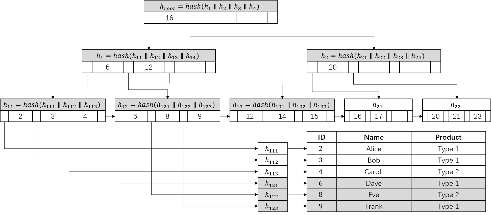
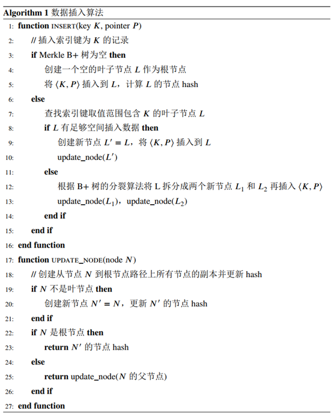
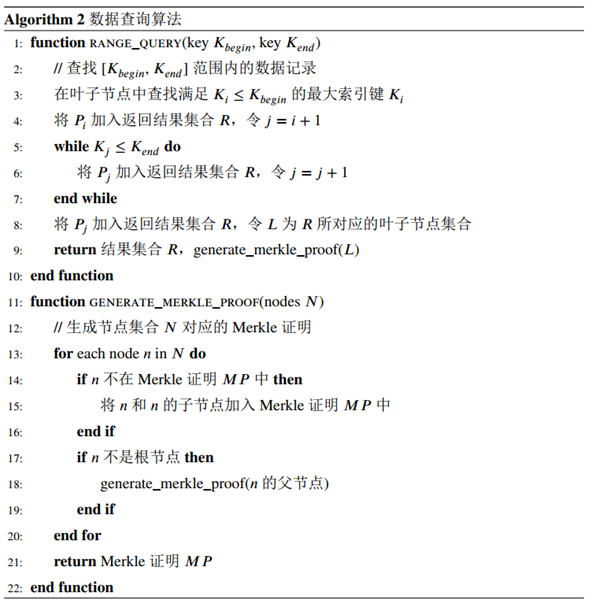
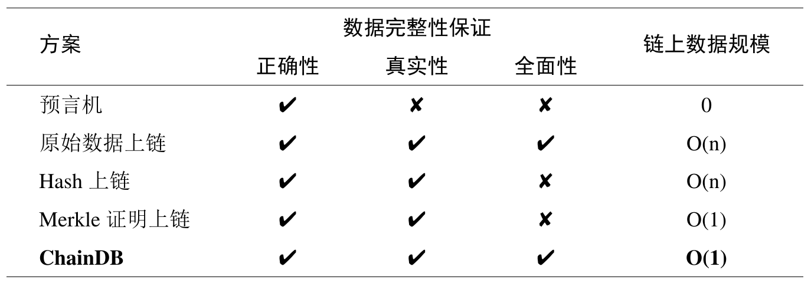

# 可验证数据库

## 概述

链下可验证数据库是长安链可扩展性项目的一部分，主要通过Merkle B+树实现链下SQL数据存储和链上验证。链下可验证数据库是独立的存储引擎，支持MySQL生态工具。

本文档主要介绍链下可验证数据库的设计思路，便于开发者深入了解底层原理。

使用文档请参考[使用文档](../dev/可验证数据库使用文档.md)。

开发文档，暨存储引擎的源码编译和测试文档，请参考[开发文档](../dev/可验证数据库开发文档.md)。

配套的智能合约文档，请参考[合约使用文档](../dev/可验证数据库样例合约使用文档.md)。

项目代码地址：[https://git.chainmaker.org.cn/ibpc/verifiable-database](https://git.chainmaker.org.cn/ibpc/verifiable-database)

## 整体流程

在长安链的基础上，使用链下可验证数据库共分为三个部分，分别是：链上智能合约，链下数据库，链下用户（或程序）。

链下用户（或程序）定期创建数据的快照或副本，将Merkl B+树的根hash上传到智能合约，无需上传原始数据。

当其他用户（例如监管机构）需要查询过往版本的数据时，通过智能合约下发查询请求，链下用户收到请求后上传查询结果及证明到智能合约，通过智能合约进行自动验证。查询及验证流程如下图所示：

## 数据完整性定义

在联盟链应用中，链下存储的数据完整性需要从三个方面验证，分别是正确性（Correctness）、真实性（Authenticity）、全面性（Completeness），定义如下：

- **正确性**：正确性表示数据生产者在查询结果中提供的所有数据记录都满足查询条件要求。因为查询条件和查询结果在区块链上都是可见的，因此正确性很容易验证。
- **真实性**：真实性表示数据生产者在查询结果中提供的所有数据记录都来自于指定版本的真实数据，而不是临时伪造的。一般来说，数据使用者在查询时可以指定查询在某一时刻或某一区块之前的数据，数据生产者需要根据这一条件提供证明。
- **全面性**：全面性表示数据生产者在查询结果中提供了所有满足查询条件的数据记录，没有遗漏或藏匿。

## 链下可验证数据库数据结构

采用如下图所示的Merkle B+树作为索引结构，通过Merkle Proof和Range Proof实现完整性证明。

当数据库中有数据记录插入时，需要对索引进行更新。
除了需要和B+树一样将新的索引键和数据记录指针插入索引树的叶子节点以外，还需要更新Merkle证明相关的节点hash，具体过程如下图所示。
Merkle B+树首先在叶子节点中寻找数据记录应当被插入的位置（1-7行），然后创建从叶子节点到根节点路径上所有节点的副本并插入数据记录（8-16行），最后更新所有新创建节点的节点hash（17-27行）。
由于索引更新时不会修改原有节点的hash，因此能够保留所有节点的历史版本，数据使用者可以根据根节点hash查询任一指定版本下的数据。

由于在存储引擎中所有的数据记录都是按索引键进行排序的，因此范围查询的结果是连续的。
如下图算法所示，当执行查询语句“SELECT * FROM T WHERE ID > 7 AND ID < 9”时，
返回的结果不仅包含范围内的查询结果（5-7行，示例语句对应数据结构图中ID=8的行），还应包括边界数据记录（3-4行和第8行，示例语句对应数据结构图中ID=6和ID=9的行），以及和查询结果相关的Merkle证明（9-22行）。
数据结构图中的深色部分给出了示例查询语句对应的查询结果、范围证明和Merkle证明。

## 数据完整性保证

**数据完整性**能够通过Merkle证明和范围证明保证。
本项目的Merkle证明与Merkle树中的Merkle证明是相同的，范围证明由查询条件边界和Merkle证明共同组成。
由于存储引擎中的数据记录是有序的，因此只要查询结果中包含查询条件边界，范围证明就能够保证所有满足查询条件的记录都已经包含在查询结果中。
因此能够通过遍历数据保证其正确性，通过Merkle证明保证其真实性，通过范围证明保证其全面性。
此外，由于只需要定期将根节点信息发送到区块链，因此链上数据规模很小且与原始数据的大小和数量都无关。

本项目与其他常用方案的对比如下：

