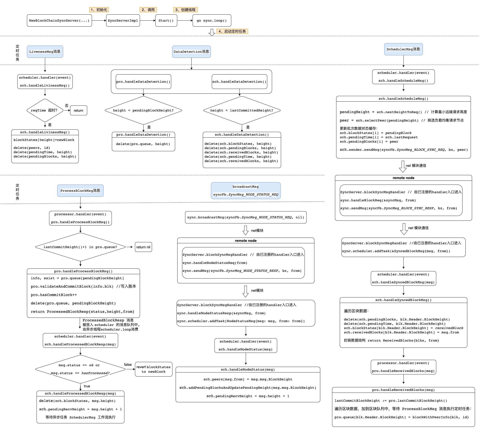

# 同步模块

> 本文档基于 `chainmaker-go v2.0.0` 梳理，Commit 号：`9bc0466ec`

`Sync` 模块负责新增节点、高度落后节点的区块追赶同步工作。`Sync`模块实现消息模块的 `Subscriber` 接口，通过网络模块在节点间传递 `NetMsg_SYNC_BLOCK_MSG` 消息类型的消息，消息包含 `SyncMsg_NODE_STATUS_REQ`：请求节点状态，`SyncMsg_NODE_STATUS_RESP`：响应节点状态，`SyncMsg_BLOCK_SYNC_REQ`：请求区块数据，`SyncMsg_BLOCK_SYNC_RESP`：响应区块数据，四种具体处理逻辑

收到数据后，对于节点高度数据，`Sync` 模块会将其放入缓存，提供需同步区块的节点信息。对于指定高度的区块数据，经过区块数据校验，将其落库到本地存储中，继而更新 `Sync` 模块的状态数据

***

### 模式拆解

#### 普通/快速同步

相比较普通同步而言，快速同步除了同步区块数据，还同步了读写集。因此不需要在虚拟机中执行交易就能获得交易对应的执行结果，减少了执行虚拟机的资源消耗，能够提高同步效率

普通/快速同步的切换方式:

```
node:
    fast_sync:
        enabled: true/false
```

#### 代码流程图:



#### 普通/快速同步流程交互


#### 轻量化同步(Pending)

不需要同步交易的 Payload, 降低网络通信量

***

### 模块解读

* 逻辑控制对象解读
* 控制流程梳理

#### 逻辑控制服务解读

##### 同步模块服务
```
type BlockChainSyncServer struct {
	chainId string

	net             protocol.NetService      // 网络服务，向其他节点获取/发送数据，由外部模块提供实现
	msgBus          msgbus.MessageBus        // 内部消息服务，提供订阅指定 Topic 的功能，由外部模块提供实现
	blockChainStore protocol.BlockchainStore // 存储服务，提供本地区块的读写，由外部模块提供实现
	ledgerCache     protocol.LedgerCache     // 节点本地最高快的缓存
	blockVerifier   protocol.BlockVerifier   // 区块验证服务，校验区块有效性
	blockCommitter  protocol.BlockCommitter  // 区块提交服务，提交验证有效的区块
	
	log   *logger.CMLogger
	conf  *BlockSyncServerConf // Sync 模块基础配置
	start int32                // 服务是否启动的原子数标记位
	close chan bool            // 关闭信号通道

	scheduler *Routine // 调度服务通道，包含处理信号接收，处理入口等逻辑
	processor *Routine // 处理服务通道，处理区块
}
```

主要的方法入口：

```
func (sync *BlockChainSyncServer) Start() error {
	// 检查服务是否启动
	check sync.start

	// 1. 初始化配置
	// 1）初始化任务调度服务入口
	processor := newProcessor()
	scheduler := newScheduler()
	// 2）初始化消息队列
	sync.scheduler = NewRoutine("scheduler", scheduler.handler, scheduler.getServiceState, sync.log)
	sync.processor = NewRoutine("processor", processor.handler, processor.getServiceState, sync.log)

	// 2. 注册监听消息
	// 1）在 msgBus 中注册监听 "msgbus.BlockInfo" 的Topic
	sync.msgBus.Register(msgbus.BlockInfo, sync)
	// 2) 在 Net 服务中注册监听 “netPb.NetMsg_SYNC_BLOCK_MSG” 消息类型
	sync.net.Subscribe(netPb.NetMsg_SYNC_BLOCK_MSG, sync.blockSyncMsgHandler)
	sync.net.ReceiveMsg(netPb.NetMsg_SYNC_BLOCK_MSG, sync.blockSyncMsgHandler)

	// 3. 启动消息队列
	sync.scheduler.begin()
	sync.processor.begin()
	
	// 4. 启动 同步模块的定时任务
	go sync.loop()
}
```

##### 调度服务
```
// scheduler Retrieves block data of specified height from different nodes
type scheduler struct {
	peers             map[string]uint64     // 网络中节点的高度 {"node1": 101, "node2": 102, "node3": 103}
	blockStates       map[uint64]blockState // 指定高度的处理状态 {101: Received, 102: Pending, 103: New}
	pendingTime       map[uint64]time.Time  // 指定高度的处理发起时间 {101: time1, 102: time2, 103: time3}
	pendingBlocks     map[uint64]string     // 指定高度的查询节点ID {101: "node1", 102: "node2", 103: "node3"}
	receivedBlocks    map[uint64]string     // 指定高度已收到区块记录的缓存 {101: "node1", 102: "node2", 103: "node3"}
	lastRequest       time.Time             // 批量请求发起时间
	pendingRecvHeight uint64                // 本地当前最高块 + 1，下一个请求批次的起始高度

	maxPendingBlocks    uint64        // 最大区块处理数量，等同于 blockStates 的长度
	BatchesizeInEachReq uint64        // 最大单次请求批次区块数量
	peerReqTimeout      time.Duration // 网络中区块高度查询超时时间
	reqTimeThreshold    time.Duration // 是否开始同步的检查项，time.Now - lastRequest > reqTimeThreshold == true 开始同步
	
	log    *logger.CMLogger
	sender syncSender // 同步模块对象实例
	ledger protocol.LedgerCache
}
```

##### 处理服务

```
type processor struct {
	queue          map[uint64]blockWithPeerInfo // 收到的区块消息缓存
	hasCommitBlock uint64                       // 本地已经提交的区块高度记录
	
	log         *logger.CMLogger
	ledgerCache protocol.LedgerCache // 本地账本缓存
	verifyAndAddBlock 	// 校验和存储模块接口实例
}
```

##### 消息队列

```
// Routine Provide hosting of the service in goroutine
type Routine struct {
	name       string          
	handle     handleFunc      // 调度逻辑入口
	queryState getServiceState
	log        *logger.CMLogger

	start int32                // 服务启动标记位
	queue *queue.PriorityQueue // 消息队列
	out   chan queue.Item      // 结果队列，转发消息类型，scheduler 的消息由 processor 的 handle 再次处理，processor 由 scheduler 处理
	stop  chan struct{}
}
```

***

#### 控制流程梳理

##### handle 服务注册流程

```
handle 注册流程包含在同步服务的 Start() 函数中，在此单独拿出来：

1）同步模块服务的 handler 注册，收到 NetMsg_SYNC_BLOCK_MSG 信号，开启模块内处理工作流
sync.net.Subscribe(netPb.NetMsg_SYNC_BLOCK_MSG, sync.blockSyncMsgHandler)
sync.net.ReceiveMsg(netPb.NetMsg_SYNC_BLOCK_MSG, sync.blockSyncMsgHandler)

2）消息队列的 handler 注册，处理定时任务，sync.blockSyncMsgHandler，Routine.out 发起的处理流程
sync.scheduler = NewRoutine("scheduler", scheduler.handler, scheduler.getServiceState, sync.log)
sync.processor = NewRoutine("processor", processor.handler, processor.getServiceState, sync.log)
```

##### 同步服务模块 handler

```
同步模块的消息handler 负责处理从 net 模块监听到的 NetMsg_SYNC_BLOCK_MSG 类型的消息
func (sync *BlockChainSyncServer) blockSyncMsgHandler(from string, msg []byte, msgType netPb.NetMsg_MsgType) error {
	// 检查服务是否启动
	check sync.start
	
	// 检查消息类型
	check msgType != netPb.NetMsg_SYNC_BLOCK_MSG
	
	// 解析 msg
	unmarshal msg -> syncMsg

	switch syncMsg.Type {
	case syncPb.SyncMsg_NODE_STATUS_REQ:
		// 返回本地高度
		return sync.handleNodeStatusReq(from)
	case syncPb.SyncMsg_NODE_STATUS_RESP:
		// 在定时器任务队列中添加 NodeStatusMsg 任务，启动处理流程
		return sync.handleNodeStatusResp(&syncMsg, from) 
	case syncPb.SyncMsg_BLOCK_SYNC_REQ:
		// 返回区块数据（封装在 SyncMsg 中，包含相应的业务数据）
		return sync.handleBlockReq(&syncMsg, from) 
	case syncPb.SyncMsg_BLOCK_SYNC_RESP:
		// 在定时器任务队列中添加 SyncedBlockMsg 任务，启动处理流程
		return sync.scheduler.addTask(&SyncedBlockMsg{msg: syncMsg.Payload, from: from}) 
	}
}
```

##### 调度服务 handler

```
func (sch *scheduler) handler(event queue.Item) (queue.Item, error) {
	switch msg := event.(type) {
	case NodeStatusMsg:
		// NodeStatusMsg任务流
		// 更新 peers 中记录的节点ID和高度，更新 blockStates 初始化为 newBlock
		sch.handleNodeStatus(msg)
	case LivenessMsg:
		// pending 状态区块超时检查
		sch.handleLivinessMsg()
	case SchedulerMsg:
		// 发送 SyncMsg_BLOCK_SYNC_REQ 请求到远端
		return sch.handleScheduleMsg()
	case *SyncedBlockMsg:
		// ReceivedBlocks任务流
		// 更新高度对应区块状态为 receivedBlock，封装 ReceivedBlocks 数据提交给 processor 消息队列，由 handleReceivedBlocks 函数处理
		return sch.handleSyncedBlockMsg(msg)
	case ProcessedBlockResp:
		// 处理 processor 消息队列提交的 ProcessedBlockResp 消息，检查本地区块写入结果，更新 pendingRecvHeight
		return sch.handleProcessedBlockResp(msg)
	case DataDetection:
		// 检查 blockStates 数据，删除低于本地最高快的缓存数据
		sch.handleDataDetection()
	}
}
```

##### 处理服务 handler

```
func (pro *processor) handler(event queue.Item) (queue.Item, error) {
	switch msg := event.(type) {
	case *ReceivedBlocks:
		// 将区块数据写入 processor.queue 队列
		pro.handleReceivedBlocks(msg)
	case ProcessBlockMsg:
		// ProcessBlockMsg 工作流
		// 从 processor.queue 中取出 pendingBlockHeight 块高的数据，
		// 调用 validateAndCommitBlock 写入本地账本，封装 ProcessedBlockResp 消息返回
		return pro.handleProcessBlockMsg()
	case DataDetection:
		// 检查 processor.queue，删除低块
		pro.handleDataDetection()
	}
}
```

##### 定时任务的独立线程

```
func (sync *BlockChainSyncServer) loop() {
	var (
		// 定时任务：触发区块处理工作流
		doProcessBlockTk = time.NewTicker(sync.conf.processBlockTick)
		// 定时任务: 触发远端状态查询工作流
		doScheduleTk = time.NewTicker(sync.conf.schedulerTick)
		// 定时任务: 广播高度查询消息
		doNodeStatusTk = time.NewTicker(sync.conf.nodeStatusTick)
		// 定时任务: 触发查询请求超时校验逻辑
		doLivenessTk = time.NewTicker(sync.conf.livenessTick)
		// 定时任务: 触发定时器调度服务中本地区块状态字典的高度检查，舍弃低于本地最高快的 kv 对
		doDataDetect = time.NewTicker(sync.conf.dataDetectionTick)
	)
	
	for {
		select {
		case <-sync.close:
			return

			// Timing task
		case <-doProcessBlockTk.C:
			sync.processor.addTask(ProcessBlockMsg{})
		case <-doScheduleTk.C:
			sync.scheduler.addTask(SchedulerMsg{})
		case <-doLivenessTk.C:
			sync.scheduler.addTask(LivenessMsg{})
		case <-doNodeStatusTk.C:
			sync.broadcastMsg(syncPb.SyncMsg_NODE_STATUS_REQ, nil)
		case <-doDataDetect.C:
			sync.processor.addTask(DataDetection{})
			sync.scheduler.addTask(DataDetection{})

		// 消息中转和消费逻辑
		case resp := <-sync.scheduler.out:
			sync.processor.addTask(resp)
		case resp := <-sync.processor.out:
			sync.scheduler.addTask(resp)
		}
	}
}
```

##### 具体的任务工作流程解读

信号入口分为两块：1）自动任务，2）外部请求(外部请求的最开始也来自于自动任务)

**自动任务**

* ProcessBlockMsg 工作流

```
BlockChainSyncServer.loop()
doProcessBlockTk
sync.processor.addTask(ProcessBlockMsg{})
pro.handleProcessBlockMsg() return ProcessedBlockResp // info, exist = pro.queue[pendingBlockHeight], check and commit block

scheduler.handler()
sch.handleProcessedBlockResp(msg) update pendingRecvHeight
```

* SchedulerMsg 工作流

```
BlockChainSyncServer.loop()
doScheduleTk
sync.scheduler.addTask(SchedulerMsg{})

scheduler.handler()
sch.handleScheduleMsg() 更新 blockStates -> pendingBlock
sch.sender.sendMsg(syncPb.SyncMsg_BLOCK_SYNC_REQ, bz, peer) WithRwset == false

BlockChainSyncServer.blockSyncMsgHandler(...) target node
sync.handleBlockReq(&syncMsg, from)
sync.sendMsg(syncPb.SyncMsg_BLOCK_SYNC_RESP, bz, from)

BlockChainSyncServer.blockSyncMsgHandler(...) source node
sync.scheduler.addTask(&SyncedBlockMsg{msg: syncMsg.Payload, from: from})
sch.handleSyncedBlockMsg(msg) 更新 blockStates -> receivedBlock return ReceivedBlocks{blks, from}

processor.handler()
pro.handleReceivedBlocks(msg)
pro.queue[blk.Header.BlockHeight] = blockWithPeerInfo{blk, from} 等待定时任务处理
```


* SyncMsg\_NODE\_STATUS\_REQ 定时广播工作流

```
BlockChainSyncServer.loop()
sync.broadcastMsg(syncPb.SyncMsg_NODE_STATUS_REQ, nil)

BlockChainSyncServer.blockSyncMsgHandler(...) node in the net
sync.handleNodeStatusReq(from)
sync.sendMsg(syncPb.SyncMsg_NODE_STATUS_RESP, bz, from)

BlockChainSyncServer.blockSyncMsgHandler(...) source node
sync.handleNodeStatusResp(&syncMsg, from)
sync.scheduler.addTask(NodeStatusMsg{msg: msg, from: from})

scheduler.handler()
sch.handleNodeStatus(msg) update local cache 
sch.peers[msg.from] = msg.msg.BlockHeight
sch.addPendingBlocksAndUpdatePendingHeight(msg.msg.BlockHeight) 更新 blockStates -> newBlock，等待进入 SchedulerMsg 工作流
```

***
